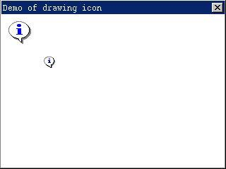
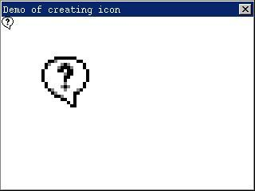
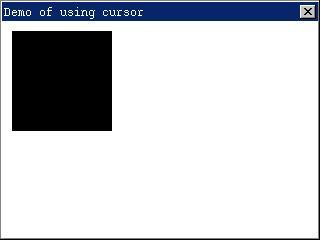
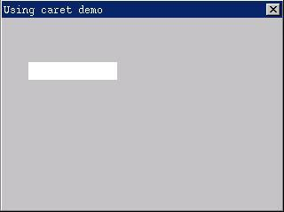

# Icon, Cursor, and Caret


## Icon

An icon is a small image, and is usually used to present an application, or
used in the windows such as warning message box. It consists of a bitmap and a
mask bitmap, and can produce transparent image region. An icon file may include
more than one icon image, and the application can choose an appropriate one to
use according to the size and color bit number of each icon image.

MiniGUI provides the support to load, display, create and destroy of
mono-color, 16-color and 256-color Windows icons.

### Loading and Displaying Icon

The application can use the `LoadIconFromFile` function to load an icon file,
and 
the prototype of the `LoadIconFromFile` function is as follows:

```cpp
HICON GUIAPI LoadIconFromFile (HDC hdc, const char* filename, int which);
```

The argument meanings are as follow:
- hdc: The device context.
- filename: The file name of the icon file
- which: The index value of the selected icon.

`LoadIconFromFile` function loads an icon from a Windows icon file (*`.ico`),
and 
the icon can be mono-color, 16-color or 256-color icon. Some Windows icon files
contain two icons in different sizes. You can tell this function to load which
icon though the argument of which, 0 for the first icon, and 1 for the second
icon. `LoadIconFromFile` function reads in the information of the icon size,
color bit number and bitmap image pixel data, etc., calls `CreateIcon` function
to create an icon object, and then returns an icon handle which presents the
loaded icon object.

You can also load an icon from a memory area by `LoadIconFromMem` function, the
prototype of which is as follows:

```cpp
HICON GUIAPI LoadIconFromMem (HDC hdc, const void* area, int which);
```
The memory area pointed to by area must have the same layout as a Windows `ICO`
file.

After the application has loaded the icon object, you can call `DrawIcon`
function to draw an icon in the specified position. `DrawIcon` function draws 
an 
icon object in a rectangle region. The prototype of `DrawIcon` function is as
follows:

```cpp
void GUIAPI DrawIcon (HDC hdc, int x, int y, int w, int h, HICON hicon);
```

The argument meanings are as follow:
- hdc
The device context.
- x, y
The x and y coordinates of the upper-left corner of the rectangle.
- w, h
The width and height of the rectangle, respectively
- hicon
The handle of the icon object.

The code in List 1 illustrates how to load an icon from an icon file, and then
draw an icon in the client area of the window. The complete code of this
program can be referred to program drawicon.c in sample program package
`mg-samples` for this guide.

__List 1__ Loading and drawing an icon

```cpp
#include <minigui/common.h>
#include <minigui/minigui.h>
#include <minigui/gdi.h>
#include <minigui/window.h>
#include <minigui/control.h>

static int DrawiconWinProc(HWND hWnd, int message, WPARAM wParam, LPARAM lParam)
{
    static HICON myicon_small, myicon_large;
    HDC hdc;

    switch (message) {
    case MSG_CREATE:
        /* call LoadIconFromFile function to load two icons with different size 
         * from myicon.ico file.
         */
        myicon_small = LoadIconFromFile(HDC_SCREEN, "myicon.ico", 0);
        if (myicon_small == 0)
            fprintf (stderr, "Load icon file failure!");
        myicon_large = LoadIconFromFile(HDC_SCREEN, "myicon.ico", 1);
        if (myicon_large == 0)
            fprintf (stderr, "Load icon file failure!");
        break;

    case MSG_PAINT:
        /* display two icons in diffent positions of the window */
        hdc = BeginPaint(hWnd);
        if (myicon_small = 0)
            DrawIcon(hdc, 10, 10, 0, 0, myicon_small);
        if (myicon_large = 0)
            DrawIcon(hdc, 60, 60, 0, 0, myicon_large);
        EndPaint(hWnd, hdc);
        return 0;

    case MSG_CLOSE:
        /* destroys the icon and the main window itself */
        DestroyIcon(myicon_small);
        DestroyIcon(myicon_large);
        DestroyMainWindow (hWnd);
        PostQuitMessage (hWnd);
        return 0;
    }

    return DefaultMainWinProc(hWnd, message, wParam, lParam);
}

/* the code below for creating main window are omitted */
```

The output of the program is as shown in Figure 1.



__Figure 1__ Drawing icon

The program described above loads two 16-color icons of 32x32 pixels and 16x16
pixels, respectively. The icon with number 0 is the big icon with 32x32 pixels,
and is saved in the icon object `myicon_large;` and the icon with number 1 is
the 
small one with 16x16 pixels, and is saved in the icon object `myicon_small.` 
The 
program uses `DrawIcon` function to draw these two icons in the client area of
the window when handling `MSG_PAINT` message. Note that w and h arguments 
passed 
to `DrawIcon` function are both zero when calling it, and in this case 
`DrawIcon` 
function will draw the icon according to its original size without scaling.

### Destroying Icon

The application should destroy an icon when the application does not need it
any more. The program above destroys the two icons previously loaded using
`LoadIconFromFile` function by calling `DestroyIcon` function when it is going
to 
quit (when handling `MSG_CLOSE` message). `DestroyIcon` function destroys the
icon 
handle, and releases the memory it used. This function’s prototype is as
follows:

```cpp
BOOL GUIAPI DestroyIcon(HICON hicon);
```

`DestroyIcon` function has only one parameter hicon, which specify the icon
object to be destroyed. The icon loaded by `LoadIconFromFile` function needs to
be destroyed by `DestroyIcon` function. We will see that `DestroyIcon` can also
destroy the icon created dynamically by the application using `CreateIcon`
function.

### Creating Icon

Besides loading an icon from an icon file, the application can also use
`CreateIcon` function to create an icon dynamically at run time. The icon
created 
by this function also needs to be destroyed by calling `DestroyIcon` function.
The prototype of `CreateIcon` function is as follows:

```cpp
MG_EXPORT HICON GUIAPI CreateIconEx (HDC hdc, int w, int h,
                const BYTE* AndBits, const BYTE* XorBits, int colornum,
                const RGB* pal);


#define CreateIcon(hdc, w, h, AndBits, XorBits, colornum) \
        CreateIconEx(hdc, w, h, AndBits, XorBits, colornum, NULL)
```

The argument meanings are as follow:

```cpp
hdc: The device context.
w, h: The width and height of the icon, respectively.
pAndBits: The pointer to the AND bits of the icon.
pXorBits: The pointer to the XOR bits of the icon.
colornum: The bit-per-pixel of XOR bits.
```
`CreateIcon` creates an icon according to the specified data such as icon size,
color and the bit-mask bitmap image. The icon width and height specified by
arguments of w and h respectively must be sizes supported by the system, for
example 16x16 pixels or 32x32 pixels. `PAndBits` points to a byte array, which
comprises the image data of the `AND` bit-mask bitmap of the icon, and the 
`AND` 
bit-mask bitmap should be mono-color. `PXorBits` points to a byte array, which
comprises the image data of the `XOR` bit-mask bitmap of the icon, and the 
`XOR` 
bit-mask bitmap can be a mono-color or colorful. MiniGUI currently supports
mono-color icon, 16-color icon and 256-color icon. Colornum specifies the
number of color bits of the icon, i.e., the number of the color bits of the 
`XOR` 
bit-mask bitmap. For mono-color icon, it should be 1, for 16-color icon, it
should be 4, for 256-color icon, it should be 8.

The code in List 2 describes how to use `CreateIcon` function to create a
user-defined icon during runtime. The complete code of this program is
available in program createicon.c in the example program package mg-samples.

__List 2__ Creating an icon

```cpp
#include <minigui/common.h>
#include <minigui/minigui.h>
#include <minigui/gdi.h>
#include <minigui/window.h>
#include <minigui/control.h>

/* define the AND mask data and XOR mask data of the icon */
static BYTE ANDmaskIcon[] = {
    0xff, 0x9f, 0x00, 0x00, 
    0xff, 0x1f, 0x00, 0x00, 
    0xfc, 0x1f, 0x00, 0x00, 
    0xf0, 0x1f, 0x00, 0x00, 
    0xe0, 0x0f, 0x00, 0x00, 
    0xc0, 0x07, 0x00, 0x00, 
    0x80, 0x03, 0x00, 0x00, 
    0x80, 0x03, 0x00, 0x00, 
    0x00, 0x01, 0x00, 0x00, 
    0x00, 0x01, 0x00, 0x00, 
    0x00, 0x01, 0x00, 0x00, 
    0x00, 0x01, 0x00, 0x00, 
    0x80, 0x03, 0x00, 0x00, 
    0x80, 0x03, 0x00, 0x00, 
    0xc0, 0x07, 0x00, 0x00, 
    0xf0, 0x1f, 0x00, 0x00
};

static BYTE XORmaskIcon[] = {
    0x00, 0x00, 0x00, 0x00, 0x00, 0x00, 0x00, 0x00, 
    0x00, 0x00, 0x00, 0x00, 0x0f, 0x00, 0x00, 0x00, 
    0x00, 0x00, 0x00, 0x00, 0xff, 0x00, 0x00, 0x00, 
    0x00, 0x00, 0x00, 0x8f, 0xff, 0x00, 0x00, 0x00, 
    0x00, 0x00, 0x8f, 0xff, 0xff, 0x00, 0x00, 0x00, 
    0x00, 0x08, 0xff, 0xf8, 0xff, 0xf8, 0x00, 0x00, 
    0x00, 0xff, 0xff, 0x80, 0x8f, 0xff, 0xf0, 0x00, 
    0x00, 0xff, 0xff, 0xf8, 0xff, 0xff, 0xf0, 0x00, 
    0x0f, 0xff, 0xff, 0xf0, 0xff, 0xff, 0xff, 0x00, 
    0x0f, 0xff, 0xff, 0xf0, 0x0f, 0xff, 0xff, 0x00, 
    0x0f, 0xff, 0xff, 0xf8, 0x00, 0xff, 0xff, 0x00, 
    0x0f, 0xff, 0xf0, 0x0f, 0x00, 0xff, 0xff, 0x00, 
    0x00, 0xff, 0xf8, 0x00, 0x08, 0xff, 0xf0, 0x00, 
    0x00, 0x8f, 0xff, 0x80, 0x8f, 0xff, 0xf0, 0x00, 
    0x00, 0x00, 0x8f, 0xff, 0xff, 0xf0, 0x00, 0x00, 
    0x00, 0x00, 0x00, 0x00, 0x00, 0x00, 0x00, 0x00, 
    0xff, 0x9f, 0x00, 0x00, 0xff, 0x1f, 0x00, 0x00, 
    0xfc, 0x1f, 0x00, 0x00, 0xf0, 0x1f, 0x00, 0x00, 
    0xe0, 0x0f, 0x00, 0x00, 0xc0, 0x07, 0x00, 0x00, 
    0x80, 0x03, 0x00, 0x00, 0x80, 0x03, 0x00, 0x00, 
    0x00, 0x01, 0x00, 0x00, 0x00, 0x01, 0x00, 0x00, 
    0x00, 0x01, 0x00, 0x00, 0x00, 0x01, 0x00, 0x00, 
    0x80, 0x03, 0x00, 0x00, 0x80, 0x03, 0x00, 0x00, 
    0xc0, 0x07, 0x00, 0x00, 0xf0, 0x1f, 0x00, 0x00, 
    0x26, 0x00, 0x00, 0x00, 0xf4, 0xd9, 0x04, 0x08, 
    0xa8, 0xf8, 0xff, 0xbf, 0xc0, 0xf7, 0xff, 0xbf, 
    0x20, 0x00, 0x00, 0x00, 0x10, 0x00, 0x00, 0x00, 
    0xc0, 0x00, 0x00, 0x00, 0x0e, 0x03, 0x00, 0x00, 
    0x28, 0x01, 0x00, 0x00, 0x04, 0x00, 0x00, 0x00, 
    0x10, 0x00, 0x00, 0x00, 0x10, 0x00, 0x00, 0x00, 
    0xf0, 0x10, 0x04, 0x00, 0x70, 0xe1, 0x04, 0x08, 
    0xd8, 0xf8, 0xff, 0xbf, 0x41, 0x90, 0x04, 0x08
};

static int CreateiconWinProc(HWND hWnd, int message, WPARAM wParam, LPARAM lParam)
{
    static HICON new_icon;
    HDC hdc;

    switch (message) {
    case MSG_CREATE:
        /* create an icon using the user-difined data */
        new_icon = CreateIcon(HDC_SCREEN, 16, 16, ANDmaskIcon, XORmaskIcon, 4);
        break;

        case MSG_PAINT:
        hdc = BeginPaint(hWnd);
        if (new_icon = 0) {
           /* display the icon with its actual size */
            DrawIcon(hdc, 0, 0, 0, 0, new_icon);
           /* display the scaled icon */
            DrawIcon(hdc, 50, 50, 64, 64, new_icon);
        }
        EndPaint(hWnd, hdc);
        return 0;

        case MSG_CLOSE:
            /* destroy the icon and the main window */
            DestroyIcon(new_icon);
            DestroyMainWindow (hWnd);
            PostQuitMessage (hWnd);
        return 0;
    }

    return DefaultMainWinProc(hWnd, message, wParam, lParam);
}

/* the code below for creating main window are omitted */
```
The output of the program is as shown in Figure 2.


__Figure 2__ Creating and drawing icon

The code in List 2 creates a user-defined icon `new_icon` by calling 
`CreateIcon` 
according to the data in the `ANDmaskIcon` and `XORmaskIcon` bit-mask byte
array. 
The size of the icon is 16x16 pixels, and the number of color bits is 4. And
then the program draws the created “interrogation” icon in the client area of
the window with its original size and scaled size. Finally, the program calls
`DestroyIcon` function to destroy the user-defined icon created by `CreateIcon`
function when handling `MSG_CLOSE` message.

### Using System Icons

Each renderer section in `MiniGUI.cfg`, the configuration file of `MinGUI`,
defines 
the icons which are used and provided by the system. The icons of Classic
renderer are shown as follow:

```cpp
[classic]
# Note that max number defined in source code is 5.
iconnumber=5
icon0=form.ico
icon1=failed.ico
icon2=help.ico
icon3=warning.ico
icon4=excalmatory.ico
```
__NOTE__ The maximum number of the icon files the system uses is 5, which is
defined in the source code of MiniGUI. Therefore, if you modify the iconnumber
item in the configuration file, its value should be smaller than or equal to 5,
and the icons with number larger than 5 will be ignored.</b>

There are four renderers are defined in `MiniGUI.cfg`, the configuration file 
of 
MiniGUI, classic, flat, skin and fashion (fashion renderer must be together
with mgplus component). Each renderer defines the specified system icons.
MiniGUI loads all the system icons from icon files to memory according to the
setting of the iconinfo section in the configuration file when initializing
renderer. The application can get the built-in system icons through
`GetLargeSystemIcon` function and `GetSmallSystemIcon` function. The prototypes
of 
these two functions are as follow:

```cpp
HICON GUIAPI GetLargeSystemIcon (int id);
HICON GUIAPI GetSmallSystemIcon (int id);
```

`GetLargeSystemIcon` is used to get a large system icon with 32x32 pixels, and
`GetSmallSystemIcon` is used to get a small system icon with 16x16 pixels. 
These 
two functions return the handle of the built-in system icon object. The
obtained icon is one of the seven system icons, which is specified by id. Id is
an integer value, and may be one of the following values:

```cpp
IDI_APPLICATION                        Application icon
IDI_STOP / IDI_HAND                    Stoping icon
IDI_QUESTION                            Question icon
IDI_EXCLAMATION                        Exclamation icon
IDI_INFORMATION / IDI_ASTERISK            Information icon
```

These identifiers are defined in `minigui/window.h` as follow:

```cpp
#define IDI_APPLICATION         0
#define IDI_HAND                1
#define IDI_STOP                IDI_HAND
#define IDI_QUESTION            2
#define IDI_EXCLAMATION         3
#define IDI_ASTERISK            4
#define IDI_INFORMATION         IDI_ASTERISK
```
It can be seen that they present the five icon files with sequence number from
0 to 4 in `MiniGUI.cfg`. The icon files with index numbers 5 and 6 are used by
`TREEVIEW` control.

The icons obtained by `GetLargSystemIcon` and `GetSamllSystemIcon` functions 
are 
system-predefined icons, which are system sharing resources and do not need to
be destroyed by the application.

In addition, the application may also use `LoadSystemIcon` function to load the
required icon directly from the icon file defined in `MiniGUI.cfg` 
configuration 
file:

```cpp
HICON GUIAPI LoadSystemIcon (const char* szItemName, int which);
```
Here `szItemName` argument specifies the symbol name of the icon file defined 
in 
the iconinfo section of `MiniGUI.cfg`, for example, icon0 presents form.ico 
icon 
file. The argument of which specifies which icon is to be loaded. This function
returns the handle to the obtained icon object.

Actually, `LoadSystemIcon` loads an icon by calling `LoadIconFromFile`.
Apparently, 
the icon created by `LoadSystemIcon` must be destroyed using `DestroyIcon`
function 
when it is not be required any more.

## Cursor

The pointing device such as mouse controls a cursor, which is a small bitmap
and its position in the screen. It is used to indicate the position of the
pointing device. When the user moves the mouse, the cursor will move on the
screen accordingly. If the cursor moves into different region or different
window, the system possibly changes the shape of the cursor. A pixel called
hotspot in the cursor indicates the accurate position of the cursor on the
screen. The system uses this point to trace and identify the cursor position.
For example, the hotspot of a arrow cursor is commonly its arrowhead position.
The cursor hotspot is commonly the cursor focus. If a mouse input event occurs,
the system will send the mouse containing the hotspot coordinates to the
window, which the hotspot is located in, or to the window, which captures the
mouse.

MiniGUI provides functions for loading, creating, displaying, destroying, and
moving mono- and 16-color cursors. Currently, MiniGUI does not support
256-color or animation cursor.

### Loading and Creating Cursor

The application may use `LoadCursorFromFile` function to load a cursor form a
Windows cursor file. The prototype of this function is as follows:

```cpp
HCURSOR GUIAPI LoadCursorFromFile (const char* filename);
```
`LoadCursorFromFile` function reads in information of the size of the cursor,
the 
hotspot position, the number of color bits, and the bitmap image data, etc.,
creates an cursor object, and returns a cursor handle presenting this cursor
object.

`LoadCursorFromMem` function loads a cursor from memory:

```cpp
HCURSOR GUIAPI LoadCursorFromMem (const void* area);
```

This function loads a cursor from a specified memory area, the cursor memory
area to which area points should be the same as the layout of the Windows
cursor file.

The application may also create dynamically a cursor by calling `CreateCursor`
function during run time. The prototype of `CreateCursor` function is as
follows: 

```cpp
HCURSOR GUIAPI CreateCursor (int xhotspot, int yhotspot, int w, int h,
                     const BYTE* pANDBits, const BYTE* pXORBits, int colornum);
```

The argument meanings are as follow:

```cpp
xhotspot, yhotspot: the horizontal and vertical positions of the cursor hotspot
w, h: the width and height of the cursor
pAndBits: The pointer to the AND bits of the cursor.
pXorBits: The pointer to the XOR bits of the cursor.
colornum: The bit-per-pixel of XOR bits.
```

Similar to the method of creating an icon by `CreateIcon` function, 
`CreateCursor` 
function creates an cursor according to the data of specified cursor size,
color and bit-mask bitmap image in memory. The difference is that the hotspot
position of the cursor to be created must be specified when using 
`CreateCursor` 
function. Xhotspot and yhotspot arguments specify the horizontal and vertical
positions of the hotspot of the created cursor, respectively. The cursor width
and height specified by w and h must be the size supported by the system, and
MiniGUI can only use cursor of 32x32 pixels. Therefore, the value of w and h
arguments can only be 32. `PANDBits` points to a byte array of a `AND` bit-mask
bitmap image data containing a cursor, and `AND` bit-mask bitmap is a 
mono-color 
bitmap. `PXorBits` points to a byte array of a `XOR` bit-mask bitmap image data
containing a cursor, and `XOR` bit-mask bitmap may be either a mono-color 
bitmap 
or a color bitmap. Colornum specifies the number of color bits of the cursor,
or the number of color number of the `XOR` bit-mask bitmap. For a mono-color
cursor, it should be 1, and for 16-color cursor, it should be 4.

### Destroying Cursor

The application should destroy the cursor when not requiring it any more.
`DestroyCursor` function can destroy the cursor created by `LoadCursorFromFile`
and 
`CreateCursor` functions, and release the memory used by the cursor object. The
prototype of this function is as follows:

```cpp
BOOL GUIAPI DestroyCursor (HCURSOR hcsr);
```
The argument hcursor of `DestroyCursor` function specifies the cursor object to
be destroyed.

### Positioning and Displaying Cursor

If the system includes a mouse, then the system will display it automatically,
and update its position on the screen according to the position of mouse and
repaint the cursor. The application can get the current screen position of the
cursor by calling `GetCursorPos` function, and move the cursor to the specified
position on the screen by calling `SetCursorPos` function.

```cpp
void GUIAPI GetCursorPos (POINT* ppt);
void GUIAPI SetCursorPos (int x, int y);
```

The application can get the current cursor handle by calling `GetCurrentCursor`
function, and set the current cursor by calling `SetCursorEx` function. The
prototypes of these two functions are as follow:

```cpp
HCURSOR GUIAPI GetCurrentCursor (void);
HCURSOR GUIAPI SetCursorEx (HCURSOR hcsr, BOOL set_def);
```
`SetCursorEx` function sets the cursor specified by hcsr as the current cursor.
If `set_def` is `TRUE`, `SetCursorEx` will further set this cursor as the
default 
cursor, which is the cursor displayed when moved the mouse to the desktop. This
function returns old cursor handle. `SetCursorEx` has other two simplified
versions: `SetCursor` and `SetDefaultCursor`. `SetCursor` sets the current
cursor and
does not change the default cursor; and `SetDefaultCursor` sets the specified
cursor as the current cursor and the default cursor.

```cpp
#define SetCursor(hcsr) SetCursorEx (hcsr, FALSE);
#define SetDefaultCursor(hcsr) SetCursorEx (hcsr, TRUE);
```

MiniGUI will send `MSG_SETCURSOR` to the window under the cursor when the user
moves the mouse, and the application can change the current cursor when
handling `MSG_SETCURSOR` message. If the window procedure function changes the
cursor when handling this message, it should be returned immediately.

The system displays the class cursor related to the control where the cursor
is. The application can assign a class cursor to the control class when
registering the control class. After registering this control class, each
control of this control class has the same class cursor, i.e., the cursor
displayed by the system is the same specified cursor when the mouse moves onto
these controls. The application can get the current cursor of the specified
window through `GetWindowCursor`, and sets a new window cursor through
`SetWindowCursor`.

```cpp
HCURSOR GUIAPI GetWindowCursor (HWND hWnd);
HCURSOR GUIAPI SetWindowCursor (HWND hWnd, HCURSOR hNewCursor);
```

The code below is from listview.c in the MiniGUI source code, which illustrates
how to assign a cursor handle to `hCursor` member of the `WNDCLASS` structure 
to 
specify the class cursor for a control class.

```cpp
WNDCLASS WndClass;

WndClass.spClassName = CTRL_LISTVIEW;
WndClass.dwStyle = WS_NONE;
WndClass.dwExStyle = WS_EX_NONE;
WndClass.hCursor = GetSystemCursor (0);
WndClass.iBkColor = PIXEL_lightwhite;
WndClass.WinProc = sListViewProc;

return RegisterWindowClass (&WndClass);
```

The class cursor in the code above is the system default cursor gotten by
`GetSystemCursor` function, i.e., an arrow cursor. `GetSystemCursor` (0) and
`GetSystemCursor` (`IDC_ARROW`) are the same.

The application can show or hide the cursor by calling `ShowCursor` function.

```cpp
int GUIAPI ShowCursor (BOOL fShow);
```

`ShowCursor` function hides the cursor when parameter `fShow` is `FALSE`, and
shows 
the cursor when `fShow` is `TRUE`. `ShowCursor` does not change the shape of 
the 
current cursor. This function internally uses a cursor showing counter to
determine whether showing or hiding the cursor. Each calling of `ShowCursor`
function to show the cursor will increase this counter by one, and each calling
of `ShowCursor` function to hide the cursor will decrease this counter by one.
The cursor is visible only when the counter is larger than or equal to 0.

### Clipping Cursor

The application can use `ClipCursor` function to clip the cursor within a
certain 
rectangle area, which is usually used to correspond to an event in a certain
clipping rectangle. The prototype of this function is as follows:

```cpp
void GUIAPI ClipCursor (const RECT* prc);
```

The specified clipping rectangle is pointed by parameter prc. If prc is `NULL`,
`ClipCursor` will disable cursor clipping. When `ClipCursor` function clips the
cursor in a certain rectangular area on the screen, it moves the cursor to the
center of the rectangular area.

`GetClipCursor` function gets the current cursor clipping rectangle, and can be
used to save the original clipping rectangle before setting a new clipping
rectangle and use it to restore the original area when required. The prototype
of this function is as follows:

```cpp
void GUIAPI GetClipCursor (RECT* prc);
```

### Using System Cursors

The cursorinfo section in the configuration file of MiniGUI, `MiniGUI.cfg`,
defines all the cursors provide by the system, as shown below:

```cpp
[cursorinfo]
# Edit following line to specify cursor files path
cursorpath=/usr/local/lib/minigui/res/cursor/
cursornumber=23
cursor0=d_arrow.cur
cursor1=d_beam.cur
cursor2=d_pencil.cur
cursor3=d_cross.cur
cursor4=d_move.cur
cursor5=d_sizenesw.cur
cursor6=d_sizens.cur
cursor7=d_sizenwse.cur
cursor8=d_sizewe.cur
cursor9=d_uparrow.cur
cursor10=d_none.cur
cursor11=d_help.cur
cursor12=d_busy.cur
cursor13=d_wait.cur
cursor14=g_rarrow.cur
cursor15=g_col.cur
cursor16=g_row.cur
cursor17=g_drag.cur
cursor18=g_nodrop.cur
cursor19=h_point.cur
cursor20=h_select.cur
cursor21=ho_split.cur
cursor22=ve_split.cur
```
The maximum number of the cursors used by the system defined in MiniGUI is
(MAX_SYSCURSORINDEX + 1). `MAX_SYSCURSORINDEX` is the maximum system cursor
index 
value, defined as 22; therefore the maximum cursor number predefined by the
system is 23.

MiniGUI loads all the system cursors from the specified cursor files to memory
according to the setting of the cursorinfo section in the configuration file
when initializing the system. The application can get the built-in system
cursor through `GetSystemCursor` function. The prototype of this function is as
follows:

```cpp
HCURSOR GUIAPI GetSystemCursor (int csrid);
```

`GetSystemCursor` function returns the handle to the cursor object in memory.
The 
obtained cursor is one of the possible 23 system system-predefined cursors, and
is specified by identifier csrid. Parameter csrid is an integer value, and may
be one of the following values:

```cpp
IDC_ARROW             System default arrow cursor
IDC_IBEAM             ‘I’ shaped cursor, indicating an input filed
IDC_PENCIL            Pencil-shape cursor
IDC_CROSS             Cross cursor
IDC_MOVE              Moving cursor
IDC_SIZENWSE          Sizing cursor, along north-west and south-east
IDC_SIZENESW          Sizing cursor, along north-east and south-west
IDC_SIZEWE            Sizing cursor, along west and east
IDC_SIZENS            Sizing cursor, along north and south
IDC_UPARROW           Up arrow cursor
IDC_NONE              None cursor
IDC_HELP              Arrow with question
IDC_BUSY              Busy cursor
IDC_WAIT              Wait cursor
IDC_RARROW            Right arrow cursor
IDC_COLOMN            Cursor indicates column
IDC_ROW               Cursor indicates row
IDC_DRAG              Draging cursor
IDC_NODROP            No droping cursor, used in dragging operation
IDC_HAND_POINT        Hand point cursor
IDC_HAND_SELECT       Hand selection cursor
IDC_SPLIT_HORZ        Horizontal splitting cursor
IDC_SPLIT_VERT        Vertical splitting cursor
```
The definitions of these cursor index values are as follow:

```cpp
/* System cursor index. */
#define IDC_ARROW       0
#define IDC_IBEAM       1
#define IDC_PENCIL      2
#define IDC_CROSS       3
#define IDC_MOVE        4
#define IDC_SIZENWSE    5
#define IDC_SIZENESW    6
#define IDC_SIZEWE      7
#define IDC_SIZENS      8
#define IDC_UPARROW     9
#define IDC_NONE        10
#define IDC_HELP        11
#define IDC_BUSY        12
#define IDC_WAIT        13
#define IDC_RARROW      14
#define IDC_COLOMN      15
#define IDC_ROW         16
#define IDC_DRAG        17
#define IDC_NODROP      18
#define IDC_HAND_POINT  19
#define IDC_HAND_SELECT 20
#define IDC_SPLIT_HORZ  21
#define IDC_SPLIT_VERT  22
```
They present the 23 system-predefined cursors with sequence number from 0 to 22
in MiniGUI, respectively.

The cursor gotten through `GetSystemCursor` function is the system-predefined
cursor, and belongs to the system sharing resource; therefore it needs not to
be destroyed by the application.

### Sample Program

The code in List 3 illustrates the use of the cursor in MiniGUI. The complete
code of this program is available in program cursordemo.c in the sample program
package mg-samples.


List 3 Using cursor
```cpp
#include <minigui/common.h>
#include <minigui/minigui.h>
#include <minigui/gdi.h>
#include <minigui/window.h>
#include <minigui/control.h>

#define IDC_TRAP    100

static HWND hTrapWin, hMainWnd;
static RECT rcMain, rc;

/* window procedure of “trap” control class */
static int TrapwindowProc(HWND hWnd, int message, WPARAM wParam, LPARAM lParam)
{
    static BOOL bTrapped = FALSE;

    switch (message) {
    case MSG_MOUSEMOVE:
        /* further clipping in the range of the control
         * when the mouse enters the range of this control 
         */
        if (!bTrapped) {
            GetWindowRect(hWnd, &rc);
            ClientToScreen(hMainWnd, &rc.left, &rc.top);
            ClientToScreen(hMainWnd, &rc.right, &rc.bottom);
            ClipCursor(&rc);
            bTrapped = TRUE;
        }
        break;

    case MSG_DESTROY:
        return 0;
    }

    return DefaultControlProc(hWnd, message, wParam, lParam);
}

/* register “trap” control class */
BOOL RegisterTrapwindow (void)
{
    WNDCLASS WndClass;

    WndClass.spClassName = "trap";
    WndClass.dwStyle     = 0;
    WndClass.dwExStyle   = 0;
    WndClass.hCursor     = GetSystemCursor(IDC_HAND_POINT);
    WndClass.iBkColor    = PIXEL_black;
    WndClass.WinProc     = TrapwindowProc;

    return RegisterWindowClass (&WndClass);
}

static int CursordemoWinProc(HWND hWnd, int message, WPARAM wParam, LPARAM lParam)
{
    switch (message) {
    case MSG_CREATE:
        /* register “trap” control class */
        RegisterTrapwindow();
        /* create an instance of “trap” control class */
        hTrapWin = CreateWindow("trap", "", WS_VISIBLE | WS_CHILD, IDC_TRAP, 
                10, 10, 100, 100, hWnd, 0);
        break;

    case MSG_LBUTTONDOWN:
        /* Clip the cursor to the main window when the user click the left mouse button. */
        GetWindowRect(hWnd, &rcMain);
        ClipCursor(&rcMain);
        /* hide the mouse cursor */
        ShowCursor(FALSE);
        break;

    case MSG_RBUTTONDOWN:
        /* show the mouse cursor when the right mouse button clicked */
        ShowCursor(TRUE);
        break;

    case MSG_SETCURSOR:
        /* set the mouse cursor shape to be “I” shape */
        SetCursor (GetSystemCursor (IDC_IBEAM));
        return 0;

    case MSG_CLOSE:
        /* destroy the control and the main window itself  */
        DestroyAllControls (hWnd);
        DestroyMainWindow (hWnd);
        PostQuitMessage (hWnd);
        return 0;
    }

    return DefaultMainWinProc(hWnd, message, wParam, lParam);
}

/* the code below for creating main window are omitted */
```



__Figure 3__ Using cursor

The user interface of the sample program above is shown in Figure 3. The
procedure of the main window registers a window class “trap” by calling
`RegisterTrapWindow` function, and then creates a child window of “trap” class
with size of 100x100 in the up-left corner (10, 10). `RegisterTrapWindow`
function sets the background color of the window to be black and sets the
window class cursor to be hand-point cursor when registering the “trap” window
class. The window procedure of trap window class clips the cursor within this
window by calling `ClipCursor` function when handling `MSG_MOUSEMOVE` message.

When handling `MSG_LBUTTONDOWN` message, the main window procedure first gets
the 
main window rectangle by calling `GetWindwoRect`, clips the cursor within the
main window rectangle by calling `ClipCursor` function, and then hides the
cursor 
by calling `ShowCursor` function. When handling `MSG_RBUTTONDOWN` message, the
main 
window procedure shows the cursor by calling `ShowCursor` function. The main
window procedure resets the current cursor (arrow cursor) to I-shaped cursor.

During program running, the moving of the cursor is clipped within the main
window and is hidden when the user clicks the mouse left button in the main
window. The user can show the cursor again by clicking the right mouse button.
When the cursor is moved onto the trap window, it will be “grasped” within this
black window.

## Caret

The caret is a blinking character in the window client area, and is normally
used to indicate the position of keyboard input. Usual shapes of the caret are
an underline, a vertical line, a block, and so on.

MiniGUI provides the application with functions of creating, destroying,
showing, hiding, positioning the caret, and changing the caret blinking time.

### Creating and Destroying Caret

`CreateCaret` function creates a caret and assigns it to a specified window.

```cpp
BOOL GUIAPI CreateCaret (HWND hWnd, PBITMAP pBitmap, int nWidth, int nHeight);
```

The argument meanings are as follow:

```
hWnd: The owner of the caret.
pBitmap: The bitmap shape of the caret.
nWidth: The width of the caret.
nHeight: The height of the caret.
```

If `pBitmap` is not `NULL`, `CreateCaret` function will create a caret 
according to
the bitmap object. If `pBitmap` is `NULL`, `CreateCaret` function will create
the 
caret by a rectangle with `nWidth` wide and `nHeight` high. The width `nWidth`
and 
height `nHeight` of the caret are in pixels.

The caret is hidden after being created. To show the caret, you must call
`ShowCaret` function to show the caret on the screen after creating it by
calling 
`CreateCaret` function.

`DestroyCaret` function destroys the caret created by `CreateCaret` function,
and 
its prototype is as follows:

```cpp
BOOL GUIAPI DestroyCaret (HWND hWnd);
```
`DestroyCaret` function destroys the caret of a window, and deletes it from the
screen.

We can create a caret by calling `CreateCaret` in `MSG_CREATE` message, and 
then 
destroy it by calling `DestroyCaret` function when receiving `MSG_DESTROY`
message. 

### Showing and Hiding Caret

At a time, only one window has the keyboard input focus. Usually, the window,
which receives the keyboard input, shows the caret when receiving the input
focus, and hides the caret when losing the input focus.

The system sends `MSG_SETFOCUS` message to the window that has received the
input 
focus and the application should shows the caret by calling `ShowCaret` 
function 
when receiving this message. When the window loses the keyboard input focus,
the system sends a `MSG_KILLFOCUS` message to this window, and the application
should hides the caret by calling `HideCaret` function when handling this
message. The prototypes of these two functions are as follow:

```cpp
BOOL GUIAPI ShowCaret (HWND hWnd);
BOOL GUIAPI HideCaret (HWND hWnd);
```

`ShowCaret` function shows the caret of a given window, and the caret will
automatically blink after appearing. `HideCaret` function deletes the caret 
from 
the screen. If the application must repaint the screen when handling 
`MSG_PAINT` 
message, and must retain the caret, you can use `HideCaret` function to hide 
the 
caret before painting, and use `ShowCaret` function to show the caret again
after 
painting. If the message being handled by the application is `MSG_PAINT`
message, 
you need not hide and show again the caret, because `BeginPaint` and `EndPaint`
function will automatically finish these operations.

### Positioning Caret

The application uses `GetCaretPos` function to get the position of the caret,
and 
uses `SetCaretPos` function to move the caret within a window.

```cpp
BOOL GUIAPI GetCaretPos (HWND hWnd, PPOINT pPt);
BOOL GUIAPI SetCaretPos (HWND hWnd, int x, int y);
```

The function `GetCaretPos` copies the position of the window caret, in client
coordinates, to a `POINT` structure pointed to by `pPt`. `SetCaretPos` function
moves 
the caret of the window to the position in the client area specified by x and
y, regardless whether or not the caret is visible.

### Changing Blink Time of Caret

The elapsed time for reversing the caret is called reversing time. Blinking
time is referred to the elapsed time for showing, reversing, and recovering.
The application uses `GetCaretBlinkTime` to get the blink time of the caret, in
milliseconds. The blink time of the system default caret is 500 milliseconds.
You can use `SetCaretBlinkTime` function to change the blink time of the caret.
The blink time of the caret cannot be less than 100 milliseconds. The
definitions of these two functions are as follow:

```cpp
UINT GUIAPI GetCaretBlinkTime (HWND hWnd);
BOOL GUIAPI SetCaretBlinkTime (HWND hWnd, UINT uTime);
```

### Sample Program

The code in List 4 uses the caret functions discussed in this section to create
a simple text input window, which can be considered as a simple edit box
control. In “myedit” control, you can input less than 10 characters, move the
caret by left and right arrow key (caret moving key), and delete the character
in the window with backspace key. The complete code of this program is
available in program caretdemo.c in the sample program package mg-samples.

__List 4__ Using caret

```cpp
#include <stdio.h>
#include <stdlib.h>
#include <string.h>

#include <minigui/common.h>
#include <minigui/minigui.h>
#include <minigui/gdi.h>
#include <minigui/window.h>
#include <minigui/control.h>

#define IDC_MYEDIT    100

/* the window procedure of a simple edit box control class */
static int MyeditWindowProc(HWND hWnd, int message, WPARAM wParam, LPARAM lParam)
{
    /* use a static variable to save the information of the control.
     * in a real control, you should not use static variables to save these informations, 
     * because a control class may have many control instances at the same time 
     */
    static char *pBuffer = NULL;
    static int pos = 0, len = 0;
    HDC hdc;

    switch (message) {
    case MSG_CREATE:
        /* set the control font to be the system default font */
        SetWindowFont(hWnd, GetSystemFont(SYSLOGFONT_WCHAR_DEF));
        /* create the caret */
        if (!CreateCaret (hWnd, NULL, 1, GetSysCharHeight())) {
            return -1;
        }
        /* allocate the edit buffur  */
        pBuffer = (char *) malloc(10);
        *pBuffer = 0;
    break;

    case MSG_SETFOCUS:
        /* set the caret postion when getting the input focus */
        SetCaretPos(hWnd, pos*GetSysCharWidth(), 0);
        /* showing the caret */
        ShowCaret(hWnd);
    break;

    case MSG_KILLFOCUS:
        /* hiding the caret when losing the focus */
        HideCaret(hWnd);
        break;

    case MSG_CHAR:
        switch (wParam) {
        case '\t':
        case '\b':
        case '\n':
        {
             /* change the blink time of the caret when inputting these characters */
             SetCaretBlinkTime(hWnd, GetCaretBlinkTime(hWnd)-100);
        }
        break;

        default:
        {
             /* insert characters in the buffer area  */
            char ch, buf[10];
            char *tmp;
            ch = wParam;
            if (len == 10)
                break;
            tmp = pBuffer+pos;
            if (*tmp = 0) {
                strcpy(buf, tmp);
                strcpy (tmp+1, buf);
            }
            *tmp = ch;
            pos++;
            len++;
            break;
        }
        break;
        }
        break;

    case MSG_KEYDOWN:
        switch (wParam) {
            case SCANCODE_CURSORBLOCKLEFT:
                /* move the caret to the left */
                pos = MAX(pos-1, 0);
                break;
            case SCANCODE_CURSORBLOCKRIGHT:
                /* move the caret to the right */
                pos = MIN(pos+1, len);
                break;
            case SCANCODE_BACKSPACE:
            {
                /* delete the character where the caret is */
                char buf[10];
                char *tmp;
                if (len == 0 || pos == 0)
                    break;
                tmp = pBuffer+pos;
                strcpy(buf, tmp);
                strcpy(tmp-1, buf);
                pos--;
                len--;
            }
            break;
        }
        /* update the caret positon and repaint the window */
        SetCaretPos(hWnd, pos*GetSysCharWidth(), 0);
        InvalidateRect(hWnd, NULL, TRUE);
        break;

    case MSG_PAINT:
        hdc = BeginPaint(hWnd);
        /* output text */
        TextOut(hdc, 0, 0, pBuffer);
        EndPaint(hWnd, hdc);
        return 0;

    case MSG_DESTROY:
        /* destroy the caret and release the buffer */
        DestroyCaret (hWnd);
        if (pBuffer)
            free(pBuffer);
        return 0;
    }

    return DefaultControlProc(hWnd, message, wParam, lParam);
}

/* register a simple edit box control */
BOOL RegisterMyedit(void)
{
    WNDCLASS WndClass;

    WndClass.spClassName = "myedit";
    WndClass.dwStyle     = 0;
    WndClass.dwExStyle     = 0;
    WndClass.hCursor     = GetSystemCursor(IDC_IBEAM);
    WndClass.iBkColor    = PIXEL_lightwhite;
    WndClass.WinProc     = MyeditWindowProc;

    return RegisterWindowClass (&WndClass);
}

/* main windoww proc */
static int CaretdemoWinProc(HWND hWnd, int message, WPARAM wParam, LPARAM lParam)
{
    HWND hMyedit;

    switch (message) {
    case MSG_CREATE:
        /* register simple edit box control class and create an instance  */
        RegisterMyedit();
        hMyedit = CreateWindow("myedit", "", WS_VISIBLE | WS_CHILD, IDC_MYEDIT, 
                30, 50, 100, 20, hWnd, 0);
        SetFocus(hMyedit);
        break;

    case MSG_CLOSE:
        /* destroy the control and the main window itself  */
        DestroyAllControls (hWnd);
        DestroyMainWindow (hWnd);
        PostQuitMessage (hWnd);
        return 0;
    }

    return DefaultMainWinProc(hWnd, message, wParam, lParam);
}

/* the code below for creating main window are omitted */
```



__Figure 4__ A simple edit box

For simplification, we use fixed-width font in “myedit” because other fonts are
more difficult to handle. The window procedure function of myedit uses
`GetSystemFont` (`SYSLOGFONT_WCHAR_DEF`) to get the system default fixed-width
font, and then set the font of the text input window by calling 
`SetWindowFont`. 
Myedit control calls `CreatCaret` function in `MSG_CREATE` message to create a
caret of width 1 and the same height as the font.

The buffer area pointed to by `pBuffer` is used to save the characters input
into 
the text window; len presents the number of characters, and pos presents the
current edit position of the current caret.

The window procedure of myedit calls `ShowCaret` function to show the caret 
when 
receiving `MSG_SETFOCUS` message, and calls `HideCaret` to hide the caret when
receiving `MSG_KILLFOCUS` message.

myedit handles the input of normal characters in `MSG_CHAR` message, and 
adjusts 
the buffer and values of the pos and len correspondingly. Furthermore, each
time myedit receives special character such as newline, myedit calls
`SetCaretBlinkTime` to reduce the reversing time of caret by 100 ms.

myedit handles the left and arrow keys and the backspace key in `MSG_KEYDOWN`
message, adjusts the caret position by calling `SetCaretPos` function, paints 
in 
`MSG_PAINT`, and destroys the caret when receiving `MSG_DESTROY` message.

[&lt;&lt; Input Messages](MiniGUIProgGuidePart1Chapter08.md) |
[Table of Contents](README.md) |
[Look-and-feel and UI Effects &gt;&gt;](MiniGUIProgGuidePart1Chapter10.md)

[Release Notes for MiniGUI 3.2]: /supplementary-docs/Release-Notes-for-MiniGUI-3.2.md
[Release Notes for MiniGUI 4.0]: /supplementary-docs/Release-Notes-for-MiniGUI-4.0.md
[Showing Text in Complex or Mixed Scripts]: /supplementary-docs/Showing-Text-in-Complex-or-Mixed-Scripts.md
[Supporting and Using Extra Input Messages]: /supplementary-docs/Supporting-and-Using-Extra-Input-Messages.md
[Using CommLCD NEWGAL Engine and Comm IAL Engine]: /supplementary-docs/Using-CommLCD-NEWGAL-Engine-and-Comm-IAL-Engine.md
[Using Enhanced Font Interfaces]: /supplementary-docs/Using-Enhanced-Font-Interfaces.md
[Using Images and Fonts on System without File System]: /supplementary-docs/Using-Images-and-Fonts-on-System-without-File-System.md
[Using SyncUpdateDC to Reduce Screen Flicker]: /supplementary-docs/Using-SyncUpdateDC-to-Reduce-Screen-Flicker.md
[Writing DRI Engine Driver for Your GPU]: /supplementary-docs/Writing-DRI-Engine-Driver-for-Your-GPU.md
[Writing MiniGUI Apps for 64-bit Platforms]: /supplementary-docs/Writing-MiniGUI-Apps-for-64-bit-Platforms.md

[Quick Start]: /user-manual/MiniGUIUserManualQuickStart.md
[Building MiniGUI]: /user-manual/MiniGUIUserManualBuildingMiniGUI.md
[Compile-time Configuration]: /user-manual/MiniGUIUserManualCompiletimeConfiguration.md
[Runtime Configuration]: /user-manual/MiniGUIUserManualRuntimeConfiguration.md
[Tools]: /user-manual/MiniGUIUserManualTools.md
[Feature List]: /user-manual/MiniGUIUserManualFeatureList.md

[MiniGUI Overview]: /MiniGUI-Overview.md
[MiniGUI User Manual]: /user-manual/README.md
[MiniGUI Programming Guide]: /programming-guide/README.md
[MiniGUI Porting Guide]: /porting-guide/README.md
[MiniGUI Supplementary Documents]: /supplementary-docs/README.md
[MiniGUI API Reference Manuals]: /api-reference/README.md

[MiniGUI Official Website]: http://www.minigui.com
[Beijing FMSoft Technologies Co., Ltd.]: https://www.fmsoft.cn
[FMSoft Technologies]: https://www.fmsoft.cn
[HarfBuzz]: https://www.freedesktop.org/wiki/Software/HarfBuzz/
