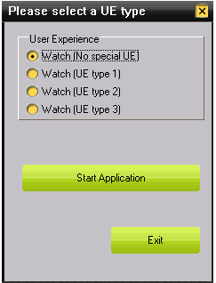
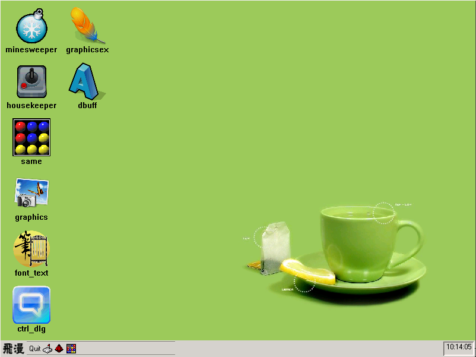

# Look-and-feel and UI effects

## Look and Feel Renderer and attributes of window elements

MiniGUI 3.0 has totally different window and control's look and feel
implementation mechanism than previous version. The old version must configure
options and select UI style before compile the program, and it can only select
one of three styles, fashion, classic and flat. MiniGUI 3.0 has look and feel
renderer to draw the look-and-feel of window and control. MiniGUI 3.0 provides
four renderers for application, user can select any one when needs a renderer.
The advantage of renderer technology is, we can change look and feel of
application by modifying MiniGUI configuration file, but also by `APIs`.
Application can even customize its own renderer. It is very convenience for
customized UI. The implementation of renderer has two parts as follow:

- Attributes of window elements, include the information of window elements,
such as color, size, font and so on.
- Rendering method of window elements, it defines how to draw window elements.

MiniGUI renderer creates categories for attributes of each part of window and
control, defines drawing interface, so as to get a complete look and feel
renderer mechanism. MiniGUI 3.0 has four renderers, classic, flat, fashion and
skin. `Classic` is default renderer, that means, application draws window and
control's look and feel by using classic renderer when MiniGUI is initializing.
Fashion renderer is supported by mGPlus component.

Application can select a specified renderer for certain window and define
attribute of window element's look and feel. Application can also define its
own renderer to draw the UI.

### Attributes of Window Elements

MiniGUI defines the following window elements:

##### Table 1 Window elements and their names in configuration file and codes

| *Name in config file* | *Code Name* | *Meaning* |
| -----------------------|-------------|-----------|
| caption | `WE_METRICS_CAPTION` | Window caption size |
| |WE_FONT_CAPTION|Window caption font|
| `fgc_active_caption` |WE_FGC_ACTIVE_CAPTION| Foreground color of active window caption |
| `bgca_active_caption` |WE_BGCA_ACTIVE_CAPTION| Gradient start color of active window caption background color|
| `bgcb_active_caption` |WE_BGCB_ACTIVE_CAPTION|Gradient end color of active window caption background color|
| `fgc_inactive_caption` |WE_FGC_INACTIVE_CAPTION | Foreground color of inactive window caption |
| `bgca_inactive_caption` |WE_BGCA_INACTIVE_CAPTION|Gradient start color of inactive window caption background color|
| `bgcb_inactive_caption` |WE_BGCB_INACTIVE_CAPTION|Gradient end color of inactive window caption background color|
| menu |WE_METRICS_MENU| Height of menu item and menu bar|
| |WE_FONT_MENU| Menu font |
| `fgc_menu` |WE_FGC_MENU| Foreground color of menu |
| `bgc_menu` |WE_BGC_MENU| Background color of menu |
| border |WE_METRICS_WND_BORDER| Width of window border |
| `fgc_active_border` |WE_FGC_ACTIVE_WND_BORDER| Border color of active window |
| `fgc_inactive_border` |WE_FGC_INACTIVE_WND_BORDER| Border color of inactive window |
| scrollbar |WE_METRICS_SCROLLBAR| Scrollbar size |
| `fgc_msgbox` |WE_FGC_MESSAGEBOX| Foreground color of message box|
| |WE_FONT_MESSAGEBOX| Font of message box |
| `fgc_tip` |WE_FGC_TOOLTIP| Foreground color of tooltip |
| `bgc_tip` |WE_BGC_TOOLTIP| Background color of tooltip |
| |WE_FONT_TOOLTIP| Tooltip font |
| `fgc_window` |WE_FGC_WINDOW| Foreground color of window |
| `bgc_window` |WE_BGC_WINDOW| Background color of window |
| `fgc_3dbox` |WE_FGC_THREED_BODY| Color of symbols on 3D body, such as check mark and arrow |
| `mainc_3dbox` |WE_MAINC_THREED_BODY| Color of 3D body (border and face) |
| `fgc_selected_item` |WE_FGC_SELECTED_ITEM| Foreground color of selected menu item (list item) |
| `bgc_selected_item` |WE_BGC_SELECTED_ITEM| Background color of selected menu item (list item) |
| `bgc_selected_lostfocus` |WE_BGC_SELECTED_LOSTFOCUS| Background color when selected menu item (list item) lost focus |
| `fgc_disabled_item` |WE_FGC_DISABLED_ITEM| Foreground color of disabled menu item (list item) |
| `bgc_disabled_item` |WE_BGC_DISABLED_ITEM| Background color of disabled menu item (list item) |
| `fgc_hilight_item` |WE_FGC_HIGHLIGHT_ITEM| Foreground color of highlighted menu item (list item) |
| `bgc_hilight_item` |WE_BGC_HIGHLIGHT_ITEM| Background color of highlighted menu item (list item) |
| `fgc_significant_item` |WE_FGC_SIGNIFICANT_ITEM| Foreground color of significant menu item (list item) |
| `bgc_significant_item` |WE_BGC_SIGNIFICANT_ITEM| Background color of significant menu item (list item) |
| `bgc_desktop` |WE_BGC_DESKTOP| Background color of desktop |

Above table introduces all window elements. The name in configuration means
this element's name in `MiniGUI.cfg` (MiniGUI configuration file). User can
modify the value of attributes of window element in the configuration file to
change window's look and feel. Code name is to specify the window element when
modifying the attribute of window element by using function interface.

### Attributes of skin renderer's window skin

To replace `SKIN` `APIs` in `MGExt` library with renderer, MiniGUI 3.0 uses 
skin 
renderer. Skin renderer has not only window attributes of other renderers, but
also attributes of window skin. The descriptions of attributes of window skin
are as follow:

##### Table 2 Attributes of window skin and their names in configuration file
and codes

| *Name in config file* | *Code Name* | *Meaning* |
| -----------------------|-------------|-----------|
| `skin_bkgnd` |WE_LFSKIN_WND_BKGND| Skin image of desktop background |
| `skin_caption` |WE_LFSKIN_CAPTION| Skin image of window caption |
| `skin_caption_btn` |WE_LFSKIN_CAPTION_BTN| Skin image of window caption button |
| `skin_scrollbar_hshaft` |WE_LFSKIN_SCROLLBAR_HSHAFT| Skin image of horizontal scrollbar shaft |
| `skin_scrollbar_vshaft` |WE_LFSKIN_SCROLLBAR_VSHAFT| Skin image of vertical scrollbar shaft |
| `skin_scrollbar_hthumb` |WE_LFSKIN_SCROLLBAR_HTHUMB| Skin image of horizontal scrollbar thumb |
| `skin_scrollbar_vthumb` |WE_LFSKIN_SCROLLBAR_VTHUMB| Skin image of vertical scrollbar thumb |
| `skin_scrollbar_arrows` |WE_LFSKIN_SCROLLBAR_ARROWS| Skin image of scrollbar arrow |
| `skin_tborder` |WE_LFSKIN_BORDER_TOP| Skin image of top border |
| `skin_bborder` |WE_LFSKIN_BORDER_BOTTOM| Skin image of bottom border |
| `skin_lborder` |WE_LFSKIN_BORDER_LEFT| Skin image of left border |
| `skin_rborder` |WE_LFSKIN_BORDER_RIGHT| Skin image of right border |
| `skin_arrows` |WE_LFSKIN_ARROWS| Skin image of arrow |
| `skin_arrows_shell` |WE_LFSKIN_ARROWS_SHELL| Skin image of arrow's shell |
| `skin_pushbtn` |WE_LFSKIN_PUSHBUTTON| Skin image of push button |
| `skin_radiobtn` |WE_LFSKIN_RADIOBUTTON| Skin image of radio button |
| `skin_checkbtn` |WE_LFSKIN_CHECKBUTTON| Skin image of check button |
| `skin_tree` |WE_LFSKIN_TREE| Skin image of tree control |
| `skin_header` |WE_LFSKIN_HEADER| Skin image of header |
| `skin_tab` |WE_LFSKIN_TAB| Skin image of tab on property sheet |
| `skin_tbslider_h` |WE_LFSKIN_TBSLIDER_H| Skin image of horizontal sliderbar |
| `skin_tbslider_v` |WE_LFSKIN_TBSLIDER_V| Skin image of vertical sliderbar |
| `skin_trackbar_horz` |WE_LFSKIN_TRACKBAR_HORZ| Skin image of horizontal trackbar |
| `skin_trackbar_vert` |WE_LFSKIN_TRACKBAR_VERT| Skin image of vertical trackbar |
| `skin_progressbar_htrack` |WE_LFSKIN_PROGRESS_HTRACKBAR| Skin image of horizontal progress bar |
| `skin_progressbar_vtrack` |WE_LFSKIN_PROGRESS_VTRACKBAR| Skin image of vertical progress bar |
| `skin_progressbar_hchunk` |WE_LFSKIN_PROGRESS_HCHUNK| Skin image of horizontal progress chunk |
| `skin_progressbar_vchunk` |WE_LFSKIN_PROGRESS_VCHUNK| Skin image of vertical progress chunk |

### Operating function of window attribute

We can change window attribute before execute program and control look and feel
of window by changing MiniGUI configuration file. We can also customize look
and feel of window in the program by using `APIs`. To help with operating of
window attribute, MiniGUI defines the following `API` to implement operating of
window attribute.

```cpp
MG_EXPORT DWORD GUIAPI GetWindowElementAttr (HWND hwnd, int we_attr_id);

MG_EXPORT DWORD GUIAPI SetWindowElementAttr (HWND hwnd, int we_attr_id,
        DWORD we_attr);

MG_EXPORT gal_pixel GUIAPI GetWindowElementPixelEx (HWND hwnd,
        HDC hdc, int we_attr_id);

MG_EXPORT BOOL GUIAPI SetWindowElementRenderer (HWND hWnd,
        const char* werdr_name, const WINDOW_ELEMENT_ATTR* we_attrs);
```

`we_attr_id` in above all functions is attribute `ID` of window element. This 
`ID` 
must be one of code names in Table 1 and 2.

`GetWindowElementAttr` is to get certain element's attribute `ID` of specified
window. hwnd is window handle and `we_attr_id` is attribute `ID` of window
element. 

The following codes are for getting color of 3D body's border and face.

```cpp
DWORD main_c;

main_c = GetWindowElementAttr (hwnd, WE_MAINC_THREED_BODY);
```

`SetWindowElementAttr` is to set certain element's attribute `ID` of specified
window. hwnd is window handle, `we_attr_id` is attribute `ID` of window element
and 
`we_attr` is attribute value.

In the following codes, it gets min height of menu first, then compares the
height with height of window. Window's min height will be set to menu's if
height of menu is greater than window's.

```cpp
    int menu_height_min;

    /** expect menu size of renderer*/
    int menu_height_expect;

    font_size = ((PLOGFONT)GetWindowElementAttr (hwnd, WE_FONT_MENU))->size;
    menu_height_min = font_size + (LFRDR_MENUITEMOFFY_MIN << 1);
    menu_height_expect = GetWindowElementAttr (hwnd, WE_METRICS_MENU);

    /** reset menu height */
    if (menu_height_expect < menu_height_min) {
        SetWindowElementAttr (hwnd, WE_METRICS_MENU, menu_height_min);
    }
```

`GetWindowElementPixelEx` is to get color value of window element. hwnd is
window 
handle, hdc is `DC` handle and `we_attr_id` is attribute `ID` of window 
element. 

The following codes can get gradient start color of window caption background.

```cpp
gal_pixel active_color;

active_color = GetWindowElementPixelEx(hWnd, hdc, WE_BGCA_ACTIVE_CAPTION);
```

`SetWindowElementRenderer` is to set current renderer of window and change
attributes of window. `hWnd` is window handle, `werdr_name` is renderer's name
which will be set, `we_attrs` is structure array of modified attribute of
window. 
The `ID` of last element in array is -1, it means, this is the end.

`WINDOW_ELEMENT_ATTR` structure is as follow:

```cpp
typedef struct _WINDOW_ELEMENT_ATTR {
    /** The attribute identifier. */
    int we_attr_id;
    /** The attribute value. */
    DWORD we_attr;
} WINDOW_ELEMENT_ATTR;
```

The first member in structure is attribute id of window element which needs to
be changed, the second one is needed attribute value.

The following codes set flat as current window renderer and modify some
attributes of window.

```cpp
WINDOW_ELEMENT_ATTR my_we_attrs [] = {
        {FGC_WINDOW, 0x00FFFFFF},
        {MWM_BORDER, 2},
        {SYSLOGFONT_CAPTION, (DWORD)my_caption_font},
        {-1, 0}

    SetWindowElementRenderer (hWnd, "flat", my_we_atts);
};
```

### Renderer Management

Renderer consists of two parts: attribute of window element and matches render
method. We have introduced attribute of window and relevant function
interfaces, and then we introduce render method and how to use renderer. The
structure which is used by renderer is `WINDOW_ELEMENT_RENDERER`, it consists 
of 
renderer name, pointer of render method interface and relevant attribute of
window.

```cpp
typedef struct _WINDOW_ELEMENT_RENDERER {
    const char name[LEN_RENDERER_NAME+1];
    int (*init) (PWERENDERER renderer);
    int (*deinit) (PWERENDERER renderer);
    DWORD (*calc_3dbox_color) (DWORD color, int flag);
    void (*draw_3dbox) (HDC hdc, const RECT* pRect, DWORD color, DWORD flag);
    void (*draw_radio) (HDC hdc, const RECT* pRect, DWORD color, int status);
    void (*draw_checkbox) (HDC hdc, const RECT* pRect, DWORD color,
            int status);
    void (*draw_checkmark) (HDC hdc, const RECT* pRect, DWORD color,
            int status);
    void (*draw_arrow) (HWND hWnd, HDC hdc, const RECT* pRect, DWORD color, int status);
    void (*draw_fold) (HWND hWnd, HDC hdc, const RECT* pRect, DWORD color,
            int status, int next);
    void (*draw_focus_frame) (HDC hdc, const RECT *pRect, DWORD color);
    void (*draw_normal_item) (HWND hWnd, HDC hdc, const RECT* pRect,
            DWORD color);
    void (*draw_hilite_item) (HWND hWnd, HDC hdc, const RECT* pRect,
            DWORD color);
    void (*draw_disabled_item) (HWND hWnd, HDC hdc, const RECT* pRect,
            DWORD color);
    void (*draw_significant_item) (HWND hWnd, HDC hdc, const RECT* pRect,
            DWORD color);
    void (*draw_push_button) (HWND hWnd, HDC hdc, const RECT* pRect,
            DWORD color1, DWORD color2, int status);
    void (*draw_radio_button) (HWND hWnd, HDC hdc, const RECT* pRect, int status);
    void (*draw_check_button) (HWND hWnd, HDC hdc, const RECT* pRect, int status);
    void (*draw_border) (HWND hWnd, HDC hdc, BOOL is_active);
    void (*draw_caption) (HWND hWnd, HDC hdc, BOOL is_active);
    void (*draw_caption_button) (HWND hwnd, HDC hdc, int ht_code, int state);
    void (*draw_scrollbar) (HWND hWnd, HDC hdc, int sb_pos);
    void (*calc_trackbar_rect) (HWND hWnd, LFRDR_TRACKBARINFO *info,
            DWORD dwStyle, const RECT* rcClient, RECT* rcRuler,
            RECT* rcBar, RECT* rcBorder);
    void (*draw_trackbar) (HWND hWnd, HDC hdc, LFRDR_TRACKBARINFO *info);
    int (*calc_we_area) (HWND hWnd, int which, RECT* we_area);
    int (*calc_we_metrics) (HWND hWnd,
            LFRDR_WINSTYLEINFO* style_info, int which);
    int (*hit_test) (HWND hWnd, int x, int y);
    int (*on_click_hotspot) (HWND hWnd, int which);
    void (*draw_custom_hotspot) (HWND hWnd, HDC hdc, int ht_code, int state);
    void (*calc_thumb_area) (HWND hWnd, BOOL vertical,
            LFSCROLLBARINFO* sb_info);
    void (*disabled_text_out) (HWND hWnd, HDC hdc, const char* spText,
                    PRECT rc, DWORD dt_fmt);
    void (*draw_tab) (HWND hWnd, HDC hdc, RECT *rect, char *title,
                DWORD color, int flag, HICON icon);
    void (*draw_progress) (HWND hWnd, HDC hdc,
            int nMax, int nMin, int nPos, BOOL fVertical);
    void (*draw_header) (HWND hWnd, HDC hdc, const RECT* pRect, DWORD color);
    DWORD (*on_get_rdr_attr) (int we_attr_id);
    DWORD (*on_set_rdr_attr) (int we_attr_id, DWORD we_attr, BOOL change);
    void (*erase_background) (HWND hWnd, HDC hdc, const RECT *rect);
    void (*draw_normal_menu_item) (HWND hWnd, HDC hdc, const RECT* pRect,
                        DWORD color);
    void (*draw_hilite_menu_item) (HWND hWnd, HDC hdc, const RECT* pRect,
                        DWORD color);
    void (*draw_disabled_menu_item) (HWND hWnd, HDC hdc, const RECT* pRect,
                        DWORD color);
    int we_metrics [WE_METRICS_NUMBER];
    DWORD we_colors [WE_COLORS_NUMBER][3];
    PLOGFONT we_fonts [WE_FONTS_NUMBER];
    HICON  we_icon [2][SYSICO_ITEM_NUMBER];
    unsigned int refcount;
    const void* private_info;
} WINDOW_ELEMENT_RENDERER;
```

The following table explains each member in the structure.

##### Table 3 Explanation of renderer structure member

| *Member Name* | *Meaning* |
| ---------------|-----------|
| name| Renderer name, length is `LEN_RENDERER_NAME`. Macro `LEN_RENDERER_NAME` is defined as 15 |
| init| Renderer initialization function pointer. It initializes basic renderer information which are window attribute information and private information, such as size, font and color of window element |
| deinit| Renderer destroy function pointer. It frees resources that were allocated by renderer |
| `calc_3dbox_color|` Calculating function pointer of 3D box's color. It gets color value according to calculating flat and color of 3D box's border and face |
| `draw_3dbox|` Drawing function pointer of 3D box |
| `draw_radio|` Drawing function pointer of radio box |
| `draw_checkbox|` Drawing function pointer of check box without check mark |
| `draw_checkmark|` Drawing function pointer of check box with check mark |
| `draw_arrow|` Drawing function pointer of arrow |
| `draw_fold|` Drawing function pointer of fold/unfold |
| `draw_focus_frame|` Drawing function pointer of focus frame |
| `draw_normal_item|` Drawing function pointer of list item in normal state |
| `draw_hilite_item|` Drawing function pointer of list item in highlighted state |
| `draw_disabled_item|` Drawing function pointer of disabled list item |
| `draw_significant_item|` Drawing function pointer of significant list item |
| `draw_push_button|` Drawing function pointer of push button |
| `draw_radio_button|` Drawing function pointer of radio button |
| `draw_check_button|` Drawing function pointer of check button |
| `draw_border|` Drawing function pointer of window border |
| `draw_caption|` Drawing function pointer of window caption |
| `draw_caption_button|` Drawing function pointer of window caption button. The buttons include minimize/maximize/close button |
| `draw_scrollbar|` Drawing function pointer of scrollbar |
| `calc_trackbar_rect|` Drawing function pointer of rectangle of track bar |
| `draw_trackbar|` Drawing function pointer of track bar |
| `calc_we_area|` Calculating function pointer of window element area. The areas include border, caption, caption buttons, toolbar, menu, client area and horizontal/vertical scrollbar |
| `calc_we_metrics|` Calculating function pointer of window element size. The elements are as same as elements in `calc_we_area` |
| `hit_test|` Function pointer of window element clicked by mouse |
| `on_click_hotspot|` Corresponding function pointer when mouse clicks hot spot |
| `draw_custom_hotspot|` Drawing function pointer of hot spot |
| `calc_thumb_area|` Calculating function pointer of thumb of horizontal/vertical scrollbar |
| `disabled_text_out|` Output function pointer of disabled area text |
| `draw_tab|` Drawing function pointer of tab on property sheet |
| `draw_progress|` Drawing function pointer of progress bar |
| `draw_header|` Drawing function pointer of header on listbox or grid view control |
| `on_get_rdr_attr|` Get function pointer of renderer's private information |
| `on_set_rdr_attr|` Set function pointer of renderer's private information |
| `erase_background|` Drawing function pointer of erasing window background |
| `draw_normal_menu_item|` Drawing function pointer of menu item in normal state |
| `draw_hilite_menu_item|` Drawing function pointer of menu item in highlighted state |
| `draw_disabled_menu_item|` Drawing function pointer of disabled menu item |
| `we_metrics|` Attribute of window size |
| `we_colors|` Attribute of window color |
| `we_fonts|` Attribute of window font |
| `we_icon|` Attribute of window icon handle |
| refcount| Attribute of window reference counter |
| `private_info|` Pointer of renderer's private information |

MiniGUI provides the following `API` to manage renderer:

- `GetWindowRendererFromName`: Get renderer from name. Function prototype is as
follows:

```cpp
MG_EXPORT const WINDOW_ELEMENT_RENDERER* GUIAPI GetWindowRendererFromName (const char* name);
```

- `AddWindowElementRenderer`: Add renderer to MiniGUI. Function prototype is as
follows:

```cpp
MG_EXPORT BOOL GUIAPI AddWindowElementRenderer (const char* name, const WINDOW_ELEMENT_RENDERER* we_rdr);
```

- `RemoveWindowElementRenderer`: Remove renderer from MiniGUI. Function
prototype 
is as follow:

```cpp
MG_EXPORT BOOL GUIAPI RemoveWindowElementRenderer (const char* name);
```

- `GetDefaultWindowElementRenderer`: Get default renderer. Function prototype 
is 
as follow:

```cpp
MG_EXPORT const WINDOW_ELEMENT_RENDERER* GUIAPI GetDefaultWindowElementRenderer (void);
```

- `SetDefaultWindowElementRenderer`: Set default renderer. Function prototype 
is 
as follow:

```cpp
MG_EXPORT const char* GUIAPI SetDefaultWindowElementRenderer (const char* name);
```

- `SetWindowElementRenderer`: Specify renderer. Function prototype is as 
follow: 

```cpp
MG_EXPORT BOOL GUIAPI SetWindowElementRenderer (HWND hWnd, const char* werdr_name, const WINDOW_ELEMENT_ATTR* we_attrs);
```

### Creating main window

It needs more arguments to create main window after draw a window by using
renderer, for `API` compatible, MiniGUI created a new function,
`CreateMainWindowEx`, and packaged the old creating function. Function 
prototype 
is as follow.

```cpp
MG_EXPORT HWND GUIAPI CreateMainWindowEx (PMAINWINCREATE pCreateInfo,
                        const char* werdr_name, const WINDOW_ELEMENT_ATTR* we_attrs,
                        const char* window_name, const char* layer_name);

static inline HWND GUIAPI CreateMainWindow (PMAINWINCREATE pCreateInfo)
{
    return CreateMainWindowEx (pCreateInfo, NULL, NULL, NULL, NULL);
}
```

- `pCreateInfo` Main window structure, we have introduced it in chapter 3,
Window and Message.
- `window_name` and `layer_name` are reserved arguments for later version.
- `werdr_name` The name of window element's renderer which will be used. Will
use default renderer if it is `NULL`.
- `we_attrs` Attribute table of window element's look and feel. Will use
default attribute table if it is `NULL`.

### Creating control

Similar with main window creating, there is also a new function,
`CreateWindowEx2`, to create control. MiniGUI also packaged old creating
function, `CreateWindowEx`.

```cpp
MG_EXPORT HWND GUIAPI CreateWindowEx2 (const char* spClassName,
        const char* spCaption, DWORD dwStyle, DWORD dwExStyle,
        int id, int x, int y, int w, int h, HWND hParentWnd,
        const char* werdr_name, const WINDOW_ELEMENT_ATTR* we_attrs,
        DWORD dwAddData);

static inline HWND GUIAPI CreateWindowEx (const char* spClassName,
        const char* spCaption, DWORD dwStyle, DWORD dwExStyle,
        int id, int x, int y, int w, int h, HWND hParentWnd,
        DWORD dwAddData)
{
    return CreateWindowEx2 (spClassName, spCaption, dwStyle, dwExStyle,
                id, x, y, w, h, hParentWnd, NULL, NULL, dwAddData);
}

#define CreateWindow(class_name, caption, style,        \
                id, x, y, w, h, parent, add_data)       \
        CreateWindowEx(class_name, caption, style, 0,   \
                        id, x, y, w, h, parent, add_data)
```
These functions have be introduced in chapter 5, Foundation of Control
Programming. 

### Creating dialog box

- Modal dialog box creating

```cpp
MG_EXPORT int GUIAPI DialogBoxIndirectParamEx (PDLGTEMPLATE pDlgTemplate,
HWND hOwner, WNDPROC DlgProc, LPARAM lParam,
const char* werdr_name, WINDOW_ELEMENT_ATTR* we_attrs,
const char* window_name, const char* layer_name);

static inline int GUIAPI DialogBoxIndirectParam (PDLGTEMPLATE pDlgTemplate,
HWND hOwner, WNDPROC DlgProc, LPARAM lParam)
{
        return DialogBoxIndirectParamEx (pDlgTemplate, hOwner, DlgProc, lParam,
        NULL, NULL, NULL, NULL);
}
```

- Modeless dialog box creating

```cpp
MG_EXPORT HWND GUIAPI CreateMainWindowIndirectParamEx (PDLGTEMPLATE pDlgTemplate,
HWND hOwner, WNDPROC DlgProc, LPARAM lParam,
const char* werdr_name, WINDOW_ELEMENT_ATTR* we_attrs,
const char* window_name, const char* layer_name);

static inline HWND GUIAPI CreateMainWindowIndirectParam (PDLGTEMPLATE pDlgTemplate,
HWND hOwner, WNDPROC DlgProc, LPARAM lParam)
{
        return CreateMainWindowIndirectParamEx (pDlgTemplate, hOwner, DlgProc, lParam,
        NULL, NULL, NULL, NULL);
}
```

Above functions end in Ex are new added functions. They have been introduced in
chapter 4, Foundation of Dialog Box Programming.

## Double Buffering Main Window

Double buffering main window mechanism is a window rendering method which is
provide by MiniGUI. In this mechanism, when drawing main window, the window is
drawn in matched memory `DC` first, and then we can calculate the data in `DC`
by 
using various algorithms to get various special display effects, such as
push-pull, scrolling and page turning. Another function of the mechanism is
improving the efficient of window drawing and solving blinking issue when doing
window drawing.

### Extension Style of Double Buffering Main Window

We can create main window or dialog box with memory `DC` which matches window 
`DC` 
by using the extension style of double buffering main window. The definition is
as follow:

```cpp
#define WS_EX_AUTOSECONDARYDC     0x00001000L
```

The following code is an example for creating main window with double buffer.
```cpp
    HWND hMainWnd;
    MAINWINCREATE CreateInfo;

    CreateInfo.dwStyle = WS_NONE;
    CreateInfo.dwExStyle = WS_EX_AUTOSECONDARYDC;
    CreateInfo.spCaption = "Watch";
    CreateInfo.hMenu = 0;
    CreateInfo.hCursor = GetSystemCursor(0);
    CreateInfo.hIcon = 0;
    CreateInfo.MainWindowProc = WatchWinProc;
    CreateInfo.lx = 0;
    CreateInfo.ty = 0;
    CreateInfo.rx = 240;
    CreateInfo.by = 320;
    CreateInfo.iBkColor = PIXEL_lightwhite;
    CreateInfo.dwAddData = 0;
    CreateInfo.hHosting = hosting;

    hMainWnd = CreateMainWindow (&CreateInfo);
```

### Functions of double buffering window mechanism

- Double buffers `DC` creating function, `CreateSecondaryDC`, creates 
compatible 
memory `DC` and returns according to passed window's size.

```cpp
MG_EXPORT HDC GUIAPI CreateSecondaryDC (HWND hwnd);
```

- `SetSecondaryDC` sets already made memory `DC` as one of double buffers of
target 
main window. It also copies callback function from double buffer's screen `DC`.

```cpp
typedef int (* ON_UPDATE_SecondaryDC)(HWND hwnd, HDC secondary_dc, HDC real_dc, cont RECT* update_rc, DWORD area_flags);

MG_EXPORT HDC GUIAPI SetSecondaryDC (HWND hwnd, HDC secondary_dc, ON_UPDATE_SECONDARYDC on_update_secondarydc);
```

It is necessary to note the following when invoking `SetSecondaryDC`:
- If main window has `WS_EX_AUTOSecondaryDC` style, it will disable this style
and invoke `DeleteSecondaryDC` to delete exist double buffers and return
`HDC_SCREEN`.
- If main window doesn't have `WS_EX_AUTOSecondaryDC` style, it will return
the handle of exist double buffers. The exist double buffers is managed by
application.
- If `HDC_SCREEN` is passed, it will cancel double buffering mechanism of
window.
- If passed `ON_UPDATE_SecondaryDC` is `NULL`, MiniGUI will not draw the
contents of screen `DC` to screen automatically, user needs to copy the
contents of double buffers to screen `DC` by using `BitBlt` function. Otherwise
the 
application takes responsibility of copying double buffers to screen `DC` to 
get 
UI effects.

In the following code, main window is drawn on double buffer after set double
buffer of main window.

```cpp
    HDC hdc;
    hdc = GetSecondaryDC (hWnd);
    SetSecondaryDC(hWnd, hdc, DoubleBufferProc);
    UpdateAll (hWnd, TRUE);
    SetSecondaryDC(hWnd, hdc, NULL);
```

- `GetSecondaryDC` can get the handle of double buffer.

```cpp
MG_EXPORT HDC GUIAPI GetSecondaryDC (HWND hwnd);
```

- `GetSecondaryClientDC` is to get the `DC` of double buffering window's 
client. If
the window doesn't support double buffer, it returns the `DC` of window's
client, equal to `GetClientDC`.

```cpp
MG_EXPORT HDC GUIAPI GetSecondaryClientDC (HWND hwnd);
```

- `ReleaseSecondaryDC` releases the `DC` of double buffer. It will do nothing,
it 
the `DC` is main window double buffer's `DC`.

```cpp
MG_EXPORT void GUIAPI ReleaseSecondaryDC (HWND hwnd, HDC hdc);
```

- `DeleteSecondaryDC` deletes the `DC` created by `CreateSecondaryDC`.

```cpp
static inline void GUIAPI DeleteSecondaryDC (HWND hwnd);
```

- `GetSecondarySubDC` is only for double buffer, it creates sub-DC based on the
`DC` of private window, so the sub-DC can be the client `DC` of main window or
be 
regarded to control's `DC`. Both main window (or its control) with
`WS_EX_SecondaryDC` style is drawing non-client and the return value of
`BeginPaint` should use `GetSecondarySubDC` to get sub-DC of double buffer 
`DC`, 
to ensure that all drawings in main window is on double buffer `DC`.

```cpp
HDC GUIAPI GetSecondarySubDC (HDC secondary_dc, HWND hwnd_main, HWND hwnd_child, BOOL client);
```

- `ReleaseSecondarySubDC` releases sub-DC of private `DC`.

```cpp
void GUIAPI ReleaseSecondarySubDC (HDC secondary_subdc, HWND hwnd_child);
```

### Sample program of double buffering mechanism

- Create main window with double buffer, and then add the codes of UI effects
before message loop.

```cpp
    MSG Msg;
    HWND hMainWnd;
    MAINWINCREATE CreateInfo;

    CreateInfo.dwStyle = WS_NONE;
    CreateInfo.dwExStyle = WS_EX_AUTOSECONDARYDC;
    CreateInfo.spCaption = "Watch";
    CreateInfo.hMenu = 0;
    CreateInfo.hCursor = GetSystemCursor(0);
    CreateInfo.hIcon = 0;
    CreateInfo.MainWindowProc = WatchWinProc;
    CreateInfo.lx = 0;
    CreateInfo.ty = 0;
    CreateInfo.rx = 240;
    CreateInfo.by = 320;
    CreateInfo.iBkColor = PIXEL_lightwhite;
    CreateInfo.dwAddData = 0;
    CreateInfo.hHosting = hosting;
    
    hMainWnd = CreateMainWindow (&CreateInfo);
    
    if (hMainWnd == HWND_INVALID)
        return -1;

    switch (ue_type) {
        MSG Msg;
    HWND hMainWnd;
    MAINWINCREATE CreateInfo;

    CreateInfo.dwStyle = WS_NONE;
    CreateInfo.dwExStyle = WS_EX_AUTOSECONDARYDC;
    CreateInfo.spCaption = "Watch";
    CreateInfo.hMenu = 0;
    CreateInfo.hCursor = GetSystemCursor(0);
    CreateInfo.hIcon = 0;
    CreateInfo.MainWindowProc = WatchWinProc;
    CreateInfo.lx = 0;
    CreateInfo.ty = 0;
    CreateInfo.rx = 240;
    CreateInfo.by = 320;
    CreateInfo.iBkColor = PIXEL_lightwhite;
    CreateInfo.dwAddData = 0;
    CreateInfo.hHosting = hosting;
    
    hMainWnd = CreateMainWindow (&CreateInfo);
    
    if (hMainWnd == HWND_INVALID)
        return -1;

//Add the codes of UI effects.
    switch (ue_type) {
        case 1:
            ue_1_start (hMainWnd); //fade-in fade-out
            break;
        case 2:
            ue_2_start (hMainWnd); //push-pull
            break;
        case 3:
            ue_3_start (hMainWnd); //Scrolling
            break;
        default:
            ShowWindow (hMainWnd, SW_SHOWNORMAL);
            break;
    }

    while (GetMessage (&Msg, hMainWnd)) {
        TranslateMessage (&Msg);
        DispatchMessage (&Msg);
    }

    MainWindowThreadCleanup (hMainWnd);

    return 0;

```

- The codes of three UI effects
```cpp
    /fade-in fade-out
static void ue_1_start (HWND hwnd)
{
    MSG msg;
    HDC sec_dc;

    sec_dc = GetSecondaryDC (hwnd);
    SetSecondaryDC (hwnd, sec_dc, ON_UPDSECDC_DONOTHING);
    ShowWindow (hwnd, SW_SHOWNORMAL);

    /* wait for MSG_IDLE */
    while (GetMessage (&msg, hwnd)) {
        if (msg.message == MSG_IDLE)
            break;
        DispatchMessage (&msg);
    }

    SetMemDCAlpha (sec_dc, MEMDC_FLAG_SRCALPHA, 64);
    BitBlt (sec_dc, 0, 0, 240, 320, HDC_SCREEN, 0, 0, 0);
    usleep (100000);

    SetMemDCAlpha (sec_dc, MEMDC_FLAG_SRCALPHA, 128);
    BitBlt (sec_dc, 0, 0, 240, 320, HDC_SCREEN, 0, 0, 0);
   usleep (100000);

    SetMemDCAlpha (sec_dc, 0, 0);
    BitBlt (sec_dc, 0, 0, 240, 320, HDC_SCREEN, 0, 0, 0);

    /* restore to default behavior */
    SetSecondaryDC (hwnd, sec_dc, ON_UPDSECDC_DEFAULT);
}

 //Push-pull
static void ue_2_start (HWND hwnd)
{
    MSG msg;
    HWND hosting;
    HDC sec_dc_active, sec_dc_hosting;

    /* disable output of the hosting and the active main windows */
    hosting = GetHosting (hwnd);
    sec_dc_hosting = GetSecondaryDC (hosting);
    SetSecondaryDC (hosting, sec_dc_hosting, ON_UPDSECDC_DONOTHING);

    sec_dc_active = GetSecondaryDC (hwnd);
    SetSecondaryDC (hwnd, sec_dc_active, ON_UPDSECDC_DONOTHING);

    /* get the content of the active main window */
    ShowWindow (hwnd, SW_SHOWNORMAL);
    /* wait for MSG_IDLE */
    while (GetMessage (&msg, hwnd)) {
        if (msg.message == MSG_IDLE)
            break;
        DispatchMessage (&msg);
    }

    /* push and poll */
    BitBlt (sec_dc_hosting, 0, 0, 240, 320, HDC_SCREEN, -60, 0, 0);
    BitBlt (sec_dc_active, 0, 0, 60, 320, HDC_SCREEN, 240-60, 0, 0);
    usleep (100000);

    BitBlt (sec_dc_hosting, 0, 0, 240, 320, HDC_SCREEN, -120, 0, 0);
    BitBlt (sec_dc_active, 0, 0, 120, 320, HDC_SCREEN, 240-120, 0, 0);
    usleep (100000);

    BitBlt (sec_dc_active, 0, 0, 240, 320, HDC_SCREEN, 0, 0, 0);

    /* restore to default behavior */
    SetSecondaryDC (hwnd, sec_dc_active, ON_UPDSECDC_DEFAULT);
    SetSecondaryDC (hosting, sec_dc_hosting, ON_UPDSECDC_DEFAULT);
}

//Scrolling
static void ue_3_start (HWND hwnd)
{
    MSG msg;
    HWND hosting;
    HDC sec_dc_active, sec_dc_hosting;

    /* disable output of the hosting and the active main windows */
    hosting = GetHosting (hwnd);
    sec_dc_hosting = GetSecondaryDC (hosting);
    SetSecondaryDC (hosting, sec_dc_hosting, ON_UPDSECDC_DONOTHING);

    sec_dc_active = GetSecondaryDC (hwnd);
    SetSecondaryDC (hwnd, sec_dc_active, ON_UPDSECDC_DONOTHING);

    /* get the content of the active main window */
    ShowWindow (hwnd, SW_SHOWNORMAL);
    /* wait for MSG_IDLE */
    while (GetMessage (&msg, hwnd)) {
        if (msg.message == MSG_IDLE)
            break;
        DispatchMessage (&msg);
    }

    BitBlt (sec_dc_hosting, 30, 0, 120-30, 320, HDC_SCREEN, 0, 0, 0);
    BitBlt (sec_dc_hosting, 120, 0, 120-30, 320, HDC_SCREEN, 120+30, 0, 0);
    BitBlt (sec_dc_active, 120-30, 0, 30+30, 320, HDC_SCREEN, 120-30, 0, 0);
    usleep (100000);

    BitBlt (sec_dc_hosting, 60, 0, 120-60, 320, HDC_SCREEN, 0, 0, 0);
    BitBlt (sec_dc_hosting, 120, 0, 120-60, 320, HDC_SCREEN, 120+60, 0, 0);
    BitBlt (sec_dc_active, 120-60, 0, 60+60, 320, HDC_SCREEN, 120-60, 0, 0);
    usleep (100000);

    BitBlt (sec_dc_active, 0, 0, 240, 320, HDC_SCREEN, 0, 0, 0);

    /* restore to default behavior */
    SetSecondaryDC (hwnd, sec_dc_active, ON_UPDSECDC_DEFAULT);
}

```

- Invoke UI effects codes in window close message

```cpp
......
case MSG_CLOSE:
         ......

            switch (_ue_type) {
                case 1:
                    ue_1_term (hWnd);
                    break;
                case 2:
                    ue_2_term (hWnd);
                    break;
                case 3:
                    ue_3_term (hWnd);
                    break;
            }
            DestroyMainWindow (hWnd);
            return 0;
......
```

- The codes of three UI effects when window is closing

```cpp
//fade-in fade-out
static void ue_1_term (HWND hwnd)
{
    HWND hosting;
    HDC sec_dc_active, sec_dc_hosting;

    hosting = GetHosting (hwnd);
    sec_dc_active = GetSecondaryDC (hwnd);
    SetSecondaryDC (hwnd, sec_dc_active, ON_UPDSECDC_DONOTHING);

    sec_dc_hosting = GetSecondaryDC (hosting);
    SetSecondaryDC (hosting, sec_dc_hosting, ON_UPDSECDC_DONOTHING);

    SetMemDCAlpha (sec_dc_hosting, MEMDC_FLAG_SRCALPHA, 64);
    BitBlt (sec_dc_hosting, 0, 0, 240, 320, HDC_SCREEN, 0, 0, 0);
    usleep (100000);

    SetMemDCAlpha (sec_dc_hosting, MEMDC_FLAG_SRCALPHA, 128);
    BitBlt (sec_dc_hosting, 0, 0, 240, 320, HDC_SCREEN, 0, 0, 0);
    usleep (100000);

    SetMemDCAlpha (sec_dc_hosting, 0, 0);
    BitBlt (sec_dc_hosting, 0, 0, 240, 320, HDC_SCREEN, 0, 0, 0);

    /* restore to default behavior */
    SetSecondaryDC (hosting, sec_dc_hosting, ON_UPDSECDC_DEFAULT);
}

//Push-pull
static void ue_2_term (HWND hwnd)
{
    HWND hosting;
    HDC sec_dc_active, sec_dc_hosting;

    sec_dc_active = GetSecondaryDC (hwnd);
    SetSecondaryDC (hwnd, sec_dc_active, ON_UPDSECDC_DONOTHING);

    hosting = GetHosting (hwnd);
    sec_dc_hosting = GetSecondaryDC (hosting);
    SetSecondaryDC (hosting, sec_dc_hosting, ON_UPDSECDC_DONOTHING);

    /* push and poll */
    BitBlt (sec_dc_hosting, 240-60, 0, 60, 320, HDC_SCREEN, 0, 0, 0);
    BitBlt (sec_dc_active, 0, 0, 240-60, 320, HDC_SCREEN, 60, 0, 0);
    usleep (100000);

    BitBlt (sec_dc_hosting, 240-120, 0, 120, 320, HDC_SCREEN, 0, 0, 0);
    BitBlt (sec_dc_active, 0, 0, 120, 320, HDC_SCREEN, 120, 0, 0);
    usleep (100000);

    BitBlt (sec_dc_hosting, 0, 0, 240, 320, HDC_SCREEN, 0, 0, 0);

    /* restore to default behavior */
    SetSecondaryDC (hosting, sec_dc_hosting, ON_UPDSECDC_DEFAULT);
}

//Scrolling
static void ue_3_term (HWND hwnd)
{
    HWND hosting;
    HDC sec_dc_active, sec_dc_hosting;

    sec_dc_active = GetSecondaryDC (hwnd);
    SetSecondaryDC (hwnd, sec_dc_active, ON_UPDSECDC_DONOTHING);

    hosting = GetHosting (hwnd);
    sec_dc_hosting = GetSecondaryDC (hosting);
    SetSecondaryDC (hosting, sec_dc_hosting, ON_UPDSECDC_DONOTHING);

    BitBlt (sec_dc_hosting, 60, 0, 120-60, 320, HDC_SCREEN, 0, 0, 0);
    BitBlt (sec_dc_hosting, 120, 0, 120-60, 320, HDC_SCREEN, 120+60, 0, 0);
    BitBlt (sec_dc_active, 120-60, 0, 60+60, 320, HDC_SCREEN, 120-60, 0, 0);
    usleep (100000);

    BitBlt (sec_dc_hosting, 30, 0, 120-30, 320, HDC_SCREEN, 0, 0, 0);
    BitBlt (sec_dc_hosting, 120, 0, 120-30, 320, HDC_SCREEN, 120+30, 0, 0);
    BitBlt (sec_dc_active, 120-30, 0, 30+30, 320, HDC_SCREEN, 120-30, 0, 0);
    usleep (100000);

    BitBlt (sec_dc_hosting, 0, 0, 240, 320, HDC_SCREEN, 0, 0, 0);

    /* restore to default behavior */
    SetSecondaryDC (hosting, sec_dc_hosting, ON_UPDSECDC_DEFAULT);
}

```
- Three UI effects



##### Figure 1 UI effect of double buffering main window

## Customization of Desktop

MiniGUI provides a set of desktop window customization interfaces as callback
functions. Through these interfaces, application can control desktop window to
response each message, it is similar to the desktop of Windows.

### Structure of Desktop Customization

```cpp
typedef struct _DESKTOPOPS {

        /** called when starting a new session, and return a context */
        void* (*init) (void);

        /** called when terminating a seesion */
        void (*deinit) (void* context);

        /** called when the desktop should be repainted */
        void (*paint_desktop) (void* context,
                HDC dc_desktop, const RECT* inv_rc);

        /** the keyboard event handler for the desktop */
        void (*keyboard_handler) (void* context,
                int message, WPARAM wParam, LPARAM lParam);

        /** the mouse event handler for the desktop */
        void (*mouse_handler) (void* context,
                int message, WPARAM wParam, LPARAM lParam);

        /** the desktop menu customizer */
        void (*customize_desktop_menu) (void* context,
                                 HMENU hmenu, int start_pos);

        /** the desktop menu command handler */
        void (*desktop_menucmd_handler) (void* context, int id);
} DESKTOPOPS;
```
Members in the structure:
```
- init: The function of initializing set of operations, it returns context. 
- deinit: The function of destroying set of operations.
- paint_desktop: Repaint function for desktop
- keyboard_handler: Keyboard's handler, it can handle the following keyboard messages:
   - MSG_DT_KEYDOWN
   - MSG_DT_KEYUP
   - MSG_DT_KEYLONGPRESS:
   - MSG_DT_KEYALWAYSPRESS:
   - MSG_DT_CHAR:
   - MSG_DT_SYSKEYDOWN:
   - MSG_DT_SYSCHAR:
   - MSG_DT_SYSKEYUP
- mouse_handler: Mouse's handler, it can handle the following mouse messages:
   - MSG_DT_LBUTTONDOWN
   - MSG_DT_LBUTTONUP
   - MSG_DT_LBUTTONDBLCLK
   - MSG_DT_MOUSEMOVE
   - MSG_DT_RBUTTONDOWN
   - MSG_DT_RBUTTONDBLCLK
   - MSG_DT_RBUTTONUP
- customize_desktop_menu: Constructor of customized popup menu.
- desktop_menucmd_handler: Response function of popup menu.
```

### Functions of Desktop Customization

- Customize the function which set the interface.

```cpp
/* Set a new desktop operation set, and return the old one */
DESKTOPS* SetCustomDesktopOperationSet (DESKTOPOPS* dsk_ops);
```

This function is to set assigned desktop customization structure. Desktop
window will invoke set function interface to handle the message later.

- Update function of desktop window:

```cpp
void DesktopUpdateAllWindow (void);
```

This function updates all windows on desktop. It is convenience to repaint all
windows.

### Sample program

This sample program is in mginit, a directory of mg-samples. Due to limited
space, only key codes are listed here. Callback functions of desktop
customization interfaces are defined in desktop.c:

```cpp
DESKTOPOPS mg_dsk_ops =
{
    this_init,
    this_deinit,
    this_paint_desktop,
    this_keyboard_handler,
    this_mouse_handler, 
    this_customize_desktop_menu,
    this_desktop_menucmd_handler,
};
```

Callback functions of desktop customization interfaces are as follow:
```cpp

static void free_dsp_app (void)
{
    int i;
    DSPITEM* item;

    item = icon_info.app_items;
    for (i = 0; i < icon_info.nr_apps; i++, item++) {
        if (item->bmp.bmBits) {
            UnloadBitmap (&item->bmp);
            item->bmp.bmBits = NULL;
        }
    }

    free (icon_info.app_items);
    icon_info.app_items = NULL;
}

static BOOL get_dsp_app (void)
{
    int i;
    DSPITEM* item;
    char section [10];
    int distance_x = START_X;
    int distance_y = START_Y;
    SIZE size;

    if (GetIntValueFromEtcFile (APP_INFO_FILE, "desktop", "app_nr", &icon_info.nr_apps) = ETC_OK)
        return FALSE;

    if (icon_info.nr_apps <= 0)
        return FALSE;

    if (GetValueFromEtcFile (APP_INFO_FILE, "desktop", "bg_pic", icon_info.bg_path, PATH_MAX) = ETC_OK)
        return FALSE;

    if ((icon_info.app_items = (DSPITEM*)calloc (icon_info.nr_apps, sizeof (DSPITEM))) == NULL) {
        return FALSE;
    }
    item = icon_info.app_items;
    for (i = 0; i < icon_info.nr_apps; i++, item++) {
        sprintf (section, "dsp-app%d", i);
        if (GetValueFromEtcFile (APP_INFO_FILE, section, "path", item->path, PATH_MAX) = ETC_OK)
            goto error;

        if (GetValueFromEtcFile (APP_INFO_FILE, section, "name", item->name, NAME_MAX) = ETC_OK)
            goto error;

        if (GetValueFromEtcFile (APP_INFO_FILE, section, "layer", item->layer, LEN_LAYER_NAME) = ETC_OK)
            goto error;

        if (GetValueFromEtcFile (APP_INFO_FILE, section, "pictrue", item->bmp_path, PATH_MAX + NAME_MAX) = ETC_OK)
            goto error;

        if (LoadBitmap (HDC_SCREEN, &item->bmp, item->bmp_path) = ERR_BMP_OK) {
            fprintf (stderr, "desktop load resource:%s error. \n", item->bmp_path);
            goto error;
        }

        item->cdpath = TRUE;

        item->hot_spot_rc.left   = distance_x;
        item->hot_spot_rc.right  = item->hot_spot_rc.left + DEF_WIDTH;
        item->hot_spot_rc.top    = distance_y;
        item->hot_spot_rc.bottom = item->hot_spot_rc.top + DEF_HEIGHT;

        GetTextExtent(HDC_SCREEN, item->name, -1, &size);

        item->text_rc.top     = item->hot_spot_rc.bottom;
        item->text_rc.left    = (item->hot_spot_rc.right + item->hot_spot_rc.left - size.cx)/2;
        item->text_rc.bottom  = item->text_rc.top + size.cy;
        item->text_rc.right   = item->text_rc.left + size.cx;
        
        distance_y += SPACE + RECTH(item->hot_spot_rc);
        if(distance_y + DEF_HEIGHT >= g_rcDesktop.bottom)
        {
            distance_y = START_Y;
            distance_x += SPACE + DEF_WIDTH;
        }    
    }
    return TRUE;
error:
    free_dsp_app ();
    return FALSE;
}

static HMENU create_icon_menu (void)
{
    HMENU hmnu;
    MENUITEMINFO mii;

    memset (&mii, 0, sizeof(MENUITEMINFO));
    mii.type        = MFT_STRING;
    mii.id          = 0;
    mii.typedata    = (DWORD)MGDT_ST_ICONMENU;
    hmnu = CreatePopupMenu (&mii);
    
    memset (&mii, 0, sizeof(MENUITEMINFO));
    mii.type        = MFT_STRING ;
    mii.state       = 0;
    mii.id          = ID_OP;
    mii.typedata    = (DWORD)MGDT_ST_OPEN;
    InsertMenuItem(hmnu, 2, TRUE, &mii);

    memset (&mii, 0, sizeof(MENUITEMINFO));
    mii.type        = MFT_STRING ;
    mii.state       = 0;
    mii.id          = ID_AB;
    mii.typedata    = (DWORD)MGDT_ST_ABOUT;
    InsertMenuItem(hmnu, 3, TRUE, &mii);

    return hmnu;
}

//Read relative resources of desktop and create picture menu when initializing.
static void* this_init(void)
{
    Context *con = malloc(sizeof(Context));

    get_dsp_app ();
    icon_info.focus = 0xFFFF;

    if(0 = strcmp(icon_info.bg_path, ""))
    {
        con->bg = (PBITMAP)malloc(sizeof(BITMAP));
        LoadBitmapFromFile(HDC_SCREEN, con->bg, icon_info.bg_path);
    }
    else
        con->bg = NULL; 

    con->icon_menu = create_icon_menu();   

    return (void *)con;

}

//Release memory space
static void this_deinit(void* context)
{
       if(((Context *)context)->bg) 
        UnloadBitmap (((Context *)context)->bg);

    free_dsp_app ();

    if (context = NULL) free(context);

    return;

}

//Paint desktop
static void this_paint_desktop(void* context, HDC dc_desktop, const RECT* inv_rc)
{
       PBITMAP bg_bmp = NULL;
    int i = 0;
    DSPITEM* item;

    if(((Context *)context)->bg)
        bg_bmp = ((Context *)context)->bg;

    SelectClipRect (dc_desktop, inv_rc);
    if (bg_bmp) {
        FillBoxWithBitmap (dc_desktop, 0, 0,
                g_rcDesktop.right, g_rcDesktop.bottom, bg_bmp);
    }else {
        SetBrushColor (dc_desktop, PIXEL_blue);
        FillBox(dc_desktop, g_rcDesktop.left, g_rcDesktop.top,
                RECTW(g_rcDesktop), RECTH(g_rcDesktop));
    }
    
    item = icon_info.app_items;
    for(i = 0; i < icon_info.nr_apps; i++, item++)
    {
        if(i == icon_info.focus)
        {
            SetBrushColor (dc_desktop, PIXEL_darkblue);
            FillBox(dc_desktop, item->hot_spot_rc.left, 
                    item->hot_spot_rc.top,
                    RECTW(item->hot_spot_rc), 
                    RECTH(item->hot_spot_rc));
        }
        FillBoxWithBitmap (dc_desktop,
                item->hot_spot_rc.left,
                item->hot_spot_rc.top,
                RECTW(item->hot_spot_rc),
                RECTH(item->hot_spot_rc), 
                &item->bmp);
        SetBkMode(dc_desktop, BM_TRANSPARENT);
        TextOut(dc_desktop, 
                item->text_rc.left, item->text_rc.top, item->name);
    }

}

//Keyboard message of dekstop
static void this_keyboard_handler(void* context, int message,
                                       WPARAM wParam, LPARAM lParam)
{
    switch(message)
    {
        case MSG_DT_KEYDOWN:
            break;
        case MSG_DT_KEYUP:
            break;
    }

}

static void this_customize_desktop_menu (void* context, HMENU hmnu, int start_pos)
{
   
    ((Context *)context)->hmenu = hmnu;

    MENUITEMINFO mii;

    memset (&mii, 0, sizeof(MENUITEMINFO));
    mii.type        = MFT_STRING;
    mii.id          = ID_UP;
    mii.typedata    = (DWORD)MGDT_ST_REFRESH;
    mii.hsubmenu    = 0;
    InsertMenuItem (hmnu, start_pos , TRUE, &mii);
#if 0
    mii.type        = MFT_STRING;
    mii.id          = ID_CB;
    mii.typedata    = (DWORD)"Change BkPicture";
    mii.hsubmenu    = 0;
    InsertMenuItem (hmnu, start_pos + 1, TRUE, &mii);
#endif
    mii.type        = MFT_STRING;
    mii.id          = ID_AB;
    mii.typedata    = (DWORD)MGDT_ST_ABOUTM;
    mii.hsubmenu    = 0;
    InsertMenuItem (hmnu, start_pos + 1, TRUE, &mii);

}

pid_t exec_app_name (const char* file_name, const char* app_name, const char * argv)
{
    pid_t pid = 0;

    if ((pid = vfork ()) > 0) {
        fprintf (stderr, "new child, pid: %d.\n", pid);
    }
    else if (pid == 0) {
        if (execl (file_name, app_name, argv, NULL) < 0)
            fprintf(stderr, "execl error\n");
        perror ("execl");
        _exit (1);
    }
    else {
        perror ("vfork");
    }

    return pid;
}

//Mouse message of dekstop
static void this_mouse_handler(void* context, int message,  WPARAM wParam, LPARAM lParam)
{
   
    int x, y;
    int i = 0;
    DSPITEM* item;
    static int old_x = 0, old_y = 0;

    x = LOSWORD (lParam);
    y = HISWORD (lParam);
    switch(message)
    {
        case MSG_DT_LBUTTONDOWN:
            {
                item = icon_info.app_items;
                for(i = 0; i < icon_info.nr_apps; i++, item++) 
                {
                    if (PtInRect(&item->hot_spot_rc, x, y)) 
                    {
                        icon_info.focus = i;
                        old_x = x;
                        old_y = y;
                        SendMessage(HWND_DESKTOP, MSG_ERASEDESKTOP, 
                                0, (LPARAM)&item->hot_spot_rc);
                        break;
                    }
                }
                break;
            }

        case MSG_DT_LBUTTONUP:
            {
                icon_info.focus = 0xFFFF;
                SendMessage(HWND_DESKTOP, MSG_ERASEDESKTOP, 0, 0);
                break;
            }
        case MSG_DT_LBUTTONDBLCLK:
            {
                char buff [PATH_MAX + NAME_MAX + 1];
                item = icon_info.app_items;
                for(i = 0; i < icon_info.nr_apps; i++, item++) 
                {
                    if (PtInRect(&item->hot_spot_rc, x, y)) 
                    {
                        if(item->cdpath)
                        {
                            chdir(item->path);
                        }
                        strcpy (buff, item->path);
                        strcat (buff, item->name);
                        exec_app_name(buff, item->name, "-layer");
                        break;
                    }
                }

                break;
            }

        case MSG_DT_MOUSEMOVE:
            {
                RECT rc;
                if (icon_info.focus == 0xFFFF) break;

                item = icon_info.app_items;
                for(i = 0; i < icon_info.nr_apps; i++, item++) 
                {
                    if (i == icon_info.focus ) 
                    {
                        GetBoundRect(&rc, &item->text_rc, &item->hot_spot_rc);

                        item->hot_spot_rc.left      += x - old_x;
                        item->hot_spot_rc.right     += x - old_x;
                        item->hot_spot_rc.top       += y - old_y;
                        item->hot_spot_rc.bottom    += y - old_y;

                        item->text_rc.left      += x - old_x;
                        item->text_rc.right     += x - old_x;
                        item->text_rc.top       += y - old_y;
                        item->text_rc.bottom    += y - old_y;

                        old_x = x;
                        old_y = y;
                        GetBoundRect(&rc, &rc, &item->hot_spot_rc);
                        GetBoundRect(&rc, &rc, &item->text_rc);
                        SendMessage(HWND_DESKTOP, MSG_ERASEDESKTOP, 0, (LPARAM)&rc);
                    }
                }
                break;
            }

        case MSG_DT_RBUTTONUP:
            {
                BOOL flag = FALSE;
                item = icon_info.app_items;
                for(i = 0; i < icon_info.nr_apps; i++, item++) 
                {
                    if (PtInRect(&item->hot_spot_rc, x, y)) 
                    {
                        icon_info.focus = i;
                        SendMessage(HWND_DESKTOP, MSG_ERASEDESKTOP, 
                                0, (LPARAM)&item->hot_spot_rc);
                        TrackPopupMenu (((Context *)context)->icon_menu, 
                                TPM_DEFAULT, x, y, HWND_DESKTOP);
                        flag = TRUE;
                        break;
                    }
                }
                if(!flag)
                    TrackPopupMenu (((Context *)context)->hmenu, TPM_DEFAULT, x, y, HWND_DESKTOP);
                break;
            }
    }

}

//
static void this_desktop_menucmd_handler (void* context, int id)
{

    if(!context)
        return;
    if(id == ID_UP)
    {
        DesktopUpdateAllWindow();
    }
#if 0
    else if(id == ID_CB)
    {
         NEWFILEDLGDATA file_data;
        int choise = 0;
//        file_data.IsSave = FALSE;
        strcpy(file_data.filepath,".");
        choise = ShowOpenDialog(HWND_DESKTOP, 50, 50, 300, 200, &file_data);
        if(choise == IDOK)
        {
            if(access(file_data.filefullname, F_OK) < 0)
            {
                printf("file not exist!\n");
            }
            else
            {
                printf("ok!\n");
            }
        }
    }
#endif
    else if(id == ID_AB)
    {

#ifdef _MGMISC_ABOUTDLG
#ifdef _MGRM_THREADS
        OpenAboutDialog ();
#else
        OpenAboutDialog (HWND_DESKTOP);
#endif
#endif
    }
    else if(id == ID_OP)
    {
        int i = 0;
        DSPITEM* item;
        char buff [PATH_MAX + NAME_MAX + 1];
        item = icon_info.app_items;
        for(i = 0; i < icon_info.nr_apps; i++, item++) 
        {
            if (i == icon_info.focus) 
            {
                if(item->cdpath)
                {
                    chdir(item->path);
                }
                strcpy (buff, item->path);
                strcat (buff, item->name);
                exec_app_name(buff, item->name, "-layer");
                icon_info.focus = 0xFFFF;
                break;
            }
        }

    }
    else if(id == ID_RN)
    {
        icon_info.focus = 0xFFFF;
    }

    return;

}
```

There is a configuration file, mginit.rc. We can get relative resources of
desktop by loading this file. The contents of mginit.rc are as follow:

```cpp
[taskbar]
nr=3
autostart=0
logo=res/feynman.png

[app0]
path=../minesweeper/
name=minesweeper
layer=
tip=Game&of&Minesweaper
icon=res/kmines.gif

[app1]
path=../housekeeper/
name=housekeeper
layer=
tip=Sokoban
icon=res/ksokoban.gif

[app2]
path=../same/
name=same
layer=
tip=Game&of&Same
icon=res/ksame.gif


[desktop]
app_nr=8
bg_pic=res/bk.jpg

[dsp-app0]
path=../minesweeper/
name=minesweeper
layer=
pictrue=res/minesweep.png

[dsp-app1]
path=../housekeeper/
name=housekeeper
layer=
pictrue=res/housekeeper.png

[dsp-app2]
path=../same/
name=same
layer=
pictrue=res/same.png

[dsp-app3]
path=../graphics/
name=graphics
layer=
pictrue=res/graphics.png

[dsp-app4]
path=../font_text/
name=font_text
layer=
pictrue=res/font.png

[dsp-app5]
path=../ctrl_dlg/
name=ctrl_dlg
layer=
pictrue=res/dialog.png

[dsp-app6]
path=../graphics/
name=graphicsex
layer=
pictrue=res/graphicsex.png

[dsp-app7]
path=../dbuff/
name=dbuff
layer=
pictrue=res/thaifont.png

```

Initialized desktop customization structure in main function is set to MiniGUI.
The following code is in mginit.c (please refer to chapter 17):

```cpp
int MiniGUIMain (int args, const char* arg[])
{
    struct sigaction siga;
    MSG msg;

    OnNewDelClient = on_new_del_client;
    OnChangeLayer = on_change_layer;

    if (!ServerStartup (0, 0, 0)) {
        fprintf (stderr,
                 "Can not start the server of MiniGUI-Processes: mginit.\n");
        return 1;
    }

    SetCustomDesktopOperationSet(&mg_dsk_ops);
    if ((hTaskBar = create_task_bar ()) == HWND_INVALID) {
        fprintf (stderr, "Can not create task bar.\n");
        return 2;
    }

    siga.sa_handler = child_wait;
    siga.sa_flags  = 0;
    memset (&siga.sa_mask, 0, sizeof(sigset_t));

    sigaction (SIGCHLD, &siga, NULL);

    while (GetMessage (&msg, hTaskBar)) {
        DispatchMessage (&msg);
    }

    return 0;
}
```

The screenshot of the application.


##### Figure 2 Customization of Desktop

----

[&lt;&lt; Icon, Cursor, and Caret](MiniGUIProgGuidePart1Chapter09.md) |
[Table of Contents](README.md) |
[Other Programming Topic &gt;&gt;](MiniGUIProgGuidePart1Chapter11.md)

[Release Notes for MiniGUI 3.2]: /supplementary-docs/Release-Notes-for-MiniGUI-3.2.md
[Release Notes for MiniGUI 4.0]: /supplementary-docs/Release-Notes-for-MiniGUI-4.0.md
[Showing Text in Complex or Mixed Scripts]: /supplementary-docs/Showing-Text-in-Complex-or-Mixed-Scripts.md
[Supporting and Using Extra Input Messages]: /supplementary-docs/Supporting-and-Using-Extra-Input-Messages.md
[Using CommLCD NEWGAL Engine and Comm IAL Engine]: /supplementary-docs/Using-CommLCD-NEWGAL-Engine-and-Comm-IAL-Engine.md
[Using Enhanced Font Interfaces]: /supplementary-docs/Using-Enhanced-Font-Interfaces.md
[Using Images and Fonts on System without File System]: /supplementary-docs/Using-Images-and-Fonts-on-System-without-File-System.md
[Using SyncUpdateDC to Reduce Screen Flicker]: /supplementary-docs/Using-SyncUpdateDC-to-Reduce-Screen-Flicker.md
[Writing DRI Engine Driver for Your GPU]: /supplementary-docs/Writing-DRI-Engine-Driver-for-Your-GPU.md
[Writing MiniGUI Apps for 64-bit Platforms]: /supplementary-docs/Writing-MiniGUI-Apps-for-64-bit-Platforms.md

[Quick Start]: /user-manual/MiniGUIUserManualQuickStart.md
[Building MiniGUI]: /user-manual/MiniGUIUserManualBuildingMiniGUI.md
[Compile-time Configuration]: /user-manual/MiniGUIUserManualCompiletimeConfiguration.md
[Runtime Configuration]: /user-manual/MiniGUIUserManualRuntimeConfiguration.md
[Tools]: /user-manual/MiniGUIUserManualTools.md
[Feature List]: /user-manual/MiniGUIUserManualFeatureList.md

[MiniGUI Overview]: /MiniGUI-Overview.md
[MiniGUI User Manual]: /user-manual/README.md
[MiniGUI Programming Guide]: /programming-guide/README.md
[MiniGUI Porting Guide]: /porting-guide/README.md
[MiniGUI Supplementary Documents]: /supplementary-docs/README.md
[MiniGUI API Reference Manuals]: /api-reference/README.md

[MiniGUI Official Website]: http://www.minigui.com
[Beijing FMSoft Technologies Co., Ltd.]: https://www.fmsoft.cn
[FMSoft Technologies]: https://www.fmsoft.cn
[HarfBuzz]: https://www.freedesktop.org/wiki/Software/HarfBuzz/
