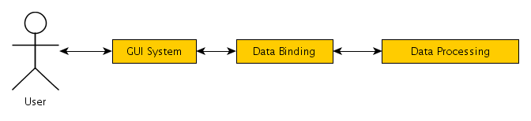
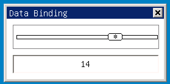
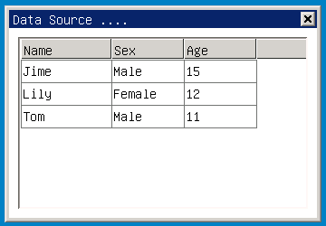

# Chapter 1 of Part 2 Quick Start

## helloworld Program of mGNCS

mGNCS packages the main window of MiniGUI and brings it into the control 
system, therefore, the whole programming will become very simple and easy to
learn. Please look at the helloworld program source codes based on mGNCS:

##### List 1 `helloworld.c`

```cpp
%INCLUDE{"%ATTACHURL%/helloworld.c.txt"}%
```

The program creates a 300x200 main window on the screen and displays “Hello,
world!”: 


##### Figure 1 Output of helloworld program

### Head File

Besides the four head files of MiniGUI (`<minigui/common.h>`, 
`<minigui/minigui.h>`, `<minigui/gdi.h>` and `<minigui/window.h>`), `helloworld.c` 
shall contain its specific file:

- `<mgncs/mgncs.h>`: mGNCS head file

Therefore, normally, head file of a mGNCS program is:

```cpp
%INCLUDE{"%ATTACHURL%/helloworld.c.txt" pattern="^.*?// START_OF_INCS(.*?)// END_OF_INCS.*"}%
```

### Create the Main Window

Same as common MiniGUI program, the entrance point of mGNCS program is also
`MiniGUIMain?`. However, before using mGNCS, it is a must to call 
`ncsInitialize` to register the control of NCS to MiniGUI:

```cpp
    ncsInitialize ();
```

Afterwards, a main window can be directly created through calling
`ncsCreateMainWindow` function, which has many parameters, but a lot of default
parameters can be used for creating default window:

```cpp
    mWidget* mymain = ncsCreateMainWindow (
        NCSCTRL_MAINWND,    // Class name of the main window, class name macro of NCS control starts with NCSCTRL_
         "Hello World!",     // Title text of the appointed main window
         WS_CAPTION | WS_BORDER | WS_VISIBLE, // Style of the appointed window, create a visible window with title bar and border
         WS_EX_NONE,         // Extension style of appointed main window, use 0 or WS_EX_NONE to show that there is no extension style
         1,                  // Identifier value of the appointed main window, any integer value >0
         0, 0, 300, 200,     // Location and size of the appointed main window, x, y, width and height by sequence
        HWND_DESKTOP,       // Host of the appointed main window, which usually is HWND_DESKTOP
        0, 0,               // Icon and menu bar sentence handle of the main window, empty by default
         NULL,               // Initial property information of the appointed main window, empty by default
         NULL,               // Initial renderer information of the appointed main window, empty by default
         mymain_handlers,    // Event handler of the appointed main window, see the next section
         0);                 // Additional data of the appointed main window, 0 here

```

The most important parameter in the text above is event handler

`ncsCreateMainWindow` function returns a window object pointer (mWidget*), and
the object is set as pointer of the control basic class for the convenience of
the users’ use.

`mWidget` structure provides a hwnd data member, which is window sentence 
handle associated with the window object. Users can directly use the sentence
handle to call corresponding MiniGUI `API`.

### Event Handler

To make the window operates, it is a must to respond to the message of the
window. NCS provides a mapping mechanism, which associates an event (message or
notification code) with a callback function. Formats of callback functions of
different events are different, and NCS has defined interfaces for each event 
in advance for the convenience of use.

Multiple mappings can be placed in a `NCS_EVENT_HANDLER` array (the array ends
with {0,NULL}), and are transferred to the control when window is created.

In the example, we mainly pay attention to two message events:
- `MSG_PAINT`
- `MSG_CLOSE`

Prototypes of the event handlers that the two messages correspond to are:

```cpp
 /**
 * \typedef void (*NCS_CB_ONPAINT)(mWidget*, HDC hdc, const PCLIPRGN clip_rgn);
 * \brief the callback of event MSG_PAINT
 *
 * \param mWidget * sender pointer
 * \param hdc the DC for painting
 * \param clip_rgn invlidate region
 *
 */
typedef void (*NCS_CB_ONPAINT)(mWidget*, HDC hdc, const PCLIPRGN clip_rgn);

/**
 * \typedef  BOOL (*NCS_CB_ONCLOSE)(mWidget*);
 * \brief the callback of event MSG_CLOSE
 *
 * \param mWidget* the sender pointer
 *
 * \return TRUE - about the message process, FALSE - continue default processing
 */
typedef BOOL (*NCS_CB_ONCLOSE)(mWidget*);
```

Therefore, we define the two functions, and establish mapping array of the 
event and event handler:

```cpp
%INCLUDE{"%ATTACHURL%/helloworld.c.txt" pattern="^.*?(// START_OF_HANDLERS.*?// END_OF_HANDLERS).*"}%
```

We can see that compared to MiniGUI common program, mGNCS avoids the use of
multi-layer switch-case nested statement, making it unnecessary for developers
to memorize the meanings of complicated `WPARAM` and `LPARAM` and meaning of
returned value of event handling process.

If miniStudio is used, the above codes can be generated automatically. What the
user needs to do is to implement the corresponding event handler (callback
function). 

### Message Circulation

Finally, to make the program runs, a message circulation is needed, same as for
common MiniGUI programming:

```cpp
%INCLUDE{"%ATTACHURL%/helloworld.c.txt" pattern="^.*?(// START_OF_MSGLOOP.*?// END_OF_MSGLOOP).*"}%
```

### Create Modal Main Window

We know that the main window is divided into modal and non-modal. The above
example program establishes a standard non-modal main window. If we hope to
create modal main window, we only need to use `doModal` to replace the existing
message circulation, as shown below:

```cpp
%INCLUDE{"%ATTACHURL%/helloworld_domodal.c.txt" pattern="^.*?(// START_OF_MINIGUIMAIN.*?// END_OF_MINIGUIMAIN).*"}%
```

In the above codes

- The effect of _c macro is to take out the class structure (mMainWndClass)
pointer stored by mymain. Because `doModal` is a virtual function of `mMainWnd`
class, it is stored in virtual function table (case of `mMainWndClass`).
- The first parameter of `doModal` method is `mMainWnd*` self, similar to this
pointer in C++. The second parameter `BOOLautoDestroy` tells if `doModal` 
method automatically deletes dialog box object. When the parameter is `TRUE`,
after calling `doModal`, mymain will be released and cannot be used.

## Further Use Template to Create Main Window and Control

We know that MiniGUI provides the function of dialog box template, using
template, control and main window can be defined in the form of data structure,
thus helping with simplifying the compilation of application programs. Based on
MiniGUI, NCS defines window template structure containing more messages, which
is more complicated compared to `DLGTEMPLATE` of MiniGUI, but is more 
convenient for programming. It needs to be noted that the window template of 
NCS is normally automatically generated by miniStudio according to UI designed
by the user. More complicated window template structure will help NCS better
load window from the resource files generated by miniStudio. Although template
is not aiming at developers, we need to know the definition and usage of window
template. 

Codes in list p2c1-3 demonstrate how to use template to create a dialog box as
shown in the figure below, and demonstrate how to use property and renderer.


##### Figure 2 Dialog Box Created Using Window Template

##### List 3 `wnd_template.c`

```cpp
%INCLUDE{"%ATTACHURL%/wnd_template.c.txt"}%
```

The program defines a dialog box containing three controls:
- For the progress bar above, its maximum value and minimum value are set in
initialization, and its current location will be refreshed periodically;
- The left button uses fashion renderer, and draws with default property;
- The right button uses flat renderer, and draws with default property.

### Template

Function `ncsCreateMainWindowIndirect` creates corresponding main window
according to the template. In the above program, the template is 
`mymain_templ.` The type of `mymain_templ` is `NCS_MAINWND_TEMPLATE`, and a
pointer points to the template structure array (`NCS_WND_TEMPLAT*`) of the 
child control. The difference between `NCS_WND_TEMPLATE` and
`NCS_MAINWND_TEMPLATE` is that the former does not have the data member
specially used for the main window such as `HICON` and `HMENU`.

Declaration of `mymain_templ` is as follows:

```cpp
static NCS_MAINWND_TEMPLATE mymain_templ = {
    NCSCTRL_DIALOGBOX,              // Window class name, NCSCTRL_DIALOGBOX is taken here
    1,                              // Window identifier
    0, 0, 320, 110,                 // Window location and size
    WS_CAPTION | WS_BORDER | WS_VISIBLE,   // Window style
    WS_EX_NONE,                     // Extension style of the window
    "Window Template",              // Window title
    NULL,                           // Initialization property
    NULL,                           // Renderer information
    mymain_handlers,                // Window event handler
    _ctrl_templ,                    // Template structure array pointer of the child window
    sizeof(_ctrl_templ)/sizeof(NCS_WND_TEMPLATE),   // Number of the child window
    0, 0, 0                         // Additional data of the window, icon sentence handle and menu bar sentence handle
};
```

It needs to be noted that `NCS_WND_TEMPLATE` also contains a pointer member
pointing to child control template structure array, thus multi-level nested
template can be formed.

### Set Window Property

In the example, we define the initial property values of the progress bar
control through `NCS_PROP_ENTRY` structure array, which include:
- Maximum value of the progress bar
- Minimum value of the progress bar.
- Step value of the progress bar
- Initial location of the progress bar.


Concrete codes are as below:

```cpp
%INCLUDE{"%ATTACHURL%/wnd_template.c.txt" pattern="^.*?// START_OF_PROPERTIES(.*?)// END_OF_PROPERTIES.*"}%
```

Pay attention to the last member {0, 0} in the above structure array, and NCS
shows the end of property information through defining an all null structure.

When defining control, just endow the corresponding window template property
member with pointer of the above property structure array, as shown below:

```cpp
static NCS_WND_TEMPLATE _ctrl_templ[] = {
    {
        NCSCTRL_PROGRESSBAR, 
        ID_PROG,
        10, 10, 290, 30,
        WS_BORDER | WS_VISIBLE,
        WS_EX_NONE,
        "",
        progress_props,
        NULL,
        NULL, NULL, 0, 0
    },
    ...
};
```

If MiniGUI intrinsic control set is used, to implement this function, it is a
must to call `SendMessage`? in `MSG_INITDIALOG` message of the dialog box. 
While in the new control set, it is only necessary to set a `NCS_PROP_ENTRY`
array, and the function can be implemented automatically. It is not only for
reducing code amount and simplifying programming, more importantly, it provides
a uniform interface. Users can store the initial information into the external
files in a unified way through this interface. Resources management module of
NCS can finish similar functions, and miniStudio utilizes this convenience.

### Dynamically Set the Property

Property can be dynamically set in the program running process. It can be
implemented through `setProperty` (inherited and implemented by its child 
class) of `mComponentClass` (this is visible component, which is basic class of
control and invisible component). Similarly, there is `getProperty` method,
which is used to get value of given property. Prototypes of the two methods are
as below:

```cpp
    BOOL (*setProperty) (clss *self, int id, DWORD value);
    DWORD (*getProperty) (clss *self, int id);
```

It needs to be noted that all the property values are defined as `DWORD` type,
which is a 32 bit value, and can be used to store sentence handle, pointer and
integer value etc.

In the whole example program, we create a timer to set the current location
property of the progress bar periodically. In the processing function of the
timer, the following code calling is done:

```cpp
%INCLUDE{"%ATTACHURL%/wnd_template.c.txt" pattern="^.*?// START_OF_ONTIMER(.*?)// END_OF_ONTIMER.*"}%
```

## Use Renderer

Renderer is a big feature of the new control set. Its main functions are:
1. On the foundation of not changing the realization of internal logic of the
control, customize the look and feel of the control
1. Renderers change along with the variety changes of the controls, and adding
and deleting a control will not generate effect on other controls, in this
respect, they are different from the renderers of the old control set

As users of control, developers don’t need to implement a complete renderer, 
but only need to use the due renderer. The above example uses the method 
similar to window template to define information of the renderers used by a
control. 

```cpp
%INCLUDE{"%ATTACHURL%/wnd_template.c.txt" pattern="^.*?// START_OF_RDRINFO(.*?)// END_OF_RDRINFO.*"}%
```

- `btn_rdr_elements` defines property array of the renderer. Property of
renderer is similar to the property of control, and the mechanisms are
completely the same. It has {-1,0} as the end of the array, and 
`NCS_MODE_USEFLAT` property points out that fashion renderer uses flat style
(comparative, with obvious stereoscopic impression under 3D style) to draw an
object. 
- `NCS_RDR_INFO` of btn1_rdr_info points out the types of renderers used by the
control and their property list. Definition of `NCS_RDR_INFO` is as follows:

```cpp
/**
 * A renderer element struct
 *
 * \note This struct is used by \ref NCS_RDR_INFO when create a NCS widget
 *
 * \sa NCS_RDR_INFO
 */
typedef struct _NCS_RDR_ELEMENT {
    /**
     * The renderer element id
     */
    int id;
    /**
     * The remderer element value
     */
    DWORD value;
}NCS_RDR_ELEMENT;

/**
 * A struct used to include all the renderer info when create a widget
 * 
 * \sa NCS_CREATE_INFO, NCS_MAIN_CREATE_INFO, NCS_WND_TEMPLATE, 
 *     NCS_MAINWND_TEMPLATE
 */
typedef struct _NCS_RDR_INFO {
    /**  
     * The global renderer, the minigui 3.0 defined renderer
     */
    const char* glb_rdr;
    /**  
     * The control renderer, defined by NCS
     */
    const char* ctl_rdr;
    /**  
     * The Renderer element array, end by  { -1, 0} 
     */
    NCS_RDR_ELEMENT* elements;
}NCS_RDR_INFO; 
```

Among them,
- `glb_rdr` refers to global renderer, mainly used for the drawing style of non
client areas. MiniGUI is responsible for drawing these areas.
- `ctrl_rdr` refers to control renderer, mainly used for the drawing of control
itself. 


`NCS_RDR_INFO` can be given in the template, thus control using given renderer
can be created directly.

## Event Listening and Connection

mGNCS provides a signal and slot mechanism similar to `QT`, which is able to
link the event of an object to any object.

### Basic Principle

Event listening link mechanism of mGNCS provides a mode to decouple the event
sender and event observer. It corresponds to the relation between the sender 
and the receiver through global data sheet. As shown in the figure below:


##### Figure 3 Event Listening and Connection

When an object is deleted:
- All the connections listening to the object will be deleted
- Connections that the object listens to will also be deleted

### Main Interface Functions

Interfaces adding event listener are given below:

```cpp
/**
 * \typedef typedef BOOL (*NCS_CB_ONOBJEVENT) (mObject* self, mObject *sender, 
                          int event_id, DWORD param);
 * \brief The callback of connection
 *
 * \note For widgets, only support notification
 *
 * \param self  The listener pointer
 * \param sender The sender of event
 * \param event_id the id of event
 * \param param the param of event
 *
 * \return TRUE - continue dispatch the event; FALSE - stop the event.
 */
typedef BOOL (*NCS_CB_ONOBJEVENT)(mObject* self, mObject *sender, 
                                  int event_id, DWORD param);

#define NCS_CB_ONPIECEEVENT NCS_CB_ONOBJEVENT

/**
 * \fn BOOL ncsAddEventListener(mObject *sender, \
 *                     mObject* listener, \
 *                     NCS_CB_ONOBJEVENT event_proc, \
 *                     int event_id);
 * \brief connect sender object to listener object
 * 
 * \param sender The sender of event
 * \param listener The listener of event
 * \param event_proc The processing callback of event
 * \param event_id The id of event
 *
 * \return TRUE - Sucessed, FALSE - Failed
 * 
 * \sa ncsAddEventListener, ncsAddEventListeners, NCS_CB_ONOBJEVENT
 */
BOOL ncsAddEventListener(mObject *sender,
    mObject* listener,
    NCS_CB_ONOBJEVENT event_proc,
    int event_id);

/**
 * BOOL ncsAddEventListeners(mObject *sender,\
 *                     mObject* listener,\
 *                     NCS_CB_ONOBJEVENT event_proc,\
 *                     int* event_ids);
 * \brief connect a group of events from sender to listener
 *
 * \param sender The sender of events
 * \param listener The listener of events
 * \param event_proc The processing callback of events
 * \param event_ids The id array of events, end by 0
 *
 * \return TRUE - Sucessed, FALSE - Failed
 * 
 * \sa ncsAddEventListener, ncsAddEventListeners, NCS_CB_ONOBJEVENT
 */
BOOL ncsAddEventListeners(mObject *sender,
    mObject* listener,
    NCS_CB_ONOBJEVENT event_proc,
    int* event_ids);
```

Among them,
- Callback `NCS_CB_ONOBJEVENT` defines the processing function of event, which
can get object pointers of the sender and receiver simultaneously, making it
unnecessary for the users to find
- `ncsAddEventListeners` adds listening of an object to a group of events of
another object
- `ncsAddEventListener` adds listening of an object to a single event of 
another object

Interfaces deleting event listener are given below:

```cpp
/**
 * \fn BOOL ncsRemoveEventListener(mObject * listener);
 * \brief remove the connections which are listened by the object
 *
 * \note this function is called when a listener is destroied
 *
 * \param listener the object pointer of listener
 *
 * \return TRUE - sucessed; FALSE - failed
 */
BOOL ncsRemoveEventListener(mObject * listener);

/**
 * \fn BOOL ncsRemoveEventSource(mObject *sender);
 * \brief remove the connections when a sender is destroied
 *
 * \note this function is called when a sender is destroied
 *
 * \param sender the sender of events
 *
 * \return TRUE - sucessed; FALSE - failed
 */
BOOL ncsRemoveEventSource(mObject *sender);
```

Among them,
- Delete a listener or event sender. Because as long as either listener or
sender does not exist, the whole connection does not have the sense of 
existence and will be deleted.
- The two functions are automatically called by `mOBject`, and normally active
calling is not needed

Interfaces exciting an event connection are given below:

```cpp
/**
 * \fn void ncsRaiseEvent (mObject *sender, int event_id, DWORD param);
 * \biref Raise an event to listeners
 *
 * \note It will call the callback of \ref NCS_CB_ONOBJEVENT 
 *       added by \ref ncsAddEventListeners, or \ref ncsAddEventListener
 *
 * \param sender event sender
 * \param event_id the id of event
 * \param param the event param
 *
 * \sa NCS_CB_ONOBJEVENT, ncsAddEventListener, ncsAddEventListeners
 */
void ncsRaiseEvent(mObject *sender, int event_id, DWORD param);
```

The function is mainly for internal use, which is used for exciting an event
connection. The interface is only used when the user hopes to manually and
forcedly initiate event or compile NCS control.

### Usage and Example

Based on window template example program, we will add the following two event
listeners: 
- When clicking the Stop button, automatic update of the progress bar will be
stopped through shutting off the timer;
- When clicking the Exit button, the whole dialog box will be closed.

Effect of the window created by the program is as shown in the figure below:


##### Figure 4 Example of Listening Event

The following codes define two listeners, which are used for Stop button and
Exit button respectively:

```cpp
%INCLUDE{"%ATTACHURL%/event_listener.c.txt" pattern="^.*?// START_OF_EVENTLISTENER(.*?)// END_OF_EVENTLISTENER.*"}%
```

When the window is initialized, the two event listeners are connected to the
clicking events of the above two controls:

```cpp
%INCLUDE{"%ATTACHURL%/event_listener.c.txt" pattern="^.*?// START_OF_HANDLERS(.*?)// END_OF_HANDLERS.*"}%
```

Obviously, event listener mechanism brings more convenience to the programming
of the new control set, and it is convenient for miniStudio tool to implement
visual programming.

## Data Binding and Data Source

Data binding and data source are two very important mechanisms that mGNCS
provides to the applications, which are helpful for realizing separation 
between the program logic and the data that it processes, and it is convenient
for visual GUI design tools such as miniStudio to design interface. This 
chapter will simply explain the basic concepts of data binding and data source,
and the next chapter will explain related interfaces and usages in detail.

If the reader ever used Visual Studio to develop C++ applications based on 
`MFC`, he must remember that the tool provides a mechanism, which can bind the
control content in the dialog box with the given class member variable. In 
`VC`, initialization value of the dialog box control can be automatically
obtained and set from the bound dialog box member variable, while when the
dialog box exits, value in the control can be automatically assigned to
corresponding dialog box class member variable. This is the idea source of data
source and data binding functions provided by mGNCS. However, the data source
and data binding functions provided by mGNCS are stronger. Utilizing data
binding function of mGNCS, when the value of mGNCS control changes, we can
automatically update other controls or store the data into the expected data
source again. Through the data source of mGNCS, we can define data source of
different formats, such as character string array defined by the program, text
file, configuration file, even database etc., and use these data to
automatically fill in mGNCS control.

Next, let's introduce data binding and data source functions of mGNCS
respectively. 

### Data Binding

If we try to find the identical point between graphic user interface and
character user interface, we will find that both of them fall into the category
of human computer interaction, while the nature of human computer interaction 
is that data is converted between the mode that human can understand and the
mode that computer can understand. Note that the above statement has three key
words: 

- Data
- Mode that human can understand
- Mode that computer can understand

We know that the nature of computing is computing of data, and data is the core
of all computing, For computer, mode is format of data. Human computer 
interface interacts with human through displaying data of specific format, 
while when computer carries out internal computing, it hopes to compute in the
format that it can understand. When the two formats don’t match, what shall we
do? The answer is data binding. The figure below gives the model of NCS data
binding: 



##### Figure 5 Data Binding Model of mGNCS

Data binding transfers data between the graphic user interface and internal
logic, and its advantages are:

- Decouple processing of graphic user interface and internal logic, making it
easier for the developers to change interface
- Standardize and modularize applications, and enhance the extensibility of
programs 
- Simplify programming, free the programmers from tedious Get/Set operations
- Unify interfaces, which is good for tools such as miniStudio etc, to carry 
out visual operation and is good for user abstracting

The disadvantage is that extra expenditure is needed. However, codes of the
operation interface themselves will bring expenditure. With the two balanced
out, using data binding is very worthwhile.

List 5 gives a simple data binding example program, and interface of the
program is as shown in the figure below:



##### Figure 6 Data Binding Example Program

The program binds the content in the edit box with the location of the track 
bar together:

- Drag the track bar, and the content in the edit box will change automatically
to reflect the current track bar location;
- Key an integer value (0-20) in the edit box, and the current location of the
track bar will change correspondingly.

##### List 5 `data_binding.c`

```cpp
%INCLUDE{"%ATTACHURL%/data_binding.c.txt"}%
```

Finish the above data binding, and the program only does the setting work as
shown below when the dialog box is created:

```cpp
%INCLUDE{"%ATTACHURL%/data_binding.c.txt" pattern="^.*?// START_OF_BINDING(.*?)// END_OF_BINDING.*"}%
```

The above code segments finish two things:
- Calling `ncsConnectBindProps` function binds the current location value
property (`NCSP_TRKBAR_CURPOS`) of the track bar with the text property
(`NCSP_WIDGET_TEXT`) of the edit box. And binding is triggered when the 
location generated by the track bar changes the event (`NCSN_TRKBAR_CHANGED`) 
or the content generated by the edit box changes the event (NCSN_EDIT_CHANGE).
- Calling `ncsAutoReflectObjectBindProps` function enables the edit box to
automatically respond to the content change brought by data binding.

Assuming that there is no data binding function, we need to compile two event
handlers to correspond to the two events of the two controls respectively, 
while every thing becomes very simple now.

It needs to be noted that location value property of the track bar is integer
type, while the content property of the edit box is character string type, and
data type conversion between the two will be automatically completed by mGNCS.

### Data Source
Data source is the set of data. Through abstract data source interface, we can
provide good data exchange mechanism for large controls such as list box, list
type etc. The sense of defining abstract data source interface is:
- Manage data in a unified way, and it is separation between interface and data
- Unify data accessing interface, making it convenient for the development and
maintenance of programs and for miniStudio tool to carry out visual processing

At present, mGNCS implements supports to the following types of data sources:
- C language data defined by applications, mGNCS refers to it as static data
source; 
- Text data from MiniGUI configuration file format
- Text field data with row as the unit from files such as `UNIX` passwd.

Codes in list p1c2-6 uses the static data defined by C program to initialize a
list item control, as shown in the figure below:



##### Figure 7 Data Source Example Program

##### List 6 `data_source.c`

```cpp
%INCLUDE{"%ATTACHURL%/data_source.c.txt"}%
```

To implement the above data source function, the program completes work in the
following three aspects:

First step, define data source:

```cpp
%INCLUDE{"%ATTACHURL%/data_source.c.txt" pattern="^.*?// START_OF_DEFINEDS(.*?)// END_OF_DEFINEDS.*"}%
```

The above codes define the header information and content data of list control

Second step, Register data source:

```cpp
%INCLUDE{"%ATTACHURL%/data_source.c.txt" pattern="^.*?// START_OF_REGDS(.*?)// END_OF_REGDS.*"}%
```

The above codes define the two kinds of data into “listview/header” and
“listview/content”. When it is necessary to quote the two kinds of data, just
use the names given here.

Third step, use data source

```cpp
%INCLUDE{"%ATTACHURL%/data_source.c.txt" pattern="^.*?// START_OF_SETDATA(.*?)// END_OF_SETDATA.*"}%
```

The above codes get corresponding data from the data source and then call
`setSpecificData` method of list control to set.

## Brief Summary

Through study of this chapter, we can have an overall understanding of mGNCS.
Compared to MiniGUI intrinsic control system, mGNCS reconstructs the control
system of MiniGUI, making it more standardized and easier for customization. In
addition, this design adapts to miniStudio integrated development environment 
of MiniGUI application development, and relation between the two is mutually
complementing. 

Compared to the intrinsic control system of MiniGUI, mGNCS introduces
object-oriented design idea, greatly enhancing the customizability and
extensibility of MiniGUI, and making it convenient for visual design. Of 
course, for application development personnel, it brings longer study path, but
I believe that through explanation of this programming guide, any development
personnel mastering MiniGUI application development can rapidly master mGNCS. 
Of course, the original intention of designing and introducing mGNCS is to
develop better design tool, which is miniStudio, while most of the functions 
can be obtained through visual design in miniStudio. Undoubtedly, using mGNCS
matched with miniStudio, development efficiency of embedded graphic interface
applications will be greatly enhanced.

[Next](MStudioMGNCSV1dot0PGENP1C2][Previous]] < [[MStudioMGNCSV1dot0PGEN][Index]] > [[MStudioMGNCSV1dot0PGENP2C2)


-- Main.XiaodongLi - 24 Feb 2010


----

[&lt;&lt; ](MiniGUIProgGuidePart.md) |
[Table of Contents](README.md) |
[ &gt;&gt;](MiniGUIProgGuidePart.md)

[Release Notes for MiniGUI 3.2]: /supplementary-docs/Release-Notes-for-MiniGUI-3.2.md
[Release Notes for MiniGUI 4.0]: /supplementary-docs/Release-Notes-for-MiniGUI-4.0.md
[Showing Text in Complex or Mixed Scripts]: /supplementary-docs/Showing-Text-in-Complex-or-Mixed-Scripts.md
[Supporting and Using Extra Input Messages]: /supplementary-docs/Supporting-and-Using-Extra-Input-Messages.md
[Using CommLCD NEWGAL Engine and Comm IAL Engine]: /supplementary-docs/Using-CommLCD-NEWGAL-Engine-and-Comm-IAL-Engine.md
[Using Enhanced Font Interfaces]: /supplementary-docs/Using-Enhanced-Font-Interfaces.md
[Using Images and Fonts on System without File System]: /supplementary-docs/Using-Images-and-Fonts-on-System-without-File-System.md
[Using SyncUpdateDC to Reduce Screen Flicker]: /supplementary-docs/Using-SyncUpdateDC-to-Reduce-Screen-Flicker.md
[Writing DRI Engine Driver for Your GPU]: /supplementary-docs/Writing-DRI-Engine-Driver-for-Your-GPU.md
[Writing MiniGUI Apps for 64-bit Platforms]: /supplementary-docs/Writing-MiniGUI-Apps-for-64-bit-Platforms.md

[Quick Start]: /user-manual/MiniGUIUserManualQuickStart.md
[Building MiniGUI]: /user-manual/MiniGUIUserManualBuildingMiniGUI.md
[Compile-time Configuration]: /user-manual/MiniGUIUserManualCompiletimeConfiguration.md
[Runtime Configuration]: /user-manual/MiniGUIUserManualRuntimeConfiguration.md
[Tools]: /user-manual/MiniGUIUserManualTools.md
[Feature List]: /user-manual/MiniGUIUserManualFeatureList.md

[MiniGUI Overview]: /MiniGUI-Overview.md
[MiniGUI User Manual]: /user-manual/README.md
[MiniGUI Programming Guide]: /programming-guide/README.md
[MiniGUI Porting Guide]: /porting-guide/README.md
[MiniGUI Supplementary Documents]: /supplementary-docs/README.md
[MiniGUI API Reference Manuals]: /api-reference/README.md

[MiniGUI Official Website]: http://www.minigui.com
[Beijing FMSoft Technologies Co., Ltd.]: https://www.fmsoft.cn
[FMSoft Technologies]: https://www.fmsoft.cn
[HarfBuzz]: https://www.freedesktop.org/wiki/Software/HarfBuzz/
