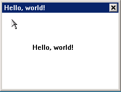

# Renderer and Resources Management

## Look and Feel Renderer

The full name of renderer is “look and feel renderer”, which is developed from
MiniGUI 3.0.

Renderer separates the management logic of window from drawing of window.
`MiniGUi` is only responsible for managing window, while renderer finishes
drawing of window non-client area. Concept of renderer is similar to the 
concept of skin or theme. The differences are:
1. MiniGUI provides special renderer interface, which is implemented by 
concrete renderer
1. Renderer is composed of a group of interface realizations and a group of
property definitions
1. Renderer can be applied to the global, having effect on all the windows; it
can also be applied to a special window instance

MiniGUI itself provides a group of renderer interfaces, which are based on the
window itself, and known as the category of system renderer or global renderer.
NCS provides renderer interface for each control, and different controls have
different interfaces. It falls into the category of control renderer.

### Common properties of the Renderer

| *Property* | *Type* | *Explanation* |
| `RDR_3DBODY_FGCLR` | `DWORD(MakeRGBA`) | 3D object foreground color |
| `RDR_3DBODY_BGCLR` | `DWORD(MakeRGBA`) | 3D object background color |
| `RDR_CLIENT_FGCLR` | `DWORD(MakeRGBA` | Window client area foreground color |
| `RDR_CLIENT_BGCLR` | `DWORD(MakeRGBA` | Window client area background color |
| `RDR_SELECTED_FGCLR` | `DWORD(MakeRGBA`) | Foreground color of the selected object |
| `RDR_SELECTED_BGCLR` | `DWORD(MakeRGBA`) | Background color of the selected object |
| `RDR_SELECTED_LOSTFOCUS_CLR` | `DWORD(MakeRGBA`) | Color of the object losing focus |
| `RDR_DISABLE_FGCLR` | `DWORD(MakeRGBA`) | Foreground color of disabled object |
| `RDR_DISABLE_BGCLR` | `DWORD(MakeRGBA`) | Background color of disabled object |
| `RDR_HIGHLIGHT_FGCLR` | `DWORD(MakeRGBA`) | Foreground color of the hilight object |
| `RDR_HIGHLIGHT_BGCLR` | `DWORD(MakeRGBA`) | Background color of the hilight object |
| `RDR_METRICS_BORDER` | int | Border Size |
| `RDR_FONT` | `PLOGFONT` | Logic font used by the window |
| `RDR_BKIMAGE` | `PBITMAP` | Window background image |
| `RDR_BKIMAGE_MODE` | enum `ImageDrawMode` | Window drawing mode |

## Resources Management

In the new control set, as an independent module, resources management module 
is mainly responsible for managing the resource package, including the 
functions of loading, accessing and unloading the resource package. When it
accesses the resources, it gets the content needed through appointing the
resource package where the resource lies in and information such as the unique
identifier (ID) of the resource etc.

Resource package is the concept brought forward in order to manage all kinds of
resources effectively in a unified way and unifying the mapping of resource and
resource identifier (ID). A resource package can contain multiple kinds of
resource types, such as image, string and UI resource etc. Resource package
brings the following advantages to the management of resources.

Before understanding resources management, it is necessary to understand the
following two basic concepts:
- *Resource package* : Set of resources, resource set of any kind and any
number, which is the minimum unit of resource replacement.
- *Resource ID : Unique identifier for accessing certain resource in the
resource package.

Compared to MiniGUI intrinsic control set, resources management module provided
by mGNCS has many advantages. For example:
- Separation of resources management from application codes.
- Management interfaces of all kinds of resources are unified, making it more
convenient and rapid to access resources is.
- Through simple replacement of resource package, effects can be realized, such
as multi-language, multi-style and skin change etc. .
- Resources deployment is simpler.
- Matched with visual tool miniStudio, it is convenient to generate resource
package containing all kinds of resources.

Resources management of mGNCS mainly implements all kinds of management and
accessing to resources surrounding the resource package. If you want to access
certain resource correctly, you only need to know the resource package where it
is and corresponding resource `ID`. The overall accessing process is normally:
1. Load the specified resource package.
1. Get resource through resource `ID`.
1. Use resource, for certain resources, it is necessary to release the resource
after use.
1. Unload resource package

Resource types that the current resource package supports are:
| * Resource Type `ID` *|* Explanation *|* Remark *|
| `NCSRT_UI` | UI window resource | Description information of the main window and control, such as window style, size, title and property etc |
| `NCSRT_STRING` | String resource | Fixed system constant string such as file name, renderer name and control class name etc |
| `NCSRT_TEXT` | Text resource | Text string and locale information specified by the user on UI interface |
| `NCSRT_IMAGE` | Image resource | Information of bmp, png and jpg images |
| `NCSRT_RDR` | Renderer resource | Information of setting the window element look and feel properties of the specified window renderer |
| `NCSRT_RDRSET` | Renderer set resource | Set of renderer resources of the same class |
| `NCSRT_BINARY` | User defined resource | Resource of user defined format |

### Resource Interface

#### Access Resource Package

Resource package is divided into built-in format and external file. No matter
which, it is necessary to firstly load resource package when the system starts,
and then access the internal resource, and finally unload the resource package
correctly after the system exits,. When accessing non built-in resource 
package, it is necessary to use the following interfaces:

```cpp
HPACKAGE ncsLoadResPackageFromFile (const char* fileName);
#define ncsLoadResPackage  ncsLoadResPackageFromFile
void ncsUnloadResPackage (HPACKAGE package);
```

`ncsLoadResPackage` is responsible for loading resource package, and
`ncsUnloadResPackage` is responsible for unloading resource package. The two
need to be used in pairs.

If the resource package that need to be loaded is built-in memory format, it is
necessary to firstly get memory resource package information interface
(ncsGetIncoreResPackInfo), return the concrete information of the memory
resource package, and then use the interface (ncsLoadResPackageFromMem) loading
resource package from the memory to load resource package, and finally use the
same unload interface (ncsUnloadResPackage) as provided above to unload 
resource package. `NcsGetIncoreResPackInfo` interface is provided by built-in
conversion tool, which is generated when using the built-in tool to convert the
specified resource package file to built-in resource, and application does not
need to care about its realization.

```cpp
extern BOOL ncsGetIncoreResPackInfo(char **addr, int *size);
HPACKAGE ncsLoadResPackageFromMem (const void* mem, int size);
```

These are the example codes of loading resource package file:
```cpp
    sprintf(f_package, "%s", "resmgr_demo.res");
    SetResPath("./");

    hPackage = ncsLoadResPackage (f_package);
    if (hPackage == HPACKAGE_NULL) {
        printf ("load resource package:%s failure.\n", f_package);
        return 1;
    }
```

These are the example codes of unloading resource package file:
```cpp
    ncsUnloadResPackage(hPackage);
```

#### Get and Set Locale

To set and get locale conveniently, resource management module provides the
following two interfaces:
```cpp
const char* ncsSetDefaultLocale (char* language, char* country);
const char* ncsGetDefaultLocale(void);
```

The setting interface is only valid to the resource got through the resource
package after setting, and the two parameters represent the language code and
country code:
- language code is represented by two English lower case letters.
- country code needs to be represented by two to three English lower case
letters. 

If setting American English as default locale, it can be implemented through 
the following statement:
```cpp
ncsSetDefaultLocale("en", "US");
```

The getting interface returns current locale information, and format of the
information is: `language_country.`

Attach:

`ISO639` Language Codes Comparison Table [language](%ATTACHURL%/language.txt)

`ISO3166` Country Codes Comparison Table [country](%ATTACHURL%/country.txt)

#### Create Window UI

When the resource package is used, the creating main window interface provided
by mGNCS is more simple compared to creating main window of MiniGUI. 
Description of the look and feel information of the main window is stored in 
the resource package, and the interface can start the interface through window
resource `ID`.
- owner parameter refers to the hosting window;
- For `hIcon` and `hMenu`, 0 by default;
- handlers and connects are the event listening and connection associated with
the window resource `ID` defined by the user;
- `user_data` is additional data, 0 by default.

```cpp
mMainWnd* ncsCreateMainWindowIndirectFromID (HPACKAGE package,
                    Uint32 wndId, HWND owner, HICON hIcon,
                    HMENU hMenu, NCS_EVENT_HANDLER_INFO* handlers,
                    NCS_EVENT_CONNECT_INFO *connects,
                    DWORD user_data);
```

The method of creating dialog box through window resource `ID` is similar to 
the main window. Creating interface through resource `ID`, the parameter 
meaning is also similar to the interface of the main window created above:

```cpp
int ncsCreateModalDialogFromID (HPACKAGE package, Uint32 dlgId,
                    HWND owner, HICON hIcon, HMENU hMenu,
                    NCS_EVENT_HANDLER_INFO* handlers, NCS_EVENT_CONNECT_INFO *connects);
```

Create example codes of UI main window through the resource package:

```cpp
    return ncsCreateMainWindowIndirectFromID(package,
        ID_MAINWND1,
        hParent,
        h_icon,
        h_menu,
        mainwnd_Mainwnd1_handlers,
        NULL,
        user_data);
```

#### Get Character String

The method of getting string through resource package is very simple. It is 
only necessary to transfer the resource `ID` to interface `ncsGetString`, and
the management module will return the default locale string to the application
according to the current locale information.

```cpp
const char* ncsGetString (HPACKAGE package, Uint32 resId);
```

Get example codes of string through resource package:

```cpp
    SetDefaultWindowElementRenderer(ncsGetString(hPackage, NCSRM_SYSSTR_DEFRDR));
```

- Note: mGNCS reserves the `ID` value from `NCSRM_SYSSTR_BASEID` to
`NCSRM_SYSSTR_MAXID` as the system `ID`, and public definitions can be 
returned, such as default renderer: `NCSRM_SYSSTR_DEFRDR`

#### Get Bitmap

Resources management module provides the function of getting corresponding file
name through bitmap `ID`, making it convenient for the upper layer applications
to directly use the bitmap provided by MiniGUI to load related interface
operation bitmap after getting the file name:

```cpp
const char* ncsGetImageFileName (HPACKAGE package, Uint32 resId);
```

Besides using MiniGUI related interface to access the bitmap, mGNCS also
provides the interface to get bitmap object directly through resource `ID`.
After the upper layer applications use the bitmap resource provided by the
interface, it is necessary to release the bitmap object through corresponding
release interface. This is valid for setting independent bitmap and setting
dependant bitmap.

```cpp
//Set dependant bitmap interface
int ncsGetBitmap(HDC hdc, HPACKAGE package, Uint32 resId,  PBITMAP pBitmap);
void ncsReleaseBitmap (PBITMAP pBitmap);

//Set independant bitmap interface
int ncsGetMyBitmap(HPACKAGE package, Uint32 resId,
        PMYBITMAP myBmp, RGB* pal);
void ncsReleaseMyBitmap (PMYBITMAP myBmp);
```

#### Set Renderer

Through renderer `ID` contained in the resource pack, specified window can be
set, making it has the window element look and feel property under the renderer
configuration. But only the renderer used in the current window by the 
interface has the same name as the newly set renderer, and it can be valid only
when the window class is the child class of the new renderer affiliated control
class, otherwise failure will be returned, and the setting is not successful.

```cpp
BOOL ncsSetWinRdr(HWND hWnd, HPACKAGE package, Uint32 rdrId);
```

In addition, certain renderer set can be configured as default system renderer
through renderer set resource setting.

```cpp
BOOL ncsSetSysRdr(HPACKAGE package, Uint32 rdrSetId);
```

### Example

This instance demonstrates how to use resources management part interface to 
get resources to the users. This part of codes is automatically generated by
miniStudio tool.



Figure 1 Output of resmgr Program

The program creates a 300x250 dialog box containing two buttons on the screen.
The main window is the look and feel effect of classic renderer, and the two
buttons are the look and feel effects of skin and flat renderer respectively.

#### List 2 resmgr_main.c

```cpp
/*
** resmgr_main.c: Sample program for mGNCS Programming Guide
**      The application entry of resource managerment.
**
** Copyright (C) 2009 ~ 2019 FMSoft Technologies.
*/

#include <stdio.h>
#include <stdlib.h>
#include <string.h>

#include <minigui/common.h>
#include <minigui/minigui.h>
#include <minigui/gdi.h>
#include <minigui/window.h>

#include <mgncs/mgncs.h>

#include "resource.h"
#include "ncs-windows.h"

HPACKAGE hPackage = HPACKAGE_NULL;

int MiniGUIMain(int argc, const char* argv[])
{
#ifdef ntStartWindowEx
    MSG Msg;
    char f_package[MAX_PATH];
    mMainWnd *mWin;

    ncsInitialize();
// START_OF_LOADRESPKG
    sprintf(f_package, "%s", "resmgr_demo.res");
    SetResPath("./");

    hPackage = ncsLoadResPackage (f_package);
    if (hPackage == HPACKAGE_NULL) {
        printf ("load resource package:%s failure.\n", f_package);
        return 1;
    }
// END_OF_LOADRESPKG

// START_OF_GETSTRING
    SetDefaultWindowElementRenderer(ncsGetString(hPackage, NCSRM_SYSSTR_DEFRDR));
// END_OF_GETSTRING

    mWin = ntStartWindowEx(hPackage, HWND_DESKTOP, (HICON)0, (HMENU)0, (DWORD)0);

    while(GetMessage(&Msg, mWin->hwnd))
    {
        TranslateMessage(&Msg);
        DispatchMessage(&Msg);
    }

    MainWindowThreadCleanup(mWin->hwnd);
// START_OF_UNLOADPKG
    ncsUnloadResPackage(hPackage);
// END_OF_UNLOADPKG
    ncsUninitialize();
#endif

    return 0;
}
```

##### List 3 resmgr.c

```cpp
/*
** resmgr.c: Sample program for mGNCS Programming Guide
**      Create main window by resource managerment.
**
** Copyright (C) 2009 ~ 2019 FMSoft Technologies.
*/

#include <stdio.h>
#include <stdlib.h>
#include <string.h>

#include <minigui/common.h>
#include <minigui/minigui.h>
#include <minigui/gdi.h>
#include <minigui/window.h>

#include <mgncs/mgncs.h>

#include "resource.h"
#include "ncs-windows.h"

static NCS_EVENT_HANDLER_INFO mainwnd_Mainwnd1_handlers[] = {

    {-1, NULL}
};

NCS_WND_EXPORT mMainWnd* ntCreateMainwnd1Ex(HPACKAGE package, HWND hParent, HICON h_icon, HMENU h_menu, DWORD user_data)
{
// START_OF_UIWINDOW
    return ncsCreateMainWindowIndirectFromID(package,
        ID_MAINWND1,
        hParent,
        h_icon,
        h_menu,
        mainwnd_Mainwnd1_handlers,
        NULL,
        user_data);
// END_OF_UIWINDOW
}
```

----

[&lt;&lt; Quick Start](MiniGUIProgGuidePart2Chapter02.md) |
[Table of Contents](README.md) |
[Introduction to the Foundation Classes &gt;&gt;](MiniGUIProgGuidePart2Chapter04.md)

[Release Notes for MiniGUI 3.2]: /supplementary-docs/Release-Notes-for-MiniGUI-3.2.md
[Release Notes for MiniGUI 4.0]: /supplementary-docs/Release-Notes-for-MiniGUI-4.0.md
[Showing Text in Complex or Mixed Scripts]: /supplementary-docs/Showing-Text-in-Complex-or-Mixed-Scripts.md
[Supporting and Using Extra Input Messages]: /supplementary-docs/Supporting-and-Using-Extra-Input-Messages.md
[Using CommLCD NEWGAL Engine and Comm IAL Engine]: /supplementary-docs/Using-CommLCD-NEWGAL-Engine-and-Comm-IAL-Engine.md
[Using Enhanced Font Interfaces]: /supplementary-docs/Using-Enhanced-Font-Interfaces.md
[Using Images and Fonts on System without File System]: /supplementary-docs/Using-Images-and-Fonts-on-System-without-File-System.md
[Using SyncUpdateDC to Reduce Screen Flicker]: /supplementary-docs/Using-SyncUpdateDC-to-Reduce-Screen-Flicker.md
[Writing DRI Engine Driver for Your GPU]: /supplementary-docs/Writing-DRI-Engine-Driver-for-Your-GPU.md
[Writing MiniGUI Apps for 64-bit Platforms]: /supplementary-docs/Writing-MiniGUI-Apps-for-64-bit-Platforms.md

[Quick Start]: /user-manual/MiniGUIUserManualQuickStart.md
[Building MiniGUI]: /user-manual/MiniGUIUserManualBuildingMiniGUI.md
[Compile-time Configuration]: /user-manual/MiniGUIUserManualCompiletimeConfiguration.md
[Runtime Configuration]: /user-manual/MiniGUIUserManualRuntimeConfiguration.md
[Tools]: /user-manual/MiniGUIUserManualTools.md
[Feature List]: /user-manual/MiniGUIUserManualFeatureList.md

[MiniGUI Overview]: /MiniGUI-Overview.md
[MiniGUI User Manual]: /user-manual/README.md
[MiniGUI Programming Guide]: /programming-guide/README.md
[MiniGUI Porting Guide]: /porting-guide/README.md
[MiniGUI Supplementary Documents]: /supplementary-docs/README.md
[MiniGUI API Reference Manuals]: /api-reference/README.md

[MiniGUI Official Website]: http://www.minigui.com
[Beijing FMSoft Technologies Co., Ltd.]: https://www.fmsoft.cn
[FMSoft Technologies]: https://www.fmsoft.cn
[HarfBuzz]: https://www.freedesktop.org/wiki/Software/HarfBuzz/
