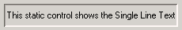
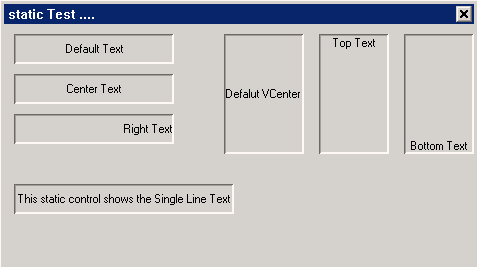
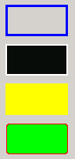
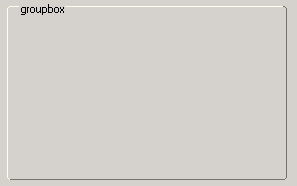
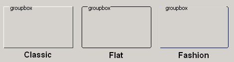
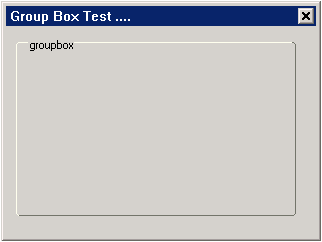
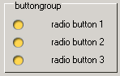
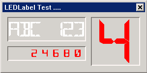
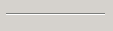
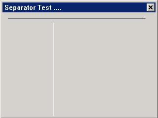

# Static Box and Derived Control Classes

## Brief Introduction of Static Box Series

Static box is used to display information of figure, literal and image etc. at
specific locations of the window, such as company profile and company product
trademark etc., and it is one of the most common controls. Generally speaking,
control row of static box series does not need to conduct dynamic response to
input of the users, that is to say, it is not necessary to receive any input
(such as keyboard and mouse etc.), and there is no event of itself.

| *Control Name* | *Control name (miniStudio display name)* | *Purpose* | *NCS class name* | *Control window class ID* |
|----------------|------------------------------------------|-----------|------------------|---------------------------|
| Static box | Label | Display single row or multiple rows of texts | `mStatic` | `NCSCTRL_STATIC` |
| Image box | Image | Display image | `mImage` | `NCSCTRL_IMAGE` |
| Rectangle box | Rectangle | Draw rectangles | `mRect` | `NCSCTRL_RECTANGLE` |
| Group box | Group Box| Region control that can contain other controls | `mGroupbox` | `NCSCTRL_GROUPBOX` |
| Button group | Button Group| Manage `RadioButton`, realize single selection function | `mButtonGroup` | `NCSCTRL_BUTTONGROUP` |
| `LED` label | `LEDLabel`| Display `LED` characters | `mLEDLabel` | `NCSCTRL_LEDLABEL` |
| Separator | Horz/Vert Separator | Separation line, realize regional division visually | `mSeparator` | `NCSCTRL_SEPARATOR` |

The inheritance relations of static box series controls are as follows:
- `mStatic`
- `mImage`
- `mRect`
- `mGroupbox`
- `mButtonGroup`
- `mLEDLabel`
- `mSeparator`

Static box of each type inherits the property, event and method of the parent
class, therefore, in the following introduction, the inheritance part will be
ignored automatically.

## `mStatic`



- Function: `mStatic` is the static region control used to draw content
including texts and images etc.
- Parent class: `mWidget`
- Direct child class:
- `mImage`
- `mRect`
- `mGroupbox`
- `mLEDLabel`
- `mSeparator`

### Style of `mStatic`
None

### Property of `mStatic`
| *Property name* | *Type* | *Permission* | *Property explanation* | *Mode value* |
| `NCSP_STATIC_ALIGN` | int | `RW` | Control content horizontal alignment mode | `NCS_ALIGN_LEFT`, `NCS_ALIGN_RIGHT`, `NCS_ALIGN_CENTER` |
| `NCSP_STATIC_VALIGN` | int | `RW` | Control content vertical alignment mode | `NCS_VALIGN_TOP`, `NCS_VALIGN_BOTTOM`, `NCS_VALIGN_CENTER` |
| `NCSP_STATIC_AUTOWRAP` | int | `RW` | Control content automatic wrap | 1, 0 |

- `NCSP_STATIC_ALIGN：Set` control content as horizontal alignment mode, and
there are three kinds of values
- `NCS_ALIGN_LEFT：left` aligned, default value of horizontal alignment mode - 0
- `NCS_ALIGN_RIGHT：right` aligned – 1
- `NCS_ALIGN_CENTER：center` aligned – 2
- `NCSP_STATIC_VALIGN：set` control content as vertical alignment mode, and 
there are three kinds of values
- `NCS_VALIGN_TOP：top` aligned – 0
- `NCS_VALIGN_BOTTOM：bottom` aligned, default value of vertical alignment mode 
– 1
- `NCS_VALIGN_CENTER：center` aligned – 2
- `NCSP_STATIC_AUTOWRAP：set` static box content as automatic wrap mode or not, 
0 is single row mode, which is closing automatic wrap mode, and 1 is automatic
wrap mode


Developers can set the property of `mStatic` through the following methods
```cpp
//static control property configuration
static NCS_PROP_ENTRY static1_props [] = {
    { NCSP_STATIC_ALIGN, NCS_ALIGN_CENTER },    // Alignment mode
    {0, 0}
};
    ...
static NCS_PROP_ENTRY static4_props [] = {
    { NCSP_STATIC_VALIGN, NCS_VALIGN_TOP },
    {0, 0}
};
    ...
static NCS_WND_TEMPLATE _ctrl_templ[] = {
    {
        NCSCTRL_STATIC,                      //Control name
        IDC_STATIC1+0,
        10, 10, 160, 30,                      //Control location, size
        WS_BORDER | WS_VISIBLE,
        WS_EX_NONE,
        "Default Text",                  //Text content within the control
        NULL, //props,
        NULL, //rdr_info
        NULL, //handlers,
        NULL, //controls
        0,
        0 //add data
    },
    {
        NCSCTRL_STATIC, 
        IDC_STATIC1+1,
        10, 50, 160, 30,
        WS_BORDER | WS_VISIBLE,
        WS_EX_NONE,
        "Center Text",
        static1_props, //props, set property
        NULL, //rdr_info
        NULL, //handlers,
        NULL, //controls
        0,
        0 //add data
    },
    ...
```

### Event of `mStatic`

At present, the static box series controls don‘t respond to any event

### Method of `mStatic`

None

### Renderer of `mStatic`

None

### Example of `mStatic`

This example demonstrates how to create static boxes of different modes to the
users. <br/>



##### List 1 static.c

```cpp
%INCLUDE{"%ATTACHURL%/static.c.txt"}%
```

## `mImage`


- Function: load display image control in a region
- Inherited from `mStatic`
- Direct child class: none

### Property of `mImage`
| *Property Name* | *Type* | *Permission* | *Property explanation* | *Value* |
| `NCSP_IMAGE_IMAGE` | `PBITMAP` | `RW` | image control content image id, corresponds to pbmp image file pointer in mimage | None |
| `NCSP_IMAGE_IMAGEFILE` | char* | `RW` | image control content image name id, corresponds to name pointer of pbmp image | None |
| `NCSP_IMAGE_DRAWMODE` | enum | `RW` | image control drawing mode, corresponds to `mImageDrawMode` | `NCS_DM_NORMAL`, `NCS_DM_SCALED`, `NCS_DM_SCALED` |
| `NCSP_STATIC_ALIGN` | int | `RW` | Set horizontal alignment mode of image control content | `NCS_ALIGN_LEFT`, `NCS_ALIGN_RIGHT`, `NCS_ALIGN_CENTER` |
| `NCSP_STATIC_VALIGN` | int | `RW` | Set vertical alignment mode of image control content | `NCS_VALIGN_TOP`, `NCS_VALIGN_BOTTOM`, `NCS_VALIGN_CENTER` |

- `NCSP_IMAGE_DRAWMODE：set` image drawing mode, and there are three modes.
- `NCS_DM_NORMAL：display` image according to the original condition, and 
default value of the drawing mode – 0
- `NCS_DM_SCALED：stretch`, stretch the image to cover the whole static box-1
- `NCS_DM_TILED：tile`, display the image repeatedly in the whole static box-2
- `NCSP_STATIC_ALIGN：refer` to `mStatic`
- `NCSP_STATIC_VALIGN：refer` to `mStatic`

The following codes demonstrate how to set properties such as drawing mode etc.

```cpp
static BITMAP icon;
static BITMAP bitmap;

static void set_icon_info(mWidget* self, int id, PBITMAP pbmp, int align_id, int align)
{
    mImage *img;
    img = (mImage *)ncsGetChildObj(self->hwnd, id);

    if(img){
        _c(img)->setProperty(img, NCSP_IMAGE_IMAGE, (DWORD)pbmp);
        _c(img)->setProperty(img, align_id, align);
    }
}


static BOOL mymain_onCreate(mWidget* self, DWORD add_data)
{
    //TODO : initialize
    mImage *img;
    LoadBitmapFromFile(HDC_SCREEN, &bitmap, "image_test.jpg");

    LoadBitmapFromFile(HDC_SCREEN, &icon, "icon.png");

    set_icon_info(self, IDC_IMAGE1, &icon, NCSP_STATIC_ALIGN, NCS_ALIGN_LEFT);
    set_icon_info(self, IDC_IMAGE2, &icon, NCSP_STATIC_ALIGN, NCS_ALIGN_CENTER);
    set_icon_info(self, IDC_IMAGE3, &icon, NCSP_STATIC_ALIGN, NCS_ALIGN_RIGHT);
    set_icon_info(self, IDC_IMAGE4, &icon, NCSP_STATIC_VALIGN, NCS_VALIGN_TOP);
    set_icon_info(self, IDC_IMAGE5, &icon, NCSP_STATIC_VALIGN, NCS_VALIGN_CENTER);
    set_icon_info(self, IDC_IMAGE6, &icon, NCSP_STATIC_VALIGN, NCS_VALIGN_BOTTOM);

    img = (mImage *)ncsGetChildObj(self->hwnd, IDC_IMAGE7);
    if(img){
        _c(img)->setProperty(img, NCSP_IMAGE_IMAGE, (DWORD)&bitmap);
        _c(img)->setProperty(img, NCSP_IMAGE_DRAWMODE, NCS_DM_SCALED);
    }

    img = (mImage *)ncsGetChildObj(self->hwnd, IDC_IMAGE8);
    if(img){
        _c(img)->setProperty(img, NCSP_IMAGE_IMAGE, (DWORD)&bitmap);
        _c(img)->setProperty(img, NCSP_IMAGE_DRAWMODE, NCS_DM_TILED);
    }

    return TRUE;
}
```

### Event of `mImage`
None

### Method of `mImage`

None

### Example of `mImage`

This example demonstrates how to display and create image static boxes of
different drawing modes to the users<br/>


##### List 2 image.c

```cpp
%INCLUDE{"%ATTACHURL%/image.c.txt"}%
```

## `mRect`



- Function: this control provides the function of drawing rectangles to the
users. Through the method of setting properties, rectangles with features of
fill color, round corner and border etc. can be drawn conveniently and rapidly
- Inherited from `mStatic`
- Direct child class: none

### Property of `mRect`

| *Property name* | *Type* | *Permission* | *Explanation* ||
| `NCSP_RECT_BORDERSIZE` | int | `RW` | Thickness of rect control border, border thickness of the corresponding rectangle control, and the type is int |
| `NCSP_RECT_BORDERCOLOR` | dword | `RW` | Color of rect control border, border color of corresponding rectangle control, and the type is dword |
| `NCSP_RECT_FILLCOLOR` | dword | `RW` | Fill color of rect control, fill color of corresponding rectangle control, and the type is dword |
| `NCSP_RECT_XRADIUS` | int | `RW` | Round corner horizontal x radius of rect control, round corner radius of corresponding rectangle control, and the type is int |
| `NCSP_RECT_YRADIUS` | int | `RW` | Round corner vertical y radius of rect control, round corner radius of corresponding rectangle control, and the type is int |
| `NCSP_RECT_FILLCLR_RED` | | | |
| `NCSP_RECT_FILLCLR_GREEN` | | | |
| `NCSP_RECT_FILLCLR_BLUE` | | | |
| `NCSP_RECT_FILLCLR_ALPHA` | | | |
| `NCSP_RECT_BRDCLR_RED` | | | |
| `NCSP_RECT_BRDCLR_GREEN` | | | |
| `NCSP_RECT_BRDCLR_BLUE` | | | |
| `NCSP_RECT_BRDCLR_ALPHA` | | | |

The following codes demonstrate how to set the properties of rectangles
```cpp
//Propties for
static NCS_PROP_ENTRY rect1_props [] = {
    {NCSP_RECTANGLE_BORDERSIZE, 3},
    {NCSP_RECTANGLE_BORDERCOLOR, 0xFFFF0000},
    {NCSP_RECTANGLE_FILLCOLOR, 0x00000000},
    {0, 0}
};

static NCS_PROP_ENTRY rect2_props [] = {
    {NCSP_RECTANGLE_BORDERSIZE, 2},
    {NCSP_RECTANGLE_BORDERCOLOR, 0xFFFFFFF},
    {NCSP_RECTANGLE_FILLCOLOR, 0xFF0F0F0F},
    {0, 0}
};

static NCS_PROP_ENTRY rect3_props [] = {
    {NCSP_RECTANGLE_BORDERSIZE, 0},
    {NCSP_RECTANGLE_BORDERCOLOR, 0xFF0C0000},
    {NCSP_RECTANGLE_FILLCOLOR, 0xFF00FFFF},
    {0, 0}
};

static NCS_PROP_ENTRY rect4_props [] = {
    {NCSP_RECTANGLE_BORDERSIZE, 5},
    {NCSP_RECTANGLE_BORDERCOLOR, 0xFF0000FF},
    {NCSP_RECTANGLE_FILLCOLOR, 0xFF00FF00},
    {NCSP_RECTANGLE_XRADIUS, 4},
    {NCSP_RECTANGLE_YRADIUS, 4},
    {0, 0}
};
//Controls
static NCS_WND_TEMPLATE _ctrl_templ[] = {
    ...
    {
        NCSCTRL_RECTANGLE,
        ID_RECT1,
        110, 10, 80, 40,
        WS_VISIBLE,
        WS_EX_NONE,
        "",
        rect1_props, //props,
        NULL, //rdr_info
        NULL, //handlers,
        NULL, //controls
        0,
        0 //add data
    },
    ...
    {
        NCSCTRL_RECTANGLE,
        ID_RECT2,
        110, 60, 80, 40,
        WS_VISIBLE,
        WS_EX_NONE,
        "",
        rect2_props, //props,
        NULL, //rdr_info
        NULL, //handlers,
        NULL, //controls
        0,
        0 //add data
    },
    ...
    {
        NCSCTRL_RECTANGLE,
        ID_RECT3,
        110, 110, 80, 40,
        WS_VISIBLE,
        WS_EX_NONE,
        "",
        rect3_props, //props,
        NULL, //rdr_info
        NULL, //handlers,
        NULL, //controls
        0,
        0 //add data
    },
    ...
    {
        NCSCTRL_RECTANGLE,
        ID_RECT4,
        110, 160, 80, 40,
        WS_VISIBLE,
        WS_EX_NONE,
        "",
        rect4_props, //props,
        NULL, //rdr_info
        NULL, //handlers,
        NULL, //controls
        0,
        0 //add data
    },
};
```

### Event of `mRect`
None

### Method of `mRect`
None

### Example of `mRect`

This example demonstrate how to draw all kinds of rectangles to the users<br/>


##### List 3 rectangle.c

```cpp
%INCLUDE{"%ATTACHURL%/rectangle.c.txt"}%
```

## `mGroupbox`




- Function: group box, this control is used to provide recognizable groups for
the other controls. Normally, group box is used to subdivide the forms 
according to functions, and grouping all the options in the group box can
provide logicalized visible prompt to the users.
- Inherited from `mStatic`
- Direct child class:
- `mButtongroup`

### Property of `mGroupbox`
None

### Event of `mGroupbox`

None

### Method of `mGroupbox`

None

### Renderer of `mGroupbox`




Users can set classic, fit and fashion renderers as shown in the figure above
for group box conveniently, and for the concrete method, see the codes below,
```cpp
    ...
static NCS_RDR_INFO grp_rdr_info[] = {
    {"fashion", "fashion", NULL}
//    {"flat", "flat", NULL}
//    {"classic", "classic", NULL}
};

//Controls
static NCS_WND_TEMPLATE _ctrl_templ[] = {
    {
        NCSCTRL_GROUPBOX ,
        ID_GROUP,
        10, 10, 280, 180,
        WS_VISIBLE,
        WS_EX_NONE,
        "groupbox",
        NULL, //props,
        grp_rdr_info, //rdr_info
        NULL, //handlers,
        NULL, //controls
        0,
        0 //add data
    },
};
    ...
```
### Example of `mGroupbox`




This example demonstrate how to generate group box with renderers to the users.

##### List 4 groupbox.c

```cpp
%INCLUDE{"%ATTACHURL%/groupbox.c.txt"}%
```
## `mButtonGroup`



- Function: this control is used to manage a group of `radioButton`, enabling
the group of `RadioButton` to mutually exclude, thus realizing single selection
function. 
- Inherited from `mGroupbox`
- Direct child class: none

### Property of `mButtonGroup`

| *Property Name* | *Type* | *Permission* | *Property explanation* |
| `NCSP_BTNGRP_SELID` | int | `RW` | Currently selected `radioButton` `ID` number |
| `NCSP_BTNGRP_SELIDX` | idx | `RW` | Currently selected `radioButton` index number |
| `NCSP_BTNGRP_SELOBJ` | `mWidget*` | `RW` | Currently selected `radioButton` pointer |


### Method of `mButtonGroup`

```cpp
BOOL (*addButton)(clsName *group, mWidget *radio);
```
- Function: add a `radioButton`
- Returned value: `BOOL`

```cpp
BOOL (*checkBtn)(clsName *group, mWidget *btn_to_check);
```
- Function: select a `radioButton`
- Returned value: `BOOL`

### Example of `mButtonGroup`


Please refer to `mRadioButton` in [Chapter 5 Button Series Control
Class](Products/MStudioMGNCSV1dot0PGENP2C5#m_RadioButton). 

## `mLEDLabel`


- Function: `mLEDLabel` class is the static box imitating `LED` digital nixie
tube, which is used to display `LED` characters and can be used in multiple
fields such as industrial control etc.
- Inherited from `mStatic`
- Direct child class: none

### Property of `mLEDLabel`

| *Property name* | *Type* | *Permission* | *Property explanation* |
| `NCSP_LEDLBL_COLOR` | `DWORD` | `RW` | Set the color of `LED` font, such as red is 0xFF0000FF |
| `NCSP_LEDLBL_WIDTH` | int | `RW` | Set the width of `LED` font |
| `NCSP_LEDLBL_HEIGHT` | int | `RW` | Set the height of `LED` font |

Users can use the following method to set the properties:
```cpp
//Propties for
static NCS_PROP_ENTRY static1_props [] = {
    { NCSP_LEDLBL_COLOR, 0xFF0000FF},
    { NCSP_LEDLBL_WIDTH, 10},
    { NCSP_LEDLBL_HEIGHT, 15},
    { NCSP_STATIC_ALIGN, NCS_ALIGN_RIGHT },
    { NCSP_STATIC_AUTOWRAP, 0 },
    {0, 0}
};

static NCS_PROP_ENTRY static2_props [] = {
    { NCSP_LEDLBL_COLOR, 0xFF0000FF},
    { NCSP_LEDLBL_WIDTH, 60},
    { NCSP_LEDLBL_HEIGHT, 90},
    { NCSP_STATIC_VALIGN, NCS_VALIGN_CENTER },
    { NCSP_STATIC_ALIGN, NCS_ALIGN_CENTER },
    {0, 0}
};

//Controls
static NCS_WND_TEMPLATE _ctrl_templ[] = {
    {
        NCSCTRL_LEDLABEL , 
        IDC_LEDLBL1+0,
        10, 10, 160, 50,
        WS_BORDER | WS_VISIBLE,
        WS_EX_NONE,
        "ABC 123",
        NULL, //props, take the default property
        NULL, //rdr_info
        NULL, //handlers,
        NULL, //controls
        0,
        0 //add data
    },
    {
        NCSCTRL_LEDLABEL , 
        IDC_LEDLBL1+2,
        10, 70, 160, 30,
        WS_BORDER | WS_VISIBLE,
        WS_EX_NONE,
        "2 4 6 8 0 ",
        static1_props, //props,
        NULL, //rdr_info
        NULL, //handlers,
        NULL, //controls
        0,
        0 //add data
    },
    {
        NCSCTRL_LEDLABEL , 
        IDC_LEDLBL1+5,
        180, 10, 100, 100,
        WS_BORDER | WS_VISIBLE,
        WS_EX_NONE,
        "4",
        static2_props, //props,
        NULL, //rdr_info
        NULL, //handlers,
        NULL, //controls
        0,
        0 //add data
    },

};
```

### Style of `mLEDLabel`

None

### Method of `mLEDLabel`

None

### Renderer of `mLEDLabel`

None

### Example of `mLEDLabel`




This example demonstrates how to display `LED` characters to the users
```cpp
%INCLUDE{"%ATTACHURL%/ledlabel.c.txt"}%
```

## `mSeparator`



- Function: used to separate the item controls and conduct horizontal or
vertical separation lines of region division
- Inherited from `mStatic`
- Direct child class: none

### Property of `mSeparator`

None

### Style of `mSeparator`

| *Property name* | *Explanation* |
| `NCSS_SPRTR_VERT` | Set as vertical separation line, default by default |

Users can use the following method to set the style:
```cpp
    ...
static NCS_WND_TEMPLATE _ctrl_templ[] = {
    ...,
    {
        NCSCTRL_SEPARATOR , 
        ID_GROUP,
        100, 20, 5, 200,
        WS_VISIBLE|NCSS_SPRTR_VERT,   //Set vertical style
        WS_EX_NONE,
        "groupbox",
        NULL, //props,
        NULL, //rdr_info
        NULL, //handlers,
        NULL, //controls
        0,
        0 //add data
    },
};

```

### Event of `mSeparator`

None

### Method of `mSeparator`

None

### Renderer of `mSeparator`

None

### Example of `mSeparator`




This example demonstrates how to generate horizontal and vertical separation
lines to the users
```cpp
%INCLUDE{"%ATTACHURL%/separator.c.txt"}%
```

----

[&lt;&lt; Introduction to the Foundation Classes](MiniGUIProgGuidePart2Chapter04.md) |
[Table of Contents](README.md) |
[Button and Derived Control Classes &gt;&gt;](MiniGUIProgGuidePart2Chapter06.md)

[Release Notes for MiniGUI 3.2]: /supplementary-docs/Release-Notes-for-MiniGUI-3.2.md
[Release Notes for MiniGUI 4.0]: /supplementary-docs/Release-Notes-for-MiniGUI-4.0.md
[Showing Text in Complex or Mixed Scripts]: /supplementary-docs/Showing-Text-in-Complex-or-Mixed-Scripts.md
[Supporting and Using Extra Input Messages]: /supplementary-docs/Supporting-and-Using-Extra-Input-Messages.md
[Using CommLCD NEWGAL Engine and Comm IAL Engine]: /supplementary-docs/Using-CommLCD-NEWGAL-Engine-and-Comm-IAL-Engine.md
[Using Enhanced Font Interfaces]: /supplementary-docs/Using-Enhanced-Font-Interfaces.md
[Using Images and Fonts on System without File System]: /supplementary-docs/Using-Images-and-Fonts-on-System-without-File-System.md
[Using SyncUpdateDC to Reduce Screen Flicker]: /supplementary-docs/Using-SyncUpdateDC-to-Reduce-Screen-Flicker.md
[Writing DRI Engine Driver for Your GPU]: /supplementary-docs/Writing-DRI-Engine-Driver-for-Your-GPU.md
[Writing MiniGUI Apps for 64-bit Platforms]: /supplementary-docs/Writing-MiniGUI-Apps-for-64-bit-Platforms.md

[Quick Start]: /user-manual/MiniGUIUserManualQuickStart.md
[Building MiniGUI]: /user-manual/MiniGUIUserManualBuildingMiniGUI.md
[Compile-time Configuration]: /user-manual/MiniGUIUserManualCompiletimeConfiguration.md
[Runtime Configuration]: /user-manual/MiniGUIUserManualRuntimeConfiguration.md
[Tools]: /user-manual/MiniGUIUserManualTools.md
[Feature List]: /user-manual/MiniGUIUserManualFeatureList.md

[MiniGUI Overview]: /MiniGUI-Overview.md
[MiniGUI User Manual]: /user-manual/README.md
[MiniGUI Programming Guide]: /programming-guide/README.md
[MiniGUI Porting Guide]: /porting-guide/README.md
[MiniGUI Supplementary Documents]: /supplementary-docs/README.md
[MiniGUI API Reference Manuals]: /api-reference/README.md

[MiniGUI Official Website]: http://www.minigui.com
[Beijing FMSoft Technologies Co., Ltd.]: https://www.fmsoft.cn
[FMSoft Technologies]: https://www.fmsoft.cn
[HarfBuzz]: https://www.freedesktop.org/wiki/Software/HarfBuzz/
