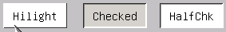
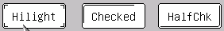
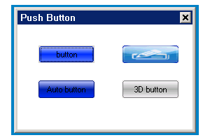
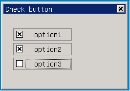
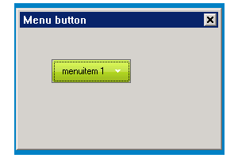
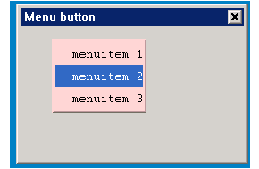
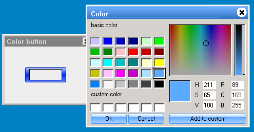

# Chapter 5 of Part 2 Button Series Control Class

## Brief Introduction of Button Series Control

Button is an essential control of human computer interaction in the user
interface, and all the human computer interaction interfaces include button. In
the design of mGNCS, button use conditions under different use environments are
fully considered, and different properties and interfaces etc. are provided for
the convenience of user componentization development. Buttons in mGNCS
reconstruct built-in button control in MiniGUI 3.0 and conduct big adjustment.
Two button types are added, greatly strengthening button control. Buttons in
`MiniGNCS` include five types, common button, check box, single selection
button, menu button and color selection button. Users can select or switch
status of buttons through keyboard or mouse. Input of users will make buttons
generate notification message, and applications can send messages to the 
buttons to change the status of the buttons. Each button type corresponds to 
one class, which contains style, property, event, method and renderer. 
Functions of the controls provided in mGNCS are usually stronger than the
functions of the controls used on `PC`, providing more configurable 
information, and renderer editing is added.

In this document, button class and the properties in it will be introduced in
detail, making it convenient for the users to further understand the details of
buttons, thus buttons can be used more flexibly.

- Class hierarchical relation related to buttons

- [ `mWidget` ](MStudioMGNCSV1dot0PGENP2C3#mWidget)
* [ `mButton` ](MiniGUIProgGuidePart2Chapter06#mButton.md)
* [ `mCheckButton` ](MiniGUIProgGuidePart2Chapter06#m_CheckButton.md)
* [ `mRadioButton` ](MiniGUIProgGuidePart2Chapter06#m_RadioButton.md)
* [ `mMenuButton` ](MiniGUIProgGuidePart2Chapter06#m_MenuButton.md) 
(mPopMenuMgr is used)
* [ `mColorButton` ](MiniGUIProgGuidePart2Chapter06#m_ColorButton.md)

- Control creating method
- Automatic creation: through interface designer in miniStudio, corresponding
button control is dragged. miniStudio will automatically create control and
provide visual control configuration, and at the same time, creation codes are
generated automatically.
- Manual generation: according to mGNCS control creation process, through
programming, corresponding control window class `ID` is imported and control is
generated. Manual programming sets control property and event handling.


## Button Class Renderer

mGNCS provides four types of renderers and defines renderer property setting
set. The four types of renderers correspond to four kinds of renderer property
setting set. For button class control, the four kinds of renderers defines 
which renderer property can be set in the button control and which effect can 
it be set to. mGNCS provides default renderer property. Of course, users can
change these properties, thus different effects can be set. That is to say,
users can change different renderer properties and create numerous renderer
examples based on the four types of renderers.

## `mButton`

- *Control window class*: `NCSCTRL_BUTTON`
- *Control English name*: Push Button
- *Brief introduction*: It is button of press down mode. On the button, the
simple ones can be represented by literals and can be marked by images, and 
they can be displayed by mixture of images and literals.


To understand programming of buttons, firstly, it is necessary to understand 
the status of buttons. In mGNCS, the status of buttons is divided into four
kinds, refer to appendix definition and note: `ButtonState`
[ButtonState](MiniGUIProgGuidePart2Chapter06#ButtonState.md)

### Style of `mButton`

Style of buttons includes two categories:
- Firstly, it is defining button `CHECK` status, which is press down status, 
and setting is carried out through Checkable/Autocheck/ThreeDCheck in the
property; 
- Secondly, it is setting button panel as displaying text or image or
coexistence if image and text, which is done mainly through options in Label
Type in property. Text by default, while layout of images and texts is set
through other properties.

`mButton` is the foundation class of all buttons, which implements `PushButton`
by default. Buttons of all other types are derived from it.

It is inherited from the style of [mWidget](MStudioMGNCSV1dot0PGENP2C3).

| *Style `ID`* | *miniStudio property name* | *Explanation* |
| `NCSS_BUTTON_CHECKABLE` | Checkable | Set if the button can carry out `CHECKED` status conversion; if `FALSE`, `CHECK` status conversion is not carried out, and autocheck and `ThreeDCheck` are invalid |
| `NCSS_BUTTON_AUTOCHECK` | Autocheck | When `CHECKED` status conversion can be carried out, set if clicking can be carried out to automatically switch `CHECK` status |
| `NCSS_BUTTON_3DCHECK` | `ThreeDCheck` | Set button `CHECK` status as three status (unchecked-halfchecked-checked) or two status (unchecked-checked) switch |
| `NCSS_BUTTON_IMAGE` | `LabelType->Image`| Image button style, the button is label literal mode in `LabelType` by default |
| `NCSS_BUTTON_IMAGELABEL` | `LabelType->ImageLabel` | Button of horizontally arranged image text |
| `NCSS_BUTTON_VERTIMAGELABEL` | `LabelType->VertImageLabel` | Button of vertically arranged image text |

### Property of `mButton`

It is inherited from the property of [mWidget](MStudioMGNCSV1dot0PGENP2C3).

| *Property `ID` name* | *miniStudio property name* | *Type* | *Permission* | *Explanation* |
| `NCSP_BUTTON_ALIGN` | Align | [Alignment enumeration value](MStudioMGNCSV1dot0PGENAppC#AlignValues) | `RW` | Content on the button (image or literal) is aligned with the button according to the set mode in horizontal direction |
| `NCSP_BUTTON_VALIGN` | `VAlign` | [Alignment enumeration value](MStudioMGNCSV1dot0PGENAppC#AlignValues) | `RW` | Content on the button (image or literal) is aligned with the button according to the set mode in vertical direction, and the alignment value is top – 0, bottom – 1, center – 2 |
| `NCSP_BUTTON_WORDWRAP` | Wordwrap | int | `RW` | Automatic wrap property of the literals on the button, when the single line length of the literal content is bigger than the control width, automatic wrap can be selected. `TRUE`: automatic wrap `FALSE`: single line, and the exceeding part is not displayed |
| `NCSP_BUTTON_IMAGE` | Image | `PBITMAP` | `RW` | Image, corresponding to button property pbmp, which is image pointer, it must be valid when `NCSS_BUTTON_IMAGE` or `NCSS_BUTTON_IMAGELABEL` or `NCSS_BUTTON_VERTIMAGELABEL` is set |
| `NCSP_BUTTON_CHECKSTATE`| 无 | [mButtonCheckState](MStudioMGNCSV1dot0PGP2C5#ButtonCheckState)| `RW` | Set or get check status, valid when `NCSS_BUTTON_CHECKABLE` is set, `NCS_BUTTON_HALFCHECKED` is regarded as valid value when `NCSS_BUTTON_3DCHECK` is set |
| `NCSP_BUTTON_IMAGE_SIZE_PERCENT`| `ImageSizePercent` | int | `RW` | Under the style of coexistence of image and text, set proportion of image on the control (take value 15~85, representing 15% to 85%), and the remaining is occupied by the text |
| `NCSP_BUTTON_GROUPID`| `GroupID` | int | `RW` | When there is `NCSS_BUTTON_CHECKABLE` style, `ID` of a `mButtonGroup` can be set to the window, it will automatically get a corresponding `mButtonGroup` object and set |
| `NCSP_BUTTON_GROUP`| 无 | `mButtonGroup` *|RW| When there is `NCSS_BUTTON_CHECKABLE` style, set a `mButtonGroup` object pointer, and all the buttons adding to the group has the automatic switching ability of Radio style |

### Event of `mButton`

It is inherited from the event of [mWidget](MStudioMGNCSV1dot0PGENP2C3).

| *Event notification code* | *Explanation* | *Parameter* |
| `NCSN_BUTTON_PUSHED` | Key pressed down | |
| `NCSN_BUTTON_STATE_CHANGED` | After status changes | New status |

Note, the control inherits `NCSN_WIDGET_CLICKED` event of the parent class.

### Renderer of `mButton`

*For the usage of renderer, see [look and feel
renderer](MStudioMGNCSV1dot0PGENP2C2)*. 

#### `mButton` Classic renderer

The basic style under classic renderer is as shown in the figure below:

Drawing of `mButton` Classic renderer is as below: for the drawing of non 
client area, please refer to the renderer of
[mWidget](MStudioMGNCSV1dot0PGENP2C3#mWidget). 

| *Property `ID`* | *Meaning* | *miniStudio property name* | *Value type* | *Schematic diagram of the valid region* | *Value range* |
| `NCS_FGC_3DBODY` | Text foreground color | `FgColor3DBody` | `DWORD(ARGB`) || |
| `NCS_BGC_3DBODY` | Background color | `BgColor3DBody` | `DWORD(ARGB`) | | |
| `NCS_FGC_DISABLED_ITEM` | Text foreground color when the window is invalid | `TextDisableColor` | `DWORD(ARGB`) || |
| `NCS_BGC_DISABLED_ITEM` | background color when the window is invalid | `BgColorDisable` | `DWORD(ARGB`) || |


- High light effect: through enhancing the brightness of the background color
(NCS_BGC_3DBODY), as the high light color
- check effect: implement through drawing invaginated border
- Three status Check effect: implement half selection through drawing high 
light color in the invaginated border

Schematic diagram:<br/>




### `mButton` Skin Renderer

Refer to [Appendix B: Specification for the Image Resources Used by Skin
Renderer](MStudioMGNCSV1dot0PGENAppB#mButton). 

#### `mButton` Fashion Renderer

For the drawing of non client area, please refer to the drawing of Fashion
renderer of [mWidget](MStudioMGNCSV1dot0PGENP2C3#mWidget).

| *Property `ID`* | *Meaning* | *miniStudio property name* | *Value type* | *Schematic diagram of the valid region* | *Value range* |
| `NCS_FGC_3DBODY` | Text foreground color | `FgColor3DBody` | `DWORD(ARGB`) | Same as Classic renderer | |
| `NCS_FGC_DISABLED_ITEM` | Text foreground color when the window is invalid| `TextDisableColor` | `DWORD(ARGB`) | Same as Classic renderer | |
| `NCS_BGC_3DBODY` | Background color | `BgColor3DBody` | `DWORD(ARGB`) | | |
| `NCS_BGC_DISABLED_ITEM` | Text background color when the window is invalid | `BgColorDisable` | `DWORD(ARGB`) || |
| `NCS_MODE_BGC` | Gradual change fill mode | `GradientMode` | int || [GradientMode](MStudioMGNCSV1dot0PGP2C5#GrandientMode) |
| `NCS_METRICS_3DBODY_ROUNDX` | Window rectangle round corner X radius | `RoundX` | int | | 0 to 1/2 of the window width |
| `NCS_METRICS_3DBODY_ROUNDY` | Window rectangle round corner Y radius | `RoundY` | int| | 0 to 1/2 of the window height |

- Gradual change color: the gradual change color gives different brightness
factor from the ground color (NCS_BGC_3DBODY or `NCS_BGC_DISABLED_ITEM`), and
calculates the two objective colors. Gradually change from the center (ground
color) to the two sides or top and bottom (highlighted color achieved through
calculation) 
- High light color: after the ground color is highlighted, the gradual change
color calculates to obtain on the foundation of this
- Representing method of check status: after the ground color undergoes
darkening processing, calculate the gradual change color
- Representing method of three status check: besides the method is the same as
above in check status, in half selection status, use the window ground color
(`NCS_BGC_WINDOW`) as the whole ground color to draw

Schematic diagram: <br />


#### `mButton` Flat Renderer

For the drawing of non client area, please refer to the drawing of Flat 
renderer of [mWidget](MStudioMGNCSV1dot0PGENP2C3#mWidget).

| *Property `ID`* | *Meaning* | *miniStudio property name* | *Value type* | *Schematic diagram of the valid region* | *Value range* |
| `NCS_FGC_3DBODY` | Text foreground color | `FgColor3DBody` | `DWORD(ARGB`) | Same as Classic renderer | |
| `NCS_FGC_DISABLED_ITEM` | Text foreground color when the window is invalid | `TextDisableColor` | `DWORD(ARGB`) | Same as Classic renderer | |
| `NCS_BGC_3DBODY` | background color | `BgColor3DBody` | `DWORD(ARGB`) | Same as Classic renderer |
| `NCS_METRICS_3DBODY_ROUNDX` | Window rectangle round corner X radius | `RoundX` | int | | 0 to 1/2 of the window width |
| `NCS_METRICS_3DBODY_ROUNDY` | Window rectangle round corner Y radius | `RoundY` | int| | 0 to 1/2 of the window height |

- High light: draw small prompting symbols to implement around the control
- check status: draw lines at right-bottom edition, and compose inverted “L”
realization 
- check representing method of three status: in half selection status, draw
lines at left-top, forming fell flat “L”

Schematic diagram: <br />




### Programming Example of `mButton`

- Operation screen shot: <br />



- This program uses Fashion renderer to create buttons of four different 
styles, which are common button, image button, Autocheck style button and three
status button.
- Complete example code of common button: [button.c](%ATTACHURL%/button.c.txt)


<p align=center>List p2c5-1 <a href="%ATTACHURL%/button.c.txt">button.c</a></p>

- Define common button
```cpp
%INCLUDE{"%ATTACHURL%/button.c.txt" pattern="^.*?//START_DCL_DEF_PUSHBUTTON(.*?)//END_DCL_DEF_PUSHBUTTON.*"}%
```

- Define Image button, generally it is handled in `onCreate` event of the main
window 
```cpp
%INCLUDE{"%ATTACHURL%/button.c.txt" pattern="^.*?//START_DCL_IMAGEBUTTON(.*?)//END_DCL_IMAGEBUTTON.*"}%
```
- Load and set Image
```cpp
%INCLUDE{"%ATTACHURL%/button.c.txt" pattern="^.*?//START_SET_IMAGE(.*?)//END_STE_IMAGE.*"}%
```

- Define button of Autocheck style
```cpp
%INCLUDE{"%ATTACHURL%/button.c.txt" pattern="^.*?//START_DCL_AUTOCHECKBTN(.*?)//END_DCL_AUTOCHECKBTN.*"}%
```

- Define button of three status check style
```cpp
%INCLUDE{"%ATTACHURL%/button.c.txt" pattern="^.*?//START_DCL_3DAUTOCHECKBTN(.*?)//END_DCL_3DAUTOCHECKBTN.*"}%
```

## `mCheckButton`
- *Control window class*: `NCSCTRL_CHECKBUTTON`
- *Control English name*: `CheckButton`
- *Brief introduction*: Check box button, mainly used on multi-selection
occasion. The common pattern is a box, and the user checks or unchecks the box.


### Property of `mCheckButton`
It is inherited from the property of <a href="#Property of
`mButton"/>mButton</a>`. 

### Event of `mCheckButton`
It is inherited from the event of <a href="#Event of `mButton"/>mButton</a>`.

### Renderers of `mCheckButton`
- For the usage of renderers, see [look and feel
renderer](MStudioMGNCSV1dot0PGENP2C2) 

#### `mCheckButton` Classic Renderer

- Drawing of renderer in the `mCheckButton` Classic text region is as below: 
for the drawing of non client area, please refer to the renderer of
[mWidget](MStudioMGNCSV1dot0PGP2C3#mWidget). 

| *Property `ID`* | *Meaning* | *miniStudio property name* | *Value type* | *Schematic diagram of the valid region* | *Value range* |
| `NCS_FGC_3DBODY` | Text foreground color | `FgColor3DBody` | `DWORD(ARGB`) |  | |
| `NCS_FGC_DISABLED_ITEM` | Text foreground color when the window is invalid | `TextDisableColor` | `DWORD(ARGB`) |  | |

- Classic renderer of Check box fills and draws through loading image resource.
(image resource is minigui-res by default, and installed in
/usr/local/share/minigui/res/bmp/classic_check_button.bmp）by default
- Specification of image: the image is composed of eight parts from left to
right, and each part is a square (13x13), corresponding to eight statuses of
checkbutton: 
* 0~3: common, highlight, pressed down and banned statuses when not selected
* 4~7: common, highlight, pressed down and banned statuses when selected
- If the image is bigger than the drawing region, the image will be reduced to
draw; if the image is smaller or equal to the drawing region, the image actual
size will be adopted to draw
- Example%BR%


#### `mCheckButton` Skin Renderer

Refer to [Appendix B : Specification for the Image Resource Used by Skin
Renderer](MStudioMGNCSV1dot0PGENAppB#mButton) 

#### `mCheckButton` Fashion Renderer
- Drawing of `mCheckButton` Fashion text region renderer is as follows: for the
drawing of non client area, please refer to the renderer of
[mWidget](MStudioMGNCSV1dot0PGP2C3#mWidget). 

| *Property `ID`* | *Meaning* | *miniStudio property name* | *Value type* | *Schematic diagram of the valid region* | *Value range* |
| `NCS_FGC_3DBODY` | Text foreground color | `FgColor3DBody` | `DWORD(ARGB`) |  | |
| `NCS_FGC_DISABLED_ITEM` | Text foreground color when the window is invalid | `TextDisableColor` | `DWORD(ARGB`) |  | |

- Fashion renderer of Check box fills and draws through loading image resource.
(Note: the image resource is minigui-res by default, and installed in
/usr/local/share/minigui/res/bmp/fashion_check_btn.bmp by default)
- Specification of the image: the image is composed of eight parts from top to
bottom, and each part is a square (13x13), corresponding to eight statuses of
checkbutton: 
* 0~3: common, highlight, pressed down and banned status when not selected
* 4~7: Common, highlight, pressed down and banned status when selected
- If the image is bigger than the drawing region, the image will be reduced to
draw; if the image is smaller or equal to the drawing region, the image actual
size will be adopted to draw
- Example%BR%


#### `mCheckButton` Flat Renderer

- Drawing of text region and check box of `mCheckButton` Flat renderer is as
below: for the drawing of non area region, please refer to the renderer of
[mWidget](MStudioMGNCSV1dot0PGENP2C3#mWidget). 

| *Property `ID`* | *Meaning* | *miniStudio property name* | *Value type* | *Schematic diagram of the valid region* | *Value range* |
| `NCS_FGC_3DBODY` | Text foreground color | `FgColor3DBody` | `DWORD(ARGB`) |  | |
| `NCS_BGC_3DBODY`| Background color | `BgColor3DBody` | `DWORD(ARGB`) |  | |

### Programming Example of `mCheckbutton`

- Operation screen shot: <br />




- Check box example code: [checkbutton.c](%ATTACHURL%/checkbutton.c.txt)
```cpp
%INCLUDE{"%ATTACHURL%/checkbutton.c.txt" pattern="^.*?// START_OF_TEMPLATE(.*?)// END_OF_TEMPLATE.*"}%
```

## `mRadioButton`
- *Control window class*: `NCSCTRL_RADIOBUTTON`
- *Control English name*: `RadioButton`
- *Brief introduction*: Single selection button, matched with `mButtonGroup`.
`mButtonGroup` concludes multiple single selection buttons into one group. 
Among the buttons in the group, only one is in the selected status. After a
button is selected, the originally selected button will cancel the selection.
When the single selection button is used independently, its behavior is similar
to that of a <a ref="#m_Checkbutton">mCheckbutton</a>.


### Property of `mRadiobutton`
It is inherited from the property of <a href="#Property of
`mButton"/>mButton</a>`. 

### Event of `mRadiobutton`

It is inherited from the event of <a href="#Event of `mButton"/>mButton</a>`.

### Renderers of `mRadiobutton`

- For the usage of renderers, see [look and feel
renderer](MStudioMGNCSV1dot0PGENP2C2) 

#### `mRadiobutton` Classic Renderer
- For the drawing of `mRadiobutton` Classic non client area, please refer to 
the renderer of [mWidget](MStudioMGNCSV1dot0PGENP2C3#mWidget).

| *Property `ID`* | *Meaning* | *miniStudio property name* | *Value type* | *Schematic diagram of the valid region* | *Value range* |
| `NCS_FGC_3DBODY` | Text foreground color | `FgColor3DBody` | `DWORD(ARGB`) |  | |
| `NCS_FGC_DISABLED_ITEM` | Text foreground color when the window is invalid | `TextDisableColor` | `DWORD(ARGB`) |  | |

- Classic renderer of Check Box of Radiobutton fills and draws through loading
image resource. (the image resource is minigui-res by default, and installed in
/usr/local/share/minigui/res/bmp/classic_radio_button.bmp by default)
- Specification of the image: the image is composed of eight parts from left to
right, and each part is a square (13x13), corresponding to eight statuses of
checkbutton: 
* 0~3: common, highlight, pressed down and banned status when not selected
* 4~7: common, highlight, pressed down and banned status when selected
- If the image is bigger than the drawing region, the image will be reduced to
draw; when the image is smaller than or equal to the drawing region, the image
actual size is adopted to draw
- Example%BR%


#### `mRadiobutton` Skin Renderer

Refer to [Appendix B : Specification for the Image Resource Used by Skin
Renderer](MStudioMGNCSV1dot0PGENAppB#mButton). 

#### `mRadiobutton` Fashion Renderer
- For the drawing of `mRadiobutton` Fashion non client area, please refer to 
the renderer of [mWidget](MStudioMGNCSV1dot0PGENP2C3#mWidget).

| *Property `ID`* | *Meaning* | *miniStudio property name* | *Value type* | *Schematic diagram of the valid region* | *Value range* |
| `NCS_FGC_3DBODY` | Text foreground color | `FgColor3DBody` | `DWORD(ARGB`) |  | |
| `NCS_FGC_DISABLED_ITEM` | Text foreground color when the window is invalid | `TextDisableColor` | `DWORD(ARGB`) |  | |

- Fashion renderer of Check Box of Radiobutton fills and draws through loading
image resource. (The image resource is minigui-res by default, and installed in
/usr/local/share/minigui/res/bmp/fashion_radio_btn.bmp by default)
- Specification of the image: the image is composed of eight parts from top to
bottom, and each part is a square (13x13), corresponding to eight statuses of
checkbutton: 
* 0~3: common, highlight, pressed down and banned status when not selected
* 4~7: common, highlight, pressed down and banned status when selected
- If the image is bigger than the drawing region, the image will be reduced to
draw; when the image is smaller than or equal to the drawing region, the image
actual size is adopted to draw
- Example%BR%


#### `mRadiobutton` Flat Renderer
- For the drawing of `mRadiobutton` Flat non client area, please refer to the
renderer of [mWidget](MStudioMGNCSV1dot0PGENP2C3#mWidget).

| *Property `ID`* | *Meaning* | *miniStudio property name* | *Value type* | *Schematic diagram of the valid region* | *Value range* |
| `NCS_FGC_3DBODY` | Text foreground color | `FgColor3DBody` | `DWORD(ARGB`) |  | |
| `NCS_BGC_3DBODY`| Background color | `BgColor3DBody` | `DWORD(ARGB`) |  | |

### Programming Example of `mRadiobutton`

- Operation screen shot: <br />


- Single selection button example code:
[radiogroup.c](%ATTACHURL%/radiogroup.c.txt) 

```cpp
%INCLUDE{"%ATTACHURL%/radiogroup.c.txt" pattern="^.*?// START_OF_TEMPLATE(.*?)// END_OF_TEMPLATE.*"}%
```

## `mMenuButton`
- *Control window class*: `NCSCTRL_MENUBUTTON`
- *Control English name*: `MenuButton`
- *Brief introduction*: Menu button. Click the button, and the menu will pop 
up. Select the menu item through keyboard or mouse, and the selected menu item
will display on the button.


`mMenuButton` is inherited from
[mPopMenuMgr](MStudioNCSSPGENV1dot0Chapter15#mPopMenuMgr) Class.

### Property of `mMenuButton`

It is inherited from the property of <a href="#Property of
`mButton"/>mButton</a>`. 

| *Property name* | *Type* | *Permission* | *Explanation* |
| `NCSP_MNUBTN_POPMENU` | `mPopMenuMgr`* | `RW` | Set `PopMenu` object pointer |
| `NCSP_MNUBTN_CURITEM` | int | `RW` | Get or set the currently selected id of Menu Item |


### Event of `mMenuButton`

It is inherited from the event of <a href="#Event of `mButton"/>mButton</a>`.

| *Event notification code* | *Explanation* | *Parameter* |
| `NCSN_MNUBTN_ITEMCHANGED`| When `MenuItem` changes | id value of the new Item |

### Programming Example of `mMenuButton`

`mMenuButton` is mainly implemented through creating
[mPopMenuMgr](MStudioNCSSPGENV1dot0Chapter15#mPopMenuMgr) object.

- Operation screen shot: <br />







- Menu button example code: [menubutton.c](%ATTACHURL%/menubutton.c.txt)

```cpp
%INCLUDE{"%ATTACHURL%/menubutton.c.txt"}%
```

## `mColorButton`
- *Control window class*: `NCSCTRL_COLORBUTTON`
- *Control English name*: `ColorButton`
- *Brief introduction*: Color selection button, which is used to select color.
When clicking the button, color selection box pops up, and the user selects the
color. After confirmation, the selected color displays effect on the button
panel. 


`mColorButton` uses `ColorSelectDialog` of mgutils to select color, and the
selected color displays in the middle box.

### Property of `mColorButton`

It is inherited from the property of `mButton`.

| *Property name* | *Type* | *Permission* | *Explanation* |
| `NCSP_CLRBTN_CURCOLOR`| `DWORD(ARGB`) | `RW` | Set or get Color value |

### Event of `mColorButton`

It is inherited from the event of `mButton`.

| *Event notification code* | *Explanation* | *Parameter* |
| `NCSN_CLRBTN_COLORCHANGED` | Update after being selected by the user | `DWORD(ARGB`) |

### Programming Example of `mColorButton`

- Operation screen shot <br />




- Color button example code: [colorbutton.c](%ATTACHURL%/colorbutton.c.txt)

- Definition processing function
```cpp
%INCLUDE{"%ATTACHURL%/colorbutton.c.txt" pattern="^.*?// START_OF_HANDLERS(.*?)// END_OF_HANDLERS.*"}%
```

- Define the window template
```cpp
%INCLUDE{"%ATTACHURL%/colorbutton.c.txt" pattern="^.*?// START_OF_TEMPLATE(.*?)// END_OF_TEMPLATE.*"}%
```

## Appendix:A

### `GrandientMode`
It must be one of the values below:
- `MP_LINEAR_GRADIENT_MODE_HORIZONTAL`: horizontal gradual change, gradual
change from the center to the left and right
- `MP_LINEAR_GRADIENT_MODE_VERTICAL`: vertical gradual change, gradual change
from the center to the top and bottom
The two values are defined in mGPlus (<mgplus/mgplus.h>). Although mGPlus
defines other gradual change modes as well, it is not supported in NCS.

### `ButtonState`
One of the following four statuses:
- Normal: normal status.
- Hilight: the status when the mouse is moved to the button and not clicked,
also referred to as highlight status.
- Checked: the button is in the status of being clicked, also referred to as
checked status. In this status, different statuses are subdivided, refer to the
definition of `ButtonCheckState` status below.
- Disabled: the button is in disabled status.


### `ButtonCheckState`
```cpp
/* Button CHECK status subdivided definition */
enum mButtonCheckState{
        /* Button CHECK status subdivided definition */
        NCS_BUTTON_UNCHECKED = 0,  

        /* Under three status condition, the status is valid, which can be understood as the middle transition status */
        NCS_BUTTON_HALFCHECKED,      

        /* Represent pressed down status */
        NCS_BUTTON_CHECKED               
};
```

[Next](MStudioMGNCSV1dot0PGENP2C4][Previous]] < [[MStudioMGNCSV1dot0PGEN][Index]] > [[MStudioMGNCSV1dot0PGENP2C6)


----

[&lt;&lt; ](MiniGUIProgGuidePart.md) |
[Table of Contents](README.md) |
[ &gt;&gt;](MiniGUIProgGuidePart.md)

[Release Notes for MiniGUI 3.2]: /supplementary-docs/Release-Notes-for-MiniGUI-3.2.md
[Release Notes for MiniGUI 4.0]: /supplementary-docs/Release-Notes-for-MiniGUI-4.0.md
[Showing Text in Complex or Mixed Scripts]: /supplementary-docs/Showing-Text-in-Complex-or-Mixed-Scripts.md
[Supporting and Using Extra Input Messages]: /supplementary-docs/Supporting-and-Using-Extra-Input-Messages.md
[Using CommLCD NEWGAL Engine and Comm IAL Engine]: /supplementary-docs/Using-CommLCD-NEWGAL-Engine-and-Comm-IAL-Engine.md
[Using Enhanced Font Interfaces]: /supplementary-docs/Using-Enhanced-Font-Interfaces.md
[Using Images and Fonts on System without File System]: /supplementary-docs/Using-Images-and-Fonts-on-System-without-File-System.md
[Using SyncUpdateDC to Reduce Screen Flicker]: /supplementary-docs/Using-SyncUpdateDC-to-Reduce-Screen-Flicker.md
[Writing DRI Engine Driver for Your GPU]: /supplementary-docs/Writing-DRI-Engine-Driver-for-Your-GPU.md
[Writing MiniGUI Apps for 64-bit Platforms]: /supplementary-docs/Writing-MiniGUI-Apps-for-64-bit-Platforms.md

[Quick Start]: /user-manual/MiniGUIUserManualQuickStart.md
[Building MiniGUI]: /user-manual/MiniGUIUserManualBuildingMiniGUI.md
[Compile-time Configuration]: /user-manual/MiniGUIUserManualCompiletimeConfiguration.md
[Runtime Configuration]: /user-manual/MiniGUIUserManualRuntimeConfiguration.md
[Tools]: /user-manual/MiniGUIUserManualTools.md
[Feature List]: /user-manual/MiniGUIUserManualFeatureList.md

[MiniGUI Overview]: /MiniGUI-Overview.md
[MiniGUI User Manual]: /user-manual/README.md
[MiniGUI Programming Guide]: /programming-guide/README.md
[MiniGUI Porting Guide]: /porting-guide/README.md
[MiniGUI Supplementary Documents]: /supplementary-docs/README.md
[MiniGUI API Reference Manuals]: /api-reference/README.md

[MiniGUI Official Website]: http://www.minigui.com
[Beijing FMSoft Technologies Co., Ltd.]: https://www.fmsoft.cn
[FMSoft Technologies]: https://www.fmsoft.cn
[HarfBuzz]: https://www.freedesktop.org/wiki/Software/HarfBuzz/
