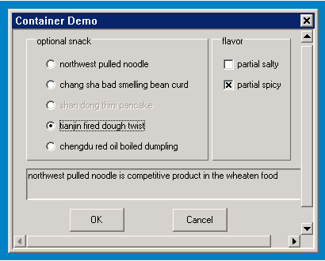

# Container and Derived Classes

## Brief Introduction of Container Class Control

This class of control is the container class control accommodating other 
classes of controls, and the difference from panel class control is that this
class of control provides default window scroll processing.

Class inheritance relation of the window and its derived class is as below:

- [mWidget ](MStudioMGNCSV1dot0PGENP2C3#mWidget)
- [mScrollWidget](MiniGUIProgGuidePart2Chapter08#m_ScrollWidget.md)
* [mContainer](MiniGUIProgGuidePart2Chapter08#mContainer.md)
* [mPage](MiniGUIProgGuidePart2Chapter08#mPage.md)


## `mScrollWidget`

- *Control name*: `NCSCTRL_SCROLLWIDGET`
- *English name*: `ScrollWidget`
- *Brief introduction*: All abstract basic classes including scroll function
control class
- *Schematic diagram*: %RED%Abstract class, cannot be used directly%ENDCOLOR%

### Style of `mScrollWidget`

It is inherited from the style of 
[mWidget](MStudioMGNCSV1dot0PGENP2C3#mWidget). 

### Property of `mScrollWidget`

It is inherited from the property of
[mWidget](MStudioMGNCSV1dot0PGENP2C3#mWidget). 

| *Property ID* | *miniStudio name* | *Type* | *Permission* | *Explanation* |
|---------------|-------------------|--------|--------------|---------------|
| `NCSP_SWGT_CONTWIDTH` | - | unsigned int | `RW` | Content width |
| `NCSP_SWGT_CONTHEIGHT` | - | unsigned int | `RW` | Content height |
| `NCSP_SWGT_CONTX` | `ContentX` | int | `RW` | Offset value of the content in horizontal direction |
| `NCSP_SWGT_CONTY` | `ContentY` | int | `RW` | Offset value of the content in vertical direction |
| `NCSP_SWGT_HSTEPVALUE` | `HStepValue` | unsigned int | `RW` | Horizontal step value when scrolling content |
| `NCSP_SWGT_VSTEPVALUE` | `VStepValue` | unsigned int | `RW` | Vertical step value when scrolling content |
| `NCSP_SWGT_VISWIDTH` | - | unsigned int | `RW` | Width of the visible region |
| `NCSP_SWGT_VISHEIGHT` | - | unsigned int | `RW` | Height of the visible region |
| `NCSP_SWGT_MARGINRECT` | - | unsigned int | `RW` | Boundary rectangle |
| `NCSP_SWGT_DRAWMODE` | `ScrollBarMode` | `ncsSwgtDrawMode` | `RW` | Display mode of the scroll bar |

### Event of `mScrollWidget`

It is inherited from the event of 
[mWidget](MStudioMGNCSV1dot0PGENP2C3#mWidget). 

### Method of `mScrollWidget`

It is inherited from the method of
[mWidget](MStudioMGNCSV1dot0PGENP2C3#mWidget). 

All the methods of `ScrollWidget` are provided for the child class to use,
please avoid using the class interface in the concrete control application.

#### Coordinate Transformation Related Method

When handling scrolled window content, three kinds of coordinates are involved:
- content: coordinate with the appointed content in all the content.
- viewpoint: coordinate with the appointed content in the visible region.
Influenced by the content scroll.
- window: display coordinate with the appointed content in the window.
Influenced by margin region.

Content is the original coordinate of the display content, and window is the
coordinate in MiniGUI window. If you want to convert a content coordinate of 
the original content to window coordinate for display use, transformation is
needed between the two, that is, it is necessary to firstly transform the
content coordinate to viewpoint coordinate. It is like content of several 
pages, if displaying the content of a certain page as the current content,
coordinate of a certain part of the page will start from the starting position
comparative to the overall content to the starting position comparative to the
page. When finally displaying the content to the window, it is necessary to
carry out further transformation from viewpoint to window. That is because in
the client area of the window, often a part of margin will be added to adjust
the display effect. On the contrary, to transform the position of the content
displayed in MiniGUI window to the position in all the content, reversed two
steps of work are necessary.

Relation schematic diagram of the three kinds of coordinates:


Corresponding interface of transformation between the three kinds of 
coordinates are:
```cpp
void contentToViewport(mScrollWidget *self, int *x, int *y); 
void viewportToWindow(mScrollWidget *self, int *x, int *y);
void contentToWindow(mScrollWidget *self, int *x, int *y);

void windowToViewport(mScrollWidget *self, int *x, int *y);
void viewportToContent(mScrollWidget *self, int *x, int *y);
void windowToContent(mScrollWidget *self, int *x, int *y);
```

#### Initialization Related Method

`ScrollWidget` control class configures margin as all 0 value by default. When
the child class based on the control class needs to be configured with margin
different from the parent class, `initMargins` method can be used in 
constructor function to configure again.

```cpp
void initMargins(mScrollWidget *self, int l, int t, int r, int b);
```

Iconview control class in construct method uses the following codes to
initialize the margin of top, bottom, left and right, and the values are all 5.

```cpp
    _c(self)->initMargins(self, 5, 5, 5, 5);
```

#### Refreshment Related Method

When automatically adjusting the scroll bar region and setting configuration
related to the display region, `ScrollWidget` needs to refresh the screen. In
order to meet processing need of different controls, two callbacks are provided
for the convenience of upper layer control processing. At the same time,
`ScrollWidget` also provides realization of default processing:

```cpp
void moveContent(mScrollWidget *self);
void refreshRect(mScrollWidget *self, const RECT *rc);
```

- `moveContent` is mainly used for the update after scrolling content, such as
full screen refreshment after scrolling the window.
- `refreshRect` is used to refresh the content of the appointed region.

#### Method to Getting Information

`ScrollWidget` provides `isVisible` method for child class to judge if a 
certain content position is visible in the current display region, so as to 
make the child class judge if operations such as screen scrolling etc. are
necessary. At the same time, when the child class is carrying out content
drawing, the content needs to be drawn in the appointed visible region.
`getVisRect` method provides convenience for getting the maximum range of
permissible drawing.

```cpp
BOOL (*isVisible)(mScrollWidget *self, int x, int y);
void (*getVisRect)(mScrollWidget *self, RECT *rcVis);
```

- `isVisible` is used to judge if the appointed content position is currently 
in the visible region.
- `getVisRect` is used to get the current visible region.

#### Setting Related Method

`ScrollWidget` and its derived class needs to carry out corresponding setting 
to different information when the window size changes or the content changes,
therefore `ScrollWidget` provides the following methods:

```cpp
void resetViewPort(mScrollWidget *self, unsigned int visW,unsigned int visH);
void setScrollInfo(mScrollWidget *self, BOOL reDraw);
BOOL makePosVisible(mScrollWidget *self, int x, int y);
```

- `resetViewport` is used to readjust the size of the visible region. When the
window size changes, it is necessary to use the interface to adjust the visible
region. 
- `setScrollInfo` method is provided for child class control to use. When the
size of the visible region or the content region changes, carry out
corresponding scroll bar information setting.
- `makePosVisible` is used to automatically display the appointed content
position in the visible region.

### Renderer of `mScrollWidget`

It is inherited from renderer of [mWidget](MStudioMGNCSV1dot0PGENP2C3#mWidget)

`mScrollWidget` does not have newly added renderer method.

## `mContainer`

- *Control name*: `NCSCTRL_CONTAINER`
- *English name*: Container
- *Brief introduction*: Container class control with scroll support

### Style of `mContainer`

It is inherited from the style of style of `mScrollWidget`.

### Property of `mContainer`

It is inherited from the property of `mScrollWidget`.

### Event of `mContainer`

It is inherited from the event of `mScrollWidget`.

### Method of `mContainer`

It is inherited from the method of `mScrollWidget`.

#### Method of Adding Controls

Container provides support to mGNCS control and MiniGUI intrinsic control. If 
it is necessary to add a group of mGNCS controls to Container, `addChildren`
method inherited from `mWidget` class can be used.

```cpp
BOOL addChildren(mContainer *self, NCS_WND_TEMPLATE* children, int count); 
```

```cpp
static NCS_PROP_ENTRY radioGroup_props [] = {
    {NCSP_BUTTON_GROUPID, IDC_RDOGROUP},
    {0, 0}
};

static NCS_WND_TEMPLATE ncsCtrlYourTaste[] = {
    {
        NCSCTRL_BUTTONGROUP,
        IDC_RDOGROUP,
        16, 10, 230, 160,
        WS_VISIBLE,
        WS_EX_TRANSPARENT,
        "optional snack",
        NULL,
        NULL,
        NULL,
        NULL,
        0,
        0
    },
    {
        NCSCTRL_RADIOBUTTON,
        IDC_LAMIAN,
        36, 38, 200, 20,
        WS_VISIBLE | WS_TABSTOP | NCSS_BUTTON_AUTOCHECK,
        WS_EX_NONE,
        "northwest pulled noodle",
        radioGroup_props,
        NULL,
        NULL,
        NULL,
        0,
        0
    },
    {
        NCSCTRL_RADIOBUTTON,
        IDC_CHOUDOUFU,
        36, 64, 200, 20,
        WS_VISIBLE | WS_TABSTOP | NCSS_BUTTON_AUTOCHECK,
        WS_EX_NONE,
        "chang sha bad smelling bean curd",
        radioGroup_props,
        NULL,
        NULL,
        NULL,
        0,
        0
    },
    {
        NCSCTRL_RADIOBUTTON,
        IDC_JIANBING,
        36, 90, 200, 20,
        WS_VISIBLE | WS_TABSTOP | WS_DISABLED,
        WS_EX_NONE,
        "shan dong thini pancake",
        radioGroup_props,
        NULL,
        NULL,
        NULL,
        0,
        0
    },
    {
        NCSCTRL_RADIOBUTTON,
        IDC_MAHUA,
        36, 116, 200, 20,
        WS_VISIBLE | WS_TABSTOP | NCSS_BUTTON_AUTOCHECK,
        WS_EX_NONE,
        "tianjin fired dough twist",
        radioGroup_props,
        NULL,
        NULL,
        NULL,
        0,
        0
    },
    {
        NCSCTRL_RADIOBUTTON,
        IDC_SHUIJIAO,
        36, 142, 200, 20,
        WS_VISIBLE | WS_TABSTOP | NCSS_BUTTON_AUTOCHECK,
        WS_EX_NONE,
        "chengdu red oil boiled dumpling",
        radioGroup_props,
        NULL,
        NULL,
        NULL,
        0,
        0
    },
    {
        NCSCTRL_BUTTONGROUP,
        IDC_CKGROUP,
        250, 10, 100, 160,
        WS_VISIBLE,
        WS_EX_TRANSPARENT,
        "flavor",
        NULL,
        NULL,
        NULL,
        NULL,
        0,
        0
    },
    {
        NCSCTRL_CHECKBUTTON,
        IDC_XIAN,
        260, 38, 80, 20,
        WS_VISIBLE | NCSS_BUTTON_AUTOCHECK,
        WS_EX_NONE,
        "partial salty",
        //checkGroup_props,
        NULL,
        NULL,
        NULL,
        NULL,
        0,
        0
    },
    {
        NCSCTRL_CHECKBUTTON,
        IDC_LA,
        260, 64, 80, 20,
        WS_VISIBLE | NCSS_BUTTON_AUTOCHECK,
        WS_EX_NONE,
        "partial spicy",
        //checkGroup_props,
        NULL,
        NULL,
        NULL,
        NULL,
        0,
        0
    },
    {
        NCSCTRL_STATIC,
        IDC_PROMPT,
        16, 180, 360, 40,
        WS_VISIBLE,
        WS_EX_NONE,
        "northwest pulled noodle is competitive product in the wheaten food",
        NULL,
        NULL,
        NULL,
        NULL,
        0,
        0
    },
    {
        NCSCTRL_BUTTON,
        IDOK,
        70, 230, 70, 30,
        WS_VISIBLE | WS_TABSTOP | NCSS_NOTIFY,
        WS_EX_NONE,
        "Ok",
        NULL,
        NULL,
        NULL,
        NULL,
        0,
        0
    },
    {
        NCSCTRL_BUTTON,
        IDCANCEL,
        200, 230, 70, 30,
        WS_VISIBLE | WS_TABSTOP | NCSS_NOTIFY,
        WS_EX_NONE,
        "Cancel",
        NULL,
        NULL,
        NULL,
        NULL,
        0,
        0
    },
};
```

To add a group of MiniGUI intrinsic controls to Container, 
`addintrinsicControls` method can be used:

```cpp
BOOL addIntrinsicControls(mContainer *self, const PCTRLDATA pCtrl, int nCount);
```


```cpp
static CTRLDATA CtrlYourTaste[] =
{
    {
        "static",
        WS_VISIBLE | SS_GROUPBOX,
        16, 10, 230, 160,
        IDC_STATIC,
        "optional snack",
        0,
        WS_EX_TRANSPARENT
    },
    {
        "button",
        WS_VISIBLE | BS_AUTORADIOBUTTON | BS_CHECKED | WS_TABSTOP | WS_GROUP,
        36, 38, 200, 20,
        IDC_LAMIAN,
        "northwest pulled noodle",
        0
    },
    {
        "button",
        WS_VISIBLE | BS_AUTORADIOBUTTON,
        36, 64, 200, 20,
        IDC_CHOUDOUFU,
        "chang sha bad smelling bean curd",
        0
    },
    {
        "button",
        WS_VISIBLE | BS_AUTORADIOBUTTON | WS_DISABLED,
        36, 90, 200, 20,
        IDC_JIANBING,
        "shan dong thini pancake",
        0
    },
    {
        "button",
        WS_VISIBLE | BS_AUTORADIOBUTTON,
        36, 116, 200, 20,
        IDC_MAHUA,
        "tianjin fired dough twist",
        0
    },
    {
        "button",
        WS_VISIBLE | BS_AUTORADIOBUTTON,
        36, 142, 200, 20,
        IDC_SHUIJIAO,
        "chengdu red oil boiled dumpling",
        0
    },
    {
        "static",
        WS_VISIBLE | SS_GROUPBOX | WS_GROUP,
        250, 10, 100, 160,
        IDC_STATIC,
        "flavor",
        0,
        WS_EX_TRANSPARENT
    },
    {
        "button",
        WS_VISIBLE | BS_AUTOCHECKBOX,
        260, 38, 80, 20,
        IDC_XIAN,
        "partial salty",
        0
    },
    {
        "button",
        WS_VISIBLE | BS_AUTOCHECKBOX | BS_CHECKED,
        260, 64, 80, 20,
        IDC_LA,
        "partial spicy",
        0
    },
    {
        "static",
        WS_VISIBLE | SS_LEFT | WS_GROUP | WS_BORDER,
        16, 180, 360, 40,
        IDC_PROMPT,
        "northwest pulled noodle is competitive product in the wheaten food",
        0
    },
    {
        "button",
        WS_VISIBLE | BS_DEFPUSHBUTTON | WS_TABSTOP | WS_GROUP | WS_BORDER ,
        70, 230, 70, 30,
        IDOK,
        "OK",
        0
    },
    {
        "button",
        WS_VISIBLE | BS_PUSHBUTTON | WS_TABSTOP,
        200, 230, 70, 30,
        IDCANCEL,
        "Cancel",
        0
    },
};
```

#### Focus Related Method

In Container, it is often necessary to set and get the current focus control,
the two methods below are provided for this:

```cpp
HWND setFocus(mContainer *self, int id);
HWND getFocus(mContainer *self);
```

- `setFocus` sets focus control through control `ID`.
- `getFocus` gets the sentence handle of the current focus control.

#### Other Methods

Container provides `adjustContent` method to allow the application to carry out
the function of adjusting its own size through its content instead of 
displaying range through Container control control. `getPanel` method can get
the hosting window sentence handle of the current Container content.

```cpp
HWND getPanel(mContainer *self);
void adjustContent(mContainer *self);
```

### Renderer of `mContainer`

It is inherited from the renderer of `mScrollWidget`. 

`mContainer` does not have newly added renderer method.

### Example of `mContainer`

This example demonstrates how to use Container to realize jumping between
multiple controls exceeding the window size to the users.



##### Figure 1 Output of Container Program

##### List 1 container.c

```cpp
/*
** container.c: Sample program for mGNCS Programming Guide
**      The demo application for Container.
**
** Copyright (C) 2009 ~ 2019 FMSoft Technologies.
*/
#include <stdio.h>
#include <stdlib.h>
#include <string.h>

// START_OF_INCS
#include <minigui/common.h>
#include <minigui/minigui.h>
#include <minigui/gdi.h>
#include <minigui/window.h>
#include <minigui/control.h>

#include <mgncs/mgncs.h>
// END_OF_INCS

#define IDC_CONTAINER   100

#define IDC_RDOGROUP    151
#define IDC_CKGROUP     152

#define IDC_LAMIAN      101
#define IDC_CHOUDOUFU   102
#define IDC_JIANBING    103
#define IDC_MAHUA       104
#define IDC_SHUIJIAO    105
#define IDC_XIAN        110
#define IDC_LA          111
#define IDC_PROMPT      200

// START_OF_NCSCTRLS
static NCS_PROP_ENTRY radioGroup_props [] = {
    {NCSP_BUTTON_GROUPID, IDC_RDOGROUP},
    {0, 0}
};

static NCS_WND_TEMPLATE ncsCtrlYourTaste[] = {
    {
        NCSCTRL_BUTTONGROUP,
        IDC_RDOGROUP,
        16, 10, 230, 160,
        WS_VISIBLE,
        WS_EX_TRANSPARENT,
        "optional snack",
        NULL,
        NULL,
        NULL,
        NULL,
        0,
        0
    },
    {
        NCSCTRL_RADIOBUTTON,
        IDC_LAMIAN,
        36, 38, 200, 20,
        WS_VISIBLE | WS_TABSTOP | NCSS_BUTTON_AUTOCHECK,
        WS_EX_NONE,
        "northwest pulled noodle",
        radioGroup_props,
        NULL,
        NULL,
        NULL,
        0,
        0
    },
    {
        NCSCTRL_RADIOBUTTON,
        IDC_CHOUDOUFU,
        36, 64, 200, 20,
        WS_VISIBLE | WS_TABSTOP | NCSS_BUTTON_AUTOCHECK,
        WS_EX_NONE,
        "chang sha bad smelling bean curd",
        radioGroup_props,
        NULL,
        NULL,
        NULL,
        0,
        0
    },
    {
        NCSCTRL_RADIOBUTTON,
        IDC_JIANBING,
        36, 90, 200, 20,
        WS_VISIBLE | WS_TABSTOP | WS_DISABLED,
        WS_EX_NONE,
        "shan dong thini pancake",
        radioGroup_props,
        NULL,
        NULL,
        NULL,
        0,
        0
    },
    {
        NCSCTRL_RADIOBUTTON,
        IDC_MAHUA,
        36, 116, 200, 20,
        WS_VISIBLE | WS_TABSTOP | NCSS_BUTTON_AUTOCHECK,
        WS_EX_NONE,
        "tianjin fired dough twist",
        radioGroup_props,
        NULL,
        NULL,
        NULL,
        0,
        0
    },
    {
        NCSCTRL_RADIOBUTTON,
        IDC_SHUIJIAO,
        36, 142, 200, 20,
        WS_VISIBLE | WS_TABSTOP | NCSS_BUTTON_AUTOCHECK,
        WS_EX_NONE,
        "chengdu red oil boiled dumpling",
        radioGroup_props,
        NULL,
        NULL,
        NULL,
        0,
        0
    },
    {
        NCSCTRL_BUTTONGROUP,
        IDC_CKGROUP,
        250, 10, 100, 160,
        WS_VISIBLE,
        WS_EX_TRANSPARENT,
        "flavor",
        NULL,
        NULL,
        NULL,
        NULL,
        0,
        0
    },
    {
        NCSCTRL_CHECKBUTTON,
        IDC_XIAN,
        260, 38, 80, 20,
        WS_VISIBLE | NCSS_BUTTON_AUTOCHECK,
        WS_EX_NONE,
        "partial salty",
        //checkGroup_props,
        NULL,
        NULL,
        NULL,
        NULL,
        0,
        0
    },
    {
        NCSCTRL_CHECKBUTTON,
        IDC_LA,
        260, 64, 80, 20,
        WS_VISIBLE | NCSS_BUTTON_AUTOCHECK,
        WS_EX_NONE,
        "partial spicy",
        //checkGroup_props,
        NULL,
        NULL,
        NULL,
        NULL,
        0,
        0
    },
    {
        NCSCTRL_STATIC,
        IDC_PROMPT,
        16, 180, 360, 40,
        WS_VISIBLE,
        WS_EX_NONE,
        "northwest pulled noodle is competitive product in the wheaten food",
        NULL,
        NULL,
        NULL,
        NULL,
        0,
        0
    },
    {
        NCSCTRL_BUTTON,
        IDOK,
        70, 230, 70, 30,
        WS_VISIBLE | WS_TABSTOP | NCSS_NOTIFY,
        WS_EX_NONE,
        "Ok",
        NULL,
        NULL,
        NULL,
        NULL,
        0,
        0
    },
    {
        NCSCTRL_BUTTON,
        IDCANCEL,
        200, 230, 70, 30,
        WS_VISIBLE | WS_TABSTOP | NCSS_NOTIFY,
        WS_EX_NONE,
        "Cancel",
        NULL,
        NULL,
        NULL,
        NULL,
        0,
        0
    },
};
// END_OF_NCSCTRLS

// START_OF_INTRINSICCTRLS
static CTRLDATA CtrlYourTaste[] =
{
    {
        "static",
        WS_VISIBLE | SS_GROUPBOX,
        16, 10, 230, 160,
        IDC_STATIC,
        "optional snack",
        0,
        WS_EX_TRANSPARENT
    },
    {
        "button",
        WS_VISIBLE | BS_AUTORADIOBUTTON | BS_CHECKED | WS_TABSTOP | WS_GROUP,
        36, 38, 200, 20,
        IDC_LAMIAN,
        "northwest pulled noodle",
        0
    },
    {
        "button",
        WS_VISIBLE | BS_AUTORADIOBUTTON,
        36, 64, 200, 20,
        IDC_CHOUDOUFU,
        "chang sha bad smelling bean curd",
        0
    },
    {
        "button",
        WS_VISIBLE | BS_AUTORADIOBUTTON | WS_DISABLED,
        36, 90, 200, 20,
        IDC_JIANBING,
        "shan dong thini pancake",
        0
    },
    {
        "button",
        WS_VISIBLE | BS_AUTORADIOBUTTON,
        36, 116, 200, 20,
        IDC_MAHUA,
        "tianjin fired dough twist",
        0
    },
    {
        "button",
        WS_VISIBLE | BS_AUTORADIOBUTTON,
        36, 142, 200, 20,
        IDC_SHUIJIAO,
        "chengdu red oil boiled dumpling",
        0
    },
    {
        "static",
        WS_VISIBLE | SS_GROUPBOX | WS_GROUP,
        250, 10, 100, 160,
        IDC_STATIC,
        "flavor",
        0,
        WS_EX_TRANSPARENT
    },
    {
        "button",
        WS_VISIBLE | BS_AUTOCHECKBOX,
        260, 38, 80, 20,
        IDC_XIAN,
        "partial salty",
        0
    },
    {
        "button",
        WS_VISIBLE | BS_AUTOCHECKBOX | BS_CHECKED,
        260, 64, 80, 20,
        IDC_LA,
        "partial spicy",
        0
    },
    {
        "static",
        WS_VISIBLE | SS_LEFT | WS_GROUP | WS_BORDER,
        16, 180, 360, 40,
        IDC_PROMPT,
        "northwest pulled noodle is competitive product in the wheaten food",
        0
    },
    {
        "button",
        WS_VISIBLE | BS_DEFPUSHBUTTON | WS_TABSTOP | WS_GROUP | WS_BORDER ,
        70, 230, 70, 30,
        IDOK,
        "OK",
        0
    },
    {
        "button",
        WS_VISIBLE | BS_PUSHBUTTON | WS_TABSTOP,
        200, 230, 70, 30,
        IDCANCEL,
        "Cancel",
        0
    },
};
// END_OF_INTRINSICCTRLS

// START_OF_HANDLERS
static void dialog_onCSizeChanged(mWidget* self, int clientWidth, int clientHeight)
{
    HWND hContainer = GetDlgItem(self->hwnd, IDC_CONTAINER);
    if (hContainer != HWND_NULL || hContainer != HWND_INVALID)
        MoveWindow(hContainer, 0, 0, clientWidth, clientHeight, TRUE);
}

static BOOL container_onCommand(mWidget* self, int id, int nc, HWND hCtrl)
{
    if (id == IDOK || id == IDCANCEL) {

        if (nc == NCSN_BUTTON_PUSHED) {
            //close dialog
            HWND hParent = GetParent(self->hwnd);
            SendNotifyMessage(hParent,
                    MSG_COMMAND, (WPARAM)MAKELONG(id, nc), (LPARAM)hCtrl);
        }

        return FALSE;
    }

    return FALSE;
}

static NCS_EVENT_HANDLER container_handlers[] = {
    {MSG_COMMAND, container_onCommand},
    {0, NULL}
};
// END_OF_HANDLERS

int MiniGUIMain(int argc, const char* argv[])
{
    ncsInitialize ();

    mDialogBox* dialog = (mDialogBox*)ncsCreateMainWindow (
        NCSCTRL_DIALOGBOX, "Container Demo",
        WS_CAPTION | WS_BORDER | WS_VISIBLE | NCSS_MNWND_MODE,
        WS_EX_NONE,
        1,
        0, 0, 400, 320,
        HWND_DESKTOP,
        0, 0,
        NULL,
        NULL,
        NULL,
        0);

    ncsSetComponentHandler((mComponent*)dialog,
            MSG_CSIZECHANGED, dialog_onCSizeChanged);

    mContainer *container =
        (mContainer*)ncsCreateWindow (NCSCTRL_CONTAINER,
                          "",
                          WS_BORDER | WS_VISIBLE,
                          WS_EX_NONE,
                          IDC_CONTAINER,
                          0, 0, 300, 200, dialog->hwnd,
                          NULL, NULL, container_handlers, 0);

    if (argc > 1 && strcmp(argv[1], "intrinsic") == 0) {
        _c(container)->addIntrinsicControls (container, CtrlYourTaste,
                sizeof(CtrlYourTaste)/sizeof(CTRLDATA));
    }
    else {
        _c(container)->addChildren(container, ncsCtrlYourTaste,
                sizeof(ncsCtrlYourTaste)/sizeof(NCS_WND_TEMPLATE));
    }

    _c(dialog)->doModal(dialog, TRUE);

    MainWindowThreadCleanup (dialog->hwnd);
    ncsUninitialize ();

    return 0;
}
```

## `mPage`

- *Control name*: `NCSCTRL_PAGE`
- *English name*: Page
- *Brief introduction*: Property page control, used to display same class
information and window content.

### Style of `mPage`

It is inherited from style of `mContainer`.

### Property of `mPage`

It is inherited from property of `mContainer`.

### Event of `mPage`

It is inherited from event of `mContainer`.

### Method pf `mPage`

It is inherited from method of `mContainer`.

### Renderer of `mPage`

It is inherited from renderer of `mContainer`.

`mPage` does not have newly added renderer method

### Example of `mPage`

----

[&lt;&lt; Panel and Derived Classes](MiniGUIProgGuidePart2Chapter07.md) |
[Table of Contents](README.md) |
[Slider Control Class &gt;&gt;](MiniGUIProgGuidePart2Chapter09.md)

[Release Notes for MiniGUI 3.2]: /supplementary-docs/Release-Notes-for-MiniGUI-3.2.md
[Release Notes for MiniGUI 4.0]: /supplementary-docs/Release-Notes-for-MiniGUI-4.0.md
[Showing Text in Complex or Mixed Scripts]: /supplementary-docs/Showing-Text-in-Complex-or-Mixed-Scripts.md
[Supporting and Using Extra Input Messages]: /supplementary-docs/Supporting-and-Using-Extra-Input-Messages.md
[Using CommLCD NEWGAL Engine and Comm IAL Engine]: /supplementary-docs/Using-CommLCD-NEWGAL-Engine-and-Comm-IAL-Engine.md
[Using Enhanced Font Interfaces]: /supplementary-docs/Using-Enhanced-Font-Interfaces.md
[Using Images and Fonts on System without File System]: /supplementary-docs/Using-Images-and-Fonts-on-System-without-File-System.md
[Using SyncUpdateDC to Reduce Screen Flicker]: /supplementary-docs/Using-SyncUpdateDC-to-Reduce-Screen-Flicker.md
[Writing DRI Engine Driver for Your GPU]: /supplementary-docs/Writing-DRI-Engine-Driver-for-Your-GPU.md
[Writing MiniGUI Apps for 64-bit Platforms]: /supplementary-docs/Writing-MiniGUI-Apps-for-64-bit-Platforms.md

[Quick Start]: /user-manual/MiniGUIUserManualQuickStart.md
[Building MiniGUI]: /user-manual/MiniGUIUserManualBuildingMiniGUI.md
[Compile-time Configuration]: /user-manual/MiniGUIUserManualCompiletimeConfiguration.md
[Runtime Configuration]: /user-manual/MiniGUIUserManualRuntimeConfiguration.md
[Tools]: /user-manual/MiniGUIUserManualTools.md
[Feature List]: /user-manual/MiniGUIUserManualFeatureList.md

[MiniGUI Overview]: /MiniGUI-Overview.md
[MiniGUI User Manual]: /user-manual/README.md
[MiniGUI Programming Guide]: /programming-guide/README.md
[MiniGUI Porting Guide]: /porting-guide/README.md
[MiniGUI Supplementary Documents]: /supplementary-docs/README.md
[MiniGUI API Reference Manuals]: /api-reference/README.md

[MiniGUI Official Website]: http://www.minigui.com
[Beijing FMSoft Technologies Co., Ltd.]: https://www.fmsoft.cn
[FMSoft Technologies]: https://www.fmsoft.cn
[HarfBuzz]: https://www.freedesktop.org/wiki/Software/HarfBuzz/
