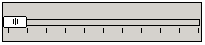
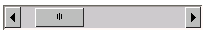
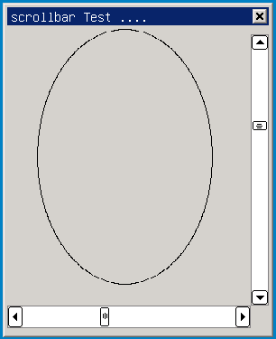

# Chapter 8 of Part 2 Slider Control Class


## Brief Introduction of Slider Control
The slider control is mainly visual realization to the adjustment logic of a
value. Through dragging and sliding the control, occasions of the users
adjusting the brightness and volume and operation of adjusting the value of a
certain range are more visual, avoiding the trouble of keyboard input.

- Hierarchical relation of slider control class

- [ `mWidget` ](MStudioMGNCSV1dot0PGENP2C3#mWidget)
* [ `mSlider` ](MiniGUIProgGuidePart2Chapter09#mSlider.md)
* [ `mTrackBar` ](MiniGUIProgGuidePart2Chapter09#m_TrackBar.md)
* [ `mScrollBar` ](MiniGUIProgGuidePart2Chapter09#m_ScrollBar.md)

* Control creating method
- Automatic creation: drag corresponding slider control through interface
designer in miniStudio, and miniStudio will automatically create control and
provide visual control configuration, and at the same time, creation codes are
generated automatically.
- Manual generation: according to mGNCS control creation process, through
programming, corresponding control window class `ID` is imported and control is
generated. Manual programming sets control property and event handling.

## mSlider

- *Control window class*: `NCSCTRL_SLIDER`
- *Control English name*: Slider
- *Brief introduction*: Basic class of slider series controls
- *Schematic diagram*:

*%RED%The control is abstract control and cannot be used directly%ENDCOLOR%*

### Style of `mSlider`

It is inherited from the style of [mWidget](MStudioMGNCSV1dot0PGENP2C3)
| *Style name* | *miniStudio property name* | *Explanation* |
| `NCSS_SLD_HORIZONTAL` | -- | Create horizontal Slider control (default) |
| `NCSS_SLD_VERTICAL` | -- | Create vertical Slider control |

### Property of `mSlider`

It is inherited from the property of [mWidget](MStudioMGNCSV1dot0PGP2C3)
| *Property* | *miniStudio property name* | *Type* | *RW* | *Explanation* ||
| `NCSP_SLD_MAXPOS` | -- | int | `RW` | Set the maximum value of slide range of Slider | Setting of the maximum and minimum values is generally done at initialization |
| `NCSP_SLD_MINPOS` | -- | int | `RW` | Set the minimum value of slide range of Slider | ^ |
| `NCSP_SLD_CURPOS` | -- | int | `RW` | Set the current location of the slide block ||
| `NCSP_SLD_LINESTEP` | -- | int | `RW` | Set step length (direction key) ||
| `NCSP_SLD_PAGESTEP` | -- | int | `RW` | Set step length (pageUp/pageDown) ||

### Event of `mSlider`
It is inherited from the event of [mWidget](MStudioMGNCSV1dot0PGP2C3)
| *Event ID | *Parameter* | *Explanation* |
| `NCSN_SLD_CHANGED` | -- | Slide block location changes |
| `NCSN_SLD_REACHMAX` | -- | The slide block reaches the maximum value |
| `NCSN_SLD_REACHMIN` | -- | The slide block reaches the minimum value |

### Method of `mSlider`
It is inherited from the method of [mWidget](MStudioMGNCSV1dot0PGENP2C3)

### Example of `mSlider`
*%RED%The control is abstract control and cannot be used directly%ENDCOLOR%*

## mTrackBar
## mTrackBar

- *Control window class*: `NCSCTRL_TRACKBAR`
- *Control English name*: Trackbar
- *Brief introduction*: The slide block control adjusts the value within the
range 
- *Schematic diagram*:




### Style of `mTrackBar`
It is inherited from the style of [mSlider](MStudioMGNCSV1dot0PGP2C8)
| *Style* | *miniStudio property name* | *Explanation* |
| `NCSS_TRKBAR_HORIZONTAL` | -- | Create horizontal Trackbar control (default) |
| `NCSS_TRKBAR_VERTICAL` | -- | Create vertical Trackbar control |
| `NCSS_TRKBAR_NOTICK` | Ruler -> False | Scale is not displayed |
| ^ | Ruler -> True | Scale is displayed |

### Property of `mTrackBar`
It is inherited from the property of [mSlider](MStudioMGNCSV1dot0PGP2C8)
| *Property name* | *miniStudio property name* | *Type* | *RW* | *Explanation* ||
| `NCSP_TRKBAR_MAXPOS` | `MaxPos` | int | `RW` | Set the maximum value of the slide range of Trackbar | Setting of the maximum and minimum values is generally done at initialization |
| `NCSP_TRKBAR_MINPOS` | `MinPos` | int | `RW` | Set the minimum value of the slide range of the Trackbar | ^ |
| `NCSP_TRKBAR_CURPOS` | `CurPos` | int | `RW` | Set the current location of the slide block ||
| `NCSP_TRKBAR_LINESTEP` | `LineStep` | int | `RW` | Set step length (direction key) ||
| `NCSP_TRKBAR_PAGESTEP` | `PageStep` | int | `RW` | Set step length (pageUp/pageDown) ||

### Event of `mTrackBar`
It is inherited from the event of [mSlider](MiniGUIProgGuidePart2Chapter09.md)
| *Event ID | *Parameter* | *Explanation* |
| `NCSN_TRKBAR_CHANGED` | -- | Slide block location changes |
| `NCSN_TRKBAR_REACHMAX` | -- | The slide block reaches the maximum value |
| `NCSN_TRKBAR_REACHMIN` | -- | The slide block reaches the minimum value |

### Method of `mTrackBar`
It is inherited from the method of [mSlider](MiniGUIProgGuidePart2Chapter09.md)

### Renderers of `mTrackBar`

#### `mTrackBar` Classic Renderer

For the drawing of non client area, please refer to the renderer of
[mWidget](MStudioMGNCSV1dot0PGENP2C3#mWidget) 
| *Property ID | *Meaning* | *miniStudio property name* | *Value type* | *Schematic diagram of the valid region* | *Value Region* |
| `NCS_BGC_3DBODY` | Color of slide block and slide rail | `ColorBg3DBody` | `DWORD(ARGB`) | | |
| `NCS_BGC_DISABLED_ITEM` | Color of the slide block when the control is invalid | `ColorBgDisable` | `DWORD(ARGB`) || |

#### `mTrackBar` Skin Renderer

Refer to [Appendix B : Specification for the Image Resource Used by Skin
Renderer](MStudioMGNCSV1dot0PGENAppB#mTrackbar) 

#### `mTrackBar` Fashion Renderer

For the drawing of non client area, please refer to the drawing of Fashion
renderer of [mWidget](MStudioMGNCSV1dot0PGENP2C3#mWidget)

| *Property ID | *Meaning* | *miniStudio property name* | *Value type* | *Schematic diagram of the valid region* | *Value Region* |
| `NCS_BGC_3DBODY` | Color of the slide block | `ColorBg3DBody` | `DWORD(ARGB`) | | |
| `NCS_BGC_DISABLED_ITEM` | Color of the slide block when the control is invalid | `ColorBgDisable` | `DWORD(ARGB`) || |
| `NCS_BGC_TRKBAR_SLIDER` | Color of the slide rail | `SliderColor` | `DWORD(ARGB`) || |
| `NCS_METRICS_3DBODY_ROUNDX` | Round corner X radius of the slide block | `ThumbRoundX` | int | | 0 ~ 1/2 of the window width |
| `NCS_METRICS_3DBODY_ROUNDY` | Round corner Y radius of the slide block | `ThumbRoundY` | int| | 0 ~ 1/2 of the window height |

#### `mTrackBar` Flat Renderer
For the drawing of non client area, please refer to the drawing of Flat 
renderer of [mWidget](MStudioMGNCSV1dot0PGENP2C3#mWidget)

| *Property ID | *Meaning* | *miniStudio property name* | *Value type* | *Schematic diagram of the valid region* | *Value range* |
| `NCS_FGC_3DBODY` | Color of the slide block side | `ColorFg3DBody` | `DWORD(ARGB`) |  | |
| `NCS_BGC_3DBODY` | Color of the slide block | `ColorBg3DBody` | `DWORD(ARGB`) | Same as Classic renderer | |

### Example of `mTrackBar`

<p align=center>


Figure p2c8-1 Example of trackbar
</p>

##### List 1 trackbar.c
##### List 1 trackbar.c
<p align=center>List p2c8-1 trackbar.c</p>
```cpp
%INCLUDE{"%ATTACHURL%/trackbar.c.txt"}%
```

## mScrollBar

- *Control window class*: `NCSCTRL_SCROLLBAR`
- *Control English name*: Scrollbar
- *Brief introduction*: Slide block that can be dragged, commonly used for
window content display adjustment
- *Schematic diagram*:




### Style of `mScrollBar`

It is inherited from the style of [mSlider](MiniGUIProgGuidePart2Chapter09.md)
| *Style* | *miniStudio property name* | *Explanation* |
| `NCSS_SCRLBR_HORIZONTAL` | -- | Create horizontal scrollbar control (default) |
| `NCSS_SCRLBR_VERTICAL` | -- | Create vertical scrollbar control |
| `NCSS_SCRLBR_ARROWS` | `HaveArrows` | Mark if a scroll bar has arrow |
| `NCSS_SCRLBR_LEFTDBLARROWS` | `DoubleArrows` -> Left | Mark if a scroll bar has left double arrows (mutually exclude with `NCSS_SCROLLBAR_RIGHTDBLARROWS`) |
| `NCSS_SCRLBR_RIGHTDBLARROWS` | `DoubleArrows` -> Right | Mark if a scroll bar has right double arrows (mutually exclude with `NCSS_SCROLLBAR_LEFTDBLARROW`) |
| `NCSS_SCRLBR_UPDBLARROWS` | `DoubleArrows` -> Up | Mark if a scroll bar has up arrow (mutually exclude with `NCSS_SCROLLBAR_DOWNDBLAROWS`)|
| `NCSS_SCRLBR_DOWNDBLAROWS` | `DoubleArrows` -> Down |Mark if a scroll bar has down arrow (mutually exclude with `NCSS_SCROLLBAR_DUPDBLAROWS`)|


### Property of `mScrollBar`
It is inherited from the property of [mSlider](MStudioMGNCSV1dot0PGP2C8)
| *Property name* | *miniStudio property name* | *Type* | *RW* | *Explanation* ||
| `NCSP_SCRLBR_MAXPOS` | `MaxPos` | int | `RW` | Set the maximum value of the slide range of scrollbar| Setting of maximum and minimum values is generally done at initialization |
| `NCSP_SCRLBR_MINPOS` | `MinPos` | int | `RW` | Set the minimum value of the slide range of scrollbar | ^ |
| `NCSP_SCRLBR_CURPOS` | `CurPos` | int | `RW` | Set current location of the slide block ||
| `NCSP_SCRLBR_LINESTEP` | `LineStep` | int | `RW` | Set step length (direction key) ||
| `NCSP_SCRLBR_PAGESTEP` | `PageStep` | int | `RW` | Set step length (pageUp/pageDown) ||

### Event of `mScrollBar`
It is inherited from the event of [mSlider](MStudioMGNCSV1dot0PGP2C8)
| *Event ID | *Parameter* | *Explanation* |
| `NCSN_SCRLBR_CHANGED` | -- | Slide block location changed |
| `NCSN_SCRLBR_REACHMAX` | -- | The slide block reaches the maximum value |
| `NCSN_SCRLBR_REACHMIN` | -- | The slide block reaches the minimum value |


### Method of `mScrollBar`
It is inherited from the method of [mSlider](MStudioMGNCSV1dot0PGP2C8)

### Renderer of `mScrollBar`

#### `mScrollBar` Classic Renderer

For the drawing of non client area, please refer to the renderer of
[mWidget](MStudioMGNCSV1dot0PGENP2C3#mWidget) 

| *Property ID | *Meaning* | *miniStudio property name* | *Value type* | *Schematic diagram of the valid region* | *Value Range* |
| `NCS_BGC_3DBODY` | Background color of the control | `BgColor` | `DWORD(ARGB`) | | |
| `NCS_BGC_DISABLED_ITEM` | Color of the slide block and arrow button when the control is invalid | `ColorBgDisable` | `DWORD(ARGB`) || |
| `NCS_FGC_3DBODY` | Color of the button up arrow | `ArrowColor` | `DWORD(ARGB`) | | |
| `NCS_FGC_DISABLED_ITEM` | Color of the arrow when the button is invalid | `ArrowColorDisable` | `DWORD(ARGB`) | | |

#### `mScrollBar` Skin Renderer

Refer to [Appendix B : Specification for the Image Resource Used by Skin
Renderer](MStudioMGNCSV1dot0PGENAppB#mTrackbar) 

#### `mScrollBar` Fashion Renderer

For the drawing of non client area, please refer to the drawing of Fashion
renderer of [mWidget](MStudioMGNCSV1dot0PGENP2C3#mWidget)

| *Property ID | *Meaning* | *miniStudio property name* | *Value type* | *Schematic diagram of the valid region* | *Value Range* |
| `NCS_BGC_3DBODY` | Color of the slide block and button | `ColorBg3DBody` | `DWORD(ARGB`) | | |
| `NCS_BGC_DISABLED_ITEM` | Color of the slide block and arrow button when the control is invalid | `ColorBgDisable` | `DWORD(ARGB`) | Same as Classic renderer | |
| `NCS_BGC_WINDOW` | Color of the slide rail | `ColorBgWindow` | `DWORD(ARGB`) |  | |
| `NCS_FGC_DISABLED_ITEM` | Color of the arrow when the button is invalid | `ArrowColorDisable` | `DWORD(ARGB`) | Same as Classic renderer | |
| `NCS_METRICS_3DBODY_ROUNDX` | Round corner X radius of the slide block | `RoundX` | int | | 0 ~ 1/2 of the window width |
| `NCS_METRICS_3DBODY_ROUNDY` | Round corner Y radius of the slide block | `RoundY` | int| | 0 ~ 1/2 of the window height |
| `NCS_MODE_BGC` | Gradual change fill mode | `GradientMode` | int || [GradientMode](MStudioMGNCSV1dot0PGP2C5#GrandientMode) |
| | | | | | |

#### `mScrollBar` Flat Renderer
For the drawing of non client area, please reefer to the drawing of Flat
renderer of [mWidget](MStudioMGNCSV1dot0PGENP2C3#mWidget)

| *Property ID | *Meaning* | *miniStudio property name* | *Value type* | *Schematic diagram of the valid region* | *Value range* |
| `NCS_FGC_3DBODY` | Color of the slide block and button side | `ColorFg3DBody` | `DWORD(ARGB`) |  | |
| `NCS_BGC_3DBODY` | Background color of the control | `ColorBg3DBody` | `DWORD(ARGB`) |  | |

### Example of `mScrollbar`

<p align=center>



Figure p2c8-2 Example of scrollbar

</p>

##### List 2 scrollbar.c
##### List 2 scrollbar.c
<p align=center>List p2c8-2 scrollbar.c</p>

```cpp
%INCLUDE{"%ATTACHURL%/scrollbar.c.txt"}%
```

[Next](MStudioMGNCSV1dot0PGENP2C7][Previous]] < [[MStudioMGNCSV1dot0PGEN][Index]] > [[MStudioMGNCSV1dot0PGENP2C9)


----

[&lt;&lt; ](MiniGUIProgGuidePart.md) |
[Table of Contents](README.md) |
[ &gt;&gt;](MiniGUIProgGuidePart.md)

[Release Notes for MiniGUI 3.2]: /supplementary-docs/Release-Notes-for-MiniGUI-3.2.md
[Release Notes for MiniGUI 4.0]: /supplementary-docs/Release-Notes-for-MiniGUI-4.0.md
[Showing Text in Complex or Mixed Scripts]: /supplementary-docs/Showing-Text-in-Complex-or-Mixed-Scripts.md
[Supporting and Using Extra Input Messages]: /supplementary-docs/Supporting-and-Using-Extra-Input-Messages.md
[Using CommLCD NEWGAL Engine and Comm IAL Engine]: /supplementary-docs/Using-CommLCD-NEWGAL-Engine-and-Comm-IAL-Engine.md
[Using Enhanced Font Interfaces]: /supplementary-docs/Using-Enhanced-Font-Interfaces.md
[Using Images and Fonts on System without File System]: /supplementary-docs/Using-Images-and-Fonts-on-System-without-File-System.md
[Using SyncUpdateDC to Reduce Screen Flicker]: /supplementary-docs/Using-SyncUpdateDC-to-Reduce-Screen-Flicker.md
[Writing DRI Engine Driver for Your GPU]: /supplementary-docs/Writing-DRI-Engine-Driver-for-Your-GPU.md
[Writing MiniGUI Apps for 64-bit Platforms]: /supplementary-docs/Writing-MiniGUI-Apps-for-64-bit-Platforms.md

[Quick Start]: /user-manual/MiniGUIUserManualQuickStart.md
[Building MiniGUI]: /user-manual/MiniGUIUserManualBuildingMiniGUI.md
[Compile-time Configuration]: /user-manual/MiniGUIUserManualCompiletimeConfiguration.md
[Runtime Configuration]: /user-manual/MiniGUIUserManualRuntimeConfiguration.md
[Tools]: /user-manual/MiniGUIUserManualTools.md
[Feature List]: /user-manual/MiniGUIUserManualFeatureList.md

[MiniGUI Overview]: /MiniGUI-Overview.md
[MiniGUI User Manual]: /user-manual/README.md
[MiniGUI Programming Guide]: /programming-guide/README.md
[MiniGUI Porting Guide]: /porting-guide/README.md
[MiniGUI Supplementary Documents]: /supplementary-docs/README.md
[MiniGUI API Reference Manuals]: /api-reference/README.md

[MiniGUI Official Website]: http://www.minigui.com
[Beijing FMSoft Technologies Co., Ltd.]: https://www.fmsoft.cn
[FMSoft Technologies]: https://www.fmsoft.cn
[HarfBuzz]: https://www.freedesktop.org/wiki/Software/HarfBuzz/
