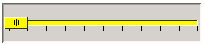
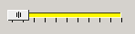
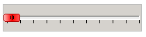
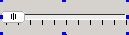
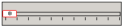
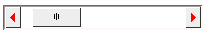
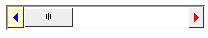
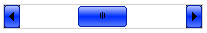
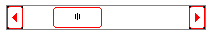

# Slider Control Class

## Brief Introduction of Slider Control

The slider control is mainly visual realization to the adjustment logic of a
value. Through dragging and sliding the control, occasions of the users
adjusting the brightness and volume and operation of adjusting the value of a
certain range are more visual, avoiding the trouble of keyboard input.

- Hierarchical relation of slider control class

- [`mWidget`](MiniGUIProgGuidePart2Chapter04.md#mwidget)
   * [`mSlider`](MiniGUIProgGuidePart2Chapter09.md#mslider)
      * [`mTrackBar`](MiniGUIProgGuidePart2Chapter09.md#mtrackbar)
      * [`mScrollBar`](MiniGUIProgGuidePart2Chapter09.md#mscrollbar)

* Control creating method
- Automatic creation: drag corresponding slider control through interface
designer in miniStudio, and miniStudio will automatically create control and
provide visual control configuration, and at the same time, creation codes are
generated automatically.
- Manual generation: according to mGNCS control creation process, through
programming, corresponding control window class ID is imported and control is
generated. Manual programming sets control property and event handling.

## mSlider

- *Control window class*: `NCSCTRL_SLIDER`
- *Control English name*: Slider
- *Brief introduction*: Basic class of slider series controls
- *Schematic diagram*:

_The control is abstract control and cannot be used directly._

### Style of `mSlider`

It is inherited from the style of [mWidget](MiniGUIProgGuidePart2Chapter04.md)

| *Style name* | *miniStudio property name* | *Explanation* |
|--------------|----------------------------|---------------|
| `NCSS_SLD_HORIZONTAL` | -- | Create horizontal Slider control (default) |
| `NCSS_SLD_VERTICAL` | -- | Create vertical Slider control |

### Property of `mSlider`

It is inherited from the property of [mWidget](MiniGUIProgGuidePart2Chapter04.md)

| *Property* | *miniStudio property name* | *Type* | *RW* | *Explanation* | *Comments* |
|------------|----------------------------|--------|------|---------------|------------|
| `NCSP_SLD_MAXPOS` | -- | int | `RW` | Set the maximum value of slide range of Slider | Setting of the maximum and minimum values is generally done at initialization |
| `NCSP_SLD_MINPOS` | -- | int | `RW` | Set the minimum value of slide range of Slider | ^ |
| `NCSP_SLD_CURPOS` | -- | int | `RW` | Set the current location of the slide block | - |
| `NCSP_SLD_LINESTEP` | -- | int | `RW` | Set step length (direction key) | - |
| `NCSP_SLD_PAGESTEP` | -- | int | `RW` | Set step length (pageUp/pageDown) | - |

### Event of `mSlider`

It is inherited from the event of [mWidget](MiniGUIProgGuidePart2Chapter04.md)

| *Event ID* | *Parameter* | *Explanation* |
|------------|-------------|---------------|
| `NCSN_SLD_CHANGED` | -- | Slide block location changes |
| `NCSN_SLD_REACHMAX` | -- | The slide block reaches the maximum value |
| `NCSN_SLD_REACHMIN` | -- | The slide block reaches the minimum value |

### Method of `mSlider`

It is inherited from the method of [mWidget](MiniGUIProgGuidePart2Chapter04.md)

### Example of `mSlider`

*The control is abstract control and cannot be used directly.*

## mTrackBar

- *Control window class*: `NCSCTRL_TRACKBAR`
- *Control English name*: Trackbar
- *Brief introduction*: The slide block control adjusts the value within the
range 
- *Schematic diagram*:


### Style of `mTrackBar`
It is inherited from the style of [mSlider](MiniGUIProgGuidePart2Chapter09.md)

| *Style* | *miniStudio property name* | *Explanation* |
|---------|----------------------------|---------------|
| `NCSS_TRKBAR_HORIZONTAL` | -- | Create horizontal Trackbar control (default) |
| `NCSS_TRKBAR_VERTICAL` | -- | Create vertical Trackbar control |
| `NCSS_TRKBAR_NOTICK` | Ruler -> False | Scale is not displayed |
| ^ | Ruler -> True | Scale is displayed |

### Property of `mTrackBar`

It is inherited from the property of [mSlider](MiniGUIProgGuidePart2Chapter09.md)

| *Property name* | *miniStudio property name* | *Type* | *RW* | *Explanation* | *Comments* |
|-----------------|----------------------------|--------|------|---------------|------------|
| `NCSP_TRKBAR_MAXPOS` | `MaxPos` | int | `RW` | Set the maximum value of the slide range of Trackbar | Setting of the maximum and minimum values is generally done at initialization |
| `NCSP_TRKBAR_MINPOS` | `MinPos` | int | `RW` | Set the minimum value of the slide range of the Trackbar | ^ |
| `NCSP_TRKBAR_CURPOS` | `CurPos` | int | `RW` | Set the current location of the slide block ||
| `NCSP_TRKBAR_LINESTEP` | `LineStep` | int | `RW` | Set step length (direction key) ||
| `NCSP_TRKBAR_PAGESTEP` | `PageStep` | int | `RW` | Set step length (pageUp/pageDown) ||

### Event of `mTrackBar`
It is inherited from the event of [mSlider](MiniGUIProgGuidePart2Chapter09.md)

| *Event ID* | *Parameter* | *Explanation* |
|------------|-------------|---------------|
| `NCSN_TRKBAR_CHANGED` | -- | Slide block location changes |
| `NCSN_TRKBAR_REACHMAX` | -- | The slide block reaches the maximum value |
| `NCSN_TRKBAR_REACHMIN` | -- | The slide block reaches the minimum value |

### Method of `mTrackBar`

It is inherited from the method of [mSlider](MiniGUIProgGuidePart2Chapter09.md)

### Renderers of `mTrackBar`

#### `mTrackBar` Classic Renderer

For the drawing of non client area, please refer to the renderer of [mWidget](MiniGUIProgGuidePart2Chapter04.md#mwidget).

| *Property ID* | *Meaning* | *miniStudio property name* | *Value type* | *Schematic diagram of the valid region* | *Value Region* |
|---------------|-----------|----------------------------|--------------|-----------------------------------------|----------------|
| `NCS_BGC_3DBODY` | Color of slide block and slide rail | `ColorBg3DBody` | `DWORD(ARGB`) | | |
| `NCS_BGC_DISABLED_ITEM` | Color of the slide block when the control is invalid | `ColorBgDisable` | `DWORD(ARGB`) || |

#### `mTrackBar` Skin Renderer

Refer to [Appendix B : Specification for the Image Resource Used by Skin Renderer](MiniGUIProgGuideAppendixB.md#mtrackbar) 

#### `mTrackBar` Fashion Renderer

For the drawing of non client area, please refer to the drawing of Fashion
renderer of [mWidget](MiniGUIProgGuidePart2Chapter04.md#mwidget)

| *Property ID* | *Meaning* | *miniStudio property name* | *Value type* | *Schematic diagram of the valid region* | *Value Region* |
|---------------|-----------|----------------------------|--------------|-----------------------------------------|----------------|
| `NCS_BGC_3DBODY` | Color of the slide block | `ColorBg3DBody` | `DWORD(ARGB`) | | |
| `NCS_BGC_DISABLED_ITEM` | Color of the slide block when the control is invalid | `ColorBgDisable` | `DWORD(ARGB`) || |
| `NCS_BGC_TRKBAR_SLIDER` | Color of the slide rail | `SliderColor` | `DWORD(ARGB`) || |
| `NCS_METRICS_3DBODY_ROUNDX` | Round corner X radius of the slide block | `ThumbRoundX` | int | | 0 ~ 1/2 of the window width |
| `NCS_METRICS_3DBODY_ROUNDY` | Round corner Y radius of the slide block | `ThumbRoundY` | int| | 0 ~ 1/2 of the window height |

#### `mTrackBar` Flat Renderer

For the drawing of non client area, please refer to the drawing of Flat 
renderer of [mWidget](MiniGUIProgGuidePart2Chapter04.md#mwidget)

| *Property ID* | *Meaning* | *miniStudio property name* | *Value type* | *Schematic diagram of the valid region* | *Value range* |
| `NCS_FGC_3DBODY` | Color of the slide block side | `ColorFg3DBody` | `DWORD(ARGB`) |  | |
| `NCS_BGC_3DBODY` | Color of the slide block | `ColorBg3DBody` | `DWORD(ARGB`) | Same as Classic renderer | |

### Example of `mTrackBar`


__Figure 1__ Example of trackbar

__List 1__ trackbar.c

```cpp
#include <stdio.h>
#include <stdlib.h>
#include <string.h>

#include <minigui/common.h>
#include <minigui/minigui.h>
#include <minigui/gdi.h>
#include <minigui/window.h>
#include <minigui/control.h>

#include <mgncs/mgncs.h>

#define ID_TRB1     101
#define ID_TRB2     102
#define ID_RECT        200

static BOOL mymain_onCreate(mWidget* self, DWORD add_data)
{
    return TRUE;
}

static void mymain_onClose(mWidget* self, int message)
{
    DestroyMainWindow(self->hwnd);
    PostQuitMessage(0);
}

static NCS_PROP_ENTRY trk_props [] = {
    {NCSP_TRKBAR_MINPOS, 0},
    {NCSP_TRKBAR_MAXPOS, 25},
    {NCSP_TRKBAR_CURPOS, 0},
    {NCSP_TRKBAR_LINESTEP, 5},
    {NCSP_TRKBAR_PAGESTEP, 5},
    {0, 0}
};

static void trackbar_notify(mTrackBar* self, int id, int code, DWORD add_data)
{
    mRectangle *rect = (mRectangle*)ncsGetChildObj(GetParent(self->hwnd), ID_RECT);

    if(rect)
    {
        DWORD fill_color = _c(rect)->getProperty(rect, NCSP_RECTANGLE_FILLCOLOR);
        int r = GetRValue(fill_color);
        int g = GetGValue(fill_color);
        int b = GetBValue(fill_color);
        int v = _c(self)->getProperty(self, NCSP_TRKBAR_CURPOS);
        switch(id)
        {
        case ID_TRB1:
            r = 10 * v;
            break;
        case ID_TRB2:
            g = 10 * v;
            break;
        }

        fill_color = MakeRGBA(r, g, b,255);

        const RECT rc = {10, 10, 230, 230};

        _c(rect)->setProperty(rect, NCSP_RECTANGLE_FILLCOLOR, fill_color);
        InvalidateRect(rect->hwnd, &rc, TRUE);
    }
}
static NCS_RDR_INFO track_rdr_info[] =
{
    {"flat", "flat", NULL},
    //{"skin", "skin", NULL},
    //{"classic", "classic", NULL},
    //{"fashion","fashion",NULL}
};


static NCS_EVENT_HANDLER trk1_handlers[] = {
    NCS_MAP_NOTIFY(NCSN_TRKBAR_CHANGED, trackbar_notify),
    {0, NULL}
};

static NCS_EVENT_HANDLER trk2_handlers[] = {
    NCS_MAP_NOTIFY(NCSN_TRKBAR_CHANGED, trackbar_notify),
    {0, NULL}
};


//Controls
static NCS_WND_TEMPLATE _ctrl_templ[] = {
    {
        NCSCTRL_RECTANGLE,
        ID_RECT,
        10, 10, 230, 230,
        WS_VISIBLE,
        WS_EX_NONE,
        "",
        NULL, //props,
        NULL,//btn2_rdr_info, //rdr_info
        NULL, //handlers,
        NULL, //controls
        0,
        0 //add data
    },

    {
        NCSCTRL_TRACKBAR,
        ID_TRB1,
        10, 260, 240, 40,
        WS_BORDER | WS_VISIBLE | NCSS_TRKBAR_NOTICK | NCSS_NOTIFY ,
        WS_EX_TRANSPARENT,
        "",
        trk_props, //props,
        track_rdr_info, //rdr_info
        trk1_handlers, //handlers,
        NULL, //controls
        0,
        0, //add data
        MakeRGBA(255,0,0,255)
    },
    {
        NCSCTRL_TRACKBAR,
        ID_TRB2,
        260, 10, 40, 240,
        WS_BORDER | WS_VISIBLE | NCSS_NOTIFY | NCSS_TRKBAR_VERTICAL,
        WS_EX_NONE,
        "",
        trk_props, //props,
        track_rdr_info, //rdr_info
        trk2_handlers, //handlers,
        NULL, //controls
        0,
        0 //add data
    },
};


static NCS_EVENT_HANDLER mymain_handlers[] = {
    {MSG_CREATE, mymain_onCreate },
    {MSG_CLOSE, mymain_onClose },
    {0, NULL }
};

//define the main window template
static NCS_MNWND_TEMPLATE mymain_templ = {
    NCSCTRL_DIALOGBOX,
    1,
    0, 0, 320, 330,
    WS_CAPTION | WS_BORDER | WS_VISIBLE,
    WS_EX_NONE,
    "Trackbar Test ....",
    NULL,
    NULL,
    mymain_handlers,
    _ctrl_templ,
    sizeof(_ctrl_templ)/sizeof(NCS_WND_TEMPLATE),
    0,
    MakeRGBA(255,255,255,255)
};

int MiniGUIMain(int argc, const char* argv[])
{
    if(argc>1)
    {
        track_rdr_info[0].glb_rdr = argv[1];
        track_rdr_info[0].ctl_rdr = argv[1];
    }


    ncsInitialize();
    mDialogBox* mydlg = (mDialogBox *)ncsCreateMainWindowIndirect
                                (&mymain_templ, HWND_DESKTOP);

    _c(mydlg)->doModal(mydlg, TRUE);

    MainWindowThreadCleanup(mydlg->hwnd);
    return 0;
}

```

## mScrollBar

- *Control window class*: `NCSCTRL_SCROLLBAR`
- *Control English name*: Scrollbar
- *Brief introduction*: Slide block that can be dragged, commonly used for
window content display adjustment
- *Schematic diagram*:


### Style of `mScrollBar`

It is inherited from the style of [mSlider](MiniGUIProgGuidePart2Chapter09.md)

| *Style* | *miniStudio property name* | *Explanation* |
|---------|----------------------------|---------------|
| `NCSS_SCRLBR_HORIZONTAL` | -- | Create horizontal scrollbar control (default) |
| `NCSS_SCRLBR_VERTICAL` | -- | Create vertical scrollbar control |
| `NCSS_SCRLBR_ARROWS` | `HaveArrows` | Mark if a scroll bar has arrow |
| `NCSS_SCRLBR_LEFTDBLARROWS` | `DoubleArrows` -> Left | Mark if a scroll bar has left double arrows (mutually exclude with `NCSS_SCROLLBAR_RIGHTDBLARROWS`) |
| `NCSS_SCRLBR_RIGHTDBLARROWS` | `DoubleArrows` -> Right | Mark if a scroll bar has right double arrows (mutually exclude with `NCSS_SCROLLBAR_LEFTDBLARROW`) |
| `NCSS_SCRLBR_UPDBLARROWS` | `DoubleArrows` -> Up | Mark if a scroll bar has up arrow (mutually exclude with `NCSS_SCROLLBAR_DOWNDBLAROWS`)|
| `NCSS_SCRLBR_DOWNDBLAROWS` | `DoubleArrows` -> Down |Mark if a scroll bar has down arrow (mutually exclude with `NCSS_SCROLLBAR_DUPDBLAROWS`)|


### Property of `mScrollBar`

It is inherited from the property of [mSlider](MiniGUIProgGuidePart2Chapter09.md)

| *Property name* | *miniStudio property name* | *Type* | *RW* | *Explanation* | *Comments* |
|-----------------|----------------------------|--------|------|---------------|------------|
| `NCSP_SCRLBR_MAXPOS` | `MaxPos` | int | `RW` | Set the maximum value of the slide range of scrollbar| Setting of maximum and minimum values is generally done at initialization |
| `NCSP_SCRLBR_MINPOS` | `MinPos` | int | `RW` | Set the minimum value of the slide range of scrollbar | ^ |
| `NCSP_SCRLBR_CURPOS` | `CurPos` | int | `RW` | Set current location of the slide block ||
| `NCSP_SCRLBR_LINESTEP` | `LineStep` | int | `RW` | Set step length (direction key) ||
| `NCSP_SCRLBR_PAGESTEP` | `PageStep` | int | `RW` | Set step length (pageUp/pageDown) ||

### Event of `mScrollBar`

It is inherited from the event of [mSlider](MiniGUIProgGuidePart2Chapter09.md)

| *Event ID* | *Parameter* | *Explanation* |
|------------|-------------|---------------|
| `NCSN_SCRLBR_CHANGED` | -- | Slide block location changed |
| `NCSN_SCRLBR_REACHMAX` | -- | The slide block reaches the maximum value |
| `NCSN_SCRLBR_REACHMIN` | -- | The slide block reaches the minimum value |


### Method of `mScrollBar`
It is inherited from the method of [mSlider](MiniGUIProgGuidePart2Chapter09.md)

### Renderer of `mScrollBar`

#### `mScrollBar` Classic Renderer

For the drawing of non client area, please refer to the renderer of
[mWidget](MiniGUIProgGuidePart2Chapter04.md#mwidget) 

| *Property ID* | *Meaning* | *miniStudio property name* | *Value type* | *Schematic diagram of the valid region* | *Value Range* |
|---------------|-----------|----------------------------|--------------|-----------------------------------------|----------------|
| `NCS_BGC_3DBODY` | Background color of the control | `BgColor` | `DWORD(ARGB`) | | |
| `NCS_BGC_DISABLED_ITEM` | Color of the slide block and arrow button when the control is invalid | `ColorBgDisable` | `DWORD(ARGB`) || |
| `NCS_FGC_3DBODY` | Color of the button up arrow | `ArrowColor` | `DWORD(ARGB`) | | |
| `NCS_FGC_DISABLED_ITEM` | Color of the arrow when the button is invalid | `ArrowColorDisable` | `DWORD(ARGB`) | | |

#### `mScrollBar` Skin Renderer

Refer to [Appendix B : Specification for the Image Resource Used by Skin Renderer](MiniGUIProgGuideAppendixB.md#mtrackbar) 

#### `mScrollBar` Fashion Renderer

For the drawing of non client area, please refer to the drawing of Fashion
renderer of [mWidget](MiniGUIProgGuidePart2Chapter04.md#mwidget)

| *Property ID* | *Meaning* | *miniStudio property name* | *Value type* | *Schematic diagram of the valid region* | *Value Range* |
|---------------|-----------|----------------------------|--------------|-----------------------------------------|---------------|
| `NCS_BGC_3DBODY` | Color of the slide block and button | `ColorBg3DBody` | `DWORD(ARGB`) | | |
| `NCS_BGC_DISABLED_ITEM` | Color of the slide block and arrow button when the control is invalid | `ColorBgDisable` | `DWORD(ARGB`) | Same as Classic renderer | |
| `NCS_BGC_WINDOW` | Color of the slide rail | `ColorBgWindow` | `DWORD(ARGB`) |  | |
| `NCS_FGC_DISABLED_ITEM` | Color of the arrow when the button is invalid | `ArrowColorDisable` | `DWORD(ARGB`) | Same as Classic renderer | |
| `NCS_METRICS_3DBODY_ROUNDX` | Round corner X radius of the slide block | `RoundX` | int | | 0 ~ 1/2 of the window width |
| `NCS_METRICS_3DBODY_ROUNDY` | Round corner Y radius of the slide block | `RoundY` | int| | 0 ~ 1/2 of the window height |
| `NCS_MODE_BGC` | Gradual change fill mode | `GradientMode` | int || [GradientMode](MiniGUIProgGuidePart2Chapter06.md#grandientmode) |
| | | | | | |

#### `mScrollBar` Flat Renderer
For the drawing of non client area, please reefer to the drawing of Flat
renderer of [mWidget](MiniGUIProgGuidePart2Chapter04.md#mwidget)

| *Property ID* | *Meaning* | *miniStudio property name* | *Value type* | *Schematic diagram of the valid region* | *Value range* |
|---------------|-----------|----------------------------|--------------|-----------------------------------------|---------------|
| `NCS_FGC_3DBODY` | Color of the slide block and button side | `ColorFg3DBody` | `DWORD(ARGB`) |  | |
| `NCS_BGC_3DBODY` | Background color of the control | `ColorBg3DBody` | `DWORD(ARGB`) |  | |

### Example of `mScrollbar`


__Figure 2__ Example of scrollbar

__List 2__ scrollbar.c


```cpp
#include <stdio.h>
#include <stdlib.h>
#include <string.h>

#include <minigui/common.h>
#include <minigui/minigui.h>
#include <minigui/gdi.h>
#include <minigui/window.h>
#include <minigui/control.h>

#include <mgncs/mgncs.h>

#define ID_SB1  100
#define ID_SB2  101

static RECT rcCircle = {0, 0, 400, 400};
static int radius_x = 0;
static int radius_y = 0;

static BOOL mymain_onCreate(mWidget* self, DWORD add_data)
{
    return TRUE;
}
static void mymain_onClose(mWidget* self, int message)
{
    DestroyMainWindow(self->hwnd);
    PostQuitMessage(0);
}

static void mymain_onPaint(mWidget* self, HDC hdc, const PCLIPRGN clip_rgn)
{
    ClipRectIntersect(hdc, &rcCircle);
    Ellipse(hdc, 130, 200, radius_x, radius_y);
}

//define the progress properites
static NCS_PROP_ENTRY scrollbar_props [] = {
    {NCSP_SCRLBR_MAXPOS, 255},
    {NCSP_SCRLBR_MINPOS, 0 },
    {NCSP_SCRLBR_LINESTEP, 5},
    {NCSP_SCRLBR_CURPOS, 10 },
    { 0, 0 }
};


static void scrollbar_notify(mScrollBar* self, int id, int code, DWORD add_data)
{
    HWND hWnd = GetParent(self->hwnd);

    if(id == ID_SB1)
        radius_x = _c(self)->getProperty(self, NCSP_SCRLBR_CURPOS);

    if(id == ID_SB2)
        radius_y = _c(self)->getProperty(self, NCSP_SCRLBR_CURPOS);

    InvalidateRect(hWnd, &rcCircle, TRUE);
}

static NCS_EVENT_HANDLER scrollbar_notifies[] = {
    NCS_MAP_NOTIFY(NCSN_SCRLBR_CHANGED, scrollbar_notify),
    {0, NULL}
};

static NCS_RDR_INFO sb_rdr_info[] =
{
    {"flat", "flat", NULL},
    //{"skin", "skin", NULL},
    //{"fashion","fashion", NULL}
};

//Controls
static NCS_WND_TEMPLATE _ctrl_templ[] = {
    {
        NCSCTRL_SCROLLBAR,
        ID_SB1,
        0, 440, 270, 25,
        WS_BORDER | NCSS_NOTIFY | WS_VISIBLE | NCSS_SCRLBR_ARROWS,
        WS_EX_NONE,
        "",
        scrollbar_props, //props,
        sb_rdr_info, //rdr_info
        scrollbar_notifies,
        NULL, //controls
        0,
        0 //add data
    },
    {
        NCSCTRL_SCROLLBAR,
        ID_SB2,
        270, 10, 20, 430,
        WS_BORDER | NCSS_NOTIFY | WS_VISIBLE \
            | NCSS_SCRLBR_ARROWS | NCSS_SCRLBR_VERTICAL,
        WS_EX_NONE,
        "",
        scrollbar_props, //props,
        sb_rdr_info, //rdr_info
        scrollbar_notifies,
        NULL, //controls
        0,
        0 //add data
    },
};


static NCS_EVENT_HANDLER mymain_handlers[] = {
    {MSG_CREATE, mymain_onCreate},
    {MSG_CLOSE, mymain_onClose},
    {MSG_PAINT, mymain_onPaint},
    {0, NULL}
};

//define the main window template
static NCS_MNWND_TEMPLATE mymain_templ = {
    NCSCTRL_DIALOGBOX,
    1,
    0, 0, 300, 500,
    WS_CAPTION | WS_BORDER | WS_VISIBLE,
    WS_EX_NONE,
    "scrollbar Test ....",
    NULL,
    NULL,
    mymain_handlers,
    _ctrl_templ,
    sizeof(_ctrl_templ)/sizeof(NCS_WND_TEMPLATE),
    0,
    0, 0,
};

int MiniGUIMain(int argc, const char* argv[])
{
    if(argc>1)
    {
        sb_rdr_info[0].glb_rdr = argv[1];
        sb_rdr_info[0].ctl_rdr = argv[1];
    }

    ncsInitialize();
    mDialogBox* mydlg = (mDialogBox *)ncsCreateMainWindowIndirect
                                (&mymain_templ, HWND_DESKTOP);

    _c(mydlg)->doModal(mydlg, TRUE);

    MainWindowThreadCleanup(mydlg->hwnd);
    return 0;
}
```
----

[&lt;&lt; Container and Derived Classes](MiniGUIProgGuidePart2Chapter08.md) |
[Table of Contents](README.md) |
[Spinner Control Class &gt;&gt;](MiniGUIProgGuidePart2Chapter10.md)

[Release Notes for MiniGUI 3.2]: /supplementary-docs/Release-Notes-for-MiniGUI-3.2.md
[Release Notes for MiniGUI 4.0]: /supplementary-docs/Release-Notes-for-MiniGUI-4.0.md
[Showing Text in Complex or Mixed Scripts]: /supplementary-docs/Showing-Text-in-Complex-or-Mixed-Scripts.md
[Supporting and Using Extra Input Messages]: /supplementary-docs/Supporting-and-Using-Extra-Input-Messages.md
[Using CommLCD NEWGAL Engine and Comm IAL Engine]: /supplementary-docs/Using-CommLCD-NEWGAL-Engine-and-Comm-IAL-Engine.md
[Using Enhanced Font Interfaces]: /supplementary-docs/Using-Enhanced-Font-Interfaces.md
[Using Images and Fonts on System without File System]: /supplementary-docs/Using-Images-and-Fonts-on-System-without-File-System.md
[Using SyncUpdateDC to Reduce Screen Flicker]: /supplementary-docs/Using-SyncUpdateDC-to-Reduce-Screen-Flicker.md
[Writing DRI Engine Driver for Your GPU]: /supplementary-docs/Writing-DRI-Engine-Driver-for-Your-GPU.md
[Writing MiniGUI Apps for 64-bit Platforms]: /supplementary-docs/Writing-MiniGUI-Apps-for-64-bit-Platforms.md

[Quick Start]: /user-manual/MiniGUIUserManualQuickStart.md
[Building MiniGUI]: /user-manual/MiniGUIUserManualBuildingMiniGUI.md
[Compile-time Configuration]: /user-manual/MiniGUIUserManualCompiletimeConfiguration.md
[Runtime Configuration]: /user-manual/MiniGUIUserManualRuntimeConfiguration.md
[Tools]: /user-manual/MiniGUIUserManualTools.md
[Feature List]: /user-manual/MiniGUIUserManualFeatureList.md

[MiniGUI Overview]: /MiniGUI-Overview.md
[MiniGUI User Manual]: /user-manual/README.md
[MiniGUI Programming Guide]: /programming-guide/README.md
[MiniGUI Porting Guide]: /porting-guide/README.md
[MiniGUI Supplementary Documents]: /supplementary-docs/README.md
[MiniGUI API Reference Manuals]: /api-reference/README.md

[MiniGUI Official Website]: http://www.minigui.com
[Beijing FMSoft Technologies Co., Ltd.]: https://www.fmsoft.cn
[FMSoft Technologies]: https://www.fmsoft.cn
[HarfBuzz]: https://www.freedesktop.org/wiki/Software/HarfBuzz/
