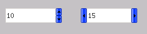

# Spinner Control Class

## Brief Introduction to Spinner Control Class

Spinner class control is usually composed of a group of arrow buttons (up and
down, or left and right), which usually represent a range. Through arrow
control, value can be changed step by step.

mGNCS provides two kinds of buttons, `mSpinner` and `mSpinbox`, and their
inheritance relation is as follows

- [mWidget ](MStudioMGNCSV1dot0PGP2C3#mWidget)
- [mSpinner](MStudioMGNCSV1dot0PGP2C9#mSpinner)
* [mSpinbox](MStudioMGNCSV1dot0PGP2C9#mSpinbox)


## `mSpinner`

- *Control name*: `NCSCTRL_SPINNER`
- *English name*: Spinner
- *Brief introduction*: Control consisting of two arrow buttons (up and down or
left and right) that can control values changing in a range
- *Schematic diagram*: <br/>


### Style of `mSpinner`

It is inherited from the style of [`mWidget`](MStudioMGNCSV1dot0PGP2C3#mWidget)

| *Style ID*  | *miniStudio name* |  *Explanation* |
|---------------|-------------------|----------------|
| `NCSS_SPNR_VERTICAL` | `Direction->Vert` | Vertical style, up and down arrows. When clicking up and down arrows, it will send keyboard information of the up and down direction keys to the objective window |
| `NCSS_SPNR_HORIZONTAL` | `Direction->Horz` | Horizontal style, left and right arrows. When clicking the left and right arrows, it will send keyboard information of the left and right direction keys to the objective window |
| `NCSS_SPNR_AUTOLOOP` | `AutoLoop` | When reaching the maximum or minimum value, it will automatically loop to the minimum or maximum value |

### Property of `mSpinner`

It is inherited from the property of [`mWidget`](MStudioMGNCSV1dot0PGP2C3#mWidget)

| *Property ID* | *miniStudio name* | *Type* | *Authority* | *Explanation* |
|-----------------|-------------------|--------|-------------|---------------|
| `NCSP_SPNR_MAXPOS` | `MaxPos` | int | `RW` | Maximum value of the change range |
| `NCSP_SPNR_MINPOS` | `MinPos` | int | `RW` | Minimum value of the change range |
| `NCSP_SPNR_CURPOS` | `CurPos` | int | `RW` | Current value |
| `NCSP_SPNR_LINESTEP` | `LineStep` | int | `RW` | Step length |
| `NCSP_SPNR_TARGET` | - | `HWND` | `RW` | Objective window sentence handle |

### Event of `mSpinner`

It is inherited from the event if [`mWidget`](MStudioMGNCSV1dot0PGP2C3#mWidget)

| *Event ID* | *Parameter* | *Explanation* |
|------------|-------------|---------------|
| `NCSN_SPNR_CHANGED` | int current property value | Current value changes |
| `NCSN_SPNR_REACHMAX` | int current property value | The current value reaches the maximum value |
| `NCSN_SPNR_REACHMIN` | int current property value | The current value reaches the minimum value |

### Method of `mSpinner`

It is inherited from the method of [`mWidget`](MStudioMGNCSV1dot0PGP2C3#mWidget)

The class does not have newly added method

### Renderer of `mSpinner`

#### `mSpinner` classic renderer

For the non client area, refer to [classic renderer of `mWidget`](MStudioMGNCSV1dot0PGP2C3#mWidget)

| *Property name* | *Explanation* | *miniStudio property name* | *Type* | *Schematic diagram* |
|-----------------|---------------|----------------------------|--------|---------------------|
| `NCS_BGC_3DBODY` | Background color | `ColorBg3DBody` | `DWORD(ARGB`) |  | |
| `NCS_FGC_3DBODY` | Color of the foreground arrow | `ColorFg3DBody` | `DWORD(ARGB`) |  | |
| `NCS_BGC_DISABLED_ITEM` | Background color when it is invalid | `ColorBgDisable` | `DWORD(ARGB`) |  |
| `NCS_FGC_DISABLED_ITEM` | Color of the arrow when it is invalid | `ColorFgDisable` | `DWORD(ARGB`) |  |

#### `mSpinner` Skin Renderer

Refer to [Specification for the Image Resource Used by Skin Renderer](MStudioMGNCSV1dot0PGAppB#mSpinner)

#### `mSpinner` Fashion Renderer

| *Property name* | *Explanation* | *miniStudio property name* | *Type* | *Schematic diagram* |
|-----------------|---------------|----------------------------|--------|---------------------|
| `NCS_FGC_3DBODY` | Button foreground color | `ColorFg3DBody` | `DWORD(ARGB`) | Same as Classic renderer |
| `NCS_FGC_DISABLED_ITEM` | Button foreground color when the window is invalid | `ColorFgDisable` | `DWORD(ARGB`) | Same as Classic renderer |
| `NCS_BGC_3DBODY` | Background color | `ColorBg3DBody` | `DWORD(ARGB`) | Same as Classic renderer |
| `NCS_BGC_DISABLED_ITEM` | Text background color when the window is invalid | `ColorBgDisable` | `DWORD(ARGB`) | Same as Classic renderer |
| `NCS_MODE_BGC` | Gradual change fill mode | `GradientMode` | [GradientMode](MStudioMGNCSV1dot0PGP2C5#GrandientMode) |  |


#### `mSpinner` Flat Renderer

| *Property name* | *Explanation* | *miniStudio property name* | *Type* | *Schematic diagram* |
|-----------------|---------------|----------------------------|--------|---------------------|
| `NCS_FGC_3DBODY` | Button foreground color | `ColorFg3DBody` | `DWORD(ARGB`) |  |
| `NCS_BGC_3DBODY` | Background color | `ColorBg3DBody` | `DWORD(ARGB`) |  |

### Example of `mSpinner`

The example below (for the screen shot, see the schematic diagram of 
`mSpinner`) demonstrates that Spinner is associated with a Static control. 
After pos of Spinner changes, Static will change correspondingly.
- Properties mainly involved are
- `NCSP_SPN_MAXPOS`
- `NCSP_SPN_MINPOS`
- `NCSP_SPN_CURPOS`
- Event mainly involved is:
- `NCSN_SPN_CHANGED`


For convenience, we mainly realize through the method of data binding

- Example

```cpp
#include <stdio.h>
#include <stdlib.h>
#include <string.h>

#include <minigui/common.h>
#include <minigui/minigui.h>
#include <minigui/gdi.h>
#include <minigui/window.h>
#include <minigui/control.h>

#include <mgncs/mgncs.h>

#define ID_SPINNER1      101
#define ID_SHOWSPINNER1  201
#define ID_SPINNER2      102
#define ID_SHOWSPINNER2  202

#define MINVALUE        0
#define MAXVALUE        10
#define CURVALUE        5

static BOOL mymain_onCreate(mWidget* self, DWORD add_data)
{
    //START_GET_CTRLS
    mSpinner * spn1, *spn2;
    mStatic  * show1, * show2;
    spn1 = (mSpinner*)_c(self)->getChild(self, ID_SPINNER1);
    spn2 = (mSpinner*)_c(self)->getChild(self, ID_SPINNER2);
    show1 = (mStatic*)_c(self)->getChild(self, ID_SHOWSPINNER1);
    show2 = (mStatic*)_c(self)->getChild(self, ID_SHOWSPINNER2);
    //END_GET_CTRLS

    //START_CONNECT_PROPS
    ncsConnectBindProps(
        NCS_CMPT_PROP(spn1, NCSN_SPNR_CHANGED, NCSP_SPNR_CURPOS, NCS_BT_INT, NCS_PROP_FLAG_READ),
        NCS_CMPT_PROP(show1, 0, NCSP_WIDGET_TEXT, NCS_BT_STR, NCS_PROP_FLAG_WRITE),
        NCS_BPT_SIGNALE);

    ncsConnectBindProps(
        NCS_CMPT_PROP(spn2, NCSN_SPNR_CHANGED, NCSP_SPNR_CURPOS, NCS_BT_INT, NCS_PROP_FLAG_READ),
        NCS_CMPT_PROP(show2, 0, NCSP_WIDGET_TEXT, NCS_BT_STR, NCS_PROP_FLAG_WRITE),
        NCS_BPT_SIGNALE);
    //END_CONNECT_PROPS

    //START_UPDATE_CTRLS
    ncsRaiseComponentBindProps((mComponent*)spn1, NCSN_SPNR_CHANGED);
    ncsRaiseComponentBindProps((mComponent*)spn2, NCSN_SPNR_CHANGED);
    //END_UPDATE_CTRLS


    return TRUE;
}

static void mymain_onClose (mWidget* self, int message)
{
    DestroyMainWindow(self->hwnd);
    PostQuitMessage(0);
}

//START_SET_PROPS
//Propties for
static NCS_PROP_ENTRY spinbox_props [] = {
    {NCSP_SPNR_MINPOS, MINVALUE},
    {NCSP_SPNR_MAXPOS, MAXVALUE},
    {NCSP_SPNR_CURPOS, CURVALUE},
    {NCSP_SPNR_LINESTEP, 1},
    {0, 0}
};
//END_SET_PROPS

static NCS_RDR_INFO spin_rdr_info[] =
{
    {"skin", "skin", NULL},
    //{"fashion", "fashion", NULL},
    //{"flat", "flat", NULL},
};

//Controls
static NCS_WND_TEMPLATE _ctrl_templ[] = {
    {
        NCSCTRL_STATIC,
        ID_SHOWSPINNER1,
        100,40, 100,20,
        WS_VISIBLE,
        WS_EX_NONE,
        "",
        NULL,
        NULL,
        0,
        0
    },
    {
        NCSCTRL_SPINNER ,
        ID_SPINNER1,
        30, 40, 20, 20,
        WS_VISIBLE | NCSS_SPNBOX_VERTICAL | NCSS_NOTIFY,
        WS_EX_NONE,
        "spinbox",
        spinbox_props, //props,
        spin_rdr_info, //NULL, //rdr_info
        NULL, //handlers,
        NULL, //controls
        0,
        0 //add data
    },
    {
        NCSCTRL_STATIC,
        ID_SHOWSPINNER2,
        100, 100, 100, 20,
        WS_VISIBLE,
        WS_EX_NONE,
        "",
        NULL,
        NULL,
        0,
        0
    },

    {
        NCSCTRL_SPINNER ,
        ID_SPINNER2,
        30, 100, 20, 20,
        WS_VISIBLE | NCSS_SPNBOX_HORIZONTAL | NCSS_NOTIFY,
        WS_EX_NONE,
        "spinbox",
        spinbox_props, //props,
        spin_rdr_info, //NULL, //rdr_info
        NULL, //handlers,
        NULL, //controls
        0,
        0 //add data
    }
};


static NCS_EVENT_HANDLER mymain_handlers[] = {
    {MSG_CREATE,mymain_onCreate},
    {MSG_CLOSE,mymain_onClose},
    {0, NULL}
};

static NCS_RDR_INFO mymain_rdr_info[] =
{
    {"skin", "skin", NULL},
};


//define the main window template
static NCS_MNWND_TEMPLATE mymain_templ = {
    NCSCTRL_DIALOGBOX,
    1,
    0, 0, 260, 200,
    WS_CAPTION | WS_BORDER | WS_VISIBLE,
    WS_EX_NONE,
    "Spinner Test ....",
    NULL,
    mymain_rdr_info,
    mymain_handlers,
    _ctrl_templ,
    sizeof(_ctrl_templ)/sizeof(NCS_WND_TEMPLATE),
    0,
    0, 0,
};

int MiniGUIMain(int argc, const char* argv[])
{
    if(argc>1)
    {
        spin_rdr_info[0].glb_rdr = argv[1];
        spin_rdr_info[0].ctl_rdr = argv[1];
    }


    ncsInitialize();
    mDialogBox* mydlg = (mDialogBox *)ncsCreateMainWindowIndirect
                                (&mymain_templ, HWND_DESKTOP);

    _c(mydlg)->doModal(mydlg, TRUE);

    MainWindowThreadCleanup(mydlg->hwnd);
    return 0;
}

#ifdef _MGRM_THREADS
#include <minigui/dti.c>
#endif
```

- In the template definition file of the window, set properties of spinner


```cpp
//Propties for
static NCS_PROP_ENTRY spinbox_props [] = {
    {NCSP_SPNR_MINPOS, MINVALUE},
    {NCSP_SPNR_MAXPOS, MAXVALUE},
    {NCSP_SPNR_CURPOS, CURVALUE},
    {NCSP_SPNR_LINESTEP, 1},
    {0, 0}
};
```

- In `MSG_CREATE` message of the main window, establish connection with static
- Get window object

```cpp
    mSpinner * spn1, *spn2;
    mStatic  * show1, * show2;
    spn1 = (mSpinner*)_c(self)->getChild(self, ID_SPINNER1);
    spn2 = (mSpinner*)_c(self)->getChild(self, ID_SPINNER2);
    show1 = (mStatic*)_c(self)->getChild(self, ID_SHOWSPINNER1);
    show2 = (mStatic*)_c(self)->getChild(self, ID_SHOWSPINNER2);
```

- Property of the connection window

```cpp
    ncsConnectBindProps(
        NCS_CMPT_PROP(spn1, NCSN_SPNR_CHANGED, NCSP_SPNR_CURPOS, NCS_BT_INT, NCS_PROP_FLAG_READ),
        NCS_CMPT_PROP(show1, 0, NCSP_WIDGET_TEXT, NCS_BT_STR, NCS_PROP_FLAG_WRITE),
        NCS_BPT_SIGNALE);

    ncsConnectBindProps(
        NCS_CMPT_PROP(spn2, NCSN_SPNR_CHANGED, NCSP_SPNR_CURPOS, NCS_BT_INT, NCS_PROP_FLAG_READ),
        NCS_CMPT_PROP(show2, 0, NCSP_WIDGET_TEXT, NCS_BT_STR, NCS_PROP_FLAG_WRITE),
        NCS_BPT_SIGNALE);
```

- Update the current information into Static

```cpp
    ncsRaiseComponentBindProps((mComponent*)spn1, NCSN_SPNR_CHANGED);
    ncsRaiseComponentBindProps((mComponent*)spn2, NCSN_SPNR_CHANGED);
```

## `mSpinbox`

- *Control window class name* : `NCSCTRL_SPINBOX`
- *Control English name* : Spinbox
- *Brief introduction* : Combine the arrow button with the edit box, and 
control the content in the edit box through arrow button
- *Schematic diagram* : <br />




### Style of `mSpinbox`

It is inherited from the style of `mSpinner`.

| *Style ID*  | *miniStudio name* |  *Explanation* |
|---------------|-------------------|----------------|
| `NCSS_SPNBOX_NUMBER` | `ContentType->Number` |Display numerical value, display format can be appointed through corresponding properties |
| `NCSS_SPNBOX_STRING` | `ContentType->String`| Display character string |
| `NCSS_SPNBOX_SORT` | Sort | Character string automatic sorting |
| `NCSS_SPNBOX_EDITNOBORDER` | `EditBorder` | The edit box does not have border |
| `NCSS_SPNBOX_EDITBASELINE` | `EditBaseLine` | The edit box displays the underlined characters|
| `NCSS_SPNBOX_READONLY` | `ReadOnly` | Content displayed by the edit box is read only |
| `NCSS_SPNBOX_UPPERCASE` | `Case->Upper` | All the edit box display content is converted to capital letter display |
| `NCSS_SPNBOX_LOWERCASE` | `Case->Lower` | All the edit box display content is converted to lowercase letter display |
| `NCSS_SPNBOX_AUTOFOCUS` | `AutoFocus` | The control gets focus and automatically transfers to the edit box |

### Property of `mSpinbox`

It is inherited from the property of `mSpinner`.

### Event of `mSpinbox`

It is inherited from the event of `mSpinner`.

### Method of `mSpinbox`

It is inherited from the method of `mSpinner`.

*The functions below are only valid when spinbox contains `NCSS_SPNBOX_STRING`
style* 

- `addItem` adds a new item

```cpp
BOOL (*addItem)(clsName *self, char *item);
```

- Add a character string into spinbox
- Parameter:
   * item : added character string
- Returned value: successful- `TRUE`; failed- `FALSE`;

- remove Item
```cpp
BOOL (*removeItem)(clsName *self, int index);
```

- Remove an item
- Parameter:
   * index: the index of removing item 要删除item的索引
- Returned: successful- `TRUE`; failed- `FALSE`;

- `setItem`
```cpp
BOOL (*setItem)(clsName *self, int index, char *item);
```
- Set character string content of an item
- Parameter:
   * index Index to set
   * Item content of new item
- Returned value: successful- `TRUE`; failed- `FALSE`;

- `getItem`
```cpp
char* (*getItem)(clsName *self, int index);
```
- Get character string content of item
- Parameter
   * index of the index item
- Returned value: `NULL`- failed; valid character string pointer.


### Renderer of `mSpinbox`

Effect of `mSpinbox` render is composed of the effects of `mSpinner`
and `mSlEdit`, and the class itself does not have newly added properties.

### Example of `mSpinbox`

The example explains spinbox under numeric type and list type under horizontal
style and vertical style.

Schematic diagram:


The main codes are as follow:

```cpp
#define ID_SPINBOX1      101
#define ID_SPINBOX2      102
#define ID_SPINBOX3      103
#define ID_SPINBOX4      104

static char * item [] =
{
    "SpinBox item-1st",
    "SpinBox item-2nd",
    "SpinBox item-3rd",
    "SpinBox item-4th"
};

static BOOL mymain_onCreate(mWidget* self, DWORD add_data)
{
    int i;
    mSpinBox *spinner3, *spinner4;

    spinner3 = (mSpinBox *)_c(self)->getChild(self, ID_SPINBOX3);
    spinner4 = (mSpinBox *)_c(self)->getChild(self, ID_SPINBOX4);

    for (i = 0; i < sizeof(item)/sizeof(char*); i++)
    {

        _c(spinner3)->addItem (spinner3, item[i]);

        _c(spinner4)->addItem (spinner4, item[i]);

    }

    return TRUE;
}


//Propties for
static NCS_PROP_ENTRY spinner_props [] = {

    {NCSP_SPNBOX_MAXPOS, 12},
    {NCSP_SPNBOX_MINPOS, 0},
    {NCSP_SPNBOX_CURPOS, 0},
    {NCSP_SPNBOX_LINESTEP, 1},
    {0, 0}
};

```

----

[&lt;&lt; Slider Control Class](MiniGUIProgGuidePart2Chapter09.md) |
[Table of Contents](README.md) |
[Progress Bar Control Class &gt;&gt;](MiniGUIProgGuidePart2Chapter11.md)

[Release Notes for MiniGUI 3.2]: /supplementary-docs/Release-Notes-for-MiniGUI-3.2.md
[Release Notes for MiniGUI 4.0]: /supplementary-docs/Release-Notes-for-MiniGUI-4.0.md
[Showing Text in Complex or Mixed Scripts]: /supplementary-docs/Showing-Text-in-Complex-or-Mixed-Scripts.md
[Supporting and Using Extra Input Messages]: /supplementary-docs/Supporting-and-Using-Extra-Input-Messages.md
[Using CommLCD NEWGAL Engine and Comm IAL Engine]: /supplementary-docs/Using-CommLCD-NEWGAL-Engine-and-Comm-IAL-Engine.md
[Using Enhanced Font Interfaces]: /supplementary-docs/Using-Enhanced-Font-Interfaces.md
[Using Images and Fonts on System without File System]: /supplementary-docs/Using-Images-and-Fonts-on-System-without-File-System.md
[Using SyncUpdateDC to Reduce Screen Flicker]: /supplementary-docs/Using-SyncUpdateDC-to-Reduce-Screen-Flicker.md
[Writing DRI Engine Driver for Your GPU]: /supplementary-docs/Writing-DRI-Engine-Driver-for-Your-GPU.md
[Writing MiniGUI Apps for 64-bit Platforms]: /supplementary-docs/Writing-MiniGUI-Apps-for-64-bit-Platforms.md

[Quick Start]: /user-manual/MiniGUIUserManualQuickStart.md
[Building MiniGUI]: /user-manual/MiniGUIUserManualBuildingMiniGUI.md
[Compile-time Configuration]: /user-manual/MiniGUIUserManualCompiletimeConfiguration.md
[Runtime Configuration]: /user-manual/MiniGUIUserManualRuntimeConfiguration.md
[Tools]: /user-manual/MiniGUIUserManualTools.md
[Feature List]: /user-manual/MiniGUIUserManualFeatureList.md

[MiniGUI Overview]: /MiniGUI-Overview.md
[MiniGUI User Manual]: /user-manual/README.md
[MiniGUI Programming Guide]: /programming-guide/README.md
[MiniGUI Porting Guide]: /porting-guide/README.md
[MiniGUI Supplementary Documents]: /supplementary-docs/README.md
[MiniGUI API Reference Manuals]: /api-reference/README.md

[MiniGUI Official Website]: http://www.minigui.com
[Beijing FMSoft Technologies Co., Ltd.]: https://www.fmsoft.cn
[FMSoft Technologies]: https://www.fmsoft.cn
[HarfBuzz]: https://www.freedesktop.org/wiki/Software/HarfBuzz/
