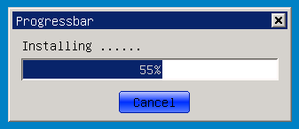

# 第二部分 第十章 进度条控件
# Chapter 10 of Part 2 Progress Bar Control


## 进度条控件简介
## Brief Introduction of Progress Bar Control

进度条控件（ProgressBar）是GUI系统中不可或缺的的重要控件之一，可以直观的表示出某项的进度，在进行文件复制、软件安装、文件传输时经常用到。mGNCS中的进度条控件基于MiniGUI 
3.0中内置的进度条控件进行了增强和重构，增加了渲染器的设置，使其更加易用，更加绚丽。 

Progress bar control is an essential control in GUI system, which can visually
show progress of an item and is often used in file copying, software
installation and file transmission. Progress bar control in mGNCS is
strengthened and reconstructed based on the built-in progress bar control in
MiniGUI 3.0, and setting of renderer is added, making it easier to use and more
splendid. 

- 进度条类层次关系
- [ `mWidget` ](MStudioMGNCSV1dot0PGP2C3#mWidget)
* [ `mProgressBar` ](MStudioMGNCSV1dot0PGP2C10#m_ProgressBar)

- Class hierarchical relation of progress bar
- [ `mWidget` ](MStudioMGNCSV1dot0PGP2C3#mWidget)
* [ `mProgressBar` ](MStudioMGNCSV1dot0PGP2C10#m_ProgressBar)

## `mProgressBar`
## `mProgressBar`

- *控件窗口类*: `NCSCTRL_PROGRESSBAR`
- *控件英文名*: `ProgressBar`
- *简介*: 用于表示进度，在进行文件复制、软件安装、文件传输时经常用到。
- *示意图*:


- *Control window class*: `NCSCTRL_PROGRESSBAR`
- *Control English name*: `ProgressBar`
- *Brief introduction*: Used to show progress, often used in file copying,
software installation and file transmission.
- *Schematic diagram*:



### `mProgressBar风格`
### Style of `mProgressBar`

继承自[mWidget](MStudioMGNCSV1dot0PGP2C3)的风格
| *风格ID* | *miniStudio属性名* | *说明* ||
| `NCSS_PRGBAR_HORIZONTAL` | -- | `miniStudio中将这两种风格分成了两个控件来使用` 分别对应为| Horz `ProgressBar` |
| `NCSS_PRGBAR_VERTICAL` | -- | ^ | Vert `ProgressBar` |
| `NCSS_PRGBAR_BLOCKS` | `BlockChunk->TRUE` | 块状进度 |  |
| `NCSS_PRGBAR_SMOOTH` | `BlockChunk->FALSE` | 平滑进度，与上面的块状进度相对 |  |
| `NCSS_PRGBAR_SHOWPERCENT` | `ShowPercent` | 显示当前进度值（百分比)|  |

It is inherited from the style of [mWidget](MStudioMGNCSV1dot0PGP2C3)
| *Style ID* | *miniStudio property * | *Explanation* ||
| `NCSS_PRGBAR_HORIZONTAL` | -- | In miniStudio, the two styles are divided into two controls to use, respectively corresponding to| Horz `ProgressBar` |
| `NCSS_PRGBAR_VERTICAL` | -- | ^ | Vert `ProgressBar` |
| `NCSS_PRGBAR_BLOCKS` | `BlockChunk->TRUE` | Block progress |  |
| `NCSS_PRGBAR_SMOOTH` | `BlockChunk->FALSE` | Smooth progress, relative to the above block progress |  |
| `NCSS_PRGBAR_SHOWPERCENT` | `ShowPercent` | Display the current progress value (percentage)|  |

### `mProgressBar属性`
### Property of `mProgressBar`
继承自[mWidget](MStudioMGNCSV1dot0PGP2C3)的属性
| *属性名* |*miniStudio属性名* | *类型* | *RW* | *说明* |
| `NCSP_PROG_MAXPOS` | `MaxPos` | int | `RW` | 进度范围最大值 |
| `NCSP_PROG_MINPOS` | `MinPos` | int | `RW` | 进度范围最小值 |
| `NCSP_PROG_CURPOS` | `CurPos` | int | `RW` | 当前进度值 |
| `NCSP_PROG_LINESTEP` | `LineStep` | int | `RW` | 步长 |

It is inherited from the property of [mWidget](MStudioMGNCSV1dot0PGP2C3)
| *Property name* |*miniStudio property name* | *Type* | *RW* | *Explanation* |
| `NCSP_PROG_MAXPOS` | `MaxPos` | int | `RW` | Maximum value of the progress range |
| `NCSP_PROG_MINPOS` | `MinPos` | int | `RW` | Minimum value of the progress range |
| `NCSP_PROG_CURPOS` | `CurPos` | int | `RW` | Current progress value |
| `NCSP_PROG_LINESTEP` | `LineStep` | int | `RW` | Step length |

### `mProgressBar事件`
### Event of `mProgressBar`
继承自[mWidget](MStudioMGNCSV1dot0PGP2C3)的事件<BR>
%RED% *该控件类没有新增事件* %ENDCOLOR%

It is inherited from the event of [mWidget](MStudioMGNCSV1dot0PGP2C3)<BR>
%RED% *The control class does not have newly added event* %ENDCOLOR%

### `mProgressBar方法`
### Method of `mProgressBar`

继承自[mWidget](MStudioMGNCSV1dot0PGP2C3)的方法<BR>

It is inherited from the method of [mWidget](MStudioMGNCSV1dot0PGP2C3)<BR>

#### increase
```cpp
int increase (mProgressBar *self, int delta);
```
- 参数：
- self ：控件对象指针
- delta ：增加幅度
- 说明 ： 用户可以使用改函数控制进度值的增加，delta用来指定增加的量，一般用来控制非匀速的增长效果
- 示例 ：

- Parameter:
- self ：control object pointer
- delta ：increase amplitude
- Explanation: users can use the function to control increase of the progress
value; delta is used to appoint the increase amount, which is generally used to
control the increase effect of non even speed
- Example:

```cpp
_c(pb)->increase (pb, 5);    //进度值增加5 //The progress value increases 5
```

#### `stepIncrease`
```cpp
int stepIncrease (mProgressBar *_this);
```
- 参数：
- self ：控件对象指针
- 说明：该函数可以步进增加进度值，每调用一次增加一个步长值，可以实现匀速的增长效果，步长值的设定通过相应的属性来完成
- 示例 ：

- Parameter:
- self ：control object pointer
- Explanation: the function can increase the progress value by step; calling
once, a step length value is increased, and even-speed increase effect can be
realized; setting of step length value is completed through corresponding
properties 
- Example:

```cpp
//设置ProgressBar的步进长度
// Set step length of ProgressBar
_c(pb)->setProperty(pb, NCSP_PROG_LINESTEP, 5);
......
_c(pb)->stepIncrease (pb);
```

### `mProgressBar渲染器`
### Renderer of `mProgressBar`
#### classic渲染器
#### Classic Renderer
继承自[mWidget](MStudioMGNCSV1dot0PGP2C3)的classic渲染器<BR>
| *属性名* |*miniStudio属性名* | *类型* | *示意图* | *说明* |
| `NCS_BGC_HILIGHT_ITEM` | `ChunkColor` | `DWORD（ARGB`） |  | 进度条的chunk部分的颜色，本渲染器使用高亮item的颜色绘制 |

It is inherited from the classic renderer of
[mWidget](MStudioMGNCSV1dot0PGP2C3)<BR> 
| *Property name* |*miniStudio property * | *Type* | *Schematic diagram* | *Explanation* |
| `NCS_BGC_HILIGHT_ITEM` | `ChunkColor` | `DWORD（ARGB`） |  | Color of chunk part of the progress bar, and this renderer uses the color of highlight item to draw |

#### fashion渲染器
#### Fashion Renderer
继承自[mWidget](MStudioMGNCSV1dot0PGP2C3)的fashion渲染器<BR>
| *属性名* |*miniStudio属性名* | *类型* | *示意图* | *说明* |
| `NCS_BGC_PRGBAR_CHUNK` | `ChunkColor` | `DWORD（ARGB`） |  | 进度条的chunk部分的基础颜色，渲染器会根据这个颜色进行减淡、加深，来绘制渐变效果的进度条 |

It is inherited from the fashion renderer of
[mWidget](MStudioMGNCSV1dot0PGP2C3)<BR> 
| *Property name* |*miniStudio property name* | *Type* | *Schematic diagram* | *Explanation* |
| `NCS_BGC_PRGBAR_CHUNK` | `ChunkColor` | `DWORD（ARGB`） |  | Foundation color of chunk part of the progress bar, and the renderer will lighten or darken according to this color to draw progress bar of gradual change effect |

#### flat渲染器
#### Flat Renderer
继承自[mWidget](MStudioMGNCSV1dot0PGP2C3)的flat渲染器<BR>
| *属性名* |*miniStudio属性名* | *类型* | *示意图* | *说明* |
| `NCS_FGC_WINDOW` | `ChunkColor` | `DWORD（ARGB`） |  | 进度条的chunk部分的颜色,这里使用窗口前景色 |

It is inherited from flat renderer of [mWidget](MStudioMGNCSV1dot0PGP2C3)<BR>
| *Property name* |*miniStudio property name* | *Type* | *Schematic diagram* | *Explanation* |
| `NCS_FGC_WINDOW` | `ChunkColor` | `DWORD（ARGB`） |  | Color of chunk part of the progress bar, here window foreground color is used |

#### skin渲染器
#### Skin Renderer
参阅
Skin渲染器使用的图片资源规范([ProgressBar图片规范](MStudioMGNCSV1dot0PGAppB][附录B]])中[[MStudioMGNCSV1dot0PGAppB#m_ProgressBar) 

Refer to [Appendix B](MStudioMGNCSV1dot0PGAppB#m_ProgressBar][ProgressBar Image
Specification]] in Specification for Image Resource Used by Skin Renderer
([[MStudioMGNCSV1dot0PGAppB)) 

### `mProgressBar编程示例`
### Instance of `mProgressBar`

- `ProgressBar示例代码` ：[progressbar.c](%ATTACHURL%/progressbar.c.txt)

- `ProgressBar模板`

- `ProgressBar` Example code:[progressbar.c](%ATTACHURL%/progressbar.c.txt)

- `ProgressBar` template

```cpp
%INCLUDE{"%ATTACHURL%/progressbar.c.txt" pattern="^.*?//START_OF_TEMPLATE(.*?)//END_OF_TEMPLATE.*"}%
```

- 初始化ProgressBar属性

- Initialize the property of `ProgressBar`
```cpp
%INCLUDE{"%ATTACHURL%/progressbar.c.txt" pattern="^.*?//START_OF_INITIAL_PROPS(.*?)//END_OF_INITIAL_PROPS.*"}%
```

- 在Timer消息中，改变ProgressBar的属性值

- In Timer message, change the property value of `ProgressBar`
```cpp
%INCLUDE{"%ATTACHURL%/progressbar.c.txt" pattern="^.*?//START_OF_SET_PROPERTY(.*?)//END_OF_SET_PROPERTY.*"}%
```


[Next](MStudioMGNCSV1dot0PGP2C9][Previous]] < [[MStudioMGNCSV1dot0PG][Index]] > [[MStudioMGNCSV1dot0PGP2C11) 


-- Main.XiaodongLi - 22 Feb 2010


----

[&lt;&lt; ](MiniGUIProgGuidePart.md) |
[Table of Contents](README.md) |
[ &gt;&gt;](MiniGUIProgGuidePart.md)

[Release Notes for MiniGUI 3.2]: /supplementary-docs/Release-Notes-for-MiniGUI-3.2.md
[Release Notes for MiniGUI 4.0]: /supplementary-docs/Release-Notes-for-MiniGUI-4.0.md
[Showing Text in Complex or Mixed Scripts]: /supplementary-docs/Showing-Text-in-Complex-or-Mixed-Scripts.md
[Supporting and Using Extra Input Messages]: /supplementary-docs/Supporting-and-Using-Extra-Input-Messages.md
[Using CommLCD NEWGAL Engine and Comm IAL Engine]: /supplementary-docs/Using-CommLCD-NEWGAL-Engine-and-Comm-IAL-Engine.md
[Using Enhanced Font Interfaces]: /supplementary-docs/Using-Enhanced-Font-Interfaces.md
[Using Images and Fonts on System without File System]: /supplementary-docs/Using-Images-and-Fonts-on-System-without-File-System.md
[Using SyncUpdateDC to Reduce Screen Flicker]: /supplementary-docs/Using-SyncUpdateDC-to-Reduce-Screen-Flicker.md
[Writing DRI Engine Driver for Your GPU]: /supplementary-docs/Writing-DRI-Engine-Driver-for-Your-GPU.md
[Writing MiniGUI Apps for 64-bit Platforms]: /supplementary-docs/Writing-MiniGUI-Apps-for-64-bit-Platforms.md

[Quick Start]: /user-manual/MiniGUIUserManualQuickStart.md
[Building MiniGUI]: /user-manual/MiniGUIUserManualBuildingMiniGUI.md
[Compile-time Configuration]: /user-manual/MiniGUIUserManualCompiletimeConfiguration.md
[Runtime Configuration]: /user-manual/MiniGUIUserManualRuntimeConfiguration.md
[Tools]: /user-manual/MiniGUIUserManualTools.md
[Feature List]: /user-manual/MiniGUIUserManualFeatureList.md

[MiniGUI Overview]: /MiniGUI-Overview.md
[MiniGUI User Manual]: /user-manual/README.md
[MiniGUI Programming Guide]: /programming-guide/README.md
[MiniGUI Porting Guide]: /porting-guide/README.md
[MiniGUI Supplementary Documents]: /supplementary-docs/README.md
[MiniGUI API Reference Manuals]: /api-reference/README.md

[MiniGUI Official Website]: http://www.minigui.com
[Beijing FMSoft Technologies Co., Ltd.]: https://www.fmsoft.cn
[FMSoft Technologies]: https://www.fmsoft.cn
[HarfBuzz]: https://www.freedesktop.org/wiki/Software/HarfBuzz/
