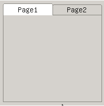

# 属性表控件类
# Chapter 11 of Part 2 Property Sheet Control Class


## 属性表控件类简介
## Brief Introduction of Property Sheet Control Class

属性表控件类由一个个的独立的属性页组成，每个属性页有一个凸舌，我们可以单击凸舌，在不同的属性页之间切换，这里的属性页就是可以容纳其他控件的页控件（Page
控件）。我们通常使用类似建立对话框的方法，即定义对话框模板的方法向属性表中添加属性页。 


属性表控件类最常见的用途就是将不同类别的交互内容分门别类的放在同一对话框中，通过类别切换显示不同内容。这一方面节省了对话框空间，另一方面也使得交互界面更加容易使用。 

窗口及其派生类的类继承关系如下：

Property Sheet control class is composed of independent property pages, and 
each property page has a tongue. We can click the tongue to switch between
different property pages. The property pages here are the page controls that 
can accommodate other controls. We usually use the method similar to
establishing dialog box, which is the method of defining the dialog box
template, to add property page to the property sheet.

The most common purpose of property sheet control class is placing interaction
content of different categories into the same dialog box by category, and
displaying different content through category switch. On the one hand, it saves
the space of dialog box, on the other hand, it makes it easier to use the
interaction interface.

The class inheritance relation of the window and its derived class is as
follows: 

- [mWidget ](MStudioMGNCSV1dot0PGP2C3#mWidget)
- [mPropSheet](MStudioMGNCSV1dot0PGP2C11#m_PropSheet)

## `mPropSheet`
## `mPropSheet`

- *控件名称*: `NCSCTRL_PROPSHEET`
- *英文名*: `PropSheet`
- *简要介绍*: 由多个独立的属性页组成，每个属性页有一个凸舌，通过凸舌进行属性页间的切换。
- *示意图*: <br/>

- *Control name*: `NCSCTRL_PROPSHEET`
- *English name*: `PropSheet`
- *Brief introduction*: It is composed of multiple independent property pages.
Each property page has a tongue, and switching between the property pages are
carried out through the tongue.
- *Schematic diagram*: <br/>





### `mPropSheet` 风格
### Style of `mPropSheet`

继承自[mWidget的风格 ](MStudioMGNCSV1dot0PGP2C3#mWidget)

| * 风格名 * | *miniStudio属性名* | *说明* |
| `NCSS_PRPSHT_SIMPLE` | style->Simple | 控制属性页凸舌宽度的风格：所有的属性页凸舌具有相同的宽度。|
| `NCSS_PRPSHT_COMPACTTAB` | style->Compact | 控制属性页凸舌宽度的风格：属性页凸舌的宽度取决于属性页标题文本的长度。|
| `NCSS_PRPSHT_SCROLLABLE` | style->Scrollable | 控制属性页凸舌宽度的风格：属性页凸舌的宽度取决于属性页标题文本的长度，当属性页凸舌的数目过多时，将自动出现左右箭头用来调节当前可见的属性页凸舌。|
| `NCSS_PRPSHT_TOP` | `TabPos->Top` | 控制属性页凸舌在属性表中显示方向的风格：属性页凸舌显示在属性表的上方。|
| `NCSS_PRPSHT_BOTTOM` | `TabPos->Bottom` | 控制属性页凸舌在属性表中显示方向的风格：属性页凸舌显示在属性表的下方。|


It is inherited from [the style of `mWidget` 
](MStudioMGNCSV1dot0PGP2C3#mWidget) 

| * Style name * | *miniStudio property name* | *Explanation* |
| `NCSS_PRPSHT_SIMPLE` | style->Simple | Style of controlling the tongue width of the property page: tongues of all the property pages have the same width.|
| `NCSS_PRPSHT_COMPACTTAB` | style->Compact | Style of controlling the tongue width of the property page: tongue width of the property page is decided by the length of the title text of the property page.|
| `NCSS_PRPSHT_SCROLLABLE` | style->Scrollable | Style of controlling the tongue width of the property page: tongue width of the property page is decided by the length of the title text of the property page. When there are too many property page tongues, left and right arrows will automatically appear to adjust the currently visible property page tongue.|
| `NCSS_PRPSHT_TOP` | `TabPos->Top` | Style of controlling the display direction of the property page tongue in the property sheet: property page tongue is displayed on the top of the property sheet.|
| `NCSS_PRPSHT_BOTTOM` | `TabPos->Bottom` | Style of controlling the display direction of the property page tongue in the property sheet: property page tongue is displayed on the bottom of the property sheet.|

### `mPropSheet` 属性
### Property of `mPropSheet`

继承自[mWidget的属性 ](MStudioMGNCSV1dot0PGP2C3#mWidget)

| * 属性ID *| *miniStudio 名*| *类型* | *权限* |* 说明 *|
| `NCSP_PRPSHT_MINTABWIDTH` | `TabMinWidth` | int | `RW` | 凸舌最小宽度 |
| `NCSP_PRPSHT_TABMARGIN` | `TabMargin` | int | `RW` | 凸舌边界值，通常情况下，该值加上文字所占宽度为凸舌宽度 |
| `NCSP_PRPSHT_ACTIVEPAGE` | - | `mPage*` | `RW` | 当前活动页指针 |
| `NCSP_PRPSHT_ACTIVEPAGEIDX` | `ActivePageIndex` | int | `RW` | 当前活动页索引 |
| `NCSP_PRPSHT_FIRSTVIEWPAGE` | - | `mPage*` | `RO` | 当前第一个可见页指针 |
| `NCSP_PRPSHT_FIRSTVIEWPAGEIDX` | - | int | `RO` | 当前第一个可见页索引 |
| `NCSP_PRPSHT_PAGECOUNT` | - | int | `RO` | 当前属性页数 |

It is inherited from [the property of `mWidget`
](MStudioMGNCSV1dot0PGP2C3#mWidget) 

| * Property `ID` *| *miniStudio name*| *Type* | *Authority* |* Explanation *|
| `NCSP_PRPSHT_MINTABWIDTH` | `TabMinWidth` | int | `RW` | Minimum width of the tongue |
| `NCSP_PRPSHT_TABMARGIN` | `TabMargin` | int | `RW` | Tongue boundary value. Under normal condition, the value plus the literal width is the tongue width |
| `NCSP_PRPSHT_ACTIVEPAGE` | - | `mPage*` | `RW` | Pointer of the current active page |
| `NCSP_PRPSHT_ACTIVEPAGEIDX` | `ActivePageIndex` | int | `RW` | Index of the current active page |
| `NCSP_PRPSHT_FIRSTVIEWPAGE` | - | `mPage*` | `RO` | Pointer of the currently first visible page |
| `NCSP_PRPSHT_FIRSTVIEWPAGEIDX` | - | int | `RO` | Index of the currently first visible page |
| `NCSP_PRPSHT_PAGECOUNT` | - | int | `RO` | Current property page number |

### `mPropSheet` 事件
### Event of `mPropSheet`

继承自[mWidget的事件](MStudioMGNCSV1dot0PGP2C3#mWidget)

| *事件ID* | *参数* | *说明* |
| `NCSN_PRPSHT_ACTIVECHANGED` | -- | 活动属性页已改变 |


It is inherited from [the event of `mWidget](MStudioMGNCSV1dot0PGP2C3#mWidget`)

| *Event ID* | *Parameter* | *Explanation* |
| `NCSN_PRPSHT_ACTIVECHANGED` | -- | The active property page has changed |


### `mPropSheet` 方法
### Method of `mPropSheet`

继承自[mWidget的方法](MStudioMGNCSV1dot0PGP2C3#mWidget)

It is inherited from [the method of 
`mWidget](MStudioMGNCSV1dot0PGP2C3#mWidget`) 

#### 添加属性页
#### Add property page

在创建了属性表控件后，可以通过 *addPage* 方法向属性表中添加属性页。该方法的 _dlgTemplate_ 用来传递对话框模板， _handlers_
用来传递属性页的事件回调处理函数。函数原型如下： 

After creating property sheet control, property page can be added to the
property sheet through `addPage` method. `dlgTemplate` of the method is used to
transfer dialog box template, and handlers is used to transfer event callback
handling function of the property page. Prototype of the function is as below:

```cpp
mPage* addPage(mPropSheet *self, \
                              PDLGTEMPLATE dlgTemplate,  \
                              const NCS_EVENT_HANDLER* handlers);
```

如示例程序利用下面代码向属性表控件中添加了多个属性页：

As shown in the Instance program, the codes below are utilized to add multiple
property pages to the property sheet control:

```cpp
%INCLUDE{"%ATTACHURL%/propsheet.c.txt" pattern="^.*?// START_OF_ADDPAGES(.*?)// END_OF_ADDPAGES.*"}%
```

其中各属性页的事件处理为：

Events of the property pages are handled as:

```cpp
%INCLUDE{"%ATTACHURL%/propsheet.c.txt" pattern="^.*?// START_OF_PAGEHANDLERS(.*?)// END_OF_PAGEHANDLERS.*"}%
```

#### 删除属性页
#### Remove the Property Page

要删除某个属性页，只需调用属性表控件的 *removePage* 或 *removePageByIndex*
方法，需要注意的是在删除了一个属性页后会有可能改变其他属性页的索引值。其中 *removePage* 是通过属性页的类指针来删除指定页，
*removePageByIndex* 通过属性页索引删除指定页。

To remove certain property page, it is only necessary to call the `removePage`
or `removePageByIndex` method of the property sheet control. It needs to be
noted that after a property page is removed, it may change the index value of
other property pages. `removePage` removes the appointed page through the class
pointer of the property page, and `removePageByIndex` removes the appointed 
page through property page index.

函数原型如下：

Prototype of the function is as below:

```cpp
BOOL removePageByIndex(mPropSheet *self, int pageIndex);
BOOL removePage(mPropSheet *self, mPage* page);
```

如要删除属性表中的第一个属性页可执行如下操作：

If you want to remove the first property page in the property sheet, you can
implement the following operation:

```cpp
_c(propsheet)->removePageByIndex(propsheet, 0);
```

#### 索引属性页
#### Index Property Page

要获取指定索引的索引页类指针，需调用属性表控件的 *getPageByIndex* 方法；而要获取某个指定属性页的索引则只需调用属性表控件的
*getPageIndex* 方法。函数原型如下：

To get the index page class pointer of the appointed index, it is necessary to
call `getPageByIndex` method of property sheet control; while to get index of
certain appointed property page, it is only necessary to call `getPageIndex`
method of property sheet control. Prototype of the function is as below:

```cpp
int getPageIndex(mPropSheet *self, mPage* page);
mPage* getPageByIndex(mPropSheet *self, int pageIndex);
```

如获取指定属性页的索引：

Such as get index of the appointed property page:

```cpp
mPage *page;
... ...
_c(propsheet)->getPageIndex(propsheet, page);
```

或者是获取第一个属性页的类指针，再通过[page](MStudioMGNCSV1dot0PGP2C7#mPage) 控件的方法来操作属性页：

Or get the class pointer of the first property page, and then operate the
property page through the method of [page](MStudioMGNCSV1dot0PGP2C7#mPage)
control: 

```cpp
mPage *page = _c(propsheet)->getPageByIndex(propsheet, 0);
HWND hPanel = _c(page)->getPanel(page);
... ...
```

#### 遍历属性页
#### Traverse Property Page

在属性表控件中可以通过 *getNextPage* 和 *getPrevPage* 方法实现对所有属性页的遍历查找功能。其中 *getNextPage*
用于从指定属性页向后遍历属性页； *getPrevPage* 用于从指定属性页向前遍历属性页。

In the property sheet control, traversal find function to all the property 
pages can be realized through `getNextPage` and `getPrevPage` method.
`getNextPage` is used to traverse property pages from the appointed property
page towards the back; `getPrevPage` is used to traverse the property pages 
from the appointed property page towards the front.

```cpp
mPage* getNextPage(mPropSheet *self, mPage* page);
mPage* getPrevPage(mPropSheet *self, mPage* page);
```

如：
```cpp
mPage *page = _c(propsheet)->getNextPage(propsheet, NULL);

while (page) {
    ... ...
    page = _c(propsheet)->getNextPage(propsheet, page);
}
```

#### 广播消息
#### Broadcast Message

属性表控件可以通过 *broadCastMsg* 方法向所有的属性页广播消息。消息内容通过 _param1_ 和 _param2_
来传送。当属性表控件接收到任意一个属性页对广播消息处理后返回的非零值后，属性表的返回值将为中断消息广播的属性页索引值加1。通过此方法，可以实现无效输入处理等功能操作。 

Property sheet control can broadcast message to all the property pages through
`broadCastMsg` method.Content of the message is transmitted through param1 and
param2. When the property sheet control receives non null value returned by any
property page after handling the broadcast message, the returned value of the
property sheet will plus one for the index value of the property page with
message broadcasting interrupted. Through this method, function operations such
as invalid input processing etc. can be realized.

```cpp
int broadCastMsg(mPropSheet *self, DWORD param1, DWORD param2);
```

### `mPropSheet` 渲染器
### Renderer of `mPropSheet`

继承自[mWidget 渲染器](MStudioMGNCSV1dot0PGP2C3#mWidget)

It is inherited from [the renderer of `mWidget`](MStudioMGNCSV1dot0PGP2C3#mWidget`)

### Instance of `mPropSheet`

本实例为用户演示了如何使用 propsheet 显示本机的一些系统信息，比如 `CPU` 类型、内存大小等等。

This Instance demonstrates how to use propsheet to display some system
information of the computer to the users, such as `CPU` type and memory size
etc. 


##### Figure p2c11-1 Output of propsheet Program

##### List 1 propsheet.c

```cpp
%INCLUDE{"%ATTACHURL%/propsheet.c.txt"}%
```

[Next](MStudioMGNCSV1dot0PGP2C10][Previous]] < [[MStudioMGNCSV1dot0PG][Index]] > [[MStudioMGNCSV1dot0PGP2C12)


----

[&lt;&lt; ](MiniGUIProgGuidePart.md) |
[Table of Contents](README.md) |
[ &gt;&gt;](MiniGUIProgGuidePart.md)

[Release Notes for MiniGUI 3.2]: /supplementary-docs/Release-Notes-for-MiniGUI-3.2.md
[Release Notes for MiniGUI 4.0]: /supplementary-docs/Release-Notes-for-MiniGUI-4.0.md
[Showing Text in Complex or Mixed Scripts]: /supplementary-docs/Showing-Text-in-Complex-or-Mixed-Scripts.md
[Supporting and Using Extra Input Messages]: /supplementary-docs/Supporting-and-Using-Extra-Input-Messages.md
[Using CommLCD NEWGAL Engine and Comm IAL Engine]: /supplementary-docs/Using-CommLCD-NEWGAL-Engine-and-Comm-IAL-Engine.md
[Using Enhanced Font Interfaces]: /supplementary-docs/Using-Enhanced-Font-Interfaces.md
[Using Images and Fonts on System without File System]: /supplementary-docs/Using-Images-and-Fonts-on-System-without-File-System.md
[Using SyncUpdateDC to Reduce Screen Flicker]: /supplementary-docs/Using-SyncUpdateDC-to-Reduce-Screen-Flicker.md
[Writing DRI Engine Driver for Your GPU]: /supplementary-docs/Writing-DRI-Engine-Driver-for-Your-GPU.md
[Writing MiniGUI Apps for 64-bit Platforms]: /supplementary-docs/Writing-MiniGUI-Apps-for-64-bit-Platforms.md

[Quick Start]: /user-manual/MiniGUIUserManualQuickStart.md
[Building MiniGUI]: /user-manual/MiniGUIUserManualBuildingMiniGUI.md
[Compile-time Configuration]: /user-manual/MiniGUIUserManualCompiletimeConfiguration.md
[Runtime Configuration]: /user-manual/MiniGUIUserManualRuntimeConfiguration.md
[Tools]: /user-manual/MiniGUIUserManualTools.md
[Feature List]: /user-manual/MiniGUIUserManualFeatureList.md

[MiniGUI Overview]: /MiniGUI-Overview.md
[MiniGUI User Manual]: /user-manual/README.md
[MiniGUI Programming Guide]: /programming-guide/README.md
[MiniGUI Porting Guide]: /porting-guide/README.md
[MiniGUI Supplementary Documents]: /supplementary-docs/README.md
[MiniGUI API Reference Manuals]: /api-reference/README.md

[MiniGUI Official Website]: http://www.minigui.com
[Beijing FMSoft Technologies Co., Ltd.]: https://www.fmsoft.cn
[FMSoft Technologies]: https://www.fmsoft.cn
[HarfBuzz]: https://www.freedesktop.org/wiki/Software/HarfBuzz/
