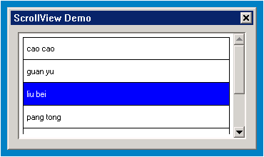
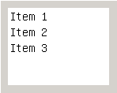
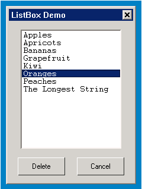
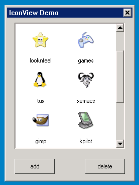
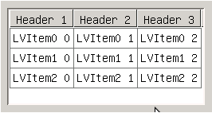
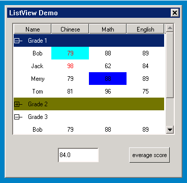

# Other Advanced Control Classes

## Brief Introduction to Other Advanced Control Classes

The class of controls are mainly view series controls, mainly used to display
list item information of different types.

Class inheritance relations of other advanced control classes are as below:

- [mWidget](MiniGUIProgGuidePart2Chapter04.md#mwidget)
   - [mScrollWidget](MiniGUIProgGuidePart2Chapter08.md#mscrollwidget)
      * [mItemView](MiniGUIProgGuidePart2Chapter15.md#mitemview)
         * [mListBox](MStudioMGNCSV1dot0PGP2C14#mListBox)
         * [mScrollView](MiniGUIProgGuidePart2Chapter15.md#mscrollview)
         * [mIconview](MiniGUIProgGuidePart2Chapter15.md#miconview)
         * [mListview](MStudioMGNCSV1dot0PGP2C14#mListView)

In the advanced control class, list item is managed as an object. Different
controls use different list item objects, and the inheritance relations are as
below:

- [mObject](MiniGUIProgGuidePart2Chapter04.md#mobject)
   - [mItem](MiniGUIProgGuidePart2Chapter15.md#mitem)
      * [mItemManager](MiniGUIProgGuidePart2Chapter15.md#mitemmanager)
         * [mListItem](MStudioMGNCSV1dot0PGP2C14#mListItem)
      * [mListColumn](MStudioMGNCSV1dot0PGP2C14#mListColumn)

Let’s firstly introduce the list item objects, and then concretely introduce
the control classes.

## `mItem`

`mItem` object is the basic class of all list items, providing a series of
basic accessing methods. Control classes such as `mListBox`, `mScrollView` and
`mIconView` etc. directly use this object.

### Status of `mItem`

| *Status name* | *Explanation* |
|----------------|---------------|
| `NCSF_ITEM_NORMAL` | Item status: normal |
| `NCSF_ITEM_SELECTED` | Item status: selected |
| `NCSF_ITEM_DISABLED` | Item status: banned |
| `NCSF_ITEM_USEBITMAP` | Item status: contain bit map, and mutually exclude with `NCSF_ITEM_USEICON` |
| `NCSF_ITEM_USEICON` | Item status: contain icon, and mutually exclude with `NCSF_ITEM_USEBITMAP` |


### Property of `mItem`

| *Property* | *Type* | *Authority* | *Explanation* |
|------------|--------|-------------|---------------|
| `NCSP_ITEM_HEIGHT` | int | `RW` | Item current height |
| `NCSP_ITEM_FLAGS` | `DWORD` | `RW` | Item status |


### Method of `mItem`

It is inherited from the method of [`mObject`](MiniGUIProgGuidePart2Chapter04.md#mobject)

An item can contain multiple kinds of content information, such as text and
image etc. Basic methods provided are:

```cpp
BOOL isSelectedItem(mItem *self);
BOOL isEnabledItem(mItem *self);
void setItemEditor(mItem *self, hEditor editor);
hEditor getItemEditor(mItem *self);
void setItemAddData(mItem *self, DWORD addData);
DWORD getItemAddData(mItem *self);
void setItemImage(mItem *self, DWORD image);
DWORD getItemImage(mItem *self);
void setItemFlags(mItem *self, DWORD flags);
DWORD getItemFlags(mItem *self);
BOOL setItemHeight(mItem *self, int height);
int getItemHeight(mItem *self);
BOOL setItemString(mItem *self, const char* string);
char* getItemString(mItem *self);
```

- `isSelectedItem` determines if the current item is in selected status.。
- `isEnabledItem` determines if the current item is in enabled status.
- `setItemString` sets item text.
- `getItemString` gets item current text.
- `setItemHeight` sets item height.
- `getItemHeight` gets item height.
- `setItemFlags` sets item status
- `getItemFlags` gets item status.
- `setItemImage` sets item icon.
- `getItemImage` gets item icon.
- `setItemAddData` sets item additional data.
- `getItemAddData` gets item additional data.
- `setItemEditor` sets item editor.
- `getItemEditor` gets item editor.

## `mItemManager`

Basic class manager managing `mItem` and its child class through linked list,
providing methods of addling, removing and setting list items.

### Status of `mItemManager`

It is inherited from the status of `mItem`.

| *Status name* | *Explanation* |
|---------------|---------------|
| `NCSF_ITMMNG_AUTOSORT` | Automatic sorting when the item is inserted |
| `NCSF_ITMMNG_FROZEN` | Forbidden or enabled item refreshing function |


### Property of `mItemManager`

It is inherited from the property of `mItem`.

| *Property* | *Type* | *Authority* | *Explanation* |
|------------|--------|-------------|---------------|
| `NCSP_ITMMNG_ITEMCOUNT` | int | `RO` | Item number contained |
| `NCSP_ITMMNG_FLAGS` | `DWORD` | `RW` | Item status |
| `NCSP_ITMMNG_TOTALHEIGHT` | int | `RO` | Total height of all the items |

### Method of `mItemManager`

It is inherited from the method of `mItem`.

#### Callback Method

`mItemManager` class supports the two callback methods of carrying out
comparison according to list item or list item character string. The method of
carrying out comparison according to list item prevails to the method of
carrying out comparison according to list item character string.

```cpp
typedef int (*NCS_CB_CMPITEM) (mItemManager *manager, HITEM hItem1, HITEM hItem2);
typedef int (*NCS_CB_CMPSTR) (const char* s1, const char* s2, size_t n);
NCS_CB_CMPITEM setItemCmpFunc(mItemManager *self, NCS_CB_CMPITEM func);
NCS_CB_CMPSTR setStrCmpFunc(mItemManager *self, NCS_CB_CMPSTR func);
NCS_CB_CMPSTR getStrCmpFunc(mItemManager *self);
```
- `setItemCmpFunc` is used to set the callback method of carrying out comparison
according to the list item itself, and at the same time, previous setting
method is returned.
- `setStrCmpFunc` is used to set the callback method of carrying out comparison
according to the list item character string, and at the same time, the previous
setting or default method is returned.
- `getStrCmpFunc` is used to get the character string comparison method in current
use.

#### Sorting Method

```cpp
void setAutoSortItem(mItemManager *self, BOOL sort);
int sortItems(mItemManager *self, NCS_CB_CMPITEM pfn);
```
- `setAutoSortItem` set or cancel sorting symbol before adding all the list
items. After the sorting symbol setting is successful, all the list items added
afterwards will be compared to the existing list items and insert location is
determined.
- `sortItems` sort all the list items again according to the specified list
item comparison method.

#### Refreshing Method

```cpp
BOOL freeze(mItemManager *self, BOOL lock);
BOOL isFrozen(mItemManager *self);
int adjustItemsHeight(mItemManager *self, int diff);
```
- `freeze`: freeze or recover refreshment to the list item.。
- `isFrozen`: judge if it is in refreshable status currently.
- `adjustItemsHeight`: adjust the list item total height change value. When the
manager handles refreshable status, after the method adjusts the size, it will
immediately reflect the changes to UI, otherwise UI will not be refreshed.

#### Create/Remove/Move List Items

When inserting the list item, firstly confirm if it is automatic sorting
supported, if so, calculate the sorting insert location according the automatic
sorting calculation method; otherwise, conduct insert tries by sequence
according to front and back list items or specified index, if the try is
successful, return to the correct location.

```cpp
HITEM createItem(mItemManager *self, HITEM prev, HITEM next, int index, int *pos);
int insertItem(mItemManager *self, HITEM hItem, HITEM prev, HITEM next, int index, int *pos);
int moveItem(mItemManager *self, mItem *curItem, int count, mItem* prevItem);
int removeItem(mItemManager *self, HITEM hItem);
BOOL removeAll(mItemManager *self);
```
- `createItem`: create a new list item and insert to the specified location,
and at the same time, return to the inserted location through the final
parameter.
- `insertItem`: insert the created list item to the specified location of the
manager, and at the same time, return to the inserted location through the
final parameter.
- `moveItem`: move the current list items and the list items of specified
number afterwards to behind a certain list item location.
- `removeItem`: remove a certain specified list item
- `removeAll`: remove all the list items.

#### Traverse List Items

```cpp
list_t* getQueue(mItemManager *self);
HITEM getListEntry(list_t* entry);

HITEM getFirstItem(mItemManager *self);
HITEM getNext(mItemManager *self, HITEM hItem);
HITEM getPrev(mItemManager *self, HITEM hItem);
```

- `getQueue`: get the list item column header of the manager.
- `getListEntry`: get the list item pointer of the specified linked list item.
- `getFirstItem`: get the first list item in the manager.
- `getNext`: get the next list item of the specified list item.
- `getPrev`: get the previous list item of the specified list item.

#### Get List Item Information

```cpp
HITEM getItem(mItemManager *self, int index);
int indexOf(mItemManager *self, HITEM hItem);

int inItem(mItemManager *self, int mouseX, int mouseY, HITEM *pRet, POINT *pt);
int getItemYPos(mItemManager *self, HITEM hItem);

int getTotalHeight(mItemManager *self);
int getItemCount(mItemManager *self);
int isEmpty(mItemManager *self);
BOOL getSelection(mItemManager *self, HITEM *pRet, int count);
int getSelectionCount(mItemManager *self);
```
- `getItem`: get the list item of the specified index.
- `indexOf`: get index of the specified list item.
- `inItem`: get list item under the specified mouse location, and return to the
starting location of the list item.
- `getItemYPos`: get starting vertical coordinate of the specified list item.
- `getTotalHeight`: get total height of the list item manager.
- `getItemCount`: get total number of the list items.。
- `isEmpty`: judge if the list item is empty.
- `getSelectionCount`: get number of the selected list items.
- `getSelection`: get information of the selected list items of specified
number.

#### Set/Get List Item Status

```cpp
BOOL isEnabled(mItemManager *self, HITEM hItem);
BOOL enable(mItemManager *self, HITEM hItem, BOOL enable);

BOOL isSelected(mItemManager *self, HITEM hItem);
BOOL select(mItemManager *self, HITEM hItem, BOOL sel);
void selectAll(mItemManager *self);
void deselectAll(mItemManager *self);

HITEM hilight(mItemManager *self, HITEM hItem);
HITEM getHilight(mItemManager *self);
BOOL isHilight(mItemManager *self, HITEM hItem);


int setHeight(mItemManager *self, HITEM hItem, int height);
int getHeight(mItemManager *self, HITEM hItem);

void setAddData(mItemManager *self, HITEM hItem, DWORD addData);
DWORD getAddData(mItemManager *self, HITEM hItem);

void setImage(mItemManager *self, HITEM hItem, DWORD image);
DWORD getImage(mItemManager *self, HITEM hItem);

void setFlags(mItemManager *self, HITEM hItem, DWORD flags);
DWORD getFlags(mItemManager *self, HITEM hItem);

BOOL setText(mItemManager *self, HITEM hItem, const char* text);
const char* getText(mItemManager *self, HITEM hItem);
int getTextLen(mItemManager *self, HITEM hItem);
```

- `isEnabled`: judge if the specified list item is in enabled status.。
- `enable`: enable of forbid the specified list item.
- `isSelected`: judge if the specified list item is in selected status.
- `select`: select or deselect the specified list item.
- `selectAll`: select all the list items.
- `deselectAll`: Cancel the selected status of all the list items.
- `hilight`: high light select the specified list item.
- `getHilight`: get the current high light selected list item.
- `isHilight`: judge if the specified list item is in high light status.
- `setHeight`: set height of the list item.
- `getHeight`: get height of the list item.
- `setAddData`: set additional data of the list item.
- `getAddData`: get additional data of the list item.
- `setImage`: set bit map information of the list item.
- `getImage`: get bit map information of the list item.
- `setFlags`: set status symbol of the list item.
- `getFlags`: get status symbol of the list item.
- `setText`: set text character string of the list item.
- `getText`: get text character string of the list item.
- `getTextLen`: get length of the text character string of the list item.

## `mListItem`

`mListItem` object is used to describe the row object of `mListView` control.

### Status of `mListItem`

It is inherited from the status of `mItemManger`.

| *Status name* | *Explanation* |
|---------------|---------------|
| `NCSF_LSTITM_FOLD` | Folded item |
| `NCSF_LSTITM_PRIVBKCOL` | The item contains private background color |
| `NCSF_LSTITM_PRIVBKCOL` | The item contains private foreground color |

### Property of `mListItem`

It is inherited from the property of `mItemManager`.

| *Property* | *Type* | *Authority* | *Explanation* |
|------------|--------|-------------|---------------|
| `NCSP_LSTITM_NRCHILD` | int | `RO` | Child item number contained |
| `NCSP_LSTITM_DEPTH` | int | `RO` | Depth of the item |
| `NCSP_LSTITM_RHEIGHT` | int | `RO` | Actual height when the item is visible |

### Method of `mListItem`

It is inherited from the method of `mItemManager`.

`mListItem` object provides a series of operation methods:

```cpp
void setBackground(mListItem *self, int index, int *color);
void setForeground(mListItem *self, int index, int *color);
int getBackground(mListItem *self, int index, int *color);
int getForeground(mListItem *self, int index, int *color);
BOOL addChild(mListItem *self, mListItem *child);
BOOL delChild(mListItem *self, mListItem *child);
BOOL setFold(mListItem *self, BOOL fold);
mListItem* getParent(mListItem *self);
int getChildCount(mListItem *self);
int getDepth(mListItem *self);
BOOL isFold(mListItem *self);
```
- `setBackground`: used to set unit background color. When the color is empty,
empty the original setting; when the index is invalid, set default row
background color, otherwise set the specified unit background color.
- `getBackground`: used to get unit background color. When the index is
invalid, return the default row background color through color, otherwise
return the specified unit background color.
- `setForeground`: used to set unit foreground color. When the color is empty,
empty the original setting; when the index is invalid, set the default row
foreground color, otherwise set the specified unit foreground color.
- `getForeground`: used to get the unit foreground color. When the index is
invalid, return the default row foreground color through color, otherwise
return the specified unit foreground color.
- `addChild`: add the specified child item.
- `delChild`: delete the specified child item.
- `setFold`: used to fold or unfold the specified item.
- `getParent`: used to get the parent item of the specified item.
- `getChildCount`: get the number of the child item contained.
- `getDepth`: get the item depth.
- `isFold`: judge if the item is in folded status.

## `mListColumn`

`mListColumn` object is used to describe the column object of `mListView`
control.

### Status of `mListColumn`

It is inherited from the status of `mItem`.

| *Status name* | *Explanation* |
|---------------|---------------|
| `NCSF_LSTCLM_LEFTALIGN` | Text alignment mode: left aligned |
| `NCSF_LSTCLM_RIGHTALIGN` | Text alignment mode: right aligned |
| `NCSF_LSTCLM_CENTERALIGN` | Text alignment mode: center aligned |

### Property of `mListColumn`

It is inherited from the property of `mItem`.

| *Property* | *Type* | *Authority* | *Explanation* |
|------------|--------|-------------|---------------|
| `NCSP_LSTCLM_POSX` | int | `RW` | Column starting position horizontal coordinate |
| `NCSP_LSTCLM_WIDTH` | int | `RW` | Column width |
| `NCSP_LSTCLM_SORTTYPE` | `ncsLstClmSortType` | `RW` | List item sorting mode: the values are ascending, descending or not sorted |
| `NCSP_LSTCLM_CMPFUNC` | `NCS_CB_LISTV_CMPCLM` | `RW` | Callback method of comparison of the two list items |

The following is the data structure definition involved in the property

```cpp
typedef enum
{
    NCSID_LSTCLM_NOTSORTED = 0, // Not sorted
    NCSID_LSTCLM_HISORTED,      // Ascending
    NCSID_LSTCLM_LOSORTED       // Descending
}ncsLstClmSortType;

typedef struct _NCS_LSTCLM_SORTDATA
{
    int     column;         // Sorted column index
    int     losorted;       // Sorted column sorting mode
    mWidget *obj;           // Control class containing comparison items
}NCS_LSTCLM_SORTDATA;

typedef int (*NCS_CB_LISTV_CMPCLM)(HITEM nItem1, HITEM nItem2, NCS_LSTCLM_SORTDATA *sortData);
```

## `mItemView`

Basic class, direct use is not allowed.

### Style of `mItemView`

It is inherited from the style of [`mScrollWidget`](MiniGUIProgGuidePart2Chapter04.md#mscrollwidget).

| *Style name* | *mstudio property name* | *Explanation* |
|--------------|-------------------------|---------------|
| `NCSS_ITEMV_AUTOSORT` | - | Item automatic sorting |
| `NCSS_ITEMV_LOOP` | - | Item circulative browsing |
| `NCSS_ITEMV_SINGLE` | - | Item single selection supported, default style |
| `NCSS_ITEMV_MULTIPLE` | - | Item multi selection supported |

### Property of `mItemView`

Inherited from the property of [`mScrollWidget`](MiniGUIProgGuidePart2Chapter04.md#mscrollwidget).

| *Property ID* | *mstudio name* | *Type* | *Authority* | *Explanation* |
|---------------|----------------|--------|-------------|---------------|
| `NCSP_ITEMV_DEFITEMHEIGHT` | - | int | `RW` | Item default height |
| `NCSP_ITEMV_ITEMCOUNT` | - | int | `RO` | Item total number |

### Event of `mItemView`

It is inherited from the event of [`mScrollWidget`](MiniGUIProgGuidePart2Chapter04.md#mscrollwidget).

| *Event notification code* | *Explanation* | *Parameter* |
|---------------------------|---------------|-------------|
| `NCSN_ITEMV_CLICKED` | Mouse clicking event | Clicked item sentence handle |
| `NCSN_ITEMV_SELCHANGING` | Item changing selection | Item sentence handle in high light status |
| `NCSN_ITEMV_SELCHANGED` | The selected item has changed | New selected item sentence handle |
| `NCSN_ITEMV_ENTER` | Enter key is pressed down | - |
| `NCSN_ITEMV_SETFOCUS` | Get focus | - |
| `NCSN_ITEMV_KILLFOCUS` | Lose focus | - |


### Method of `mItemView`

It is inherited from the method of [`mScrollWidget`](MiniGUIProgGuidePart2Chapter04.md#mscrollwidget).

#### Callback Method

`mItemView` provides three callback methods, initialization, drawing and
destroying list item, at the same time, there is the callback method of
comparing list items.

```cpp
typedef int  (*NCS_CB_INITITEM)(mItemView *self, HITEM hItem);
typedef void (*NCS_CB_DSTRITEM)(mItemView *self, HITEM hItem);
typedef void (*NCS_CB_DRAWITEM)(mItemView *self, HITEM hItem, HDC hdc, RECT *rcDraw);

NCS_CB_DRAWITEM setItemDraw(mItemView *self, NCS_CB_DRAWITEM func);
NCS_CB_INITITEM setItemInit(mItemView *self, NCS_CB_INITITEM func);
NCS_CB_DSTRITEM setItemDestroy(mItemView *self, NCS_CB_DSTRITEM func);

NCS_CB_CMPITEM setItemCmpFunc(mItemView *self, NCS_CB_CMPITEM func);
NCS_CB_CMPSTR setStrCmpFunc(mItemView *self, NCS_CB_CMPSTR func);
NCS_CB_CMPSTR getStrCmpFunc(mItemView *self);
```

#### Sorting Method

```cpp
void setAutoSortItem(mItemView *self, BOOL sort);
int sortItems(mItemView *self, NCS_CB_CMPITEM pfn);
```
- `setAutoSortItem`: Set or cancel sorting symbol before adding all the list
items. After the sorting symbol setting is successful, after comparing all the
list items added afterwards and the existing list items, confirm the insert
position.
- `sortItems`: according to the specified list item comparison method, sort all
the list items again.

#### Refreshing Method

```cpp
void freeze(mItemView *self, BOOL lock);
BOOL isFrozen(mItemView *self);
int adjustItemsHeight(mItemView *self, int diff);
```
- `freeze`: freeze or recover refreshment to the list item.。
- `isFrozen`: judge if it is in refreshable status currently.
- `adjustItemsHeight`: adjust the list item total height change value. The
method will immediately reflect the change to UI after the control adjusts the
list item size, otherwise UI will not be refreshed.

#### Create/Remove/Move List Item

When inserting to the list item, firstly determine if it is automatic sorting
supported, if so, calculate the sorting insert position according to the
automatic sorting calculation method; otherwise conduct insert tries by
sequence according to the front and back list item or specified index; after
the try is successful, return to the correct position.

```cpp
HWND createItem(mItemView *self, HITEM prev, HITEM next, int index,
        int height, DWORD addData, int *pos, BOOL adjust);
int insertItem(mItemView *self, HITEM hItem, HITEM prev, HITEM next,
        int index, int *pos);
int removeItem(mItemView *self, HITEM hItem);

BOOL removeAll(mItemView *self);
```
- `createItem`: create a new list item and insert to the specified position,
and at the same time, return to the inserted position according to the final
parameter.
- `insertItem`: insert the created list item to the specified position of the
manager, and at the same time, return to the inserted position according to the
final parameter.
- `removeItem`: remove certain specified list item.
- `removeAll`: remove all the list items.

#### Traverse List Item

```cpp
list_t* getQueue(mItemView *self);
HITEM getListEntry(mItemView *self, list_t* entry);
HITEM getFirstItem(mItemView *self);
HITEM getNext(mItemView *self, HITEM hItem);
HITEM getPrev(mItemView *self, HITEM hItem);
```

- `getQueue`: get the list item column header of the manager.。
- `getListEntry`: get the list item pointer of the specified linked list item.
- `getFirstItem`: get the first list item in the manager.
- `getNext`: get the next list item of the specified list item.
- `getPrev`: get the previous list item of the specified list item.

#### Get List Item Information

```cpp
HITEM getItem(mItemView *self, int index);
int indexOf(mItemView *self, HITEM hItem);

int inItem(mItemView *self, int mouseX, int mouseY, HITEM *pRet, POINT *pt);

int getTotalHeight(mItemView *self);
int getItemCount(mItemView *self);
int isEmpty(mItemView *self);
int getSelectionCount(mItemView *self);
BOOL getSelection(mItemView *self, HITEM *pRet, int count);
```
- `getItem`: get list item of the specified index.
- `indexOf`: get index of the specified list item.
- `inItem`: get the list item under the specified mouse position, and return to
the starting position of the list item.
- `getTotalHeight`: get the total height of the list item manager.
- `getItemCount`: get the total number of the list items.
- `isEmpty`: judge if the list item is empty.
- `getSelectionCount`: get number of the selected list items.
- `getSelection`: get the selected list item information of specified number.

#### Set/Get List Item Status

```cpp
BOOL isEnabled(mItemView *self, HITEM hItem);
BOOL enable(mItemView *self, HITEM hItem, BOOL enable);

BOOL isSelected(mItemView *self, HITEM hItem);
BOOL select(mItemView *self, HITEM hItem);
BOOL deselect(mItemView *self, HITEM hItem);

void selectAll(mItemView *self);
void deselectAll(mItemView *self);

int hilight(mItemView *self, HITEM hItem);
HITEM getHilight(mItemView *self);
BOOL isHilight(mItemView *self, HITEM hItem);

int setItemHeight(mItemView *self, HITEM hItem, int height);
int getItemHeight(mItemView *self, HITEM hItem);

DWORD getAddData(mItemView *self, HITEM hItem);
void setAddData(mItemView *self, HITEM hItem, DWORD addData);

void setImage(mItemView *self, HITEM hItem, DWORD image);
DWORD getImage(mItemView *self, HITEM hItem);

void setFlags(mItemView *self, HITEM hItem, DWORD flags);
DWORD getFlags(mItemView *self, HITEM hItem);

BOOL setText(mItemView *self, HITEM hItem, const char* text);
const char* getText(mItemView *self, HITEM hItem);
int getTextLen(mItemView *self, HITEM hItem);
```

- `isEnabled`: judge if the specified list item is in enabled status.
- `enable`: enable or forbid specified list item.
- `isSelected`: judge if the specified list item is in selected status.
- `select`: select specified list item.
- `deselect`: deselect the specified list item.
- `selectAll`: select all the list items.
- `deselectAll`: cancel the selected status of all the list items.
- `hilight`: high light select the specified list item.
- `getHilight`: get the currently high light selected list item.
- `isHilight`: judge if the specified list item is in high light status.
- `setItemHeight`: set height of the list item.
- `getItemHeight`: get height of the list item.
- `setAddData`: set additional data of the list item.
- `getAddData`: get additional data of the list item.
- `setImage`: set bit map information of the list item.
- `getImage`: get bit map information of the list item.
- `setFlags`: set status symbol of the list item.
- `getFlags`: get status symbol of the list item.
- `setText`: set text character string of the list item.
- `getText`: get text character string of the list item.
- `getTextLen`: get length of the text character string of the list item.

#### Others

```cpp
int getFirstVisItem(mItemView *self);
void resetContent(mItemView *self);
int getRect(mItemView *self, HITEM hItem, RECT *rcItem, BOOL bConv);
int getCurSel(mItemView *self);
int setCurSel(mItemView *self, int newSel);
void refreshItem(mItemView *self, HITEM hItem, const RECT *rcInv);
BOOL showItemByIdx(mItemView *self, int index);
BOOL showItem(mItemView *self, HITEM hItem);
```

- `getFirstVisItem`: get the first visible list item.
- `resetContent`: remove all the list items, and reset all the information
configuration to the initial value.
- `getRect`: get the rectangular region of the specified list item, and decide
if converting the coordinate to the coordinate relative to the screen through
the final parameter.
- `getCurSel`: get the currently selected list item index.
- `setCurSel`: set the specified list item as selected item through index and
display it, if it is successful, return 0; if it is failed, return -1.
- `refreshItem`: refresh the specified region of the specified list item; if
the specified region is empty, refresh the whole list item.
- `showItemByIdx`: show the specified list item according to the index.
- `showItem`: show the specified list item

## `mScrollView`

- *Control window class*: `NCSCTRL_SCROLLVIEW`
- *Control English name*: `ScrollView`
- *Brief introduction*: Used to show and handle list item, and content drawing
of the list item is decided by the applications themselves.
- *Schematic diagram*:

### Style of `mScrollView`

It is inherited from `mItemView`.

| *Style name* | *mstudio property name* | *Explanation* |
|--------------|-------------------------|---------------|
| `NCSS_SCRLV_LOOP` | - | Item circulative browsing |
| `NCSS_SCRLV_SORT` | - | Item automatic sorting |

### Property of `mScrollView`

it is inherited from the property of `mItemView`.

### Event of `mScrollView`

It is inherited from the event of `mItemView`.

| *Event notification code* | *Explanation* | *Parameter* |
|---------------------------|---------------|-------------|
| `NCSN_SCRLV_CLICKED` | Mouse clicking event | Clicked item sentence handle |
| `NCSN_SCRLV_SELCHANGING` | Item changing selection | Item sentence handle in high light status |
| `NCSN_SCRLV_SELCHANGED` | The selected item has changed | New selected item sentence handle |

### Method of `mScrollView`

It is inherited from the method of `mItemView`.

`mScrollView` in inherited from `mItemView`, which provides `addItem` method of
the control itself. The method creates and inserts list item through list item
information, and at the same time, returns the insert position to the interface
caller.

```cpp
typedef struct _NCS_SCRLV_ITEMINFO
{
    int     index;
    int     height;
    DWORD   addData;
}NCS_SCRLV_ITEMINFO;

HITEM addItem(mScrollView *self, NCS_SCRLV_ITEMINFO *info, int *pos);
```

Before adding list item content, carry out setting of some basic callback
method, such as:

```cpp
    _c(scrlvObj)->freeze(scrlvObj, TRUE);
    _c(scrlvObj)->setItemCmpFunc(scrlvObj, scrlv_cmp_item);
    _c(scrlvObj)->setItemDraw(scrlvObj, scrlv_draw_item);

    for (i = 0; i < TABLESIZE(people); i++) {
        info.height  = 32;
        info.index   = i;
        info.addData = (DWORD)people[i];
        _c(scrlvObj)->addItem(scrlvObj, &info, NULL);
    }
    _c(scrlvObj)->freeze(scrlvObj, FALSE);
```

### Instance of `mScrollView`



##### Figure 1 Output of scrollview Program

##### List 1 scrollview.c

```cpp
/*
** scrollview.c: Sample program for mGNCS Programming Guide
**      The demo application for ScrollView.
**
** Copyright (C) 2009 ~ 2019 FMSoft Technologies.
*/

#include <stdio.h>
#include <stdlib.h>
#include <string.h>

// START_OF_INCS
#include <minigui/common.h>
#include <minigui/minigui.h>
#include <minigui/gdi.h>
#include <minigui/window.h>

#include <mgncs/mgncs.h>
// END_OF_INCS

#define IDC_SCROLLVIEW  100

static const char *people[] =
{
    "cao cao",
    "sun quan",
    "liu bei",
    "zhu ge liang",
    "guan yu",
    "pang tong",
    "si ma yu",
};

static NCS_RDR_INFO rdr_info = {
    "classic","classic",NULL
};

// START_OF_HANDLERS
static void scrlv_notify (mWidget *self, int id, int nc, DWORD add_data)
{
    if (nc == NCSN_SCRLV_CLICKED)
    {
        if (self) {
            const char* info;
            mIconView *cls = (mIconView*)self;

            info = (const char*)_c(cls)->getAddData(cls, (HITEM)add_data);

            fprintf (stderr, "current item's data %s \n", info);
        }
    }
}

static NCS_EVENT_HANDLER scrlv_handlers[] = {
    NCS_MAP_NOTIFY(NCSN_SCRLV_CLICKED, scrlv_notify),
    {0, NULL }
};
// END_OF_HANDLERS

static NCS_WND_TEMPLATE _ctrl_tmpl[] = {
    {
        NCSCTRL_SCROLLVIEW,
        IDC_SCROLLVIEW,
        10, 10, 320, 150,
        WS_BORDER | WS_VISIBLE | NCSS_NOTIFY | NCSS_SCRLV_SORT,
        WS_EX_NONE,
        "",
        NULL,
        &rdr_info,
        scrlv_handlers,
        NULL,
        0,
        0
    },
};

static BOOL dialog_onKeyDown(mWidget* self,
        int message, int code, DWORD key_status)
{
    if (message == MSG_KEYDOWN) {
        if (code == SCANCODE_REMOVE) {
            mScrollView *scrlvObj;
            int         curSel, count;
            HITEM       delItem;

            scrlvObj =
                (mScrollView*)ncsObjFromHandle(GetDlgItem(self->hwnd, IDC_SCROLLVIEW));
            count = _c(scrlvObj)->getItemCount(scrlvObj);

            if (scrlvObj) {
                curSel = _c(scrlvObj)->getCurSel(scrlvObj);

                if (curSel >= 0) {
                    delItem = _c(scrlvObj)->getItem(scrlvObj, curSel);
                    _c(scrlvObj)->removeItem(scrlvObj, delItem);
                    if (curSel == count -1)
                        curSel--;
                    _c(scrlvObj)->setCurSel(scrlvObj, curSel);
                }
            }
        }
    }
    return FALSE;
}

static NCS_EVENT_HANDLER dialog_handlers[] = {
    {MSG_KEYDOWN, dialog_onKeyDown},
    {0, NULL }
};

static NCS_MNWND_TEMPLATE dialog_tmpl = {
    NCSCTRL_DIALOGBOX,
    7,
    0, 0, 350, 200,
    WS_CAPTION | WS_BORDER | WS_VISIBLE,
    WS_EX_NONE,
    "ScrollView Demo",
    NULL,
    &rdr_info,
    dialog_handlers,
    _ctrl_tmpl,
    sizeof(_ctrl_tmpl)/sizeof(NCS_WND_TEMPLATE),
    0,
    0, 0,
};

// START_OF_ITEMFUNCS
static int scrlv_cmp_item (mItemManager *manager, HITEM hItem1, HITEM hItem2)
{
    mScrollView *scrlvObj = (mScrollView*)manager->obj;
    const char *name1;
    const char *name2;

    if (scrlvObj) {
        name1 = (const char*)_c(scrlvObj)->getAddData(scrlvObj, hItem1);
        name2 = (const char*)_c(scrlvObj)->getAddData(scrlvObj, hItem2);
        return strcmp (name1, name2);
    }
    return 0;
}

static void scrlv_draw_item (mItemView *self, HITEM hItem, HDC hdc, RECT *rcDraw)
{
    const char  *name = (const char*)_c(self)->getAddData(self, hItem);
    gal_pixel   oldBrushClr = 0, oldTextClr = 0;
    BOOL        isHilite = FALSE;
    int         top;
    RECT        rcText;

    SetBkMode (hdc, BM_TRANSPARENT);

    top = rcDraw->top;
    if (_c(self)->indexOf(self, hItem) > 0) {
        top --;
    }

    if (_c(self)->isHilight(self, hItem)) {
        isHilite = TRUE;
        oldBrushClr = SetBrushColor (hdc, PIXEL_blue);
        FillBox (hdc, rcDraw->left + 1,
                top + 1, RECTWP(rcDraw) - 2, RECTHP(rcDraw) - 1);
        oldTextClr = SetTextColor (hdc, PIXEL_lightwhite);
    }

    Rectangle (hdc, rcDraw->left, top, rcDraw->right - 1, rcDraw->bottom - 1);

    CopyRect(&rcText, rcDraw);
    rcText.left += 5;
    DrawText(hdc, name, -1, &rcText, DT_VCENTER | DT_SINGLELINE);

    if (isHilite) {
        SetBrushColor (hdc, oldBrushClr);
        SetTextColor (hdc, oldTextClr);
    }
}
// END_OF_ITEMFUNCS

static BOOL scrlv_init(mDialogBox* self)
{
    int     i;
    HWND    scrlvWnd;
    mScrollView *scrlvObj;
    NCS_SCRLV_ITEMINFO info;

    scrlvWnd = GetDlgItem (self->hwnd, IDC_SCROLLVIEW);
    scrlvObj = (mScrollView*)ncsObjFromHandle(scrlvWnd);

    if (!scrlvObj)
        return FALSE;

// START_OF_ADDITEMS
    _c(scrlvObj)->freeze(scrlvObj, TRUE);
    _c(scrlvObj)->setItemCmpFunc(scrlvObj, scrlv_cmp_item);
    _c(scrlvObj)->setItemDraw(scrlvObj, scrlv_draw_item);

    for (i = 0; i < TABLESIZE(people); i++) {
        info.height  = 32;
        info.index   = i;
        info.addData = (DWORD)people[i];
        _c(scrlvObj)->addItem(scrlvObj, &info, NULL);
    }
    _c(scrlvObj)->freeze(scrlvObj, FALSE);
// END_OF_ADDITEMS
    return TRUE;
}

int MiniGUIMain(int argc, const char* argv[])
{
    ncsInitialize();
    mDialogBox* mydlg =
        (mDialogBox *)ncsCreateMainWindowIndirect (&dialog_tmpl, HWND_DESKTOP);

    scrlv_init(mydlg);
    _c(mydlg)->doModal(mydlg, TRUE);

    MainWindowThreadCleanup(mydlg->hwnd);
    ncsUninitialize();
    return 0;
}
```

## `mListBox`

- *Control window class*: `NCSCTRL_LISTBOX`
- *Control English name*: `ListBox`
- *Brief introduction*: Display a series of options provided by the users in
the child window that can scroll. Users can select certain item or multiple
items through keyboard and mouse operation, and the selected list item is
usually high light displayed. The most typical usage of list box is file
opening dialog box.
- *Schematic diagram*:



### Style of `mListBox`

It is inherited from the style of `mItemView`.

| *Style name* | *mstudio property name* | *Explanation* |
|--------------|-------------------------|---------------|
| `NCSS_LSTBOX_SINGLE` | `Multi->FALSE` | Single selection list item supported |
| `NCSS_LSTBOX_MULTIPLE` | `Multi->TRUE` | Multi selection list item supported |
| `NCSS_LSTBOX_SORT` | `AutoSort` | List item sorting supported |
| `NCSS_LSTBOX_MOUSEFOLLOW` | `MouseFollow` | The list item supports mouse following |
| `NCSS_LSTBOX_STRING` | - | List item with character string |
| `NCSS_LSTBOX_USEBITMAP` | `UseBitmap` | The list item has bit map |
| `NCSS_LSTBOX_CHECKBOX` | Checkable | The list item contains checkbox |
| `NCSS_LSTBOX_AUTOCHECK` | `AutoCheck` | checkbox in the list item supports automatic selection |
| `NCSS_LSTBOX_AUTOCHECKBOX` | - | Simultaneously contain `NCSS_LSTBOX_CHECKBOX` and `NCSS_LSTBOX_AUTOCHECK` styles |

### Property of `mListBox`

It is inherited from `mItemView`.

| *Property ID* | *mstudio name* | *Type* | *Authority* | *Explanation* |
|---------------|----------------|--------|-------------|---------------|
| `NCSP_LSTBOX_ITEMWIDTH` | - | int | `RO` | Maximum width of the list item |
| `NCSP_LSTBOX_ITEMCOUNT` | - | int | `RO` | Total number of the list item |
| `NCSP_LSTBOX_ITEMHEIGHT` | - | int | `RW` | Height of the list item |
| `NCSP_LSTBOX_TOPITEM` | - | int | `RW` | The first visible list item index |
| `NCSP_LSTBOX_HILIGHTEDITEM` | - | int | `RW` | High light list item index |

### Event of `mListBox`

It is inherited from the event of `mItemView`.

| *Event notification code* | *Explanation* | *Parameter* |
|---------------------------|---------------|-------------|
| `NCSN_LSTBOX_CLICKED` | Mouse clicking event | |
| `NCSN_LSTBOX_SELCHANGED` | The selected item has changed | New selected item sentence handle |
| `NCSN_LSTBOX_ENTER` | Enter key is pressed down | - |
| `NCSN_LSTBOX_SETFOCUS` | Get focus | - |
| `NCSN_LSTBOX_KILLFOCUS` | Lose focus | - |
| `NCSN_LSTBOX_ERRSPACE` | Space is insufficient | - |
| `NCSN_LSTBOX_DBCLK` | Double click list item | - |
| `NCSN_LSTBOX_SELCANCEL` | Deselect the item | - |
| `NCSN_LSTBOX_CLKCHKMARK` | check mark is clicked | - |

### Method of `mListBox`

It is inherited from the method of `mItemView`.

#### Add the character string to the list box

After establishing listbox control, the next step is placing the character
string in it, which can be completed through calling `addString` method. After
adding is successful, the method will return the index value of the list item.
The character string is usually quoted through the index number counting from
0, and 0 corresponds to the top item.

```cpp
int addString(mListBox *self, const char* string, DWORD addData);
```

`insertString` can be used to appoint an index value, and insert the character
string to the specified position in the list box. But under `NCSS_LISTBOX_SORT`
style, it will insert to the corresponding position according to the sorting
result, and index value setting will be ignored.

```cpp
int insertString(mListBox *self, const char* string, DWORD addData, int index);
```

For Example:

```cpp
    iteminfo.flag = NCSF_LSTBOX_CMBLANK;
    iteminfo.image = 0;
    for (i = 0; i < TABLESIZE(items); i++) {
        iteminfo.string = items[i];
        _c(lstboxObj)->addString (lstboxObj, &iteminfo);
    }
```

If the added list item contains bit map etc. besides character string, it can
be completed through `addItems` method.

```cpp
typedef struct _NCS_LSTBOX_ITEMINFO
{
    char*   string;
    DWORD   flag;
    DWORD   image;
    DWORD addData;
}NCS_LSTBOX_ITEMINFO;

void addItems(mListBox *self, NCS_LSTBOX_ITEMINFO *info, int count);
```

For Example:

```cpp
    int count = 3;
    mListItemInfo   lbii[count];

    lbii[0].string = "test list";
    lbii[0].flag = 0;
    lbii[0].image = 0;
    ... ...
    _c(listFile)->addItems(listFile, lbii, count);
```

#### Remove List Box Item

List box control can remove the list item of specified index value through
`delString` or `removeItemByIdx` method or the specified list item is removed
through `removeItem` method; at the same time, all the content in the list box
can be emptied through `resetContent`. Prototype of the function is as below:

```cpp
BOOL delString(mListBox *self, int index);
int removeItemByIdx(mListBox *self, int index);
```

For Example:

```cpp
    int sel     = _c(lstboxObj)->getCurSel(lstboxObj);
    int count   = _c(lstboxObj)->getItemCount(lstboxObj);

    if (sel >= 0) {
        _c(lstboxObj)->delString(lstboxObj, sel);

        if (sel == count -1)
            sel --;

        _c(lstboxObj)->setCurSel(lstboxObj, sel);
    }
```


#### Select and Get Item

For single selection list box and multi selection list box, in the selected
status of index list item, different methods need to be used, below let’s
firstly look at the single selection list box. The selected item can control
through `setCurSel` besides through mouse and keyboard operation.

```cpp
_c(listFile)->setCurSel(listFile, 1);
```

On the contrary, currently selected index item can be obtained through
`getCurSel`, if there is no selected item, -1 will be returned.

```cpp
_c(listFile)->getCurSel(listFile);
```

In addition, selected status can be set or canceled through `selectByIdx` or
`deselectByIdx`.

```cpp
int selectByIdx(mListBox *self, int index);
int deselectByIdx(mListBox *self, int index);
```

For multi selection list box, `setCurSel` and `getCurSel` method can only be
used to set and get current high light item, and all the items with selected
status cannot be obtained. However, we can use `setSel` to set selection status
of specific item without influencing other items, and value of flag has three
meanings:
- -1: carry out reversed operation to the specified list item, that is, if the
original status is not selected, select it, otherwise cancel the selected
status.
- 0: cancel selection to the list item.
- Others: select the list item.

Prototype of the method:

```cpp
int setSel(mListBox *self, int newSel, int flag);
```
Example is as following:

```cpp
_c(listFile)->setSel(listFile, 0, 1);
```

On the contrary, we can use `isSelected` method to determine selection status
of specific item:

```cpp
_c(listFile)->isSelected(listFile, 0);
```

In addition, for multi selection list box, we can get the currently selected
item number through `getSelectionCount` method, and get index values of all the
selected items through `getSelection` method.

```cpp
HITEM* selItems;
int selCount = _c(listFile)->getSelectionCount(listFile);
if (selCount == 0)
return;

selItem = alloca (sizeof(HITEM)*selCount);
_c(listFile)->getSelection(listFile, selItem, selCount);
```

#### Find Items Containing Character String

The list box provides the method to accurately or vaguely find list item
containing certain specified character string within the specified range
through `findString` method:

```cpp
int findString(mListBox *self, int start, char* string, BOOL bExact);
```

The following operation will start to accurately find the list item with
character string as test from the third list item. If it is successful, the
list item index found will be returned, otherwise -1 will be returned:

```cpp
_c(listFile)->findString(listFile, 2, "test", TRUE);
```

#### Set and get current status of the check box of certain item

```cpp
    _c(listFile)->getCheckMark(listFile, index);
```

Return the status of the check box of the item at the specified index. If
corresponding item is not found, -1 will be returned. `NCSF_LSTITEM_CMCHECKED`
represents that the check box of the item is in selected status.
`NCSF_LSTITEM_CMPARTCHECKED` represents that the check box of the item is in
partial selected status. `NCSF_LSTITEM_CMBLANK` represents that the check box
of the item is in unselected status.

```cpp
    _c(listFile)->setCheckMark(listFile, index, (DWORD)status);
```

Set the status of the check box of the item at the index specified by index as
the value specified in status. When the item specified by index is not found,
`FALSE` will be returned, if it is successful, `TRUE` will be returned.

#### Set Certain List Box Item as Bold Display Status

```cpp
    _c(listFile)->bold(listFile, index, TRUE);
```

The operation will carry out bold setting to the content of the specified index
item.

#### Set or Get Selection Status of Certain List Box Item

The list box determines if a specific item is in forbid selected status through
`isEnabled` method.

```cpp
_c(listFile)->isEnabled(listFile, 0);
```

Item selected or forbid item selected can be supported through `enableByIdx`
or `enable` method.

```cpp
    _c(listFile)->enableByIdx(listFile, 0, TRUE);
or
    _c(listFile)->enableByIdx(listFile, 0, FALSE);
```

#### Set Character String Comparison Function

The list box control uses the sorting method set by the user to arrange the
list items through `setStrCmpFunc` method.

```cpp
static int my_strcmp (const char* s1, const char* s2, size_t n)
{
        int i1 = atoi (s1);
        int i2 = atoi (s2);
        return (i1 – i2);
}
_c(listFile)->setStrCmpFunc(listFile, my_strcmp);
```

### Instance of `mListBox`



##### Figure 1 Output of listbox Program

##### List 2 listbox.c

```cpp
/**
 * listbox.c: Sample program for mGNCS Programming Guide
 *      The demo application for ListBox.
 *
 * Copyright (C) 2009 ~ 2019 FMSoft Technologies.
 */

#include <stdio.h>
#include <stdlib.h>
#include <string.h>

// START_OF_INCS
#include <minigui/common.h>
#include <minigui/minigui.h>
#include <minigui/gdi.h>
#include <minigui/window.h>

#include <mgncs/mgncs.h>
// END_OF_INCS

#define IDC_LIST    100
#define IDC_DELETE  200

static char* items[] = {
    "Apples",
    "Apricots",
    "Bananas",
    "Grapefruit",
    "Kiwi",
    "Oranges",
    "Peaches",
    "The Longest String"
};

static void lstbox_init(mDialogBox *dialog)
{
    NCS_LSTBOX_ITEMINFO iteminfo;
    mListBox *lstboxObj;
    int i;

    lstboxObj = (mListBox *)ncsGetChildObj(dialog->hwnd, IDC_LIST);

// START_OF_ADDITEMS
    iteminfo.flag = NCSF_LSTBOX_CMBLANK;
    iteminfo.image = 0;
    for (i = 0; i < TABLESIZE(items); i++) {
        iteminfo.string = items[i];
        _c(lstboxObj)->addString (lstboxObj, &iteminfo);
    }
// END_OF_ADDITEMS
}

// START_OF_BTNHANDLERS
static void btn_notify(mWidget *self, int id, int nc, DWORD add_data)
{
    mListBox    *lstboxObj =
        (mListBox *)ncsGetChildObj(GetParent(self->hwnd), IDC_LIST);
// START_OF_DELITEMS
    int sel     = _c(lstboxObj)->getCurSel(lstboxObj);
    int count   = _c(lstboxObj)->getItemCount(lstboxObj);

    if (sel >= 0) {
        _c(lstboxObj)->delString(lstboxObj, sel);

        if (sel == count -1)
            sel --;

        _c(lstboxObj)->setCurSel(lstboxObj, sel);
    }
// END_OF_DELITEMS
}

static NCS_EVENT_HANDLER btn_handlers [] = {
    NCS_MAP_NOTIFY(NCSN_BUTTON_PUSHED, btn_notify),
    {0, NULL}
};
// END_OF_BTNHANDLERS
static NCS_WND_TEMPLATE _ctrl_tmpl[] = {
    {
        NCSCTRL_LISTBOX,
        IDC_LIST,
        20, 15, 170, 200,
        WS_BORDER | WS_VISIBLE | NCSS_NOTIFY,
        WS_EX_NONE,
        "",
        NULL,
        NULL,
        NULL,
        NULL,
        0,
        0
    },
    {
        NCSCTRL_BUTTON,
        IDC_DELETE,
        15, 230, 80, 30,
        WS_VISIBLE | WS_TABSTOP,
        WS_EX_NONE,
        "Delete",
        NULL,
        NULL,
        btn_handlers,
        NULL,
        0,
        0
    },
    {
        NCSCTRL_BUTTON,
        IDCANCEL,
        115, 230, 80, 30,
        WS_VISIBLE | WS_TABSTOP,
        WS_EX_NONE,
        "Cancel",
        NULL,
        NULL,
        NULL,
        NULL,
        0,
        0
    },
};


static NCS_MNWND_TEMPLATE mainwnd_tmpl = {
    NCSCTRL_DIALOGBOX,
    1,
    100, 100, 220, 300,
    WS_CAPTION | WS_BORDER | WS_VISIBLE,
    WS_EX_NONE,
    "ListBox Demo",
    NULL,
    NULL,
    NULL,
    _ctrl_tmpl,
    sizeof(_ctrl_tmpl)/sizeof(NCS_WND_TEMPLATE),
    0,
    0, 0,
};

int MiniGUIMain(int argc, const char* argv[])
{
    ncsInitialize();

    mDialogBox* dialog =
        (mDialogBox *)ncsCreateMainWindowIndirect (&mainwnd_tmpl, HWND_DESKTOP);

    lstbox_init(dialog);
    _c(dialog)->doModal(dialog, TRUE);

    MainWindowThreadCleanup(dialog->hwnd);
    ncsUninitialize();
    return 0;
}
```

## `mIconView`

- *Control window class*: `NCSCTRL_ICONVIEW`
- *Control English name*: `IconView`
- *Brief introduction*: a series of options provided by the users is offered in
the mode of icon plus label literal for browsing. Users can select certain item
or multiple items through keyboard and mouse operation, and the selected item
is usually high light displayed. The typical usage of icon control is as the
display of the container of desktop icon and documents under the directory.
- *Schematic diagram*:


### Style of `mIconView`

It is inherited from the style of `mItemView`.

| *Style name* | *mstudio property name* | *Explanation* |
|--------------|-------------------------|---------------|
| `NCSS_ICONV_LOOP` | Loop | Item circulative browsing |
| `NCSS_ICONV_SORT` | `AutoSort` | Item automatic sorting |

### Property of `mIconView`

It is inherited from the property of `mItemView`.

| *Property ID* | *mstudio name* | *Type* | *Authority* | *Explanation* |
|---------------|----------------|--------|-------------|---------------|
| `NCSP_ICONV_DEFICONHEIGHT` | - | int | `RW` | Height of the list item |
| `NCSP_ICONV_DEFICONWIDTH` | - | int | `RW` | Width of the list item |

### Method of `mIconView`

It is inherited from the method of `mItemView`.

`mIconview` control initializes the size of the list item through `setIconSize`
method, and adds list item according to list item information through `addItem`
method.

```cpp
typedef struct _NCS_ICONV_ITEMINFO
{
    int index;
    PBITMAP bmp;
    const char *label;
    DWORD addData;
}NCS_ICONV_ITEMINFO;

void setIconSize(mIconView *self, int width, int height);
HITEM addItem(mIconView *self, NCS_ICONV_ITEMINFO *info, int *pos);
```

Example code of adding list item are:

```cpp
    _c(iconvObj)->setIconSize(iconvObj, 90, 80);

    for(i = 0; i < TABLESIZE(icon_demos); i++)
    {
        pos = 0;
        memset (&info, 0, sizeof(NCS_ICONV_ITEMINFO));
        info.bmp = &icon_demos[i];
        info.index = TABLESIZE(icon_demos) * j + i;
        info.label = iconlabels[i];
        info.addData = (DWORD)iconlabels[i];
        _c(iconvObj)->addItem(iconvObj, &info, &pos);
    }
    _c(iconvObj)->setCurSel(iconvObj, 0);
```

### Instance of `mIconView`



##### Figure p2c6-1 Output of iconview Program

##### List 3 iconview.c

```cpp
/**
 * iconview.c: Sample program for mGNCS Programming Guide
 *      The demo application for IconView.
 *
 * Copyright (C) 2009 ~ 2019 FMSoft Technologies.
 */

#include <stdio.h>
#include <stdlib.h>
#include <string.h>

// START_OF_INCS
#include <minigui/common.h>
#include <minigui/minigui.h>
#include <minigui/gdi.h>
#include <minigui/window.h>

#include <mgncs/mgncs.h>
// END_OF_INCS

#define IDC_ICONVIEW    100
#define IDC_ADD         600
#define IDC_DELETE      601

static BITMAP icon_demos [12];

static const char* iconfiles[12] =
{
    "./res/acroread.png",
    "./res/icons.png",
    "./res/looknfeel.png",
    "./res/package_games.png",
    "./res/tux.png",
    "./res/xemacs.png",
    "./res/gimp.png",
    "./res/kpilot.png",
    "./res/multimedia.png",
    "./res/realplayer.png",
    "./res/usb.png",
    "./res/xmms.png"
};

static const char *iconlabels[12] =
{
    "acroread",
    "icons",
    "looknfeel",
    "games",
    "tux",
    "xemacs",
    "gimp",
    "kpilot",
    "multimedia",
    "realplayer",
    "usb",
    "xmms"
};

static BOOL iconv_init(mDialogBox* self)
{
    NCS_ICONV_ITEMINFO info;
    static int i = 0, j = 0, pos = 0;
    mIconView *iconvObj;
    HWND iconvWnd;

    for(i = 0; i < TABLESIZE(icon_demos); i++)
    {
        LoadBitmap (HDC_SCREEN, &icon_demos[i], iconfiles[i]);
    }

    iconvWnd = GetDlgItem (self->hwnd, IDC_ICONVIEW);
    iconvObj = (mIconView*)ncsObjFromHandle(iconvWnd);

    if (!iconvObj)
        return FALSE;

// START_OF_ADDITEMS
    _c(iconvObj)->setIconSize(iconvObj, 90, 80);

    for(i = 0; i < TABLESIZE(icon_demos); i++)
    {
        pos = 0;
        memset (&info, 0, sizeof(NCS_ICONV_ITEMINFO));
        info.bmp = &icon_demos[i];
        info.index = TABLESIZE(icon_demos) * j + i;
        info.label = iconlabels[i];
        info.addData = (DWORD)iconlabels[i];
        _c(iconvObj)->addItem(iconvObj, &info, &pos);
    }
    _c(iconvObj)->setCurSel(iconvObj, 0);
// END_OF_ADDITEMS

    return TRUE;
}

// START_OF_WNDHANDLERS
static BOOL mainwnd_onKeyDown(mWidget* self,
        int message, int code, DWORD key_status)
{
    if (message == MSG_KEYDOWN) {
        if (code == SCANCODE_REMOVE) {
            mIconView *iconView;
            int curSel, count;
            HITEM delItem;

            iconView =
                (mIconView*)ncsObjFromHandle(GetDlgItem (self->hwnd, IDC_ICONVIEW));
            count = _c(iconView)->getItemCount(iconView);

            if (iconView) {
                curSel = _c(iconView)->getCurSel(iconView);

                if (curSel >= 0) {
                    delItem = _c(iconView)->getItem(iconView, curSel);
                    _c(iconView)->removeItem(iconView, delItem);
                    if (curSel == count -1)
                        curSel--;
                    _c(iconView)->setCurSel(iconView, curSel);
                }
            }
        }
    }
    return FALSE;
}

static NCS_EVENT_HANDLER mainwnd_handlers[] = {
    {MSG_KEYDOWN, mainwnd_onKeyDown},
    {0, NULL }
};
// END_OF_WNDHANDLERS

// START_OF_ICONVHANDLERS
static void iconv_notify (mWidget *self, int id, int nc, DWORD add_data)
{
    if (nc == NCSN_ICONV_CLICKED)
    {
        if (self) {
            int idx;
            const char  *text;
            mIconView   *iconvObj = (mIconView*)self;

            idx = _c(iconvObj)->indexOf(iconvObj, (HITEM)add_data);
            text = _c(iconvObj)->getText(iconvObj, (HITEM)add_data);
            fprintf (stderr, "click icon[%d], text is %s \n", idx, text);
        }
    }
}

static NCS_EVENT_HANDLER iconv_handlers[] = {
    NCS_MAP_NOTIFY(NCSN_ICONV_CLICKED, iconv_notify),
    NCS_MAP_NOTIFY(NCSN_ICONV_SELCHANGED, iconv_notify),
    {0, NULL }
};
// END_OF_ICONVHANDLERS

// START_OF_BTNHANDLERS
static void btn_notify(mWidget *self, int id, int nc, DWORD add_data)
{
    mIconView *iconvObj =
        (mIconView *)ncsGetChildObj(GetParent(self->hwnd), IDC_ICONVIEW);

    if (!iconvObj)
        return;

    switch (id)
    {
        case IDC_ADD:
        {
            char    buff[12];
            int     count, pos = 0;
            NCS_ICONV_ITEMINFO info;

            count = _c(iconvObj)->getItemCount(iconvObj);
            sprintf (buff, "icon%i", count+1);

            memset (&info, 0, sizeof(NCS_ICONV_ITEMINFO));
            info.bmp = &icon_demos[0];
            info.index = count;
            info.label = buff;
            info.addData = (DWORD)"icon";

            if (_c(iconvObj)->addItem(iconvObj, &info, &pos))
                _c(iconvObj)->setCurSel(iconvObj, pos);

            break;
        }

        case IDC_DELETE:
        {
            int     count, sel;
            char    *label = NULL;
            HITEM   hItem;

            sel     = _c(iconvObj)->getCurSel(iconvObj);
            count   = _c(iconvObj)->getItemCount(iconvObj);
            hItem   = _c(iconvObj)->getItem(iconvObj, sel);

            if (sel >= 0) {
                label = (char*)_c(iconvObj)->getAddData(iconvObj, hItem);
                _c(iconvObj)->removeItem(iconvObj, hItem);

                if (sel == count -1)
                    sel --;

                _c(iconvObj)->setCurSel(iconvObj, sel);
            }
            break;
        }
    }
}

static NCS_EVENT_HANDLER btn_handlers [] = {
    NCS_MAP_NOTIFY(NCSN_BUTTON_PUSHED, btn_notify),
    {0, NULL}
};
// END_OF_BTNHANDLERS

static NCS_RDR_INFO iconv_rdr_info = {
    "classic", "classic", NULL
};

static NCS_WND_TEMPLATE _ctrl_tmpl[] = {
    {
        NCSCTRL_ICONVIEW,
        IDC_ICONVIEW,
        15, 10, 220, 250,
        WS_BORDER | WS_CHILD | WS_VISIBLE | NCSS_NOTIFY | NCSS_ICONV_LOOP,
        WS_EX_NONE,
        "",
        NULL,
        &iconv_rdr_info,
        iconv_handlers,
        NULL,
        0,
        0
    },
    {
        NCSCTRL_BUTTON,
        IDC_ADD,
        15, 280, 80, 30,
        WS_VISIBLE | NCSS_NOTIFY,
        WS_EX_NONE,
        "add",
        NULL,
        NULL,
        btn_handlers,
        NULL,
        0,
        0
    },
    {
        NCSCTRL_BUTTON,
        IDC_DELETE,
        155, 280, 80, 30,
        WS_VISIBLE | NCSS_NOTIFY,
        WS_EX_NONE,
        "delete",
        NULL,
        NULL,
        btn_handlers,
        NULL,
        0,
        0
    },
};

static NCS_MNWND_TEMPLATE mainwnd_tmpl = {
    NCSCTRL_DIALOGBOX,
    7,
    0, 0, 260, 350,
    WS_CAPTION | WS_BORDER | WS_VISIBLE,
    WS_EX_NONE,
    "IconView Demo",
    NULL,
    NULL,
    mainwnd_handlers,
    _ctrl_tmpl,
    sizeof(_ctrl_tmpl)/sizeof(NCS_WND_TEMPLATE),
    0,
    0, 0,
};

int MiniGUIMain(int argc, const char* argv[])
{
    ncsInitialize();
    mDialogBox* mydlg = (mDialogBox *)ncsCreateMainWindowIndirect
                                (&mainwnd_tmpl, HWND_DESKTOP);

    iconv_init(mydlg);
    _c(mydlg)->doModal(mydlg, TRUE);

    MainWindowThreadCleanup(mydlg->hwnd);
    ncsUninitialize();
    return 0;
}
```

## `mListView`

- *Control window class*: `NCSCTRL_LISTVIEW`
- *Control English name*: `ListView`
- *Brief introduction*:Display a series of data items (list items) in the list
mode. Same type of child items of different list items are organized in the
column mode, and content of the header of the list control usually reflect the
meanings of different child items of the list item. List control is usually
used as file browsing box, which can show many file properties including file
name, file type, size and modification date in a region.
- *Schematic diagram*:




### Style of `mListView`

It is inherited from the style of `mItemView`.

| *Style name* | *mstudio property name* | *Explanation* |
|--------------|-------------------------|---------------|
| `NCSS_LISTV_NOTIFY` | Notify | Notification event supported |
| `NCSS_LISTV_LOOP` | Loop | Circulative browsing supported |
| `NCSS_LISTV_MULTIPLE` | `Multi->TRUE` | Multiple selection supported |
| `NCSS_LISTV_SINGLE` | | `Multi->FALSE` | Single selection supported |
| `NCSS_LISTV_CHECKBOX` | `CheckBox` | The list item contains checkbox|
| `NCSS_LISTV_AUTOCHECK` | `AutoCheck` | checkbox in the list item supports automatic selection |
| `NCSS_LISTV_AUTOCHECKBOX` | - | Contain `NCSS_LSTBOX_CHECKBOX` and `NCSS_LSTBOX_AUTOCHECK` styles simultaneously. |
| `NCSS_LISTV_TREE` | Tree | Support tree list |
| `NCSS_LISTV_WITHICON` | `WithIcon` | |
| `NCSS_LISTV_SORT` | Sort | Sorting supported |

### Property of `mListView`

It is inherited from the property of [`mItemView`](MiniGUIProgGuidePart2Chapter04.md#mitemview)

| *Property ID* | *mstudio name* | *Type* | *Authority* | *Explanation* |
|---------------|----------------|--------|-------------|---------------|
| `NCSP_LISTV_DEFITEMHEIGHT` | - | int | `RW` | Default height of the list item |
| `NCSP_LISTV_ROWCOUNT` | - | `RO` | int | Row number of the list item |
| `NCSP_LISTV_HDRHEIGHT` | `HeadHeight` | int | `RW` | height of the list header |
| `NCSP_LISTV_HDRWIDTH` | `HeadWidth` | int | `RW` | Total width of the list header |
| `NCSP_LISTV_HDRVISIBLE` | - | `BOOL` | `RW` | If the list header is visible |
| `NCSP_LISTV_SORTCOLUMN` | - | int | `RW` | Index of the sorted columns |
| `NCSP_LISTV_GRIDLINEWIDTH` | `GridLineWidth` | int | `RW` | Grid width |
| `NCSP_LISTV_GRIDLINECOLOR` | `GridLineColor` | int | `RW` | Grid color |
| `NCSP_LISTV_COLCOUNT` | - | int | `RO` | Column number of the list item |


### Event of `mListView`

```cpp
/** Double click in item. */
`NCSN_LISTV_ITEMDBCLK`,
/** Fold item. */
,
/** Unfold item. */
`NCSN_LISTV_UNFOLDITEM`,
```

It is inherited from the event of `mItemView`.

| *Event notification code* | *Explanation* | *Parameter* |
|---------------------------|---------------|-------------|
| `NCSN_LISTV_CLICKED` | Mouse clicking event | |
| `NCSN_LISTV_SELCHANGED` | The selected item has changed | New selection item sentence handle |
| `NCSN_LISTV_ITEMRDOWN` | The mouse right key presses down on the list item | Indexed by the clicked row |
| `NCSN_LISTV_ITEMRUP` | The mouse right key pops up on the list item | Indexed by the clicked row |
| `NCSN_LISTV_HDRRDOWN` | The mouse right key presses down on the header | Indexed by the clicked column |
| `NCSN_LISTV_HDRRUP` | The mouse right key pops up on the list item | Indexed by the clicked column |
| `NCSN_LISTV_ITEMDBCLK` | Double click the list item | - |
| `NCSN_LISTV_FOLDITEM` | The tree list item folds the child node | Clicked list item sentence handle |
| `NCSN_LISTV_UNFOLDITEM` | The tree list item opens the child node | Clicked list item sentence handle |

### Method of `mListView`

It is inherited from the style of `mItemView`.

#### Column Operation

before adding list item to the control, it is necessary to firstly add column
through `addColumn` method:

```cpp
    for (i = 0; i < COL_NR; i++) {
        lstv_clminfo.index  = i;
        lstv_clminfo.text   = caption[i];
        lstv_clminfo.width  = 74;
        lstv_clminfo.pfnCmp = NULL;
        lstv_clminfo.flags  = NCSF_LSTCLM_CENTERALIGN | NCSF_LSTHDR_CENTERALIGN;
        _c(lstvObj)->addColumn(lstvObj, &lstv_clminfo);
    }
```

`lstv_clminfo` is a `NCS_LISTV_CLMINFO` structure, which contains the column
information of the list control. After adding column, if it is necessary to set
or get information related to column, it can be completed through the following
method:

```cpp
void setColumnWidth(mListView *self, int index, int width);
BOOL setHeadText(mListView *self, int col, const char* text);

mListColumn* getColumn(mListView *self, int index);
int getColumnIndex(mListView *self, mListColumn *column);
int getColumnWidth(mListView *self, int index);
int getColumnCount(mListView *self);
void showColumn(mListView *self, mListColumn *column);
```

In addition, deleting specified column can be realized through `delColumn`:

```cpp
BOOL delColumn(mListView *self, int index);
```

#### List Item Operation

List control is composed of many vertically arranged list items, and each list
item is divided into many child items by the column. List item can contain
additional data defined by specific applications. Applications can add, modify,
set and remove list item or get property information of the list item through
corresponding method.

After the control creates and adds column, there is no list item, and now it is
necessary to add list item to it through `addItem`:

```cpp
    NCS_LISTV_ITEMDATA subdata;
    HITEM   hItem;

    subdata.row = info->index;
    subdata.col = 0;
    subdata.text= classes[info->index];
    subdata.textColor = 0;
    subdata.flags = 0;
    subdata.image = 0;

    info->dataSize = 1;
    info->data = &subdata;

    hItem = _c(self)->addItem (self, info);
```

Each list item includes one or multiple child item, and number of the child
items is the same as the column number of the list control. A child item
includes character string and image, and the following method can be used to
get and set the information of child item:

```cpp
void setBackground(mListView *self,int row,int col,int *color);
void setForeground(mListView *self,int row,int col,int *color);
int getBackground(mListView *self,int row,int col,int *color);
int getForeground(mListView *self,int row,int col,int *color);

BOOL setItemInfo(mListView *self, NCS_LISTV_ITEMDATA *info);
BOOL getItemInfo(mListView *self, NCS_LISTV_ITEMDATA *info);
const char* getItemText(mListView *self, int row, int col);
int getItemTextLen(mListView *self, int row, int col);
BOOL setItemText(mListView *self, int row, int col, const char* str);
```

#### Find List Item

`findItem` is used to find a specific list item in the list control. If the
finding is successful, list item sentence handle is returned.

```cpp
HITEM findItem(mListView *self, NCS_LISTV_FINDINFO *info);
```

#### Comparison and Sorting

Besides the sorting function inherited from the basic class is supported, the
control can appoint certain column as the accordance column of the sorting, and
at the same time, it can set the sorting type as ascending, descending, or
unsorted (not arranged).

```cpp
void sort(mListView *self, NCS_CB_LISTV_CMPCLM func, int col, ncsLstClmSortType sort);
void setSortDirection(mListView *self, ncsLstClmSortType direction);
ncsLstClmSortType getSortDirection(mListView *self);
mListColumn* getSortColumn(mListView *self);
void setSortColumn(mListView *self, mListColumn* column);
```

#### Callback Method

Drawing of the list header includes drawing of background color and content,
and control provides callback method for the upper layer application to process
drawing of header. Method:

```cpp
void setCustomDrawHeader(mListView *self, NCS_CB_LISTV_CSTMHDROPS *func);
```

#### Operations of tree node

Operation of tree node includes getting related nodes and folding a node, and
the related method is:

```cpp
HITEM getRelatedItem(mListView *self,HITEM hItem,ncsListVIRType type);
HITEM getChildItem(mListView *self, HITEM parent, int index);
int getChildCount(mListView *self, HITEM hItem);
int foldItem(mListView *self, HITEM hItem, BOOL fold);
```

- `getRelatedItem` is used to get the related tree nodes of a node, such as
parent node, brother node or the first child node. `ncsListVIRType` appoints
the relations between the related nodes and the objective nodes, including:
- `NCSID_LISTV_IR_PARENT：parent` node
- `NCSID_LISTV_IR_FIRSTCHILD：first` child node
- `NCSID_LISTV_IR_LASTCHILD：last` node
- `NCSID_LISTV_IR_NEXTSIBLING：next` brother node
- `NCSID_LISTV_IR_PREVSIBLING：previous` brother node
- `foldItem` is used to fold or unfold a node item containing child node.
- `getChildItem`: used to get the child nodes under the specified parent node.
- `getChildCount`: used to get the number of the child nodes of the specified
node.

### Instance of `mListView`



##### Figure 1 Output of listview Program

##### List 4 listview.c

```cpp
/**
 * listview.c: Sample program for mGNCS Programming Guide
 *      The demo application for ListView.
 *
 * Copyright (C) 2009 ~ 2019 FMSoft Technologies.
 */

#include <stdio.h>
#include <stdlib.h>
#include <string.h>

// START_OF_INCS
#include <minigui/common.h>
#include <minigui/minigui.h>
#include <minigui/gdi.h>
#include <minigui/window.h>

#include <mgncs/mgncs.h>
// END_OF_INCS

#define IDC_LISTVIEW    100
#define IDC_BTN1        101
#define IDC_SLEDIT      102

#define COL_NR       TABLESIZE(caption)
#define SCORE_NUM    TABLESIZE(scores)
#define CLASS_NUM    TABLESIZE(classes)
#define SUB_NUM      3

typedef struct _SCORE
{
    char *name;
    int scr[SUB_NUM];
} SCORE;
static char * caption [] =
{
    "Name", "Chinese", "Math", "English"
};

static char *classes [] =
{
    "Grade 1", "Grade 3", "Grade 2"
};

static SCORE scores[] =
{
    {"Tom",     {81, 96, 75}},
    {"Jack",    {98, 62, 84}},
    {"Merry",   {79, 88, 89}},
    {"Bob",     {79, 88, 89}},
};

static NCS_RDR_INFO rdr_info = {
    "classic","classic",NULL
};

static void btn_notify(mWidget *button, int id, int nc, DWORD add_data)
{
    mListView *lstvObj;
    mSlEdit *sleObj;
    HITEM   gradeItem, hItem;
    int     i, j, score;
    float   average = 0;
    char    buff[20];

    lstvObj = (mListView *)ncsGetChildObj(GetParent(button->hwnd), IDC_LISTVIEW);
    sleObj    = (mSlEdit *)ncsGetChildObj(GetParent(button->hwnd), IDC_SLEDIT);
    if (!lstvObj)
        return;


    gradeItem = _c(lstvObj)->getChildItem(lstvObj, 0, 0);
    for (i = 0; i < SCORE_NUM; i++) {
        hItem = _c(lstvObj)->getChildItem(lstvObj, gradeItem, i);

        for (j = 0; j < SUB_NUM; j++) {
            sscanf(_c(lstvObj)->getItemText(lstvObj, hItem, 0, j+1), "%d", &score);
            average += score;
        }
    }
    average = average / (SCORE_NUM * SUB_NUM);

    sprintf (buff, "%4.1f", average);

    _c(sleObj)->setContent(sleObj, buff, 0, strlen(buff));
}

static NCS_EVENT_HANDLER btn_handlers [] = {
    NCS_MAP_NOTIFY(NCSN_WIDGET_CLICKED, btn_notify),
    {0, NULL}
};

static NCS_WND_TEMPLATE _ctrl_tmpl[] = {
    {
        NCSCTRL_LISTVIEW,
        IDC_LISTVIEW,
        10, 10, 320, 220,
        WS_BORDER | WS_VISIBLE | NCSS_LISTV_SORT | NCSS_LISTV_LOOP,
        WS_EX_NONE,
        "score table",
        NULL,
        &rdr_info,
        NULL,
        NULL,
        0,
        0
    },
    {
        NCSCTRL_BUTTON,
        IDC_BTN1,
        240, 255, 80, 30,
        WS_VISIBLE | NCSS_NOTIFY,
        WS_EX_NONE,
        "everage score",
        NULL,
        NULL,
        btn_handlers,
        NULL,
        0,
        0
    },
    {
        NCSCTRL_SLEDIT,
        IDC_SLEDIT,
        100, 256, 80, 28,
        WS_BORDER | WS_VISIBLE,
        WS_EX_NONE,
        "",
        NULL,
        NULL,
        NULL,
        NULL,
        0,
        0
    },
};

static NCS_EVENT_HANDLER mainwnd_handlers[] = {
    {0, NULL}
};

static NCS_MNWND_TEMPLATE mainwnd_tmpl = {
    NCSCTRL_DIALOGBOX,
    7,
    0, 0, 350, 340,
    WS_CAPTION | WS_BORDER | WS_VISIBLE,
    WS_EX_NONE,
    "ListView Demo",
    NULL,
    &rdr_info,
    mainwnd_handlers,
    _ctrl_tmpl,
    sizeof(_ctrl_tmpl)/sizeof(NCS_WND_TEMPLATE),
    0,
    0, 0,
};

static HITEM add_class_item (mListView *self, NCS_LISTV_ITEMINFO *info)
{
// START_OF_ADDITEMS
    NCS_LISTV_ITEMDATA subdata;
    HITEM   hItem;

    subdata.row = info->index;
    subdata.col = 0;
    subdata.text= classes[info->index];
    subdata.textColor = 0;
    subdata.flags = 0;
    subdata.image = 0;

    info->dataSize = 1;
    info->data = &subdata;

    hItem = _c(self)->addItem (self, info);
// END_OF_ADDITEMS

    return hItem;
}

static HITEM add_score_item (mListView *self, NCS_LISTV_ITEMINFO *info)
{
    char    buff[3][20];
    HITEM   hItem;
    int     i = info->index, j;

// START_OF_ADDSUBITEMS
    NCS_LISTV_ITEMDATA subdata[4];

    for (j = 0; j < SCORE_NUM; j ++) {
        subdata[j].flags = 0;
        subdata[j].image = 0;
        subdata[j].row = info->index;
        subdata[j].col = j;
        if (j == 0) {
            subdata[j].text = scores[i].name;
            subdata[j].textColor = 0;
        }
        else {
            sprintf (buff[j-1], "%d", scores[i].scr[j-1]);
            subdata[j].text = buff[j-1];
            if (scores[i].scr[j-1] > 90)
                subdata[j].textColor = 0x0000FF;
            else
                subdata[j].textColor = 0;
        }
    }

    info->dataSize = SCORE_NUM;
    info->data = subdata;

    hItem = _c(self)->addItem (self, info);
// END_OF_ADDSUBITEMS

    if (!hItem)
        return 0;

    return hItem;
}

static BOOL lstv_init(mDialogBox* self)
{
    int     i, j;
    int     color;
    HITEM   hItem = 0, subItem;
    HWND    lstvWnd = GetDlgItem (self->hwnd, IDC_LISTVIEW);
    mListView *lstvObj;
    NCS_LISTV_ITEMINFO  info;
    NCS_LISTV_CLMINFO   lstv_clminfo;

    lstvObj = (mListView*)ncsObjFromHandle(lstvWnd);

    if (!lstvObj)
        return FALSE;

    _c(lstvObj)->freeze(lstvObj, TRUE);
    //add column

// START_OF_ADDCLMS
    for (i = 0; i < COL_NR; i++) {
        lstv_clminfo.index  = i;
        lstv_clminfo.text   = caption[i];
        lstv_clminfo.width  = 74;
        lstv_clminfo.pfnCmp = NULL;
        lstv_clminfo.flags  = NCSF_LSTCLM_CENTERALIGN | NCSF_LSTHDR_CENTERALIGN;
        _c(lstvObj)->addColumn(lstvObj, &lstv_clminfo);
    }
// END_OF_ADDCLMS

    info.height     = 25;
    info.flags      = 0;
    info.foldIcon   = 0;
    info.unfoldIcon = 0;
    for (i = 0; i < CLASS_NUM; i++) {
        info.parent = 0;
        info.index = i;
        hItem = add_class_item (lstvObj, &info);

        for (j = 0; j < SCORE_NUM; j++) {
            info.parent = hItem;
            info.index = j;
            subItem = add_score_item (lstvObj, &info);
        }

    }

// START_OF_SETBGCLR
    color = 0xFFFF00;
    _c(lstvObj)->setBackground(lstvObj, 1, 1, &color);
    color = 0xFF0000;
    _c(lstvObj)->setBackground(lstvObj, 3, 2, &color);
    color = 0x007777;
    _c(lstvObj)->setBackground(lstvObj, 5, -1, &color);
// END_OF_SETBGCLR

    _c(lstvObj)->freeze(lstvObj, FALSE);

    return TRUE;
}

int MiniGUIMain(int argc, const char* argv[])
{
    ncsInitialize();
    mDialogBox* dialog =
        (mDialogBox *)ncsCreateMainWindowIndirect (&mainwnd_tmpl, HWND_DESKTOP);

    lstv_init(dialog);
    _c(dialog)->doModal(dialog, TRUE);

    MainWindowThreadCleanup(dialog->hwnd);
    ncsUninitialize();

    return 0;
}
```

----

[&lt;&lt; Animation Control Class](MiniGUIProgGuidePart2Chapter14.md) |
[Table of Contents](README.md) |
[Invisible Control Class &gt;&gt;](MiniGUIProgGuidePart2Chapter16.md)

[Release Notes for MiniGUI 3.2]: /supplementary-docs/Release-Notes-for-MiniGUI-3.2.md
[Release Notes for MiniGUI 4.0]: /supplementary-docs/Release-Notes-for-MiniGUI-4.0.md
[Showing Text in Complex or Mixed Scripts]: /supplementary-docs/Showing-Text-in-Complex-or-Mixed-Scripts.md
[Supporting and Using Extra Input Messages]: /supplementary-docs/Supporting-and-Using-Extra-Input-Messages.md
[Using CommLCD NEWGAL Engine and Comm IAL Engine]: /supplementary-docs/Using-CommLCD-NEWGAL-Engine-and-Comm-IAL-Engine.md
[Using Enhanced Font Interfaces]: /supplementary-docs/Using-Enhanced-Font-Interfaces.md
[Using Images and Fonts on System without File System]: /supplementary-docs/Using-Images-and-Fonts-on-System-without-File-System.md
[Using SyncUpdateDC to Reduce Screen Flicker]: /supplementary-docs/Using-SyncUpdateDC-to-Reduce-Screen-Flicker.md
[Writing DRI Engine Driver for Your GPU]: /supplementary-docs/Writing-DRI-Engine-Driver-for-Your-GPU.md
[Writing MiniGUI Apps for 64-bit Platforms]: /supplementary-docs/Writing-MiniGUI-Apps-for-64-bit-Platforms.md

[Quick Start]: /user-manual/MiniGUIUserManualQuickStart.md
[Building MiniGUI]: /user-manual/MiniGUIUserManualBuildingMiniGUI.md
[Compile-time Configuration]: /user-manual/MiniGUIUserManualCompiletimeConfiguration.md
[Runtime Configuration]: /user-manual/MiniGUIUserManualRuntimeConfiguration.md
[Tools]: /user-manual/MiniGUIUserManualTools.md
[Feature List]: /user-manual/MiniGUIUserManualFeatureList.md

[MiniGUI Overview]: /MiniGUI-Overview.md
[MiniGUI User Manual]: /user-manual/README.md
[MiniGUI Programming Guide]: /programming-guide/README.md
[MiniGUI Porting Guide]: /porting-guide/README.md
[MiniGUI Supplementary Documents]: /supplementary-docs/README.md
[MiniGUI API Reference Manuals]: /api-reference/README.md

[MiniGUI Official Website]: http://www.minigui.com
[Beijing FMSoft Technologies Co., Ltd.]: https://www.fmsoft.cn
[FMSoft Technologies]: https://www.fmsoft.cn
[HarfBuzz]: https://www.freedesktop.org/wiki/Software/HarfBuzz/
