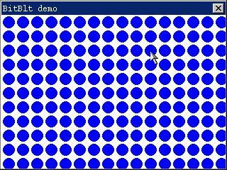
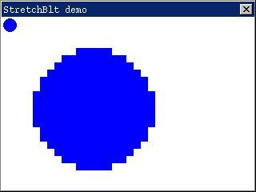

# Graphics Device Interfaces
Graphics Device Interfaces (`GDI`) is an important part of a GUI system. 
Through `GDI`, the GUI application can execute graphics output on the screen or
other display devices, including basic painting and text output. In this 
chapter and the two sequent chapters, we will describe in detail the important
concepts of `GDI`, the methods of graphics programming and the main `GDI`
functions of MiniGUI, and will illustrate the use of important functions with
example. 

## Architecture of MiniGUI Graphics System
### `GAL` and `GDI`
In order to separate the bottom layer graphics device and the top layer 
graphics interface so as to increase the portability of the MiniGUI graphics
system, MiniGUI introduces the concept of Graphics Abstract Layer (GAL). `GAL`
defines a group of abstract interfaces, which do not depend on any special
hardware, and all the top layer graphics operation are based on these abstract
interfaces. The bottom layer code used to realize this abstract interface is
called “graphics engine”, similar to the driver in an operating system. Using
`GAL`, MiniGUI can run on may existed graphics function libraries, and can be
readily port to other `POSIX` systems, only requiring to realize the new
graphics engine according to our abstract layer interfaces. For example, in a
system based on Linux, we can create general MiniGUI graphics engine based on
Linux `FrameBuffer` driver. In fact, the native graphics engine included in
MiniGUI 1.0.00 version is the graphics engine based on Linux `FrameBuffer`.
Generally speaking, all the embedded systems based on Linux will provide
`FrameBuffer` support so that the native graphics engine can be run on either a
common `PC` or a special embedded system.

### New `GAL`
MiniGUI version 1.1.0 makes much improvement to `GAL` and `GDI`, introducing 
new `GAL` and `GDI` interfaces and functions.

In the old `GAL` and `GDI` design, `GAL` can be considered as the graphics
driver of `GDI`, and many graphics operations, for example drawing point,
drawing line, filling rectangle, and bitmap operations, etc., are implemented
through the corresponding function of `GAL`. The biggest problem of this design
is `GDI` cannot be extended. For example, in order to add the ellipse drawing
function, it is needed to realize the ellipse painting function in each engine.
Moreover, it is the clipping region, which `GDI` manages, while `GAL` engine is
based on clipping rectangle. This method also causes that `GDI` function cannot
optimize the painting. Therefore, in the interface design of new `GAL` and 
`GDI`, we make restriction to `GAL` interface, and make many graphics input
functions which are previous completed by `GAL` engine to be completed in top
layer `GDI` functions. The function partition of New `GAL` (`NEWGAL`) and new
`GDI` (`NEWGDI`) are as follow:
- `NEWGAL` is responsible for initializing the video device, and managing the
use of video memory;
- `NEWGAL` is responsible for providing top layer `GDI` with linear video 
memory which is mapped into process address space, and other information such 
as palette;
- `NEWGAL` is responsible for realizing fast bit block operation, including
rectangle filling and blitting operation, etc., and using hardware acceleration
function in possible cases;
- `NEWGDI` function realizes advanced graphics function, including point, line,
circle, ellipse, arc, spine curve, and further advanced logical pen and logical
brush, and implements acceleration function by calling `NEWGAL` interface when
it is necessary;；
- Although some video devices also provide hardware support for the advanced
graphics functions mentioned above, however, considering other factors, these
hardware acceleration functions are not provided by `NEWGAL` interface, but are
all realized by software.。

Thus, the main painting function realized by `NEWGAL` is limited to bit block
operation, for example, rectangle filling and bit blitting operation; and other
advanced graphics functions are all realized by `NEWGDI` functions.

The interface of `NEWGAL` can effectively use video memory in video card, and
sufficiently use the hardware acceleration function. As we know, current video
cards commonly have more than 4MB video memory, and not all the video memory
will be used in a common display mode. Therefore, `NEWGAL` engine can manage
this unused video memory, and allocate it to the application. Thus, it is
realized to save the use of system memory on one hand, and sufficiently use the
acceleration function provided by video card so that it can perform fast bit
block operation between different video memory areas, i.e. blitting, on the
other hand.

When top layer `NEWGDI` interface is creating a memory `DC` device, it will
allocate memory from video memory, and will consider to use the system memory
when if it is not successful. Thus, if `NEWGAL` engine provides hardware
acceleration function, blitting operation (i.e., `GDI` function `BitBlt`) will
be run in the fastest speed between two different `DC` devices. Further, if the
hardware supports transparent or alpha blending function, the transparent or
alpha blending blitting operation will also be run in the fastest speed. 
`NEWGAL` interface can automatically use these hardware acceleration functions
according to the acceleration ability of the bottom layer engine. The hardware
acceleration abilities currently supported mainly include: rectangle filling,
normal blitting operation, transparent and alpha blending blitting operation,
etc. Certainly, if the hardware does not support these acceleration functions,
`NEWGAL` interface can also realize these functions by software. Currently, the
video cards which provide above hardware acceleration function through `NEWGAL`
and `FrameBuffer` include: Matrox, and 3DFX, etc.

`GDI` interface based on `NEWGAL` are partially compatible with old `GDI`, but
we provide some advanced functions based on `NEWGAL`. We will describe advanced
`GDI` interfaces based on `NEWGAL` in Chapter 15.

## Painting and Updating of a Window
### When to Paint a Window?
The application uses the window as the main output device, i.e., the MiniGUI
application paints only within its window.

MiniGUI manages the display output on the entire screen. If the window content
should be repaint due to actions such as window movement, MiniGUI puts a flag 
to the area in the window to be updated, and then sends a `MSG_PAINT` message 
to the corresponding window. The application must perform necessary painting to
update the window when receiving this message. If the window content changed is
caused by the application itself, the application can make a flag to the window
area to be updated, and generate a `MSG_PAINT` message.

If it is needed to paint within a window, the application needs to get the
device context handle of this window first. Most painting operations of the
application are executed during handling `MSG_PAINT`. At this time, the
application gets the device context handle by calling `BeginPaint` function. If
a certain operation of the application is required to respond immediately, for
example to handle the keyboard and mouse messages, it can execute painting
immediately without waiting `MSG_PAINT` message. The application can get the
device context handle by calling `GetDC` or `GetClientDC` when painting at 
other time.

### `MSG_PAINT` Message
Usually, the application executes the window painting when receiving 
`MSG_PAINT` message. If the change of the window influences the content in the
client area, or the invalid region of the window is not `NULL`, MiniGUI will
send a `MSG_PAINT` message to the corresponding window procedure.

When receiving `MSG_PAINT` message, the application should call `BeginPaint`
function to get the device context handle, and use it to call `GDI` functions 
to execute painting which is necessary for updating the client area. After
finishing painting, the application should call `EndPaint` function to release
the device context handle.

`BeginPaint` function is used to complete the preparing work before painting 
the window. It first gets the device context of the window client area by
calling `GetClientDC` function, and sets the clipping region of the device
context to be the current invalid region of the window. Only those regions,
which have, be changed need to be repainted, and any attempt to painting 
outside the clipping region will be clipped and will not be shown on the 
screen. In order not to influence the painting operation, `BeginPaint` function
hides the caret. Finally, `BeginPaint` clears the invalid region of the window
to prevent generating continually `MSG_PAINT` message, and then returns the
gotten device context handle.

`lParam` parameter of `MSG_PAINT` message is the pointer to the window invalid
region, and the application can use the information of the window invalid 
region to optimize painting, for example, limiting painting within the window
invalid region. If the application output is simple, you can paint in the whole
window and ignoring the invalid region, and let MiniGUI clips the unnecessary
painting outside the clipping region so that only the painting within the
invalid region is visible.

The application should call `EndPaint` function to end the whole painting
process after finishing painting. The main work of `EndPaint` function is to
call `ReleaseDC` function to release the device context gotten by `GetClientDC`
function; in addition, it shows the caret hidden by `BeginPaint` function.

### Valid and Invalid Region
Updating region (invalid region) is referred to the region in the window, which
is outdated or invalid and need to be repainted. MiniGUI generates `MSG_PAINT`
message for the application according to the region needed to be updated, and
the application can also generates `MSG_PAINT` message by setting invalid
region. 

The application can use `InvalidateRect` function to invalidate a certain
rectangular region of the window. The prototype of this function is as follows:

```cpp
BOOL GUIAPI InvalidateRect (HWND hWnd, const RECT* prc, BOOL bEraseBkgnd)
```
The meaning of the arguments is as follows:

```cpp
hWnd        the handle of the window needed to be updated
prc          pointer to invalid rectangle
bEraseBkgnd  whether to clear the window background
```

`InvalidateRect` function adds the specified rectangle to the updating region.
This function combines the specified rectangle and the previous updating region
of the application window, and then posts a `MSG_PAINT` message to the message
queue of this window.

If `bEraseBkgnd` is `TRUE`, the application window will receive a 
`MSG_ERASEBKGND` message, and the window procedure can handle this message and
automatically clear the window background. If the application does not handle
`MSG_ERASEBKGND` message, but passes it to `DefaultMainWinProc`, the default
handling of `MSG_ERASEBKGND` by MiniGUI is to erase the background with the
background color of the window.

The window background is referred to the color and style used to fill the 
client area before painting the window. The window background may cover the
previous content in the client area of the window, and make the program output
not disturbed by the existed content on the screen.

`lParam` parameter of `MSG_ERASEBKGND` message includes a `RECT` structure
pointer, indicating the rectangle, which should be erased. The application can
use this parameter to paint the window background. After finishing painting, 
the application can directly return zero without calling `DefaultMainWinProc`
for default message handling. The example related to handling `MSG_ERASEBKGND`
message can be referred to the related sections of Chapter 3 of this guide.

## Graphics Device Context
### Abstraction of Graphics Device
The application usually calls the painting primitives provided by the graphics
system to paint on a graphics context. The context is an object, which notes 
the graphics properties used by painting primitives. These properties usually
include: 
- Foreground color (pen), the pixel value or the image used when drawing lines.
- Background color or filling bitmap (brush), the pixel value or image used by
painting primitives when filling.
- Painting mode, which describes how the foreground color and the exited screen
color are combined. The usual option is to cover the existed screen content or
execute “XOR” bit logical operation with the painting color and the screen
color. `XOR` mode makes the painting object able to be reappeared through
repainting. 
- Filling mode, which describes how the background color or image and the 
screen color are combined. The usual option is transparent, i.e. ignoring the
background and reserving the existed screen content.
- Color mask, which is a bitmap, used to determine the style of the influence 
on the screen pixel by the painting operation.
- Pen style, the width, the cap shape, and the joint type when drawing line.
- Font, which usually corresponds to a group of bitmaps for a certain character
set, and is used by text output functions. Specifying the properties such as
size, style, and character set usually chooses font.
- Painting region, which is in concept a viewport with arbitrary size and
position mapped to the window. Changing its origin can move the viewport. The
system sometimes allows the viewport to be scaled.
- Clipping region. A painting primitive is valid only when it outputs within 
the clipping region. The output outside the clipping region will be clipped. 
The clipping region is mainly used in repainting window, and consists of the
invalid regions of the window. The application can adjust the clipping region.
- Current position, for example, you can use painting primitives such as 
`MoveTo` and `LineTo` to draw a line.

MiniGUI adopts the concept of graphics device context (DC) commonly used in GUI
systems such as Windows and X Window. Each graphics device context defines a
rectangular displaying output region and its related graphics properties in
graphics output device or memory. When calling the graphics output function, an
initialized graphics device context needs to be specified. That is to say, all
the painting operations must work in a certain graphics device context.

From the point view of a program, an initialized graphics device context 
defines a graphics device environment, determines some basic properties of the
graphics operations on it thereafter, and keeps these properties until they are
changed. These properties include: the line color, filling color, font color,
font shape, and so on. However, from the point view of GUI system, the meanings
presented by a graphics device context are more complex, and at least include
the following contents:
- Information of the device in which the device context is (display mode, color
depth, and layout of video memory, etc.);
- Information of the window presented by this device context and the clipping
region of this window by other windows (called “global clipping region” in
`MiniGUI`); 
- Basic operation functions of this context (point, line, polygon, filling,
block operations, etc.), and its context information;
- Local information set by the program (painting property, mapping 
relationship, and local clipping region, etc.).

When you want to paint on a graphics output device (e.g. the monitor screen),
you must first get a device context handle and take it as a parameter in `GDI`
function to identify the graphics device context to be used when painting.

The device context includes many current properties to determine how `GDI`
function works on the device. These properties make that the parameter
transferred to `GDI` function may only include the starting coordinate or size
information and need not include the other information required for displaying
an object, since this information is a part of the device context. When you 
want to change on of these properties, you can call a function which can change
the device context property, and `GDI` function calling for this device context
will use the changed property.

The device context is actually a data structure managed internally in `GDI`. 
The device context is related to the specified displaying device. Some values 
in the device context are graphics properties. These properties define some
special contents of the working status of some `GDI` painting functions. For
example, for `TextOut` function, the property of the device context determines
the text color, background color, the mapping manner of the x-coordinate and
y-coordinate to the window client area, and the font used for displaying the
text. 

When the program needs to paint, it must first get a device context handle. The
device context handle is a value presenting a device context, and the `GDI`
functions use this handle.

### Getting and Releasing of Device Context
In MiniGUI, all the functions related to painting need a device context. When
the program needs to paint, it must first get a device context handle. When the
program finishes painting, it must release the device context handle. The
program must get and release the handle during handling a single message. That
is to say, if the program gets a device context handle when handing a message,
it must release this device context handle before it finishes handling this
message and quits the window procedure function.

One of the commonly used methods for getting and releasing the device context 
is through `BeginPaint` and `EndPaint` functions. The prototypes of these two
functions are as follow (minigui/window.h):

```cpp
HDC GUIAPI BeginPaint(HWND hWnd);
void GUIAPI EndPaint(HWND hWnd, HDC hdc);
```
It should be noted that these two functions can only be called when handling
`MSG_PAINT` message. Then handling of `MSG_PAINT` message has usually the
following form:

```cpp
MSG_PAINT:
    HDC hdc = BeginPaint (hWnd);
    /* use GDI functions to piant */
    EndPaint (hWnd, hdc);
    return 0;
}
```

`BeginPaint` takes the window handle `hWnd` according to the window procedure
function as its argument, and returns a device context handle. Then `GDI`
function can use this device context handle for graphics operations.

In a typical graphics user interface environment (including `MiniGUI`), the
application is usually paint text and graphics in the client area of the 
window. However, the graphics system does not ensure the painting content in 
the client area be kept all the time. If the client area of this program window
is overlaid by another window, the graphics system will not reserve the content
of the overlaid window region and leave repainting of the window to the
application. When needing to recover some contents of the window, the graphics
system usually informs the program to update this part of client area. MiniGUI
informs the application to perform the painting operation of the window client
area by sending `MSG_PAINT` message to the application. If program consider it
is necessary to update the content of client area, it can generate a 
`MSG_PAINT` message on its own, so that client area is repainted。

Generally speaking, in the following case, window procedure will receive a
`MSG_PAINT` message:
- When the user moves or shows a window, MiniGUI sends `MSG_PAINT` message to
the previously hidden window.
- When the program uses `InvalidateRect` function to update the invalid region
of the window, a `MSG_PAINT` message will be generated;
- The program calls `UpdateWindow` function to redraw the window;
- The dialog box or message box over a window is destroyed;
- Pull down or popup menu is disappeared.

In some cases, MiniGUI saves some overlaid displaying area, and recovers them
when necessary, for example the mouse cursor moving.

In usual cases, the window procedure function needs only to update a part of 
the client area. For example, a dialog box overlays only a part of the client
area of a window; when the dialog box destroyed, redrawing of the part of the
client area previously overlaid by the dialog box is needed. The part of the
client area needed to be repainted called “invalid region”.

MiniGUI gets the client area device context through `GetClientDC` in 
`BeginPaint` function, and then selects the current invalid region of the 
window to be the clipping region of the window. While `EndPaint` function 
clears the invalid region of the window, and release the device context.

Because `BeginPaint` function selects the invalid region of the window to the
device context, you can improve the handling efficiency of `MSG_PAINT` through
some necessary optimizations. For example, if a certain program wants fill some
rectangles in the window client area; it can handle as follows in `MSG_PAINT`
function: 

```cpp
MSG_PAINT:
{
    HDC hdc = BeginPaint (hWnd);

    for (j = 0; j < 10; j ++) {
        if (RectVisible  (hdc, rcs + j)) {
            FillBox (hdc, rcs[j].left, rcs[j].top, rcs [j].right, rcs [j].bottom);
        }
    }

    EndPaint (hWnd, hdc);
    return 0;
}
```
Thereby unnecessary redrawing operation can be avoided, and the painting
efficiency is improved.

The device context can be gotten and released through `GetClientDC` and
`ReleaseDC` function. The device context gotten by `GetDC` is for the whole
window, while the device context gotten `GetClientDC` is for the client area of
the window. That is, for the device context gotten by the former function, its
origin is located in upper-left corner of the window, and its output is clipped
within the window area. For the device context gotten by the latter function,
its origin is located in upper-left corner of the window client area, and its
output is limited within the range of the window client area. `GetSubDC`
function can get the son `DC` of pointed `DC`, and the son `DC` includes only a
limited area of the pointed `DC`. Following are the prototypes of these four
functions (minigui/gdi.h):

```cpp
HDC GUIAPI GetDC (HWND hwnd);
HDC GUIAPI GetSubDC (HDC hdc, int off_x, int off_y, int width, int height);
 HDC GUIAPI GetClientDC (HWND hwnd);
 void GUIAPI ReleaseDC (HDC hdc);
```
`GetDC`, `GetSubDC` and `GetClientDC` get a currently unused device context 
form some `DCs` reserved by the system. Therefore, the following two points
should be noted:
- After finishing using a device context gotten by `GetDC`, `GetSubDC` or
`GetClientDC`, you should release it as soon as possible by calling 
`ReleaseDC`. 
- Avoid using multiple device contexts at the same time, and avoid calling
`GetDC`, `GetSubDC` and `GetClientDC` in a recursive function.

For programming convenience and improving the painting efficiency, MiniGUI also
provides functions to set up private device context. The private device context
is valid in the whole life cycle of the window, thereby avoiding the getting 
and releasing process. The prototypes of these functions are as follow:

```cpp
 HDC GUIAPI CreatePrivateDC (HWND hwnd);
 HDC GUIAPI CreatePrivateSubDC(HDC hdc, int off_x, int off_y, int width, int height);
 HDC GUIAPI CreatePrivateClientDC (HWND hwnd);
 HDC GUIAPI GetPrivateClientDC (HWND hwnd);
 void GUIAPI DeletePrivateDC (HDC hdc);
```

When creating a main window, if `WS_EX_USEPRIVATEDC` style is specified in the
extended style of the main window, `CreateMainWindow` function will
automatically set up a private device context for the window client area. You
can get a device context through `GetPrivateClientDC` function. For a control,
if the control class has `CS_OWNDC` property, all the controls belonging to 
this control class will automatically set up a private device context.
`DeletePrivateDC` function is used to delete the private device context. For 
the two cases above, the system will automatically call `DeletePrivateDC`
function when destroy the window.

### Saving and Restoring of Device Context
The device context can be saved and restored through `SaveDC` and `RestoreDC`
function. The prototypes of these two functions are as follow (minigui/gdi.h):

```cpp
int GUIAPI SaveDC (HDC hdc);
BOOL GUIAPI RestoreDC (HDC hdc, int saved_dc);
```

### Device Context in Memory
MiniGUI also provides the creating and destroying function of the device 
context in memory. Using the memory device context, you can set up a region
similar to the video memory in the system memory, perform painting operations 
in this region, and copy to the video memory when finishing painting. There are
many advantages using this painting method, e.g. fast speed, reducing the
blinking phenomenon caused by direct operation on the video memory, etc. The
prototypes of the function used to create and destroy the memory device context
are as follow (minigui/gdi.h):

```cpp
HDC GUIAPI CreateCompatibleDCEx (HDC hdc, int width, int height);
#define CreateCompatibleDC(hdc) CreateCompatibleDCEx(hdc, 0, 0)

void GUIAPI DeleteMemDC (HDC mem_dc);
#define DeleteCompatibleDC(hdc) DeleteMemDC(hdc)
```

In order to realize the special effects like Apple, MiniGUI add a dual buffer
function of main window. When creating Main window, if the extending style of
main window is pointing `WS_EX_AUTOSECONDARYDC` style, MiniGUI will call
`CreateSecondaryDC` function to create memory `DC` Compatible to `DC` of main
window, then set memory `DC` into main window by `SetSecondaryDC` function to
realize types of UI special effects. When the main window with
`WS_EX_AUTOSECONDARYDC` style is being distroyed, `DeleteSecondaryDC` function
will be called to release memory `DC`. The prototypes of the functions are as
following: 

```cpp
HDC GUIAPI CreateSecondaryDC (HWND hwnd);
HDC GUIAPI SetSecondaryDC (HWND hwnd, HDC secondary_dc, ON_UPDATE_SECONDARYDC on_update_secondarydc);
HDC GUIAPI GetSecondaryDC (HWND hwnd);
HDC GUIAPI GetSecondaryClientDC (HWND hwnd);
void GUIAPI ReleaseSecondaryDC (HWND hwnd, HDC hdc);
void GUIAPI DeleteSecondaryDC (HWND hwnd);
```
Above functions will be descripted in chapter 11, and not descripted here.

### Screen Device Context
MiniGUI sets up a global screen device context after started up. This `DC` is
for the whole screen, and has no predefined clipping region. In some
applications, you can use directly this device context to paint, which may
increase the paint efficiency remarkably. In MiniGUI, the screen device context
is identified by `HDC_SCREEN`, and need no getting and releasing operations for
this `DC`.

## Mapping Mode and Coordinate Space
### Mapping Mode
Once the Device Context (DC) has been initialized, the origin of the 
coordinates is usually the upper-left corner of the output rectangle, while the
x coordinate axis is horizontal right and the y coordinate axis is vertical
downward, with both using pixel as unit. Usually, in MiniGUI, the default unit
used to draw graphics is pixel, however, we can choose other ways by changing
`GDI` mapping mode. Mapping mode offers the measurement unit that can be used 
to convert page space (logical coordinate) into device space (device
coordinate). 

The mapping mode of `GDI` is a device context property that almost influences
the graphics result in any client area. There are four other device context
properties that are closely related to the mapping mode: window origin, window
scope, viewport origin, and viewport scope.

Most `GDI` functions use coordinate value as arguments, which are called
“logical coordinates”. Before drawing something, MiniGUI firstly converts
“logical coordinates” into “device coordinates”, that is, pixel. The mapping
mode, window and viewport origin, and window and viewport scope control such
conversion. In addition, mapping mode also provides the direction of both x and
y coordinate axis; in other words, it helps to confirm whether the x value is
increasing or decreasing while you move to the left or right of the screen, so
is the y value while the screen is moved up and down.

At present MiniGUI only supports two types of mapping modes:
- `MM_TEXT`
- Each logical unit is mapped as a device pixel. X coordinate increases
progressively from left to right, while y coordinates increases progressively
from top to bottom.
- `MM_ANISOTROPIC`
- Logical unit is mapped as arbitrary device space unit; the proportion of the
coordinate scale is also arbitrary. Using `SetWindowExt` and `SetViewPortExt` 
to define unit, direction and scale.

The default mapping mode is `MM_TEXT`. Under this mapping mode, the logical
coordinate is equal to the device coordinate. That is, the default unit of
drawing graphics is pixel.

Changing mapping mode helps us to avoid scaling by ourselves; it is very
convenient in some conditions. You can use `SetMapMode` function to set your
mapping mode:

```cpp
Uint32 GUIAPI SetDCAttr (HDC hdc, int attr, Uint32 value);

#define SetMapMode(hdc, mapmode)        \
                SetDCAttr (hdc, DC_ATTR_MAP_MODE, (DWORD)mapmode)
```

The argument mapmode is one of the two mapping modes above. You can also use
`GetMapMode` function to get current mapping mode:

```cpp
mapmode = GetMapMode (hdc);
```

### Viewport and Window
Mapping modes are used to define the mapping from “window” (logical 
coordinates) to “viewport” (device coordinates). “Window” is a rectangular area
in the page coordinate space, while viewport is a rectangular area of the 
device coordinate space. It is “window” that determines which part of the
geometric model of the page space should be displayed, while “viewport”
determines where to draw. The scale between them determines the zoom of the
coordinates. Viewport is pixel-based (device coordinates), while window is
logical-based. 

The following formulas can be used to convert between page space (window)
coordinates and device space (viewport) coordinates:

```cpp
xViewport = ((xWindow - xWinOrg) * xViewExt / xWinExt) + xViewOrg
      yViewport = ((yWindow - yWinOrg) * yViewExt / yWinExt) + yViewOrg
```
- `xViewport`, `yViewPort` the x value, y value in device unit
- `xWindow`, `yWindow` the x value, y value in logical unit (page space unit)
- `xWinOrg`, `yWinOrg` window x origin, window y origin
- `xViewOrg`, `yViewOrg` viewport x origin, viewport y origin
- `xWinExt`, `yWinExt` window x extent, window y extent
- `xViewExt`, `yViewExt` viewport x extent, viewport y extent

The transfer principal of above formulas is: the scale of certain distance 
value in device space and extent value of coordinates should be equal to the
scale of page space, in other words, the logical origin (xWinOrg, `yWinOrg`) is
always mapped as device origin (xViewOrg, `yViewOrg`).

These two formulas use the origin and extent of both window and viewport. We 
can see from this that the scale between the extent of viewport and the extent
of window is the conversion factor.

MiniGUI provides two functions to realize the conversion between device
coordinates and logical coordinates. `LPtoDP` is used to convert from logical
coordinates to device coordinates, while `DPtoLP` is used to convert from 
device coordinates to logical coordinates:

```cpp
void GUIAPI DPtoLP (HDC hdc, POINT* pPt);
void GUIAPI LPtoDP (HDC hdc, POINT* pPt);
```
This conversion relies on the mapping mode of device context hdc as well as the
origin and extent of the window and the viewport. Those x and y coordinates
included in the structure `POINT` `pPt` will be converted into other 
coordinates in another coordinate system.

In the `MiniGUI`’s source codes (src/newgdi/coor.c), the conversion between
`LPtoDP` and `DPtoLP` are implemented as follow. It can be seen that the
coordinate conversion between them is based on the formulas mentioned above.

```cpp
void GUIAPI LPtoDP(HDC hdc, POINT* pPt)
{
    PDC pdc;

    pdc = dc_HDC2PDC(hdc);

    if (pdc->mapmode = MM_TEXT) {
        pPt->x = (pPt->x - pdc->WindowOrig.x)
             * pdc->ViewExtent.x / pdc->WindowExtent.x
             + pdc->ViewOrig.x;

        pPt->y = (pPt->y - pdc->WindowOrig.y)
             * pdc->ViewExtent.y / pdc->WindowExtent.y
             + pdc->ViewOrig.y;
    }
}

void GUIAPI DPtoLP (HDC hdc, POINT* pPt)
{
    PDC pdc;

    pdc = dc_HDC2PDC (hdc);

    if (pdc->mapmode = MM_TEXT) {
        pPt->x = (pPt->x - pdc->ViewOrig.x)
             * pdc->WindowExtent.x / pdc->ViewExtent.x
             + pdc->WindowOrig.x;

        pPt->y = (pPt->y - pdc->ViewOrig.y)
             * pdc->WindowExtent.y / pdc->ViewExtent.y
             + pdc->WindowOrig.y;
    }
}
```
In addition, the function `LPtoSP` and function `SPtoLP` can be used to convert
between logical coordinates and screen coordinates:

```cpp
void GUIAPI SPtoLP(HDC hdc, POINT* pPt);
void GUIAPI LPtoSP(HDC hdc, POINT* pPt);
```

### Conversion of Device Coordinates
The mapping mode determines how MiniGUI maps logical coordinates into device
coordinates. Device coordinates use pixel as unit, the value of x coordinate
progressively increase from left to right, while the value of coordinate
progressively increase from top to bottom.. There are three types of device
coordinates in MiniGUI: screen coordinates, window coordinates, and client area
coordinates. Usually device coordinates rely on the type of chosen device
context to choose.

The (0, 0) point in screen coordinates is on the upper-left corner of the whole
screen. When we need to use the entire screen, we can do it according to the
screen coordinates. Screen coordinates are usually used in the functions that
are irrelevant to window or functions that are tightly related to the screen,
such as `GetCursorPos` and `SetCursorPos`. If the device context used by `GDI`
functions is `HDC_SCREEN`, the logical coordinates will be mapped as screen
coordinates. 

The coordinates in the window coordinates are based on entire window, including
window border, caption bar, menu bar and scroll bar, in which the origin of
window coordinates is the upper-left corner of the window. While using the
device context handle returned by `GetDC`, the logical coordinates passed to 
`GDI` functions will be converted into window coordinates.

The point (0, 0) of the client area coordinates is the upper-left corner of 
this area. When we use the device context handle returned `GetClientDC` or
`BeginPaint`, the logical coordinates passed to `GDI` functions will be
converted to the client area coordinates.

When programming we need to know on which coordinate system the coordinates or
position is based, as the meaning of position may be different under different
situation. Some time we need get the coordinates in another coordinate system.
MiniGUI provides functions that realize the conversion among those three device
coordinate systems:

```cpp
void GUIAPI WindowToScreen (HWND hWnd, int* x, int* y);
void GUIAPI ScreenToWindow (HWND hWnd, int* x, int* y);
void GUIAPI ClientToScreen (HWND hWnd, int* x, int* y);
void GUIAPI ScreenToClient (HWND hWnd, int* x, int* y);
```
`WindowToScreen` converts window coordinates into screen coordinates, while
`ScreenToWindow` converts screen coordinates to window coordinates. The
converted value is stored in the original place. `ClientToScreen` converts
client coordinates into screen coordinates, while `ScreenToClient` converts
screen coordinates to client coordinates.

### The Deviation and Zoom of Coordinate System
MiniGUI provides a set of functions that can be used to realize the deviation,
zoom of the coordinate system. The prototypes of these functions are as follow:

```cpp
void GUIAPI GetViewportExt(HDC hdc, POINT* pPt);
void GUIAPI GetViewportOrg(HDC hdc, POINT* pPt);
void GUIAPI GetWindowExt(HDC hdc, POINT* pPt);
void GUIAPI GetWindowOrg(HDC hdc, POINT* pPt);
void GUIAPI SetViewportExt(HDC hdc, POINT* pPt);
void GUIAPI SetViewportOrg(HDC hdc, POINT* pPt);
void GUIAPI SetWindowExt(HDC hdc, POINT* pPt);
void GUIAPI SetWindowOrg(HDC hdc, POINT* pPt);
```
Get-functions are used to get the origin and extent of the window and/or the
viewport, the value is stored in `POINT` structure `pPt`; Set-functions use the
value of `pPt` to set the origin and the extent of the window and/or the
viewport. 

## Rectangle and Region Operations
### Rectangle Operations
Rectangle usually refers to a rectangular region on the screen. It is defined 
in MiniGUI as follows:
```cpp
typedef struct _RECT
{
    int left;
    int top;
    int right;
    int bottom;
} RECT;
```
In short, rectangle is a data structure used to represent a rectangular region
on the screen. It defines the x coordinate and y coordinate of the upper-left
corner of the rectangle (left and top), as well as the x coordinate and y
coordinate of the lower-bottom corner of the rectangle. It is necessary to
notice that the right and bottom borders are not included by `MiniGUI`’s
rectangle. For example, if we want to figure a scan line on the screen, we
should use
```cpp
RECT rc = {x, y, x + w , y + 1};
```
to represent it. In that x is the jumping-off point while y is the vertical
place of that scan line, and w is the width of that scan line.

MiniGUI provides a group of functions, which can operate on `RECT` objects:
- `SetRect` assigns each parameter of a `RETC` object.
- `SetRectEmpty` sets a `RECT` object to be empty. In MiniGUI, the empty
rectangle is defined as a rectangle with its width or height as zero.
- `IsRectEmpty` determines if the given `RECT` object is empty.
- `NormalizeRect` normalizes a given rectangle. The rectangle should meet the
requirement of right > left and bottom > top. Those rectangles that meet the
above requirements are called normalized rectangles. This function can 
normalize any rectangle.
- `CopyRect` copies between two rectangles.
- `EqualRect` determines if two `RECT` objects are equal, that is, if the all
parameters are equal.
- `IntersectRect` gets the intersection of two `RECT` objects. If there is no
intersection between those two rectangles, the function will return to `FALSE`.
- `DoesIntersect` determines if the two rectangles are intersected.
- `IsCovered` determines if `RECT` A completely overlay `RECT` B, that is, if
`RECT` B is the true subset of `RECT` A.
- `UnionRect` gets the union of two rectangles. If there is no union, the
function will return `FALSE`; any point included in the union should also 
belong to either of the rectangles.
- `GetBoundRect` gets the union of two rectangles. If there is no union, the
function will return `FALSE`; any point included in the union should also 
belong to either of the rectangles.
- `SubstractRect` subtracts one rectangle from another one. Such subtraction 
may result in four non-intersected rectangles. This function will return the
number of the result rectangles.
- `OffsetRect` offsets the given `RECT` object.
- `InflateRect` inflates the given `RECT` object. The width and height of the
inflated rectangle will be twice of the given inflation value.
- `InflateRectToPt` inflates the given `RECT` object to a given point.
- `PtInRect` determines if the given point lies in the given `RECT` object.

MiniGUI also provides two groups of macro to get the width and height of `RECT`
object. one macro is for inputting pointers of `RECT`, and the other is for
inputing variables of `RECT`.
- #define `RECTWP(prc`) ((prc)->right - (prc)->left)
- #define `RECTHP(prc`) ((prc)->bottom - (prc)->top)
- #define `RECTW(rc`) ((rc).right - (rc).left)
- #define `RECTH(rc`) ((rc).bottom - (rc).top)

### Region Operations
Region is a scope on the screen, which is defined as a collection of
non-intersected rectangles and represented as a linked list. Region can be used
to represent the clipped region, invalid region, and visible region. In 
MiniGUI, the definition of region equals to the definition of clipped region,
which is defined as follows (minigui/gdi.h):

```cpp
typedef struct _CLIPRECT
{
    RECT rc;
    struct _CLIPRECT* next;
#ifdef _USE_NEWGAL
    struct _CLIPRECT* prev;
#endif
} CLIPRECT;
typedef CLIPRECT* PCLIPRECT;

typedef struct _CLIPRGN
{
#ifdef _USE_NEWGAL
    BYTE            type;        /* type of region */
    BYTE            reserved[3];
#endif
    RECT            rcBound;
    PCLIPRECT       head;
    PCLIPRECT       tail;
    PBLOCKHEAP      heap;
} CLIPRGN;
```

Each clipped region has one `BLOCKHEAP` member, which is the private heap of
`RECT` objects used by the clipped region. Before using a region object, we
should firstly build up a `BLOCKHEAP` object, and then initialize the region
object. Showed as follows:

```cpp
static BLOCKHEAP sg_MyFreeClipRectList;

...

    CLIPRGN my_region

    InitFreeClipRectList (&sg_MyFreeClipRectList, 20);
    InitClipRgn (&my_regioni, &sg_MyFreeClipRectList);
```
When being actually used, multiple regions can share one `BLOCKHEAP` object.

Following operations can be done after initializing the region object:
- `SetClipRgn` sets only one rectangle in the region;
- `ClipRgnCopy` copies one region to another;
- `ClipRgnIntersect` gets the intersection of two regions;
- `GetClipRgnBoundRect` gets the bounding box of the region;
- `IsEmptyClipRgn` determines if the region is empty, that is, if the region
includes any rectangle;
- `EmptyClipRgn` releases the rectangles in the region and empty the region;
- `AddClipRect` adds a rectangle to the region, but it does not determine if 
the region intersects with the rectangle;
- `IntersectClipRect` gets the intersection of region and given rectangle;
- `SubtractClipRect` subtracts the given rectangle from the region.
- `CreateClipRgn` creates an empty region.
- `DestroyClipRgn` clears and destroys a region.

The operations of rectangles and regions form the main algorithms of window
management. It is very important in GUI programming, as it is also one of the
basic algorithms of advanced `GDI` function.

## Basic Graphics Drawing
### Basic Drawing Attributes
Before understanding basic drawing functions, we need to know basic drawing
attributes. In the current MiniGUI version, the drawing attributes include pen
color, brush color, text background mode, text color, `TAB` width, and so on.
The operation functions for these attributes are listed in Table 1.


Table 1 Basic drawing attributes and operation function

| *Drawing Attributes*|*Operations*|*Effected `GDI` Functions*|
|---------------------|------------|--------------------------|
| Pen color |GetPenColor/SetPenColor |LineTo、Circle、Rectangle|
| Brush color |GetBrushColor/SetBrushColor |FillBox|
| Text background mode |GetBkMode/SetBkMode |TextOut、DrawText|
| Text color |GetTextColor/SetTextColor |TextOut、DrawText|
| `TAB` width |GetTabStop/SetTabStop |TextOut、DrawText|


The current MiniGUI version also defines some functions for brush and pen. We
will discuss the functions in Chapter 15.

### Basic Drawing Functions
In MiniGUI, basic drawing functions include such basic functions such as
`SetPixel`, `LineTo`, Circle, and so on. The prototypes are defined as follow:

```cpp
void GUIAPI SetPixel (HDC hdc, int x, int y, gal_pixel c);
  void GUIAPI SetPixelRGB (HDC hdc, int x, int y, int r, int g, int b);
  gal_pixel GUIAPI GetPixel (HDC hdc, int x, int y);
  void GUIAPI GetPixelRGB (HDC hdc, int x, int y, int* r, int* g, int* b);
  gal_pixel GUIAPI RGB2Pixel (HDC hdc, int r, int g, int b);
  
  void GUIAPI LineTo (HDC hdc, int x, int y);
  void GUIAPI MoveTo (HDC hdc, int x, int y);
  
  void GUIAPI Circle (HDC hdc, int x, int y, int r);
  void GUIAPI Rectangle (HDC hdc, int x0, int y0, int x1, int y1);
```
We need to differentiate two basic conceptions: pixel value and `RGB` value. 
`RGB` is a way to represent color according to the different proportion of
tricolor. Usually, the red, blue and green can get any value between 0 and 255,
so there are 256x256x256 different colors. However, in video memory, the color
displayed on the screen is not represented by `RGB`; it is represented by pixel
value. The scope of pixel value varies according to the difference of video
mode. In 16-color mode, the scope is in [0, 15]; while in 256-color mode, the
scope is [0, 255]; in 16bit-color mode, the scope is [0, 2^16 - 1]. Here the
number of bits of one mode refers to the number of bits per pixel.

When setting the color of a pixel in MiniGUI, you can directly use pixel value
(SetPixel) or `SetPixelRGB`. The function `RGB2Pixel` can convert `RGB` value
into pixel value.

### Clipping Region Operations
Clipping can be done when using device context to draw. MiniGUI provides
following functions to clip the given device context (minigui/gdi.h):

```cpp
 // Clipping support
  void GUIAPI ExcludeClipRect (HDC hdc, int left, int top, 
                              int right, int bottom);
  void GUIAPI IncludeClipRect (HDC hdc, int left, int top, 
                                int right, int bottom);
  void GUIAPI ClipRectIntersect (HDC hdc, const RECT* prc);
  void GUIAPI SelectClipRect (HDC hdc, const RECT* prc);
  void GUIAPI SelectClipRegion (HDC hdc, const CLIPRGN* pRgn);
  void GUIAPI GetBoundsRect (HDC hdc, RECT* pRect);
  BOOL GUIAPI PtVisible (HDC hdc, const POINT* pPt);
  BOOL GUIAPI RectVisible (HDC hdc, const RECT* pRect);
```
`ExcludeClipRect` is used to exclude the given rectangle region from current
visible region, then the visible region will be reduced; `IncludeClipRect` adds
a rectangle region into the visible region of device context, then the visible
region will be extended; `ClipRectIntersect` sets the visible region of device
context as the intersection of the existed region and the given rectangle;
`SelectClipRect` resets the visible region of device context as the given
rectangle region; `SelectClipRegion` sets the visible region of device context
as the given region; `GetBoundsRect` is used to get the minimum bounding
rectangle of the visible region; `PtVisible` and `RectVisible` determine if the
given point or rectangle is visible, that is, if they are included or partly
included in the visible region.

## Text and Font
It is necessary for any GUI system to provide the support for font and charset.
However, different GUI has its different way to implement the multi-font and
multi-charset. For example, `QT/Embedded` uses `UNICODE`, which is a popular
solution for most general operating systems. However, it is not acceptable for
some embedded systems as the conversion between `UNICODE` and other charsets
will increase the size of GUI system.

The MiniGUI does not use `UNICODE` to support multiple charsets; instead, it
uses a different policy to handle multiple charsets. For a certain charset,
MiniGUI uses the same internal encoding presentation as the charset standard.
After using a series of abstract interfaces, MiniGUI provides a consistent
analysis interface to multiple charsets. This interface can be used in font
module; also can be used to analysis multi-bytes string. When adding support 
for a new charset (encoding), the only thing need to do is to provide an
interface to the charset (encoding). So far MiniGUI has been able to support
`ISO8859-x` single byte charsets, and some multi-bytes charsets, including
`GB2312`, `GBK`, `GB18030`, `BIG5`, `EUCKR`, Shift-JIS, `EUCJP`, Unicode and so
on. 

Similar to charset, MiniGUI also defines a series of abstract interfaces to
font. When adding support for a new font type, we just need to realize the
interface of such type of font. So far MiniGUI has got the support of `RBF` and
`VBF`, `QPF`, `TrueType` and Adobe Type1.

Based on the abstract interface of multi-font and multi-charset, MiniGUI
provides a consistent interface to applications through logical font.

We will discuss the interfaces about text and font in Chapter 14 of this guide.

## Bitmap Operations
Bitmap operation function is very important in `GDI` function of MiniGUI. In
fact, most advanced drawing operation functions are based on the bitmap
operations, for example, the text output functions.

The main bitmap operations of MiniGUI are listed below (minigui/gdi.h):

```cpp
void GUIAPI FillBox (HDC hdc, int x, int y, int w, int h);
    void GUIAPI FillBoxWithBitmap (HDC hdc, int x, int y, int w, int h,
                                PBITMAP pBitmap);
    void GUIAPI FillBoxWithBitmapPart (HDC hdc, int x, int y, int w, int h,
                                int bw, int bh, PBITMAP pBitmap, int xo, int yo);
  
    void GUIAPI BitBlt (HDC hsdc, int sx, int sy, int sw, int sh, 
                     HDC hddc, int dx, int dy, DWORD dwRop);
    void GUIAPI StretchBlt (HDC hsdc, int sx, int sy, int sw, int sh, 
                         HDC hddc, int dx, int dy, int dw, int dh, DWORD dwRop);
```

### Concept of Bitmap
Most graphical output devices are raster operation devices, such as printer and
video display. Raster operation devices use dispersed pixel point to indicate
the image being output. Bitmap is a two-dimension array, which records the 
pixel value of every pixel point in that image. In bitmap, each pixel value
points out the color of that point. For monochrome bitmap, only one bit is
needed for each pixel; gray bitmap and multicolor bitmap need multiple bits to
present the value of color for the pixel. Bitmap is always used to indicate
complicated image of the real world.

Bitmap has two main disadvantages. First, bitmap is easy to be influenced by 
the device independence, for example, resolution and color. Bitmap always
suggests certain display resolution and image aspect ratio. Bitmap can be 
zoomed in and zoomed out, but during this process certain rows and columns are
copied or deleted, which will result in image distortion. The second
disadvantage of bitmap is that it needs huge storage space. The storage space 
of bitmap is determined by the size of bitmap and the number of the color. For
instance, to indicate 320x240 needs at least 320x240x2=150KB storage space on a
16-bit color screen, while to store 1024x768 needs more than 2MB on a 24
bit-color screen.

Bitmap is rectangular, the height and width of the image use pixel as unit.
Bitmap is always stored in memory and ranked by rows. In each row, the pixel
starts from left to right, in turn be stored.

### Bitmap Color
The color of bitmap usually uses bit-count of pixel value to measure. This 
value is called color depth of the bitmap, or bit-count, or bits per pixel
(bpp). Each pixel in the bitmap has same color bit-count.

The so-call monochrome bitmap is the one that the color value of each pixel is
stored in one bit. The color value of each pixel in monochrome bitmap is 0 or 
1, respectively represents black and white. The color value of each pixel 
stored by four bits can demonstrate 16 kinds of color, the one stored by eight
can demonstrate 256 while the one saved by 16 can demonstrate 65536 kinds of
color. 

Two of the important display hardware in `PC` is video adapter and monitor. The
video adapter is a circuitry board inserted in the main board, which consists 
of registers, memory (RAM, `ROM` and `BIOS`), and control circuitry. Most
graphics video adapters are based on `VGA` model. For most embedded devices, 
the display hardware is always `LCD` and its `LCD` controller.

Both `PC` display adapter and `LCD` controller have a video `RAM` (`VRAM`) to
represent image on the screen. `VRAM` have to be big enough to manage all 
pixels on the screen. The programrs change the screen display by directly or
indirectly fetch the data stored in `VRAM`. Most video hardware provides the
ability of visiting `VRAM` from `CPU` address and data `BUS`. It equals to map
`VRAM` to `CPU` address space, and increase the visiting speed.

`PC` monitor and `LCD` are all raster operation devices. Each point on the
screen is a pixel and thus the display screen looks like a pixel matrix. `VRAM`
stores data according to video mode. It records the color value of each pixel 
on the display screen. As we know, the computer uses binary ways to store data,
in which 0 and 1 are used to represent each bit. As for monochrome video mode,
the color value of one pixel point only needs one bit of `VRAM` to represent, 
if this bit is 1, it means the pixel is light. As for multicolor video mode, 
the color information of the pixel needs more bytes or bits to represent.
16-color video mode needs four bits to store one color value; 256-color mode
needs 8 bits (1 byte) while 16-bit true color video mode needs two bytes to
store the color value for one pixel.

When using 16-color and 256-color video mode, a color table is needed to
translate the `RGB` color data into pixel value of video device. The so-called
color table is also called palette. When displaying a pixel on the screen, the
video adapter will first read the data stored in video memory and get a group 
of `RGB` color information, then, adjust radiation tube of the display, then, a
point will be showed on the corresponding place of the screen. When all points
in the display memory have been showed on the screen, the image is formed. You
can also change the correspondent `RGB` value of the color table to get the
self-defined color according to your needs. When video mode attains a 
true-color level, the palette becomes meaningless, as the information stored in
video memory is already `RGB` information of pixel. So the pallet is no longer
needed in true-color mode.

The color used for screen display usually uses `RGB` color system, in which one
color is determined by the value of red, green, and blue. Different display
device has different color scope; so a certain color may not be displayed on 
all devices. Most graphic systems define their own color standard that is
irrelevant to the device.

The display of color is very complicated and always depends on the actual
display ability of display device and the requirement of applications.
Application may use monochrome and fixed palette, adjustable palette or true
color, while display system will try to display the closest color in order to
meet the requirement of application. True color display device can simulate a
palette by mapping all color during the drawing process. The palette device 
also can simulate true color by setting palette. The palette device provides a
color table to disperse color scope, and then maps the needed color to the
closest color. On a small palette display device, a way named dithering can be
used to increase the displayed color scope. The palette that can be modified
needs support of hardware.

The video adapter of true color uses 16-bits or 24-bits per pixel. When using
16-bit, 6 bits will be assigned to green, red and blue get 5 bits each, it is
totally 65536 kinds of color; when only using 15 bits, red, green and blue get 
5 bits each, it is 32768 kinds of color. Usually 16-bit color is called high
color, sometime also called true color. 24-bit is called true color as it can
indicate millions of color and has reached the limitation that human eyes are
able to discern.

### Device-Dependent Bitmap and Device-Independent Bitmap
Device-dependent bitmap means the one that includes pixel matching the video
mode of a given device context, not the bitmap that is independent to video
device. In MiniGUI, these two bitmap types are represented respectively by
`BITMAP` and `MYBITMAP` data structures, showed as follow (minigui/gdi.h):

```cpp
#ifdef _USE_NEWGAL

#define BMP_TYPE_NORMAL         0x00
#define BMP_TYPE_RLE            0x01
#define BMP_TYPE_ALPHA          0x02
#define BMP_TYPE_ALPHACHANNEL   0x04
#define BMP_TYPE_COLORKEY       0x10
#define BMP_TYPE_PRIV_PIXEL     0x20

/** Expanded device-dependent bitmap structure. */
struct _BITMAP
{
    /**
     * Bitmap types, can be OR'ed by the following values:
     *  - BMP_TYPE_NORMAL\n
     *    A nomal bitmap, without alpha and color key.
     *  - BMP_TYPE_RLE\n
     *    A RLE encoded bitmap, not used so far.
     *  - BMP_TYPE_ALPHA\n
     *    Per-pixel alpha in the bitmap.
     *  - BMP_TYPE_ALPHACHANNEL\n
     *    The \a bmAlpha is a valid alpha channel value.
     *  - BMP_TYPE_COLORKEY\n
     *    The \a bmColorKey is a valid color key value.
     *  - BMP_TYPE_PRIV_PIXEL\n
     *    The bitmap have a private pixel format.
     */
    Uint8   bmType;
    /** The bits per piexel. */
    Uint8   bmBitsPerPixel;
    /** The bytes per piexel. */
    Uint8   bmBytesPerPixel;
    /** The alpha channel value. */
    Uint8   bmAlpha;
    /** The color key value. */
    Uint32  bmColorKey;

    /** The width of the bitmap */
    Uint32  bmWidth;
    /** The height of the bitmap */
    Uint32  bmHeight;
    /** The pitch of the bitmap */
    Uint32  bmPitch;
    /** The bits of the bitmap */
    Uint8*  bmBits;

    /** The private pixel format */
    void*   bmAlphaPixelFormat;
};

#else

/* expanded bitmap struct */
struct _BITMAP
{
    Uint8   bmType;
    Uint8   bmBitsPerPixel;
    Uint8   bmBytesPerPixel;
    Uint8   bmReserved;

    Uint32  bmColorKey;

    Uint32  bmWidth;
    Uint32  bmHeight;
    Uint32  bmPitch;

    void*   bmBits;
};

#endif /* _USE_NEWGAL */

#define MYBMP_TYPE_NORMAL       0x00000000
#define MYBMP_TYPE_RLE4         0x00000001
#define MYBMP_TYPE_RLE8         0x00000002
#define MYBMP_TYPE_RGB          0x00000003
#define MYBMP_TYPE_BGR          0x00000004
#define MYBMP_TYPE_RGBA         0x00000005
#define MYBMP_TYPE_MASK         0x0000000F

#define MYBMP_FLOW_DOWN         0x00000010
#define MYBMP_FLOW_UP           0x00000020
#define MYBMP_FLOW_MASK         0x000000F0

#define MYBMP_TRANSPARENT       0x00000100
#define MYBMP_ALPHACHANNEL      0x00000200
#define MYBMP_ALPHA             0x00000400

#define MYBMP_RGBSIZE_3         0x00001000
#define MYBMP_RGBSIZE_4         0x00002000

#define MYBMP_LOAD_GRAYSCALE    0x00010000
#define MYBMP_LOAD_NONE         0x00000000

/** Device-independent bitmap structure. */
struct _MYBITMAP
{
    /**
     * Flags of the bitmap, can be OR'ed by the following values:
     *  - MYBMP_TYPE_NORMAL\n
     *    A normal palette bitmap.
     *  - MYBMP_TYPE_RGB\n
     *    A RGB bitmap.
     *  - MYBMP_TYPE_BGR\n
     *    A BGR bitmap.
     *  - MYBMP_TYPE_RGBA\n
     *    A RGBA bitmap.
     *  - MYBMP_FLOW_DOWN\n
     *    The scanline flows from top to bottom.
     *  - MYBMP_FLOW_UP\n
     *    The scanline flows from bottom to top.
     *  - MYBMP_TRANSPARENT\n
     *    Have a trasparent value.
     *  - MYBMP_ALPHACHANNEL\n
     *    Have a alpha channel.
     *  - MYBMP_ALPHA\n
     *    Have a per-pixel alpha value.
     *  - MYBMP_RGBSIZE_3\n
     *    Size of each RGB triple is 3 bytes.
     *  - MYBMP_RGBSIZE_4\n
     *    Size of each RGB triple is 4 bytes.
     *  - MYBMP_LOAD_GRAYSCALE\n
     *    Tell bitmap loader to load a grayscale bitmap.
     */
    DWORD flags;
    /** The number of the frames. */
    int   frames;
    /** The pixel depth. */
    Uint8 depth;
    /** The alpha channel value. */
    Uint8 alpha;
    Uint8 reserved [2];
    /** The transparent pixel. */
    Uint32 transparent;

    /** The width of the bitmap. */
    Uint32 w;
    /** The height of the bitmap. */
    Uint32 h;
    /** The pitch of the bitmap. */
    Uint32 pitch;
    /** The size of the bits of the bitmap. */
    Uint32 size;

    /** The pointer to the bits of the bitmap. */
    BYTE* bits;
};
```

### Loading a Bitmap from File
The function group `LoadBitmap` of MiniGUI can load certain bitmap file as
device dependent bitmap object, that is, `BITMAP` object. Currently MiniGUI can
be used to load different format of bitmap file, including Windows `BMP` file,
`JPEG` file, `GIF` file, `PCX` file, and `TGA` file. `LoadMyBitmap` function
group can be used to load bitmap file as device-independent bitmap objects. The
related function prototypes are as follow (minigui/gdi.h):

```cpp
int GUIAPI LoadBitmapEx (HDC hdc, PBITMAP pBitmap, MG_RWops* area, const char* ext);
int GUIAPI LoadBitmapFromFile (HDC hdc, PBITMAP pBitmap, const char* spFileName);
int GUIAPI LoadBitmapFromMemory (HDC hdc, PBITMAP pBitmap, 
                      void* mem, int size, const char* ext);

#define LoadBitmap  LoadBitmapFromFile

void GUIAPI UnloadBitmap (PBITMAP pBitmap);

int GUIAPI LoadMyBitmapEx (PMYBITMAP my_bmp, RGB* pal, MG_RWops* area, const char* ext);
int GUIAPI LoadMyBitmapFromFile (PMYBITMAP my_bmp, RGB* pal, const char* file_name);
int GUIAPI LoadMyBitmapFromMemory (PMYBITMAP my_bmp, RGB* pal, 
                      void* mem, int size, const char* ext);

void* GUIAPI InitMyBitmapSL (MG_RWops* area, const char* ext, MYBITMAP* my_bmp, RGB* pal);
int   GUIAPI LoadMyBitmapSL (MG_RWops* area, void* load_info, MYBITMAP* my_bmp,CB_ONE_SCANLINE cb, void* context);
int   GUIAPI CleanupMyBitmapSL (MYBITMAP* my_bmp, void* load_info);

BOOL  GUIAPI PaintImageEx (HDC hdc, int x, int y, MG_RWops* area, const char *ext);
int   GUIAPI PaintImageFromFile (HDC hdc, int x, int y, const char *file_name);
int   GUIAPI PaintImageFromMem (HDC hdc, int x, int y, const void* mem, int size, const char *ext);

void GUIAPI UnloadMyBitmap (PMYBITMAP my_bmp);

int GUIAPI ExpandMyBitmap (HDC hdc, PBITMAP bmp, const MYBITMAP* my_bmp, 
                     const RGB* pal, int frame);
```
In order to decrease the memory usage, `LoadBitmapEx` can load the scan line of
the bitmap object one by one into a bitmap object independent to device. In 
this process, `InitMyBitmapSL` initializes for the loading of the
`LoadMyBitmapSL`; after loading every scan line, `LoadMyBitmapSL` calls the 
user defined callback function cb. In this way, application can deal with the
loaded scan line, such as transforming to a scan line of the `BITMAP` 
structure, or output to the window client region. Finally, after 
`LoadMyBitmapSL` returns, user should call `CleanupMyBitmapSL` function to
release the resource.

The design idea of `LoadMyBitmapSL` function is similar to MiniGUI curve
generators. `LoadBitmapEx` function group and `PaintImageEx` function group
mentioned below are all implemented based on `LoadMyBitmapSL` function group.
For more information about MiniGUI curve generators, please refer to segment
15.6. 

A group of functions, such as `PaintImageEx`, `PaintImageFromFile` and
`PaintImageFromMem` are added for `NEWGAL`. This group of functions can draw 
the image specified by the parameters on the `DC` directly without loading into
a `BITMAP` object to decrease the memory usage. And it needs to be noted that
this group of functions cannot scale the image.

`ExpandMyBitmap` can convert `MYBITMAP` into bitmap object dependent to a
certain device context. After the applications get `BITMAP`, they can call some
functions (that will be mentioned in the next section) to fill bitmap in some
place of `DC`.

需要注意的是，在从文件中装载位图时，MiniGUI 通过文件的后缀名判断位图文件的类型。MiniGUI 库中内建有对 Windows `BMP` 和 
`GIF` 格式的支持，而对 `JPEG` 以及 `PNG` 等位图格式的支持，是通过 libjpeg 和 libpng 库实现的。

### Filling Block
The function used to fill block in MiniGUI is `FillBoxWithBitmap` and
`FillBoxWithBitmapPart`. `FillBoxWithBitmap` uses a device-dependent bitmap
object to fill a rectangle box, while `FillBoxWithBitmapPart` uses a part of
device-dependent bitmap object to fill a rectangle box. Both 
`FillBoxWithBitmap` and `FillBoxWithBitmapPart` can be used to scale the 
bitmap. 

```cpp
 void GUIAPI FillBoxWithBitmap (HDC hdc, int x, int y, int w, int h,
                                 PBITMAP pBitmap);
    void GUIAPI FillBoxWithBitmapPart (HDC hdc, int x, int y, int w, int h,
                                 int bw, int bh, PBITMAP pBitmap, int xo, int yo);
```
The program in List 1 loads a bitmap from a file and displays it on the screen
(please refers to Figure 1). The complete code of this program can be seen from
loadbmp.c included in `mg-samples` program package for this guide.


List 1 Loading and showing a bitmap
```cpp
 case MSG_CREATE:
            if (LoadBitmap (HDC_SCREEN, &bmp, "bkgnd.jpg"))
                return -1;
            return 0;

        case MSG_PAINT:
            hdc = BeginPaint (hWnd);

            /* Show the bitmap scaled on the position of (0,0,100,100) in the window*/
            FillBoxWithBitmap (hdc, 0, 0, 100, 100, &bmp);
            Rectangle (hdc, 0, 0, 100, 100);

            /* 
             * Show the bitmap scaled on the position of (100,0,200,200) in the window。
             * The bitmap displayed is twice the above bitmap in size。
             */
            FillBoxWithBitmap (hdc, 100, 0, 200, 200, &bmp);
            Rectangle (hdc, 100, 0, 300, 200);

            /* 
             * Display the bitmap by actual size, but take a part of bitmap located 
            * in (10, 10, 410, 210)and
             * display it on the position of (0, 200, 400, 200) in screeen 
             */
            FillBoxWithBitmapPart (hdc, 0, 200, 400, 200, 0, 0, &bmp, 10, 10);
            Rectangle (hdc, 0, 200, 400, 400);

            EndPaint (hWnd, hdc);
            return 0;

        case MSG_CLOSE:
            UnloadBitmap (&bmp);
            DestroyMainWindow (hWnd);
            PostQuitMessage (hWnd);
            return 0;
```


Fig 13.1 Loading and showing a bitmap

### Bit Blitting
Bit blitting means that copy the pixel data of certain rectangle in memory or
video `RAM` to another memory or display region. Bit blitting usually is a
high-speed image transfer process.

The function to perform this operation (bit blitting) is `BitBlt` and
`StretchBlt`. `BitBlt` is used to copy the display memory between two device
contexts, while `StretchBlt` performs stretch operation based on `BitBlt`.

The prototype of `BitBlt` function is as follows:

```cpp
 void GUIAPI BitBlt (HDC hsdc, int sx, int sy, int sw, int sh, 
                     HDC hddc, int dx, int dy, DWORD dwRop);
```

`BitBlt` is used to transfer the image (pixel data) of a certain rectangle in
the source device context to a same-size rectangle in the destination device
context. In the `GDI` interface based on the original `GAL`, two device 
contexts operated by the function must be compatible, that is, the two device
contexts have same color format (the `GDI` interface based on `NEWGAL` is
without such limitation). Source device context can equal to target device
context. The meaning of arguments of `BitBlt` function is illustrated as 
follow: 
- hsdc: the source device context;
- sx,sy: the upper-left coordinates of the rectangle in the source device
context; 
- sw,sh: the width and height of the source rectangle
- hddc: the destination device context
- dx,dy: the upper-left coordinates of the rectangle in the destination device
context 
- `dwRop`: raster operation, currently ignored

The program in List 2 first fills in a round shape then uses `BitBlt` to copy 
it and fill out whole client area. The complete code of this program can be 
seen from program bitblt.c included in `mg-samples` program package.


List 2 Using `BitBlt` function

```cpp
#include <minigui/common.h>
#include <minigui/minigui.h>
#include <minigui/gdi.h>
#include <minigui/window.h>

static int BitbltWinProc (HWND hWnd, int message, WPARAM wParam, LPARAM lParam)
{
    HDC hdc;
    int x, y;

    switch (message) {
    case MSG_PAINT:
        hdc = BeginPaint (hWnd);
        SetBrushColor (hdc, PIXEL_blue);
        /* Draw a circle in client area of  window*/
        FillCircle (hdc, 10, 10, 8);
        for (y = 0; y < 240; y += 20) {
            for (x = 0; x < 320; x += 20) {
              /* Copy the circle in other posititon of client area by BitBlt function */
              BitBlt (hdc, 0, 0, 20, 20, hdc, x, y, 0);
            }
        }
        EndPaint (hWnd, hdc);
        return 0;

    case MSG_CLOSE:
        DestroyMainWindow (hWnd);
        PostQuitMessage (hWnd);
        return 0;
    }

    return DefaultMainWinProc (hWnd, message, wParam, lParam);
}

/* Following codes to create the main window are omitted */
```
The output of the above code can be seen from Figure 2.




Figure 2 Presentation of `BitBlt` operation

In program bitblt.c, the source device context and target device context of
`BitBlt` operation are client area of window; the handle of device context is
obtained from function `BeginPaint`.

This program first draws a filled circle on the upper-left corner of the client
area of the window. The coordinates of the circle center are (10, 10). The
upper-left corner of the bounding box of the circle is (0, 0), both of the 
width and height of the box are 20. Then the program goes into a loop and uses
`BitBlt` to copy the image located in the box to other places of window client
area. 

In this program, `BitBlt` copies certain date in the video memory to another
place of the video memory.

Another bit blitting function is `StretchBlt`, which is different from `BitBlt`
as it can stretch the image while copying. The prototype of `StretchBlt` is as
follows: 

```cpp
void GUIAPI StretchBlt (HDC hsdc, int sx, int sy, int sw, int sh, 
                         HDC hddc, int dx, int dy, int dw, int dh, DWORD dwRop);
```
Compared with `BitBlt`, function `StretchBlt` adds two more arguments, which
point out the width and height of the destination rectangle. The program in 
List 3 shows the usage of function `StretchBlt`.


List 3 Using `StretchBlt` function
```cpp
#include <minigui/common.h>
#include <minigui/minigui.h>
#include <minigui/gdi.h>
#include <minigui/window.h>
#include <minigui/control.h>

static int StretchbltWinProc(HWND hWnd, int message, WPARAM wParam, LPARAM lParam)
{
    HDC hdc;

    switch (message) {
    case MSG_PAINT:
        hdc = BeginPaint(hWnd);
        SetBrushColor(hdc, PIXEL_blue);
        /* Draw a circle in client area of window */
        FillCircle(hdc, 10, 10, 8);
        /* Enlarge and Copy the circle above another position by StretchBlt function*/
        StretchBlt(hdc, 0, 0, 20, 20, hdc, 20, 20, 180, 180, 0);
        EndPaint(hWnd, hdc);
        return 0;

    case MSG_CLOSE:
        DestroyMainWindow (hWnd);
        PostQuitMessage (hWnd);
        return 0;
    }

    return DefaultMainWinProc(hWnd, message, wParam, lParam);
}

/* Following codes to create the main window are omitted */
```
The output of program is as shown in Figure 3.




Figure 3 The presentation of `StretchBlt` operation

`StretchBlt` operation involves the copy or combination of pixel, so the image
may looks abnormal, such as distortion.

## Palette
Palette is the tool of video hardware used to map the color index value to 
`RGB` color value.

### Why Is the Palette Needed?
Why is the palette needed? Let’s first see how 16-color (4 bits per pixel) and
256-color (8 bits per pixel) model work. Let’s start from hardware layer and
then software interface. The cathode ray tube has 3 electronic guns, each of
which is respectively responsible for red, green and blue. Each electronic gun
can be adjusted to different degree of light. The combination of tricolor with
different light degree forms kinds of color variations on the screen. The
physical memory (video `RAM`) on the video card is usually called 
`FrameBuffer`. All display screen operations use read or write the frame buffer
to plot. Such block of video memory may have different organizing format under
different color mode. For example, under monochrome mode each bit represents 
one pixel, in other words, each byte represents eight pixels. We call the value
used to represent pixel as pixel value, for instance, in 16-color mode, the
possible pixel value is the integer between 0 and 15.

Under 256-color mode, the computer uses palette to determine the actual `RGB`
value corresponding to each pixel value. Generally, palette is a structure of
linear list, and in which each entry represents a `RGB` value of corresponding
pixel. For example, in 4-bit pattern (each pixel is represented by 2 bits),
palette can be set as:

```cpp
struct palette {
    unsigned char r, g, b;
} [4] =
{
    {0, 0, 0},
    {128, 128, 128},
    {192, 192, 192},
    {255, 255, 255}
};
```

Now, the four possible pixel value (0, 1, 2, 3) may be corresponding to black,
deep gray, gray, and white respectively; the following palette can adjust the
four possible pixel value to red, green, blue, and white.

```cpp
struct palette {
    unsigned char r, g, b;
} [4] =
{
    {255, 0, 0},
    {0, 255, 0},
    {0, 0, 255},
    {255, 255, 255}
};
```
For other display modes lower than 256-color, the structure of palette is
basically consistent.

### Using Palette
As we know, palette is a linear table used to build the correspondence
relationship between limited pixel value and `RGB` value under low color
bit-count modes (such as 256-color mode or those modes lower than 256-color).

In MiniGUI, we can use `SetPalette` and `GetPalette` to operate palette while
`SetColorfulPalette` set the palette as default palette that includes the
maximum scope of color.

New interfaces are added to the new `GDI` for the manuplation of palette:

```cpp
HPALETTE GUIAPI CreatePalette (GAL_Palette* pal);
HPALETTE GUIAPI GetDefaultPalette (void);
int GUIAPI GetPaletteEntries (HPALETTE hpal, int start, int len, GAL_Color* cmap);
int GUIAPI SetPaletteEntries (HPALETTE hpal, int start, int len, GAL_Color* cmap);
BOOL GUIAPI ResizePalette (HPALETTE hpal, int len);
UINT GUIAPI GetNearestPaletteIndex(HPALETTE hpal, Uint8 red, Uint8 green, Uint8 blue);
RGBCOLOR GUIAPI GetNearestColor (HDC hdc, Uint8 red, Uint8 green, Uint8 blue);
```
`CreatePalette` function creats a new palette and `GetDefaultPalette` gets the
default palette. `SetPaletteEntries` function and `GetPaletteEntries` function
can be used to set or get the entry of the palette. `ResizePalette` function 
can be used to resize the size of palette. `GetNearestPaletteIndex` and
`GetNearestColor` function can get the nearest index value and color of the
palette. 

Generally speaking, higher color bit-count (such as 15 bit or more) no longer
uses palette to set the correspondence relationship between pixel value and 
`RGB` value, but uses simpler way to set such relationship. For example,
16-color mode uses the upper 5 bits to represent red, the middle 6 bits to
represent green, and the low 5 bits to represent blue. Under this mode the
relationship between pixel value and `RGB` value is directly correspondence
relationship, which no longer involves palette, so this mode is also called
direct color mode.

In MiniGUI, we can call function `RGB2Pixel` or Pixel2RGB function to perform
the transformation between a `RGB` value and a pixel value.

-- Main.XiaodongLi - 07 Nov 2009


----

[&lt;&lt; ](MiniGUIProgGuidePart.md) |
[Table of Contents](README.md) |
[ &gt;&gt;](MiniGUIProgGuidePart.md)

[Release Notes for MiniGUI 3.2]: /supplementary-docs/Release-Notes-for-MiniGUI-3.2.md
[Release Notes for MiniGUI 4.0]: /supplementary-docs/Release-Notes-for-MiniGUI-4.0.md
[Showing Text in Complex or Mixed Scripts]: /supplementary-docs/Showing-Text-in-Complex-or-Mixed-Scripts.md
[Supporting and Using Extra Input Messages]: /supplementary-docs/Supporting-and-Using-Extra-Input-Messages.md
[Using CommLCD NEWGAL Engine and Comm IAL Engine]: /supplementary-docs/Using-CommLCD-NEWGAL-Engine-and-Comm-IAL-Engine.md
[Using Enhanced Font Interfaces]: /supplementary-docs/Using-Enhanced-Font-Interfaces.md
[Using Images and Fonts on System without File System]: /supplementary-docs/Using-Images-and-Fonts-on-System-without-File-System.md
[Using SyncUpdateDC to Reduce Screen Flicker]: /supplementary-docs/Using-SyncUpdateDC-to-Reduce-Screen-Flicker.md
[Writing DRI Engine Driver for Your GPU]: /supplementary-docs/Writing-DRI-Engine-Driver-for-Your-GPU.md
[Writing MiniGUI Apps for 64-bit Platforms]: /supplementary-docs/Writing-MiniGUI-Apps-for-64-bit-Platforms.md

[Quick Start]: /user-manual/MiniGUIUserManualQuickStart.md
[Building MiniGUI]: /user-manual/MiniGUIUserManualBuildingMiniGUI.md
[Compile-time Configuration]: /user-manual/MiniGUIUserManualCompiletimeConfiguration.md
[Runtime Configuration]: /user-manual/MiniGUIUserManualRuntimeConfiguration.md
[Tools]: /user-manual/MiniGUIUserManualTools.md
[Feature List]: /user-manual/MiniGUIUserManualFeatureList.md

[MiniGUI Overview]: /MiniGUI-Overview.md
[MiniGUI User Manual]: /user-manual/README.md
[MiniGUI Programming Guide]: /programming-guide/README.md
[MiniGUI Porting Guide]: /porting-guide/README.md
[MiniGUI Supplementary Documents]: /supplementary-docs/README.md
[MiniGUI API Reference Manuals]: /api-reference/README.md

[MiniGUI Official Website]: http://www.minigui.com
[Beijing FMSoft Technologies Co., Ltd.]: https://www.fmsoft.cn
[FMSoft Technologies]: https://www.fmsoft.cn
[HarfBuzz]: https://www.freedesktop.org/wiki/Software/HarfBuzz/
