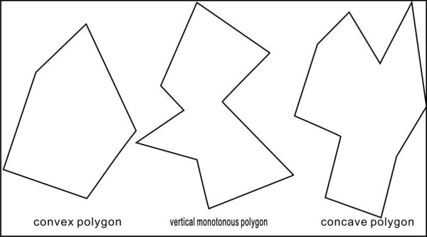
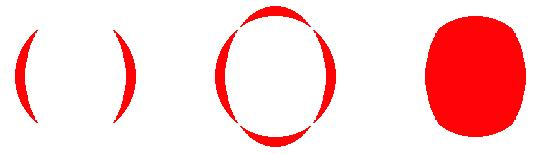
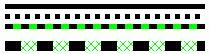
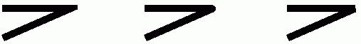
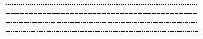
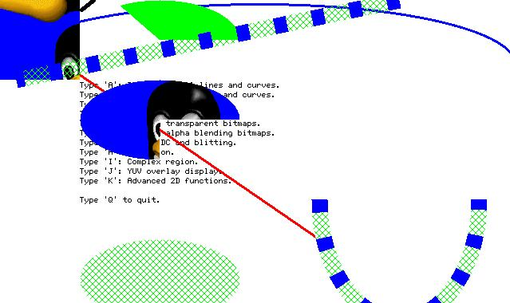

# Advanced GDI Functions Based on NEWGAL

- [New Region Implementation](#new-region-implementation)
- [Raster Operations](#raster-operations)
- [Memory `DC` and `BitBlt`](#memory-dc-and-bitblt)
- [Enhanced `BITMAP` Operations](#enhanced-bitmap-operations)
- [New `GDI` functions](#new-gdi-functions)
- [Advanced `GDI` functions](#advanced-gdi-functions)
   + [Image Scaling Functions](#image-scaling-functions)
   + [Image Rotation Functions](#image-rotation-functions)
   + [Rounded Corners Rectangle](#rounded-corners-rectangle)
- [Curve Generators](#curve-generators)
   + [Line Clipper and Line Generator](#line-clipper-and-line-generator)
   + [Circle Generator](#circle-generator)
   + [Ellipse Generator](#ellipse-generator)
   + [Arc Generator](#arc-generator)
   + [Vertical Monotonous Polygon Generator](#vertical-monotonous-polygon-generator)
   + [General Polygon Generator](#general-polygon-generator)
   + [Flood Filling Generator](#flood-filling-generator)
   + [Using Curve Generator](#using-curve-generator)
- [Plotting Complex Curve](#plotting-complex-curve)
- [Filling Enclosed Curve](#filling-enclosed-curve)
- [Building Complex Region](#building-complex-region)
- [Visiting Frame Buffer Directly](#visiting-frame-buffer-directly)
- [Advanced Two-Dimension `GDI` Functions](#advanced-two-dimension-gdi-functions)
   + [Pen and Its Properties](#pen-and-its-properties)
   + [Brush and Its Properties](#brush-and-its-properties)
   + [Advanced Two-Dimension Drawing Functions](#advanced-two-dimension-drawing-functions)
   + [Using Advanced Two-Dimension `GDI` Functions](#using-advanced-two-dimension-gdi-functions)
- [Support for Slave Screens](#support-for-slave-screens)
   + [Creating Slave Screen](#creating-slave-screen)
   + [Destroying Slave Screen](#destroying-slave-screen)


It is mentioned in Chapter 13 that MiniGUI 1.1.0 has greatly improved `GAL` and
`GDI` by rewriting almost all code. Those new interfaces and functions strongly
enhance the graphics capability of MiniGUI. In this chapter we will introduce
the related concepts and interfaces of new `GDI` interface in detail.

## New Region Implementation

New `GDI` uses new region algorithm, which is popularly used in X Window and
other GUI systems. This region is called x-y-banned region, featured as follow:
- Region is constituted by non-null rectangles that is not intersected each
other.
- Region can be divided into several non-intersected horizontal strip, each of
which has the rectangles with same width and top-aligned; In other words, all
rectangles have the same y coordinates on the upper-left corner.
- The rectangles rank from left to right at the x direction, and then form top
to bottom at y direction.

`GDI` can use the special property of x-y-banned region to optimize the
drawing. Those drawing functions that will be added into the future version
will use this property to optimize plotting output.

New `GDI` adds the following interfaces, which can be used to do operations
between regions (`minigui/gdi.h`):

```cpp
BOOL GUIAPI PtInRegion (PCLIPRGN region, int x, int y);
BOOL GUIAPI RectInRegion (PCLIPRGN region, const RECT* rect);

void GUIAPI OffsetRegionEx (PCLIPRGN region, const RECT *rcClient, const RECT *rcScroll, int x, int y);
void GUIAPI OffsetRegion (PCLIPRGN region, int x, int y);

BOOL GUIAPI IntersectRegion (CLIPRGN *dst, const CLIPRGN *src1, const CLIPRGN *src2);
BOOL GUIAPI UnionRegion (PCLIPRGN dst, const CLIPRGN* src1, const CLIPRGN* src2);
BOOL GUIAPI SubtractRegion (CLIPRGN* rgnD, const CLIPRGN* rgnM, const CLIPRGN* rgnS);
BOOL GUIAPI XorRegion (CLIPRGN *dst, const CLIPRGN *src1, const CLIPRGN *src2);
```

- `PtInRegion` checks if the given point locates in the given region.
- `RectInRegion` checks if the given rectangle intersects with the given region.
- `OffsetRegionEx` offsets the clip region located in the intersection of two
given rectangles, one is the rectangle the original clip region belongs to, and
the other is the one which offset region belongs to. And then form a clip
region which belong to both the offset part of the original region and the
intersection of the two rectangles.
- `OffsetRegion` just offsets the given region.
- `IntersectRegion` can be used to calculate the intersection of two given
region.
- `UnionRegion` can merge two different regions. The merged region is still a
region of x-y-banned.
- `SubstractRegion` subtracts one region from another.
- `XorRegion` is used to perform the `XOR` (Exclusive `OR`) operation between
two regions. The result equals to the intersection between the result A that
`src1` subtracts `src2` and the result B that `src2` subtracts `src1`.

Apart from the region operation functions above, MiniGUI also provides those
`GDI` functions that created from the closed curve such as polygon and ellipse.
These functions can limit `GDI` output within the specially closed curve. These
functions will be discussed in the following sections.

## Raster Operations
Raster operation specifies the operation between the target pixel and the pixel
existed on the screen while drawing. The most popular one is alpha blending.
Here the raster operation refers to binary bit operation, including `AND`,
`OR`, `XOR`, and directly overwrite (SET). Application can use
`SetRasterOperation` function and `GetRasterOperation` function to set or get
current raster operation. The prototypes of these two functions are as follow
(`minigui/gdi.h`):

```cpp
#define ROP_SET         0
#define ROP_AND         1
#define ROP_OR          2
#define ROP_XOR         3

int GUIAPI GetRasterOperation (HDC hdc);
int GUIAPI SetRasterOperation (HDC hdc, int rop);
```

In the function, `rop` is the raster operation mode. The optional parameters are
`ROP_SET` (directly set), `ROP_AND` (do bit-AND with the pixels on the screen),
`ROP_OR` (do bit-OR with the pixels on the screen) and `POP_XOR` (do
exclusive-OR with the pixels on the screen).

After setting new raster operation, the subsequent graphics output will be
affected by it. Those drawing functions include `SetPixel`, `LineTo`, Circle,
Rectangle, `FillCircle`, and `FillBox`. Please notice, new `GDI` function has a
new rectangle filling function - `FillBox`. `FillBox` function is not
influenced by the current raster operation, just because `FillBox` realize
Rectangle filling by using Hardware acceleration function, and its filling
speed is very high.

## Memory `DC` and `BitBlt`
New `GDI` function boosts up the memory `DC` operation function. `GDI` function
will call `GAL-related` interface while setting memory `DC` as it will fully
use the hardware acceleration of video adapter to quickly move or copy the bit
blocks between different regions, including transparency processing and alpha
blending. Application can create a memory `DC` with the property that each
point has different alpha value. Also, application can create the alpha value
(alpha channel of the `DC`) of all pixels of memory `DC` by using
`SetMemDCAlpha`, then use `BitBlt` and `StretchBlt` to transfer the bits
between `DCs`. Application also can set the transparent pixel of a source `DC`,
so as to leap over such pixel while performing `BitBlt`.

`GDI` functions regarding memory `DC` are as follow (`minigui/gdi.h`):

```cpp
#define MEMDC_FLAG_NONE         0x00000000          /* None. */
#define MEMDC_FLAG_SWSURFACE    0x00000000          /* DC is in system memory */
#define MEMDC_FLAG_HWSURFACE    0x00000001          /* DC is in video memory */
#define MEMDC_FLAG_SRCCOLORKEY  0x00001000          /* Blit uses a source color key */
#define MEMDC_FLAG_SRCALPHA     0x00010000          /* Blit uses source alpha blending */
#define MEMDC_FLAG_RLEACCEL     0x00004000          /* Surface is RLE encoded */

HDC GUIAPI CreateCompatibleDC (HDC hdc);
HDC GUIAPI CreateMemDC (int width, int height, int depth, DWORD flags,
                Uint32 Rmask, Uint32 Gmask, Uint32 Bmask, Uint32 Amask);
BOOL GUIAPI ConvertMemDC (HDC mem_dc, HDC ref_dc, DWORD flags);
BOOL GUIAPI SetMemDCAlpha (HDC mem_dc, DWORD flags, Uint8 alpha);
BOOL GUIAPI SetMemDCColorKey (HDC mem_dc, DWORD flags, Uint32 color_key);
HDC GUIAPI CreateMemDCFromBitmap (HDC hdc, BITMAP *bmp);
HDC GUIAPI CreateMemDCFromMyBitmap (const MYBITMAP *my_bmp, RGB *pal);
void GUIAPI DeleteMemDC (HDC mem_dc);
```

`CreateCompatibleDC` creates a memory `DC` compatible with given `DC`.
Compatibility means that the pixel format, width and height of new created
memory `DC` are same with the given `DC`. Memory `DC` based on this format can
be quickly blited to the compatible `DC`.

Now we further explain the pixel format. Pixel format includes the depth of
color (that is, the number of bits per pixel), palette, or the format of four
components of `RGBA` (red, green, blue, and alpha). The parameter alpha can be
seen as the transparency degree of one pixel point, 0 means 100% transparent,
255 means completely opaque. If the degree of color below 8, `GAL` will create
a default palette and you can call the function `SetPalette` to modify the
palette. If the degree is higher than 8, MiniGUI will respectively appoint the
bits taken up by the `RGBA` parameters of the given pixel. Compatible memory
`DC` has the same color degree with the given `DC`, and has the same palette or
`RGBA` parameter combination format.

Calling function `CreateMemDC` can specify the height, width, color depth, and
necessary `RGBA` components combination format of the new created memory `DC`.
MiniGUI use bit mask taken up by each pixel to represent the combination format
of `RGBA` components. For example, to create a 16-bit memory `DC` including
per-pixel alpha value, you can use four 4-bit to assign 16-bit pixel, thus the
mask of the four components of `RBGA` will respectively be: 0x0000F000,
0x00000F00, 0x000000F0, and 0x0000000F.

`ConvertMemDC` is used to convert a specified memory `DC` according to the
pixel format of given referencing `DC`. This conversion makes the result `DC`
has the same pixel format with referencing `DC`. Thus, the converted `DC` can
be quickly blited to the compatible `DC`.

`SetMemDCAlpha` is used to set or delete the alpha channel value of whole
memory `DC`. We can use `MEMDC_FLAG_RLEACCEL` to specify the memory `DC` adopt
or delete the `RLE` encoding format. Alpha channel value will function on all
pixels of the `DC`.

`SetMemDCColorKey` is used to set or delete the color key of whole memory `DC`
object, that is, the transparent pixel value. We can also use
`MEMDC_FLAG_RLEACCEL` to specify memory `DC` adopt or delete the `RLE` encoding
format.

`CreateMemDCFromBitmap` can create a memory `DC` compatible with given `DC`
that point to device relative Bitmap, and it can be quickly copy and exchange
to display from bitmap.

`CreateMemDCFromMyBitmap` create a memory `DC` which points to a device
independent bitmap.

Similar to other `DCs`, you can also call `GDI` drawing function to perform any
drawing output operation in memory `DC` and then blit it to other `DC`. Code in
List 1 comes from `gdidemo.c` program of `mg-samples`, which demonstrates how to use
memory `DC` to realize transparent and alpha blending blitting operation
between `DCs`.

List 1 The enhanced memory `DC` operations

```cpp
    /* Alpha operation point by point*/
    mem_dc = CreateMemDC (400, 100, 16, MEMDC_FLAG_HWSURFACE | MEMDC_FLAG_SRCALPHA,
                    0x0000F000, 0x00000F00, 0x000000F0, 0x0000000F);

    /* Set an opaque brush and fill a rectangle */
    SetBrushColor (mem_dc, RGBA2Pixel (mem_dc, 0xFF, 0xFF, 0x00, 0xFF));
    FillBox (mem_dc, 0, 0, 200, 50);

    /* Set a brush transparent by 25% and fill a rectangle */
    SetBrushColor (mem_dc, RGBA2Pixel (mem_dc, 0xFF, 0xFF, 0x00, 0x40));
    FillBox (mem_dc, 200, 0, 200, 50);

    /* Set a brush half transparent and fill a rectangle */
    SetBrushColor (mem_dc, RGBA2Pixel (mem_dc, 0xFF, 0xFF, 0x00, 0x80));
    FillBox (mem_dc, 0, 50, 200, 50);

    /* Set a brush transparent by 75% and fill a rectangle */
    SetBrushColor (mem_dc, RGBA2Pixel (mem_dc, 0xFF, 0xFF, 0x00, 0xC0));
    FillBox (mem_dc, 200, 50, 200, 50);
    SetBkMode (mem_dc, BM_TRANSPARENT);

    /* Output text with half transparent pixel point */
    SetTextColor (mem_dc, RGBA2Pixel (mem_dc, 0x00, 0x00, 0x00, 0x80));
    TabbedTextOut (mem_dc, 0, 0, "Memory DC with alpha.\n"
                                 "The source DC have alpha per-pixel.");

    /* Blit into window DC */
    start_tick = GetTickCount ();
    count = 100;
    while (count--) {
        BitBlt (mem_dc, 0, 0, 400, 100, hdc, rand () % 800, rand () % 800);
    }
    end_tick = GetTickCount ();
    TellSpeed (hwnd, start_tick, end_tick, "Alpha Blit", 100);

    /* Delete memory DC */
    DeleteMemDC (mem_dc);

    /* A memory DC with Alpha channel: 32 bits, RGB takes 8 bits respectively, no Alpha component */
    mem_dc = CreateMemDC (400, 100, 32, MEMDC_FLAG_HWSURFACE | MEMDC_FLAG_SRCALPHA | MEMDC_FLAG_SRCCOLORKEY,
                    0x00FF0000, 0x0000FF00, 0x000000FF, 0x00000000);

    /* Output the filled rectangle and text to memory DC */
    SetBrushColor (mem_dc, RGB2Pixel (mem_dc, 0xFF, 0xFF, 0x00));
    FillBox (mem_dc, 0, 0, 400, 100);
    SetBkMode (mem_dc, BM_TRANSPARENT);
    SetTextColor (mem_dc, RGB2Pixel (mem_dc, 0x00, 0x00, 0xFF));
    TabbedTextOut (mem_dc, 0, 0, "Memory DC with alpha.\n"
                                 "The source DC have alpha per-surface.");

    /* Blit into window DC */
    start_tick = GetTickCount ();
    count = 100;
    while (count--) {
        /* Set the Alpha channel of memory DC */
        SetMemDCAlpha (mem_dc, MEMDC_FLAG_SRCALPHA | MEMDC_FLAG_RLEACCEL, rand () % 256);
        BitBlt (mem_dc, 0, 0, 400, 100, hdc, rand () % 800, rand () % 800);
    }
    end_tick = GetTickCount ();
    TellSpeed (hwnd, start_tick, end_tick, "Alpha Blit", 100);

    /* Fill rectangle area, and output text */
    FillBox (mem_dc, 0, 0, 400, 100);
    SetBrushColor (mem_dc, RGB2Pixel (mem_dc, 0xFF, 0x00, 0xFF));
    TabbedTextOut (mem_dc, 0, 0, "Memory DC with alpha and colorkey.\n"
                                 "The source DC have alpha per-surface.\n"
                                 "And the source DC have a colorkey, \n"
                                 "and RLE accelerated.");

    /* Set the transparent pixel value of memory DC */
    SetMemDCColorKey (mem_dc, MEMDC_FLAG_SRCCOLORKEY | MEMDC_FLAG_RLEACCEL,
                    RGB2Pixel (mem_dc, 0xFF, 0xFF, 0x00));
    /* Blit into window DC */
    start_tick = GetTickCount ();
    count = 100;
    while (count--) {
        BitBlt (mem_dc, 0, 0, 400, 100, hdc, rand () % 800, rand () % 800);
        CHECK_MSG;
    }
    end_tick = GetTickCount ();
    TellSpeed (hwnd, start_tick, end_tick, "Alpha and colorkey Blit", 100);

    /* Delete the object of memory DC */
    DeleteMemDC (mem_dc);
```

## Enhanced `BITMAP` Operations

New `GDI` function enhances the `BITMAP` structure and adds support to
transparent and alpha channel as well as. By setting such memberships as
`bmType`, `bmAlpha`, and `bmColorkey` of a `BITMAP` object, you can get certain
properties. Then you can use function `FillBoxWithBitmap/Part` to draw the
`BITMAP` object to certain `DC`. You can regard the `BITMAP` object as the
memory `DC` created in system memory, but you cannot perform drawing output to
the `BITMAP` object. Code in List 2 loads a bitmap object from an image file,
set transparency and alpha channel, and finally use function
`FillBoxWithBitmap` to output to a `DC`. This program comes from the demo
program `gdidemo.c` of `mg-samples`.

List 2 The enhanced `BITMAP` operations

```cpp
    int tox = 800, toy = 800;
    int count;
    BITMAP bitmap;
    unsigned int start_tick, end_tick;

    if (LoadBitmap (hdc, &bitmap, "res/icon.bmp"))
        return;

    bitmap.bmType = BMP_TYPE_ALPHACHANNEL;

    /* Alpha mixing of the bitmap */
    start_tick = GetTickCount ();
    count = 1000;
    while (count--) {
        tox = rand() % 800;
        toy = rand() % 800;

        /* Set random Alpha channel value */
        bitmap.bmAlpha = rand() % 256;
        /* Display into window DC */
        FillBoxWithBitmap (hdc, tox, toy, 0, 0, &bitmap);
    }
    end_tick = GetTickCount ();
    TellSpeed (hwnd, start_tick, end_tick, "Alpha Blended Bitmap", 1000);

    bitmap.bmType = BMP_TYPE_ALPHACHANNEL | BMP_TYPE_COLORKEY;
    /* Get the first pixel value, and set it as transparent pixel value */
    bitmap.bmColorKey = GetPixelInBitmap (&bitmap, 0, 0);

    /* Transparent and Alpha mixing */
    start_tick = GetTickCount ();
    count = 1000;
    while (count--) {
        tox = rand() % 800;
        toy = rand() % 800;

        /*  Set random Alpha channel value */
        bitmap.bmAlpha = rand() % 256;
        /* Display into window DC */
        FillBoxWithBitmap (hdc, tox, toy, 0, 0, &bitmap);
    }
    end_tick = GetTickCount ();
    TellSpeed (hwnd, start_tick, end_tick, "Alpha Blended Transparent Bitmap", 1000);

    UnloadBitmap (&bitmap);
```
You can also convert a certain `BITMAP` object to memory `DC` object by using
function `CreateMemDCFromBitmap`. The prototype of this function is as follows
(`minigui/gdi.h`):

```cpp
HDC GUIAPI CreateMemDCFromBitmap (HDC hdc, BITMAP* bmp);
```

The memory `DC` created from a `BITMAP` object directly uses the memory to
which `bmBits` of the `BITMAP` object points. The memory lies in system memory,
but not video memory.

New `GDI` also enhances the `BITMAP-related` `MYBITMAP` structure. `MYBITMAP`
can be seen as a bitmap structure that is not dependent to the device. You can
also convert one `MYBITMAP` object to a memory `DC` by using function
`CreateMemDCFromMyBitmap`. The prototype of this function is as follows
(`minigui/gdi.h`):

```cpp
HDC GUIAPI CreateMemDCFromMyBitmap (HDC hdc, MYBITMAP* mybmp);
```

Most `GAL` engines are unable to provide hardware acceleration for blitting
operation which transfers pixels from system memory to video memory, therefore,
the `FillBoxWithBitmap` function, the `BITMAP` object or the memory `DC`
created by `MYBITMAP` object are unable to be quickly blited to other `DC`
through hardware acceleration. The support for such acceleration can be
achieved by pre-created memory `DC` in video memory.

## New `GDI` functions
Apart from raster operation, MiniGUI also adds some useful `GDI` functions,
including `FillBox`, `FillCircle`, and so on. The new `GDI` functions are:

```cpp
void GUIAPI FillBox (HDC hdc, int x, int y, int w, int h);
void GUIAPI FillCircle (HDC hdc, int sx, int sy, int r);

BOOL GUIAPI ScaleBitmap (BITMAP* dst, const BITMAP* src);

BOOL GUIAPI GetBitmapFromDC (HDC hdc, int x, int y, int w, int h, BITMAP* bmp);

gal_pixel GUIAPI GetPixelInBitmap (const BITMAP* bmp, int x, int y);
BOOL GUIAPI SetPixelInBitmap (const BITMAP* bmp, int x, int y, gal_pixel pixel);
```

- `FillBox` fills specified rectangle.
- `FillCircle` fills specified circle, affected by raster operation.
- `ScaleBitmap` scales a `BITMAP` object
- `GetBitmapFromDC` copies pixels which the scope is in a specified rectangle
to a `BITMAP` object.
- `GetPixelInBitmap` gets pixel value of a given position in a `BITMAP` object.
- `SetPixelInBitmap` sets pixel value of a given position in a `BITMAP` object.

## Advanced `GDI` functions
### Image Scaling Functions

The following functions can be used to paint and scale an image simultaneously.

```cpp
int GUIAPI StretchPaintImageFromFile (HDC hdc, int x, int y, int w, int h, const char* spFileName);
int GUIAPI StretchPaintImageFromMem (HDC hdc, int x, int y, int w, int h, const void* mem, int size, const char* ext);
int GUIAPI StretchPaintImageEx (HDC hdc, int x, int y, int w, int h, MG_RWops* area, const char* ext);
```

- `StretchPaintImageFromFile` stretches and paints an image from file.
Parameter `hdc` is device context. Parameter x and y are painting position on
device. Parameter w is the width of the stretched bitmap. Parameter h is the
height of the stretched bitmap. Parameter `spFileName` is the file name.
- `StretchPaintImageFromMem` stretches an image from memory. Parameter `hdc` is
device context. Parameter x and y are painting position on device. Parameter w
is the width of the stretched bitmap. Parameter h is the height of the
stretched bitmap. Parameter `mem` points to memory containing image data and
parameter size is the size of the image data. Parameter ext is the type of
bitmap.
- `StretchPaintImageEx` paints and stretches an image from data source onto
device directly. Parameter `hdc` is device context. Parameter x and y are
painting position on device. Parameter w is the width of the stretched bitmap.
Parameter h is the height of the stretched bitmap. Parameter area points to
data source and parameter ext is the extension the type of bitmap.

### Image Rotation Functions

The following functions can be used to paint an `BITMAP` object and rotate it.

```cpp
void GUIAPI PivotScaledBitmapFlip (HDC hdc, const BITMAP *bmp, fixed x, fixed y, fixed cx, fixed cy, int angle, fixed scale_x, fixed scale_y, BOOL h_flip, BOOL v_flip);
void GUIAPI RotateBitmap (HDC hdc, const BITMAP* bmp, int lx, int ty, int angle);
void GUIAPI PivotBitmap (HDC hdc, const BITMAP *bmp, int x, int y, int cx, int cy, int angle);
void GUIAPI RotateScaledBitmap (HDC hdc, const BITMAP *bmp, int lx, int ty, int angle, int w, int h);
void GUIAPI RotateBitmapVFlip (HDC hdc, const BITMAP *bmp, int lx, int ty, int angle);
void GUIAPI RotateBitmapHFlip (HDC hdc, const BITMAP *bmp, int lx, int ty, int angle);
void GUIAPI RotateScaledBitmapVFlip (HDC hdc, const BITMAP *bmp, int lx, int ty, int angle, int w, int h);
void GUIAPI RotateScaledBitmapHFlip (HDC hdc, const BITMAP *bmp, int lx, int ty, int angle, int w, int h);
```
- `PivotScaledBitmapFlip` rotates, stretches, shrinks, or flips a bitmap
object. The unit of rotation is 1/64 degree in this function. Parameter hdc is
device context. Parameter bmp is a `BITMAP` object pointer. Parameter x and y
are rotation center on `DC`. Parameter (cx, cy) is the rotation center on the
bitmap. The data type of x, y, cx, cy are fixed-point values. Parameter angle
is the degree of rotation. Parameter `scale_x` and `scale_y` are proportion of
scaling. Parameter `h_flip` and `v_flip` are flags for flipping horizontally or
flipping vertically.
- `RotateBitmap` rotates a bitmap object surrounded its center. Parameter hdc
is the graphic device context handle. Parameter bmp is the pointer to a
`BITMAP` object. Parameter lx and ly are upper-left coordinate of bitmap on
`DC`. Parameter angle is the degree of rotation. The unit of rotation is 1/64
degree.
- `PivotBitmap` aligns the point in the bitmap given by parameter (cx, cy) to
parameter (x, y) in device context. Parameter hdc is the device context.
Parameter bmp is the pointer to a `BITMAP` object. Parameter x and y are
rotation center on `DC`. Parameter (cx, cy) is the rotation center on the
bitmap. Parameter angle is the degree of rotation. The unit of rotation is 1/64
degree.
- `RotateScaledBitmap` stretches or shrinks a bitmap object at the same as
rotating it. Parameter hdc is the device context. Parameter bmp is the pointer
to a `BITMAP` object. Parameter lx and ly are upper-left coordinates of bitmap
on `DC`. Parameter angle is the degree of rotation. The unit of rotation is
1/64 degree. Parameter w and h are width and height of the stretched bitmap.
- `RotateBitmapVFlip` flips vertically and rotates a bitmap object. See also
`RotateBitmap`.
- `RotateBitmapHFlip` flips horizontally and rotates a bitmap object. See also
`RotateBitmap`.
- `RotateScaledBitmapVFlip` flips vertically, rotates, stretch or shrinks a
bitmap object. This function is similar to `RotateScaledBitmap` expect that it
flips the bitmap vertically first.
- `RotateScaledBitmapHFlip` flips horizontally, rotates, stretches or shrinks a
bitmap object. For the means of parameters, please refer to
`RotateScaledBitmap`.

### Rounded Corners Rectangle
The follow function draws a rounded corners rectangle

```cpp
BOOL GUIAPI RoundRect (HDC hdc, int x0, int y0, int x1, int y1, int rw, int rh);
```
Here, hdc is the graphic device context handle. x0 and y0 are coordinates of
upper-left corner of the rectangle; x1 and y1 are coordinates of lower-right of
the rectangle; rw and rh are the x-radius and y-radius of the rounded corners
respectively.

## Curve Generators
A general graphics system usually provides the user with the drawing functions
to plot line and complicated curve, such as ellipse, and spline. Users can use
this function to plot, but unable to do other jobs by using the existed
curve-generating algorithms. In the development of new `GDI` interface, we use
a special design pattern to implement drawing of curve and filling of closed
curve. This way is very flexible and provides you a chance of directly using
system internal algorithm:
- System defines several functions used to create line and curve. We call these
functions curve generators.
- You need to define a callback and pass this function address to curve
generator before calling a generator. The curve generator will call this
callback while generating a point on the curve or a horizontal line of closed
curve.
- You can finish some operations based on new point or new horizontal line. For
the MiniGUI drawing function, that means drawing the point or the line.
- As callback is frequently called on during the generator operating process,
system allows you to pass a pointer to represent context while calling the
curve generator. The generator will pass this pointer to your callback.

We will describe curve and filling generator provided by MiniGUI in the
following sections.

### Line Clipper and Line Generator
The prototype of the line clipper and generator is as follows:

```cpp
/* Line clipper */
BOOL GUIAPI LineClipper (const RECT* cliprc, int *_x0, int *_y0, int *_x1, int *_y1);

/* Line generators */
typedef void (* CB_LINE) (void* context, int stepx, int stepy);
void GUIAPI LineGenerator (void* context, int x1, int y1, int x2, int y2, CB_LINE cb);
```
`LineClipper` is not a generator, which is used to clip the given line into a
rectangle. The argument `cliprc` is the given rectangle, while `_x0`, `_y0`,
`_x1`, and `_y1` present
the two end-points of the line that will be clipped into `cliprc` and then return
to the end-points of the clipped line. MiniGUI internally uses Cohen-Sutherland
algorithm to clip a line.

`LineGenerator` is the line generator using Breshenham algorithm. The generator
starts from the beginning point of given line, every time when it generates a
point it will call the callback function and pass context as well as the step
forward value or amount of difference between new point and the previous one.
For example, passing `stepx = 1`, `stepy = 0` indicate that the new point is one
step forward then the previous point at x coordinate, while y coordinate keeps
the same. The callback function can realize the optimization at certain degree
on the basis of step forward value.

### Circle Generator

The prototypes of MiniGUI-defined circle generator are as follow:

```cpp
/* Circle generator */
typedef void (* CB_CIRCLE) (void* context, int x1, int x2, int y);
void GUIAPI CircleGenerator (void* context, int sx, int sy, int r, CB_CIRCLE cb);
```
You should firstly specify the coordinates of center of the circle and the
radius, and then pass information of context and the callback function. Every
time when it generates a point, the generator will call the callback function
once, at the same time it passes three values: x1, x2, and y. These three
values actually indicate two points on the circle: (x1, y) and (x2, y). Because
of the symmetry property of circle, the generator can get all points on the
circle by calculating only 1/4 of points in the circle.

### Ellipse Generator

Similar to circle generator, the prototypes of ellipse generator are as follow:

```cpp
/* Ellipse generator */
typedef void (* CB_ELLIPSE) (void* context, int x1, int x2, int y);
void GUIAPI EllipseGenerator (void* context, int sx, int sy, int rx, int ry, CB_ELLIPSE cb);
```
You should firstly specify the coordinates of center of ellipse and the radius
of x coordinate and y coordinate, and then pass the context and the callback
function. Every time when it generates a point, the generator will call the
callback function once, at the same time it passes three values: x1, x2, and y.
These three values actually indicate two points in the ellipse: (x1, y) and
(x2, y). Because of the symmetry property of ellipse, the generator can get all
points in the ellipse by calculating only half of points of the ellipse.

### Arc Generator

The MiniGUI-defined arc generator can be seen as follows:

```cpp
/* Arc generator */
typedef void (* CB_ARC) (void* context, int x, int y);
void GUIAPI CircleArcGenerator (void* context, int sx, int sy, int r, int ang1, int ang2, CB_ARC cb);
```

You should firstly specify the center of the arc, the radius, the starting
angle and the end angle. It is necessary to note that the unit of the starting
angle and end angle is integers in 1/64 degree, not float-point numbers. Then
you pass the callback function. Every time when it generates a point on the
arc, the function will call the callback function and pass the coordinates
value (x, y) of a new point on the arc.

### Vertical Monotonous Polygon Generator
Generally speaking, polygons include protruding polygons and concave polygons.
Here the vertical monotonous polygon is a special polygon produced for
optimizing polygon algorithm in the computer graphics. The definition of this
kind of polygon is: all the horizontal lines of the computer screen and the
side of polygon can only have one or two points of intersection. Figure 1 gives
examples of protruding polygon, concave polygon, and vertical monotonous
polygon.




Figure 1 Polygons

It is necessary to note that a protruding polygon must be vertical monotonous
polygon, but a vertical monotonous polygon can be concave polygon. Obviously,
normal polygon filling algorithms need to determine the number of intersection
point between polygon and the screen scan line while vertical monotonous
polygons not. Therefore, the speed of polygon filling can be greatly increased.

The prototypes of MiniGUI-defined vertical monotonous polygon related
functions are as follow:

```cpp
/* To determine whether the specified Polygon is Monotone Vertical Polygon */
BOOL GUIAPI PolygonIsMonotoneVertical (const POINT* pts, int vertices);

/* Monotone vertical polygon generator */
typedef void (* CB_POLYGON) (void* context, int x1, int x2, int y);
BOOL GUIAPI MonotoneVerticalPolygonGenerator (void* context, const POINT* pts, int vertices, CB_POLYGON cb);
```

`PolygonIsMonotoneVertical` is used to determine if a given polygon is vertical
monotonous polygon while `MonotoneVerticalPolygonGenerator` is the generator of
vertical monotonous polygon. In MiniGUI, the vertices of the polygon represent
a polygon. The argument `pts` represents the vertices array while vertices represents the
number of the vertices. What generator generates actually are the end-points
`(x1, y)` and `(x2, y)` of each horizontal line to filling the polygon.

### General Polygon Generator

MiniGUI also provides the general polygon generator, which can be used to
process protruding polygons and concave polygons. The prototypes are as follow:

```cpp
/* General polygon generator */
typedef void (* CB_POLYGON) (void* context, int x1, int x2, int y);
BOOL GUIAPI PolygonGenerator (void* context, const POINT* pts, int vertices, CB_POLYGON cb);
```

Similar to vertical monotonous polygon generator, what this function generates
are horizontal scan lines for filling the polygon: x1 is the beginning x
coordinates of the horizontal line; x2 is the end x coordinate; y is the y
coordinate of horizontal line.

### Flood Filling Generator
with the one at the start position (Like water spreading, so called flood
filling). Between the starting point and the ending point, it fills certain
region according to a given color. During this process, we need two callback
functions, one of which is used to determine if the encountered point is the
same with the starting one; another callback function is used to generate the
horizontal scan line of the filling region. When plotting what this function
compares is pixel, but actually it can be used to compare any other values so
as to finish the special spreading actions.

MiniGUI defines flood-filling generator as follows:

```cpp
/* General Flood Filling generator */
typedef BOOL (* CB_EQUAL_PIXEL) (void* context, int x, int y);
typedef void (* CB_FLOOD_FILL) (void* context, int x1, int x2, int y);
BOOL GUIAPI FloodFillGenerator (void* context, const RECT* src_rc, int x, int y,
                CB_EQUAL_PIXEL cb_equal_pixel, CB_FLOOD_FILL cb_flood_fill);
```

The function `cb_equal_pixel` is called to determine if the target point is
same with the staring point. The pixel of starting point can be transferred by
context. The function `cb_flood_fill` is used to fill in a scan line. It passes
the end-points of the scan line, that is, (x1, y) and (x2, y).

### Using Curve Generator
The way of using curve and filling generator is very simple. We firstly see how
MiniGUI uses the curve and filling generator in its internal in order to deeply
understand them.

The program paragraph comes from `FloodFill` function of MiniGUI
(`src/newgdi/flood.c`):

```cpp
static void _flood_fill_draw_hline (void* context, int x1, int x2, int y)
{
    PDC pdc = (PDC)context;
    RECT rcOutput = {MIN (x1, x2), y, MAX (x1, x2) + 1, y + 1};

    ENTER_DRAWING (pdc, rcOutput);
    _dc_draw_hline_clip (context, x1, x2, y);
    LEAVE_DRAWING (pdc, rcOutput);
}

static BOOL equal_pixel (void* context, int x, int y)
{
    gal_pixel pixel = _dc_get_pixel_cursor ((PDC)context, x, y);

    return ((PDC)context)->skip_pixel == pixel;
}

/* FloodFill
 * Fills an enclosed area (starting at point x, y).
 */
BOOL GUIAPI FloodFill (HDC hdc, int x, int y)
{
    PDC pdc;
    BOOL ret = TRUE;

    if (!(pdc = check_ecrgn (hdc)))
        return TRUE;

    /* hide cursor tempororily */
    ShowCursor (FALSE);

    coor_LP2SP (pdc, &x, &y);

    pdc->cur_pixel = pdc->brushcolor;
    pdc->cur_ban = NULL;

    pdc->skip_pixel = _dc_get_pixel_cursor (pdc, x, y);

    /* does the start point have a equal value? */
    if (pdc->skip_pixel == pdc->brushcolor)
        goto equal_pixel;

    ret = FloodFillGenerator (pdc, &pdc->DevRC, x, y, equal_pixel, _flood_fill_draw_hline);

equal_pixel:
    UNLOCK_GCRINFO (pdc);

    /* Show cursor */
    ShowCursor (TRUE);

    return ret;
}
```

This function calls `FloodFillGenerator` after some necessary initialization
and passes context pdc (pdc is the data structure in MiniGUI internal to
represent `DC`) and two callback functions: `equal_pixel` and
`_flood_fill_draw_hline`. Before this, the function gets the pixel value of
starting point and stored it in `pdc->skip_pixel`. Function `equal_pixel` gets
the pixel value of the given point and returns the value after comparing to
`pdc->skip_pixel`; `_flood_fill_draw_hline` calls internal functions to plot
horizontal line.

This way can greatly decrease the complexity of codes while increase their
reuse capability. Readers who are interested in this can compare the function
`LineTo` between old and new `GDI` interfaces.

The main aim of designing generator is to facilitate the users. For example,
you can use `MiniGUI`’s curve generator to finish your job. The example below
assumes that you use a circle generator to plot a circle with 4-pixel wide:

```cpp
static void draw_circle_pixel (void* context, int x1, int x2, int y)
{
    HDC hdc = (HDC) context;

    /*With each point on the circle as the center, fill the circle by radius 2*/
    FillCircle (hdc, x1, y, 2);
    FillCircle (hdc, x2, y, 2);
}

void DrawMyCircle (HDC hdc, int x, int y, int r, gal_pixel pixel)
{
    gal_pixel old_brush;

    old_bursh = SetBrushColor (hdc, pixle);

    /* Call circle generator */
    CircleGenerator ((void*)hdc, x, y, r, draw_circle_pixel);

    /* Recover to the old brush color */
    SetBrushColor (hdc, old_brush);
}
```

The use of curve generator is very simple. Its structure is also very clear.
You can learn this way during your own application developing.

## Plotting Complex Curve
Based on the curve generator described in 15.7, MiniGUI provides the following
basic curve plotting functions:

```cpp
void GUIAPI MoveTo (HDC hdc, int x, int y);
void GUIAPI LineTo (HDC hdc, int x, int y);
void GUIAPI Rectangle (HDC hdc, int x0, int y0, int x1, int y1);
void GUIAPI PollyLineTo (HDC hdc, const POINT* pts, int vertices);
void GUIAPI SplineTo (HDC hdc, const POINT* pts);
void GUIAPI Circle (HDC hdc, int sx, int sy, int r);
void GUIAPI Ellipse (HDC hdc, int sx, int sy, int rx, int ry);
void GUIAPI CircleArc (HDC hdc, int sx, int sy, int r, int ang1, int ang2);
```
- `MoveTo` moves current starting point of pen to given point (x, y), specified
in logical coordinates.
- `LineTo` draws line from current starting point to a given point (x, y),
specified in logical coordinates.
- Rectangle draws a rectangle with the vertices as (x0, y0) and (x1, y0).
- `PollyLineTo` uses `LineTo` to draw a poly-line. Pts specify each of the
vertices of poly-line while vertices specify the number of vertices.
- `SplineTo` uses `LineTo` function to draw spline. Four points can determine
the only one spline, that is, pts is a pointer to a 4-point structure array.
- Circle draws a circle with the center of (sx, sy) and radius of r, specified
in logical coordinates.
- Ellipse draws an ellipse with the center of (sx, sy), x coordinate radius of
rx, and y coordinate radius of ry.
- `CircleArc` draws a circle arc. The center of the circle is (sx, sy), radius
is r, and the starting angel and ending angle of the arc is ang1 and ang2
respectively. Ang1 and ang2 use 1/64 degree as unit.

Let's see the use of Circle and Ellipse functions. Assuming there are two given
points, pts[0] and pts[1]. pts[0] is the center of circle or ellipse, while
pts[1] is a vertex of the bounding rectangle of them. Following code fragment
plots the circle or ellipse specified by the two points:

```cpp
    int rx = ABS (pts[1].x - pts[0].x);
    int ry = ABS (pts[1].y - pts[0].y);

    if (rx == ry)
        Circle (hdc, pts[0].x, pts[0].y, rx);
    else
        Ellipse (hdc, pts[0].x, pts[0].y, rx, ry);
```

## Filling Enclosed Curve

MiniGUI provides following enclosed curve filling functions:

```cpp
void GUIAPI FillBox (HDC hdc, int x, int y, int w, int h);
void GUIAPI FillCircle (HDC hdc, int sx, int sy, int r);
void GUIAPI FillEllipse (HDC hdc, int sx, int sy, int rx, int ry);
BOOL GUIAPI FillPolygon (HDC hdc, const POINT* pts, int vertices);
BOOL GUIAPI FloodFill (HDC hdc, int x, int y);
```
- `FillBox` fills a specified rectangle, the upper-left corner of which is (x,
y), the width is w and the height is h. All are specified in logical
coordinates.
- `FillCircle` fills a given circle with center of (sx, sy), radius of r (in
logical coordinates).
- `FillEllips` fills a given ellipse with the center of (sx, sy), x coordinate
radius of rx, and y coordinate of ry (in logical coordinates).
- `FillPolygon` fills polygons. Pts means each vertex of the polygon, vertices
means the number of those vertices.
- `FloodFill` does the flood filling from given point (x, y).

Note that all filling functions use the property of current brush (color) and
affected by raster operation.

The following example illustrates how to use `FillCircle` and `FillEllipse` to
fill a circle or an ellipse. Assuming two given points: pts [0] and pts [1],
pts [0] is the center of circle or ellipse while pts [1] is a vertex of the
bounding rectangle of the circle or the ellipse.

```cpp
int rx = ABS (pts[1].x - pts[0].x);
            int ry = ABS (pts[1].y - pts[0].y);

            if (rx == ry)
                FillCircle (hdc, pts[0].x, pts[0].y, rx);
            else
                FillEllipse (hdc, pts[0].x, pts[0].y, rx, ry);
```

## Building Complex Region
Apart from using curve generator and filling generator to plot a curve or fill
a closed curve, we can also use the generators to build a complex region
enclosed by closed curve. As we know, the region in MiniGUI is formed by
non-intersected rectangles and meets the x-y-banned rule. Using above polygon
or enclosed curve generator can regard each scan line as a rectangle with the
height of one. Thus, we can use these generators to build complex region.
MiniGUI uses existed enclosed curve generator to implement the following
complex region generating functions:

```cpp
BOOL GUIAPI InitCircleRegion (PCLIPRGN dst, int x, int y, int r);
BOOL GUIAPI InitEllipseRegion (PCLIPRGN dst, int x, int y, int rx, int ry);
BOOL GUIAPI InitPolygonRegion (PCLIPRGN dst, const POINT* pts, int vertices);
```

Using such functions we can initialize certain region as circle, ellipse, or
polygon region. Then, we can use this region to perform hit-test (`PtInRegion`
and `RectInRegion`), or select into a `DC` as the clipped region to get special
painting effect. Figure 2 is a special region effect given by `gdidemo.c` of
mg-samples. The code building the special regions showed by Figure 2 is listed
in List 3.

List 3 Creating special regions

```cpp
static BLOCKHEAP my_cliprc_heap;

static void GDIDemo_Region (HWND hWnd, HDC hdc)
{
    CLIPRGN my_cliprgn1;
    CLIPRGN my_cliprgn2;

    /* Creat private heap of clipped rectangle for the region */
    InitFreeClipRectList (&my_cliprc_heap, 100);

    /* Initialize the region, and specify that the region uses the created private heap */
    InitClipRgn (&my_cliprgn1, &my_cliprc_heap);
    InitClipRgn (&my_cliprgn2, &my_cliprc_heap);

    /* Intialize two region with circle region and ellipse region respectively */
    InitCircleRegion (&my_cliprgn1, 100, 100, 60);
    InitEllipseRegion (&my_cliprgn2, 100, 100, 50, 70);

    /* Render the background with a blue brush */
    SetBrushColor (hdc, PIXEL_blue);
    FillBox (hdc, 0, 0, DEFAULT_WIDTH, 200);

    /* Substract region 2 from region1, and select the result into DC */
    SubtractRegion (&my_cliprgn1, &my_cliprgn1, &my_cliprgn2);
    SelectClipRegion (hdc, &my_cliprgn1);

    /* Fill region 1 with red brush */
    SetBrushColor (hdc, PIXEL_red);
    FillBox (hdc, 0, 0, 180, 200);

   /* Reinitialize region 1 to be a circle region, and shift region 2 right by 200 pixels */
    InitCircleRegion (&my_cliprgn1, 300, 100, 60);
    OffsetRegion (&my_cliprgn2, 200, 0);

    /* Perform the XOR Exclusive (OR) operation between two regions, and select the result into DC */
    XorRegion (&my_cliprgn1, &my_cliprgn1, &my_cliprgn2);
    SelectClipRegion (hdc, &my_cliprgn1);

    /* Fill the region with a red brush */
    FillBox (hdc, 200, 0, 180, 200);

    /* Reinitialize region 1 to be circle region, and shift region 2 right by 200 pixels  */
    InitCircleRegion (&my_cliprgn1, 500, 100, 60);
    OffsetRegion (&my_cliprgn2, 200, 0);

   /* Perform the intersection operation of two given region, and select the result into DC */
    IntersectRegion (&my_cliprgn1, &my_cliprgn1, &my_cliprgn2);
    SelectClipRegion (hdc, &my_cliprgn1);

    /* Fill the region with a red brush */
    FillBox (hdc, 400, 0, 180, 200);

    /* Empty regions, and release the special clipped rectangle  */
    EmptyClipRgn (&my_cliprgn1);
    EmptyClipRgn (&my_cliprgn2);

    /* Destroy the privite leap of clipped rectangle */
    DestroyFreeClipRectList (&my_cliprc_heap);
}
```



Figure 2 The output effect of special regions

## Visiting Frame Buffer Directly
In new `GDI` interfaces we add the function used to directly visit the video
frame buffer. The prototype is as follows:

```cpp
Uint8* GUIAPI LockDC (HDC hdc, const RECT* rw_rc, int* width, int* height, int* pitch);
void GUIAPI UnlockDC (HDC hdc);
```
- `LockDC` locks the specified rectangle region of given `DC`, then returns a
pointer which points to the video frame buffer. When width, height and pitch
are not `NULL`, the function `LockDC` will return the valid width, height and
pitch of the locked rectangle.
- `UnlockDC` function unlocks a locked `DC`.

To lock a `DC` means that MiniGUI has entered a state of using exclusive way to
visit video frame buffer. If the locked `DC` is a screen `DC`, the function
will hide the mouse cursor when necessary and lock global clipping region.
After locking a `DC`, program can visit locked frame buffer by using the
returned pointer of this function. `DC` cannot be locked for a long time,
neither calling other system calls while locking a `DC`.

Assuming we use the upper-left corner of locked rectangle as the origin to
build coordinate system, x coordinate is horizontally rightward while y
coordinate is vertically downward. We can use following formula to calculate
the address corresponding to (x, y) point (assume the returned pointer value is
`frame_buffer):`

```cpp
Uint8* pixel_add = frame_buffer + y * (*pitch) + x * GetGDCapability (hdc, GDCAP_BPP);
```
According to the color depth of the `DC`, we can perform read and write
operation to the pixel. The following code fragment randomly fills a locked
region:

```cpp
 int i, width, height, pitch;
    RECT rc = {0, 0, 200, 200};
    int bpp = GetGDCapability (hdc, GDCAP_BPP);
    Uint8* frame_buffer = LockDC (hdc, &rc, &width, &height, &pitch);
    Uint8* row = frame_buffer;

    for (i = 0; i < *height; i++) {
        memset (row, rand ()%0x100, *width * bpp);
        row += *pitch;
    }

    UnlockDC (hdc);
```


## Advanced Two-Dimension `GDI` Functions
We added advanced two-dimension `GDI` functions in MiniGUI 1.5.x to support the
development of advanced graphics applications. We can use these advanced
two-dimension `GDI` function to set the advanced `GDI` properties such as pen
width, pen type, and/or filling model. We will introduce the use of such
advanced two-dimension `GDI` functions in this section.

### Pen and Its Properties
Pen is a logical object used by MiniGUI to describe line drawing. We can
determine the drawing activity by setting properties of a pen. Those properties
include:
- Pen types. A pen has following types (Fig. 15.3 gives several kinds of
effects of pen):
- `PT_SOLID`: The Solid pen.
- `PT_ON_OFF_DASH`: The on/off dash pen, even segments are drawn; odd segments
are not drawn. The length of every dash/solid line segment is specified by
`SetPenDashes`.
- `PT_DOUBLE_DASH`: The double dash pen, even segments are normally. Odd
segments are drawn in the brush color if the brush type is `BT_SOLID`, or in
the brush color masked by the stipple if the brush type is `BT_STIPPLED`.




Figure 3 Pen types

- Width of pen. The width of pen controls the width of the plotted line
segment. The width of painting pen uses pixel as unit. The default width is
zero, we usually call the solid pen with the width of 0 as zero pen. General
two-dimension `GDI` function of MiniGUI uses zero pen.
- The cap style of pen. The cap style determines the shape of end point of the
line segment (see Figure 4). It can be divided into the following styles:
- `PT_CAP_BUTT`: The ends of the lines are drawn squared off and extending to
the coordinates of the end point.
- `PT_CAP_ROUND`: the ends of the lines are drawn as semicircles with the
diameter equal to the line width and centered at the end point.
- `PT_CAP_PROJECTING`: The ends of the lines are drawn squared off and
extending half the width of the line beyond the end point.


Figure 4 Cap styles of pen
- The join style of pen。The joining style of pen determines the way of the
connection between two line segments (see Figure 5). It is divided into the
following styles:
- `PT_JOIN_MITER`: The sides of each line are extended to meet at an angle.
- `PT_JOIN_ROUND`: a circular arc joins the sides of the two lines.
- `PT_JOIN_BEVEL`: the sides of the two lines are joined by a straight line,
which makes an equal angle with each line.




Figure 5 The join styles of pen

Table 1 gives the operations on pen properties.

Table 1 Operating functions on pen properties

| *Function* |*Purpose*|
| `GetPenType/SetPenType` |Get/Set pen type|
| `GetPenWidth/SetPenWidth` |Get/Set pen width|
| `GetPenCapStyle/SetPenCapStyle` |Get/Set pen cap style|
| `GetPenJoinStyle/SetPenJoinStyle` |Get/Set pen join style|


Before using dash pen, we need use `SetPenDashes` function to set the
dash/solid means of pen. The prototype of this function is as follows:

```cpp
void GUIAPI SetPenDashes (HDC hdc, int dash_offset, const unsigned char *dash_list, int n);
```

This function uses value in non-signed byte array to in turn represent the
length of dash/solid line segments. For example, when `dash_list` = “\1\1”, the
length of solid line segment is 1 pixel wide while length of dash line segment
is also 1 pixel wide, it is so-called dot-line; if `dash_list=”\4\1”,` it is
lineation; if `dash_list=”\4\1\1\1,` it is lineation-dotline; if
`dash_list=”\4\1\1\1\1\1”,` it is lineation-dot-dotline. The above dash model
can be seen in Figure 6. It should be noted that draw solid line segment itself
is affected by other properties of painting pen, such as cap style of pen.




Figure 6 Dash lines

The argument `dash_offset` of function `SetPenDashes` represents the starting
place of dash/solid line segment in actual lines, usually is 0; the argument n
means the length of `dash_list` non-signed byte array.

### Brush and Its Properties
Brush is a logical object used to describe filling ways. The properties of the
brush are simpler than pen. MiniGUI provides the following brush types:
- `BT_SOLID`: The solid brush drawing with the current brush color.
- `BT_TILED`: The tiled bitmap brush drawing with a tiled bitmap.
- `BT_STIPPLED`: The transparent stippled bitmap brush drawing by using the
stipple bitmap. Pixels corresponding to bits in the stipple bitmap that are set
will be drawn in the brush color; pixels corresponding to bits that are not set
will be left untouched.
- `BT_OPAQUE_STIPPLED`: The opaque stipple bitmap brush drawing by using the
stipple bitmap. Pixels corresponding to bits in the stipple bitmap that are set
will be drawn in the brush color; pixels corresponding to bits that are not set
will be drawn with the background color.
Using function `GetBrushType/SetBrushType` can get and set the type of brush.

If the brush type is not solid, we need use `SetBrushInfo` to set the bitmap or
stippled bitmap used by the brush. The prototype of this function is as
follows:

```cpp
void GUIAPI SetBrushInfo (HDC hdc, const BITMAP *tile, const STIPPLE *stipple);
```

The tiled bitmap is object of `BITMAP` in MiniGUI, while stippled bitmap is
represented by `STIPPLE` structure.

We can treat stippled bitmap as monochrome bitmap, each bit of which represents
a pixel. When the bit gets 1, it means that the drawing is based on brush
color; when the bit gets 0, it means that the drawing is based on background
color (brush type is `BT_OPAQUE_STIPPLED`) or reservation (brush type is
`BT_STIPPLED`). The `STIPPLE` structure is defined as follows:

```cpp
typedef struct _STIPPLE
{
    int width;
    int height;
    int pitch;
    size_t size;
    const unsigned char* bits;
} STIPPLE;
```
The following stipple bitmap can be used to represent slanting squares:
```cpp
const unsigned char stipple_bits [] = "\x81\x42\x24\x18\x18\x24\x42\x81";

static STIPPLE my_stipple =
{
    8, 8, 1, 8,
    stipple_bits
};
```

There is an important concept when using brush, that is, the origin point of
brush. The origin point of a brush determines the starting filling position of
the brush bitmap. The upper-left corner of tiled bitmap or stippled bitmap will
be aligned to the brush origin. By default, the brush origin is the origin of
`DC`. Sometimes application need to reset the brush origin, it can call
function `SetBrushOrigin`.

### Advanced Two-Dimension Drawing Functions

When configuring MiniGUI, we can enable the advanced two-dimension `GDI`
functions by using option `--enable-adv2dapi`. When MiniGUI includes the
interface of advanced two-dimension `GDI` functions, all of the filling-typed
functions mentioned before will be affected by the properties of current brush.
These functions include `FillBox`, `FillCircle`, `FillEllipse`, `FillPolygon`,
`FloodFill`, and so on. However, basic line/curve drawing functions will not be
affected by the properties of pen. Those functions include `MoveTo/LineTo`,
Rectangle, `PolyLineTo`, `SplineTo`, Circle, Ellipse, and `CircleArc`. These
basic line/curve drawing functions still use zero pen to draw.

We introduced some advanced two-dimension drawing functions, the activity of
which will be affected by pen and brush:

```cpp
void GUIAPI LineEx (HDC hdc, int x1, int y1, int x2, int y2);
void GUIAPI ArcEx (HDC hdc, int sx, int sy, int width, int height, int ang1, int ang2);
void GUIAPI FillArcEx (HDC hdc, int x, int y, int width, int height, int ang1, int ang2);
void GUIAPI PolyLineEx (HDC hdc, const POINT *pts, int nr_pts);
void GUIAPI PolyArcEx (HDC hdc, const ARC *arcs, int nr_arcs);
void GUIAPI PolyFillArcEx (HDC hdc, const ARC *arcs, int nr_arcs);
```
- `LineEx` function plots a beeline according to the properties of current
pen/brush. The line is from (x1, y1) to (x2, y2).
- `ArcEx` function plots an arc line according to the properties of current
pen/brush. The center of the arc is (x, y), the width of the bounding box of
the arc is width; the height of the bounding box of the arc is height; the
starting angel the arc is ang1, in 1/64ths of a degree; ang2 is the end angel
relative to starting angel, in 1/64ths of a degree. If ang2 is positive,
representing anti-clockwise; ang2 is negative, representing clockwise. When
ang2 is more than or equals to 360x64, it means an entire circle or ellipse,
but not an arc.
- `FillArcEx` function fills an arc-shaped sector. The meaning of parameter is
same as `ArcEx`.
- `PolyLinEx` function plots multiple lines according to the properties of
current pen/brush. If having to joint lines, it will perform the joint
according to the properties of current pen.
- `PolyArcEx` function plots multiple arcs according to the properties of
current painting brush. If having to joint arcs, it will perform the joint
according to the properties of pen. This function uses `ARC` structure to
describe the parameter of each arc. The structure is defined as follows:

```cpp
typedef struct _ARC
{
    /** the x coordinate of the left edge of the bounding rectangle. */
    int x;
    /** the y coordinate of the left edge of the bounding rectangle. */
    int y;
    /** the width of the bounding box of the arc. */
    int width;
    /** the height of the bounding box of the arc. */
    int height;
    /**
     * The start angle of the arc, relative to the 3 o'clock position,
     * counter-clockwise, in 1/64ths of a degree.
     */
    int angle1;
    /**
     * The end angle of the arc, relative to angle1, in 1/64ths of a degree.
     */
    int angle2;
} ARC;
```

`PolyFillArcEx` function fills multiple arcs. This function uses `ARC`
structure to describe the parameter of each arc.

### Using Advanced Two-Dimension `GDI` Functions
The code in List 5 uses the above advanced two-dimension `GDI` function to draw
some graphics objects. Figure 7 gives the output effect of this code.

List 5 Using advanced two-dimension `GDI` functions

```cpp
#ifdef _ADV_2DAPI

/* Define grid stripple bitmap */
const unsigned char stipple_bits [] = "\x81\x42\x24\x18\x18\x24\x42\x81";
static STIPPLE my_stipple =
{
    8, 8, 1, 8,
    stipple_bits
};

/* Example code of advanced 2D GDI functions */
void GDIDemo_Adv2DAPI (HWND hWnd, HDC hdc)
{
    POINT pt [10];
    BITMAP bitmap;

    /* Load a bitmap as brush tile bitmap */
    if (LoadBitmap (hdc, &bitmap, "res/sample.bmp"))
        return;

    /* Set pen type, dash style and width */
    SetPenType (hdc, PT_SOLID);
    SetPenDashes (hdc, 0, "\1\1", 2);
    SetPenWidth (hdc, 5);

    /* Set the end point style of pen is “round end point” */
    SetPenCapStyle (hdc, PT_CAP_ROUND);

    /* Plot a line point */
    LineEx (hdc, 10, 10, 50, 50);

    /* Set pen jointing style as “bevel joining” */
    SetPenJoinStyle (hdc, PT_JOIN_BEVEL);

    /* Plot poly line segment */
    pt [0].x = 20;    pt [0].y = 20;
    pt [1].x = 80;    pt [1].y = 20;
    pt [2].x = 80;    pt [2].y = 80;
    pt [3].x = 20;    pt [3].y = 80;
    pt [4].x = 20;    pt [4].y = 20;
    PolyLineEx (hdc, pt, 5);

    /* Set pen width to be 20, pen color to be red, pen end point style to
    /*be “round end point”
   */
    SetPenWidth (hdc, 20);
    SetPenColor (hdc, PIXEL_red);
    SetPenCapStyle (hdc, PT_CAP_ROUND);

    /* Plot a line segment */
    LineEx (hdc, 80, 80, 400, 300);

    /* Set pen color to be blue */
    SetPenColor (hdc, PIXEL_blue);

    /* Plot an arc across thid quadrant and forth quadrant */
    ArcEx (hdc, 100, 100, 200, 300, 180*64, 180*64);

    /* Set brush type as solid */
    SetBrushType (hdc, BT_SOLID);
    /* Set brush color as green */
    SetBrushColor (hdc, PIXEL_green);

    /* Fill arc from 0 degree to 120 degree */
    FillArcEx (hdc, 100, 0, 200, 100, 0, 120*64);

    /* Set brush type as tile */
    SetBrushType (hdc, BT_TILED);
    SetBrushInfo (hdc, &bitmap, &my_stipple);

    /* Set the origin of brush */
    SetBrushOrigin (hdc, 100, 100);
    /* Fill arc from 0 to 270 degree with tile brush */
    FillArcEx (hdc, 100, 100, 200, 100, 0, 270*64);

    /* Set brush type as transparent stipple brush, to be filled with grid */
    SetBrushType (hdc, BT_STIPPLED);
    /* Fill arc from 0 to 360 degree with the transparent stipple brush */
    FillArcEx (hdc, 100, 300, 200, 100, 0, 360*64);

    /* Set pen type as double dash line, fill the dash line segemnt with stipple brush */
    SetPenType (hdc, PT_DOUBLE_DASH);
    /* Set the dash and solid length of pen */
    SetPenDashes (hdc, 0, "\20\40", 2);
    /* Set the pen end point style as BUTT end point */
    SetPenCapStyle (hdc, PT_CAP_BUTT);
    /* Set the dash width as 20 */
    SetPenWidth (hdc, 20);

    /* Plot a line segment */
    LineEx (hdc, 500, 0, 20, 100);

    /* Set the pen type as opaque stipple bitmap */
    SetBrushType (hdc, BT_OPAQUE_STIPPLED);
    /* Fill an arc across thid quadrant and forth quadrant using opaque stipple bitmap */
    ArcEx (hdc, 400, 100, 200, 300, 180*64, 180*64);

    /* Unload bitmap */
    UnloadBitmap (&bitmap);
}
#endif /* _ADV_2DAPI */
```


Figure 7 The output of advanced two-dimension `GDI` functions

## Support for Slave Screens
MiniGUI supports the slave screens if there are multiple video devices
installed. The slave screen only can display information and cannot receive any
input at all. The slave screen is abstracted as a `DC` object. So `GDI`
functions can be called for the slave screen.

### Creating Slave Screen
The following function can used to open the slave screen:

```cpp
HDC GUIAPI InitSlaveScreen (const char *name, cnost char *mode);
```

`InitSlaveScreen` return a graphics device context handle by a special device
name and display mode. The argument `name` specifies what NEWGAL engine
the slave screen uses, and `mode` specifies the resolution and color depth
of the slave screen. The following code is a example for opening a slave screen.

```cpp
HDC hdc;
const char *engine = "qvfb";
const char *mode = "640x480-16bpp";
hdc = InitSlaveScreen (engine, mode);
```

The graphics device context handle returned by `InitSlaveScreen` can call `GDI`
functions in MiniGUI to plot in the slave screen, and the process is completely
same as normal `DC`.

### Destroying Slave Screen

The following function can be used to destroy the slave screen; you should use
this function to release the internal resource associated with the slave
screen:

```cpp
void GUIAPI TerminateSlaveScreen(HDC hdc);
```

Here, `hdc` is a graphic device context handle returned by `InitSlaveScreen`.

----

[&lt;&lt; Handling and Rendering of Text](MiniGUIProgGuidePart3Chapter02.md) |
[Table of Contents](README.md) |
[mGPlus Programming &gt;&gt;](MiniGUIProgGuidePart3Chapter04.md)

[Release Notes for MiniGUI 3.2]: /supplementary-docs/Release-Notes-for-MiniGUI-3.2.md
[Release Notes for MiniGUI 4.0]: /supplementary-docs/Release-Notes-for-MiniGUI-4.0.md
[Showing Text in Complex or Mixed Scripts]: /supplementary-docs/Showing-Text-in-Complex-or-Mixed-Scripts.md
[Supporting and Using Extra Input Messages]: /supplementary-docs/Supporting-and-Using-Extra-Input-Messages.md
[Using CommLCD NEWGAL Engine and Comm IAL Engine]: /supplementary-docs/Using-CommLCD-NEWGAL-Engine-and-Comm-IAL-Engine.md
[Using Enhanced Font Interfaces]: /supplementary-docs/Using-Enhanced-Font-Interfaces.md
[Using Images and Fonts on System without File System]: /supplementary-docs/Using-Images-and-Fonts-on-System-without-File-System.md
[Using SyncUpdateDC to Reduce Screen Flicker]: /supplementary-docs/Using-SyncUpdateDC-to-Reduce-Screen-Flicker.md
[Writing DRM Engine Driver for Your GPU]: /supplementary-docs/Writing-DRM-Engine-Driver-for-Your-GPU.md
[Writing MiniGUI Apps for 64-bit Platforms]: /supplementary-docs/Writing-MiniGUI-Apps-for-64-bit-Platforms.md

[Quick Start]: /user-manual/MiniGUIUserManualQuickStart.md
[Building MiniGUI]: /user-manual/MiniGUIUserManualBuildingMiniGUI.md
[Compile-time Configuration]: /user-manual/MiniGUIUserManualCompiletimeConfiguration.md
[Runtime Configuration]: /user-manual/MiniGUIUserManualRuntimeConfiguration.md
[Tools]: /user-manual/MiniGUIUserManualTools.md
[Feature List]: /user-manual/MiniGUIUserManualFeatureList.md

[MiniGUI Overview]: /MiniGUI-Overview.md
[MiniGUI User Manual]: /user-manual/README.md
[MiniGUI Programming Guide]: /programming-guide/README.md
[MiniGUI Porting Guide]: /porting-guide/README.md
[MiniGUI Supplementary Documents]: /supplementary-docs/README.md
[MiniGUI API Reference Manuals]: /api-reference/README.md

[MiniGUI Official Website]: http://www.minigui.com
[Beijing FMSoft Technologies Co., Ltd.]: https://www.fmsoft.cn
[FMSoft Technologies]: https://www.fmsoft.cn
[HarfBuzz]: https://www.freedesktop.org/wiki/Software/HarfBuzz/
