# mGPlus Programming


##Basic concept introduction

mGPlus is a MiniGUI component which provides support for advanced graphics
functions like path, gradient, anti-aliase stretch, and color combination.
mGPlus is like `GDI`+ of Win32 or Cario.mGPlus will provide a series of
interfaces to implement
these functions. The library allows applications to draw graphics that do not
need to be associated with device handles, that is, applications can create
applications for stand-alone devices.

- Path: It consists of a group of strictly ordered polylines and curves.
Use the path for filling and cutting.
- Color Gradient: refers to a brush that provides a color linear gradient
or path gradient. This gradient brush can be used to fill areas, path areas, 
and graphics. Gradient brushes can also be used to draw lines, curves, and
paths. 
- Color Combination: The color combination determines the color values of
the source, bottom, and intersection areas according to the combination rule.

## Introduction of pen

Pen is used to draw lines, curves, and outlines of shapes. They are
based on point-painting mechanisms. In addition to the common color and width
attributes, the brush also has properties such as alignment, caps, and
transitions.

## Brush introduction

Brushes are based on the padding mechanism used to create solid objects and
render text objects with the Graphics object.

## Introduction of the Path
### The definition of the path

The path consists of a set of strictly ordered polylines and curves. The
order is important. The path has two rule winding rules. According to the
rules, it can be determined whether a point is inside or outside the path (the
path is not necessarily closed).

### Winding rules

Even-Odd: Rays from one point to the right. If the ray path has an odd
number of intersections, the point is in the path; otherwise, the point is no
longer in the path.Non-zero rule: ray from one point to the right, if
the path from the "up" through the ray does not equal to the number of times
from the "down" through the path, then the point is in the path, otherwise,
the store No longer in the path.


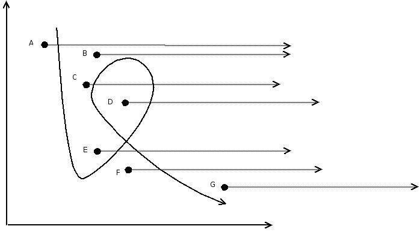

1 Even-odd rule: points A, D, F are in the path, and points B, C, E, G are
not in the path
1 Non-zero rules: Note that the path passes through the direction of the
ray, and point A is crossed twice from above, so point A is within the path.
Similarly, points D and F are within the path, and points B, C, E, and G are
not within the path.

### Fill the path with the scan method

The line segment that forms the path can be either a polyline or a
curve. In order to facilitate the implementation of the path filling
algorithm, it is necessary to dispose the curves as polylines. The following
discussion focuses on the implementation of path filling of polylines.

When filling, there may be more than one path, which may be the area formed by
multiple paths. Therefore, all paths must maintain the same winding rules,
otherwise, they cannot be compared between different paths to determine
whether a point is within the path.

### Use of path

How to use the path. Paths can be used for path drawing, path filling,
and path clipping.Path drawing is to discretize all the sub-path curves
in the path into vertices, and then connect all the vertices to draw the
path.Path filling is to discretize the path into a polygon and then fill
the polygon.Path clipping is similar to path filling, except that the
generated scan lines form an area.

Operation on the path: new path, destroyed path, copied path, closed
path, adding a straight line to the path, adding a curve to the path, and so
on.

## Gradient fill

Gradient fill refers to the use of a color linear gradient or a gradual
gradient of the brush, in a specified area, or path area, or graphics to fill.
With the gradient fill, we can achieve a more beautiful three-dimensional
control, which will be detailed in the follow-up. The current gradients
implemented by mGPlus are curved gradient fills and linear gradient fills.
## Color combination

In the age when product packaging is very important, every application
developer wants to develop a very beautiful and refined user interface to get
the user's first impression. The color combination is a powerful tool in this
area. It can realize the ever-changing combination of pictures and give your
interface an unexpected effect. mGPlus implements twelve combination modes.

## Architecture

## `MGPlusGraphics` summary
- MiniGUI have two way to use `MGPlus`：
- First create a memory `DC` and provide the `DC` directly to `MGPlus`, which
renders directly on the `DC`.
- Use `MGPlus` directly, completely rendered by `MGPlus` itself, and
finally get the rendered `DC` through the interface function.
- `MGPlus` internally provides a core data structure `MGPlusGraphics` , which
contains all the data of the graph, including information required for
rendering such as paths, gradients, and change matrices. The data structure is
not open to the public, only one handle (pointer) is exposed externally.
- Around the `MGPlusGraphics` structure, it will provide a series of
function interfaces to operate, including initialization, parameter
modification, various ways of rendering, and various 2D coordinate changes
(such as linear changes).MGPlus includes the following modules:
- `MGPlus` include follow module:
- pen
- brush
- path
- matrix
- image
- font
- text
- At the bottom, it will be implemented using `AGG` data and
interfaces.

## `MGPlus` Frame Diagram

- MGPlus is mainly composed of the above 9 categories. The Graphic class
implements all operations related to rendering, including color
gradient,
color combination, anti-aliasing, etc. The other 8 categories are associated
with Graphic in a one-way manner.
- The Matrix class is associated with the Path class, the Image class
and the Bitmap class, and the Font class is associated with the Text
class.

- `MGPlus` rebuild framework:

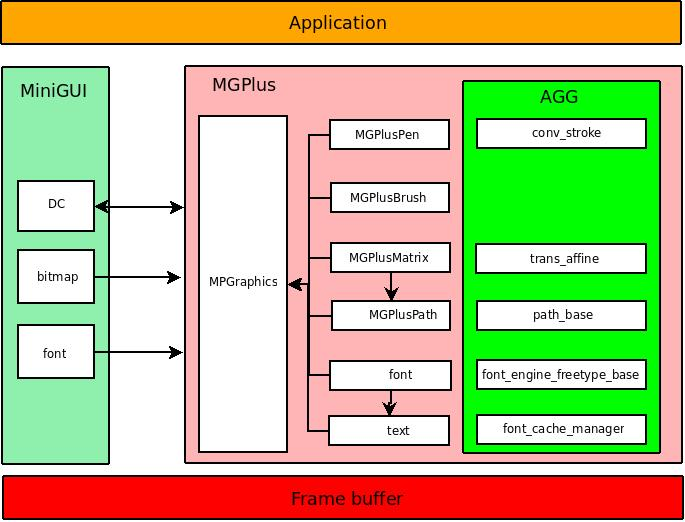

## `API` Applications

## Graphics
### Graphics Manage Functions

The Manage functions of Graphics include the functions of creating, deleting,
and copying. Details are as follows:

#### Create

There are two ways to create. One is to pass directly into `HDC` to create
`MGPlusGraphics`
Data structure, call function `MGPlusGraphicCreateFromDC` can successfully
return `HGRAPHICS`, a
`MGPlusGraphics` was created successfully.

```cpp
MG_EXPORT HGRAPHICS MGPlusGraphicCreateFromDC (HDC hdc);
```

Another way is to use a different pixel format to create a `MGPlusGraphics` 
data 
structure, using width and
The height is initially used to specify the size of the canvas, calling
`MGPlusGraphicCreate`
function. It should be noted that the result of the rendering requires the
user to call the interface function `MGPlusGraphicSave` to obtain it.

```cpp
MG_EXPORT HGRAPHICS MGPlusGraphicCreate (int width, int height);
MG_EXPORT MPStatus MGPlusGraphicSave (HGRAPHICS graphics, HDC hdc, int sx, int
Sy, int sw, int sh, int dx, int dy);
```

Another new way to create. This method creates a `MGPlusGraphics` for direct
drawing `DC`
, Directly incoming `DCs` operate as canvases.

```cpp
HGRAPHICS MGPlusGraphicCreateWithoutCanvas (HDC hdc);
```

#### Delete

When `MGPlusGraphics` is not needed, you need to release the `MGPlusGraphics`
data structure by calling
The `MGPlusGraphicDelete` function is fine.

```cpp
MPStatus MGPlusGraphicDelete (HGRAPHICS graphics);
```

There is another kind of color that can clear `MGPlusGraphic`, similar to
clear screen, this function is `MGPlusGraphicClear`. Under normal 
circumstances, 
when creating `MGPlusGraphics`, the contents of the relevant dc will also be
copied. Therefore, before using `MGPlusGraphicCopyFromDC`, you need to call 
this 
function to clear it. Usage is as follows:
```cpp
    MGPlusGraphicClear (graphics, 0);
    Hdc = GetClientDC (hWnd);
    FillBox (hdc, 0, 0, 1024, 768);
    MGPlusGraphicCopyFromDC (graphics, hdc, 0, 0, 0, 0, 0, 0);
    ReleaseDC (hdc);
```

#### Copy

```cpp
MPStatus MGPlusGraphicCopy (HGRAPHICS src_gs, HGRAPHICS dst_gs);
```

### Graphics color combination

mGPlus implements some basic alpha
Composition rules, combining source color and target color, mixing and
transparency effects in graphics and images.

Things to note when implementing:
- Many source images, such as some opaque images, do not store alpha for
their pixels
value. This type of source image provides an alpha value of 1.0 for all
its pixels.

- Many targets also have no place to store alpha
Values ​​(these are the results of a hybrid calculation). Such
goals implicitly discard such generated alpha
value. It is recommended that such objects treat their stored color values
​​as unpremultiplied values, and store the color values
​​and discard them.
Before the alpha value, the resulting color value is divided by the resulting
alpha value.

- The accuracy of the result depends on how the pixels are stored in the
target. For a few of a series of twelve synthesis operations, each color
will be
The alpha component provides at least 8
The image format of the storage bits should be sufficient as a target anyway.
Prior to rounding error dominates the result, less than for each component is
provided
8
The image format of the memory bits is limited to one or two synthesis
operations. For any translucent mixing type, image formats that do not
separately store color components are not a good candidate. For example, you
should not need to select pixels from a defined palette to match the mixed
equations, so that each operation can introduce a large number of errors.

- Almost all formats store pixels as discrete integers, rather than storing
them as floating-point values ​​used in the above equations.
The implementation can scale integer pixel values ​​to a range of
0.0 to 1.0
The floating point value between, or using slightly modified equations,
operates entirely within the integer domain, producing similar results to the
above equation.

- Internal implementations may approximate some equations. They can also
eliminate some steps to avoid unnecessary operations.

- Because of techniques that make the calculation more efficient by
simplifying the equation, a value of 0.0 is encountered on
non-premultiplied targets.
The alpha value of the result may be different for some implementation
implementations. Note that if the denominator (alpha)
Is 0, then divide by alpha under `SRC` rules
This simplified operation is technically illegal. However, because the result
is only expected when viewed in premultiplied form, the result is
0 of alpha
The value presented is essentially the resulting uncorrelated color component,
so in this case, the specific behavior should be unpredictable.

Users need to create two `MGPlus` Graphics if they need color combinations
Finally, they can mix their colors to get the effect of the color combination
we want.

The `MGPlusGraphics` color combination has a total of 12 combination modes,
which are:

```cpp
        MP_COMP_OP_CLEAR = 0, //The target color and the target alpha value
are cleared (Porter-Duff)
Clear rule). Neither the source color nor the target color is used as input
        MP_COMP_OP_SRC, //Copy the source color to the target color
(Porter-Duff Source
rule). Target color is not used as input
        MP_COMP_OP_DST, // did not involve the target color (Porter-Duff
Destination rule)
        MP_COMP_OP_SRC_OVER, // Synthesize the source color above the target
color (Porter-Duff Source Over
Destination rule)
        MP_COMP_OP_DST_OVER,
// Synthesize the target color above the source color, the result will replace
the target color (Porter-Duff Destination Over
Source rule)
        MP_COMP_OP_SRC_IN, //The source color in the target color will replace
the target color (Porter-Duff
Source In Destination Rule)
        MP_COMP_OP_DST_IN, //The target color part in the source color will
replace the target color (Porter-Duff
Destination In Source Rule)
        MP_COMP_OP_SRC_OUT, // The source color part other than the target
color will replace the target color (Porter-Duff
Source Held Out By Destination Rule)
        MP_COMP_OP_DST_OUT, //The target color part other than the source
color will replace the target color (Porter-Duff
Destination Held Out By Source Rule)
        MP_COMP_OP_SRC_ATOP,
// The source color part of the target color will be synthesized into the
target color (Porter-Duff Source Atop Destination
rule)
        MP_COMP_OP_DST_ATOP,
// Synthesize the target color part of the source color above the source color
and replace the target color (Porter-Duff Destination)
Atop Source rule)
        MP_COMP_OP_XOR,
// Combine the source color outside the target color with the target color
outside the source color (Porter-Duff Source
Xor Destination Rule)
```

The user can set the color combination mode according to the need and put the
required mode into the function `MGPlusSetCompositingMode`
The parameter `compositingMode` can be.

```cpp
MPStatus MGPlusSetCompositingMode ( HGRAPHICS graphics, CompositingMode compositingMode);
```

If the user wants to get the current color combination mode, directly call the
function `MGPlusGetCompositingMode` to get
`MGPlusGraphics` combination mode. The acquired combination pattern is stored 
in 
the address pointed to by `compositingMode`.

```cpp
MPStatus MGPlusGetCompositingMode (HGRAPHICS graphics, CompositingMode *compositingMode);
```

Note: Although the current color combination supports 32-bit color, 24-bit
color, 16-bit color, but in 24-bit and 16
In the case of bit depth, only simple color combinations are supported, namely
src-over mode.

In addition to the color combinations of graphics, you can also add pictures
to participate in color combinations. Users want to add pictures, first call
the function
`MGPlusGraphicLoadBitmapFromFile` to load the picture and then call the 
function 
`MGPlusDrawImage`
Draw the picture in `MGPlusGraphics`.

```cpp
MPStatus MGPlusGraphicLoadBitmapFromFile (HGRAPHICS graphics, int n_index,
Char* file);
```
Note: `n_index` is the prime value of the loaded image; file is the path of the
loaded image.

```cpp
MPStatus MGPlusDrawImage (HGRAPHICS graphics, int n_index, int x, int y, int w, Int h);
```

Note: `n_index` is the prime value of the loaded picture; x, y are the starting
position of the picture; w, h is the size of the picture; if w and h are -1,
it means that the picture will be drawn with the original size.

There is another way to load pictures. In the initialization of the program
calls the function in MiniGUI
`LoadBitmap` (For details, see MiniGUI.
`API` Manual) and then call `MGPlusGraphicLoadBitmap` and `MGPlusDrawImage` to
draw 
the picture
In `MGPlusGraphics`, remember to call MiniGUI in the end of the program
`UnloadBitmap`
The function frees memory space.

```cpp
MPStatus MGPlusGraphicLoadBitmap (HGRAPHICS graphics, int n_index, PBITMAP P_bitmap);
```
Note: `n_index` is the prime value of the loaded image; `p_bitmap` is the
address 
of the stored image.

After completing the corresponding work, be sure to call the function
`MGPlusGraphicBlend`, otherwise the effect of the color combination is
invisible. 

```cpp
MPStatus MGPlusGraphicBlend (HGRAPHICS src_gs, HGRAPHICS dst_gs);
```

For details on how to combine colors, see the example of color combinations:

```cpp

Static CTRLDATA CtrlYourTaste [] =
{
    {
        "static",
        WS_VISIBLE | SS_GROUPBOX,
        16+C_POS, 0, 200, 160+200,
        IDC_STATIC,
        "Composite_Mode",
        0
    },

...

};

Static DLGTEMPLATE DlgYourTaste =
{
    WS_BORDER | WS_CAPTION,
    WS_EX_AUTOSECONDARYDC,
    0, 0, 370+420, 300+290,
    "CompositeDemo(press F1,F2,F3...)",
    0, 0,
    TABLESIZE(CtrlYourTaste),
    NULL,
    0
};

Void CompositeDrawBmpBlend (HWND hDlg)
{
    RECT rect = {20, 20, 200, 200};

    HBRUSH hbrush = 0;
    HGRAPHICS hgs_comp;
    HGRAPHICS hgs;
    RECT cl_rc = {0};

HDC hdc = BeginPaint (hDlg);
// The mode of creating the path
    HPATH hpath = MGPlusPathCreate (MP_PATH_FILL_MODE_WINDING);
    /* first Clear the output_area that have draw last time.*/
    GetClientRect (hDlg, &cl_rc);
    FillBox (hdc, 0, 0, RECTW(cl_rc), RECTH(cl_rc));

// Create two MGPlus Graphics
    Hgs_comp = MGPlusGraphicCreateFromDC (hdc);
    Hgs = MGPlusGraphicCreateFromDC (hdc);
//Create a brush
    Hbrush = MGPlusBrushCreate (MP_BRUSH_TYPE_SOLIDCOLOR);
// Add a round path
    MGPlusPathAddArc (hpath, rect.left+RECTW(rect)/2,
            Rect.top+RECTH(rect)/2, RECTW(rect)/2, RECTH(rect)/2, 0, 360);
// Clear other colors in two MGPlus Graphics
    MGPlusGraphicClear (hgs_comp, 0x00000000);
    MGPlusGraphicClear (hgs, 0x00ffffff);
//Load and draw the picture
    MGPlusGraphicLoadBitmapFromFile (hgs_comp, 1, "res/butterfly.png");
    MGPlusDrawImage (hgs_comp, 1, 220, 35, -1, -1);

// Set the color of the brush
    MGPlusSetSolidBrushColor (hbrush, 0xDF6FF0FD);

// Set the pattern for combining pictures and graphics
    MGPlusSetCompositingMode (hgs_comp, (MPCompositingMode)MP_COMP_OP_SRC);
// Fill path
    MGPlusFillPath (hgs_comp, hbrush, hpath);
//reset the path
    MGPlusPathReset (hpath);
// Add a new graphic
    OffsetRect (&rect, 80, 0);
    MGPlusPathAddRoundRect (hpath, rect.left, rect.top, RECTW(rect), RECTH(rect), 50);
// Set the color of the brush
    MGPlusSetSolidBrushColor (hbrush, 0xBFFFC17F);
// Set the pattern of the graphics color combination
    MGPlusSetCompositingMode (hgs_comp, (MPCompositingMode)comp_mode);
   MGPlusFillPath (hgs_comp, hbrush, hpath);
// Mix two MGPlus Graphics
   MGPlusGraphicBlend (hgs_comp, hgs);
//Save MGPlus Graphics
    If (MGPlusGraphicSave (hgs, hdc, 0, 0, 0, 0, 0, 0) = MP_OK)
        Printf("save graphic failed!\n");
//Free memory space
   MGPlusPathDelete (hpath);
   MGPlusBrushDelete (hbrush)
   MGPlusGraphicDelete (hgs_comp);
   MGPlusGraphicDelete (hgs);
   EndPaint (hDlg, hdc);
}
...

Int MiniGUIMain (int argc, const char* argv[])
{
#ifdef _MGRM_PROCESSES
    JoinLayer (NAME_DEF_LAYER, "composite" , 0, 0);
#endif
    If (LoadBitmap (HDC_SCREEN, &bmp_butterfly, "res/butterfly.png"))
        Return 1;
    DlgYourTaste.controls = CtrlYourTaste;
    DialogBoxIndirectParam (&DlgYourTaste, HWND_DESKTOP, DialogBoxProc2, 0L);
    UnloadBitmap (&bmp_butterfly);
    Return 0;
}
#ifndef _MGRM_PROCESSES
#include <minigui/dti.c>
#endif
```


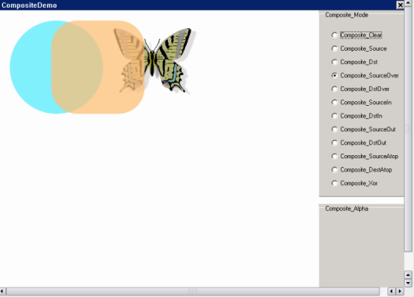

color combination

### Graphics mode

Graphics rendering mode is anti-aliasing control, including brush smooth mode,
path anti-aliasing and text anti-aliasing.

#### Brush's smooth mode

There are two kinds of smooth brush modes, which are:

```cpp
    /* Smoothing mode with speed.*/
    MP_SMOOTHING_SPEED = 0,
    /* Smoothing mode with quality.*/
    MP_SMOOTHING_QUALITY = 1,
```

The user wants to set the drawing mode of the brush. The
`MGPlusSetSmoothingMode` function can be used as the following example:
```cpp
 HPEN pen = MGPlusPenCreate (2, 0xFF505050);
 MGPlusSetSmoothingMode (hgraphics, MP_SMOOTHING_QUALITY);
 MGPlusDrawEllipse (hgraphics, pen, 0, 0, 200, 100);
```

To get the drawing mode of the current brush, call the `MGPlusGetSmoothingMode`
function,
The value of the drawing mode is stored in the address of the value.
```cpp
MPStatus MGPlusGetSmoothingMode (HGRAPHICS graphics, MPSmoothingMode* value);
```

#### Path antialiasing

Path anti-aliasing controls anti-aliasing with
`MP_PATH_RENDER_HINT_ANTIALIAS_ON` and `MP_PATH_RENDER_HINT_ANTIALIAS_OFF`.
```cpp
        MP_PATH_RENDER_HINT_ANTIALIAS_ON = 0,
        MP_PATH_RENDER_HINT_ANTIALIAS_OFF = 1,
```

Users want to set the path anti-aliasing drawing mode, use
`MGPlusSetPathRenderingHint` function, the specific usage is as follows:
```cpp
 HPEN pen = MGPlusPenCreate (2, 0xFF505050);
 MGPlusSetPathRenderingHint (hgraphics, MP_PATH_RENDER_HINT_ANTIALIAS_ON);
 MGPlusDrawEllipse (hgraphics, pen, 0, 0, 200, 100);
```

To get the current path anti-aliased drawing mode, call
`MGPlusGetPathRenderingHint` function,
The value of the drawing mode is stored in the address of the value.
```cpp
MPStatus MGPlusGetTextRenderingHint (HGRAPHICS graphics,MPTextRenderingHint*
Value);
```

Add the effect of the path before anti-aliasing

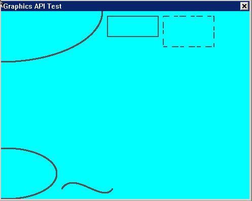

Adding the anti-aliasing effect of the path

Added anti-aliasing effect of the path

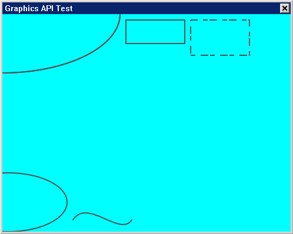

Adding anti-aliasing effect to the path

#### Text Antialiasing

Anti-aliasing of text is controlled by `MP_TEXT_RENDER_HINT_ANTIALIAS_ON` and
`MP_TEXT_RENDER_HINT_ANTIALIAS_OFF`.
```cpp
      MP_TEXT_RENDER_HINT_ANTIALIAS_ON = 0,
      MP_TEXT_RENDER_HINT_ANTIALIAS_OFF = 1
```

Users want to set the text anti-aliasing drawing mode, you can use
`MGPlusSetTextRenderingHint` function, the specific usage of the following
example:
```cpp
   Static GLYPHMETRICS metrics;
   Char* test_text = "~!@#$%^&*(_)QWERTYUIOASDFGHJKL:ZXCVBNM<ertfgyubhnjgi>.";
   Char text[512] = {0};
   GLYPHDATA data_size={0};
   HFONT hfont = MGPlusCreateFont ("timesi.ttf", 0, MP_GLYPH_REN_OUTLINE,60,60,true);
   Strcpy (text, ren_str[2]);
   Strcat (text, test_text);
   MGPlusSetTextRenderingHint (hgraphics, MP_TEXT_RENDER_HINT_ANTIALIAS_ON);
   for (i = 0; i < strlen(text); i++){
    MGPlusGetGlyphOutline (hfont,text[i],&metrics,&data_size);
         MGPlusDrawGlyph (hgraphics, hfont, x, y, &data_size, 0xff908070);
        x += metrics.adv_x;
        y += metrics.adv_y;
    }
```

To get the current text anti-aliasing drawing mode, call the function
`MGPlusGetTextRenderingHint`,
The value of the drawing mode is stored in the address of the value.
```cpp
MPStatus MGPlusGetTextRenderingHint (HGRAPHICS graphics,MPTextRenderingHint*
Value);
```

Add text before antialiasing

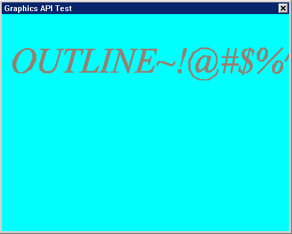

Add text anti-aliasing effect

Added text anti-aliasing effect

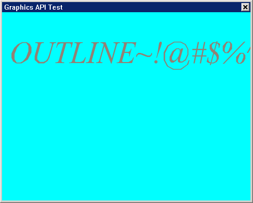

Add text anti-aliasing effect

### World Coordinate System Conversion

The conversion of the world coordinate system is the conversion (translation,
scaling, rotation) of the coordinates of `MGPlus` Graphics. There is also a 
path 
conversion of mgplus, which is the conversion of the coordinates of the
graphics coordinates (translation, scaling, rotation).

#### Settings

The user needs to set the world coordinate system to call the
`MGPlusSetWorldTransform` function.

```cpp
MPStatus MGPlusSetWorldTransform (HGRAPHICS graphics, MGPlusMatrix *matrix);
```

The definition of the parameter matrix is ​​as follows:
```cpp
/*
*[ sx, shy, 0 ]
*| shx, sy , 0 |
*[ tx, ty , 0 ]
*/
Struct MgPlusMatrix
{
        Double sx, shy, shx, sy, tx, ty;; //transformation matrix
};
```

Reset the function to `MGPlusResetWorldTransform`.
```cpp
MGPlus MGPlusResetWorldTransform (HGRAPHICS graphics);
```

#### Translation

If the user wants to translate, it should be noted that: the first world
coordinate is (0, 0), if you want to figure around (100,
100) Rotate the coordinates first to (100, 100), ie using
`MGPlusTranslateWorldTransform(graphics,-100`, -100), then use Rotatate
rotation, and finally use
`MGPlusTranslateWorldTransform(graphics`, 100, 100), translate coordinates 
back. 

```cpp
MPStatus MGPlusTranslateWorldTransform (HGRAPHICS graphics, float dx, float Dy);
```

#### Zoom

Call the function `MGPlusScaleWorldTransform` , users can zoom 
`MGPlusGraphics`. 

```cpp
MGPlus MGPlusScaleWorldTransform (HGRAPHICS graphics, float sx, float sy);
```

#### Rotation

The function `MGPlusRotateWorldTransform` is called and the user can rotate the
`MGPlus` Graphics.

```cpp
MPStatus MGPlusRotateWorldTransform (HGRAPHICS graphics, float angle);
```

The specific usage can refer to the following example of the conversion of the
world coordinate system:

```cpp
......

Static ARGB b [3] = {0xFFFF0000, 0xFF00FF00, 0xFFFF00FF};
Static MPPOINT zeropoint = {70,105};
Static RECT zerorect = {50,50,200,200};
HWND hWnd;
HDC hdc;
......

    HGRAPHICS hGraphics;
    HPATH hPath;
    HBRUSH hBrush;
......
    Hdc = BeginPaint (hWnd);
   //Create graphics, paths, and brushes
    hGraphics = MGPlusGraphicCreateFromDC (hdc);
    hPath = MGPlusPathCreate (0);
    hBrush = MGPlusBrushCreate (MP_BRUSH_TYPE_PATHGRADIENT);

    // Set the brush
    MGPlusSetPathGradientBrushCenterPoint (hBrush, &zeropoint);
    MGPlusSetPathGradientBrushCenterColor (hBrush, 0xFF0000FF);
    MGPlusSetPathGradientBrushSurroundColors (hBrush,b,3);
    MGPlusSetPathGradientBrushSurroundRect (hBrush, &zerorect);

   //Draw a shape and fill it
    MGPlusPathAddRectangle (hPath, 100, 100, 100, 100);
    MGPlusFillPath (hGraphics, hBrush, hPath);

    // conversion of the world coordinate system (translation, scaling and
rotation)
    MGPlusTranslateWorldTransform (hGraphics, -100, -100);
    MGPlusScaleWorldTransform (hGraphics, 2, 1);
    MGPlusRotateWorldTransform (hGraphics, 70);
    MGPlusTranslateWorldTransform (hGraphics, 100, 100);

   // Refill the converted graphics
    MGPlusFillPath (hGraphics, hBrush, hPath);

   //Save graphics
   MGPlusGraphicSave (hGraphics, hdc, 0, 0, 0, 0, 0, 0);

   //Free memory space
   MGPlusBrushDelete (hBrush);
   MGPlusPathDelete (hPath);
   MGPlusGraphicDelete (hGraphics);
   EndPaint (hWnd,hdc);
   ......
```


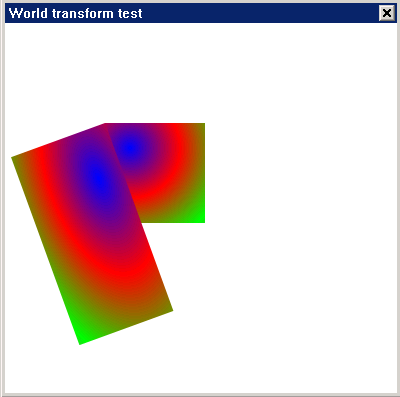

Conversion of world coordinate system

View Description: The bottom layer is the original graphics, the upper layer
is twice the x-axis magnification, and the rotated 70-degree conversion
graphics.

### Font Rendering

Currently, mgplus only supports rendering of vector fonts, so if you need font
rendering functionality, you first need to open it when compiling mgplus
--enable-ft2support
The option is used to support freetype2 vector fonts, and requires the client
to add freetype libraries when compiling the application.

Users want to draw fonts, first create a font using the `MGPlusCreateFont`
function.
```cpp
HFONT MGPlusCreateFont (const char* font_name, unsigned face_index,
MPGlyphRendering ren_type, Unsigned int width, unsigned int height, BOOL flip_y)
```

There are six modes for font rendering, as follows:
```cpp
        /* retrieves the glyph bitmap direct from ft2. */
        MP_GLYPH_REN_NATIVE_MONO,
        MP_GLYPH_REN_NATIVE_GRAY8,
        /* retrieves the curve data points in the rasterizer's native
        * format and uses the font's design units.
        */
        MP_GLYPH_REN_OUTLINE,
        /* retrieves the glyph bitmap from agg render. */
        MP_GLYPH_REN_AGG_MONO,
        MP_GLYPH_REN_AGG_GRAY8,
        /* only retrieves the GLYPHMETRICS structure specified by lpgm.*/
        MP_GLYPH_REN_METRICS,
```

After the font is created, the outline data of the font is obtained by the
function `MGPlusGetGlyphOutline`.
```cpp
 MPStatus MGPlusGetGlyphOutline (HFONT hfont, unsigned uchar, LPGLYPHMETRICSL pgm, LPGLYPHDATA lpdata);
```
The parameter lpdata is the data for storing the font outline.

The function of `LPGLYPHMETRICS`
The lpgm parameter includes the position, direction and size of the font
outline. The specific definition is as follows:
```cpp
Typedef struct _GLYPHMETRICS {
        /* Specifies the x- and y-coordinates of the upper left
        * corner of the rectangular rectangle that completely encloses the
          glyph.
        */
        Unsigned char bbox_x;
        Unsigned char bbox_y;
        /* Specifies the width or height of the smallest rectangle that
        * completely encloses the glyph (its box).
        */
        Unsigned char bbox_w;
        Unsigned char bbox_h;
        /* Specifies the horizontal/vertical distance from the origin of the Current
        * character cell to the origin of the next character cell.
        */
        Short adv_x;
        Short adv_y;
} GLYPHMETRICS, *LPGLYPHMETRICS;
```

Then the font can be drawn according to the outline data of the font, or the
path structure of the font can be used to rotate the font. The functions used
are as follows:

```cpp
 MPStatus MGPlusDrawGlyph (HGRAPHICS graphics, HFONT hfont, int x, int y, LPGLYPHDATA lpdata, ARGB color);
```

Note: x, y refer to the starting coordinates of the drawing font; lpdata is
the data for storing the font outline; color refers to the drawing color of
the font.

```cpp
 HPATH MGPlusGetGlyphPath (int x, int y, LPGLYPHDATA lpdata)
```
Note: x, y refer to the starting coordinates of the drawing font.

Finally, after the corresponding operation is completed, the font is deleted
to avoid memory leaks. The function is `MGPlusDeleteFont`.

```cpp
MGPlusDeleteFont (HFONT hfont);
```

The font rotation sample code is as follows:
```cpp
   ......
  HDC hdc;
  HWND hMainhWnd;
  ......

   Hdc = GetClientDC (hMainhWnd);
   HGRAPHICS hgraphics = MGPlusGraphicCreateFromDC (hdc);

   Int i = 0;
   Float x =200;
   Float y = 116;
   Float angle = 5;

   GLYPHMETRICS metrics;
   Char* text = "GLYPH OUTLINE: ABCDEFGHIJKLMNOPQRSTUVWXYZ,abcdefghijklmnopqrstuvwxyz.";
   GLYPHDATA glyph_data = {0};
   Int orig_x = x, orig_y = y;

   //Create a vector font
   HFONT hfont = MGPlusCreateFont ("timesi.ttf", 0, MP_GLYPH_REN_OUTLINE, 18, 18, TRUE);

   // Create a brush, and set the color
   Hbrush = MGPlusBrushCreate (MP_BRUSH_TYPE_SOLIDCOLOR);
   MGPlusSetSolidBrushColor (hbrush, 0xFF009000);

   For (i = 0; i < strlen(text); i++) {
             // Get the outline of the font
         MGPlusGetGlyphOutline (hfont, text[i], &metrics, &glyph_data)
             // Get the path structure of the outline of the font
         Hpath = MGPlusGetGlyphPath (x, y, &glyph_data);

         if (hpath = NULL){
             /* Transform used path Martix.*/

               //The conversion of the path
              MGPlusPathTranslate (hpath, -orig_x, -orig_y) ;
              MGPlusPathRotate (hpath, angle);
              MGPlusPathTranslate (hpath, orig_x, orig_y) ;

              MGPlusPathTransform (hpath);

               // Fill path
              MGPlusFillPath (hgs, hbrush, hpath);

              //reset the path
              MGPlusPathReset (hpath);
              MGPlusPathDelete (hpath);
  }
      x += metrics.adv_x;
      y += metrics.adv_y;
 }

    MGPlusBrushDelete (hbrush);
    MGPlusGraphicSave (hgraphics, hdc, 0, 0, 0, 0, 0, 0);
    MGPlusDeleteFont (hfont);
    MGPlusGraphicDelete (hgraphics);
    ReleaseDC (hdc);
......
```


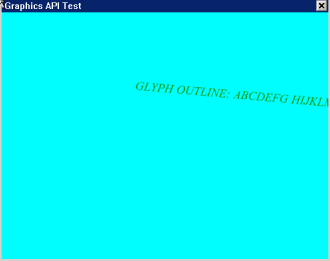

font rotation

## Path

### Path Management

Path: A path consists of a set of strictly ordered polylines and curves. Paths
can be used for filling and cutting. By providing support for the path, we can
achieve drawing of vector graphics, support for vector graphics, such as
infinity zooming and rotation, as well as providing better support for vector
fonts.

#### Create

When `MGPlusPathCreate` creates a path, you need to select the winding rule. 
The 
winding rule is divided into two types:
- `MP_PATH_FILL_MODE_WINDING` // Non-zero rule
- `MP_PATH_FILL_MODE_ALTERNATE` // odd and even rules

E.g:
```cpp
HPATH path;
Path = MGPlusPathCreate (MP_PATH_FILL_MODE_ALTERNATE) ;//path is filled with a parity rule
```

#### Delete

Release path.
If you do not release the memory in the application, it will lead to memory
leaks and coredump.

```cpp
MPStatus MGPlusPathDelete (HPATH path);
```

#### Reset

Reset the path.
Clear all the contents of the path.
```cpp
MPStatus MGPlusPathReset (HPATH path);
```

#### fill path

`MGPlusFillPath`
Before filling the path, you must determine the Brush fill feature and then
use `MGPlusGraphicSave` to draw to the screen.
```cpp
MPStatus MGPlusFillPath (HGRAPHICS graphics, HBRUSH brush, HPATH path)
```
The specific application is explained in detail in the next section "Adding a
graphic to a path".

#### Add graphics to the path
####+ Add Line

Pass the coordinates of the two points to draw a straight line.
```cpp
MPStatus MGPlusAddPathLine (HPATH path, float x1, float y1, float x2, float Y2);
MPStatus MGPlusAddPathLineI (HPATH path, int x1, int y1, int x2, int y2);
```

Pass in a group of "points" and draw straight lines in order of the points.
Count is the number of vertices.
```cpp
MGState MGPlusPathAddLines (HPATH path, const Point* points, int count);
```
E.g:
```cpp
//define the HDC
HDC hdc;
Hdc = GetClientDC (hWnd);

//Insert HDC to create graphics
HGRAPHICS graphics= MGPlusGraphicCreateFromDC (hdc);

// Create a brush with a single fill mode.
HBRUSH brush = MGPlusBrushCreate (MP_BRUSH_TYPE_SOLIDCOLOR);

// Set the brush's color to blue
MGPlusSetSolidBrushColor (brush, 0xFF0000FF);

//Create path selection odd and even winding rules
HPATH path = MGPlusPathCreate (MP_PATH_FILL_MODE_ALTERNATE);

//Create a set of vertices
MPPOINT point_lines[] = {{0, 0}, {100, 0}, {100,100}, {0, 100}};

// Add lines to the path, and notify the number of vertices to 4.
MGPlusPathAddLines ( path, point_lines, 4);

// Fill path
MGPlusFillPath (graphics, brush, path);

//Outputs the contents of the Graphics canvas to the specified device DC
MGPlusGraphicSave (graphics, hdc, 0, 0, 0, 0, 0, 0);
...
// Destroy.... releases memory
```


Drawing Effective Results

####+ Add an arc

(cx, cy) is the center point coordinate of the ellipse, rx is the radius of
the X axis, ry
For the y-axis radius, startangle is the arc start angle, and `sweepAngle` is
the radians between the start and end angles.
```cpp
MPStatus MGPlusPathAddArc (HPATH path, float cx, float cy, float rx, float Ry, float startAngle, float sweepAngle);

MPStatus MGPlusPathAddArcI (HPATH path, int cx, int cy, int rx, int ry, float startAngle, float sweepAngle);
```

E.g:
```cpp
//define the HDC
HDC hdc;
Hdc = GetClientDC (hWnd);

//Insert HDC to create graphics
HGRAPHICS graphics= MGPlusGraphicCreateFromDC (hdc);

// Create a brush with a single fill mode.
HBRUSH brush = MGPlusBrushCreate (MP_BRUSH_TYPE_SOLIDCOLOR);

// Set the brush's color to blue
MGPlusSetSolidBrushColor (brush, 0xFF0000FF);

//Create path selection odd and even winding rules
HPATH path = MGPlusPathCreate (MP_PATH_FILL_MODE_ALTERNATE);

//(200, 200) is the center of the ellipse, (100, 100) is the radius,
90 is the arc start angle, and 180 is the arc between the start angle and the
end angle.
MGPlusPathAddArc (path , 200,200,100,100,90, 180);

// Fill path
MGPlusFillPath (graphics, brush, path);

//Outputs the contents of the Graphics canvas to the specified device DC
MGPlusGraphicSave (graphics, hdc, 0, 0, 0, 0, 0, 0);
...
// Destroy....Frees memory
```

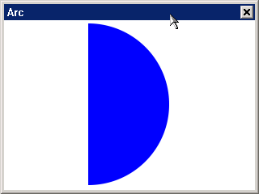

####+ Add Bezier Curve

(x1,y1) is the starting point, (x2,y2) is the first control point, (x3,
Y3) is the second control point, and (x4, y4) is the end point.

```cpp
MPStatus MGPlusPathAddBezier (HPATH path, float x1, float y1, float x2, float
Y2, float x3, float y3, float x4, float y4);

MPStatus MGPlusPathAddBezierI (HPATH path, int x1, int y1, int x2, int y2, int
X3, int y3, int x4, int y4);
```

E.g:
```cpp
//define the HDC
HDC hdc;
Hdc = GetClientDC (hWnd);

//Insert HDC to create graphics
HGRAPHICS graphics= MGPlusGraphicCreateFromDC (hdc);

// Create a brush with a single fill mode.
HBRUSH brush = MGPlusBrushCreate (MP_BRUSH_TYPE_SOLIDCOLOR);

// Set the brush's color to blue
MGPlusSetSolidBrushColor (brush, 0xFF0000FF);

//Create path selection odd and even winding rules
HPATH path = MGPlusPathCreate (MP_PATH_FILL_MODE_ALTERNATE);

//Create a set of vertices
MPPOINT point_lines[] = {{0, 0}, {100, 0}, {100,100}, {0, 100}};

// Add Bezier to the path, (11, 11) as the starting point, (88, 333) as the
first control point, (99,
0) For the second control point, (222, 111) is the end point.
MGPlusPathAddBezier (path, 11,11, 88,333, 99,0, 222,111);

//Outputs the contents of the Graphics canvas to the specified device DC
MGPlusGraphicSave (graphics, hdc, 0, 0, 0, 0, 0, 0);
//
// Destroy.... releases memory
```

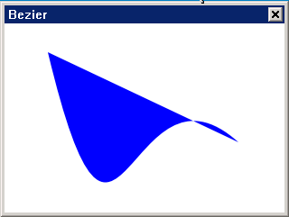

####+ Add a rectangle

(x, y) is the vertices of the rectangle, and (width, height) is the length and
width of the rectangle.
```cpp
MPStatus MGPlusPathAddRectangle (HPATH path, float x, float y, float width,
Float height);

MPStatus MGPlusPathAddRectangleI (HPATH path, int x, int y, int width, int
Height);
```

E.g:
```cpp
//define the HDC
HDC hdc;
Hdc = GetClientDC (hWnd);

//Insert HDC to create graphics
HGRAPHICS graphics= MGPlusGraphicCreateFromDC (hdc);

// Create a brush with a single fill mode.
HBRUSH brush = MGPlusBrushCreate (MP_BRUSH_TYPE_SOLIDCOLOR);

// Set the brush's color to blue
MGPlusSetSolidBrushColor (brush, 0xFF0000FF);

//Create path selection odd and even winding rules
HPATH path = MGPlusPathCreate (MP_PATH_FILL_MODE_ALTERNATE);

// Add 3 rectangles to path path
MGPlusPathAddRectangle ( path, 50, 100, 100, 100);
MGPlusPathAddRectangle ( path, 75, 150, 100, 100);
MGPlusPathAddRectangle ( path, 100, 175, 100, 100);

// Fill path
MGPlusFillPath (graphics, brush, path);

//Output the contents of the Graphics canvas to the specified device DC
MGPlusGraphicSave (graphics, hdc, 0, 0, 0, 0, 0, 0);
...
// Destroy....Frees memory
```

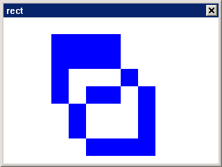


####+ Add Rounded Rectangle

(x, y) is a rectangle vertex, (width,
Height) is the length and width of the rectangle. The rounded rectangle of the
rounded rectangle is calculated by a rectangle, and the size of the rectangle
is used (
Rx, ry) to control.
```cpp
MGPlusPathAddRoundRectEx (HPATH path, int x, int y, int width, int height, int
Rx, int ry)
```

E.g:
```cpp
//define the HDC
HDC hdc;
Hdc = GetClientDC (hWnd);

//Insert HDC to create graphics
HGRAPHICS graphics= MGPlusGraphicCreateFromDC (hdc);

// Create a brush with a single fill mode.
HBRUSH brush = MGPlusBrushCreate (MP_BRUSH_TYPE_SOLIDCOLOR);

// Set the brush's color to blue
MGPlusSetSolidBrushColor (brush, 0xFF0000FF);

//Create path selection odd and even winding rules
HPATH path = MGPlusPathCreate (MP_PATH_FILL_MODE_ALTERNATE);

// Add a rounded rectangle to the path
MGPlusPathAddRoundRectEx (path, 100, 375, 100, 100, 10, 10);

// Fill path
MGPlusFillPath (graphics, brush, path);
//Outputs the contents of the Graphics canvas to the specified device DC
MGPlusGraphicSave (graphics, hdc, 0, 0, 0, 0, 0, 0);
..
// Destroy....Frees memory
```

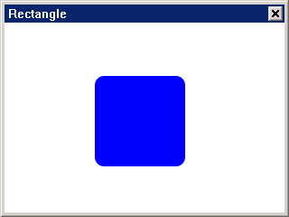


####+ Add ellipse

(cx, cy) is an ellipse center, (rx, ry) is an elliptical x-radius, y-radius,
clockwise
In the drawing direction of the ellipse, `TRUE` is clockwise and `FALSE` is
counterclockwise.
```cpp
MPStatus MGPlusPathAddEllipse (HPATH path, float cx, float cy, float rx, float
Ry, BOOL clockwise);

MPStatus MGPlusPathAddEllipseI (HPATH path, int cx, int cy, int rx, int ry,
BOOL clockwise);
```

E.g:
```cpp
//define the HDC
HDC hdc;
Hdc = GetClientDC (hWnd);

//Insert HDC to create graphics
HGRAPHICS graphics= MGPlusGraphicCreateFromDC (hdc);

// Create a brush with a single fill mode.
HBRUSH brush = MGPlusBrushCreate (MP_BRUSH_TYPE_SOLIDCOLOR);

// Set the brush's color to blue
MGPlusSetSolidBrushColor (brush, 0xFF0000FF);

//Create a path to select a non-zero winding rule
HPATH path = MGPlusPathCreate (MP_PATH_FILL_MODE_WINDING);

// Add a rectangle
MGPlusPathAddRectangle ( path, 625, 350, 200, 75);
//Add the circle to path path, (675, 425) to the center of the ellipse, (25
25) for the elliptical x-radius, y-radiusTRUE clockwise, FALSE
counterclockwise.
MGPlusPathAddEllipse ( path, 675, 425,25 ,25, FALSE );
MGPlusPathAddEllipse ( path,775, 425,25 ,25, TRUE);

// Fill path
MGPlusFillPath (graphics, brush, path);

//Outputs the contents of the Graphics canvas to the specified device DC
MGPlusGraphicSave (graphics, hdc, 0, 0, 0, 0, 0, 0);
...
// Destroy....Frees memory
```

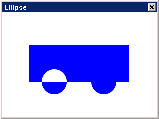


####+ Add curves

Points Vertex array, count Number of vertices.
```cpp
MGPStatus MGPlusPathAddCurve (HPATH path, const POINT* points, int count);
```

E.g:
```cpp
//define the HDC
HDC hdc;
Hdc = GetClientDC (hWnd);

//Insert HDC to create graphics
HGRAPHICS graphics= MGPlusGraphicCreateFromDC (hdc);

// Create a brush with a single fill mode.
HBRUSH brush = MGPlusBrushCreate (MP_BRUSH_TYPE_SOLIDCOLOR);

// Set the brush's color to blue
MGPlusSetSolidBrushColor (brush, 0xFF0000FF);

//Create a path to select a non-zero winding rule
HPATH path = MGPlusPathCreate (MP_PATH_FILL_MODE_WINDING);

// Add a rectangle
MPPOINT point [4];

Point [0].x = 25.6;
Point [0].y = 128.0;
Point [1].x = 102.4;
Point [1].y = 230.4;
Pointe [2].x = 153.6;
Pointe [2].y = 25.6;
Point [3].x = 230.4;
Point [3].y = 128;

MGPlusPathAddCurve (path, point, 4);

// Fill path
MGPlusFillPath (graphics, brush, path);

//Outputs the contents of the Graphics canvas to the specified device DC
MGPlusGraphicSave (graphics, hdc, 0, 0, 0, 0, 0, 0);
...
// Destroy....Frees memory
```

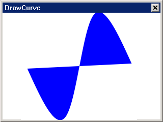


####+ Add path

Add the contents of `add_path` to path.
```cpp
MPStatus MGPlusPathAddPath (HPATH path, HPATH add_path);
```

E.g:
```cpp
//define the HDC
HDC hdc;
Hdc = GetClientDC (hWnd);

//Insert HDC to create graphics
HGRAPHICS graphics= MGPlusGraphicCreateFromDC (hdc);

// Create a brush with a single fill mode.
HBRUSH brush = MGPlusBrushCreate (MP_BRUSH_TYPE_SOLIDCOLOR);

// Set the brush's color to blue
MGPlusSetSolidBrushColor (brush, 0xFF0000FF);

//Create a path to select a non-zero winding rule
HPATH path = MGPlusPathCreate (MP_PATH_FILL_MODE_WINDING);

// Add path to path
MGPlusPathAddRectangle ( path, 625, 350, 200, 75);
MGPlusPathAddEllipse ( path, 675, 425,25 ,25, FALSE );
MGPlusPathAddEllipse ( path,775, 425,25 ,25, TRUE);

//Create target path
HPATH add_path = MGPlusPathCreate (MP_PATH_FILL_MODE_WINDING);

// Add the contents of path to add_path
MPStatus MGPlusPathAddPath (add_path, path);

// Fill path
MGPlusFillPath (graphics, brush, add_path);

//Output the contents of the Graphics canvas to the specified device DC
MGPlusGraphicSave (graphics, hdc, 0, 0, 0, 0, 0, 0);
...
// Destroy....Frees memory
```

#### Drawing path

`MGPlusDrawPath`
To draw the path, you must determine the Pen drawing properties and then use
`MGPlusGraphicSave` to draw to the screen.
```cpp
MPStatus MGPlusDrawPath (HGRAPHICS graphics, HPEN pen, HPATH path);
```
`MGPlusDrawPath` is similar to `MGPlusFillPath`.

E.g:
```cpp
//define the HDC
HDC hdc;
Hdc = GetClientDC (hWnd);

//Insert HDC to create graphics
HGRAPHICS graphics= MGPlusGraphicCreateFromDC (hdc);

// Create a pen with a width of 9 and a blue color.
HPEN pen = MGPlusPenCreate (9, 0xFF0000FF);

//Create a path to select a non-zero winding rule
HPATH path = MGPlusPathCreate (MP_PATH_FILL_MODE_WINDING);

// Add a rectangle
MGPlusPathAddRectangle ( path, 625, 350, 200, 75);

//Add the circle to path path, (675, 425) to the center of the ellipse, (25
25) for the ellipse x-radius, y-radiusTRUE clockwise, FALSE counterclockwise.
MGPlusPathAddEllipse ( path, 675, 425,25 ,25, FALSE );
MGPlusPathAddEllipse ( path,775, 425,25 ,25, TRUE);

// draw the path
MGPlusDrawPath (graphics, pen, path);

//Outputs the contents of the Graphics canvas to the specified device DC
MGPlusGraphicSave (graphics, hdc, 0, 0, 0, 0, 0, 0);
...
// Destroy....Frees memory
```

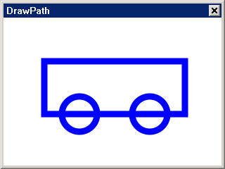


#### Open and close

Start a new subpath in the path. Subpaths allow you to divide a path into
sections and use it.
```cpp
MGPStatus MGPlusPathStartFigure (HPATH path);
```

Closed path.
Once the subpath is closed, the next line drawn in the path starts from
another path.
```cpp
MGPStatus MGPlusPathCloseFigure (HPATH paht);
```

E.g:
```cpp
//define the HDC
HDC hdc;
Hdc = GetClientDC (hWnd);

//Insert HDC to create graphics
HGRAPHICS graphics= MGPlusGraphicCreateFromDC (hdc);

//Create a pen 
HPEN pen = MGPlusPenCreate (9, 0xFF0000FF);

//Create path
HPATH path = MGPlusPathCreate (MP_PATH_FILL_MODE_ALTERNATE);

// Create a new path graphic.
MGPlusPathStartFigure (path);

// Add two lines
MGPlusPathAddLine (path, 100, 100, 200, 10);
MGPlusPathAddLine (path, 200, 10, 300, 100);

//Close path
MGPlusPathCloseFigure (path);

// draw the path
MGPlusDrawPath (graphics, pen, path);

//Outputs the contents of the Graphics canvas to the specified device DC
MGPlusGraphicSave (graphics, hdc, 0, 0, 0, 0, 0, 0);
...
// Destroy....Frees memory
```

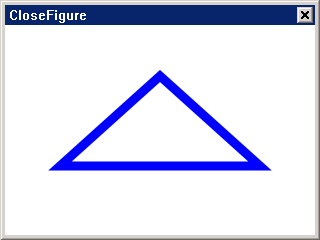


#### Line Control

Move the current pen to another point without drawing a line.
```cpp
MPStatus MGPlusPathMoveto (HPATH path, float x, float y);

MPStatus MGPlusPathMovetoI (HPATH path, int x, int y);
```

Use the current pen's point as a starting point to draw another line.
```cpp
MPStatus MGPlusPathLineto (HPATH path, float x, float y);

MPStatus MGPlusPathLinetoI (HPATH path, int x, int y);
```

E.g:
```cpp
//define the HDC
HDC hdc;
Hdc = GetClientDC (hWnd);

//Insert HDC to create graphics
HGRAPHICS graphics= MGPlusGraphicCreateFromDC (hdc);

//Create a pen 
HPEN pen = MGPlusPenCreate (9, 0xFF0000FF);

//Create path
HPATH path = MGPlusPathCreate (MP_PATH_FILL_MODE_ALTERNATE);

//Settings
 MGPlusPathMoveto (path, 100,100);
 MGPlusPathLineto (path, 200,100);
 MGPlusPathLineto (path, 200,200);
 MGPlusPathMoveto (path, 100,200);
// draw the path
MGPlusDrawPath (graphics, pen, path);

//Outputs the contents of the Graphics canvas to the specified device DC
MGPlusGraphicSave (graphics, hdc, 0, 0, 0, 0, 0, 0);
...
// Destroy.... releases memory
```


#### Get path

```cpp
//Get the path vertex
MPStatus MGPlusPathGetPointCount (HPATH path, int* count);

//Get the number of path vertices
MPStatus MGPlusPathGetPoints (HPATH path, int* count, MPPOINT** pt);

// Gets the vertex of the specified sequence number and reads the vertex type.
MPStatus MGPlusPathGetVertex (HPATH path, int idx, double* x, double* y, int*
Cmd);

//Set a point, rotate the path around this vertex
MGPlusPathRotateAroundPoint (HPATH path, const MPPOINT* pt, float angle);

//Set the drawing direction of the path
MPStatus MGPlusPathSetAllOrientation (HPATH path, MPOrientation orientation);
```

E.g:
```cpp
//define the HDC
HDC hdc;
Hdc = GetClientDC (hWnd);

//Insert HDC to create graphics
HGRAPHICS graphics= MGPlusGraphicCreateFromDC (hdc);

//Create a pen 
HPEN pen = MGPlusPenCreate (9, 0xFF0000FF);

//Create path
HPATH path = MGPlusPathCreate (MP_PATH_FILL_MODE_ALTERNATE);

// Add a rectangle
MGPlusPathAddRectangleI (path, 100, 100, 200, 100);

Int i = 0, count=0;
MPPOINT* pt = NULL;
MPPOINT center = {100.0, 50.0};

//Get the number of path vertices
MGPlusPathGetPointCount (path ,&count);

//Get the path vertex
MGPlusPathGetPoints (path, &count, &pt);

Double x = 0;
Double y = 0;
Int cmd = 0;
//// Get the second vertex and read the vertex type.
MGPlusPathGetVertex (path, 2, &x, &y, &cmd);

//Set a point, rotate this vertex as the center
MGPlusPathRotateAroundPoint (path, &center, -10);

             // Apply matrix transformation
MGPlusPathTransform (path) ;

//Set the drawing direction of the path
MGPlusPathSetAllOrientation (path, MP_ORIENTATION_CW);

// Fill path
MGPlusDrawPath (graphics, brush, pen);

//Outputs the contents of the Graphics canvas to the specified device DC
MGPlusGraphicSave (graphics, hdc, 0, 0, 0, 0, 0, 0);
...
// Destroy....Frees memory
```

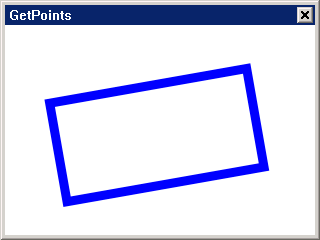

### path conversion

mGPlus provides matrix objects, a very powerful tool that makes it very easy
to write rotations, translations, and scales for graphics. A matrix object is
always associated with a graphic transformation pair. For example, the `PATH`
has a Transform method. One of its parameters can accept the address of the
matrix object. Each time the path is drawn, it can be based on the
transformation matrix. draw. The graphics transformation is stored in the
transformation matrix, so the path transformation is the transformation of the
graph. Path conversion matrices can be set, and translations, scaling, and
rotations can also be applied to the path.

#### Settings

Call the `MGPlusPathSetTransform` function to set the transformation matrix for
the path.
```cpp
MPStatus MGPlusPathSetTransform (HPATH path, MPMatrix *matrix);
```
The definition of the parameter matrix is as follows:
```cpp
/*
*[ sx, shy, 0 ]
*| shx, sy , 0 |
*[ tx, ty , 0 ]
*/
Struct MgPlusMatrix
{
        Double sx, shy, shx, sy, tx, ty;; //transformation matrix
};
```

Call the `MGPlusPathResetTransform` function to reset the conversion matrix for
the path.

```cpp
MPStatus MGPlusPathResetTransform (HPATH path);
```

#### Translation

Calling the `MGPlusPathTranslate` function, the path is translated from the
original position along the x and y axes (dx, dy).

```cpp
MPStatus MGPlusPathTranslate (HPATH path, float dx, float dy);
```

#### Zoom

The function `MGPlusPathScale` is used to scale the path. The value of sx , sy
is greater than 1 is magnified, less than 1 is reduced.

```cpp
MPStatus MGPlusPathScale (HPATH path, float sx, float sy);
```

#### Rotation

The function `MGPlusPathRotate` is used for the rotation of the path, and the
parameter angle is the rotation angle value.

```cpp
MPStatus MGPlusPathRotate (HPATH path, float angle);
```

Note: After the matrix is converted as required, the
`MGPlusPathTransform` function must be called. This function applies the matrix
transformation; otherwise, the effect of path conversion cannot be displayed.

```cpp
MGPLUS_EXPORT MPStatus MGPlusPathTransform (HPATH path);
```

For the usage of path conversion, please refer to the following example:
```cpp
......

   HWND hWnd;
    HDC hdc;
......

    HGRAPHICS hgs;
    HPATH hpath;
    HBRUSH hbrush;
......

    Hdc = BeginPaint (hWnd);

   //Create graphics, brush and path
    Hgs = MGPlusGraphicCreateFromDC (hdc);
    Hbrush = MGPlusBrushCreate (MP_BRUSH_TYPE_SOLIDCOLOR);
   Hpath = MGPlusPathCreate (MP_PATH_FILL_MODE_WINDING);

    // Set the color of the brush
    MGPlusSetSolidBrushColor (hbrush, 0xFF009000);

   // draw and fill the graphics
    MGPlusPathAddRectangle (hpath, 50, 50, 100, 100);
    MGPlusFillPath (hgs, hbrush, hpath);

    //Panning
    MGPlusPathTranslate (hpath, 50, 50);

   //Zoom
    MGPlusPathScale (hpath, 2, 1);

    //rotate
    MGPlusPathRotate (hpath, 30);

   // Apply matrix transformation
    MGPlusPathTransform (hpath);

   // Refill the graphics and apply the conversion
    MGPlusFillPath (hgs, hbrush, hpath);

    //save
    MGPlusGraphicSave (hgs, hdc, 0,0,0,0,0,0);

   //Free memory space
    MGPlusBrushDelete (hbrush);
    MGPlusPathDelete (hpath);
    MGPlusGraphicDelete (hgs);
    EndPaint (hWnd,hdc);

......
```


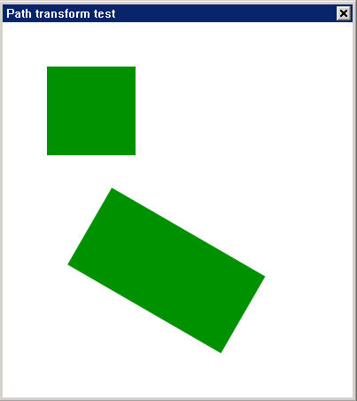

path conversion

## Pen
### Pen Management

Brushes are used to draw lines, curves, and outlines of shapes. They are based
on point-painting mechanisms. In addition to the common color and width
attributes, the pen also has properties such as alignment, caps, and
transitions.

#### Create Pen

If the user wants to use the pen to draw the shape, he needs to call the
function `MGPlusPenCreate` to create the pen.
```cpp
HPEN MGPlusPenCreate (int width, ARGB argb);
```
Note: width is the width of the pen and argb is the color of the pen.

#### Delete Pen

When the relevant drawing is completed, you need to release the pen and call
the `MGPlusPenDelete` function to delete the pen.
```cpp
MPStatus MGPlusPenDelete (HPEN pen);
```

### Pen Settings

After the pen is created, the user needs to set the pen as needed, such as
the color, width, connection, and length of the dotted line.

#### Color Settings

If the user needs to modify the color of the pen, call the function
`MGPlusPenSetColor`.

```cpp
MPStatus MGPlusPenSetColor (HPEN pen, ARGB rgba)
```

#### width setting

If the user needs to modify the width of the pen, call the function
`MGPlusPenSetWidth`.
```cpp
MPStatus MGPlusPenSetWidth (HPEN pen, int width)
```

Width rendering

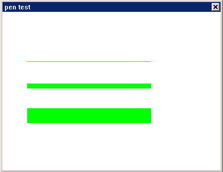

Effect of <center> width</center>
Note: The width of the lines is 1, 10 and 30 in order.

#### Dashed length setting

The pen is drawn in the default state is a solid line, the user wants to set
the dotted line, call the function
`MGPlusPenSetDashes`
To set, use the parameter `dash_list` to use a predefined array to describe the
virtual reality of the pen . The dotted style depends on an array,
The elements of the array represent the lengths of the dashed lines and
spaces, respectively.

```cpp
MPStatus MGPlusPenSetDashes (HPEN pen, int dash_phase, const unsigned char*
Dash_list, int dash_len)
```

Note: The parameter `dash_phase` is, `dash_list` is the dotted line shape,
`dash_len` is the length of the dotted line shape.
Dotted effect chart

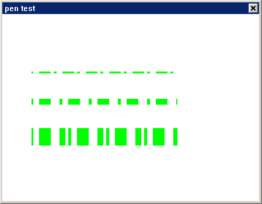


Drawing effect chart
Explanation: The style of the dotted line is {5, 10, 20}, {5, 10, 20, 15} and
{5, 10, 20, 15, 10,}.

#### Connection settings

The connection mode refers to the setting of the shape of the connection when
two straight lines are connected. There are five ways: `JOIN_MITER` (mock),
`JOIN_ROUND` (round), `JOIN_BEVEL`
(diagonal)
`JOIN_MILTER_REVERT`, `JOIN_MILTER_ROUND`. The function `MGPlusPenSetJoinStyle`
is 
called to modify the shape of the two straight line connections.
```cpp
 /*
 * Indicates a mitered line join style. See the class overview for an
 * illustration.
 */
 JOIN_MITER = 0,
 /*
 * Indicates a rounded line join style. See the class overview for an
 * illustration.
 */
 JOIN_ROUND = 1,
 /*
 * Indicates a bevelled line join style. See the class overview for an
 * illustration.
 */
 JOIN_BEVEL = 2,

 /* reseverd, not used now, but surport by mgplus.*/
 JOIN_MILTER_REVERT = 3,

 JOIN_MILTER_ROUND = 4
```

```cpp
MPStatus MGPlusPenSetJoinStyle (HPEN pen, LINE_JOIN_E line_join);
```

Set the mode to the effect of `JOIN_MITER`


mode is `JOIN_MITER`

The set mode is `JOIN_ROUND`

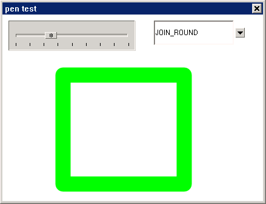

mode is `JOIN_ROUND`

Set the pattern to the effect of `JOIN_BEVEL`

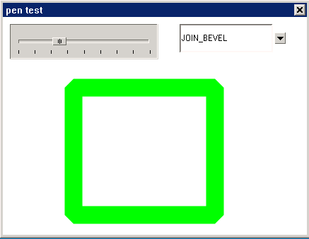

mode is `JOIN_BEVEL`

The user wants to modify the shape of the head and tail of the drawn line by
calling `MGPlusPenSetCapStyle`
function. There are three ways: `CAP_BUTT` (flat cap)
`CAP_ROUND` (round line cap), `CAP_SQUARE` (square line cap).

```cpp
/*
  * Indicates a flat line cap style. See the class overview for an
  * illustration.
  */
  CAP_BUTT = 0,
  /*
  * indicated a rounded line cap style. See the class overview for an
  * illustration.
  */
  CAP_ROUND = 1,
  /*
  * Indicates a square line cap style. See the class overview for an
  * illustration.
  */
  CAP_SQUARE = 2,
```

```cpp
MPStatus MGPlusPenSetCapStyle (HPEN pen, LINE_CAP_E line_cap);
```

Set the mode to `CAP_BUTT` renderings

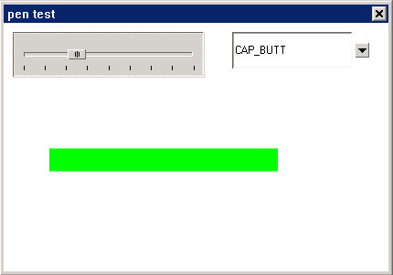

mode is `CAP_BUTT`

Set the mode to `CAP_ROUND` renderings

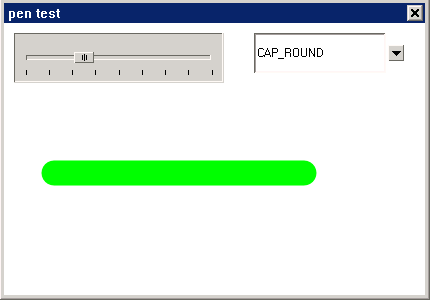

mode is `CAP_ROUND`

Effect mode for setting the mode to `CAP_SQUARE`

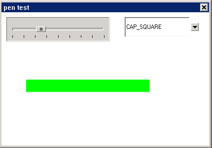

mode is `CAP_SQUARE`

An example of a connection method is as follows:

```cpp
Static int joinstyle ;
Static int capstyle ;
Static int radius = 10;

Static RECT rcCircle = {0, 60, 400, 300};

Static const char *mode[] =
{

    "JOIN_MITER",
    "JOIN_ROUND",
    "JOIN_BEVEL",
    "JOIN_MILTER_REVERT",
    "JOIN_MILTER_ROUND",
    /*
     "CAP_BUTT",
     "CAP_ROUND",
     "CAP_SQUARE",
     */
};

Static void mode_notif_proc (HWND hwnd, int id, int nc, DWORD add_data)
{
    If (nc == CBN_SELCHANGE) {
        Int cur_sel = SendMessage (hwnd, CB_GETCURSEL, 0, 0);
        If (cur_sel >= 0) {
            Joinstyle = cur_sel;
            //capstyle = cur_sel;
            InvalidateRect (GetParent (hwnd), &rcCircle, TRUE);
        }
    }
}

Static void my_notif_proc (HWND hwnd, int id, int nc, DWORD add_data)
{
    If (nc == TBN_CHANGE) {
        Radius = SendMessage (hwnd, TBM_GETPOS, 0, 0);
        InvalidateRect (GetParent (hwnd), &rcCircle, TRUE);
    }
}

Int PenProc (HWND hWnd, int message, WPARAM wParam, LPARAM lParam)
{

    HWND hwnd1, hwnd2;
    HDC hdc;
    Int i ;
    ARGB color = 0xFF00FF00;

    Switch (message)
    {
        Case MSG_CREATE:
            {
                Hwnd1 = CreateWindow (CTRL_TRACKBAR, "",
                        WS_VISIBLE | TBS_NOTIFY,
   1 
      1 
         1 
            1 
               1 
                  1 
                     1 
                        1 ,
                        1 , 10, 210, 50, hWnd, 0);

                SendMessage (hwnd1, TBM_SETRANGE, 0, 80);
                SendMessage (hwnd1, TBM_SETLINESIZE, 1, 0);
                SendMessage (hwnd1, TBM_SETPAGESIZE, 10, 0);
                SendMessage (hwnd1, TBM_SETTICKFREQ, 10, 0);
                SendMessage (hwnd1, TBM_SETPOS, radius, 0);

                SetNotificationCallback (hwnd1, my_notif_proc);
                SetFocus (hwnd1);

                Hwnd2 = CreateWindow (CTRL_COMBOBOX,"",
                        WS_VISIBLE | CBS_DROPDOWNLIST | CBS_NOTIFY,
   1 
      1 
         1 
            1 
               1 
                  1 
                     1 
                        1 ,
                        1 , 10, 150, 40, hWnd, 0 );

               // for (i = 0; i < 3 ; i++) {
                For (i = 0; i < 5 ; i++) {
                    SendMessage (hwnd2, CB_ADDSTRING, 0, (LPARAM)mode[i]);
                }

                SetNotificationCallback (hwnd2, mode_notif_proc);
                SendMessage (hwnd2, CB_SETCURSEL, 0, 0);
            }
            Break;

        Case MSG_PAINT:
            {

                Hdc = BeginPaint (hWnd);

                // Create MGPlusGraphics and Brush
                HGRAPHICS gpc = MGPlusGraphicCreateFromDC (hdc);
                HPEN pen = MGPlusPenCreate (radius,color);

                //capstyle
                /*
                MGPlusPenSetCapStyle (pen, capstyle);
                MGPlusDrawLine (gpc, pen, 50, 150, 300, 150);
                */

                 //joinstyle
                MGPlusPenSetJoinStyle (pen, joinstyle);
                MGPlusDrawRectangle (gpc, pen, 100, 100, 200, 180);

                //save
                MGPlusGraphicSave (gpc, hdc, 0, 0, 0, 0, 0, 0);

                MGPlusPenDelete (pen);
                MGPlusGraphicDelete (gpc);
                EndPaint (hWnd, hdc);
            }
            Break;

        Case MSG_CLOSE:
            DestroyMainWindow (hWnd);
            PostQuitMessage (hWnd);
            Return 0;
    }

    Return DefaultMainWinProc (hWnd, message, wParam, lParam);
}
......
```
Description: If you are running `MGPlusPenSetCapStyle` effect, open the masked,
then close the relevant point of `JoinStyle`.

### Drawing graphics

The `MGPlusFillPath` and `MGPlusGraphicSave` procedures are not required, and
the 
image can be drawn directly with the pen.

#### Draw a straight line

Two points drawn in a straight line
```cpp
MPStatus MGPlusDrawLine (HGRAPHICS graphics, HPEN pen, float x1, float y1,
Float x2, float y2);

MPStatus MGPlusDrawLineI (HGRAPHICS *graphics, HPEN pen, int x1, int y1, int
X2, int y2);
```

E.g:
```cpp
//define the HDC
HDC hdc;

//Insert HDC to create graphics
HGRAPHICS graphics= MGPlusGraphicCreateFromDC (hdc);

// Create a pen with a width of 9 and a blue color.
HPEN pen = MGPlusPenCreate (9, 0xFF0000FF);

// draw 3 straight lines
MGPlusDrawLine (graphics, pen, 100, 100, 100, 200);
MGPlusDrawLine (graphics, pen, 100, 200, 200, 200);
MGPlusDrawLine (graphics, pen, 200, 200, 200, 100);
MGPlusDrawLine (graphics, pen, 200, 100, 100, 100);
...
// Destroy....Frees memory
```

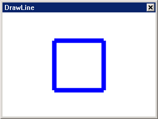

#### Drawing Arcs

(cx, cy) is the center point coordinate of the ellipse, rx is the radius of
the X axis, ry
For the y-axis radius, startangle is the arc start angle, and `sweepAngle` is
the radians between the start and end angles.
```cpp
MPStatus MGPlusDrawArc (HGRAPHICS graphics, HPEN pen, float cx, float cy,
Float rx, float ry, float startAngle, float sweepAngle);

MPStatus MGPlusDrawArcI (HGRAPHICS graphics, HPEN pen, int cx, int cy, int rx,
Int ry, float startAngle, float sweepAngle);
```

E.g:
```cpp
//define the HDC
HDC hdc;

//Insert HDC to create graphics
HGRAPHICS graphics= MGPlusGraphicCreateFromDC (hdc);

// Create a pen with a width of 9 and a blue color.
HPEN pen = MGPlusPenCreate (9, 0xFF0000FF);

// Draw a circle with an arc ellipse of (100, 100) radius (50,
25) Start angle 90, end angle 345, draw the result is the distance between
ellipses 90-345
MGPlusDrawArc (graphics, pen, 100, 100, 50, 25, 90, 345);
// Destroy....Frees memory
```

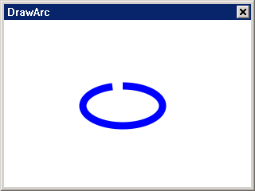

#### Drawing Bezier Curves

(x1,y1) is the starting point, (x2,y2) is the first control point, (x3,
Y3) is the second control point, and (x4, y4) is the end point.
```cpp
MPStatus MGPlusDrawBezier (HGRAPHICS graphics, HPEN pen, float x1, float y1,
Float x2, float y2, float x3, float y3, float x4, float y4);

MPStatus MGPlusDrawBezierI (HGRAPHICS graphics, HPEN pen, int x1, int y1, int
X2, int y2, int x3, int y3, int x4, int y4);
```

E.g:
```cpp
//define the HDC
HDC hdc;

//Insert HDC to create graphics
HGRAPHICS graphics= MGPlusGraphicCreateFromDC (hdc);

// Create a pen with a width of 9 and a blue color.
HPEN pen = MGPlusPenCreate (9, 0xFF0000FF);

//Draw Bezier curves
MGPlusDrawBezier (graphics, pen, 11, 11, 88, 333, 99, 0, 222, 111);
//
//
//
//
//
//
//
// Destroy....Frees memory
```

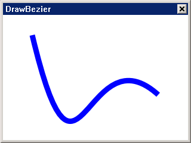

#### draw a rectangle

(x, y) is the vertices of the rectangle, and (width, height) is the length and
width of the rectangle.
```cpp
MPStatus MGPlusDrawRectangle (HGRAPHICS graphics, HPEN pen, float x, float y,
Float width, float height);

MPStatus MGPlusDrawRectangleI (HGRAPHICS graphics, HPEN pen, int x, int y, int
Width, int height);
```

E.g:
```cpp
//define the HDC
HDC hdc;

//Insert HDC to create graphics
HGRAPHICS graphics= MGPlusGraphicCreateFromDC (hdc);

// Create a pen with a width of 9 and a blue color.
HPEN pen = MGPlusPenCreate (9, 0xFF0000FF);

// draw a rectangle
MGPlusDrawRectangle (graphics, pen, 50, 100, 100, 100);
MGPlusDrawRectangle (graphics, pen, 75, 150, 100, 100);
MGPlusDrawRectangle (graphics, pen, 100, 175, 100, 100);
...
// Destroy....Frees memory
```

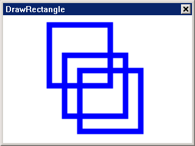

#### Drawing Rounded Rectangle

(x, y) is a rectangle vertex, (width,
Height) is the length and width of the rectangle. The rounded rectangle of the
rounded rectangle is calculated by a rectangle, and the size of the rectangle
is used (
Rx, ry) to control.
```cpp
 MPStatus MGPlusDrawRoundRectIEx (HGRAPHICS graphics, HPEN pen, int x, int y,
Int width, int height, int rx, int ry);

MPStatus MGPlusDrawRoundRectEx (HGRAPHICS graphics, HPEN pen, float x, float
y, float width, float height, float rx, float ry);
```

E.g:
```cpp
//define the HDC
HDC hdc;

//Insert HDC to create graphics
HGRAPHICS graphics= MGPlusGraphicCreateFromDC (hdc);

// Create a pen with a width of 9 and a blue color.
HPEN pen = MGPlusPenCreate (9, 0xFF0000FF);

// Draw a rounded rectangle
MGPlusDrawRoundRectEx (graphics, pen, 100, 375, 100, 100, 10, 10);
...
// Destroy....Frees memory
```

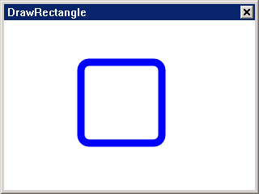

#### Draw an ellipse

(cx, cy) is an ellipse center, (rx, ry) is an elliptical x-radius, y-radius
```cpp
MPStatus MGPlusDrawEllipse (HGRAPHICS graphics, HPEN pen, float cx, float
Cy, float rx, float ry, BOOL b_clock);

MPStatus MGPlusDrawEllipseI (HGRAPHICS graphics, HPEN pen, int cx, int cy, int
Rx, int ry, BOOL b_clock);
```

E.g:
```cpp
//define the HDC
HDC hdc;

//Insert HDC to create graphics
HGRAPHICS graphics= MGPlusGraphicCreateFromDC (hdc);

// Create a pen with a width of 9 and a blue color.
HPEN pen = MGPlusPenCreate (9, 0xFF0000FF);

// draw an ellipse
MGPlusDrawEllipse (graphics, pen, 100, 100, 50, 25);
...
// Destroy....Frees memory
```

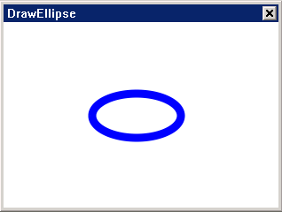

#### Load image

The bitmap used by mgplus must be format compatible with graphics, so from
other dc-loaded bitmaps, you need to convert.
Two ways to load pictures:

```cpp
//Load a device-dependent bitmap from a file
LoadBitmap (HDC hdc, PBITMAP bmp, const char* file_name);
// Convert bitmap to graphic compatible format
MPStatus MGPlusGraphicLoadBitmap (HGRAPHICS graphics, int n_index, PBITMAP
P_bitmap);
```

```cpp
// Bitmaps that are converted directly to a graphic-compatible format
MPStatus MGPlusGraphicLoadBitmapFromFile (HGRAPHICS graphics, int n_index,
Char* file);
```

#### Drawing pictures

There are three ways to draw a picture:

```cpp
//n_index Picture index value, (x, y) starting position, (w, h) width and
height of the picture.
MPStatus MGPlusDrawImage (HGRAPHICS graphics, int n_index, int x, int y, int
w, int h);
```

E.g:
```cpp
//define the HDC
HDC hdc;

//Insert HDC to create graphics
HGRAPHICS graphics= MGPlusGraphicCreateFromDC (hdc);

//Load image
MGPlusGraphicLoadBitmapFromFile (graphics, 0,"File.bmp" );

// draw a picture
MGPlusDrawImage (graphics, 0, 100, 100, 200, 200);
...
// Destroy....Frees memory
```

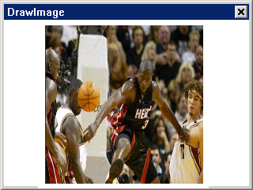

```cpp
//n_index Picture index value, point A set of vertices, count number of
vertices.
MPStatus MGPlusDrawImageWithPoints (HGRAPHICS graphics, int n_index, const
Point& point, int count);
```

E.g:
```cpp
//define the HDC
HDC hdc;

//Insert HDC to create graphics
HGRAPHICS graphics= MGPlusGraphicCreateFromDC (hdc);

//Load image
       Static BITMAP Bitmap;
       LoadBitmap (HDC_SCREEN, &Bitmap, "./res/wede.bmp");
       MGPlusGraphicLoadBitmap (graphics, 1, &Bitmap);
// draw a picture
MPPOINT points [4];

       Points [0].x = 100;
       Points [0].y = 50;

       Points [1].x = 200;
       Points [1].y = 50;

       Points [2].x = 300;
       Points [2].y = 200;

       Points [3].x = 0;
       Points [3].y = 200;

       MGPlusDrawImageWithPoints (graphics, 1, points, 4);

...
// Destroy....Frees memory
```

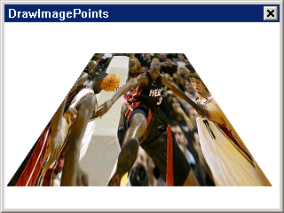

```cpp
//n_index Picture index value, path target path.
MGPlusDrawImageWithPath (HGRAPHICS graphics, int n_index, HPATH path);
```

E.g:
```cpp
//define the HDC
HDC hdc;

//Insert HDC to create graphics
HGRAPHICS graphics= MGPlusGraphicCreateFromDC (hdc);

//Load image
MGPlusGraphicLoadBitmapFromFile (graphics, 0,"./res/wede.bmp" );

// There must be a path to draw the image, so create a path first.
HPATH path = MGPlusPathCreate (MP_PATH_FILL_MODE_ALTERNATE);
MGPlusPathAddRoundRect (path, 100, 100, 200, 200, 20);

//Draw an image in the path
MGPlusDrawImageWithPath (graphics, 0, path);
// Destroy....Frees memory
```

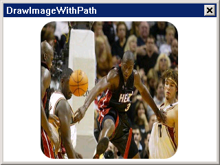

## Brush
### Brush Management

The brush is based on a padding mechanism that is used with the Graphics
object to create a solid shape and an object that renders text.

#### Create

Select brush style when using `MGPlusBrushCreate` to create a brush
```cpp
Typedef enum _MPBrushType
{
    /* Brush the path with the single color.*/
    MP_BRUSH_TYPE_SOLIDCOLOR = 0,
    /* Brush the path with the hatchfill.*/
    MP_BRUSH_TYPE_HATCHFILL = 1,
    /* Brush the path with the texturefill.*/
    MP_BRUSH_TYPE_TEXTUREFILL = 2,
    /* Brush the path with the path gradient.*/
    MP_BRUSH_TYPE_PATHGRADIENT = 3,
    /* Brush the path with linear gradient.*/
    MP_BRUSH_TYPE_LINEARGRADIENT
}MPBrushType;

HBRUSH MGPlusBrushCreate (MGPlusBrushType type);
```

#### Delete

Release brush
```cpp
MPStatus MGPlusBrushDelete (HBRUSH brush);
```

### Brush Settings

#### Solid Brush Setting

Set the color of a single brush

```cpp
MPStatus MGPlusSetSolidBrushColor (HBRUSH brush, RGBA* rgba);
```
Shadow Brush Hatch brush settings
Set the color of the Hatch brush
```cpp
MPStatus MGPlusSetHatchBrushColor (HBRUSH brush, RGBA fore_rgba, RGBA
Back_rgba);
```

Get the color of the Hatch brush
```cpp
MPStatus MGPlusGetHatchBrushColor (HBRUSH brush, RGBA* fore_rgba, RGBA*
Back_rgba);
```

Texture Brushes texture brush settings.

```cpp
MPStatus MGPlusSetTextureBrushImage (HBRUSH brush, BITMAP* bitmap);
```

#### `GradientBrush` `GradientBrush` Settings

####+ Path Gradient Brush `PathGradientBrush` Settings

Set the center point of `PathGradientBrush`
```cpp
MPStatus MGPlusSetPathGradientBrushCenterPoint (HBRUSH brush, POINT* point);
```

Set the color of the center of the `PathGradientBrush`
```cpp
MPStatus MGPlusSetPathGradientBrushCenterColor (HBRUSH brush, RGBA* rgba);
```

Set the `PathGradientBrush` wrapping color
```cpp
MPStatus MGPlusSetPathGradientBrushSurroundColor (HBRUSH brush, RGBA rgba);
```

Set the scope of the arc gradient of the `PathGradientBrush`
```cpp
MPStatus MGPlusSetPathGradientBrushSurroundRect (HBRUSH brush, RECT* rect);
```

E.g:
```cpp
// Create an MP_BRUSH_TYPE_PATHGRADIENT style brush
HBRUSH brush = MGPlusBrushCreate (MP_BRUSH_TYPE_PATHGRADIENT);

//Create a path
HPATH path = MGPlusPathCreate (MP_PATH_FILL_MODE_ALTERNATE);

//Add graphics to the path
            MGPlusPathAddRectangle (path, 25, 150, 300, 100);
            MGPlusPathAddEllipse (path, 100, 250, 50, 50, TRUE);
            MGPlusPathAddEllipse (path,250, 250, 50, 50, TRUE);

//Set the center point
                        MPPOINT point = {170,225};
                        MGPlusSetPathGradientBrushCenterPoint (brush, &point);

// Set the color of the center point
                        MGPlusSetPathGradientBrushCenterColor (brush,
0xFF0000FF);

//Set the winding color
Static ARGB SurroundColors [3] = {0xFFFF00FF, 0xFF00FF00, 0xFFFF0000};
                        MGPlusSetPathGradientBrushSurroundColors (brush,
SurroundColors, 3);

// Set the extent of the arc gradient
                        RECT rect = {25,150,325,250};
                        MGPlusSetPathGradientBrushSurroundRect (brush, &rect);

// Fill path
                        MGPlusFillPath (graphics, brush, path);
//Save to DC
            MGPlusGraphicSave (graphics, hdc, 0, 0, 0, 0, 0, 0);

```

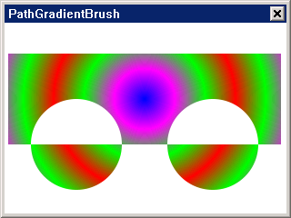

####+ Linear `GradientBrush` `LinearGradientBrus` Settings

Set the `LinearGradientBrush` mode
```cpp
Typedef enum _MPLinearGradientMode
{
    /* gradient horizontal.*/
    MP_LINEAR_GRADIENT_MODE_HORIZONTAL = 0,
    /* gradient vertica.*/
    MP_LINEAR_GRADIENT_MODE_VERTICAL,
    /* gradient forwarddiagonal.*/
    MP_LINEAR_GRADIENT_MODE_FORWARDDIAGONAL,
    /* gradient backwarddiagonal.*/
    MP_LINEAR_GRADIENT_MODE_BACKWARDDIAGONAL
}MPLinearGradientMode;

MPStatus MGPlusSetLinearGradientBrushMode (HBRUSH brush,
MGPlusLinearGradientMode mode);
```

Get `LinearGradientBrush` mode
```cpp
MPStatus MGPlusGetLinearGradientBrushMode (HBRUSH brush,
MGPlusLinearGradientMode* mode);
```

Set the `LinearGradientBrush` area
```cpp
MPStatus MGPlusSetLinearGradientBrushRect (HBRUSH brush, RECT* rect);
```

Set the `LinearGradientBrush` gradient color
```cpp
MPStatus MGPlusSetLinearGradientBrushColor (HBRUSH brush, RGBA* start_color,
RGBA* end_color);
```

E.g:
```cpp
//Create an MP_BRUSH_TYPE_LINEARGRADIENT style brush
HBRUSH brush = MGPlusBrushCreate (MP_BRUSH_TYPE_LINEARGRADIENT);
//Create a path
HPATH path = MGPlusPathCreate (MP_PATH_FILL_MODE_ALTERNATE);
//Add graphics to the path
            MGPlusPathAddRectangle (path, 25, 150, 300, 100);
            MGPlusPathAddEllipse (path, 100, 250, 50, 50, TRUE);
            MGPlusPathAddEllipse (path,250, 250, 50, 50, TRUE);
// Set the brush to MP_LINEAR_GRADIENT_MODE_HORIZONTAL mode
  MGPlusSetLinearGradientBrushMode (brush,
MP_LINEAR_GRADIENT_MODE_HORIZONTAL);
// Set the LinearGradientBrush area
    Static RECT rect = {25,150,325,250};
    MGPlusSetLinearGradientBrushRect (brush, &rect);
// Set the LinearGradientBrush gradient color
    Static ARGB color [6] = {0xFFFF0000, 0xFF0000FF, 0xFFFF00FF,
0xff00FFFF, 0xff00FF00, 0xFF00FF00};
    MGPlusSetLinearGradientBrushColors (brush, color, 6);
// Fill path
    MGPlusFillPath (graphics, brush, path);
//Save to DC
    MGPlusGraphicSave (graphics, hdc, 0, 0, 0, 0, 0, 0);
```


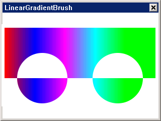

<center>MP_LINEAR_GRADIENT_MODE_HORIZONTAL.</center>
The following is a demonstration of other modes:
Set brush to `MP_LINEAR_GRADIENT_MODE_VERTICAL` mode

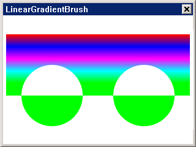

<center>MP_LINEAR_GRADIENT_MODE_VERTICAL</center>

Set brush to `MP_LINEAR_GRADIENT_MODE_FORWARDDIAGONAL` mode

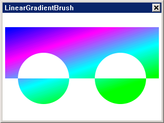

<center>MP_LINEAR_GRADIENT_MODE_FORWARDDIAGONAL</center>

Set the brush to `MP_LINEAR_GRADIENT_MODE_BACKWARDDIAGONAL` mode

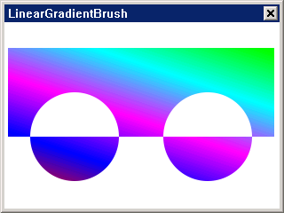

<center>MP_LINEAR_GRADIENT_MODE_BACKWARDDIAGONAL </center>

### Fill graphic

There is no need for the `MGPlusFillPath` and `MGPlusGraphicSave` procedures to
fill the image directly with the paintbrush.

#### Fill the arc

(cx, cy) is the center point coordinate of the ellipse, rx is the radius of
the X axis, ry
For the y-axis radius, startangle is the arc start angle, and `sweepAngle` is
the radians between the start and end angles.
```cpp
MPStatus MGPlusFillArc (HGRAPHICS graphics, HBRUSH brush, float cx, float cy,
Float rx, float ry, float startAngle, float sweepAngle);

MPStatus MGPlusFillArcI (HGRAPHICS graphics, HBRUSH brush, int cx, int cy, int
Rx, int ry, float startAngle, float sweepAngle);
```

E.g:
```cpp
//define the HDC
HDC hdc;
//Insert HDC to create graphics
HGRAPHICS graphics= MGPlusGraphicCreateFromDC (hdc);
//Create a brush
HBRUSH brush = MGPlusBrushCreate (MP_BRUSH_TYPE_SOLIDCOLOR);
// Set the brush color
MGPlusSetSolidBrushColor (brush, 0xFF0000FF);
// Fill the arc
MGPlusFillArc (graphics, brush, 100, 100, 50, 50, 90, 180);
...
// Destroy....Frees memory
```


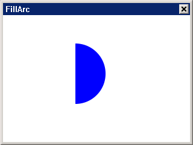

#### Fill Bezier Curve

(x1,y1) is the starting point, (x2,y2) is the first control point, (x3,
Y3) is the second control point, and (x4, y4) is the end point.
```cpp
MPStatus MGPlusFillBezier (HGRAPHICS graphics, HBRUSH brush, float x1, float
Y1, float x2, float y2, float x3, float y3, float x4, float y4);

MPStatus MGPlusFillBezierI (HGRAPHICS graphics, HBRUSH brush, int x1, int y1,
Int x2, int y2, int x3, int y3, int x4, int y4);
```

E.g:
```cpp
//define the HDC
HDC hdc;

//Insert HDC to create graphics
HGRAPHICS graphics= MGPlusGraphicCreateFromDC (hdc);

//Create a brush
HBRUSH brush = MGPlusBrushCreate (MP_BRUSH_TYPE_SOLIDCOLOR);

// Set the brush color
MGPlusSetSolidBrushColor (brush, 0xFF0000FF);

// Fill Bezier curve
MGPlusFillBezier (graphics, brush, 11,11, 88,333, 99,0, 222,111);
...
// Destroy....Frees memory
```

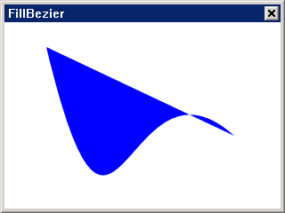

#### Fill rectangle

(x, y) is the vertices of the rectangle, and (width, height) is the length and
width of the rectangle.
```cpp
MPStatus MGPlusFillRectangle (HGRAPHICS graphics, HBRUSH brush, float x, float
y, float width, float height);

MPStatus MGPlusFillRectangleI (HGRAPHICS graphics, HBRUSH brush, int x, int y,
Int width, int height);
```

E.g:

```cpp
//define the HDC
HDC hdc;
//Insert HDC to create graphics
HGRAPHICS graphics= MGPlusGraphicCreateFromDC (hdc);
//Create a brush
HBRUSH brush = MGPlusBrushCreate (MP_BRUSH_TYPE_SOLIDCOLOR);
//Set the paint brush
MGPlusSetSolidBrushColor (brush, 0xFF0000FF);
// fill rectangle
MGPlusFillRectangleI (graphics, brush, 100, 175, 100, 100);
...
// Destroy....Frees memory
```


#### Fill rounded rectangle

(x, y) is a rectangle vertex, (width,
Height) is the length and width of the rectangle. The rounded rectangle of the
rounded rectangle is calculated by a rectangle, and the size of the rectangle
is used (
Rx, ry) to control.
```cpp
MPStatus MGPlusFillRoundRectIEx (HGRAPHICS graphics, HBRUSH brush, int x, int
y, int width, int height, int rx, int ry);

MPStatus MGPlusFillRoundRectEx (HGRAPHICS graphics, HBRUSH brush, float x,
Float y, float width, float height, float rx, float ry);
```

E.g:
```cpp
//define the HDC
HDC hdc;
//Insert HDC to create graphics
HGRAPHICS graphics= MGPlusGraphicCreateFromDC (hdc);
//Create a brush
HBRUSH brush = MGPlusBrushCreate (MP_BRUSH_TYPE_SOLIDCOLOR);
// Set the brush color
MGPlusSetSolidBrushColor (brush, 0xFF0000FF);
// Fill rounded rectangle
MGPlusFillRoundRectIEx ( graphics, brush, 100, 375, 100, 100, 10, 10);
...
// Destroy....Frees memory
```

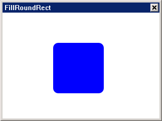

#### Fill ellipse

(cx, cy) is an ellipse center, (rx, ry) is an elliptical x-radius, y-radius
```cpp
MPStatus MGPlusFillEllipse (HGRAPHICS graphics, HBRUSH brush, float cx, float
Cy, float rx, float ry);

MPStatus MGPlusFillEllipseI (HGRAPHICS graphics, HBRUSH brush, int cx, int cy,
Int rx, int ry);
```

E.g:
```cpp
//define the HDC
HDC hdc;
//Insert HDC to create graphics
HGRAPHICS graphics= MGPlusGraphicCreateFromDC (hdc);
//Create a brush
HBRUSH brush = MGPlusBrushCreate (MP_BRUSH_TYPE_SOLIDCOLOR);
// Set the brush color
MGPlusSetSolidBrushColor (brush, 0xFF0000FF);
// Fill ellipse
MGPlusFillEllipse (graphics, brush, 100, 100, 50, 25);
...
// Destroy....Frees memory
```

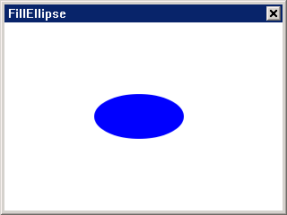

----

[&lt;&lt; ](MiniGUIProgGuidePart.md) |
[Table of Contents](README.md) |
[ &gt;&gt;](MiniGUIProgGuidePart.md)

[Release Notes for MiniGUI 3.2]: /supplementary-docs/Release-Notes-for-MiniGUI-3.2.md
[Release Notes for MiniGUI 4.0]: /supplementary-docs/Release-Notes-for-MiniGUI-4.0.md
[Showing Text in Complex or Mixed Scripts]: /supplementary-docs/Showing-Text-in-Complex-or-Mixed-Scripts.md
[Supporting and Using Extra Input Messages]: /supplementary-docs/Supporting-and-Using-Extra-Input-Messages.md
[Using CommLCD NEWGAL Engine and Comm IAL Engine]: /supplementary-docs/Using-CommLCD-NEWGAL-Engine-and-Comm-IAL-Engine.md
[Using Enhanced Font Interfaces]: /supplementary-docs/Using-Enhanced-Font-Interfaces.md
[Using Images and Fonts on System without File System]: /supplementary-docs/Using-Images-and-Fonts-on-System-without-File-System.md
[Using SyncUpdateDC to Reduce Screen Flicker]: /supplementary-docs/Using-SyncUpdateDC-to-Reduce-Screen-Flicker.md
[Writing DRI Engine Driver for Your GPU]: /supplementary-docs/Writing-DRI-Engine-Driver-for-Your-GPU.md
[Writing MiniGUI Apps for 64-bit Platforms]: /supplementary-docs/Writing-MiniGUI-Apps-for-64-bit-Platforms.md

[Quick Start]: /user-manual/MiniGUIUserManualQuickStart.md
[Building MiniGUI]: /user-manual/MiniGUIUserManualBuildingMiniGUI.md
[Compile-time Configuration]: /user-manual/MiniGUIUserManualCompiletimeConfiguration.md
[Runtime Configuration]: /user-manual/MiniGUIUserManualRuntimeConfiguration.md
[Tools]: /user-manual/MiniGUIUserManualTools.md
[Feature List]: /user-manual/MiniGUIUserManualFeatureList.md

[MiniGUI Overview]: /MiniGUI-Overview.md
[MiniGUI User Manual]: /user-manual/README.md
[MiniGUI Programming Guide]: /programming-guide/README.md
[MiniGUI Porting Guide]: /porting-guide/README.md
[MiniGUI Supplementary Documents]: /supplementary-docs/README.md
[MiniGUI API Reference Manuals]: /api-reference/README.md

[MiniGUI Official Website]: http://www.minigui.com
[Beijing FMSoft Technologies Co., Ltd.]: https://www.fmsoft.cn
[FMSoft Technologies]: https://www.fmsoft.cn
[HarfBuzz]: https://www.freedesktop.org/wiki/Software/HarfBuzz/
