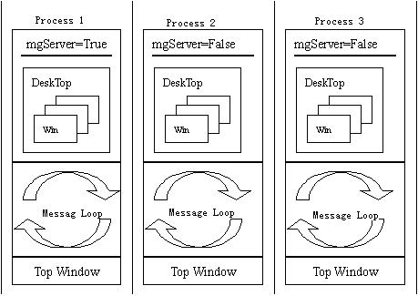

# Inter-Process Communication and Asynchronous Event Process

- [Asynchronous Event Process](#asynchronous-event-process)
- [MiniGUI-Processes and Inter-Process Communication](#minigui-processes-and-inter-process-communication)
   + [Multi-Process Model under MiniGUI-Processes](#multi-process-model-under-minigui-processes)
   + [Simple Request/Response Processing](#simple-requestresponse-processing)
   + [Wraps for `UNIX` Domain Socket](#wraps-for-unix-domain-socket)


In this chapter, we introduce how application processes asynchronous event, and
how it implements the inter-process communication by using `APIs` provided by
MiniGUI.

## Asynchronous Event Process

Usually the programming interfaces provided by a GUI system mainly focus on
windowing, messaging, and graphics device. However, a GUI usually provides its
own mechanism while processing system events and such mechanism is always
incompatible with the one provided by operating system itself. The structure of
an application is usually message-drive corresponding to the message loop
mechanism of MiniGUI. In other words, application works through passively
receiving messages. If application needs to actively monitor certain system
events, for example, in `UNIX` operating system, it can call select system call
to monitor if a certain file descriptor has readable data. We need combine the
message queue mechanism of MiniGUI and other existed mechanisms of OS, in order
to provide a consistent mechanism for application. We will illustrate several
methods to resolve this problem in the chapter.

As we know, there is only one message queue in an application running on
MiniGUI-Processes. Application will create a message loop after being
initialized, and then continuously get messages from this queue until receiving
message `MSG_QUIT`. When the window procedure of the application handles a
message, it should immediately returns after having handled the message in
order to have a chance to get other messages and handle them. If an application
calls select to listen in a certain file descriptor, it is possible to
encounter a problem: as select system call may cause long-time block, and those
events sent to the application by the MiniGUI-Processes serve will not be
processed in time. Therefore, the way of message driving and select system call
is difficult to be well integrated. In MiniGUI-Threads, each thread has its own
corresponding message queue, while system message queue is managed by solely
performed desktop thread. Therefore, the threads created by any application can
be long-time blocked and can call select like system calls. However, in
MiniGUI-Processes, if you need to listen in a file descriptor event in one
application, you must handle it correctly to avoid the block.

Under MiniGUI-Processes, we have some ways of resolving this problem:
- When calling select system call, pass the value of timeout to ensure select
system call will not be long-time blocked.
- Using timer. When the timer is expired, you can use select system call to
check the listened file descriptor. If there is not any event occurring, it
will return immediately, otherwise perform read or write operation.
- Using function `RegisterListenFD` provided by MiniGUI-Processes to register a
listened file descriptor. When a desired event occurs, MiniGUI-Processes will
send message `MSG_FDEVENT` to a certain window.

As the former two solutions are comparatively simple, here we will focus on the
third solution. MiniGUI-Processes provides the following functions and one
macro to application:

```cpp
#define MAX_NR_LISTEN_FD   5

/* Return TRUE if all OK, and FALSE on error. */
BOOL GUIAPI RegisterListenFD (int fd, int type, HWND hwnd, void* context);

/* Return TRUE if all OK, and FALSE on error. */
BOOL GUIAPI UnregisterListenFD (int fd);
```
- Macro `MAX_NR_LISTEN_FD` defines the maximal number of file descriptors that
can be listened by MiniGUI. The default value is 5.
- `RegisterListenFD` registers a file descriptor that needs to be listened. You
should specify the event type (the argument of type can be one of `POLLIN`,
`POLLOUT`, or `POLLERR`), the context information, and the window handle
receiving the message `MSG_FDEVENT`.
- `UnregisterListenFD` unregisters a registered listening file descriptor.

After application uses `RegisterListenFD` function to register a listening file
descriptor, MiniGUI will send a message of `MSG_FDEVENT` to the specified
window when the specified event occurs on the descriptor. Application can
handle this message in the window procedure. VCOnGUI of mGUtils uses the
above function to listen to the readable event coming from the master pseudo
terminal, seen as follows (`src/vcongui/vcongui.c`):

```cpp
    ...

    /* Registers a listened file descriptor for bogus master control terminal */
    RegisterListenFD (pConInfo->masterPty, POLLIN, hMainWnd, 0);

    /* Go into message loop */
    while (!pConInfo->terminate && GetMessage (&Msg, hMainWnd)) {
        DispatchMessage (&Msg);
    }
    /* Unregisters a listened file descriptor */
    UnregisterListenFD (pConInfo->masterPty);

    ...

/* Window process of virtual console */
static int VCOnGUIMainWinProc (HWND hWnd, int message, WPARAM wParam, LPARAM lParam)
{
    PCONINFO pConInfo;

    pConInfo = (PCONINFO)GetWindowAdditionalData (hWnd);
    switch (message) {

         ...

/* If MSG_FDEVENT is received, handle the input data on bogus master control terminal */
        case MSG_FDEVENT:
            ReadMasterPty (pConInfo);
        break;

        ...
    }

    /* Call the default window process */
    if (pConInfo->DefWinProc)
        return (*pConInfo->DefWinProc)(hWnd, message, wParam, lParam);
    else
        return DefaultMainWinProc (hWnd, message, wParam, lParam);
}
```

We can see the use of `RegisterListenFD` in the following section. Obviously, a
MiniGUI-Processes program can conveniently use the bottom message mechanism to
finish the process of asynchronous event by using this simple interface of
registering listening file descriptor.

## MiniGUI-Processes and Inter-Process Communication

As we know, MiniGUI-Processes uses `UNIX` domain sockets to realize the
interaction between client programs and the server. Application also can use
this mechanism to finish its own communicating task – send a request from
client, while the serve will process the request and send back the response. On
one hand, in the MiniGUI-Processes serve program, you can extend this mechanism
to register your own request processing functions to implement your
request-response communicating task. On the other hand, MiniGUI-Processes also
provides some wrap functions used to create and operate `UNIX` domain sockets.
Any application under MiniGUI-Processes can create `UNIX` domain sockets and
finish the data exchange with other MiniGUI-Processes applications. This
chapter will describe how to use the functions provided by MiniGUI-Processes to
finish such kind of communication. Before introducing the certain interface,
let’s first to understand the multi-process communication model and
communication between the server and the clients under MiniGUI-Processes.

### Multi-Process Model under MiniGUI-Processes

MiniGUI-Processes is a multi-process system with C/S architecture. Only one
server program is running during the life cycle. The global variable `mgServer`
in the server is set to `TRUE`; the other MiniGUI applications are clients,
`mgServer` is set to `FALSE`. Each application runs in different process space,
seen as Figure 1.



*Figure 1* Multi-process model of MiniGUI-Processes

The current program structure allows each process to have its own (virtual)
desktop and message queue. The process communication model includes data
exchange realized by shared memory and the client/server communication model
realized by `UNIX` domain sockets.

### Simple Request/Response Processing

MiniGUI-Processes uses `UNIX` domain socket to communicate between the server
and the clients. In order to facilitate such communication, MiniGUI-Processes
introduces a simple request/response mechanism. Clients send request to the
server through a specific structure; the server handles the request and
responds. At the end of clients, a request is defined as follows
(`minigui/minigui.h`):

```cpp
typedef struct _REQUEST {
    int id;
    const void* data;
    size_t len_data;
} REQUEST;
typedef REQUEST* PREQUEST;
```
Here, id is an integer used to identify the request type; data is the data
associated to the request; `len_data` is the length of the data in bytes. After
initializing a `REQUEST` structure, clients can call `ClientRequest` to send
the request to the server, and wait for the response from the server. The
prototype of this function is as follows:

```cpp
/* send a request to server and wait reply */
int ClientRequest (PREQUEST request, void* result, int len_rslt);
```

The server program (mginit) can get all client requests during its own message
loop; it will process each request and send the final result to the client. The
server can call `ServerSendReply` to send the reply to the client:

```cpp
int GUIAPI ServerSendReply (int clifd, const void* reply, int len);
```

In the above simple C/S communication, the clients and the serve must be accord
with each other for a certain request type, that is, the clients and the server
must understand each type of data and process it properly.

MiniGUI-Processes uses the above way to realize most of system-level
communication tasks:

- Mouse cursor management. Mouse cursor is a global resource. When you create
or destroy it, change the shape or position of it, or show or hide it, you
should send a request to the server. The server will finish the task and reply
the result to you.
- Layer management. When a client checks the information of layers, creates new
layer, joins a certain existed layer, or delete a layer, it sends a request to
the server.
- Window management. When a client creates, destroy, and move a main window, it
sends a request to the server.
- Other system-level works. For example, in new `GDI` interfaces, the server
manages the video memory of the video adapter. When clients need create the
memory `DC` in video memory, they will send a request to the server.
In order to allow application to simply implement the communication between
clients and the server by using the mechanism above, you can register some
customized request process functions in the server, and then clients can send
requests to the server. MiniGUI-Processes provides the following interfaces to
the server:

```cpp
#define MAX_SYS_REQID           0x0014
#define MAX_REQID               0x0020

/*
 * Register user defined request handlers for server
 * Note that user defined request id should larger than MAX_SYS_REQID
 */
typedef int (* REQ_HANDLER) (int cli, int clifd, void* buff, size_t len);
BOOL GUIAPI RegisterRequestHandler (int req_id, REQ_HANDLER your_handler);
REQ_HANDLER GUIAPI GetRequestHandler (int req_id);
```
The server can register a request handler by calling `RegisterRequestHandler`.
Note that the prototype of request handler is defined by `REQ_HANDLER`. MiniGUI
has also defined two macros: `MAX_SYS_REQID` and `MAX_REQID`. `MAX_REQID` is
the maximum request identifier that can be registered; while `MAX_SYS_REQID`
does MiniGUI use the maximum request identifier internally. In other words, the
request identifier registered by `RegisterRequestHandler` must be larger than
`MAX_SYS_REQID` and less than or equal to `MAX_REQID`.

We assume that the server calculates the sum of two integers for clients.
Clients send two integers to the server, while the server sends the sum of two
integers to the clients. The following program runs in the server program and
registers a request handler in the system:

```cpp
typedef struct TEST_REQ
{
   int a, b;
} TEST_REQ;


static int test_request (int cli, int clifd, void* buff, size_t len)
{
    int ret_value = 0;
    TEST_REQ* test_req = (TEST_REQ*)buff;

    ret_value = test_req.a + test_req.b;

    return ServerSendReply (clifd, &ret_value, sizeof (int));
}

...
     RegisterRequestHandler (MAX_SYS_REQID + 1, test_request);
...
```

Client can send a request to the server to get the sum of two integers by using
the following program:

```cpp
 REQUEST req;
        TEST_REQ test_req = {5, 10};
        int ret_value;

        req.id = MAX_SYS_REQID + 1;
        req.data = &rest_req;
        req.len_data = sizeof (TEST_REQ);

        ClientRequest (&req, &ret_value, sizeof (int));
        printf (“the returned value: %d\n”, ret_value);    /* ret_value should be 15 */
```

By using this simple request/response technology, MiniGUI-Processes can create
a convenient inter-process communication mechanism between the clients and the
server. However, this technology also has some shortcomings, for example, the
number of request is limited by the value of `MAX_REQID`, the communication
mechanism is not flexible, and the request can only be sent to the server
(`mginit`) of MiniGUI-Processes from the clients.

### Wraps for `UNIX` Domain Socket

In order to solve the problem of above simple request/reply mechanism,
MiniGUI-Processes also provides some wrap functions for `UNIX` domain socket.
The prototypes of these functions are as follow (`minigui/minigui.h`):

```cpp
/* Used by server to create a listen socket.
 * Name is the name of listen socket.
 * Please located the socket in /var/tmp directory. */

/* Returns fd if all OK, -1 on error. */
int serv_listen (const char* name);

/* Wait for a client connection to arrive, and accept it.
 * We also obtain the client's pid and user ID from the pathname
 * that it must bind before calling us. */

/* returns new fd if all OK, < 0 on error */
int serv_accept (int listenfd, pid_t *pidptr, uid_t *uidptr);

/* Used by clients to connect to a server.
 * Name is the name of the listen socket.
 * The created socket will located at the directory /var/tmp,
 * and with name of '/var/tmp/xxxxx-c', where 'xxxxx' is the pid of client.
 * and 'c' is a character to distinguish diferent projects.
 * MiniGUI use 'a' as the project character.
 */

/* Returns fd if all OK, -1 on error. */
int cli_conn (const char* name, char project);

#define SOCKERR_IO          -1
#define SOCKERR_CLOSED      -2
#define SOCKERR_INVARG      -3
#define SOCKERR_OK          0

/* UNIX domain socket I/O functions. */

/* Returns SOCKERR_OK if all OK, < 0 on error.*/
int sock_write_t (int fd, const void* buff, int count, unsigned int timeout);
int sock_read_t (int fd, void* buff, int count, unsigned int timeout);

#define sock_write(fd, buff, count) sock_write_t(fd, buff, count, 0)
#define sock_read(fd, buff, count) sock_read_t(fd, buff, count, 0)
```
The above functions are used to create `UNIX` domain socket and perform data
transfer. They are the wraps of basic socket function provided by the operating
system. The uses of these functions are described as follow:
- `serv_listen:` The server calls this function to create a listening socket
and returns socket file descriptor. It is suggested to create server listening
socket under the directory of `/var/tmp/`.
- `serv_accept:` The server calls this function to accept the connection
request from clients.
- `cli_conn:` Client calls this function to connect the server. Name is the
listening socket of the server. The socket created for the client is stored in
the directory of `/var/tmp/`, named with `<pid>-c`, in which `c` is used to
differentiate the purpose of different socket communication task, and specified
by the argument of project. MiniGUI-Processes internally uses `a`, so the sockets
created by application program should use alphabets excluding `a`.
- `sock_write_t:` After creating the connection, client and server can use
`sock_write_t` and `sock_read_t` to perform data exchange. Arguments of
`sock_write_t` are similar to system call write, but can pass a timeout value
in the unit of 10ms. When the argument is zero, the timeout is disabled. Note
that timeout setting is only valid in the program `mginit`.
- `sock_read_t:` Arguments of `sock_read_t` are similar to system call read,
but can pass a timeout value in the unit of 10ms. When the argument is zero,
the timeout is disabled. Note that timeout setting is only valid in program
`mginit`.

The following code illustrates how a server program creates a listening socket
by using above functions:

```cpp
#define LISTEN_SOCKET    “/var/tmp/mysocket”

static int listen_fd;

BOOL listen_socket (HWND hwnd)
{
    if ((listen_fd = serv_listen (LISTEN_SOCKET)) < 0)
        return FALSE;
    return RegisterListenFD (fd, POLL_IN, hwnd, NULL);
}
```

When the server receives the client connection request, the window of `hwnd` will
receive message `MSG_FDEVENT`, then the server can accept this connection
request:

```cpp
int MyWndProc (HWND hwnd, int message, WPARAM wParam, LPARAM lParam)
{
    switch (message) {

        ...

        case MSG_FDEVENT:
             if (LOWORD (wParam) == listen_fd) { /* From monitor socket */
                  pid_t pid;
                  uid_t uid;
                  int conn_fd;
                  conn_fd = serv_accept (listen_fd, &pid, &uid);
                  if (conn_fd >= 0) {
                       RegisterListenFD (conn_fd, POLL_IN, hwnd, NULL);
                  }
             }
             else { /* From the linked monitor socket */
                   int fd = LOWORD(wParam);
                   /* Handle the data from client */
                   sock_read_t (fd, ...);
                   sock_write_t (fd, ....);
             }
        break;

        ...

    }
}
```

In the above code, the server registers the connected file descriptor as
listening descriptor. Therefore, when handling message `MSG_FDEVENT`, the
server should determine the file descriptor type that causes message
`MSG_FDEVENT`.

Client can use the following code to connect to the server:

```cpp
    int conn_fd;

    if ((conn_fd  = cli_conn (LISTEN_SOCKET, ‘b’)) >= 0) {
        /* Send a require to the server */
        sock_write_t (fd, ....);
        /* Get the handled result from the server */
        sock_read_t (fd, ....);
}
```

----

[&lt;&lt; Using MiniGUI UX Framework](MiniGUIProgGuidePart4Chapter03.md) |
[Table of Contents](README.md) |
[Developing Customized MiniGUI-Processes Server Program &gt;&gt;](MiniGUIProgGuidePart5Chapter02.md)

[Release Notes for MiniGUI 3.2]: /supplementary-docs/Release-Notes-for-MiniGUI-3.2.md
[Release Notes for MiniGUI 4.0]: /supplementary-docs/Release-Notes-for-MiniGUI-4.0.md
[Showing Text in Complex or Mixed Scripts]: /supplementary-docs/Showing-Text-in-Complex-or-Mixed-Scripts.md
[Supporting and Using Extra Input Messages]: /supplementary-docs/Supporting-and-Using-Extra-Input-Messages.md
[Using CommLCD NEWGAL Engine and Comm IAL Engine]: /supplementary-docs/Using-CommLCD-NEWGAL-Engine-and-Comm-IAL-Engine.md
[Using Enhanced Font Interfaces]: /supplementary-docs/Using-Enhanced-Font-Interfaces.md
[Using Images and Fonts on System without File System]: /supplementary-docs/Using-Images-and-Fonts-on-System-without-File-System.md
[Using SyncUpdateDC to Reduce Screen Flicker]: /supplementary-docs/Using-SyncUpdateDC-to-Reduce-Screen-Flicker.md
[Writing DRI Engine Driver for Your GPU]: /supplementary-docs/Writing-DRI-Engine-Driver-for-Your-GPU.md
[Writing MiniGUI Apps for 64-bit Platforms]: /supplementary-docs/Writing-MiniGUI-Apps-for-64-bit-Platforms.md

[Quick Start]: /user-manual/MiniGUIUserManualQuickStart.md
[Building MiniGUI]: /user-manual/MiniGUIUserManualBuildingMiniGUI.md
[Compile-time Configuration]: /user-manual/MiniGUIUserManualCompiletimeConfiguration.md
[Runtime Configuration]: /user-manual/MiniGUIUserManualRuntimeConfiguration.md
[Tools]: /user-manual/MiniGUIUserManualTools.md
[Feature List]: /user-manual/MiniGUIUserManualFeatureList.md

[MiniGUI Overview]: /MiniGUI-Overview.md
[MiniGUI User Manual]: /user-manual/README.md
[MiniGUI Programming Guide]: /programming-guide/README.md
[MiniGUI Porting Guide]: /porting-guide/README.md
[MiniGUI Supplementary Documents]: /supplementary-docs/README.md
[MiniGUI API Reference Manuals]: /api-reference/README.md

[MiniGUI Official Website]: http://www.minigui.com
[Beijing FMSoft Technologies Co., Ltd.]: https://www.fmsoft.cn
[FMSoft Technologies]: https://www.fmsoft.cn
[HarfBuzz]: https://www.freedesktop.org/wiki/Software/HarfBuzz/
