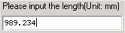
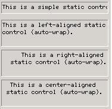
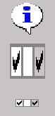
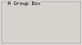
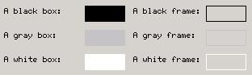
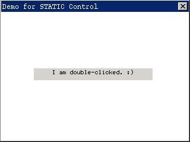

# Static Control


A static control is used to display information, such as text and digits, in 
the specified position of a window, and can also be used to display some static
image information, such as corporation logos, product brands, etc. As suggested
by its name, the behavior of a static box cannot respond dynamically to the 
user input. The existence of the control is basically for displaying some
information, and does not receive any input from the keyboard or the mouse. Fig
19.1 shows the typical use of the static control: to be the label of other
controls in a dialog box.




Figure 1 Typical use of the static control


You can create a static control by calling `CreateWindow` function with
`CTRL_STATIC` as the control class name.

## Types and Styles of Static Control

Styles of a static control comprise the type of the static control and some
flags. We can divide the static controls into standard type (display text 
only), bitmap type (display icon or bitmap), and special type of group box. We
will introduce the different types of static control in the following sections.

### Standard Type

By setting the style of a static control to be one of `SS_SIMPLE`, `SS_LEFT`,
`SS_CENTER`, `SS_RIGHT`, and `SS_LEFTNOWORDWRAP`, you can create a static
control displaying only text. The displayed content thereof is specified in the
caption argument of `CreateWindow` function and can be changed by calling
`SetWindowText.` 

Static controls with `SS_SIMPLE` style can only be used to display single-line
text, that is to say, the text in such controls is not wrapped automatically,
and is always align left.

Static controls with `SS_LEFT`, `SS_CENTER`, or `SS_RIGHT` style can be used to
display multiple-line text, and align the text in the control left, center, and
right respectively.

Static controls with `SS_LEFTNOWORDWRAP` will extend `TAB` characters in the
text, but words are not wrapped automatically.

The following program creates static controls of the several types described
above: 

```
```

The appearance of the controls described above is shown in Figure 2. For 
showing the effect clearly, all these static controls have borders.




Figure 2 Static controls of standard type


### Bitmap Type

A static control with `SS_BITMAP` or `SS_ICON` style displays a bitmap or an
icon in the control. For these two types of static control, it is needed to set
the handle of an icon object or the pointer to a bitmap object to be displayed
through `dwAddData` parameter when the static control is created. Styles
associated with these two types of static control are `SS_CENTERIMAGE` and
`SS_REALSIZEIMAGE`. These two styles are used to control the position of a
bitmap or an icon in the control. By default, the bitmap or icon fills the 
whole static control by appropriate scale, but this scaling operation will be
canceled when `SS_REALSIZEIMAGE` style is used, and the bitmap or icon aligns 
in the top-left of the static control. If `SS_REALSIZEIMAGE` style is used with
`SS_CENTERIMAGE` style simultaneously, the bitmap or icon will be displayed in
the center of the control.

The following program creates a bitmap static control and an icon static
control, and creates a bitmap static control displayed in the center of the
control by using `SS_REALSIZEIMAGE` and `SS_CENTERIMAGE` styles:

```
```

***
[Note] Many predefined controls need you pass some initial parameters of them
through `dwAddData` parameter of `CreateWindowEx` function. Here the first
additional data of the window is used to pass these parameters during creating
the control, and the application can also use the first additional data of the
window to save private data after the control has been created.
***

The appearance of the static controls created by the above program is shown in
Figure 3.




Figure 3 Static control of bitmap type


### Group Box

A static control with `SS_GROUPBOX` style is called a group box, which is a
special type of static control. A group box is a rectangle with the caption
displayed in the top, and it is usually used to include other controls. The
controls that can be created in the group box include Static, Button, Edit Box,
`TextEdit,` List Box, Track Bar, Menu Button.

The following program creates a group box, and its effect is shown in Figure 4:

```
```





### Other static control types

Besides the static controls described above, there are several other static
control types not frequently used:
- `SS_WHITERECT：A` rectangle filled with the light white color.
- `SS_GRAYRECT：A` rectangle filled with the light gray color.
- `SS_BLACKRECT：A` rectangle filled with the black color.
- `SS_GRAYFRAME：A` frame drawn with the light gray color.
- `SS_WHITEFRAME：A` frame drawn with the light white color.
- `SS_BLACKFRAME：A` frame drawn with the black color.

Appearances of the static controls using the above styles are shown in Figure 
5. 




Figure 5 Other static control types


## Static Control Messages

When the static control is of bitmap type, the bitmap can be gotten or changed
by the following messages:
- `STM_GETIMAGE：This` message returns the pointer to the bitmap object or the
handle to the icon.
- `STM_SETIMAGE：To` set the pointer to the bitmap or the handle to the icon
through `wParam` parameter, and returns the old one.

## Notification Codes of Static Control

When the style of a static control includes `SS_NOTIFY`, the static control can
generate the following two notification messages:
- `STN_DBLCLK：Indicates` the user clicked the left button of the mouse in a
static control.
- `STN_CLICKED：Indicates` the user double-clicked the left button of the mouse
in a static control.

## Sample Program

The program in List 1 creates a bitmap static control, and changes the text 
when the user double-clicks the static control. Please refer to static.c of the
demo program package `mg-samples` of this guide to get the complete source code
of the program. The running effect of the program is shown in Figure 6.


List 1 Sample program of static control

```
```




Figure 6 The sample of static control


-- Main.XiaodongLi - 26 Oct 2009


----

[&lt;&lt; ](MiniGUIProgGuidePart.md) |
[Table of Contents](README.md) |
[ &gt;&gt;](MiniGUIProgGuidePart.md)

[Release Notes for MiniGUI 3.2]: /supplementary-docs/Release-Notes-for-MiniGUI-3.2.md
[Release Notes for MiniGUI 4.0]: /supplementary-docs/Release-Notes-for-MiniGUI-4.0.md
[Showing Text in Complex or Mixed Scripts]: /supplementary-docs/Showing-Text-in-Complex-or-Mixed-Scripts.md
[Supporting and Using Extra Input Messages]: /supplementary-docs/Supporting-and-Using-Extra-Input-Messages.md
[Using CommLCD NEWGAL Engine and Comm IAL Engine]: /supplementary-docs/Using-CommLCD-NEWGAL-Engine-and-Comm-IAL-Engine.md
[Using Enhanced Font Interfaces]: /supplementary-docs/Using-Enhanced-Font-Interfaces.md
[Using Images and Fonts on System without File System]: /supplementary-docs/Using-Images-and-Fonts-on-System-without-File-System.md
[Using SyncUpdateDC to Reduce Screen Flicker]: /supplementary-docs/Using-SyncUpdateDC-to-Reduce-Screen-Flicker.md
[Writing DRI Engine Driver for Your GPU]: /supplementary-docs/Writing-DRI-Engine-Driver-for-Your-GPU.md
[Writing MiniGUI Apps for 64-bit Platforms]: /supplementary-docs/Writing-MiniGUI-Apps-for-64-bit-Platforms.md

[Quick Start]: /user-manual/MiniGUIUserManualQuickStart.md
[Building MiniGUI]: /user-manual/MiniGUIUserManualBuildingMiniGUI.md
[Compile-time Configuration]: /user-manual/MiniGUIUserManualCompiletimeConfiguration.md
[Runtime Configuration]: /user-manual/MiniGUIUserManualRuntimeConfiguration.md
[Tools]: /user-manual/MiniGUIUserManualTools.md
[Feature List]: /user-manual/MiniGUIUserManualFeatureList.md

[MiniGUI Overview]: /MiniGUI-Overview.md
[MiniGUI User Manual]: /user-manual/README.md
[MiniGUI Programming Guide]: /programming-guide/README.md
[MiniGUI Porting Guide]: /porting-guide/README.md
[MiniGUI Supplementary Documents]: /supplementary-docs/README.md
[MiniGUI API Reference Manuals]: /api-reference/README.md

[MiniGUI Official Website]: http://www.minigui.com
[Beijing FMSoft Technologies Co., Ltd.]: https://www.fmsoft.cn
[FMSoft Technologies]: https://www.fmsoft.cn
[HarfBuzz]: https://www.freedesktop.org/wiki/Software/HarfBuzz/
