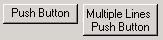
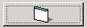
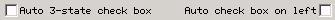
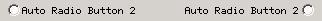
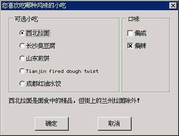

# Button Control

Button control is the most frequently used control besides the static control. 
A button is usually used to provide switch selection for the user. The buttons
of MiniGUI can be classified into push button, check box, radio button, etc. 
The user can select or switch the status of a button with the keyboard or the
mouse. The user’s input will make a button generating notification messages, 
and an application can also send messages to a button to change the status of
it. 

Calling `CreateWindow` function with `CTRL_BUTTON` as the control class name 
can create a button control.

## Types and Styles of Button

### Push button

A push button is a rectangle, in which the window caption passed through
`CreateWindow` is displayed. The rectangle occupies the whole height and width
given when calling `CreateWindow` and the text locates in the center of the
rectangle. 

A push button control is mainly used to trigger an action, which responds
immediately, and does not keep the switch information for long. Such a button
has two window styles, namely `BS_PUSHBUTTON` and `BS_DEFPUSHBUTTON`. “DEF” in
`BS_DEFPUSHBUTTON` means “default”. `BS_PUSHBUTTON` and `BS_DEFPUSHBUTTON` have
different effects when used in a dialog box. No matter which control the input
focus locates on, the button with `BS_DEFPUSHBUTTON` style will take `ENTER` 
key input as the default input. However, the buttons of these two styles have
the same function when used as controls in a normal main window, except that 
the button with `BS_DEFPUSHBUTTON` has a thicker border.

When the mouse cursor is in the button, pressing the left button of the mouse
will make the button redraw itself with three-dimensional shadow, which looks
like being pushed down really. When the mouse button is released, the button
recovers to its original appearance, and generates `BN_CLICKED` notification.
When the button has the input focus, there are dashed lines around the text and
pressing or releasing the Space key or the left mouse button results in the 
same effect.

***
[Prompt] The description of the control behavior and appearance in this guide takes the default classic style as the standard.
***

Generally, text on the push button would display in the central of the vertical
and horizontal directions with single-line form, and will not be wrapped
automatically. An application also can display multiple lines text by 
specifying `BS_MULTLINE` style.The following program creates two push buttons:

```cpp
 CreateWindow (CTRL_BUTTON,
                          "Push Button",
                          WS_CHILD | BS_PUSHBUTTON | BS_CHECKED | WS_VISIBLE,
                          IDC_BUTTON,
                          10, 10, 80, 30, hWnd, 0);

            CreateWindow (CTRL_BUTTON,
                          "Multiple Lines Push Button",
                          WS_CHILD | BS_PUSHBUTTON | BS_MULTLINE | WS_VISIBLE,
                          IDC_BUTTON + 1,
                          100, 10, 80, 40, hWnd, 0);
```

The appearance of the two push buttons created by the program above is as shown
in Figure 1. Note that the text is aligning up when `BS_MULTILINE` style is
used. 




Figure 1 Push buttons


In addition, bitmaps or icons also can also be displayed on the push button. In
the case `BS_BITMAP` or `BS_ICON` style is used, the pointer to a bitmap object
or the handle to an icon should be passed through `dwAddData` argument of
`CreateWindow` function. The bitmap or icon will be scaled to fill the whole
button window in default; however, they are displayed in the center of the
control without any scaling when `BS_REALSIZEIMAGE` style is used. The 
following code fragment creates a button with a bitmap, and its effect is as
shown in Figure 2.

```cpp
hwnd = CreateWindow (CTRL_BUTTON,
        "Close",
        WS_CHILD | BS_PUSHBUTTON | BS_BITMAP |BS_REALSIZEIMAGE | BS_NOTIFY | WS_VISIBLE,
        IDC_BUTTON + 4,
        10, 300, 60, 30, hWnd, (DWORD) GetSystemBitmap (IDI_APPLICATION));
```




Figure 2 Bitmap push button


### Check Box

A check box is a text block, and the text is usually on the right side of a
check mark (if you specify `BS_LEFTTEXT` style when creating the button, the
text will be on the left). A check box is usually used in the application, 
which allows the user to make a selection among options. The commonly used
function of a check box is as a switch: click once shows the checked mark, and
click again clears the mark.

The two most frequently used styles for check box are `BS_CHECKBOX` and
`BS_AUTOCHECKBOX`. When `BS_CHECKBOX` is used, the application need send
messages to the control to set the checked mark; and when `BS_AUTOCHECKBOX`
style is used, the control will switch the status between checked and 
unchecked. 

The other two styles of check box are `BS_3STAT` and `BS_AUTO3STATE`. As hinted
by their names, these two styles can show the third state - the color is gray
within the check box, indicating the check box cannot be selected or used.

The difference between `BS_3STATE` and `BS_AUTO3STATE` is the same as the 
above: the former need the application operates its state, while the latter 
lets the control to be in charge of the automatic state switch.

A check box is left aligned in the rectangle by default, and locates between 
the top and the bottom of the control window (centered vertically). Clicking 
the mouse button in any position in the rectangle will generate a notification
message. Using `BS_LEFTTEXT` style will right-align the check box, and place 
the text in the left of the check mark. Styles for justifying text, such as
`BS_LEFT`, `BS_CENTER`, `BS_RIGHT`, `BS_TOP`, `BS_VCENTER`, `BS_BOTTOM`, etc.
all can be used for the check box.

In addition, using `BS_PUSHLIKE` style will make a check box be displayed as a
push button: in pushed state when checked and normal state when unchecked.

The following program creates two check boxes, and the effect is shown in 
Figure 3.

```cpp
CreateWindow (CTRL_BUTTON,
                          "Auto 3-state check box",
                          WS_CHILD | BS_AUTO3STATE | WS_VISIBLE,
                          IDC_CHECKBOX,
                          10, 60, 150, 30, hWnd, 0);

            CreateWindow (CTRL_BUTTON,
                          "Auto check box on left",
                          WS_CHILD | BS_AUTOCHECKBOX | BS_LEFTTEXT | BS_RIGHT | WS_VISIBLE,
                          IDC_CHECKBOX + 1,
                          170, 60, 150, 30, hWnd, 0);
```




Figure 3 Check boxes


### Radio Button

A radio button is just like the channel selection buttons on a radio. Each
button corresponds to a channel, and each time only one button can be selected.
In a dialog box, the radio button group is usually used for representing
mutually exclusive options. A radio button is different from a check box, for
the work manner is not as a switch; that is to say, when pushing a radio button
again, its status will not change.

The shape of a radio button is a circle, not a rectangle. Except the shape
difference, the behavior of a radio button is very like a check box. The
enhanced dot in the circle means the radio button is already selected. The 
radio button has two styles, namely `BS_RADIOBUTTON` and `BS_AUTORADIOBUTTON`.
The latter will show the selection state of the user automatically, while the
former will not.

By default, a radio button is left justified in the control window, and locates
in the middle between the top and the bottom of the control window (centered
vertically). Pressing the mouse in any position in the rectangle will generate 
a notification message. Using `BS_LEFTTEXT` style will right-justify the combo
box, and place the text in the left of the radio button. Styles for justifying
text, such as `BS_LEFT`, `BS_CENTER`, `BS_RIGHT`, `BS_TOP`, `BS_VCENTER`,
`BS_BOTTOM`, etc., can be used for the radio button.

In addition, using `BS_PUSHLIKE` style will make a radio button be displayed as
a push button: in pushed state when selected and normal state when unselected.
The following program creates two radio buttons, and the effect is shown in 
Figure 4.

```cpp
 CreateWindow (CTRL_BUTTON,
                     "Auto Radio Button 2",
                     WS_CHILD | BS_AUTORADIOBUTTON | WS_VISIBLE,
                     IDC_RADIOBUTTON + 1,
                     20, 160, 130, 30, hWnd, 0);

        CreateWindow (CTRL_BUTTON,
                     "Auto Radio Button 2",
                     WS_CHILD | BS_AUTORADIOBUTTON | BS_LEFTTEXT | BS_RIGHT | WS_VISIBLE,
                     IDC_RADIOBUTTON + 4,
                     180, 160, 140, 30, hWnd, 0);
```




Figure 4 Radio buttons


Radio buttons are generally used in a group, and only one button can be 
selected among the radio buttons in the same group. When creating a group of
radio buttons, we need set their status to be mutually exclusive, so `WS_GROUP`
style needs to be used when creating the first radio button in order to set it
as the “leader button” of the group.

## Messages of Button

The application can do the following works by sending messages to a button:
- To get/set the check state of a radio button or check box:
`BM_GETCHECK、BM_SETCHECK` 
- To get/set the pushed or released state of a push button or a check box:
`BM_GETSTATE、BM_SETSTATE` 
- To get/set the bitmap or icon on the bitmap button: `BM_GETIMAGE、BM_SETIMAGE`
- Sending `BM_CLICK` to simulate clicking operation of the mouse button.

The application sends `BM_SETCHECK` message with `wParam` equal to be
`BST_CHECKED` to a check box or radio box to make it to be the checked state:

```cpp
SendMessage (hwndButton, BM_SETCHECK, BST_CHECKED, 0);
```

In fact `wParam` can be one of the three possible values shown in Table 1. 
These values are also the checked state value returned through `BM_GETCHECK`
message. 


Table 1 States of check box or radio button<br>
| *State identifier* |*Meaning*|
| `BST_UNCHECKED(0`) |Indicates the button is unchecked|
| `BST_CHECKED(1`) |Indicates the button is checked|
| `BST_INDETERMINATE(2`) |Indicates the button is grayed because the state of the button is indeterminate|


We can simulate the button blinking by sending `BM_SETSTATE` message to the
control. The following operation will cause the button to be pushed:

```cpp
SendMessage (hwndButton, BM_SETSTATE, BST_PUSHED, 0) ;
```

The following operation will cause the button to be unpushed:

```cpp
SendMessage (hwndButton, BM_SETSTATE, 0, 0) ;
```

For a bitmap button, `BM_GETIMAGE` or `BM_SETIMAGE` message can be used to get
or set the bitmap object or handle of the icon:

```cpp
int image_type;
PBITMAP btn_bmp;
HICON btn_icon;

int ret_val = SendMessage (hwndButton, BM_GETIMAGE, (WPARAM)&image_type, 0) ;

if (image_type == BM_IMAGE_BITMAP) {
    /* This button uses a bitmap object */
    btn_bmp = (PBITMAP) ret_val;
}
else {
    /* This button useds an icon object */
    btn_icon = (HICON) ret_val;
}

/* Set the button image to be a bitmap object */
SendMessage (hwndButton, BM_SETIMAGE, BM_IMAGE_BITMAP, btn_bmp) ;

/* Set the button image to be an icon object */
SendMessage (hwndButton, BM_SETIMAGE, BM_IMAGE_ICON, btn_icon) ;
```

In addition, in an application, we can simulate the click operation of the user
by sending `BM_CLICK` message to a button.

## Notification Codes of Button

The notification codes generated by a button with `BS_NOTIFY` style are as
follow: 
- `BN_CLICKED`: Indicate the user clicked the button. The value of this
notification code is zero, so if you want to handle `BN_CLICKED` notification
message sent by the button in the parent window, you need only determine 
whether `wParam` parameter of `MSG_COMMAND` message equals to the button
identifier. The generation of this notification is default and will ignore
`BS_NOTIFY` style of the button control.
- `BN_PUSHED`: Indicate the user pushed the button.
- `BN_UNPUSHED`: Indicate the user released the button.
- `BN_DBLCLK`: Indicate the user double-clicked a button.
- `BN_SETFOCUS`: Indicate the button received the keyboard focus.
- `BN_KILLFOCUS`: Indicate a button lost the keyboard focus.

## Sample Program

Generally, to get the click notification code of a push button, the application
need only handle `BN_CLICKED` notification code. Check boxes and radio buttons
are usually set to be the automatic state, and send `BM_GETCHECK` to get the
checked state when necessary. For dialog boxes, the application can also get 
the state information of a button control quickly with the functions listed in
Table 2


Table 2 Convenient functions handling button controls<br>
| *Function* |*Purpose* |*Note*|
| `CheckDlgButton` | Changes the check status of a button control by its identifier||
| `CheckRadioButton` |Adds a check mark to (checks) a specified radio button in a group and removes a check mark from (clears) all other radio buttons in the group |Ensure to check a button mutually exclusively|
| `IsDlgButtonChecked` |Determines whether a button control has a check mark next to it or whether a three-state button control is grayed, checked, or neither||


The program in List 1 gives a comprehensive example for using button controls.
This program uses a dialog box to ask the user about his taste, selects the
snack type by grouped radio buttons, and then selects some special tastes for
the user by check boxes. Please refer to button.c file in the demo program
package `mg-samples` of this guide to get the full source code of this program.
The running effect of this program is shown in Figure 5.


List 1 Example for using button controls

```cpp
#include <stdio.h>
#include <stdlib.h>

#include <minigui/common.h>
#include <minigui/minigui.h>
#include <minigui/gdi.h>
#include <minigui/window.h>
#include <minigui/control.h>

#define IDC_LAMIAN              101
#define IDC_CHOUDOUFU           102
#define IDC_JIANBING            103
#define IDC_MAHUA               104
#define IDC_SHUIJIAO            105

#define IDC_XIAN                110
#define IDC_LA                  111

#define IDC_PROMPT              200

static DLGTEMPLATE DlgYourTaste =
{
    WS_BORDER | WS_CAPTION,
    WS_EX_NONE,
    120, 100, 300, 280,
    "你喜欢吃哪种风味的小吃",
    0, 0,
    12, NULL,
    0
};

static CTRLDATA CtrlYourTaste[] =
{ 
    {
        "static",
        WS_VISIBLE | SS_GROUPBOX, 
        16, 10, 130, 160,
        IDC_STATIC,
        "可选小吃",
        0
    },
    {
        "button",
        /* Using the style BS_CHECKED, make the button checked initially. */
        WS_VISIBLE | BS_AUTORADIOBUTTON | BS_CHECKED | WS_TABSTOP | WS_GROUP,
        36, 38, 88, 20,
        IDC_LAMIAN,
        "西北拉面",
        0
    },
    {
        "button",
        WS_VISIBLE | BS_AUTORADIOBUTTON, 
        36, 64, 88, 20, 
        IDC_CHOUDOUFU, 
        "长沙臭豆腐",
        0
    },
    {
        "button",
        WS_VISIBLE | BS_AUTORADIOBUTTON,
        36, 90, 88, 20,
        IDC_JIANBING,
        "山东煎饼",
        0
    },
    {
        "button",
        WS_VISIBLE | BS_AUTORADIOBUTTON,
        36, 116, 88, 20,
        IDC_MAHUA,
        "天津麻花",
        0
    },
    {
        "button",
        WS_VISIBLE | BS_AUTORADIOBUTTON,
        36, 142, 100, 20,
        IDC_SHUIJIAO,
        "成都红油水饺",
        0
    },
    {
        "static",
        WS_VISIBLE | SS_GROUPBOX | WS_GROUP, 
        160, 10, 124, 160,
        IDC_STATIC,
        "口味",
        0
    },
    {
        "button",
        WS_VISIBLE | BS_AUTOCHECKBOX,
        170, 38, 88, 20,
        IDC_XIAN,
        "偏咸",
        0
    },
    {
        "button",
        /* Using the style BS_CHECKED, make the button checked initially. */
        WS_VISIBLE | BS_AUTOCHECKBOX | BS_CHECKED, 
        170, 64, 88, 20, 
        IDC_LA, 
        "偏辣",
        0
    },
    {
        "static",
        WS_VISIBLE | SS_LEFT | WS_GROUP,
        16, 180, 360, 20,
        IDC_PROMPT,
        "西北拉面是面食中的精品，但街上的兰州拉面除外！",
        0
    },
    {
        "button",
        WS_VISIBLE | BS_DEFPUSHBUTTON | WS_TABSTOP | WS_GROUP,
        80, 220, 95, 28,
        IDOK, 
        "确定",
        0
    },
    {
        "button",
        WS_VISIBLE | BS_PUSHBUTTON | WS_TABSTOP,
        185, 220, 95, 28,
        IDCANCEL,
        "取消",
        0
    },
};

static char* prompts [] = {
    "西北拉面是面食中的精品，但街上的兰州拉面除外！",
    "长沙臭豆腐口味很独特，一般人适应不了。",
    "山东煎饼很难嚼 :(",
    "天津麻花很脆，很香！",
    "成都的红油水饺可真好吃啊！想起来就流口水。",
};

static void my_notif_proc (HWND hwnd, int id, int nc, DWORD add_data)
{
    /* When the user selects an different snack,
     * prompt information is displayed for the snack in a static control
     */
    if (nc == BN_CLICKED) {
        SetWindowText (GetDlgItem (GetParent (hwnd), IDC_PROMPT), prompts [id - IDC_LAMIAN]);
    }
}

static int DialogBoxProc2 (HWND hDlg, int message, WPARAM wParam, LPARAM lParam)
{
    switch (message) {
    case MSG_INITDIALOG:
        {
            int i;
            /* Set the notification callback function for the radio button of the snack */
            for (i = IDC_LAMIAN; i <= IDC_SHUIJIAO; i++)
                SetNotificationCallback (GetDlgItem (hDlg, i), my_notif_proc);
        }
        return 1;
        
    case MSG_COMMAND:
        switch (wParam) {
        case IDOK:
        case IDCANCEL:
            EndDialog (hDlg, wParam);
            break;
        }
        break;
        
    }
    
    return DefaultDialogProc (hDlg, message, wParam, lParam);
}

int MiniGUIMain (int argc, const char* argv[])
{
#ifdef _MGRM_PROCESSES
    JoinLayer(NAME_DEF_LAYER , "button" , 0 , 0);
#endif
    
    DlgYourTaste.controls = CtrlYourTaste;
    
    DialogBoxIndirectParam (&DlgYourTaste, HWND_DESKTOP, DialogBoxProc2, 0L);

    return 0;
}

#ifndef _MGRM_PROCESSES
#include <minigui/dti.c>
#endif
```




Figure 5 Example for using button controls</center>


-- Main.XiaodongLi - 26 Oct 2009


----

[&lt;&lt; ](MiniGUIProgGuidePart.md) |
[Table of Contents](README.md) |
[ &gt;&gt;](MiniGUIProgGuidePart.md)

[Release Notes for MiniGUI 3.2]: /supplementary-docs/Release-Notes-for-MiniGUI-3.2.md
[Release Notes for MiniGUI 4.0]: /supplementary-docs/Release-Notes-for-MiniGUI-4.0.md
[Showing Text in Complex or Mixed Scripts]: /supplementary-docs/Showing-Text-in-Complex-or-Mixed-Scripts.md
[Supporting and Using Extra Input Messages]: /supplementary-docs/Supporting-and-Using-Extra-Input-Messages.md
[Using CommLCD NEWGAL Engine and Comm IAL Engine]: /supplementary-docs/Using-CommLCD-NEWGAL-Engine-and-Comm-IAL-Engine.md
[Using Enhanced Font Interfaces]: /supplementary-docs/Using-Enhanced-Font-Interfaces.md
[Using Images and Fonts on System without File System]: /supplementary-docs/Using-Images-and-Fonts-on-System-without-File-System.md
[Using SyncUpdateDC to Reduce Screen Flicker]: /supplementary-docs/Using-SyncUpdateDC-to-Reduce-Screen-Flicker.md
[Writing DRI Engine Driver for Your GPU]: /supplementary-docs/Writing-DRI-Engine-Driver-for-Your-GPU.md
[Writing MiniGUI Apps for 64-bit Platforms]: /supplementary-docs/Writing-MiniGUI-Apps-for-64-bit-Platforms.md

[Quick Start]: /user-manual/MiniGUIUserManualQuickStart.md
[Building MiniGUI]: /user-manual/MiniGUIUserManualBuildingMiniGUI.md
[Compile-time Configuration]: /user-manual/MiniGUIUserManualCompiletimeConfiguration.md
[Runtime Configuration]: /user-manual/MiniGUIUserManualRuntimeConfiguration.md
[Tools]: /user-manual/MiniGUIUserManualTools.md
[Feature List]: /user-manual/MiniGUIUserManualFeatureList.md

[MiniGUI Overview]: /MiniGUI-Overview.md
[MiniGUI User Manual]: /user-manual/README.md
[MiniGUI Programming Guide]: /programming-guide/README.md
[MiniGUI Porting Guide]: /porting-guide/README.md
[MiniGUI Supplementary Documents]: /supplementary-docs/README.md
[MiniGUI API Reference Manuals]: /api-reference/README.md

[MiniGUI Official Website]: http://www.minigui.com
[Beijing FMSoft Technologies Co., Ltd.]: https://www.fmsoft.cn
[FMSoft Technologies]: https://www.fmsoft.cn
[HarfBuzz]: https://www.freedesktop.org/wiki/Software/HarfBuzz/
