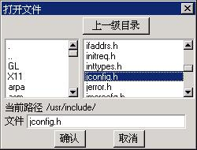
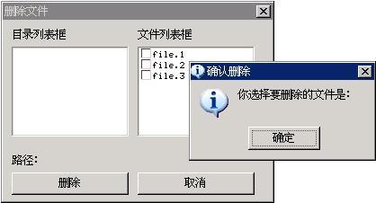

# List Box Control

A list box generally provides a series of options, which are shown in a scroll
window. The user can select one or more items with the keyboard or mouse
operation. The selected items are usually highlighted. The most typical use of
list box is the open file dialog box, as shown in Figure 1.




Figure 1 Typical use of list box: “Open File” dialog box


We can create a list box control by calling `CreateWindow` function with
`CTRL_LISTBOX` as the control class name.

## Types and Styles of List Box

List box controls of MiniGUI can be divided into three types: single-selection
list box, multiple-selection list box and bitmap list box. A list box is
single-selection style by default; namely, the user can only select one item. 
To create a multiple-selection list box, you should use `LBS_MULTIPLESEL` 
style. When using this style, the user can select an item by clicking this 
item, and cancel the selection by clicking it again. When the list box has the
input focus, you can also use the space key to select or cancel selection of an
item. The effect of running a multiple-selection list box is as shown in Figure
2. 


Figure 2 Multiple-selection list box


Besides the two list box types described above, MiniGUI also provides an
advanced list box type. In this type of list box, the list item can be not only
text string, but also attached by a bitmap or an icon. With such a list box, we
can also display a check box besides the list item to represent checked or
uncheck status. To create such an advanced list box, `LBS_USEICON` or
`LBS_CHECKBOX` style should be specified. Fig 21.3 shows the running effect of
the advanced list box. If you want the selection state auto-switched when the
user clicks the check box, you can use `LBS_AUTOCHECK` style. The advanced list
box can also have `LBS_MULTIPLESEL` style.


Figure 3 Advanced list box control


Except the styles described above to distinguish the type of list box, you can
also specify other general styles when creating a list box.

By default, the message handler of a list box only shows the list items, with 
no border around them. You can add border by using the window style `WS_BORDE`.
In addition, you can also add a vertical scroll bar with window style 
`WS_VSCROLL` to scroll the list items by the mouse and add a horizontal scroll
bar with window style `WS_HSCROLL`.

The default list box styles does not generate notification message when the 
user select a list item, so the program must send a message to the list box to
get the selection state of item. Therefore, a list box control generally
includes `LBS_NOTIFY` style, which can feed back some state information in time
to the application during the user’s operation.

In addition, if you want the list box control sort the list items, you can use
another commonly used style `LBS_SORT`.

Generally, the most commonly used style combination for creating list box is as
follows: 


```
```

## Messages of List Box
### Adding Item into List Box

After a list box is created, the next step is to add text strings to it. You 
can realize this by sending messages to the window message handler of the list
box by calling `SendMessage.` The items in a list box can be referred to by an
index value; the top-most item has index value of zero. In the following
example, `hwndList` is the handle of the list box control, and index is the
index value. When `SendMessage` is used to pass the text string, `lParam` is 
the pointer to the `NULL-terminated` string.

When the stored content of the list box exceeds the available memory space,
`SendMessage` returns `LB_ERRSPACE`. If error is caused by other reasons,
`SendMessage` returns `LB_ERR`. If the operation is successful, `SendMessage`
returns `LB_OKAY`. We can determine above two errors by testing the non-zero
value of `SendMessage.`

If you adopt `LBS_SORT` style, or just want to append the new text string as 
the last item of a list box, the simplest approach to append string into the
list box is using `LB_ADDSTRING` message:

```
```

We can also use `LB_INSERTSTRING` to specify an index, and insert a text string
to the specified position of the list box.

```
```

For example, if index value is 4, string would be a text string with index 4:
the fifth string counting from the beginning (due to zero-based), and all the
text strings after this position will move backward. When the index is -1, the
string will append to the last position. We can also use `LB_INSERTSTRING` for 
a list box with `LBS_SORT` style, but at this time the list box will ignore the
index, and insert the new item according to the sorted result.

It should be noted that, after specifying `LBS_CHECKBOX` or `LBS_USEICON` 
style, when you add an item to a list box, you must use `LISTBOXITEMINFO`
structure, and cannot use the string address directly, for example:


```
```

Here, the value of `cmFlag` can be `CMFLAG_CHECKED`, `CMFLAG_BLANK`, or
`CMFLAG_PARTCHECKED`, indicating checked, unchecked, and partly checked,
respectively. 

We can also display bitmaps in an advanced list box, rather than icons by
default. If you want a list box item display a bitmap instead of an icon, you
can include `IMGFLAG_BITMAP` in the flag, and specify the pointer to the bitmap
object: 


```
```

### Deleting Item from List Box

Send `LB_DELETESTRING` message and specify the index value, and then you can
delete an item with the index from the list box:

```
```

We can even use `LB_RESETCONTENT` message to clear all contents in the list 
box: 

```
```

### Selecting and Getting Item

Send `LB_GETCOUNT` to get the number of items in the list box:

```
```

When you need to get the text string of a certain item, you can send
`LB_GETTEXTLEN` message to get the length of the string of the specified item 
in a list box:

```
```

And then, copy the item to a text buffer by sending the message `MSG_GETTEXT:`

```
```

In these two conditions, the length value returned by above messages is the
length of the text. For the length of a `NULL-terminate` string, the buffer 
must be big enough. You can use the string length returned by `LB_GETTEXTLEN`
message to allocate some local memory for storing the string.

If we need to set the string of list item, you can send `LB_SETTEXT` message:

```
```

For an advanced list box, we must use `LB_GETITEMDATA` and `LB_SETITEMDATA` to
get other information of a list item, such as the bitmap object or the handle 
to icon, state of check box, and these messages also can be used to get or set
the text string of item:

```
```

The following messages are used to retrieve the selection state of list items;
these messages have different calling method for single-selection list box and
multiple-selection list box. Let us to look at the single-selection list box
first. 

Generally, the user selects an item by mouse and keyboard. But we also can
control the current selected item by program, at this time, we need send
`LB_SETCURSEL` message:


```
```

In contrast, we can use `LB_GETCURSEL` to get the current selected item:

```
```

If no item is selected, then the message returns `LB_ERR`.

For multiple-selection list box, `LB_SETCURSEL` and `LB_GETCURSEL` can only be
used to set or get the current highlighted item, but cannot get all selected
items. But we can use `LB_SETSEL` to set the selection state of a certain item
without affecting other items:

```
```

If `wParam` is not 0, this function selects and highlights an item; if `wParam`
is 0, this function cancels the selection. In contrast, we can use `LB_GETSEL`
to get the selection state of a certain item:

```
```

Here, if the item specified by index is selected, select is a non-zero value,
else select is 0.

In addition, you can also use `LB_GETSELCOUNT` message to get the number of all
selected items in a multiple-selection list box. Then you can send
`LB_GETSELITEMS` message to get the index values of all the selected items. The
following is an example:

```
```

### Searching Item Including a Text String

```
```

Here, string is the pointer to a string, which should be found; the message
returns the index of the fuzzy matched string, and `LB_ERR` means failure. 
Using `LB_FINDSTRINGEXACT` message will search the matched item exactly.

### Setting/Getting the Status of Check Mark

```
```

The message `LB_GETCHECKMARK` returns the check mark status of the check box
specified by index. If corresponding item is not found, `LB_ERR` returned.
`CMFLAG_CHECKED` indicates the check box of the item is checked.
`CMFLAG_PARTCHECKED` indicates the check box of the item is partly checked.
`CMFLAG_BLANK` indicates the check box of the item is not checked.

```
```

The message `LB_SETCHECKMARK` sets the check mark status of the check box
specified by index to be the value of status. If the item specified by the 
index is not found, it returns `LB_ERR` for failure, else returns `LB_OKAY` for
success. 

### Setting the Bold Status of Item

```
```

The message `LB_` `SETITEMBOLD` sets the bold status of the item specified by
index to be the value of status (TRUE or `FALSE).` If the item specified by the
index is not found, it returns `LB_ERR` for failure.

### Setting/Getting the Disable Status of Item

```
```

The message `LB_GETI` `TEMDISABLE` returns the disable status of the item
specified by index. If corresponding item is not found, `LB_ERR` returned. 1
indicates the item is disabled. 0 indicates the item is not disabled.

```
```

The message `LB_SETITEMDISABLE` sets the disable status of the item specified 
by index to be the value of status. If the item specified by the index is not
found, it returns `LB_ERR` for failure.

### Adding Multiple Items into List Box

The message `LB_MULTIADDITEM` is used to adding multiple items into List Box.
When the stored content of the list box exceeds the available memory space,
`SendMessage` returns `LB_ERRSPACE`. If error is caused by other reasons,
`SendMessage` returns `LB_ERR`. If the operation is successful, `SendMessage`
returns `LB_OKAY`. We can determine above two errors by testing the non-zero
value of `SendMessage.`

If you adopt `LBS_SORT` style, or just want to append the new text string array
as the last items of a list box, sample is as follows:

```
```

Parameter `hwndList` is the handle of the list box control; num is the number 
of item added, and text is the string text array address.

It should be noted that, after specifying `LBS_CHECKBOX` or `LBS_USEICON` 
style, when you add multiple items to a list box, you must use 
`LISTBOXITEMINFO` structure, and cannot use the string array address directly,
for example:

```
```

### Other Messages

A list box with style of `LBS_SORT` uses the standard C function strncmp to 
sort items. But we can overload the default sort method by using
`LB_SETSTRCMPFUNC` in order to sort items according to the expected method. For
example: 

```
```

Thus, the list box will use the user-defined function to sort items. Sort
function described above can be used to sort the items in form as 1, 2, 3, 4,
10, 20 etc. according to integer values, while the default sort rule would sort
the items above as 1, 10, 2, 20, 3, and 4. Generally speaking, application
should use the message to set a new string comparison function before adding 
any item.

We also can associate an additional 32-bit data with each list item, and get 
the value at appropriate time. For doing this, we can use `LB_SETITEMADDDATA`
and `LB_GETITEMADDDATA` messages. The values operated by the two messages have
no meaning for the list box control. The control only takes charge to store the
value and return the value when needed.

In addition, we can also use `LB_SETITEMHEIGHT` message to set the height of
items, and use `LB_GETITEMHEIGHT` to get the height. Generally, height of items
depends on the size of control font, and varies when the control font changes
(call `SetWindowFont` to change). The users can also set themselves height of
items. The actual height will be the maximum of the height set and control font
size. 


## Notification Codes of List Box

Notification codes generated by a list box with `LBS_NOTIFY` style and their
meanings are shown in Table 1.


Table 1 Notification codes of list box<br>
| *Notification code identifier* |*Meaning*|
| `LBN_ERRSPACE` |Indicates that memory allocation failure.|
| `LBN_SELCHANGE` |Indicates the current selected item changes|
| `LBN_CLICKED` |Indicates click on an item|
| `LBN_DBLCLK` |Indicates double click on an item|
| `LBN_SELCANCEL` |Indicates cancel of the selection|
| `LBN_SETFOCUS` |Indicates gain of input focus|
| `LBN_KILLFOCUS` |Indicates loss of input focus|
| `LBN_CLICKCHECKMARK` |Indicates click on the check mark|
| `LBN_ENTER` |Indicates the user has pressed the `ENTER` key|


A list box control will not send notification messages described above unless
the window style of the list box have `LBS_NOTIFY` style. Certainly, if you 
have called `SetNotificationCallback` function to set the notification callback
function, the control will not send `MSG_COMMAND` notification message to its
parent window, but call the specified notification callback function directly.

`LBN_ERRSPACE` indicates that the memory allocation fails. `LBN_SELCHANGE`
indicates the currently selected item has been changed, which occurs in the
following cases: the user changes the highlighted item with the keyboard or
mouse, or the user switches the selection status with the Space key or mouse.
`LBN_CLICKED` indicates the mouse, which occurs when the user uses the mouse to
click an item, clicks the list box. `LBN_DBLCLK` indicates an item is double
clicked by the user if `LBS_CHECKBOX` style is set, `LBN_CLICKCHECKMARK`
indicates the user clicked the check mark, and if `LBS_AUTOCHECK` style is set
at the same time, the check box will be auto-switched between the checked or
unchecked status.

Based on the requirements of applications, either `LBN_SELCHANGE` or 
`LBN_DBLCLK` might be used, or both might be used. Program will receive many
messages of `LBN_SELCHANGE`, but the message of `LBN_DBLCLK` will be received
only when users double click.

## Sample Program

The program in List 1 provides an example for the use of list box controls. The
program imitates the “Open File” dialog box to realize the file deleting
function. Initially, the program lists all the files in the current directory,
and the user can also change to other directories through the directory list
box. The user can select multiple files to be deleted in the file list box by
select the check marks. When the user pushes the “Delete” button, the program
will prompt the user. Of course, to protect the user’s files, the program does
not delete the files really. The effect of the dialog box created by this
program is shown in Figure 4. Please refer to listbox.c file of the demo 
program package of this guide for complete source code.


List 1 The use of list box controls

```
```




Figure 4 “Delete File” dialog box


-- Main.XiaodongLi - 26 Oct 2009


----

[&lt;&lt; ](MiniGUIProgGuidePart.md) |
[Table of Contents](README.md) |
[ &gt;&gt;](MiniGUIProgGuidePart.md)

[Release Notes for MiniGUI 3.2]: /supplementary-docs/Release-Notes-for-MiniGUI-3.2.md
[Release Notes for MiniGUI 4.0]: /supplementary-docs/Release-Notes-for-MiniGUI-4.0.md
[Showing Text in Complex or Mixed Scripts]: /supplementary-docs/Showing-Text-in-Complex-or-Mixed-Scripts.md
[Supporting and Using Extra Input Messages]: /supplementary-docs/Supporting-and-Using-Extra-Input-Messages.md
[Using CommLCD NEWGAL Engine and Comm IAL Engine]: /supplementary-docs/Using-CommLCD-NEWGAL-Engine-and-Comm-IAL-Engine.md
[Using Enhanced Font Interfaces]: /supplementary-docs/Using-Enhanced-Font-Interfaces.md
[Using Images and Fonts on System without File System]: /supplementary-docs/Using-Images-and-Fonts-on-System-without-File-System.md
[Using SyncUpdateDC to Reduce Screen Flicker]: /supplementary-docs/Using-SyncUpdateDC-to-Reduce-Screen-Flicker.md
[Writing DRI Engine Driver for Your GPU]: /supplementary-docs/Writing-DRI-Engine-Driver-for-Your-GPU.md
[Writing MiniGUI Apps for 64-bit Platforms]: /supplementary-docs/Writing-MiniGUI-Apps-for-64-bit-Platforms.md

[Quick Start]: /user-manual/MiniGUIUserManualQuickStart.md
[Building MiniGUI]: /user-manual/MiniGUIUserManualBuildingMiniGUI.md
[Compile-time Configuration]: /user-manual/MiniGUIUserManualCompiletimeConfiguration.md
[Runtime Configuration]: /user-manual/MiniGUIUserManualRuntimeConfiguration.md
[Tools]: /user-manual/MiniGUIUserManualTools.md
[Feature List]: /user-manual/MiniGUIUserManualFeatureList.md

[MiniGUI Overview]: /MiniGUI-Overview.md
[MiniGUI User Manual]: /user-manual/README.md
[MiniGUI Programming Guide]: /programming-guide/README.md
[MiniGUI Porting Guide]: /porting-guide/README.md
[MiniGUI Supplementary Documents]: /supplementary-docs/README.md
[MiniGUI API Reference Manuals]: /api-reference/README.md

[MiniGUI Official Website]: http://www.minigui.com
[Beijing FMSoft Technologies Co., Ltd.]: https://www.fmsoft.cn
[FMSoft Technologies]: https://www.fmsoft.cn
[HarfBuzz]: https://www.freedesktop.org/wiki/Software/HarfBuzz/
