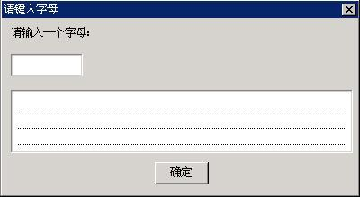

# Edit Box Control

- [Styles of Edit Box](#styles-of-edit-box)
- [Messages of Edit Box](#messages-of-edit-box)
   + [Getting/Setting Caret Position](#gettingsetting-caret-position)
   + [Setting/Getting Selection of Text](#settinggetting-selection-of-text)
   + [Copy, Cut, and Past](#copy-cut-and-past)
   + [Setting/Getting Properties of Line Height and Others](#settinggetting-properties-of-line-height-and-others)
   + [Setting Limit of Text](#setting-limit-of-text)
   + [Setting or Canceling Read-only Status](#setting-or-canceling-read-only-status)
   + [Setting/Getting Password Character](#settinggetting-password-character)
   + [Setting Title and Tip Text](#setting-title-and-tip-text)
   + [Setting End of Line Symbol](#setting-end-of-line-symbol)
   + [Setting End of Line](#setting-end-of-line)
   + [Getting Paragraphs Information](#getting-paragraphs-information)
- [Notification Codes of Edit Box](#notification-codes-of-edit-box)
- [Sample Program](#sample-program)


The edit box provides an important approach for the application to receive the
user input. Compared with the controls mentioned above, such as static control,
button, list box, etc., the behaviors of edit box is relatively simple. The
edit box displays a caret, and the character input by the user would be
inserted at the caret position. Besides that, the edit box also provides some
simple editing functions such as selecting text, deleting text, moving the
caret position, etc.

MiniGUI uses the following three control classes to implement the edit box:
- Single-line edit box: class name 'sledit', 'edit', identifier `CTRL_SLEDIT`,
`CTRL_EDIT`. It can only handle single-line text, but with the help of MiniGUI
logical font, it can handle arbitrary multi-byte characters, including
variable-byte charset. The Control provides the functions of being Selected,
Copy and Paste, etc.
- Multiple-line edit box: class name 'textedit', 'mledit', 'medit', identifier
`CTRL_TEXTEDIT`, `CTRL_MLEDIT`, or `CTRL_MEDIT`. It can handle arbitrary
multiple-byte character input, including variable-byte charset. The Control
provides the functions of being Selected, Copy and Paste, etc.
- Single-line Double-Direction edit box: class name "bidisledit", identifier
`CTRL_BIDISLEDIT`. It can only handle single-line text, except the functions of
Single-line edit box, it can display and input Double-Direction texts,
including Arabic and Hebrew. The Control provides the functions of being
Selected, Copy and Paste, etc.

Except the differences described above, the styles, messages and notification
codes of the three types of edit box control classes are general similar, with
only a little differences. Fig 22.1 shows the running effect of the three types
of edit boxes.


__Figure 1__ MiniGUI edit boxes

## Styles of Edit Box

Generally, we use the following style combination when creating an edit box:

```cpp
WS_CHILD | WS_VISIBLE | WS_BORDER
```

Apparently, the style definition above does not use any styles specific to edit
box. That is to say, we can use edit box normally without specifying any
special styles of edit box. But the edit box has some special styles, mainly
including:
- `ES_UPPERCASE`: Make the edit box display all characters in uppercase.
- `ES_LOWERCASE`: Make the edit box display all characters in lowercase.
- `ES_PASSWORD`: Edit box is used for inputting the password, and displays an
asterisk (`*`) for each character typed into the edit box.
- `ES_READONLY`: Create a read-only edit box, the user cannot change the text
in the edit box, but the caret is visible.
- `ES_BASELINE`: Draws a base line under text of the edit box.
- `ES_AUTOWRAP`: Used for a multiple-line edit box, and automatically wraps
against border when the text input exceeds the control border.
- `ES_LEFT`: Specify the aligning style for a single line edit box, and
realizes the left-align style.
- `ES_NOHIDESEL`: Remain selected for the selected text when losing focus.
- `ES_AUTOSELECT`: Selects all text when getting focus (only valid for
single-line edit box).
- `ES_TITLE`: Shows specified title texts in the first row, and this style is
only suitable for Multiple-line edit box.
- `ES_TIP`: When content of edit box is `NULL`, shows related tip texts, and
this style is only suitable for `SLEDIT` control.
- `ES_CENTER`: Specify the aligning style for a single line edit box, and
realizes the center-align style.
- `ES_RIGHT`: Specify the aligning style for a single line edit box, and
realizes the right-align style.

For a multiple-line edit box, if you want to use the scroll bars, you can
specify the styles `WS_HSCROLL` and/or `WS_VSCROLL`.

The following styles can be used to multiple-line edit box: `ES_UPPERCASE`,
`ES_LOWERCASE`, `ES_READONLY`, `ES_BASELINE`, `ES_AUTOWRAP`, `ES_NOHIDESEL`,
and `ES_TITLE`.

The following styles can be used to single-line edit box: `ES_UPPERCASE`,
`ES_LOWERCASE`, `ES_READONLY`, `ES_BASELINE`, `ES_LEFT`, `ES_CENTER`,
`ES_RIGHT`, `ES_PASSWORD`, `ES_NOHIDESEL`, `ES_AUTOSELECT`, and `ES_TIP`.

## Messages of Edit Box

You can get the current text information in the edit box by using the following
messages. These messages can be used for the two types of edit box classes
described above:

- `MSG_GETTEXTLENGTH`: Get the length of the text with byte as unit.
- `MSG_GETTEXT`: Copy the text in the edit box.
- `MSG_SETTEXT`: Set the text in the edit box.

The application can also call the following three functions to complete
corresponding work:

- `GetWindowTextLength`
- `GetWindowText`
- `SetWindowText`

In fact, the three functions above are the simple wraps of the three messages
mentioned above. As we have seen in the foregoing chapters, the same messages
and functions can also be used for controls such as static control and button
control.

The messages to be introduced in the following sections are special for edit
box.

### Getting/Setting Caret Position

Sending `EM_GETCARETPOS` message to the edit box will get the current caret
position:

```cpp
int line_pos;
int char_pos;

SendMessage (hwndEdit, EM_GETCARETPOS, (WPARAM) &line_pos, (LPARAM) &char_pos);
```

After the message returns, `line_pos` and `char_pos` include the line number
and the position in that line of the caret. For a single-line edit box,
`line_pos` is always zero, so you can pass `NULL` value for the argument
`wParam` of the message.

It should be noted that, for multi-line edit box, one lines means a character
string line ended with a linefeed (carriage return), instead of a line in a
paragraph when displayed with `ES_AUTOWRAP` style. Character position in edit
box of MiniGUI takes multiple byte character (such as Chinese characters) as
unit when displaying multiple byte text, instead of byte. This definition works
for other messages of edit box.

The application can also set the caret position through `EM_SETCARETPOS`
message:

```cpp
int line_pos;
int char_pos;

SendMessage (hwndEdit, EM_SETCARETPOS, line_pos, char_pos);
```

`wParam` and `IParam` argument specify line position and character position
respectively.

### Setting/Getting Selection of Text

`EM_GETSEL` message is used to get the currently selected text:

```cpp
char buffer[buf_len];

SendMessage (hwndEdit, EM_GETSEL, buf_len, (LPARAM) buffer);
```

Here, `lParam` argument specifies the character buffer for saving the gotten
text; `wParam` argument specifies the size of the buffer. If the specified
buffer is small, then excrescent text will be cut off.

`EM_SETSEL` message is used to set the currently selected text:

```cpp
int line_pos, char_pos;

SendMessage (hwndEdit, EM_SETSEL, line_pos, char_pos);
```

Here, `lParam` argument specifies the row index of selected point; `wParam`
specifies the character position in line of selected point. After this message
is sent, text between the current insertion point and the selected point will
be selected.

`EM_GETSELPOS` message is used to get the position of currently selected point:


```cpp
int line_pos;
int char_pos;

SendMessage (hwndEdit, EM_GETCARETPOS, (WPARAM) &line_pos, (LPARAM) &char_pos);
```

The use of `EM_GETSELPOS` message is similar to that of `EM_GETCARETPOS`
message.

`EM_SELECTALL` message is used to make all the text in edit box selected, as
`CTRL+A` operation:

```cpp
SendMessage (hwndEdit, EM_SELECTALL, 0, 0);
```

### Copy, Cut, and Past

You can perform edit operations on an edit box control, for example, copy, cut,
and paste, by key operations or sending corresponding messages. Keyboard
operations of edit box control, such as copy:
- `CTRL+C`: Copy text from edit box to clipboard
- `CTRL+V`: Copy text from clipboard to edit box
- `CTRL+X`: Cut text of edit box to clipboard

`EM_COPYTOCB` message is used to copy the currently selected text of an edit
box control to the clipboard, as <CTRL+C> operation:

```cpp
SendMessage (hwndEdit, EM_COPYTOCB, 0, 0);
```

`EM_CUTTOCB` message is used to cut the currently selected text of an edit box
control to the clipboard, as <CTRL+X> operation:

```cpp
SendMessage (hwndEdit, EM_CUTTOCB, 0, 0);
```

`EM_INSERTCBTEXT` message is used to copy the text on the clipboard to an edit
box, as <CTRL+V> operation:

```cpp
SendMessage (hwndEdit, EM_INSERTCBTEXT, 0, 0);
```

### Setting/Getting Properties of Line Height and Others

Row height here represents the height of single line in wrapped display style.

`EM_GETLINEHEIGHT` message is used to get the row height of an edit box:

```cpp
int line_height;
line_height = SendMessage (hwndEdit, EM_GETLINEHEIGHT, 0, 0);
```

`EM_SETLINEHEIGHT` message is used to set the row height, If success, return
old line height value, otherwise return –1:

```cpp
int line_height;
SendMessage (hwndEdit, EM_SETLINEHEIGHT, line_height, 0);
```

__NOTE__ It should be noted that it is preferred to use `EM_SETLINEHEIGHT` message
before setting text of an edit box, because reset row height will redraw the
whole content of the edit box.

`EM_GETLINECOUNT` message is used to get the number of rows:

```cpp
int line_count;
line_count = SendMessage (hwndEdit, EM_GETLINECOUNT, 0, 0);
```

Row herein represents a single line in wrapped display style.

### Setting Limit of Text

Sending `EM_LIMITTEXT` to an edit box can set the text upper limit in bytes of
an edit box:

```cpp
SendMessage (hwndEdit, EM_LIMITTEXT, 10, 0L);
```

The message above will make that only 10 bytes of characters can be input to
the edit box.

### Setting or Canceling Read-only Status

Using `EM_SETREADONLY` message and passing `TRUE` for `wParam`, the edit box
will be set in read-only status, and passing `FALSE` for `wParam` will make the
edit box be set in normal editable status.

### Setting/Getting Password Character

By default, MiniGUI uses asterisks (`*`) to display the characters input in a
password edit box. However, we can use the `EM_SETPASSWORDCHAR` message to
change the password character:

```cpp
SendMessage (hwndEdit, EM_SETPASSWORDCHAR, ‘%’, 0L);
```
The message above will change the password character to be ‘%’.

Using `EM_GETPASSWORDCHAR` message would get the current password character.

__PROMPT__ Password character only can be set ASCII code which can be displayed.

Note that `TEXTEDIT` control does not carry out `EM_SETPASSWORDCHAR` and
`EM_GETPASSWORDCHAR` messages.

### Setting Title and Tip Text

When `SLEDIT` has `ES_TIP` styles, you can set tip text of the edit box using
`EM_SETTIPTEXT` message, and get tip text of edit box using `EM_GETTIPTEXT`
message.

```cpp
int len;
char *tip_text;
SendMessage (hwndEdit, EM_SETTIPTEXT, len, (LPARAM)tip_text);
```

Here `lParam` parameter specifies tip text string, `wParam` parameter specifies
the length of the string; if `tip_text` is ended with ’\0’, `wParam` can be set
to -1, if `wParam` is 0, `tip_text` can be `NULL`. `EM_GETTIPTEXT` message will
return the current tip text string:

```cpp
int len;
char tip_text[len+1];
SendMessage (hwndEdit, EM_GETTIPTEXT, len, (LPARAM)tip_text);
```

Here `lParam` specifies the buffer to store the tip text string; `wParam`
specifies the length of the string that can be stored in buffer (not including
’\0’).

When `TEXTEDIT` control has `ES_TITLE` style, you can use `EM_SETTITLETEXT`
message to set the title text of the edit box, and use `EM_GETTITLETEXT`
message to get title text of edit box:


```cpp
int len;
char *title_text;
SendMessage (hwndEdit, EM_SETTITLETEXT, len, (LPARAM)title_text);
```

Here `lParam` parameter specifies title text string, `wParam` parameter
specifies the length of the string; if `tip_text` is ended with ’\0’, `wParam`
can be set as -1, if `wParam` is 0, `tip_text` can be `NULL`. `EM_GETTIPTEXT`
message will return current title text string.

```cpp
int len;
char title_text[len+1];
SendMessage (hwndEdit, EM_GETTITLETEXT, len, (LPARAM)title_text);
```

Here `lParam` parameter specifies the buffer to store the title text string;
`wParam` parameter specifies the length of string that can be stored in the
buffer (not including ’\0’).

### Setting End of Line Symbol

In normal situation, `TEXTEDIT` edit box will not display linefeed symbol. If
using `EM_SETLFDISPCHAR` message sets the display symbol for line feeds, then
edit box will display linefeed as the set display symbol.

```cpp
char disp_char;
SendMessage (hwndEdit, EM_SETLFDISPCHAR, 0, disp_char);
```

Here `lParam` parameter is the display symbol to be set for linefeed.

For example, if you want to display linefeed with `*`, you can set as follows:

```cpp
SendMessage (hwndEdit, EM_SETLFDISPCHAR, 0, '*');
```

### Setting End of Line

In default situation, linefeed symbol of `TEXTEDIT` edit box is ’\n’. You can
use `EM_SETLINESEP` message to change the line feed used by edit box.

```cpp
char sep_char;
SendMessage (hwndEdit, EM_SETLINESEP, 0, sep_char);
```

Here `lParam` parameter is the linefeed symbol to be set.

For example, if you want to indicate the line is end with `TAB` character, you
can set as follows:

```cpp
SendMessage (hwndEdit, EM_SETLINESEP, 0, ‘\t’);
```

### Getting Paragraphs Information

`EM_GETNUMOFPARAGRAPHS` message is used to get the number of paragraphs.

```cpp
int num;
num = SendMessage (hwnd, EM_GETNUMOFPARAGRAPHS, 0, 0);
```

`EM_GETPARAGRAPHLENGTH` message is used to get the length of a specified
paragraph。If success, return the length of a specified paragraph, otherwise
return –1.

```cpp
int len;
len = SendMessage (hwnd, EM_GETPARAGRAPHLENGTH, idx, 0);
```

Here, `wParam` argument specifies the paragraph index.

`EM_GETPARAGRAPHTEXT` message is used to get the text of a specified paragraph.
To show correct characters, it might adjust the number of characters can be
copied appropriately.


```cpp
TEXTPOSINFO info;
unsigned char buff [32];

info.start_pos = 5;
info.copy_len = 10;
info.buff = buff;
info.paragraph_index = -1;

SendMessage (hwnd, EM_GETPARAGRAPHTEXT, &info, 0);
```

Here, info is a structure of `TEXTPOSINFO` type, and specifies the related
information for the copied text, as follows:

```cpp
typedef struct _TEXTPOSINFO {
    /*The index of paragraph, if value is -1,
     *it will take effect on the whole text.*/
    int paragraph_index;
     /*The beginning byte position can be copied to the buffer.*/
    int start_pos;
     /*The maximal number of bytes can be copied to the buffer.*/
    int copy_len;
    /*The pointer to a buffer receives the text.
     *Please make sure buffer size is more than the value of copy_len.*/
    char *buff;
}TEXTPOSINFO;
```

The member `start_pos` is the beginning byte position can be copied to the
buffer. The member `copy_len` is the maximal number of bytes can be copied to
the buffer. The member `paragraph_index` is the index of paragraph, if value is
-1, it will take effect on the whole text. The member buff is the character
buffer for saving the gotten text.

## Notification Codes of Edit Box

The edit box has not `ES_NOTIFY` style, so any edit box can generate
notification messages, as listed below:
- `EN_SETFOCUS`: The edit box has received the input focus.
- `EN_KILLFOCUS`: The edit box has lost the input focus.
- `EN_CHANGE`: The content in the edit box has been altered.
- `EN_UPDATE`: The content in the edit box has been altered after edit box
received `MSG_SETTEXT`, `EM_RESETCONTENT`, or `EM_SETLINEHEIGHT` message.
- `EN_ENTER`: The user has pressed the `ENTER` key in the edit box.
- `EN_MAXTEXT`: The inserting text exceeds the maximum limitation of the edit
box.
- `EN_DBLCLK`: The edit control is double clicked with the left button of the
mouse.
- `EN_CLICKED`: The edit control is clicked with the left button of the mouse.

## Sample Program

In the foregoing chapters, we have already seen the use of edit boxes. List 1
gives another example of edit boxes, this program copy the input of a
single-line edit box to an automatic wrapped multiple-line edit box. Please
refer to edit.c file of the demo program package `mg-samples` of this guide for
the complete source code. Effect of running the program is shown in Figure 2.


__List 1__ Example for using edit boxes

```cpp
#include <stdio.h>
#include <stdlib.h>

#include <minigui/common.h>
#include <minigui/minigui.h>
#include <minigui/gdi.h>
#include <minigui/window.h>
#include <minigui/control.h>

/* Define dialg template */
static DLGTEMPLATE DlgBoxInputChar =
{
    WS_BORDER | WS_CAPTION,
    WS_EX_NONE,
    0, 0, 400, 220,
#ifdef _LANG_ZHCN
    "请键入字母",
#else
    "Please input letters",
#endif
    0, 0,
    4, NULL,
    0
};

#define IDC_CHAR        100
#define IDC_CHARS       110

static CTRLDATA CtrlInputChar [] =
{
    {
        CTRL_STATIC,
        WS_VISIBLE ,
        10, 10, 380, 18,
        IDC_STATIC,
#ifdef _LANG_ZHCN
        "请输入一个字母:",
#else
        "Please input a letter:",
#endif
        0
    },
    {
        CTRL_SLEDIT,
        WS_VISIBLE | WS_TABSTOP | WS_BORDER | ES_CENTER,
        10, 40, 80, 25,
        IDC_CHAR,
        NULL,
        0
    },
    {
        CTRL_MLEDIT,
        WS_VISIBLE | WS_BORDER | WS_VSCROLL | ES_BASELINE | ES_AUTOWRAP,
        10, 80, 380, 70,
        IDC_CHARS,
        NULL,
        0
    },
    {
        CTRL_BUTTON,
        WS_TABSTOP | WS_VISIBLE | BS_DEFPUSHBUTTON,
        170, 160, 60, 25,
        IDOK,
#ifdef _LANG_ZHCN
        "确定",
#else
        "OK",
#endif
        0
    }
};

static void my_notif_proc (HWND hwnd, int id, int nc, DWORD add_data)
{
    unsigned char buff [256] = {0};
    if (id == IDC_CHAR && nc == EN_CHANGE) {
        /* Get the user input(the first character) of the single-line
         * edit box, and insert it to the multiple-line edit box
         */
        GetWindowText (hwnd, buff, 4);
        /* Place the caret postion of the single-line edit box in front,
         *thus to overlap the old character
         */
        SendMessage (hwnd, EM_SETCARETPOS, 0, 0);
        SendMessage (GetDlgItem (GetParent (hwnd), IDC_CHARS), MSG_CHAR, buff[0], 0L);
    }
    else if (id == IDC_CHARS && nc == EN_CHANGE) {
        GetWindowText (hwnd, buff, 255);
        printf ("String: %s\n", buff);
    }
}

static int InputCharDialogBoxProc (HWND hDlg, int message, WPARAM wParam, LPARAM lParam)
{
    static PLOGFONT my_font;
    HWND hwnd;

    switch (message) {
    case MSG_INITDIALOG:
        my_font = CreateLogFont (NULL, "fmhei", "ISO8859-1",
                        FONT_WEIGHT_REGULAR, FONT_SLANT_ROMAN, FONT_FLIP_NIL,
                        FONT_OTHER_NIL, FONT_UNDERLINE_NONE, FONT_STRUCKOUT_NONE,
                        20, 0);
        hwnd = GetDlgItem (hDlg, IDC_CHAR);
        /* Set the font of the single-line edit box to be a big font */
        SetNotificationCallback (hwnd, my_notif_proc);
        /* Simulate the press of INSERT key, and set the edit mode to be overlap mode */
        SendMessage (hwnd, MSG_KEYDOWN, SCANCODE_INSERT, 0L);
        return 1;

    case MSG_CLOSE:
        EndDialog (hDlg, IDCANCEL);
        break;

    case MSG_COMMAND:
        switch (wParam) {
        case IDOK:
        case IDCANCEL:
            DestroyLogFont (my_font);
            EndDialog (hDlg, wParam);
            break;
        }
        break;
    }

    return DefaultDialogProc (hDlg, message, wParam, lParam);
}

int MiniGUIMain (int argc, const char* argv[])
{

#ifdef _MGRM_PROCESSES
    JoinLayer(NAME_DEF_LAYER , "edit" , 0 , 0);
#endif

#ifdef _LITE_VERSION
    if (!InitVectorialFonts ()) {
        printf ("InitVectorialFonts: error.\n");
        return 1;
    }
#endif

    DlgBoxInputChar.controls = CtrlInputChar;
    DialogBoxIndirectParam (&DlgBoxInputChar, HWND_DESKTOP, InputCharDialogBoxProc, 0L);

#ifdef _LITE_VERSION
    TermVectorialFonts ();
#endif
    return 0;
}

#ifndef _LITE_VERSION
#include <minigui/dti.c>
#endif
```



__Figure 2__ Effect of running the edit box example program

----

[&lt;&lt; List Box Control](MiniGUIProgGuidePart6Chapter03.md) |
[Table of Contents](README.md) |
[Combo Box Control &gt;&gt;](MiniGUIProgGuidePart6Chapter05.md)

[Release Notes for MiniGUI 3.2]: /supplementary-docs/Release-Notes-for-MiniGUI-3.2.md
[Release Notes for MiniGUI 4.0]: /supplementary-docs/Release-Notes-for-MiniGUI-4.0.md
[Showing Text in Complex or Mixed Scripts]: /supplementary-docs/Showing-Text-in-Complex-or-Mixed-Scripts.md
[Supporting and Using Extra Input Messages]: /supplementary-docs/Supporting-and-Using-Extra-Input-Messages.md
[Using CommLCD NEWGAL Engine and Comm IAL Engine]: /supplementary-docs/Using-CommLCD-NEWGAL-Engine-and-Comm-IAL-Engine.md
[Using Enhanced Font Interfaces]: /supplementary-docs/Using-Enhanced-Font-Interfaces.md
[Using Images and Fonts on System without File System]: /supplementary-docs/Using-Images-and-Fonts-on-System-without-File-System.md
[Using SyncUpdateDC to Reduce Screen Flicker]: /supplementary-docs/Using-SyncUpdateDC-to-Reduce-Screen-Flicker.md
[Writing DRI Engine Driver for Your GPU]: /supplementary-docs/Writing-DRI-Engine-Driver-for-Your-GPU.md
[Writing MiniGUI Apps for 64-bit Platforms]: /supplementary-docs/Writing-MiniGUI-Apps-for-64-bit-Platforms.md

[Quick Start]: /user-manual/MiniGUIUserManualQuickStart.md
[Building MiniGUI]: /user-manual/MiniGUIUserManualBuildingMiniGUI.md
[Compile-time Configuration]: /user-manual/MiniGUIUserManualCompiletimeConfiguration.md
[Runtime Configuration]: /user-manual/MiniGUIUserManualRuntimeConfiguration.md
[Tools]: /user-manual/MiniGUIUserManualTools.md
[Feature List]: /user-manual/MiniGUIUserManualFeatureList.md

[MiniGUI Overview]: /MiniGUI-Overview.md
[MiniGUI User Manual]: /user-manual/README.md
[MiniGUI Programming Guide]: /programming-guide/README.md
[MiniGUI Porting Guide]: /porting-guide/README.md
[MiniGUI Supplementary Documents]: /supplementary-docs/README.md
[MiniGUI API Reference Manuals]: /api-reference/README.md

[MiniGUI Official Website]: http://www.minigui.com
[Beijing FMSoft Technologies Co., Ltd.]: https://www.fmsoft.cn
[FMSoft Technologies]: https://www.fmsoft.cn
[HarfBuzz]: https://www.freedesktop.org/wiki/Software/HarfBuzz/
