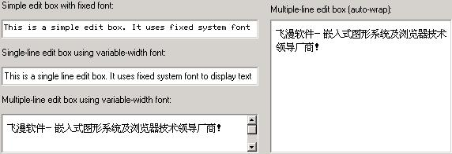

# Edit Box Control

The edit box provides an important approach for the application to receive the
user input. Compared with the controls mentioned above, such as static control,
button, list box, etc., the behaviors of edit box is relatively simple. The 
edit box displays a caret, and the character input by the user would be 
inserted at the caret position. Besides that, the edit box also provides some
simple editing functions such as selecting text, deleting text, moving the 
caret position, etc.

MiniGUI uses the following three control classes to implement the edit box:
- Single-line edit box: class name 'sledit', 'edit', identifier `CTRL_SLEDIT`,
`CTRL_EDIT`. It can only handle single-line text, but with the help of MiniGUI
logical font, it can handle arbitrary multi-byte characters, including
variable-byte charset. The Control provides the functions of being Selected,
Copy and Paste, etc.
- Multiple-line edit box: class name 'textedit', 'mledit', 'medit', identifier
`CTRL_TEXTEDIT`, `CTRL_MLEDIT`, or `CTRL_MEDIT`. It can handle arbitrary
multiple-byte character input, including variable-byte charset. The Control
provides the functions of being Selected, Copy and Paste, etc.
- Single-line Double-Direction edit box: class name "bidisledit", identifier
`CTRL_BIDISLEDIT`. It can only handle single-line text, except the functions of
Single-line edit box, it can display and input Double-Direction texts, 
including Arabic and Hebrew. The Control provides the functions of being
Selected, Copy and Paste, etc.

Except the differences described above, the styles, messages and notification
codes of the three types of edit box control classes are general similar, with
only a little differences. Fig 22.1 shows the running effect of the three types
of edit boxes.




Figure 1 MiniGUI edit boxes


## Styles of Edit Box

Generally, we use the following style combination when creating an edit box:

```
```

Apparently, the style definition above does not use any styles specific to edit
box. That is to say, we can use edit box normally without specifying any 
special styles of edit box. But the edit box has some special styles, mainly
including: 
- `ES_UPPERCASE:` Make the edit box display all characters in uppercase.
- `ES_LOWERCASE:` Make the edit box display all characters in lowercase.
- `ES_PASSWORD:` Edit box is used for inputting the password, and displays an
asterisk (*) for each character typed into the edit box.
- `ES_READONLY:` Create a read-only edit box, the user cannot change the text 
in the edit box, but the caret is visible.
- `ES_BASELINE:` Draws a base line under text of the edit box.
- `ES_AUTOWRAP:` Used for a multiple-line edit box, and automatically wraps
against border when the text input exceeds the control border.
- `ES_LEFT:` Specify the aligning style for a single line edit box, and 
realizes the left-align style.
- `ES_NOHIDESEL:` Remain selected for the selected text when losing focus.
- `ES_AUTOSELECT:` Selects all text when getting focus (only valid for
single-line edit box).
- `ES_TITLE:` Shows specified title texts in the first row, and this style is
only suitable for Multiple-line edit box.
- `ES_TIP:` When content of edit box is `NULL,` shows related tip texts, and
this style is only suitable for `SLEDIT` control.
- `ES_CENTER:` Specify the aligning style for a single line edit box, and
realizes the center-align style.
- `ES_RIGHT:` Specify the aligning style for a single line edit box, and
realizes the right-align style.

For a multiple-line edit box, if you want to use the scroll bars, you can
specify the styles `WS_HSCROLL` and/or `WS_VSCROLL`.

The following styles can be used to multiple-line edit box: `ES_UPPERCASE`,
`ES_LOWERCASE`, `ES_READONLY`, `ES_BASELINE`, `ES_AUTOWRAP`, `ES_NOHIDESEL`, 
and `ES_TITLE`.

The following styles can be used to single-line edit box: `ES_UPPERCASE`,
`ES_LOWERCASE`, `ES_READONLY`, `ES_BASELINE`, `ES_LEFT`, `ES_CENTER`, 
`ES_RIGHT`, `ES_PASSWORD`, `ES_NOHIDESEL`, `ES_AUTOSELECT`, and `ES_TIP`.

## Messages of Edit Box

You can get the current text information in the edit box by using the following
messages. These messages can be used for the two types of edit box classes
described above:

- `MSG_GETTEXTLENGTH:` Get the length of the text with byte as unit.
- `MSG_GETTEXT:` Copy the text in the edit box.
- `MSG_SETTEXT:` Set the text in the edit box.

The application can also call the following three functions to complete
corresponding work:

- `GetWindowTextLength`
- `GetWindowText`
- `SetWindowText`

In fact, the three functions above are the simple wraps of the three messages
mentioned above. As we have seen in the foregoing chapters, the same messages
and functions can also be used for controls such as static control and button
control. 

The messages to be introduced in the following sections are special for edit
box. 

### Getting/Setting Caret Position

Sending `EM_GETCARETPOS` message to the edit box will get the current caret
position: 

```
```

After the message returns, `line_pos` and `char_pos` include the line number 
and the position in that line of the caret. For a single-line edit box, 
`line_pos` is always zero, so you can pass `NULL` value for the argument 
`wParam` of the message.

It should be noted that, for multi-line edit box, one lines means a character
string line ended with a linefeed (carriage return), instead of a line in a
paragraph when displayed with `ES_AUTOWRAP` style. Character position in edit
box of MiniGUI takes multiple byte character (such as Chinese characters) as
unit when displaying multiple byte text, instead of byte. This definition works
for other messages of edit box.

The application can also set the caret position through `EM_SETCARETPOS`
message: 

```
```

`wParam` and `IParam` argument specify line position and character position
respectively. 

### Setting/Getting Selection of Text

`EM_GETSEL` message is used to get the currently selected text:

```
```

Here, `lParam` argument specifies the character buffer for saving the gotten
text; `wParam` argument specifies the size of the buffer. If the specified
buffer is small, then excrescent text will be cut off.

`EM_SETSEL` message is used to set the currently selected text:

```
```

Here, `lParam` argument specifies the row index of selected point; `wParam`
specifies the character position in line of selected point. After this message
is sent, text between the current insertion point and the selected point will 
be selected.

`EM_GETSELPOS` message is used to get the position of currently selected point:


```
```

The use of `EM_GETSELPOS` message is similar to that of `EM_GETCARETPOS`
message. 

`EM_SELECTALL` message is used to make all the text in edit box selected, as
<CTRL+A> operation:

```
```

### Copy, Cut, and Past

You can perform edit operations on an edit box control, for example, copy, cut,
and paste, by key operations or sending corresponding messages. Keyboard
operations of edit box control, such as copy:
- `CTRL+C:` Copy text from edit box to clipboard
- `CTRL+V:` Copy text from clipboard to edit box
- `CTRL+X:` Cut text of edit box to clipboard

`EM_COPYTOCB` message is used to copy the currently selected text of an edit 
box control to the clipboard, as <CTRL+C> operation:

```
```

`EM_CUTTOCB` message is used to cut the currently selected text of an edit box
control to the clipboard, as <CTRL+X> operation:

`CODE{"cpp"}%`
`SendMessage` (hwndEdit, `EM_CUTTOCB`, 0, 0);
```cplusplus
```cplusplus
`SendMessage` (hwndEdit, `EM_INSERTCBTEXT`, 0, 0);
```cplusplus
```cplusplus
int `line_height;`
`line_height` = `SendMessage` (hwndEdit, `EM_GETLINEHEIGHT`, 0, 0);
```cplusplus
```cplusplus
int `line_height;`
`SendMessage` (hwndEdit, `EM_SETLINEHEIGHT`, `line_height,` 0);
```cplusplus
```cplusplus
int `line_count;`
`line_count` = `SendMessage` (hwndEdit, `EM_GETLINECOUNT`, 0, 0);
```cplusplus
```cplusplus
`SendMessage` (hwndEdit, `EM_LIMITTEXT`, 10, 0L);
```cplusplus
```cplusplus
`SendMessage` (hwndEdit, `EM_SETPASSWORDCHAR`, ‘%’, 0L);
```cplusplus
```cplusplus
int len;
char *tip_text;
`SendMessage` (hwndEdit, `EM_SETTIPTEXT`, len, (LPARAM)tip_text);
```cplusplus
```cplusplus
int len;
char `tip_text[len+1];`
`SendMessage` (hwndEdit, `EM_GETTIPTEXT`, len, (LPARAM)tip_text);
```cplusplus
```cplusplus
int len;
char *title_text;
`SendMessage` (hwndEdit, `EM_SETTITLETEXT`, len, (LPARAM)title_text);
```cplusplus
```cplusplus
int len;
char `title_text[len+1];`
`SendMessage` (hwndEdit, `EM_GETTITLETEXT`, len, (LPARAM)title_text);
```cplusplus
```cplusplus
char `disp_char;`
`SendMessage` (hwndEdit, `EM_SETLFDISPCHAR`, 0, `disp_char);`
```cplusplus
```cplusplus
`SendMessage` (hwndEdit, `EM_SETLFDISPCHAR`, 0, ‘*’);
```cplusplus
```cplusplus
char `sep_char;`
`SendMessage` (hwndEdit, `EM_SETLINESEP`, 0, `sep_char);`
```cplusplus
```cplusplus
`SendMessage` (hwndEdit, `EM_SETLINESEP`, 0, ‘\t’);
```cplusplus
```cplusplus
int num;
num = `SendMessage` (hwnd, `EM_GETNUMOFPARAGRAPHS`, 0, 0);
```cplusplus
```cplusplus
int len;
len = `SendMessage` (hwnd, `EM_GETPARAGRAPHLENGTH`, idx, 0);
```cplusplus
```cplusplus
`TEXTPOSINFO` info;
unsigned char buff [32];

info.start_pos = 5;
info.copy_len = 10;
info.buff = buff;
info.paragraph_index = -1;

`SendMessage` (hwnd, `EM_GETPARAGRAPHTEXT`, &info, 0);
```cplusplus
```cplusplus
typedef struct _TEXTPOSINFO {
/*The index of paragraph, if value is -1,
*it will take effect on the whole text.*/
int `paragraph_index;`
/*The beginning byte position can be copied to the buffer.*/
int `start_pos;`
/*The maximal number of bytes can be copied to the buffer.*/
int `copy_len;`
/*The pointer to a buffer receives the text.
*Please make sure buffer size is more than the value of `copy_len.*/`
char *buff;
}TEXTPOSINFO;
```cplusplus
```cplusplus
#include <stdio.h>
#include <stdlib.h>

#include <minigui/common.h>
#include <minigui/minigui.h>
#include <minigui/gdi.h>
#include <minigui/window.h>
#include <minigui/control.h>

/* Define dialg template */
static `DLGTEMPLATE` `DlgBoxInputChar` =
{
`WS_BORDER` | `WS_CAPTION`,
`WS_EX_NONE`,
0, 0, 400, 220,
#ifdef _LANG_ZHCN
"请键入字母",
#else
"Please input letters",
#endif
0, 0,
4, `NULL,`
0
};

#define `IDC_CHAR` 100
#define `IDC_CHARS` 110

static `CTRLDATA` `CtrlInputChar` [] =
{
{
`CTRL_STATIC`,
`WS_VISIBLE` ,
10, 10, 380, 18,
`IDC_STATIC`,
#ifdef _LANG_ZHCN
"请输入一个字母:",
#else
"Please input a letter:",
#endif
0
},
{
`CTRL_SLEDIT`,
`WS_VISIBLE` | `WS_TABSTOP` | `WS_BORDER` | `ES_CENTER`,
10, 40, 80, 25,
`IDC_CHAR`,
`NULL,`
0
},
{
`CTRL_MLEDIT`,
`WS_VISIBLE` | `WS_BORDER` | `WS_VSCROLL` | `ES_BASELINE` | `ES_AUTOWRAP`,
10, 80, 380, 70,
`IDC_CHARS`,
`NULL,`
0
},
{
`CTRL_BUTTON`,
`WS_TABSTOP` | `WS_VISIBLE` | `BS_DEFPUSHBUTTON`,
170, 160, 60, 25,
`IDOK,`
#ifdef _LANG_ZHCN
"确定",
#else
"OK",
#endif
0
}
};

static void `my_notif_proc` (HWND hwnd, int id, int nc, `DWORD` `add_data)`
{
unsigned char buff [256] = {0};
if (id == `IDC_CHAR` && nc == `EN_CHANGE)` {
/* Get the user input(the first character) of the single-line
* edit box, and insert it to the multiple-line edit box
*/
`GetWindowText` (hwnd, buff, 4);
/* Place the caret postion of the single-line edit box in front,
*thus to overlap the old character
*/
`SendMessage` (hwnd, `EM_SETCARETPOS`, 0, 0);
`SendMessage` (GetDlgItem (GetParent (hwnd), `IDC_CHARS),` `MSG_CHAR`, buff[0],
0L); 
}
else if (id == `IDC_CHARS` && nc == `EN_CHANGE)` {
`GetWindowText` (hwnd, buff, 255);
printf ("String: %s\n", buff);
}
}

static int `InputCharDialogBoxProc` (HWND `hDlg,` int message, `WPARAM` 
`wParam,` `LPARAM` `lParam)`
{
static `PLOGFONT` `my_font;`
`HWND` hwnd;

switch (message) {
case `MSG_INITDIALOG:`
`my_font` = `CreateLogFont` (NULL, "fmhei", "ISO8859-1",
`FONT_WEIGHT_REGULAR`, `FONT_SLANT_ROMAN`, `FONT_FLIP_NIL`,
`FONT_OTHER_NIL`, `FONT_UNDERLINE_NONE`, `FONT_STRUCKOUT_NONE`,
20, 0);
hwnd = `GetDlgItem` (hDlg, `IDC_CHAR);`
/* Set the font of the single-line edit box to be a big font */
`SetNotificationCallback` (hwnd, `my_notif_proc);`
/* Simulate the press of `INSERT` key, and set the edit mode to be overlap mode
*/ 
`SendMessage` (hwnd, `MSG_KEYDOWN`, `SCANCODE_INSERT`, 0L);
return 1;

case `MSG_CLOSE:`
`EndDialog` (hDlg, `IDCANCEL);`
break;

case `MSG_COMMAND:`
switch (wParam) {
case `IDOK:`
case `IDCANCEL:`
`DestroyLogFont` (my_font);
`EndDialog` (hDlg, `wParam);`
break;
}
break;
}

return `DefaultDialogProc` (hDlg, message, `wParam,` `lParam);`
}

int `MiniGUIMain` (int argc, const char* argv[])
{

#ifdef _MGRM_PROCESSES
`JoinLayer(NAME_DEF_LAYER` , "edit" , 0 , 0);
#endif

#ifdef _LITE_VERSION
if (!InitVectorialFonts ()) {
printf ("InitVectorialFonts: error.\n");
return 1;
}
#endif

`DlgBoxInputChar.controls` = `CtrlInputChar;`
`DialogBoxIndirectParam` (&DlgBoxInputChar, `HWND_DESKTOP`,
`InputCharDialogBoxProc,` 0L);

#ifdef _LITE_VERSION
`TermVectorialFonts` ();
#endif
return 0;
}

#ifndef _LITE_VERSION
#include <minigui/dti.c>
#endif

----

[&lt;&lt; ](MiniGUIProgGuidePart.md) |
[Table of Contents](README.md) |
[ &gt;&gt;](MiniGUIProgGuidePart.md)

[Release Notes for MiniGUI 3.2]: /supplementary-docs/Release-Notes-for-MiniGUI-3.2.md
[Release Notes for MiniGUI 4.0]: /supplementary-docs/Release-Notes-for-MiniGUI-4.0.md
[Showing Text in Complex or Mixed Scripts]: /supplementary-docs/Showing-Text-in-Complex-or-Mixed-Scripts.md
[Supporting and Using Extra Input Messages]: /supplementary-docs/Supporting-and-Using-Extra-Input-Messages.md
[Using CommLCD NEWGAL Engine and Comm IAL Engine]: /supplementary-docs/Using-CommLCD-NEWGAL-Engine-and-Comm-IAL-Engine.md
[Using Enhanced Font Interfaces]: /supplementary-docs/Using-Enhanced-Font-Interfaces.md
[Using Images and Fonts on System without File System]: /supplementary-docs/Using-Images-and-Fonts-on-System-without-File-System.md
[Using SyncUpdateDC to Reduce Screen Flicker]: /supplementary-docs/Using-SyncUpdateDC-to-Reduce-Screen-Flicker.md
[Writing DRI Engine Driver for Your GPU]: /supplementary-docs/Writing-DRI-Engine-Driver-for-Your-GPU.md
[Writing MiniGUI Apps for 64-bit Platforms]: /supplementary-docs/Writing-MiniGUI-Apps-for-64-bit-Platforms.md

[Quick Start]: /user-manual/MiniGUIUserManualQuickStart.md
[Building MiniGUI]: /user-manual/MiniGUIUserManualBuildingMiniGUI.md
[Compile-time Configuration]: /user-manual/MiniGUIUserManualCompiletimeConfiguration.md
[Runtime Configuration]: /user-manual/MiniGUIUserManualRuntimeConfiguration.md
[Tools]: /user-manual/MiniGUIUserManualTools.md
[Feature List]: /user-manual/MiniGUIUserManualFeatureList.md

[MiniGUI Overview]: /MiniGUI-Overview.md
[MiniGUI User Manual]: /user-manual/README.md
[MiniGUI Programming Guide]: /programming-guide/README.md
[MiniGUI Porting Guide]: /porting-guide/README.md
[MiniGUI Supplementary Documents]: /supplementary-docs/README.md
[MiniGUI API Reference Manuals]: /api-reference/README.md

[MiniGUI Official Website]: http://www.minigui.com
[Beijing FMSoft Technologies Co., Ltd.]: https://www.fmsoft.cn
[FMSoft Technologies]: https://www.fmsoft.cn
[HarfBuzz]: https://www.freedesktop.org/wiki/Software/HarfBuzz/
