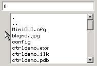
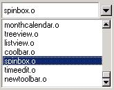
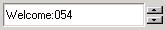
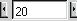
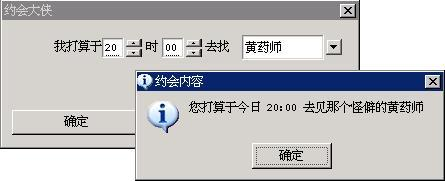

# Combo Box Control

- [Types and Styles of Combo Box](#types-and-styles-of-combo-box)
   + [Simple Combo Box, Pull-Down Combo Box, and Spin Combo Box](#simple-combo-box-pull-down-combo-box-and-spin-combo-box)
   + [Digital Spin Box](#digital-spin-box)
- [Messages of Combo Box](#messages-of-combo-box)
   + [Messages of Simple, Pull-Down, and Spin Combo Box](#messages-of-simple-pull-down-and-spin-combo-box)
   + [Messages of Digital Spin Box](#messages-of-digital-spin-box)
- [Notification Codes of Combo Box](#notification-codes-of-combo-box)
- [Sample Program](#sample-program)


In nature, a general combo box is the combination of an edit box and a list
box. The user can type text in the edit box, and also can select one item from
the options listed in the list box. The combo box in MiniGUI can be divided
into three types: simple combo box, pull-down combo box, spin combo box and
digital spin box. Using pull-down combo box has another advantage, i.e. it can
reduce the occupied space of parent window because of using a poll-down list
box.

We can create a combo box control by calling `CreateWindow` function with
`CTRL_COMBOBOX` as the control class name.

## Types and Styles of Combo Box

### Simple Combo Box, Pull-Down Combo Box, and Spin Combo Box

A simple combo box can be created with the style of `CBS_SIMPLE`. The list box
of a simple combo box will always be shown below the edit box. When the user
selects an item in the list box, the text of this item will fill the edit box,
as shown in Figure 1.



__Figure 1__ Simple combo box control


A pull-down combo box can be created with the style of `CBS_DROPDOWNLIST`. The
pull-down combo box is different from the simple combo box in that the combo
box only shows an item in the rectangle region, and an icon pointing downwards
presents on the right of the item content. When the user clicks the icon, a
list box will be popped up to show more items. Figure 2 shows the effect of the
pull-down combo boxes in normal state and pull-down state.



__Figure 2__ Pull-down combo box control

When calling `CreateWindow` function to create the simple combo box and
pull-down combo box, you should use `dwAddData` argument of `CreateWindow` to
pass the height value of the list box, as shown in following:

```cpp
  hwnd4 = CreateWindow (CTRL_COMBOBOX,
            "0",
            WS_VISIBLE | CBS_SIMPLE | CBS_SORT | WS_TABSTOP,
            IDC_BOX4,
            10, 100, 180, 24,
            parent, 100);
/* Specify dwAddData to be 100, that is, specify the height of
 * the list box in the simple combo box to be 100
 */
```

Although behaviors of a spin combo box control differs much from that of the
two types of combo boxes above, it is in nature still combination of an edit
box and a list box, except that the list box in a spin combo box is always
hidden, and we can select an item in the list box by the two arrow buttons
beside the edit box. The spin combo box can be created with `CBS_SPINLIST`
style, and its effect is shown in Figure 3.



__Figure 3__ Spin combo box

Spin combo box also has two special display styles (as shown in Figure 4):



__Figure 4__ The special styles of spin combo box


As the three types of combo boxes described above use the edit box and the list
box predefined in MiniGUI, you can use similar styles of the edit box control
and the list box control for the combo boxes:

- `CBS_READONLY`: The input field is read-only, corresponding to the
`ES_READONLY` style of edit box.
- `CBS_UPPERCASE`: Corresponding to the `ES_UPPERCASE` style of the edit box,
making the text typed in the edit box transferring into uppercase
automatically.
- `CBS_LOWERCASE`: Corresponding to the `ES_LOWERCASE` style of the edit box,
making the text typed in the edit box transferring into lowercase
automatically.
- `CBS_EDITBASELINE`: Corresponding to the `ES_BASELINE` style of the edit box,
making the edit box have a base line.
- `CBS_SORT`: Corresponding to the `LBS_SORT` style of the list box, combo box
with this style will automatically sort the inserted items.

__NOTE__ A list box can have other advanced styles, but the list box in a combo
box is only a normal single-selection list box.

Except the styles described above, the combo box also defines the following two
styles, which can be used for all types of combo box:
- `CBS_EDITNOBORDER`: Make the edit box have no `WS_BORDER` style, and make the
input field have no border.
- `CBS_AUTOFOCUS`: The edit box will gain the input focus automatically when
the combo box gains the input focus.

### Digital Spin Box

A digital spin box is similar to a spin combo box in appearance, wherein digits
are displayed instead of item of a list box. A combo box of this type can be
used in many situations. However, because the operated object is digit instead
of arbitrary text, it does not use a list box internally. The digital spin box
can be created with combo box style `CBS_AUTOSPIN`, which is as shown in Figure
5.


__Figure 5__ Digital spin box

The digital spin box has only a style, i.e. `CBS_AUTOLOOP`. The digit in the
box will be looped automatically when this style has been used. That is to say,
after the user has clicked the up arrow to the maximum value, the digit in the
box will change to the minimum value if the up arrow is clicked again. The
minimum and maximum values of the digital spin box are 0 and 100 by default,
respectively. Each time the user clicks the button on the right side, the
digit-changed step is 1 by default.

The default max and min value are 100 and 0; the default step value when click
the button is 1 and the default step of click pagedown or pageup is 5.

## Messages of Combo Box
### Messages of Simple, Pull-Down, and Spin Combo Box

Because the three types of combo boxes all include list box, messages used for
these three types of combo boxes basically correspond to the messages of a list
box:
- `CB_ADDSTRING`: Correspond to `LB_ADDSTRING`, used for adding items to the
inner list box.
- `CB_INSERTSTRING`: Correspond to `LB_INSERTSTRING`, used for inserting items
to the inner list box.
- `CB_DELETESTRING`: Correspond to `LB_DELETESTRING`, used for deleting items
from the inner list box.
- `CB_FINDSTRING`: Correspond to `LB_FINDSTRING`, used for fuzzily matching
items of the list box.
- `CB_FINDSTRINGEXACT`: Correspond to `LB_FINDSTRINGEXACT`, used for exactly
matching items of the list box.
- `CB_GETCOUNT`: Correspond to `LB_GETCOUNT`, used for getting the number of
items in the inner list box.
- `CB_GETCURSEL`: Correspond to `LB_GETCURSEL`, used for getting the currently
selected item of the inner list box.
- `CB_SETCURSEL`: Correspond to `LB_SETCURSEL`, used for setting the selected
item of the inner list box.
- `CB_RESETCONTENT`: Correspond to `LB_RESETCONTENT`, used for removing the
contents of the inner list box.
- `CB_GETITEMADDDATA`: Correspond to `LB_GETITEMADDDATA`, used for getting the
additional data associated with an item of the inner list box.
- `CB_SETITEMADDDATA`: Correspond to `LB_SETITEMADDDATA`, used for setting the
additional data associated with an item of the inner list box.
- `CB_GETITEMHEIGHT`: Correspond to `LB_GETITEMHEIGHT`, used for getting the
height of an item of the inner list box.
- `CB_SETITEMHEIGHT`: Correspond to `LB_SETITEMHEIGHT`, used for setting the
height of an item of the inner list box.
- `CB_SETSTRCMPFUNC`: Correspond to `LB_SETSTRCMPFUNC`, used for setting the
string comparing function for sorting items of the inner list box.
- `CB_GETLBTEXT`: Correspond to `LB_GETTEXT`, used for getting the text of an
item of the inner list box.
- `CB_GETLBTEXTLEN`: Correspond to `LB_GETTEXTLEN`, used for getting the length
of text of an item of the inner list box.
- `CB_GETCHILDREN`: Gets the handles to the children of `ComboBox` control. The
parameter `wParam` holds a editor pointer and `lParam` holds a list box
pointer.

Combo box also provides the message for the inner edit box:
- `CB_LIMITTEXT`: Correspond to `EM_LIMITTEXT`, used for limiting the length of
text in the inner edit box.
- `CB_SETEDITSEL`: Correspond to `EM_SETSEL`, set the selected text in the
editor.
- `CB_GETEDITSEL`: Correspond to `EM_GETSEL`, get the selected text in the
editor.

You can refer to the description on the list box message and the edit box
message in Chapter 21 and Chapter 22 for the concrete use of the above
messages. The following two messages can be used for a spin combo box:
- `CB_SPIN`: Send the message to spin the spin box forward or backward, like
the user click the up or down arrow besides the edit box (Typing the up or down
arrow key in the edit box also can get the same effect). The parameter `wParam`
controls the direction of the spin, 0 means up, 1 means down.
- `CB_FASTSPIN`: Send the message to fast spin the spin box, like the user
types `PageUp/PageDown` key in the edit box. The parameter `wParam` controls
the direction of the spin, 0 means up, 1 means down.

Follow two message can be used for drop down combo box:
- `CB_GETDROPPEDCONTROLRECT`: Get the rectangle of the drop down combo box.
- `CB_GETDROPPEDSTATE`: Check the combo box's drop down list is displayed or
not.

### Messages of Digital Spin Box

Digital spin box can receive the following messages:
- `CB_GETSPINRANGE`: Get the maximum and minimum values, which are stored in
the addresses to which are pointed to by `wParam` and `lParam`, respectively.
- `CB_SETSPINRANGE`: Set the maximum and minimum values, which are the values
of `wParam` and `lParam`, respectively.
- `CB_SETSPINVALUE`: Set the current value of the edit box, and the value to be
set is passed by `wParam`.
- `CB_GETSPINVALUE`: This message returns the current value of the edit box.
- `CB_SPIN`: Send the message to spin the spin box forwards or backwards, the
same as the user clicks the up or down arrow besides the edit box (Typing the
up or down arrow key in the edit box also can get the same effect). The
parameter `wParam` controls the direction of the spin: 1 means up and 0 means
down.
- `CB_FASTSPIN`: Send the message to spin the spin box quickly, like the user
types `PageUp/PageDown` key in the edit box. The parameter `wParam` controls
the spinning direction: 0 means up and 1 means down.
- `CB_GETSPINPACE`: Get the pace and the fast pace of the spin box in a combo
box.
- `CB_SETSPINPACE`: Set the pace and the fast pace of the spin box in a combo
box
- `CB_SETSPINFORMAT`: Sets the format string of integer. MiniGUI uses sprintf
and sscanf to transform between text string and integer, and make them have
specified format. After format string is set, MiniGUI will use this format
string when calling sprintf and sscanf functions to make it has a certain
display format.

## Notification Codes of Combo Box

Notifications can be generated when a combo box has the style `CBS_NOTIFY`.
Notification codes of combo box notification messages are basically the
combination of list box notification codes and edit box notification codes,
which are listed as follow:
- `CBN_ERRSPACE`: No enough memory
- `CBN_SELCHANGE`: Current selection changes
- `CBN_EDITCHANGE`: Text in the edit control changes
- `CBN_DBLCLK`: User double clicked an item of the combo box
- `CBN_CLICKED`: User clicked the combo box.
- `CBN_SETFOCUS`: The combo box gains the input focus. If the combo box has
`CBS_AUTOFOCUS` style, the inner edit box would gain the input box
simultaneously.
- `CBN_KILLFOCUS`: The combo box loses the input focus.
- `CBN_DROPDOWN`: The user pulled down the list box. When the user clicks the
down arrow button beside the edit box or type an arrow key in the edit box,
such as up or down arrow key, `PageDown` or `PageUp` key etc. the list box
would be pulled down and showed.
- `CBN_CLOSEUP`: Pull-down list box is hidden (closed up).
- `CBN_SELENDOK`: The user selects an item from the pull-down list box.
- `CBN_SELENDCANCEL`: The user does not select any item and close the pull-down
list box.

## Sample Program

The program in List 1 gives an example of use of combo boxes. The program
comprises a time selection box with digital spin box, and then provides the
list of heroes to be dated with a pull-down list box. When pressing “OK”, the
program uses `MessageBox` to display the date information. Please refer to
`combobox.c` file of the demo program package of this guide for the complete
source code of the program. Effect of running the program is shown in Figure 6.

__List 1__ Use of combo boxes

```cpp
#include <stdio.h>

#include <minigui/common.h>
#include <minigui/minigui.h>
#include <minigui/gdi.h>
#include <minigui/window.h>
#include <minigui/control.h>

#define IDC_HOUR   100
#define IDC_MINUTE 110
#define IDC_SECOND 120
#define IDL_DAXIA  200

#define IDC_PROMPT 300

/* Define dialog box template */
static DLGTEMPLATE DlgMyDate =
{
    WS_BORDER | WS_CAPTION,
    WS_EX_NONE,
    100, 100, 304, 135,
    "约会大侠",
    0, 0,
    9, NULL,
    0
};

static CTRLDATA CtrlMyDate[] =
{
    {
        "static",
        WS_CHILD | SS_RIGHT | WS_VISIBLE,
         10, 20, 50, 20,
        IDC_STATIC,
        "我打算于",
        0
    },
/* the digital spin box to display hour */
    {
        CTRL_COMBOBOX,
        WS_CHILD | WS_VISIBLE |
            CBS_READONLY | CBS_AUTOSPIN | CBS_AUTOLOOP | CBS_EDITBASELINE,
        60, 18, 40, 20,
        IDC_HOUR,
        "",
        0
    },
    {
        "static",
        WS_CHILD | SS_CENTER | WS_VISIBLE,
        100, 20, 20, 20,
        IDC_STATIC,
        "时",
        0
    },
/* The digital spin box to display minute */
    {
        CTRL_COMBOBOX,
        WS_CHILD | WS_VISIBLE |
            CBS_READONLY | CBS_AUTOSPIN | CBS_AUTOLOOP | CBS_EDITBASELINE,
        120, 18, 40, 20,
        IDC_MINUTE,
        "",
        0
    },
    {
        "static",
        WS_CHILD | SS_CENTER | WS_VISIBLE,
        160, 20, 30, 20,
        IDC_STATIC,
        "去找",
        0
    },
/* List the names of heroes */
    {
        CTRL_COMBOBOX,
        WS_VISIBLE | CBS_DROPDOWNLIST | CBS_NOTIFY,
        190, 20, 100, 20,
        IDL_DAXIA,
        "",
        80
    },
/* Display characteristic of heroes */
    {
        "static",
        WS_CHILD | SS_RIGHT | WS_VISIBLE,
        10, 50, 280, 20,
        IDC_PROMPT,
        "This is",
        0
    },
    {
        CTRL_BUTTON,
        WS_VISIBLE | BS_DEFPUSHBUTTON | WS_TABSTOP | WS_GROUP,
        10, 70, 130, 25,
        IDOK,
        "确定",
        0
    },
    {
        "button",
        WS_VISIBLE | BS_PUSHBUTTON | WS_TABSTOP,
        150, 70, 130, 25,
        IDCANCEL,
        "取消",
        0
    },
};

static const char* daxia [] =
{
    "黄药师",
    "欧阳锋",
    "段皇爷",
    "洪七公",
    "周伯通",
    "郭靖",
    "黄蓉",
};

static const char* daxia_char [] =
{
    "怪僻",
    "恶毒",
    "假慈悲",
    "一身正气",
    "调皮，不负责任",
    "傻乎乎",
    "乖巧",
};

static void daxia_notif_proc (HWND hwnd, int id, int nc, DWORD add_data)
{
    if (nc == CBN_SELCHANGE) {
         /* Display corresponding characteristic according to the hero currently selected */
        int cur_sel = SendMessage (hwnd, CB_GETCURSEL, 0, 0);
        if (cur_sel >= 0) {
            SetWindowText (GetDlgItem (GetParent(hwnd), IDC_PROMPT), daxia_char [cur_sel]);
        }
    }
}

static void prompt (HWND hDlg)
{
    char date [1024];

    /* Summary the dating content */
    int hour = SendDlgItemMessage(hDlg, IDC_HOUR, CB_GETSPINVALUE, 0, 0);
    int min = SendDlgItemMessage(hDlg, IDC_MINUTE, CB_GETSPINVALUE, 0, 0);
    int sel = SendDlgItemMessage(hDlg, IDL_DAXIA, CB_GETCURSEL, 0, 0);

    sprintf (date, "你打算于今日 %02d:%02d 去见那个%s的%s", hour, min,
                   daxia_char [sel], daxia [sel]);

    MessageBox (hDlg, date, "约会内容", MB_OK | MB_ICONINFORMATION);
}

static int MyDateBoxProc (HWND hDlg, int message, WPARAM wParam, LPARAM lParam)
{
    int i;
    switch (message) {
    case MSG_INITDIALOG:
        /* Set the range of hour spin box to be 0~23, digital is displayed with %02d format */
        SendDlgItemMessage(hDlg, IDC_HOUR, CB_SETSPINRANGE, 0, 23);
        SendDlgItemMessage(hDlg, IDC_HOUR, CB_SETSPINFORMAT, 0, (LPARAM)"%02d");
        /* Set the current value to be 20 */
        SendDlgItemMessage(hDlg, IDC_HOUR, CB_SETSPINVALUE, 20, 0);
        /* Set the pace and fast pace both to be 1  */
        SendDlgItemMessage(hDlg, IDC_HOUR, CB_SETSPINPACE, 1, 1);

        /* Set the range of hour spin box to be 0~59, digital is displayed with %02d format */
        SendDlgItemMessage(hDlg, IDC_MINUTE, CB_SETSPINRANGE, 0, 59);
        SendDlgItemMessage(hDlg, IDC_MINUTE, CB_SETSPINFORMAT, 0, (LPARAM)"%02d");
        /* Set the current value to be 0 */
        SendDlgItemMessage(hDlg, IDC_MINUTE, CB_SETSPINVALUE, 0, 0);
        /* Set the pace to be 1, and set the fast pace to be 2 */
        SendDlgItemMessage(hDlg, IDC_MINUTE, CB_SETSPINPACE, 1, 2);

         /* Add the names of heroes */
        for (i = 0; i < 7; i++) {
            SendDlgItemMessage(hDlg, IDL_DAXIA, CB_ADDSTRING, 0, (LPARAM)daxia [i]);
        }

        /* Specify notification callback function */
        SetNotificationCallback (GetDlgItem (hDlg, IDL_DAXIA), daxia_notif_proc);
         /* Set initial values of names and characteristics of heroes */
        SendDlgItemMessage(hDlg, IDL_DAXIA, CB_SETCURSEL, 0, 0);
        SetWindowText (GetDlgItem (hDlg, IDC_PROMPT), daxia_char [0]);
        return 1;

    case MSG_COMMAND:
        switch (wParam) {
        case IDOK:
            /* Display the current selection */
            prompt (hDlg);
        case IDCANCEL:
            EndDialog (hDlg, wParam);
            break;
        }
        break;

    }

    return DefaultDialogProc (hDlg, message, wParam, lParam);
}

int MiniGUIMain (int argc, const char* argv[])
{
#ifdef _ MGRM_PROCESSES
    JoinLayer(NAME_DEF_LAYER , "combobox" , 0 , 0);
#endif

    DlgMyDate.controls = CtrlMyDate;

    DialogBoxIndirectParam (&DlgMyDate, HWND_DESKTOP, MyDateBoxProc, 0L);

    return 0;
}

#ifndef _ MGRM_PROCESSES
#include <minigui/dti.c>
#endif
```



__Figure 6__ Use of combo boxes

----

[&lt;&lt; Edit Box Control](MiniGUIProgGuidePart6Chapter04.md) |
[Table of Contents](README.md) |
[Menu Button Control &gt;&gt;](MiniGUIProgGuidePart6Chapter06.md)

[Release Notes for MiniGUI 3.2]: /supplementary-docs/Release-Notes-for-MiniGUI-3.2.md
[Release Notes for MiniGUI 4.0]: /supplementary-docs/Release-Notes-for-MiniGUI-4.0.md
[Showing Text in Complex or Mixed Scripts]: /supplementary-docs/Showing-Text-in-Complex-or-Mixed-Scripts.md
[Supporting and Using Extra Input Messages]: /supplementary-docs/Supporting-and-Using-Extra-Input-Messages.md
[Using CommLCD NEWGAL Engine and Comm IAL Engine]: /supplementary-docs/Using-CommLCD-NEWGAL-Engine-and-Comm-IAL-Engine.md
[Using Enhanced Font Interfaces]: /supplementary-docs/Using-Enhanced-Font-Interfaces.md
[Using Images and Fonts on System without File System]: /supplementary-docs/Using-Images-and-Fonts-on-System-without-File-System.md
[Using SyncUpdateDC to Reduce Screen Flicker]: /supplementary-docs/Using-SyncUpdateDC-to-Reduce-Screen-Flicker.md
[Writing DRI Engine Driver for Your GPU]: /supplementary-docs/Writing-DRI-Engine-Driver-for-Your-GPU.md
[Writing MiniGUI Apps for 64-bit Platforms]: /supplementary-docs/Writing-MiniGUI-Apps-for-64-bit-Platforms.md

[Quick Start]: /user-manual/MiniGUIUserManualQuickStart.md
[Building MiniGUI]: /user-manual/MiniGUIUserManualBuildingMiniGUI.md
[Compile-time Configuration]: /user-manual/MiniGUIUserManualCompiletimeConfiguration.md
[Runtime Configuration]: /user-manual/MiniGUIUserManualRuntimeConfiguration.md
[Tools]: /user-manual/MiniGUIUserManualTools.md
[Feature List]: /user-manual/MiniGUIUserManualFeatureList.md

[MiniGUI Overview]: /MiniGUI-Overview.md
[MiniGUI User Manual]: /user-manual/README.md
[MiniGUI Programming Guide]: /programming-guide/README.md
[MiniGUI Porting Guide]: /porting-guide/README.md
[MiniGUI Supplementary Documents]: /supplementary-docs/README.md
[MiniGUI API Reference Manuals]: /api-reference/README.md

[MiniGUI Official Website]: http://www.minigui.com
[Beijing FMSoft Technologies Co., Ltd.]: https://www.fmsoft.cn
[FMSoft Technologies]: https://www.fmsoft.cn
[HarfBuzz]: https://www.freedesktop.org/wiki/Software/HarfBuzz/
