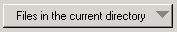
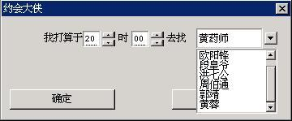

# Menu Button Control

Functions of a menu button are generally the same as that of a normal pull-down
combo box. Actually, in the early version of MiniGUI, the menu button acts as
the alternate of the combo box. Of course, the menu button has much limitation,
e.g., it cannot be edited, and does not provide scrolling of list items, etc.

In appearance, the menu button is like a normal push button. The difference is
that the menu button has a small rectangle (shown as a down arrow in `FLAT`
style) on the right side of the rectangular button region. When the user clicks
the control, a menu would pop up, and when the user clicks an item of the menu
with the mouse, the button content will change to the content of this item, as
shown in Figure 1.



__Figure 1__ Menu button (The left is normal status, the right is effect after menu
pops up)

Calling `CreateWindow` function with `CTRL_MENUBUTTON` as the control class
name can create a menu button.

## Styles of Menu Button

The menu button has some special styles of its own. Generally, we use the
following style combination when creating a menu button.

```cpp
WS_CHILD | WS_VISIBLE | MBS_SORT
```

- `MBS_SORT`: Sorting the menu items
- `MBS_LEFTARROW`: The menu pull-down arrow will be display at the left of the
text.
- `MBS_NOBUTTON`: The control have not push button
- `MBS_ALIGNLEFT`: The text on menubutton is left-align
- `MBS_ALIGNRIGHT`: The text on menubutton is right-align
- `MBS_ALIGNCENTER`: The text on menubutton is center-align

The position of bitmap cannot be affected by align-style when it is set

## Messages of Menu Button
### Adding Items to Menu Button Control

`MBM_ADDITEM` message is used to add items to a menu button. You should pass an
initialized `MENUBUTTONITEM` structure when calling `SendMessage`, as shown in
the following:

```cpp
MENUBUTTONITEM mbi;       // Declare a menu item structure variable
mbi.text = "item one";    // Set the item text
mbi.bmp = NULL;           // Here you can specify a bitmap object
mbi.data = 0;
pos = SendMessage (hMbtnWnd, MBM_ADDITEM, -1, (LPARAM) &mbi);
```

Here `hMbtnWnd` is the handle of a menu button control. `SendMessage` will
return the index of the new menu item, and return `MB_ERR_SPACE` when the
memory is not enough.

### Deleting Items from Menu Button Control

Items can be deleted form a menu button by using `MBM_DELITEM` message and
specifying the index of the menu item to be deleted, as shown in the following:

```cpp
SendMessage (hMbtnWnd, MBM_DELITEM, index, 0);
```

Here, index is the index of an item.

### Deleting All Items in the Menu

As the same as a list box, the menu button also provides the message to delete
all items, i.e. `MBM_RESETCTRL` message, which is shown as follows:

```cpp
SendMessage (hMbtnWnd, MBM_RESETCTRL, 0, 0);
```

### Setting Current Selected Item

Similarly, you can use `MBM_SETCURITEM` message to set the selected item, and
the text of the selected item will be displayed on the menu button, shown as
follows:

```cpp
SendMessage (hMbtnWnd, MBM_SETCURITEM, index, 0);
```

Here, index is the index of the item to be set.

### Getting Current Selected Item

You can get the index of the current selected item with `MBM_GETCURITEM`
message, shown as follows:

```cpp
index = SendMessage (hMbtnWnd, MBM_GETCURITEM, 0, 0);
```

This message returns the index of the current selected item.

### Getting/Setting Data of Menu Item

You can use `MBM_GETITEMDATA` and `MBM_SETITEMDATA` messages to get and set the
data of a menu item, respectively. When using these two messages, `wParam`
should be used to pass the index of the menu item to be gotten or set, `lParam`
should be used to pass a pointer to `MENUBUTTONITEM` structure, which includes
the text of the menu item, bitmap object, and additional data.

It should be noted that, `MENUBUTTONITEM` structure includes a member called
which. This member specifies which data of the menu item to be gotten or set
(text, bitmap object and/or additional data), and is generally the combination
of the following values:
- `MB_WHICH_TEXT`: Indicate the text of the menu item to be gotten or set. Here
the text member of the structure must point to a valid buffer.
- `MB_WHICH_BMP`: Indicate the bitmap object of the menu item to be gotten or
set.
- `MB_WHICH_ATTDATA`: Indicate the additional data of the menu item to be
gotten or set.

The example is as follows:

```cpp
 MENUBUTTONITEM mbi;

    mbi.which = MB_WHICH_TEXT | MB_WHICH_ATTDATA;
    mbi.text = “newtext”;
    mbi.data = 1;
    SendMessage (menubtn, MBM_SETITEMDATA, 0, (LPARAM) &mbi);
```

Here, menubtn is the handle of the menu button.

### Other Messages

When using `MBS_SORT` style, because item sorting is involved, MiniGUI also
provides `MBM_SETSTRCMPFUNC` message for the application to set a customized
sorting function. Generally speaking, the application should use this message
to set the new text string comparing function before adding items.

Usage of the message can refer to `LB_SETSTRCMPFUNC` message of list box.


## Notification Codes of Menu Button

The menu button has not `MBS_NOTIFY` style, so any menu button control can
generate the following notification codes:
- `MBN_ERRSPACE`: Memory allocation error occurs, and the memory space is not
enough.
- `MBN_SELECTED`: Selection is made for the menu button control. Whether or not
the selected menu item changes, this notification will be generated.
- `MBN_CHANGED`: The selected item of the menu button control changes.
- `MBN_STARTMENU`: The user activates the popup menu of a menu button.
- `MBN_ENDMENU`: The popup menu closed.

## Sample Program

List 1 gives an example for using menu button. This program section makes a
little change on the program of List 1, i.e., a menu button replaces the
pull-down combo box in program of List 1. Please refer to menubutton.c file of
demo program package `mg-samples` of this guide for the complete source code.
The running effect of the program is as shown in Figure 2.


__List 1__ Example of using menu button

```cpp
/* Define dialog box template */
static DLGTEMPLATE DlgMyDate =
{
    WS_BORDER | WS_CAPTION,
    WS_EX_NONE,
    100, 100, 304, 135,
    "约会大侠",
    0, 0,
    9, NULL,
    0
};

static CTRLDATA CtrlMyDate[] =
{

    ...

    /* Realize the combo box for displaying the names of heroes with a menu button */
    {
        CTRL_MENUBUTTON,
        WS_CHILD | WS_VISIBLE,
        190, 20, 100, 20,
        IDL_DAXIA,
        "",
        0
},

    ...

};

    ...

static void daxia_notif_proc (HWND hwnd, int id, int nc, DWORD add_data)
{
    if (nc == CBN_SELCHANGE) {
        /* Get the selected hero, and display his characteristics */
        int cur_sel = SendMessage (hwnd, MBM_GETCURITEM, 0, 0);
        if (cur_sel >= 0) {
            SetWindowText (GetDlgItem (GetParent(hwnd), IDC_PROMPT), daxia_char [cur_sel]);
        }
    }
}

static void prompt (HWND hDlg)
{
    char date [1024];

    int hour = SendDlgItemMessage(hDlg, IDC_HOUR, CB_GETSPINVALUE, 0, 0);
    int min = SendDlgItemMessage(hDlg, IDC_MINUTE, CB_GETSPINVALUE, 0, 0);
    int sel = SendDlgItemMessage(hDlg, IDL_DAXIA, MBM_GETCURITEM, 0, 0);

    sprintf (date, "你打算于今日 %02d:%02d 去见那个%s的%s", hour, min,
                    daxia_char [sel], daxia [sel]);

    MessageBox (hDlg, date, "约会内容", MB_OK | MB_ICONINFORMATION);
}

static int MyDateBoxProc (HWND hDlg, int message, WPARAM wParam, LPARAM lParam)
{
    int i;
    switch (message) {
    case MSG_INITDIALOG:
        SendDlgItemMessage(hDlg, IDC_HOUR, CB_SETSPINFORMAT, 0, (LPARAM)"%02d");
        SendDlgItemMessage(hDlg, IDC_HOUR, CB_SETSPINRANGE, 0, 23);
        SendDlgItemMessage(hDlg, IDC_HOUR, CB_SETSPINVALUE, 20, 0);
        SendDlgItemMessage(hDlg, IDC_HOUR, CB_SETSPINPACE, 1, 1);

        SendDlgItemMessage(hDlg, IDC_MINUTE, CB_SETSPINFORMAT, 0, (LPARAM)"%02d");
        SendDlgItemMessage(hDlg, IDC_MINUTE, CB_SETSPINRANGE, 0, 59);
        SendDlgItemMessage(hDlg, IDC_MINUTE, CB_SETSPINVALUE, 0, 0);
        SendDlgItemMessage(hDlg, IDC_MINUTE, CB_SETSPINPACE, 1, 2);

        /* Add the names of the heroes to the menubutton */
        for (i = 0; i < 7; i++) {
            MENUBUTTONITEM mbi;
            mbi.text = daxia[i];
            mbi.bmp = NULL;
            mbi.data = 0;
            SendDlgItemMessage(hDlg, IDL_DAXIA, MBM_ADDITEM, -1, (LPARAM)&mbi);
        }

        /* Set the notification callback function of the menubutton */
        SetNotificationCallback (GetDlgItem (hDlg, IDL_DAXIA), daxia_notif_proc);
        SendDlgItemMessage(hDlg, IDL_DAXIA, MBM_SETCURITEM, 0, 0);
        SetWindowText (GetDlgItem (hDlg, IDC_PROMPT), daxia_char [0]);
        return 1;

    case MSG_COMMAND:
        switch (wParam) {
        case IDOK:
            prompt (hDlg);
        case IDCANCEL:
            EndDialog (hDlg, wParam);
            break;
        }
        break;

    }

    return DefaultDialogProc (hDlg, message, wParam, lParam);
}/* Define dialog box template */
static DLGTEMPLATE DlgMyDate =
{
    WS_BORDER | WS_CAPTION,
    WS_EX_NONE,
    100, 100, 304, 135,
    "约会大侠",
    0, 0,
    9, NULL,
    0
};

static CTRLDATA CtrlMyDate[] =
{

    ...

    /* Realize the combo box for displaying the names of heroes with a menu button */
    {
        CTRL_MENUBUTTON,
        WS_CHILD | WS_VISIBLE,
        190, 20, 100, 20,
        IDL_DAXIA,
        "",
        0
},

    ...

};

    ...

static void daxia_notif_proc (HWND hwnd, int id, int nc, DWORD add_data)
{
    if (nc == CBN_SELCHANGE) {
        /* Get the selected hero, and display his characteristics */
        int cur_sel = SendMessage (hwnd, MBM_GETCURITEM, 0, 0);
        if (cur_sel >= 0) {
            SetWindowText (GetDlgItem (GetParent(hwnd), IDC_PROMPT), daxia_char [cur_sel]);
        }
    }
}

static void prompt (HWND hDlg)
{
    char date [1024];

    int hour = SendDlgItemMessage(hDlg, IDC_HOUR, CB_GETSPINVALUE, 0, 0);
    int min = SendDlgItemMessage(hDlg, IDC_MINUTE, CB_GETSPINVALUE, 0, 0);
    int sel = SendDlgItemMessage(hDlg, IDL_DAXIA, MBM_GETCURITEM, 0, 0);

    sprintf (date, "你打算于今日 %02d:%02d 去见那个%s的%s", hour, min,
                    daxia_char [sel], daxia [sel]);

    MessageBox (hDlg, date, "约会内容", MB_OK | MB_ICONINFORMATION);
}

static int MyDateBoxProc (HWND hDlg, int message, WPARAM wParam, LPARAM lParam)
{
    int i;
    switch (message) {
    case MSG_INITDIALOG:
        SendDlgItemMessage(hDlg, IDC_HOUR, CB_SETSPINFORMAT, 0, (LPARAM)"%02d");
        SendDlgItemMessage(hDlg, IDC_HOUR, CB_SETSPINRANGE, 0, 23);
        SendDlgItemMessage(hDlg, IDC_HOUR, CB_SETSPINVALUE, 20, 0);
        SendDlgItemMessage(hDlg, IDC_HOUR, CB_SETSPINPACE, 1, 1);

        SendDlgItemMessage(hDlg, IDC_MINUTE, CB_SETSPINFORMAT, 0, (LPARAM)"%02d");
        SendDlgItemMessage(hDlg, IDC_MINUTE, CB_SETSPINRANGE, 0, 59);
        SendDlgItemMessage(hDlg, IDC_MINUTE, CB_SETSPINVALUE, 0, 0);
        SendDlgItemMessage(hDlg, IDC_MINUTE, CB_SETSPINPACE, 1, 2);

        /* Add the names of the heroes to the menubutton */
        for (i = 0; i < 7; i++) {
            MENUBUTTONITEM mbi;
            mbi.text = daxia[i];
            mbi.bmp = NULL;
            mbi.data = 0;
            SendDlgItemMessage(hDlg, IDL_DAXIA, MBM_ADDITEM, -1, (LPARAM)&mbi);
        }

        /* Set the notification callback function of the menubutton */
        SetNotificationCallback (GetDlgItem (hDlg, IDL_DAXIA), daxia_notif_proc);
        SendDlgItemMessage(hDlg, IDL_DAXIA, MBM_SETCURITEM, 0, 0);
        SetWindowText (GetDlgItem (hDlg, IDC_PROMPT), daxia_char [0]);
        return 1;

    case MSG_COMMAND:

int MiniGUIMain (int argc, const char* argv[])
{
#ifdef _MGRM_PROCESSES
    JoinLayer(NAME_DEF_LAYER , "menubutton" , 0 , 0);
#endif

    DlgMyDate.controls = CtrlMyDate;

    DialogBoxIndirectParam (&DlgMyDate, HWND_DESKTOP, MyDateBoxProc, 0L);

    return 0;
}

   ...
```



__Figure 2__ Use of menu button</center>

----

[&lt;&lt; Combo Box Control](MiniGUIProgGuidePart6Chapter05.md) |
[Table of Contents](README.md) |
[Progress Bar Control &gt;&gt;](MiniGUIProgGuidePart6Chapter07.md)

[Release Notes for MiniGUI 3.2]: /supplementary-docs/Release-Notes-for-MiniGUI-3.2.md
[Release Notes for MiniGUI 4.0]: /supplementary-docs/Release-Notes-for-MiniGUI-4.0.md
[Showing Text in Complex or Mixed Scripts]: /supplementary-docs/Showing-Text-in-Complex-or-Mixed-Scripts.md
[Supporting and Using Extra Input Messages]: /supplementary-docs/Supporting-and-Using-Extra-Input-Messages.md
[Using CommLCD NEWGAL Engine and Comm IAL Engine]: /supplementary-docs/Using-CommLCD-NEWGAL-Engine-and-Comm-IAL-Engine.md
[Using Enhanced Font Interfaces]: /supplementary-docs/Using-Enhanced-Font-Interfaces.md
[Using Images and Fonts on System without File System]: /supplementary-docs/Using-Images-and-Fonts-on-System-without-File-System.md
[Using SyncUpdateDC to Reduce Screen Flicker]: /supplementary-docs/Using-SyncUpdateDC-to-Reduce-Screen-Flicker.md
[Writing DRI Engine Driver for Your GPU]: /supplementary-docs/Writing-DRI-Engine-Driver-for-Your-GPU.md
[Writing MiniGUI Apps for 64-bit Platforms]: /supplementary-docs/Writing-MiniGUI-Apps-for-64-bit-Platforms.md

[Quick Start]: /user-manual/MiniGUIUserManualQuickStart.md
[Building MiniGUI]: /user-manual/MiniGUIUserManualBuildingMiniGUI.md
[Compile-time Configuration]: /user-manual/MiniGUIUserManualCompiletimeConfiguration.md
[Runtime Configuration]: /user-manual/MiniGUIUserManualRuntimeConfiguration.md
[Tools]: /user-manual/MiniGUIUserManualTools.md
[Feature List]: /user-manual/MiniGUIUserManualFeatureList.md

[MiniGUI Overview]: /MiniGUI-Overview.md
[MiniGUI User Manual]: /user-manual/README.md
[MiniGUI Programming Guide]: /programming-guide/README.md
[MiniGUI Porting Guide]: /porting-guide/README.md
[MiniGUI Supplementary Documents]: /supplementary-docs/README.md
[MiniGUI API Reference Manuals]: /api-reference/README.md

[MiniGUI Official Website]: http://www.minigui.com
[Beijing FMSoft Technologies Co., Ltd.]: https://www.fmsoft.cn
[FMSoft Technologies]: https://www.fmsoft.cn
[HarfBuzz]: https://www.freedesktop.org/wiki/Software/HarfBuzz/
