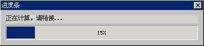

# Progress Bar Control

The progress bar is generally used to prompt the progress of a task for the
user, and is frequently used for tasks such as copying file, installing
software. Calling `CreateWindow` function with `CTRL_PROGRESSBAR` as the
control class name can create a progress bar. Figure 1 is the typical running
effect of a progress bar.


__Figure 1__ Progress bar control

## Styles of Progress Bar

Progress bar has only the following two styles available:
- `PBS_NOTIFY`: The progress bar control with this style can generate
notification messages.。
- `PBS_VERTICAL`: Display the progress bar vertically, as shown in Figure 2.


__Figure 2__ Vertical progress bar control

The combination of styles commonly used by a progress bar controls is:

```cpp
WS_CHILD | WS_VISIBLE | PBS_NOTIFY
```

## Messages of Progress Bar
### Setting Range of Progress Bar

The range of a progress bar is 0 to 100 by default, and an application can set
its own progress bar range by calling `PBM_SETRANGE` message:

```cpp
SendMessage (hwndEdit, PBM_SETRANGE, min, max) ;
```

__PROMPT__ The range of a progress bar can be set to be a negative value.

### Setting Step Value of Progress Bar

We can set the step value for a progress bar, and make the progress bar
stepping forward when each stage task is complete. The step value is 10 by
default, and can be changed by sending `PBM_SETSTEP` message, as shown in the
following:

```cpp
SendMessage (hwndEdit, PBM_SETSTEP, 5, 0) ;
```

The above message changes the step value of a progress bar to be 5.

__PROMPT__ The step value of a progress bar can be set to be a negative value.

You should set the position of the progress bar as the max value of its range
when the step value is a negative and the progress bar will decrease from its
max range to min.

### Setting Position of Progress Bar

We can also set the current position of a progress bar optionally with
`PBM_SETPOS` message:

```cpp
SendMessage (hwndEdit, PBM_SETPOS, 50, 0) ;
```

The above message sets the current position of a progress bar to be 50.

### Setting Offset Based-on Current Position

We can also set the offset of the new position based on the current position to
change the progress position:

```cpp
SendMessage (hwndEdit, PBM_DELTAPOS, 10, 0) ;
```

The above message will add 10 to the new position based on the current
position, i.e., new position is the current position plus 10.

__PROMPT__ The offset of a progress bar can be set to be a negative value.

### Advancing Position by One Step

`PBM_STEPIT` can be sent to advance the current position, and the new position
equals the result of the current position plus the step value:

```cpp
SendMessage (hwndEdit, PBM_STEPIT, 0, 0) ;
```

__NOTE__ The present progress bar control does not provide any messages for getting the current position, the current step increment, and the current position range.

## Notification Codes of Progress Bar

Progress bar with `PBS_NOTIFY` style may possibly generate the following
notification codes:
- `PBN_REACHMAX`: Reach the maximum position.
- `PBN_REACHMIN`: Reach the minimum position.

## Sample Program

List 1 gives an example of using the progress bar control. This program
provides two functions. Calling `createProgressWin` function will create a main
window with a progress bar and then return. We can control the progress bar of
the main window in our own program, and call `destroyProgressWin` function to
destroy the progress main window after completing the task. The two functions
actually come from `MiniGUIExt` library of MiniGUI. List 1 gives the example of
the implementation and the usage of these two functions, and the running effect
is as shown in Figure 3. Please refer to `progressbar.c` of the sample program
package `mg-samples` of this guide for the complete source code.


__List 1__ Example of using progress bar

```cpp
#include <stdio.h>
#include <stdlib.h>
#include <stdarg.h>
#include <string.h>
#include <sys/stat.h>
#include <sys/time.h>
#include <sys/types.h>
#include <unistd.h>
#include <errno.h>

#include <minigui/common.h>
#include <minigui/minigui.h>
#include <minigui/gdi.h>
#include <minigui/window.h>
#include <minigui/control.h>

static HWND createProgressWin (HWND hParentWnd, char * title, char * label,
        int id, int range)
{
    HWND hwnd;
    MAINWINCREATE CreateInfo;
    int ww, wh;
    HWND hStatic, hProgBar;

    /* Calculate the window width according to the width of the window client region */
    ww = ClientWidthToWindowWidth (WS_CAPTION | WS_BORDER, 400);
    /* Calculate the window height according to the height of the window client region */
    wh = ClientHeightToWindowHeight (WS_CAPTION | WS_BORDER,
            (range > 0) ? 70 : 35, FALSE);

    /* Create the main window */
    CreateInfo.dwStyle = WS_ABSSCRPOS | WS_CAPTION | WS_BORDER | WS_VISIBLE;
    CreateInfo.dwExStyle = WS_EX_NONE;
    CreateInfo.spCaption = title;
    CreateInfo.hMenu = 0;
    CreateInfo.hCursor = GetSystemCursor(IDC_WAIT);
    CreateInfo.hIcon = 0;
    /* The window procedure of the main window is set to
     * be the default main window procedure
     */
    CreateInfo.MainWindowProc = DefaultMainWinProc;
#ifndef _LITE_VERSION
    CreateInfo.lx = (GetGDCapability (HDC_SCREEN, GDCAP_MAXX) - ww) >> 1;
    CreateInfo.ty = (GetGDCapability (HDC_SCREEN, GDCAP_MAXY) - wh) >> 1;
#else
    CreateInfo.lx = g_rcExcluded.left + (RECTW(g_rcExcluded) - ww) >> 1;
    CreateInfo.ty = g_rcExcluded.top + (RECTH(g_rcExcluded) - wh) >> 1;
#endif
    CreateInfo.rx = CreateInfo.lx + ww;
    CreateInfo.by = CreateInfo.ty + wh;
    CreateInfo.iBkColor = COLOR_lightgray;
    CreateInfo.dwAddData = 0L;
    CreateInfo.hHosting = hParentWnd;

    hwnd = CreateMainWindow (&CreateInfo);
    if (hwnd == HWND_INVALID)
        return hwnd;

    /* Create a static control for prompting in the main window */
    hStatic = CreateWindowEx ("static",
                  label,
                  WS_VISIBLE | SS_SIMPLE,
                  WS_EX_USEPARENTCURSOR,
                  IDC_STATIC,
                  10, 10, 380, 16, hwnd, 0);

    /* Create the progress bar control in the main window */
    if (range > 0) {
        hProgBar = CreateWindowEx ("progressbar",
                  NULL,
                  WS_VISIBLE,
                  WS_EX_USEPARENTCURSOR,
                  id,
                  10, 30, 380, 30, hwnd, 0);
        SendDlgItemMessage (hwnd, id, PBM_SETRANGE, 0, range);
    }
    else
        hProgBar = HWND_INVALID;

    /* Update the controls */
    UpdateWindow (hwnd, TRUE);

    /* Return the handle of the main window */
    return hwnd;
}

static void destroyProgressWin (HWND hwnd)
{
    /* Destroy the controls and the main window  */
    DestroyAllControls (hwnd);
    DestroyMainWindow (hwnd);
    ThrowAwayMessages (hwnd);
    MainWindowThreadCleanup (hwnd);
}

int MiniGUIMain (int argc, const char* argv[])
{
    int i, sum;
    HCURSOR hOldCursor;
    HWND hwnd;

#ifdef _MGRM_PROCESSES
    JoinLayer(NAME_DEF_LAYER , "progressbar" , 0 , 0);
#endif

    /* Set “sandglass” mouse to indicate the system is busy */
    hOldCursor = SetDefaultCursor (GetSystemCursor (IDC_WAIT));

    /* Create the progressbar window, and specify the
     * identifier and range of the progress bar control */
    hwnd = createProgressWin (HWND_DESKTOP, "进度条",
            "正在计算，请稍候...", 100, 2000);

    while (HavePendingMessage (hwnd)) {
         MSG msg;
         GetMessage (&msg, hwnd);
         DispatchMessage (&msg);
    }

    /* Begin the long time calculating progress,and
     * refresh the position of the progressbar when completing
     * the external loop.
     */
    for (i = 0; i < 2000; i++) {
        unsigned long j;

        if (i % 100 == 0) {
            SendDlgItemMessage (hwnd, 100, PBM_SETPOS, i, 0L);
            while (HavePendingMessage (hwnd)) {
                MSG msg;
                GetMessage (&msg, hwnd);
                DispatchMessage (&msg);
            }
        }

        sum = i*5000;
        for (j = 0; j < 500000; j++)
            sum *= j;
        sum += sum;
    }

    /* Destroy the progressbar window */
    destroyProgressWin (hwnd);
    /* Recover the original mouse */
    SetDefaultCursor (hOldCursor);

    return 0;
}

#ifndef _MGRM_PROCESSES
#include <minigui/dti.c>
#endif
```


__Figure 3__ Example of progress bar control

----

[&lt;&lt; Menu Button Control](MiniGUIProgGuidePart6Chapter06.md) |
[Table of Contents](README.md) |
[Track Bar Control &gt;&gt;](MiniGUIProgGuidePart6Chapter08.md)

[Release Notes for MiniGUI 3.2]: /supplementary-docs/Release-Notes-for-MiniGUI-3.2.md
[Release Notes for MiniGUI 4.0]: /supplementary-docs/Release-Notes-for-MiniGUI-4.0.md
[Showing Text in Complex or Mixed Scripts]: /supplementary-docs/Showing-Text-in-Complex-or-Mixed-Scripts.md
[Supporting and Using Extra Input Messages]: /supplementary-docs/Supporting-and-Using-Extra-Input-Messages.md
[Using CommLCD NEWGAL Engine and Comm IAL Engine]: /supplementary-docs/Using-CommLCD-NEWGAL-Engine-and-Comm-IAL-Engine.md
[Using Enhanced Font Interfaces]: /supplementary-docs/Using-Enhanced-Font-Interfaces.md
[Using Images and Fonts on System without File System]: /supplementary-docs/Using-Images-and-Fonts-on-System-without-File-System.md
[Using SyncUpdateDC to Reduce Screen Flicker]: /supplementary-docs/Using-SyncUpdateDC-to-Reduce-Screen-Flicker.md
[Writing DRI Engine Driver for Your GPU]: /supplementary-docs/Writing-DRI-Engine-Driver-for-Your-GPU.md
[Writing MiniGUI Apps for 64-bit Platforms]: /supplementary-docs/Writing-MiniGUI-Apps-for-64-bit-Platforms.md

[Quick Start]: /user-manual/MiniGUIUserManualQuickStart.md
[Building MiniGUI]: /user-manual/MiniGUIUserManualBuildingMiniGUI.md
[Compile-time Configuration]: /user-manual/MiniGUIUserManualCompiletimeConfiguration.md
[Runtime Configuration]: /user-manual/MiniGUIUserManualRuntimeConfiguration.md
[Tools]: /user-manual/MiniGUIUserManualTools.md
[Feature List]: /user-manual/MiniGUIUserManualFeatureList.md

[MiniGUI Overview]: /MiniGUI-Overview.md
[MiniGUI User Manual]: /user-manual/README.md
[MiniGUI Programming Guide]: /programming-guide/README.md
[MiniGUI Porting Guide]: /porting-guide/README.md
[MiniGUI Supplementary Documents]: /supplementary-docs/README.md
[MiniGUI API Reference Manuals]: /api-reference/README.md

[MiniGUI Official Website]: http://www.minigui.com
[Beijing FMSoft Technologies Co., Ltd.]: https://www.fmsoft.cn
[FMSoft Technologies]: https://www.fmsoft.cn
[HarfBuzz]: https://www.freedesktop.org/wiki/Software/HarfBuzz/
