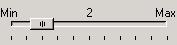
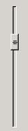
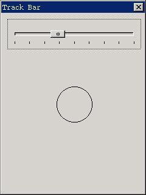

# Track Bar Control

The track bar is generally used for adjusting brightness, volume, etc. In the
situation for adjusting the value in a range, track bar can be used. Calling
`CreateWindow` function with `CTRL_TRACKBAR` as the control class name can
create a track bar. Figure 1 shows the typical running effect of a track bar.




Figure 1 Track bar control


## Styles of Track Bar

The frequently used combination of styles for a track bar is:

```cpp
WS_CHILD | WS_VISIBLE | TBS_NOTIFY
```

Specifying `TBS_NOTIFY` style can make a track bar generating notification
messages. 

A track bar is horizontal by default. To create a vertical track bar, you can
specify `TBS_VERTICAL` style. The track bar in Figure 2 is a vertical track 
bar. 




Figure 2 A vertical track bar


Other styles of track bar are illustrated as follow:
- `TBS_TIP`: Display the tip string beside the track bar (as “Min” and “Max” in
Figure 1). A track bar with this style will also display the current position
value in the center of the control.
- `TBS_NOTICK`: Do not display the tick lines.
- `TBS_BORDER`: This style makes a track bar having bordered, which is not used
frequently. 

## Messages of Track Bar

Messages of a track bar are relatively simple, as summarized in the following:
- `TBM_SETRANGE`: Set the minimum and maximum positions for the track bar
through `wParam` and `lParam` parameters. The default range is 0~10.
- `TBM_GETMIN`: Get the minimum position for the track bar.
- `TBM_GETMAX`: Get the maximum position for the track bar.
- `TBM_SETMIN`: Set the minimum position for the track bar.
- `TBM_SETMAX`: Set the maximum position for the track bar.
- `TBM_SETLINESIZE`: Sets the step value by `wParam` parameter. When the user
presses up or down arrow key during the track bar has input focus, the slider
will be moved up or down the step value. The default step value is 1.
- `TBM_GETLINESIZE`: Gets the step value of the slider.
- `TBM_SETPAGESIZE`: Set the page step value by `wParam` parameter. When the
user presses `PageUp` or `PageDown` key during the track bar has input focus,
the slider will be moved up or down the page step value. The default page step
value is 1.
- `TBM_GETPAGESIZE`: Get the page step value of the track bar.
- `TBM_SETPOS`: Set the position of the slider.
- `TBM_GETPOS`: Get the position of the slider.
- `TBM_SETTICKFREQ`: Set the interval value of tick marks in a track bar, the
default interval is 1.
- `TBM_GETTICKFREQ`: Get the interval value of tick marks in a track bar.
- `TBM_SETTIP`: Set the tip string at the minimum and maximum positions.
- `TBM_GETTIP`: Set the tip strings at the minimum and maximum positions.

## Notification Codes of Track Bar

The track bar with `TBS_NOTIFY` style may generate the following notification
codes: 
- `TBN_CHANGE`: The position of the slider has changed.
- `TBN_REACHMAX`: The slider has reached the maximum position.
- `TBN_REACHMIN`: The slider has reached the minimum position.

## Sample Program

List 1 gives an example program of track bar. The program draws a circle with
the corresponding size according to the current slider position. When the user
changes the position of the slider, the circle will also be refreshed. The
running effect of the program is shown in Figure 3. Please refer to trackbar.c
file of the demo program package `mg-samples` of this guide for the complete
source code.


List 1 Use of track bar

```cpp
#include <stdio.h>
#include <stdlib.h>
#include <string.h>

#include <minigui/common.h>
#include <minigui/minigui.h>
#include <minigui/gdi.h>
#include <minigui/window.h>
#include <minigui/control.h>

static int radius = 10;
static RECT rcCircle = {0, 60, 300, 300};

static void my_notif_proc (HWND hwnd, int id, int nc, DWORD add_data)
{
    if (nc == TBN_CHANGE) {

        /* When the position of the slider has changed, 
         * save the current position, and inform the main window to redraw */
        radius = SendMessage (hwnd, TBM_GETPOS, 0, 0);
        InvalidateRect (GetParent (hwnd), &rcCircle, TRUE);
    }
}

static int TrackBarWinProc(HWND hWnd, int message, WPARAM wParam, LPARAM lParam)
{
    HWND hwnd;
    switch (message) {
    case MSG_CREATE:
        /* Create a track bar */
        hwnd = CreateWindow (CTRL_TRACKBAR, 
                          "", 
                          WS_VISIBLE | TBS_NOTIFY, 
                          100, 
                          10, 10, 280, 50, hWnd, 0);

        /* Set the range, step vaue, interval value and current position */
        SendMessage (hwnd, TBM_SETRANGE, 0, 100);
        SendMessage (hwnd, TBM_SETLINESIZE, 1, 0);
        SendMessage (hwnd, TBM_SETPAGESIZE, 10, 0);
        SendMessage (hwnd, TBM_SETTICKFREQ, 10, 0);
        SendMessage (hwnd, TBM_SETPOS, radius, 0);

        /* Set the notification callback function of the slider */
        SetNotificationCallback (hwnd, my_notif_proc);
        break;

    case MSG_PAINT:
    {
        HDC hdc = BeginPaint (hWnd);

        /* Draw a circle with radius of the the current position of the slider */
        ClipRectIntersect (hdc, &rcCircle);
        Circle (hdc, 140, 120, radius);

        EndPaint (hWnd, hdc);
        return 0;
    }

    case MSG_DESTROY:
        DestroyAllControls (hWnd);
        return 0;

    case MSG_CLOSE:
        DestroyMainWindow (hWnd);
        PostQuitMessage (hWnd);
        return 0;
    }

    return DefaultMainWinProc(hWnd, message, wParam, lParam);
}

/* Following codes to create the main window are omitted */
```




Figure 3 Use of track bar


-- Main.XiaodongLi - 26 Oct 2009


----

[&lt;&lt; ](MiniGUIProgGuidePart.md) |
[Table of Contents](README.md) |
[ &gt;&gt;](MiniGUIProgGuidePart.md)

[Release Notes for MiniGUI 3.2]: /supplementary-docs/Release-Notes-for-MiniGUI-3.2.md
[Release Notes for MiniGUI 4.0]: /supplementary-docs/Release-Notes-for-MiniGUI-4.0.md
[Showing Text in Complex or Mixed Scripts]: /supplementary-docs/Showing-Text-in-Complex-or-Mixed-Scripts.md
[Supporting and Using Extra Input Messages]: /supplementary-docs/Supporting-and-Using-Extra-Input-Messages.md
[Using CommLCD NEWGAL Engine and Comm IAL Engine]: /supplementary-docs/Using-CommLCD-NEWGAL-Engine-and-Comm-IAL-Engine.md
[Using Enhanced Font Interfaces]: /supplementary-docs/Using-Enhanced-Font-Interfaces.md
[Using Images and Fonts on System without File System]: /supplementary-docs/Using-Images-and-Fonts-on-System-without-File-System.md
[Using SyncUpdateDC to Reduce Screen Flicker]: /supplementary-docs/Using-SyncUpdateDC-to-Reduce-Screen-Flicker.md
[Writing DRI Engine Driver for Your GPU]: /supplementary-docs/Writing-DRI-Engine-Driver-for-Your-GPU.md
[Writing MiniGUI Apps for 64-bit Platforms]: /supplementary-docs/Writing-MiniGUI-Apps-for-64-bit-Platforms.md

[Quick Start]: /user-manual/MiniGUIUserManualQuickStart.md
[Building MiniGUI]: /user-manual/MiniGUIUserManualBuildingMiniGUI.md
[Compile-time Configuration]: /user-manual/MiniGUIUserManualCompiletimeConfiguration.md
[Runtime Configuration]: /user-manual/MiniGUIUserManualRuntimeConfiguration.md
[Tools]: /user-manual/MiniGUIUserManualTools.md
[Feature List]: /user-manual/MiniGUIUserManualFeatureList.md

[MiniGUI Overview]: /MiniGUI-Overview.md
[MiniGUI User Manual]: /user-manual/README.md
[MiniGUI Programming Guide]: /programming-guide/README.md
[MiniGUI Porting Guide]: /porting-guide/README.md
[MiniGUI Supplementary Documents]: /supplementary-docs/README.md
[MiniGUI API Reference Manuals]: /api-reference/README.md

[MiniGUI Official Website]: http://www.minigui.com
[Beijing FMSoft Technologies Co., Ltd.]: https://www.fmsoft.cn
[FMSoft Technologies]: https://www.fmsoft.cn
[HarfBuzz]: https://www.freedesktop.org/wiki/Software/HarfBuzz/
