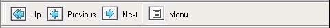
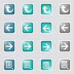
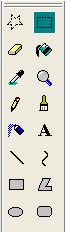
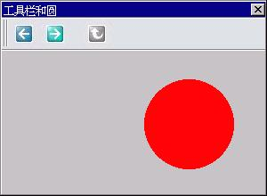

# Toolbar Control

- [Creating Toolbar Control](#creating-toolbar-control)
- [Styles of Toolbar](#styles-of-toolbar)
- [Messages of Toolbar](#messages-of-toolbar)
   + [Adding an Item](#adding-an-item)
   + [Getting/Setting Information of an Item](#gettingsetting-information-of-an-item)
   + [`NTBM_SETBITMAP` Message](#ntbm-setbitmap-message)
- [Notification Codes of Toolbar](#notification-codes-of-toolbar)
- [Sample Program](#sample-program)


The use of toolbar is frequently seen in modern GUI applications. MiniGUI
prepares the predefined toolbar control class for the application. In fact,
MiniGUI provides three different predefined toolbar control classes, namely
`CTRL_TOOLBAR`, `CTRL_NEWTOOLBAR`, and `CTRL_COOLBAR` (in `MiniGUIExt` library)
control classes.

`CTRL_TOOLBAR` is the early toolbar control class, which is obsolete and
replaced by `CTRL_NEWTOOLBAR` control class. Including `CTRL_TOOLBAR` class in
MiniGUI is just for compatibility, and new applications should not use it. We
introduce `CTRL_NEWTOOLBAR` control class in this chapter, and introduce
`CTRL_COOLBAR` control class in Chapter 36.

Calling `CreateWindow` function with `CTRL_NEWTOOLBAR` as the control class
name can create a toolbar control. The running effect of this control is shown
in Figure 1.




__Figure 1__ Toolbar control

## Creating Toolbar Control

Before creating a toolbar control, we should fill a `NTBINFO` structure first,
and pass the pointer to the structure to the window procedure of the control
class through `dwAddData` argument of `CreateWindow` function. `NTBINFO`
structure is mainly used to define the information of the bitmap used by a
toolbar, as shown in Table 1.

__Table 1__ `NTBINFO` structure

| *Member* | *Meaning* | *Note* |
|----------|-----------|--------|
| image |Image for displaying the bitmaps of the buttons. | |
| `nr_cells` |Number of bitmap cells in the image, that is to say, number of lines in total| |
| `nr_cols` |Number of cell columns in the image, that is to say, number of states of each bitmap cell |1 means the cells have only normal state; <br>2 means the cells have normal and highlight states; <br>3 means the cells have not disabled state. <br>4 or 0 means the cells have all the four possible states. |
| `w_cell` |Width of bitmap cell |If `w_cell` is zero, it will be equal to (`width_of_image` / `nr_cols`)|
| `h_cell` |Height of bitmap cell |If `h_cell` is zero, it will be equal to (`height_of_image` / `nr_cells`)|


We must organize the bitmaps on the toolbar buttons (we called bitmap cells) in
a single bitmap object, and should organize them into a structure as shown in
Figure 2. Here, the first column illustrates the normal states of all the
bitmap cells possibly used by the toolbar buttons; the second column
illustrates the highlighted states of all the bitmap cells possibly used by the
toolbar buttons; the third column illustrates the pushed state, and the fourth
column illustrates the disabled (grayed) state. Each row of the bitmap
illustrates all the states of a single button bitmap cell.




__Figure 2__ Bitmap object used for a toolbar control

The toolbar control selects the appropriate bitmap cell in the bitmap object to
display the button according to the button state in the toolbar.

## Styles of Toolbar

The toolbar control class supports the following styles:
- `NTBS_HORIZONTAL`: Display toolbar horizontally. This is the default style.
- `NTBS_VERTICAL`: Display toolbar vertically, as shown in Figure 3.
- `NTBS_MULTLINE`: Toolbar can display multiple lines. When type of tool item
is `NTBIF_NEWLINE`, it will display the added tool item in another row or
column, as shown in Figure 3.
- `NTBS_WITHTEXT`: Display the text under or at the right side of the button,
and display the text under the button bitmap by default. In this case, the
application must specify the corresponding text when adding a button. The
bitmap will be popped when the button is active with this style.
- `NTBS_TEXTRIGHT`: When using it with `NTBS_WITHTEXT` style, this style
specifies the text to display at the right side of the button bitmap. The
toolbar in Figure 1 has `NTBS_TEXTRIGHT` style. The bitmap and text will be
popped when the button is active with this style.
- `NTBS_DRAWSTATES`: Draws the button states with different 3D frames, and does
not use the highlight, pushed and disabled bitmap cell.
- `NTBS_DRAWSEPARATOR`: Draws the separator bar. The separator bar used to
separate buttons in the toolbar will not be drawn by default, but increase the
distance between two buttons. When the toolbar has this style, it will draw a
narrow separator bar.



__Figure 3__ Toolbar control display vertically and in multiple columns

## Messages of Toolbar
### Adding an Item

An item can be added by sending `NTBM_ADDITEM` message and passing
`NTBITEMINFO` structure to the toolbar control. Table 2 gives the meanings of
the members of `NTBITEMINFO`.

__Table 2__ `NTBITEMINFO` structure

| *Members *|*Meanings* |*Note*|
|-----------|-----------|------|
| which |Used for `NTBM_GETITEM` and `NTBM_SETITEM` messages.| |
| flags |This member is used to specify the type and state of an item. The type can be one of the following values:<br>1. `NTBIF_PUSHBUTTON`: A normal push button<br>2. `NTBIF_CHECKBUTTON`: A check box button<br>3. `NTBIF_HOTSPOTBUTTON`: A button with hotspot<br>4. `NTBIF_NEWLINE`: A new line separator when the style `NTBS_MULTILINE` specified.<br>5. `NTBIF_SEPARATOR`: A separator.<br>The item has only one state, namely `NTBIF_DISABLED`, indicating the item is disabled.| The value of this member should be `OR’d` value by one of the type identifier and the state identifier.|
| id |Identifier of the button. When the user clicked a button, the identifier would be sent as the notification code of the notification message of the toolbar to the parent window or the notification callback function.| |
| text |This member will be used to pass the text of the button when the control has `NTBS_WITHTEXT` style.| |
| tip |Not used and reserved.| |
| `bmp_cell` |Specify which bitmap cell in the bitmap object is used by the button. This index of first bitmap cell is zero.|This button will use the bitmap cell in the `bmp_cell` line to display the state of the button.|
| `hotspot_proc` |If the item is a button with hotspot, this member defines the callback function when the user clicked the hotspot.| |
| `rc_hotspot` |If the item is a button with hotspot, this member defines the rectangle region of the hotspot in the button, relative to the upper-left corner of the button. | When the user clicked the hotspot rectangle region, it is regarded as activating the hotspot.|
| `add_data` |Additional data of the item.| |


The member will be ignored when adding an item. The following program
illustrates how to add a normal push button, an initially grayed button, an
separator bar, and a button with hotspot to a toolbar control:

```cpp
    HWND ntb1;
    NTBINFO ntb_info;
    NTBITEMINFO ntbii;
    RECT hotspot = {16, 16, 32, 32};

    /* Fill NTBINFO Structure */
    ntb_info.nr_cells = 4;
    ntb_info.w_cell  = 0;
    ntb_info.h_cell  = 0;
    ntb_info.nr_cols = 0;
    ntb_info.image = &bitmap1;

    /* Create the toolbar control */
    ntb1 = CreateWindow (CTRL_NEWTOOLBAR,
                    "",
                    WS_CHILD | WS_VISIBLE,
                    IDC_CTRL_NEWTOOLBAR_1,
                    0, 10, 1024, 0,
                    hWnd,
                    (DWORD) &ntb_info);

    /* Add a normal button item */
    ntbii.flags = NTBIF_PUSHBUTTON;
    ntbii.id = IDC_NTB_TWO;
    ntbii.bmp_cell = 1;
    SendMessage(ntb1, TBM_ADDITEM, 0, (LPARAM)&ntbii);

    /* Add a grayed button item */
    ntbii.flags = NTBIF_PUSHBUTTON | NTBIF_DISABLED;
    ntbii.id = IDC_NTB_THREE;
    ntbii.bmp_cell = 2;
    SendMessage (ntb1, TBM_ADDITEM, 0, (LPARAM)&ntbii);

    /* Add a separator */
    ntbii.flags = NTBIF_SEPARATOR;
    ntbii.id = 0;
    ntbii.bmp_cell = 0;
    ntbii.text = NULL;
    SendMessage (ntb1, TBM_ADDITEM, 0, (LPARAM)&ntbii);

    /* Add a button with hotspot */
    ntbii.flags = NTBIF_HOTSPOTBUTTON;
    ntbii.id = IDC_NTB_FOUR;
    ntbii.bmp_cell = 3;
    ntbii.rc_hotspot = hotspot;
    ntbii.hotspot_proc = my_hotspot_proc;
    SendMessage (ntb1, TBM_ADDITEM, 0, (LPARAM)&ntbii);
```

### Getting/Setting Information of an Item

Using `NTBM_GETITEM` or `NTBM_SETITEM` message can get or set the information
of an item through its identifier. Use of the two messages is similar to
`NTBM_ADDITEM`, and the difference is `wParam` as the ID of item and `lParam`
as point to a `NTBITEMINFO` structure that which member in specifies the item
information to be gotten or set. The member which can be the `OR’d` of the
following values:
- `MTB_WHICH_FLAGS`: Get or set the flag of an item, which is the flags field
in `NTBITEMINFO` structure.
- `MTB_WHICH_ID`: Get or set the identifier of an item
- `MTB_WHICH_TEXT`: Get or set the item text. Note that when getting text, you
must ensure that enough buffer to be passed by text field. For safety
consideration, it should ensure that the size of the buffer is at least
`NTB_TEXT_LEN+1`.
- `MTB_WHICH_CELL`: Get or set the bitmap cell index used by the item.
- `MTB_WHICH_HOTSPOT`: Get or set the hotspot rectangle of the item.
- `MTB_WHICH_ADDDATA`: Get or set the additional data of the item.

For convenience, MiniGUI also provides `NTBM_ENABLEITEM` message to enable or
disable an item with the specified identifier, as shown in the following:

```cpp
SendMessage (ntb1, NTBM_ENABLEITEM, 100, FALSE);
```

The above code disables (grays) the item with identifier of 100 in ntb1 toolbar
control.

### `NTBM_SETBITMAP` Message

An application can send `NTBM_SETBITMAP` message to a toolbar control, in order
to change the button bitmap on the toolbar. When sending the message, an
application uses `lParam` parameter to transfer a new `NTBINFO` structure, in
which the new toolbar button bitmap is defined, as shown in the following code:

```cpp
NTBINFO ntbi;
...
SendMessage (ntb, NTBM_SETBITMAP, 0, (LPARAM)&ntbi);
```

## Notification Codes of Toolbar

Toolbars will not generate a notification message until the user clicks a
button. The notification code of the toolbar is the identifier of the button
clicked by the user. When the user clicks the button with hotspot, the toolbar
control will call directly the hotspot callback function corresponding to the
button, and will not generate a notification message.

## Sample Program

List 1 gives a sample program of toolbar control. This program creates a
toolbar with three buttons. We can control the position of the circle in the
window by clicking the left item and right item on the toolbar. The other item
grayed initially is only for demonstration and has no function. The running
effect of this program is shown in Figure 4. Please refer to `newtoolbar.c` of
the demo program package `mg-samples` of this guide for the complete source
code.


__List 1__ Sample program of toolbar control

```cpp
#include <stdio.h>
#include <stdlib.h>
#include <string.h>

#include <minigui/common.h>
#include <minigui/minigui.h>
#include <minigui/gdi.h>
#include <minigui/window.h>
#include <minigui/control.h>

#define IDC_NTB_LEFT  100
#define IDC_NTB_RIGHT 110
#define IDC_NTB_UP    120

static int offset = 0;
static RECT rcCircle = {0, 40, 300, 300};

static void my_notif_proc (HWND hwnd, int id, int nc, DWORD add_data)
{
    /* When the user clicked the left or right button, the circle in the window
     * will move left or right correspondingly
     */
    if (nc == IDC_NTB_LEFT) {
        offset -= 10;
        InvalidateRect (GetParent (hwnd), &rcCircle, TRUE);
    }
    else if (nc == IDC_NTB_RIGHT) {
        offset += 10;
        InvalidateRect (GetParent (hwnd), &rcCircle, TRUE);
    }
}

static BITMAP ntb_bmp;

static void create_new_toolbar (HWND hWnd)
{
    HWND ntb;
    NTBINFO ntb_info;
    NTBITEMINFO ntbii;
    gal_pixel pixel;

    ntb_info.nr_cells = 4;
    ntb_info.w_cell  = 0;
    ntb_info.h_cell  = 0;
    ntb_info.nr_cols = 0;
    ntb_info.image = &ntb_bmp;

    /* Create the toolbar control */
    ntb = CreateWindow (CTRL_NEWTOOLBAR,
                    "",
                    WS_CHILD | WS_VISIBLE,
                    100,
                    0, 0, 1024, 0,
                    hWnd,
                    (DWORD) &ntb_info);

    /* Set notification callback */
    SetNotificationCallback (ntb, my_notif_proc);

    /* Set the background color of the toolbar control,
     * and make it consistent with the background of the button bitmap
     */
    pixel = GetPixelInBitmap (&ntb_bmp, 0, 0);
    SetWindowBkColor (ntb, pixel);
    InvalidateRect (ntb, NULL, TRUE);

    /* Add two normal button items */
    memset (&ntbii, 0, sizeof (ntbii));
    ntbii.flags = NTBIF_PUSHBUTTON;
    ntbii.id = IDC_NTB_LEFT;
    ntbii.bmp_cell = 1;
    SendMessage(ntb, TBM_ADDITEM, 0, (LPARAM)&ntbii);

    ntbii.flags = NTBIF_PUSHBUTTON;
    ntbii.id = IDC_NTB_RIGHT;
    ntbii.bmp_cell = 2;
    SendMessage (ntb, TBM_ADDITEM, 0, (LPARAM)&ntbii);

    /* Add a separator */
    ntbii.flags = NTBIF_SEPARATOR;
    ntbii.id = 0;
    ntbii.bmp_cell = 0;
    ntbii.text = NULL;
    SendMessage (ntb, TBM_ADDITEM, 0, (LPARAM)&ntbii);

    /* Add an initially disabled button */
    ntbii.flags = NTBIF_PUSHBUTTON | NTBIF_DISABLED;
    ntbii.id = IDC_NTB_UP;
    ntbii.bmp_cell = 0;
    SendMessage (ntb, TBM_ADDITEM, 0, (LPARAM)&ntbii);
}

static int ToolBarWinProc(HWND hWnd, int message, WPARAM wParam, LPARAM lParam)
{
    switch (message) {
    case MSG_CREATE:
        /* Load the bitmap object used by the toolbar */
        if (LoadBitmap (HDC_SCREEN, &ntb_bmp, "new2.jpg"))
            return -1;

        create_new_toolbar (hWnd);
        break;

    case MSG_PAINT:
    {
        HDC hdc = BeginPaint (hWnd);

        ClipRectIntersect (hdc, &rcCircle);

        /* Draw a red circle */
        SetBrushColor (hdc, PIXEL_red);
        FillCircle (hdc, 140 + offset, 120, 50);

        EndPaint (hWnd, hdc);
        return 0;
    }

    case MSG_DESTROY:
        UnloadBitmap (&ntb_bmp);
        DestroyAllControls (hWnd);
        return 0;

    case MSG_CLOSE:
        DestroyMainWindow (hWnd);
        PostQuitMessage (hWnd);
        return 0;
    }

    return DefaultMainWinProc(hWnd, message, wParam, lParam);
}

/* Following codes to create the main window are omitted */
```



__Figure 4__ Use of toolbar control

----

[&lt;&lt; Track Bar Control](MiniGUIProgGuidePart6Chapter08.md) |
[Table of Contents](README.md) |
[Property Sheet Control &gt;&gt;](MiniGUIProgGuidePart6Chapter10.md)

[Release Notes for MiniGUI 3.2]: /supplementary-docs/Release-Notes-for-MiniGUI-3.2.md
[Release Notes for MiniGUI 4.0]: /supplementary-docs/Release-Notes-for-MiniGUI-4.0.md
[Showing Text in Complex or Mixed Scripts]: /supplementary-docs/Showing-Text-in-Complex-or-Mixed-Scripts.md
[Supporting and Using Extra Input Messages]: /supplementary-docs/Supporting-and-Using-Extra-Input-Messages.md
[Using CommLCD NEWGAL Engine and Comm IAL Engine]: /supplementary-docs/Using-CommLCD-NEWGAL-Engine-and-Comm-IAL-Engine.md
[Using Enhanced Font Interfaces]: /supplementary-docs/Using-Enhanced-Font-Interfaces.md
[Using Images and Fonts on System without File System]: /supplementary-docs/Using-Images-and-Fonts-on-System-without-File-System.md
[Using SyncUpdateDC to Reduce Screen Flicker]: /supplementary-docs/Using-SyncUpdateDC-to-Reduce-Screen-Flicker.md
[Writing DRM Engine Driver for Your GPU]: /supplementary-docs/Writing-DRM-Engine-Driver-for-Your-GPU.md
[Writing MiniGUI Apps for 64-bit Platforms]: /supplementary-docs/Writing-MiniGUI-Apps-for-64-bit-Platforms.md

[Quick Start]: /user-manual/MiniGUIUserManualQuickStart.md
[Building MiniGUI]: /user-manual/MiniGUIUserManualBuildingMiniGUI.md
[Compile-time Configuration]: /user-manual/MiniGUIUserManualCompiletimeConfiguration.md
[Runtime Configuration]: /user-manual/MiniGUIUserManualRuntimeConfiguration.md
[Tools]: /user-manual/MiniGUIUserManualTools.md
[Feature List]: /user-manual/MiniGUIUserManualFeatureList.md

[MiniGUI Overview]: /MiniGUI-Overview.md
[MiniGUI User Manual]: /user-manual/README.md
[MiniGUI Programming Guide]: /programming-guide/README.md
[MiniGUI Porting Guide]: /porting-guide/README.md
[MiniGUI Supplementary Documents]: /supplementary-docs/README.md
[MiniGUI API Reference Manuals]: /api-reference/README.md

[MiniGUI Official Website]: http://www.minigui.com
[Beijing FMSoft Technologies Co., Ltd.]: https://www.fmsoft.cn
[FMSoft Technologies]: https://www.fmsoft.cn
[HarfBuzz]: https://www.freedesktop.org/wiki/Software/HarfBuzz/
