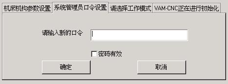
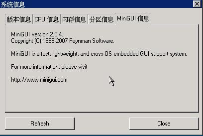

# Property Sheet Control

The most familiar usage of property sheet is to place the interaction content
belonging to different dialog boxes into one dialog box according to their
catalogues. This can save space of the dialog box on the one hand, and can make
the interaction interface more convenient to use on the other hand. Figure 1 is
a typical use of the property sheet control of MiniGUI.




Figure 1 Property sheet control


The property sheet is comprised of a group of property pages. Each property 
page has a tab, and we can click the tab to switch among different property
pages. We can interpret the property page as a container control, in which 
other controls can be contained. From the point of view of an application
developer, we can also interpret the property page as a dialog box in a dialog
box - each property page has its own window procedure, and we can use the 
method similar to create a dialog box, i.e. the method to define a dialog box
template, to add a property page into a property sheet control.

In an application, calling `CreateWindow` with `CTRL_PROPSHEET` as the control
class name can create a property sheet control.

## Styles of Property Sheet

At present, there are only the following two styles of property sheet, which 
are used to control the width of a tab of the property sheet:
- `PSS_SIMPLE:` All tabs of the control will have the same width.
- `PSS_COMPACTTAB:` The width of a tab depends on the length of the tab title 
of the property sheet.
- `PSS_SCROLLABLE:` The width of a tab depends on the length of the tab title 
of the property sheet. There will be two of navigation button for scroll the
tabs when the count of tab is too many.
- `PSS_BOTTOM:` Tabs are displayed at the bottom of the property sheet. This
style can be used to with other three styles.

## Messages of Property Sheet
### Adding Property Page

After the property sheet control has been created, we can send `PSM_ADDPAGE`
message to add a property page to the property sheet. `WParam` of the message 
is used to pass the dialog box template, and `lParam` is used to pass the 
window procedure function of the property page, as shown in the following code:

```
```

The return value of this message is the index of the newly added property page,
and the index is base-on zero.

### Procedure Function of Property Page

Similar to the dialog box, each property page has its own procedure function to
handle the related messages of the property page. The prototype of the 
procedure function is the same with a normal window procedure function, but the
followings are different:
- The procedure function of a property page should call `DefaultPageProc`
function for the message needing default handling.
- The procedure function of a property page need handle two messages specific 
to the property page: `MSG_INITPAGE` and `MSG_SHOWPAGE`. The former is similar
to `MSG_INITDIALOG` message of a dialog box; and the latter is sent to the
procedure of the property page when the property page is hidden or showed, 
where `lParam` parameter is `SW_HIDE` and `SW_SHOW`, respectively. When the
property page is displayed, the procedure function of the property page returns
1 to make the first control with `WS_TABSTOP` has the input focus.
- If you send `PSM_SHEETCMD` message to the property sheet control, the control
will broadcast `MSG_SHEETCMD` message to all pages it contains. At this time,
the page callback procedure can check the validity of the user input and save
the valid input. If the input is invalid or other problems occur, the page can
return -1 to break the continued broadcast of this message. After receiving a
non-zero value from any property page, the property sheet control will make
`PSM_SHEETCMD` message return a non-zero value, and this is equal to the page
index plus one. In such a way, we can know which page includes invalid input
during handling the property pages of the property sheet, and then terminate 
the handling and switch to this property page.

List 1 gives a typical procedure function of a property page, and the procedure
function of the dialog box of the property sheet. When the user clicks the “OK”
button of the dialog box containing the property sheet, the dialog box sends
`PSM_SHEETCMD` message to the property sheet control, and according to the
return value of the message, determines to close the dialog box or switch to a
property page to correct the invalid input. After receiving `MSG_SHEETCMD`
message, the procedure function of the property page will determine whether the
user input is valid, and returns 0 or -1 correspondingly.


List 1 A typical procedure function of property page and a procedure function 
of dialog box containing property sheet
```
```

### Deleting Property Page

To delete a property page, you need only send `PSM_REMOVEPAGE` message to the
property sheet control, and pass the index of the property page to be deleted
through `wParam` parameter:

```
```

This message will delete the first property page in the property sheet.

***
[Note] Deleting a property page may change the indices of other property pages.
***

### Handle and Index of Property Page

The handle of a property page is actually the handle of the parent window of 
the controls in the property page, i.e. the window handle passed by the
procedure function of the property page, and this window is actually a child
window of the property sheet control. Sending `PSM_GETPAGE` message to the
property sheet control can get the handle of a property page with a certain
index: 

```
```

This message will return the handle of the property page with index value of
“index”. While the following message call returns the index of a page based on
the handle of the property page:

```
```

After getting the handle of the property page, we can call functions such as
`CreateWindow` to add a new control to the page conveniently. Of course, in the
procedure function of the property page, we can complete the similar task.

### Messages Relevant Property Page

MiniGUI provides the following messages to get the relevant information of
property pages:：
- `PSM_GETPAGECOUNT:returns` the number of pages in the property sheet.
- `PSM_GETTITLELENGTH:` gets the length of the page title according to the 
index value passed by `wParam` parameter, like the `MSG_GETTEXTLENGTH` message
of a window.
- `PSM_GETTITLE:` gets the page title according to the index value passed by
`wParam` parameter, and save it in the buffer passed by `lParam` parameter, 
like the `MSG_GETTEXT` message of a window.
- `PSM_SETTITLE:` sets the property page title according to the string passed 
by `lParam,` like `MSG_SETTEXT` message of a window.

The active property page is the property page currently displayed in the
property sheet, and every time only one-property page is displayed in the
property sheet. MiniGUI provides the following messages to handle the active
property page:
- `PSM_GETACTIVEPAGE:` returns the handle of the current active page.
- `PSM_GETACTIVEINDEX:` returns the index of the current active page
- `PSM_SETACTIVEINDEX:` sets the active property page according to the index
passed by `wParam.`

## Notification Codes of Property Sheet

At present, there is only one notification code for property sheet control:
- `PSN_ACTIVE_CHANGED:` When the active property page of the property sheet
changed, the property sheet control will generate this notification code.

## Sample Program

List 2 gives a sample program for property sheet control. This program displays
some system information of the computer, such as `CPU` type, memory size, etc.
The running effect of this program is shown in Figure 2. Please refer to
propsheet.c of the sample program package of this guide for the complete source
code. 


List 2 A sample program of property sheet control

```
```




Figure 2 Use of property sheet control


-- Main.XiaodongLi - 26 Oct 2009


----

[&lt;&lt; ](MiniGUIProgGuidePart.md) |
[Table of Contents](README.md) |
[ &gt;&gt;](MiniGUIProgGuidePart.md)

[Release Notes for MiniGUI 3.2]: /supplementary-docs/Release-Notes-for-MiniGUI-3.2.md
[Release Notes for MiniGUI 4.0]: /supplementary-docs/Release-Notes-for-MiniGUI-4.0.md
[Showing Text in Complex or Mixed Scripts]: /supplementary-docs/Showing-Text-in-Complex-or-Mixed-Scripts.md
[Supporting and Using Extra Input Messages]: /supplementary-docs/Supporting-and-Using-Extra-Input-Messages.md
[Using CommLCD NEWGAL Engine and Comm IAL Engine]: /supplementary-docs/Using-CommLCD-NEWGAL-Engine-and-Comm-IAL-Engine.md
[Using Enhanced Font Interfaces]: /supplementary-docs/Using-Enhanced-Font-Interfaces.md
[Using Images and Fonts on System without File System]: /supplementary-docs/Using-Images-and-Fonts-on-System-without-File-System.md
[Using SyncUpdateDC to Reduce Screen Flicker]: /supplementary-docs/Using-SyncUpdateDC-to-Reduce-Screen-Flicker.md
[Writing DRI Engine Driver for Your GPU]: /supplementary-docs/Writing-DRI-Engine-Driver-for-Your-GPU.md
[Writing MiniGUI Apps for 64-bit Platforms]: /supplementary-docs/Writing-MiniGUI-Apps-for-64-bit-Platforms.md

[Quick Start]: /user-manual/MiniGUIUserManualQuickStart.md
[Building MiniGUI]: /user-manual/MiniGUIUserManualBuildingMiniGUI.md
[Compile-time Configuration]: /user-manual/MiniGUIUserManualCompiletimeConfiguration.md
[Runtime Configuration]: /user-manual/MiniGUIUserManualRuntimeConfiguration.md
[Tools]: /user-manual/MiniGUIUserManualTools.md
[Feature List]: /user-manual/MiniGUIUserManualFeatureList.md

[MiniGUI Overview]: /MiniGUI-Overview.md
[MiniGUI User Manual]: /user-manual/README.md
[MiniGUI Programming Guide]: /programming-guide/README.md
[MiniGUI Porting Guide]: /porting-guide/README.md
[MiniGUI Supplementary Documents]: /supplementary-docs/README.md
[MiniGUI API Reference Manuals]: /api-reference/README.md

[MiniGUI Official Website]: http://www.minigui.com
[Beijing FMSoft Technologies Co., Ltd.]: https://www.fmsoft.cn
[FMSoft Technologies]: https://www.fmsoft.cn
[HarfBuzz]: https://www.freedesktop.org/wiki/Software/HarfBuzz/
