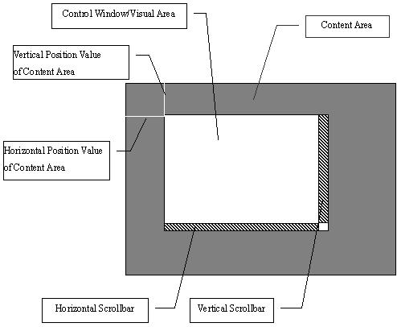
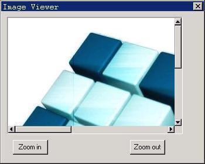

# Scroll Window Control

Scroll window (`ScrollWnd`) control is a container control with scroll bars to
browse children windows in it. Its basic usage is to place child controls, so
make the user can check and operate many controls in a window by scroll bars.
Certainly, `ScrollWnd` can also be used to do many other things, and it is easy
to be customized. In the end of this chapter, we will see a example which uses
`ScrollWnd` as a picture viewer.

In an application, calling `CreateWindow` function with `CTRL_SCROLLWND` as the
control class name can create `ScrollWnd` control.

## Scrollable Window

`ScrollWnd` control and `ScrollView` control discussed in the next chapter are
both scrollable window controls, and have many similarities. A scrollable
window comprises a control window (visible area) with scroll bar and content
area, as shown in Figure 1. When scroll bar is used to move the display content
area, horizontal position value or vertical position value of content area will
change. Size of content area can be controlled by application, but cannot be
smaller than visible area.




__Figure 1__ A scrollable window

## General Scroll Window Messages

`ScrollWnd` and `ScrollView` control all respond to some general scroll window
messages, including getting and setting content range of scroll window, setting
scroll value of scroll bar, getting and setting the current position of content
area, getting and setting size of visible area, etc.

### Get/Set the Range of Content Area and Visible Area

`SVM_SETCONTRANGE` message is used to set the size of the content area of a
scroll window:

```cpp
int cont_w, cont_h;
SendMessage (hScrWnd, SVM_SETCONTRANGE, cont_w, cont_h);
```

Here, `cont_w` and `cont_h` are the width and the height of content area to be
set respectively. If `cont_w` or `cont_h` is negative, content area will not
change; if the content area width (height) to be set is less than visible area
width (height), the content area width (height) after set will equal to the
visible area width (height).

`SVM_SETCONTWIDTH` message and `SVM_SETCONTHEIGHT` message are used to set the
width and the height of a scroll window respectively:

```cpp
int cont_w, cont_h;
SendMessage (hScrWnd, SVM_SETCONTWIDTH, cont_w, 0);
SendMessage (hScrWnd, SVM_SETCONTHEIGHT, cont_h, 0);
```

`SVM_GETCONTWIDTH`, `SVM_GETCONTHEIGHT`, `SVM_GETVISIBLEWIDTH` and
`SVM_GETVISIBLEHEIGHT` message are used to get the content area width and
height and the visible area width and height respectively.

### Get Position Information and Set Current Position

`SVM_GETCONTENTX` and `SVM_GETCONTENTY` messages are used to get the current
position value of the content area:

```cpp
int pos_x = SendMessage (hScrWnd, SVM_GETCONTENTX, 0, 0);
int pos_y = SendMessage (hScrWnd, SVM_GETCONTENTY, 0, 0);
```

`SVM_SETCONTPOS` message is used to set the current position value of the
content area, i.e. move the content area to a specified position in the visible
area:

```cpp
int pos_x, pos_y;
SendMessage (hScrWnd, SVM_SETCONTPOS, pos_x, pos_y);
```

`SVM_MAKEPOSVISIBLE` message is used to make a position point in the content
area visible:

```cpp
SendMessage (hScrWnd, SVM_MAKEPOSVISIBLE, pos_x, pos_y);
```

If this position point is invisible originally, while it becomes visible by
using `SVM_MAKEPOSVISIBLE` message, the position point will locate in the up
edge of visible area (previous position point is above visible area) or down
edge of visible area (previous position point is below visible area).

### Get/Set Scroll Properties

`SVM_GETHSCROLLVAL` and `SVM_GETVSCROLLVAL` messages are used to get the
current horizontal and vertical line values of the scroll window (the scroll
values when clicking the scroll arrow); `VM_GETHSCROLLPAGEVAL` and
`SVM_GETVSCROLLPAGEVAL` messages are used to get the current horizontal and
vertical page values of the scroll window (the scroll values when clicking the
scroll page):

```cpp
int val = SendMessage (hScrWnd, SVM_GETHSCROLLVAL, 0, 0);
int val = SendMessage (hScrWnd, SVM_GETVSCROLLVAL, 0, 0);
int val = SendMessage (hScrWnd, SVM_GETHSCROLLPAGEVAL, 0, 0);
int val = SendMessage (hScrWnd, SVM_GETVSCROLLPAGEVAL, 0, 0);
```

`SVM_SETSCROLLVAL` message is used to set the horizontal and (or) vertical line
value of a scroll window; `wParam` argument is the horizontal line value and
`lParam` is the vertical line value; if the horizontal (vertical) line value is
zero or negative value, the current horizontal (vertical) line value of the
scroll window will not change:

```cpp
int h_val, v_val;
SendMessage (hScrWnd, SVM_SETSCROLLVAL, h_val, v_val);
```

`SVM_SETSCROLLPAGEVAL` is used to set the horizontal and (or) vertical page
value of a scroll window; `wParam` argument is the horizontal page value and
`lParam` is the vertical page value; if the horizontal (vertical) page value is
zero or negative value, the current horizontal (vertical) page value of the
scroll window will not change:

```cpp
int h_val, v_val;
SendMessage (hScrWnd, SVM_SETSCROLLPAGEVAL, h_val, v_val);
```

## Message of Scroll Window Control
### Add Child Control

```cpp
CTRLDATA controls[ctrl_nr];
SendMessage (hScrWnd, SVM_ADDCTRLS, (WPARAM)ctrl_nr, (LPARAM)controls);
```

It should be noted that adding controls to `ScrollWnd` control will not change
the content area range of the scroll window, and if the position of a child
control locates beyond the current range of the content area, you cannot see
the control in the content area. Therefore, generally, you should use
`SVM_SETCONTRANGE` message to set the range of the content area before adding
child controls, to make it suitable for display of controls to be added.

Except sending `SVM_ADDCTRLS` message to add child controls after `ScrollWnd`
control is created, you can also make `ScrollWnd` automatically add the child
controls after passing the pointer to a `CONTAINERINFO` structure in
`dwAddData` argument, when calling `CreateWindow` function to create the
`ScrollWnd` control creates `ScrollWnd`:


```cpp
typedef struct _CONTAINERINFO
{
    WNDPROC     user_proc;            /** user-defined window procedure of the container */

    int         controlnr;            /** number of controls */
    PCTRLDATA   controls;             /** pointer to control array */

    DWORD       dwAddData;            /** additional data */
} CONTAINERINFO;
typedef CONTAINERINFO* PCONTAINERINFO;
```

The field controlnr is the number of controls, controls points to a `CTRLDATA`
control array; Additional data is passed through `dwAddData` field in
`CONTAINERINFO` structure.

`SVM_RESETCONTENT` message is used to reset a `ScrollWnd` control, including
destroying its child controls and set the range and the position values of the
content area to be the default values:

```cpp
SendMessage (hScrWnd, SVM_RESETCONTENT, 0, 0);
```

### Get Handle of Child Control

`SVM_GETCTRL` can be used to get the handle of a child control in a `ScrollWnd`
control:

```cpp
int id;
HWND hCtrl;
HCtrl = SendMessage (hScrWnd, SVM_GETCTRL, id, 0);
```

`SVM_GETFOCUSCHILD` message can be used to get the child control gaining
keyboard focus in a `ScrollWnd` control:

```cpp
HWND hFocusCtrl;
HFocusCtrl = SendMessage (hScrWnd, SVM_GETFOCUSCHILD, 0, 0);
```

### Container (Content) Window Procedure

The window in which child control is contained in a scroll window is called the
container window, i.e. content window (area). You can use
`SVM_SETCONTAINERPROC` message to set a new container window procedure, to
achieve the goal of customizing the scroll window for an application:

```cpp
WNDPROC myproc;
SendMessage (hScrWnd, SVM_SETCONTAINERPROC, 0, (LPARAM)myproc);
```

The parameter `lParam` is the container window process defined by your
application, and this window procedure should call the default container window
procedure function `DefaultContainerProc` by default:

```cpp
int GUIAPI DefaultContainerProc (HWND hWnd, int message, WPARAM wParam, LPARAM lParam);
```

Additionally, an application can specify user-defined container window
procedure by `user_proc` field of `CONTAINERINFO` aforementioned.

## Sample Program

We illustrate the method of using `ScrollWnd` control to construct a simple
picture viewer using code in List 1. Please refer to `scrollwnd.c` program in
this guide sample program packet `mg-samples` for the complete source code of
this program.

__List 1__ Example program for `ScrollWnd` control

```cpp
#define IDC_SCROLLWND          100
#define ID_ZOOMIN              200
#define ID_ZOOMOUT             300

static HWND hScrollWnd;
static BITMAP bmp_bkgnd;
static float current_scale = 1;

static int pic_container_proc (HWND hWnd, int message, WPARAM wParam, LPARAM lParam)
{
    switch (message) {

    case MSG_PAINT:
    {
        HDC hdc = BeginPaint (hWnd);
        FillBoxWithBitmap (hdc, 0, 0, current_scale * bmp_bkgnd.bmWidth,
                        current_scale * bmp_bkgnd.bmHeight, &bmp_bkgnd);
        EndPaint (hWnd, hdc);
        return 0;
    }

    }

    return DefaultContainerProc (hWnd, message, wParam, lParam);
}

static int
ImageViewerProc (HWND hDlg, int message, WPARAM wParam, LPARAM lParam)
{

    switch (message)
    {

    case MSG_INITDIALOG:
    {
        hScrollWnd = GetDlgItem (hDlg, IDC_SCROLLWND);
        SendMessage (hScrollWnd, SVM_SETCONTAINERPROC, 0, (LPARAM)pic_container_proc);
        SendMessage (hScrollWnd, SVM_SETCONTRANGE, bmp_bkgnd.bmWidth, bmp_bkgnd.bmHeight);

        break;
    }

    case MSG_COMMAND:
    {
        int id = LOWORD(wParam);

        if (id == ID_ZOOMIN || id == ID_ZOOMOUT) {
            current_scale += (id == ID_ZOOMIN) ? 0.2 : -0.2;
            if (current_scale < 0.1)
                current_scale = 0.1;

            SendMessage (hScrollWnd, SVM_SETCONTRANGE,
                         current_scale * bmp_bkgnd.bmWidth,
                         current_scale * bmp_bkgnd.bmHeight);
            InvalidateRect (hScrollWnd, NULL, TRUE);
        }

        break;
    }

    case MSG_CLOSE:
        EndDialog (hDlg, 0);
        return 0;

    }

    return DefaultDialogProc (hDlg, message, wParam, lParam);
}

static CTRLDATA CtrlViewer[] =
{
    {
        "ScrollWnd",
        WS_BORDER | WS_CHILD | WS_VISIBLE | WS_VSCROLL | WS_HSCROLL,
         10, 10, 300, 200,
        IDC_SCROLLWND,
        "image viewer",
        0
    },
    {
        CTRL_BUTTON,
        WS_TABSTOP | WS_VISIBLE | BS_DEFPUSHBUTTON,
        20, 220, 60, 25,
        ID_ZOOMIN,
        "Zoom in",
        0
    },
    {
        CTRL_BUTTON,
        WS_TABSTOP | WS_VISIBLE | BS_PUSHBUTTON,
        220, 220, 60, 25,
        ID_ZOOMOUT,
        "Zoom out",
        0
    }
};

static DLGTEMPLATE DlgViewer =
{
    WS_BORDER | WS_CAPTION,
    WS_EX_NONE,
    0, 0, 350, 280,
    "Image Viewer",
    0, 0,
    TABLESIZE(CtrlViewer), CtrlViewer,
    0
};

int MiniGUIMain (int argc, const char* argv[])
{
#ifdef _MGRM_PROCESSES
    JoinLayer(NAME_DEF_LAYER , "scrollwnd" , 0 , 0);
#endif

    if (LoadBitmap (HDC_SCREEN, &bmp_bkgnd, "bkgnd.jpg"))
         return 1;

    DialogBoxIndirectParam (&DlgViewer, HWND_DESKTOP, ImageViewerProc, 0L);

    UnloadBitmap (&bmp_bkgnd);
    return 0;
}

#ifndef _ MGRM_PROCESSES
#include <minigui/dti.c>
#endif
```

This simple picture viewer can be used to view a picture by using scrollbar,
and to enlarge and shrink the picture. The picture viewer sets a new container
window procedure function by sending `SVM_SETCONTAINERPROC` message, and draws
the picture in `MSG_PAINT` message. The running effect of the program is shown as
Figure 2.



__Figure 2__ A simple picture explorer

----

[&lt;&lt; Property Sheet Control](MiniGUIProgGuidePart6Chapter10.md) |
[Table of Contents](README.md) |
[Scroll View Control &gt;&gt;](MiniGUIProgGuidePart6Chapter12.md)

[Release Notes for MiniGUI 3.2]: /supplementary-docs/Release-Notes-for-MiniGUI-3.2.md
[Release Notes for MiniGUI 4.0]: /supplementary-docs/Release-Notes-for-MiniGUI-4.0.md
[Showing Text in Complex or Mixed Scripts]: /supplementary-docs/Showing-Text-in-Complex-or-Mixed-Scripts.md
[Supporting and Using Extra Input Messages]: /supplementary-docs/Supporting-and-Using-Extra-Input-Messages.md
[Using CommLCD NEWGAL Engine and Comm IAL Engine]: /supplementary-docs/Using-CommLCD-NEWGAL-Engine-and-Comm-IAL-Engine.md
[Using Enhanced Font Interfaces]: /supplementary-docs/Using-Enhanced-Font-Interfaces.md
[Using Images and Fonts on System without File System]: /supplementary-docs/Using-Images-and-Fonts-on-System-without-File-System.md
[Using SyncUpdateDC to Reduce Screen Flicker]: /supplementary-docs/Using-SyncUpdateDC-to-Reduce-Screen-Flicker.md
[Writing DRI Engine Driver for Your GPU]: /supplementary-docs/Writing-DRI-Engine-Driver-for-Your-GPU.md
[Writing MiniGUI Apps for 64-bit Platforms]: /supplementary-docs/Writing-MiniGUI-Apps-for-64-bit-Platforms.md

[Quick Start]: /user-manual/MiniGUIUserManualQuickStart.md
[Building MiniGUI]: /user-manual/MiniGUIUserManualBuildingMiniGUI.md
[Compile-time Configuration]: /user-manual/MiniGUIUserManualCompiletimeConfiguration.md
[Runtime Configuration]: /user-manual/MiniGUIUserManualRuntimeConfiguration.md
[Tools]: /user-manual/MiniGUIUserManualTools.md
[Feature List]: /user-manual/MiniGUIUserManualFeatureList.md

[MiniGUI Overview]: /MiniGUI-Overview.md
[MiniGUI User Manual]: /user-manual/README.md
[MiniGUI Programming Guide]: /programming-guide/README.md
[MiniGUI Porting Guide]: /porting-guide/README.md
[MiniGUI Supplementary Documents]: /supplementary-docs/README.md
[MiniGUI API Reference Manuals]: /api-reference/README.md

[MiniGUI Official Website]: http://www.minigui.com
[Beijing FMSoft Technologies Co., Ltd.]: https://www.fmsoft.cn
[FMSoft Technologies]: https://www.fmsoft.cn
[HarfBuzz]: https://www.freedesktop.org/wiki/Software/HarfBuzz/
