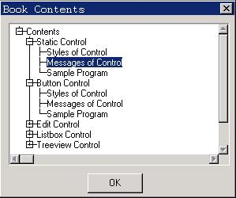

# Tree View Control

- [Styles of Tree View Control](#styles-of-tree-view-control)
- [Messages of Tree View Control](#messages-of-tree-view-control)
   + [Creating and Deleting Node Item](#creating-and-deleting-node-item)
   + [Setting/Getting Properties of Node Item](#settinggetting-properties-of-node-item)
   + [Selecting and Searching a Node Item](#selecting-and-searching-a-node-item)
   + [Comparing and Sorting](#comparing-and-sorting)
- [Notification Codes of Tree View Control](#notification-codes-of-tree-view-control)
- [Sample Program](#sample-program)


The tree view control displays a hierarchy items in a tree form, and each item
(sub item) can include one or more child items. Each item or sub item includes
the text title and an optional icon, and the user can unfold or fold the sub
items of this item by clicking it. The tree view control is fit to represent
objects having affiliation relationship, such as file and directory structure,
or organization of an institution.

Calling `CreateWindow` function with `CTRL_TREEVIEW` as the control class name
can create a tree view control.

After creating the tree view control, we can add, delete, set, get, or search
the nodes by sending corresponding messages.

## Styles of Tree View Control

The style of tree view control determines the appearance of the control. You
can specify the initial style when creating a control, and also can then use
`GetWindowStyle` to get the style and use `SetWindowStyle` to set a new style.

The tree view control with `TVS_WITHICON` style uses an icon to show the folded
and unfolded status of each item, and the corresponding icon can be specified
when creating the node item. If you do not specify a certain icon for a node
item, the tree view control will use `treefold` and `treeunfold` icons
specified in the configuration file `MiniGUI.cfg` of MiniGUI. MiniGUI uses a
`+` with a box around it to indicate a folded node item and uses `-` with a box
around it to indicate the unfolded node item in Tree view controls without
`TVS_WITHICON` style.

Tree view control with `TVS_SORT` style will automatically sort the items.

Tree view control with `TVS_NOTIFY` style will generate corresponding
notification messages when responding to the user’s operation.

__NOTE__ In MiniGUI 3.0, `TreeView` Control with `TVS_ICONFORSELECT` style is
removed, and there is no effect for `TreeView` control to use this style.

## Messages of Tree View Control
### Creating and Deleting Node Item

A tree view control is comprised of a root node and a series of child nodes.
When we use `CreateWindow` function to create a tree view control, we can pass
a pointer to `TVITEMINFO` structure by `dwAddData` argument of this function to
a tree view control to specify the properties of the root node. Please refer to
the sample program in Section 31.4 for concrete example. `TVITEMINFO` structure
includes the properties of the root node:

```cpp
typedef struct _TVITEMINFO
{
    /* The text title of this item */
    char *text;

    /* The state flags of this item */
    DWORD dwFlags;

    /* The handle of the folded icon */
    HICON hIconFold;
    /* The handle of the unfolded icon */
    HICON hIconUnfold;

    /* Additional data of this item */
    DWORD dwAddData;
} TVITEMINFO;
```

Here text is the title of the node, and if you do not specify the properties of
the rood node when creating a tree view control, the title of the root node
will be “root”.

`dwFlags` is the state flag of a node item. `TVIF_SELECTED` indicates that this
node is a selected item, and `TVIF_FOLD` indicates that this node item is
folded initially. When adding an item, only `TVIF_FOLD` flag is valid.

The handles `hIconFold` and `hIconUnfold` are the self-defining handles of icon
used when the node is folded and unfolded, respectively. They are meaningful
only when the tree view control has `TVS_WITHICON` style.

`TVM_ADDITEM` (`TVM_INSERTITEM`) message adds a node item to a tree view
control:

```cpp
TVITEMINFO tvItemInfo;
GHANDLE item;
item = SendMessage (hTrvWnd, TVM_ADDITEM, 0, (LPARAM) &tvItemInfo);
```

Item is the handle of the added node returned by `SendMessage` function and we
can use this handle to operate the node item.

`TVM_DELTREE` message deletes a node and its all-descendant items (including
the sub items of the item):

```cpp
SendMessage (hTrvWnd, TVM_DELTREE, (WPARAM)item, 0);
```

Here item is a handle with `GHANDLE` type, which should be the handle returned
by `SendMessage` function when using `TVM_ADDITEM` message to add this node
item.

### Setting/Getting Properties of Node Item

`TVM_GETITEMINFO` message is used to get the properties of a node item:

```cpp
TVITEMINFO tvii;
GHANDLE item;
SendMessage (hTrvWnd, TVM_GETITEMINFO, (WPARAM)item, (LPARAM)&tvii);
```

Here, item is the handle of the node item the information of which we want to
get, `tvii` structure is used to save the properties of the item. It should be
noted that, the buffer to which text points in `tvii` structure should be big
enough.

`TVM_SETITEMINFO` is used to set the properties of a node item:

```cpp
TVITEMINFO tvii;
GHANDLE item;
SendMessage (hTrvWnd, TVM_SETITEMINFO, (WPARAM)item, (LPARAM)&tvii);
```

Here, item is the handle of the node item to be set, and `tvii` structure
includes the information of the node item to be set.

`TVM_GETITEMTEXT` message gets the text title of a node item:

```cpp
char *buffer;
SendMessage (hTrvWnd, TVM_GETITEMTEXT, (WPARAM)item, (LPARAM)buffer);
```

The buffer should be big enough to save the text title of the node item.

The length of the text title of a node item can be gotten with
`TVM_GETITEMTEXTLEN` message:

```cpp
int len;
len = SendMessage (hTrvWnd, TVM_GETITEMTEXTLEN, (WPARAM)item, 0);
```

### Selecting and Searching a Node Item

`TVM_SETSELITEM` message is used to select a node item:

```cpp
GHANDLE item;
SendMessage (hTrvWnd, TVM_SETSELITEM, (WPARAM)item, 0);
```

Here, item is the handle of the node item to be selected.

`TVM_GETSELITEM` message gets the current selected node item:

```cpp
GHANDLE item;
item = SendMessage (hTrvWnd, TVM_GETSELITEM, 0, 0);
```

After `SendMessage` returns, item is the handle of the current selected node
item.

`TVM_GETROOT` message is used to get the root node of a tree view control:

```cpp
GHANDLE rootItem;
rootItem = SendMessage (hTrvWnd, TVM_GETROOT,  0, 0);
```

`TVM_GETRELATEDITEM` message is used to get the related node items of a certain
node item:

```cpp
GHANDLE item;
int related;
GHANDLE relItem;
relItem = SendMessage (hTrvWnd, TVM_GETRELATEDITEM,  related, (LPARAM)item);
```

Here item is the specified node, and related can be one of the following
values:
- `TVIR_PARENT`: To get the parent node of item
- `TVIR_FIRSTCHILD`: To get the first sub item of item
- `TVIR_NEXTSIBLING`: To get the next sibling node of item
- `TVIR_PREVSIBLING`: To get the previous sibling node of item

`SendMessage` function returns the handle of the node item related to item.

`TVM_SEARCHITEM` message is used to search a specified node item:

```cpp
GHANDLE itemRoot;
const char *text;
GHANDLE found;
found = SendMessage (hTrvWnd, TVM_SEARCHITEM, (WPARAM) itemRoot, (LPARAM) text);
```

Here, `itemRoot` specifies the searching range (a sub-tree with `itemRoot`
being the root), and the string pointed to by text is the searching content.
`SendMessage` function will return the handle of the found node item if
succeeds, and return zero if fails.

`TVM_FINDCHILD` message is used to find a specified child node item of a node
item.

```cpp
GHANDLE itemParent;
const char *text;
GHANDLE found;
found = SendMessage (hTrvWnd, TVM_FINDCHILD, (WPARAM) itemParent, (LPARAM) text);
```

The child nodes of the node item specified by `itemParent` are the searching
range, and the string pointed to by text is the searching content.
`SendMessage` function will return the handle of the found node item if
succeeds, and return zero for if fails.

The difference of `TVM_FINDCHILD` from `TVM_SEARCHITEM` is that `TVM_FINDCHILD`
only searches in the child nodes, while `TVM_SEARCHITEM` searches in the whole
sub-tree.

### Comparing and Sorting

The tree view control with `TVS_SORT` style automatically sorts the node items.
When the application uses `TVM_ADDITEM` message to add a node item, the item
are sorted according to adding sequence if the control has not `TVS_SORT`
style; and sorted according to string comparison if the control has `TVS_SORT`
style.

The string comparison function of the tree view control determines sorting
order of the strings. The initial string comparing function is `strncmp`, and the
application can set a new string comparing function of the tree view control by
sending `TVM_SETSTRCMPFUNC` message:

```cpp
SendMessage (hTrvWnd, TVM_SETSTRCMPFUNC, 0, (LPARAM)str_cmp);
```

Here, `str_cmp` is the pointer to a function of `STRCMP` type:

```cpp
typedef int (*STRCMP) (const char* s1, const char* s2, size_t n);
```

This string comparison function compares the first (at most) n characters of
the two strings `s1` and `s2`, and returns an integer less than, equal to, or
greater than zero according to comparison result.

## Notification Codes of Tree View Control

The tree view control will generate notification messages when responding to
the user’s operation such as clicking and some state changes, including:
- `TVN_SELCHANGE`: Current selected node item changed.
- `TVN_DBLCLK`: The user double clicked a node item.
- `TVN_SETFOCUS`: The tree view control gained the input focus.
- `TVN_KILLFOCUS`: The tree view control lost the input focus.
- `TVN_CLICKED`: The user clicked a node item.
- `TVN_ENTER`: The user pressed the `ENTER` key.
- `TVN_FOLDED`: A node item is folded.
- `TVN_UNFOLDED`: The node item is unfolded.

If the application needs to know the notification from a tree view control, it
needs to use `SetNotificationCallback` function to register a notification
callback function for the control.

## Sample Program

The program in List 1 illustrates the use of a tree view control. Please refer
to `treeview.c` of the demo program package of this guide for complete source
code.

__List 1__ Sample program of tree view control

```cpp
#define IDC_TREEVIEW  100

#define CHAPTER_NUM    5

/* Define the text used by the items of the tree view control */
static const char *chapter[] =
{
    "Static Control",
    "Button Control",
    "Edit Control",
    "Listbox Control",
    "Treeview Control",
};

/* Define the text used by the items of the tree view control */
static const char *section[] =
{
    "Styles of Control",
    "Messages of Control",
    "Sample Program"
};

static int BookProc(HWND hDlg, int message, WPARAM wParam, LPARAM lParam)
{
    switch (message) {
        case MSG_INITDIALOG:
        {
            TVITEMINFO tvItemInfo;
            int item;
            int i, j;

            /* Add items to the tree view control */
            for (i = 0; i < CHAPTER_NUM; i++) {
                 tvItemInfo.text = (char*)chapter[i];
                 item = SendMessage (GetDlgItem(hDlg, IDC_TREEVIEW), TVM_ADDITEM,
                                    0, (LPARAM)&tvItemInfo);
                 /* Add subitems to each item */
                 for (j = 0; j < 3; j++) {
                     tvItemInfo.text = (char*)section[j];
                     SendMessage (GetDlgItem(hDlg, IDC_TREEVIEW), TVM_ADDITEM,
                                    item, (LPARAM)&tvItemInfo);
                 }
            }
        }
        break;

        case MSG_CLOSE:
            EndDialog (hDlg, 0);
            return 0;
    }

    return DefaultDialogProc (hDlg, message, wParam, lParam);
}

static TVITEMINFO bookInfo =
{
    "Contents"
};

/* Dialog box template */
static DLGTEMPLATE DlgBook =
{
    WS_BORDER | WS_CAPTION,
    WS_EX_NONE,
    100, 100, 320, 240,
    "Book Contents",
    0, 0,
    1, NULL,
    0
};

/* The dialog box has only one control: tree view control */
static CTRLDATA CtrlBook[] =
{
    {
        CTRL_TREEVIEW,
        WS_BORDER | WS_CHILD | WS_VISIBLE |
                  WS_VSCROLL | WS_HSCROLL,
         10, 10, 280, 180,
        IDC_TREEVIEW,
        "treeview control",
        (DWORD)&bookInfo
    }
};
```



__Figure 1__ Tree view formed by book content

The `treeview.c` program uses a tree view control to display the book contents
structure. The program specifies `dwAddData` of the tree view control data
structure `CTRLDATA` to be `&bookInfo` when creating the dialog box with the
dialog box template. `BookInfo` is a structure of `TVITEMINFO` type, where the
title of the node is “MiniGUI Programming Guide”, so the title of the root node
of this tree view is "MiniGUI Programming Guide".

----

[&lt;&lt; Scroll View Control](MiniGUIProgGuidePart6Chapter12.md) |
[Table of Contents](README.md) |
[List View Control &gt;&gt;](MiniGUIProgGuidePart6Chapter14.md)

[Release Notes for MiniGUI 3.2]: /supplementary-docs/Release-Notes-for-MiniGUI-3.2.md
[Release Notes for MiniGUI 4.0]: /supplementary-docs/Release-Notes-for-MiniGUI-4.0.md
[Showing Text in Complex or Mixed Scripts]: /supplementary-docs/Showing-Text-in-Complex-or-Mixed-Scripts.md
[Supporting and Using Extra Input Messages]: /supplementary-docs/Supporting-and-Using-Extra-Input-Messages.md
[Using CommLCD NEWGAL Engine and Comm IAL Engine]: /supplementary-docs/Using-CommLCD-NEWGAL-Engine-and-Comm-IAL-Engine.md
[Using Enhanced Font Interfaces]: /supplementary-docs/Using-Enhanced-Font-Interfaces.md
[Using Images and Fonts on System without File System]: /supplementary-docs/Using-Images-and-Fonts-on-System-without-File-System.md
[Using SyncUpdateDC to Reduce Screen Flicker]: /supplementary-docs/Using-SyncUpdateDC-to-Reduce-Screen-Flicker.md
[Writing DRI Engine Driver for Your GPU]: /supplementary-docs/Writing-DRI-Engine-Driver-for-Your-GPU.md
[Writing MiniGUI Apps for 64-bit Platforms]: /supplementary-docs/Writing-MiniGUI-Apps-for-64-bit-Platforms.md

[Quick Start]: /user-manual/MiniGUIUserManualQuickStart.md
[Building MiniGUI]: /user-manual/MiniGUIUserManualBuildingMiniGUI.md
[Compile-time Configuration]: /user-manual/MiniGUIUserManualCompiletimeConfiguration.md
[Runtime Configuration]: /user-manual/MiniGUIUserManualRuntimeConfiguration.md
[Tools]: /user-manual/MiniGUIUserManualTools.md
[Feature List]: /user-manual/MiniGUIUserManualFeatureList.md

[MiniGUI Overview]: /MiniGUI-Overview.md
[MiniGUI User Manual]: /user-manual/README.md
[MiniGUI Programming Guide]: /programming-guide/README.md
[MiniGUI Porting Guide]: /porting-guide/README.md
[MiniGUI Supplementary Documents]: /supplementary-docs/README.md
[MiniGUI API Reference Manuals]: /api-reference/README.md

[MiniGUI Official Website]: http://www.minigui.com
[Beijing FMSoft Technologies Co., Ltd.]: https://www.fmsoft.cn
[FMSoft Technologies]: https://www.fmsoft.cn
[HarfBuzz]: https://www.freedesktop.org/wiki/Software/HarfBuzz/
