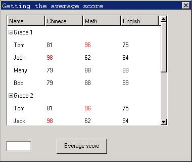

# List View Control

- [Styles of List View Control](#styles-of-list-view-control)
- [Messages of List View Control](#messages-of-list-view-control)
   + [Operations on Columns](#operations-on-columns)
   + [Operations on List Item](#operations-on-list-item)
   + [Selecting, Displaying, and Searching List Item](#selecting-displaying-and-searching-list-item)
   + [Comparing and Sorting](#comparing-and-sorting)
   + [Operation of Tree View Node](#operation-of-tree-view-node)
- [Handling of Key Messages](#handling-of-key-messages)
- [Notification Codes of List View Control](#notification-codes-of-list-view-control)
- [Sample Program](#sample-program)


The list view control displays a series of data items (list item) in a table
form, and the content of each list item may be comprised of one or more sub
items. The sub items with the same type of different list items are organized
in a column form. The header content of the list view control generally depicts
the meaning of the different sub items of the list item. In appearance, the
list view control is a rectangle including header and list items. The width of
each sub item in the list view control can be adjusted by dragging the header,
and the scrolling the control can show the content, which cannot be displayed
fully in the list.

For the data including multiple properties, the list view control is a
convenient and efficient tool for sorting and displaying such data. For
example, the list view control is usually used as a file browser, which can
display many file attributes including the file name, type, size, modified
date, and so on.

You can create a list view control by calling `CreateWindow` function with
`CTRL_LISTVIEW` as the control class name. The application usually sends
messages to a list view control to add, delete, sort, and operate the list
items. Similar to other controls, the list view control will generate
notification messages when responding to the user operations such as clicking.

## Styles of List View Control

In the default state, the window of a list view control only displays the
header and the list view items, and has no border around the displaying area.
You can add border to the list view control by using `WS_BORDER` when creating
the list view control with `CreateWindow` function. In addition, you can add
vertical and horizontal scrollbars using `WS_VSCROLL` and `WS_HSCROLL` style in
order to scroll the content of the list view control.

List view control with `LVS_TREEVIEW` style supports displaying list items in
tree view mode, in other words, list view control with this style combines the
function of normal list view control and tree view control.

`LVS_UPNOTIFY` style specifies the responding modes of a list view control when
responding to the user mouse click operation. In the default condition, if you
does not specify `LVS_UPNOTIFY` style, a list view control will send
notification messages when the mouse if pressed down; if this style is
specified, the control will send notification message when the mouse is
released.

## Messages of List View Control
### Operations on Columns

After a list view control has been created, the next step generally is adding
one or more columns successively to this control. Sending `LVM_ADDCOLUMN` to
the control can complete this:

```cpp
LVCOLUMN p;
SendMessage (hwndListView, LVM_ADDCOLUMN, 0, (LPARAM)&p) ;
```

Here, p is a `LVCOLUMN` structure, which includes the information related to
the newly added column in the list view control. Definition and meaning of each
field of `LVCOLUMN` are as follow:

```cpp
typedef struct _LVCOLUMN
{
    /* The position of the column to be added */
    int nCols;
    /* The width of the column */
    int width;
    /* The title of the column  */
    char *pszHeadText;
    /* The maximum length of the column title */
    int nTextMax;
    /* The image of the column header */
    DWORD image;
    /* The comparing function for sorting the columns  */
    PFNLVCOMPARE pfnCompare;
    /* The column flag */
    DWORD colFlags;
} LVCOLUMN;
typedef LVCOLUMN *PLVCOLUMN;
```

`LVCOLUMN` structure is used to create or operate on columns of a list view
control, and is used together with the messages `LVM_ADDCOLUMN`,
`LVM_GETCOLUMN`, `LVM_SETCOLUMN`, and `LVM_MODIFYHEAD`.

When used with `LVM_ADDCOLUMN` message, it is needed at least to give the value
of `pszHeadText` of `LVCOLUMN` structure, i.e. the column title, and the other
items can be set `NULL` or 0. At this time, the list view control will adopt
the default values for these fields.

The `nCols` item is an integer value to indicate which column the newly added
column is, and the column index is from 1. If `nCols` is 0 or exceeds the range
of the column index, the newly added column will be appended as the last column
of the list view control. Width is the width of the newly added column. If this
value is 0 or not specified, the width of the newly added column will adopt the
default value. `NTextMax` can be ignored when used for adding columns.

image is the handle of a bitmap or an icon. If this value is specified, the
specified image will be displayed on the header of the column. This item does
not work at present.

`PfnCompare` points to a `PFNLVCOMPARE` type function, and this function is the
comparing function attached to the newly added column. When the user clicks the
title of the column, the list view control will determine the order of each
list item according to the comparing function. If the column comparing function
is not specified, the list view control will adopt the default string comparing
function:

```cpp
typedef int (*PFNLVCOMPARE) (int nItem1, int nItem2, PLVSORTDATA sortData);
```

Here `nItem1` and `nItem2` are integers, and are the indices of the two
compared list items. `SortData` has no meaning at present and reserved for
future. The comparing function determines the comparing result according to the
indices of the two list items passed to it. The comparing basis is generally
related to the meaning of the column, and the meaning is defined by the
application. Other data besides the list item index may be needed for
comparison. One commonly used and feasible approach is that setting additional
data useful for the comparing function when adding list items, then getting
this additional data in the comparing function to handle.

`colFlags` is the column flag, and has the following alignment flags at
present: `LVCF_LEFTALIGN`, `LVCF_RIGHTALIGN`, and `LVCF_CENTERALIGN`, which
means left-aligned, right-aligned, and center-aligned of the column text,
respectively.

After a column has been added, you can also set or change the attributes of the
column by `LVM_SETCOLUMN` message:

```cpp
LVCOLUMN p;
SendMessage (hwndListView, LVM_SETCOLUMN, 0, (LPARAM)&p);
```

Here p is also a `LVCOLUMN` structure, and the meanings and requirements of
each item are the same as parameter p of `LVM_ADDCOLUMN` message.

`LVM_MODIFYHEAD` message is a simplification of `LVM_SETCOLUMN`, and can be
used to set the title of a list header:

```cpp
LVCOLUMN p;
SendMessage (hwndListView, LVM_MODIFYHEAD, 0, (LPARAM)&p) ;
```

Here p is also a `LVCOLUMN` structure, but only the values of `nCols` and
`pszHeadText` are needed to set.

`LVM_GETCOLUMN` message is used to get the column attributes of a list view
control:

```cpp
LVCOLUMN p;
int nCols;
SendMessage (hwndListView, LVM_GETCOLUMN, nCols, (LPARAM)&p) ;
```

Here `nCols` is the integer index of the column of which the information is to
be gotten, and p is a `LVCOLUMN` structure, used to store the gotten
attributes.

`LVM_GETCOLUMNWIDTH` message is used to get the width of a column:

```cpp
int width;
int nCols;
width = SendMessage (hwndListView, LVM_GETCOLUMNWIDTH, nCols, 0) ;
```

Here `nCols` is the integer index of the column of which the information is to
be gotten, and the return value of `SendMessage` function is the width of the
column, and is -1 if error occurred.

`LVM_GETCOLUMNCOUNT` is used to get the number of columns in a list view
control:

```cpp
int count;
count = SendMessage (hwndListView, LVM_GETCOLUMNCOUNT, 0, 0) ;
```

The return value of `SendMessage` function is the number of columns.

`LVM_DELCOLUMN` message is used to delete a column from a list view control:

```cpp
int nCols;
SendMessage (hwndListView, LVM_DELCOLUMN, nCols, 0) ;
```

Here `nCols` is the index of the column to be deleted.

`LVM_SETHEADHEIGHT` is used to set the height of the column header:

```cpp
int newHeight;
SendMessage (hwndListView, LVM_SETHEADHEIGHT, newHeight, 0) ;
```

Here `newHeight` is the new header height.

### Operations on List Item

A list view control is comprised of many list items aligned vertically. Columns
to multiple sub items divide each list item, and the list item can include
additional data defined by application. The application can add, change, set,
delete the list item, and get information of the list item by sending
corresponding messages.

After a list view control has been created using `CreateWindow` function, the
control has no items, and you need add list items to the list view control by
`LVM_ADDITEM` message:

```cpp
HLVITEM hItem;
HLVITEM hParent;
LVITEM lvItem;
hItem = SendMessage (hwndListView, LVM_ADDITEM, hParent, (LPARAM)&lvItem) ;
```

Here `hParent` specifies the parent node of newly added list item, if `hParent`
is 0, this means the node is added to the root node (the topmost layer). If the
control is normal list view control, 0 for `hParent` is ok.

`lvItem` is a `LVITEM` structure, and contains the related information of a
newly added list item in the list view control. Definition and meanings of
fields of `LVITEM` are as follow:

```cpp
typedef struct _LVITEM
{
    /**
     * The rows of the item
     */
    int nItem;
    /** Height of the item */
    int nItemHeight;
    /** Attached additional data of this item */
    DWORD itemData;

    /**
     * State flags of the item, can be OR'ed by the following values:
     *
     * - LVIF_FOLD\n
     *   The item is folded.
     *
     * When adding an item to the listview control, only LVIF_FOLD
     * flag is valid.
     */
    DWORD dwFlags;

} LVITEM;
```

Here `nItem` is the position value of the newly added list item. If this value
is 0 or exceeds the index range, the newly added item will be added in the last
of the list view. If `wParam` argument of `LVM_ADDITEM` message specifies the
parent node of the newly added node, `nItem` specifies the position of newly
added node in the parent node.

The return value of `LVM_ADDITEM` message is the handle of the newly added list
item, and the handle can be used in other messages to access the item.

The newly added item by `LVM_ADDITEM` has no content yet, and you need use
`LVM_FILLSUBITEM` or `LVM_SETSUBITEM` message to set the content of each sub
item of the list item.

`LVM_GETITEM` message is used to get the information of a list item:

```cpp
LVITEM lvItem;
HLVITEM hItem;
SendMessage (hwndListView, LVM_GETITEM, hItem, (LPARAM)&lvItem) ;
```

Here `hItem` is the handle of target list type; `lvItem` is a structure of
`LVITEM` type, and this structure is used to save the gotten list item
information. If `hItem` is 0, `nItem` of `lvItem` structure should be set as
the index value of list item to be gotten.

`LVM_GETITEMCOUNT` message is used to get the number of all the items in the
list view control:

```cpp
int count;
count = SendMessage (hwndListView, LVM_GETITEMCOUNT, 0, 0) ;
```

The return value of `SendMessage` function is the number of list items in the
list view control.

`LVM_GETITEMADDDATA` message is used to get the additional data of a list item:

```cpp
DWORD addData;
int nItem;
HLVITEM hItem;
addData = SendMessage (hwndListView, LVM_GETITEMADDDATA, nItem, hItem) ;
```

Here `hItem` is the handle of list item to be gotten, if `hItem` is zero,
`nItem` should be used to specify the index value of list item to be gotten.
`SendMessage` function returns the additional data of list item.

`LVM_SETITEMADDDATA` message sets the additional data of a list item:

```cpp
HLVITEM hItem;
DWORD addData;
SendMessage (hwndListView, LVM_GETITEMADDDATA, hItem, (LPARAM)addData) ;
```

Here `hItem` is the handle of list item to be set; `addData` is the additional
data, if set successfully, `SendMessage` returns `LV_OKAY`, else `LV_ERR`.

`LVM_SETITEMHEIGHT` message can be used to set the height of list items in a
list view control. If the height is not set, the height of list items in the
list view control will adopt the default value:

```cpp
HLVITEM hItem;
int newHeight;
SendMessage (hwndListView, LVM_SETITEMHEIGHT, hItem, newHeight) ;
```

Here `hItem` is the handle of the list item to be set; `newHeight` is the new
height value of the list item. Setting successfully, `SendMessage` function
will return `TRUE`; otherwise return `FALSE`.

`LVM_DELITEM` message is used to delete an item from the list view control, and
`LVM_DELALLITEM` message is used to delete all the list items:

```cpp
HLVITEM hItem;
int nItem;
SendMessage (hwndListView, LVM_DELITEM, nItem, hItem) ;
SendMessage (hwndListView, LVM_DELALLITEM, 0, 0) ;
```

Here `hItem` is the handle of list item to be deleted. It `hItem` is 0; `nItem`
should be used to specify the index value of the list item to be deleted.

Each list item contains one or multiple sub items, and the number of sub items
is the same as the number of columns in the list view control. A sub item
contains string and bitmap, and can use the messages `LVM_SETSUBITEM`,
`LVM_SETSUBITEMTEXT`, `LVM_SETSUBITEMCOLOR`, and `LVM_GETSUBITEMTEXT` to get
and set the sub item attributes.

`LVM_SETSUBITEM` (`LVM_FILLSUBITEM`) message is used to set the attributes of a
sub item:

```cpp
LVSUBITEM subItem;
HLVITEM hItem;
SendMessage (hwndListView, LVM_SETSUBITEM, hItem, (LPARAM)&subItem) ;
```

Here `hItem` is the handle of the list item to be set; sub item is a structure
of `LVSUBITEM` type, in which relevant information required for creating a sub
item is included:

```cpp
typedef struct _LVSUBITEM
{
    /* The flags of a subitem */
    DWORD flags;
    /* The vertical index of a subitem  */
    int nItem;
    /* The horizontal index of a subitem  */
    int subItem;
    /* The text content of a subitem */
    char *pszText;
    /* The text length of a subitem  */
    int nTextMax;
    /* The text color of a subitem  */
    int nTextColor;
    /* The image of a subitem */
    DWORD image;
} LVSUBITEM;
typedef LVSUBITEM *PLVSUBITEM;
```

Here, flags is the flag value of a sub item, can be `LVFLAG_BITMAP` or
`LVFLAG_ICON` at present. If a bitmap or an icon is to be displayed in the sub
item, the corresponding flag should be set, for example, flags |=
`LVFLAG_BITMAP`.

`NItem` and sub item are the vertical index and horizontal index of an item,
i.e. the positions of the row and the column, respectively. `PszText` is the
text content to be displayed in the sub item. `NTextMax` is the maximum length
of the text of the sub item, and can be ignored when used for `LVM_SETSUBITEM`
message. When `LVSUBITEM` structure is used to get information of a sub item,
`pszText` points to a buffer storing the text content, and `nTextMax` indicates
the size of the buffer.

`NTextColor` specifies the color of the text in a sub item, and we can also use
`LVM_SETSUBITEMCOLOR` to set the color of text in a sub item. Image specifies
the bitmap or icon to be displayed in a sub item, which works only when flags
item is set `LVFLAG_BITMAP` or `LVFLAG_ICON`.

`LVM_GETSUBITEMTEXT` and `LVM_SETSUBITEMTEXT` messages are used to get and set
the text content of a sub item, respectively; `LVM_GETSUBITEMLEN` message is
used to get the length of the string in a sub item:

```cpp
LVSUBITEM subItem;
HLVITEM hItem;
int len;

SendMessage (hwndListView, LVM_GETSUBITEMTEXT, hItem, (LPARAM)&subItem) ;
SendMessage (hwndListView, LVM_SETSUBITEMTEXT, hItem, (LPARAM)&subItem) ;
len = SendMessage (hwndListView, LVM_GETSUBITEMLEN, hItem, (LPARAM)&subItem) ;
```

### Selecting, Displaying, and Searching List Item

`LVM_SELECTITEM` message is used to select a list item, and the selected item
will be highlighted. It should be noted that, the selected item might not be
visible.

```cpp
int nItem;
HLVITEM hItem;

SendMessage (hwndListView, LVM_SELECTITEM, nItem, hItem) ;
```

Here `hItem` is the handle of list item to be selected; if `hItem` is 0,
`nItem` specifies the index value of list item to be selected.

`LVM_GETSELECTEDITEM` message is used to get the current selected list item:

```cpp
HLVITEM hItemSelected;
hItemSelected = SendMessage (hwndListView, LVM_GETSELECTEDITEM, 0, 0) ;
```

`SendMessage` function returns the handle of a list item in a list view control
currently selected. If no item is selected, 0 is returned.

`LVM_SHOWITEM` message makes a list item visible in the list view control.
Making a list item visible will not make it selected.

```cpp
HLVITEM hItem;
int nItem;
SendMessage (hwndListView, LVM_SHOWITEM, nItem, hItem) ;
```

Here `hItem` is the handle of the list item to be displayed; if `hItem` is 0,
`nItem` should be used to specify the index value of list item to be displayed.
If the item to be displayed is not visible or not totally visible, the item
will become the first or last visible item of visible area and is totally
visible after sending `LVM_SHOWITEM` message.

`LVM_CHOOSEITEM` is the combination of `LVM_SELECTIEM` and `LVM_SHOWITEM`. It
makes a list item be selected and visible:

```cpp
int nItem;
HHLVITEM hItem;
SendMessage (hwndListView, LVM_CHOOSEITEM, nItem, hItem) ;
```

Here `hItem` is the handle of the list item to be selected and displayed; if
`hItem` is 0, `nItem` should be used to specify the index value of the list
item to be selected and displayed.

`LVM_FINDITEM` message is used to search a certain list item in a list view
control. If successful for searching, `SendMessage` returns the handle of the
found list item.

```cpp
HLVITEM hFound;
HLVITEM hParent;
LVFINDINFO findInfo;
hFound = SendMessage (hwndListView, LVM_FINDITEM, hParent, (LPARAM)&findInfo) ;
```

Here `hParent` specifies the root node of target node tree to be searched for.
`FindInfo` is a `LVFINDINFO` structure, and contains the information needed for
searching:

```cpp
typedef struct _LVFINDINFO
{
    /* The searching flags */
    DWORD flags;
    /* The starting index for searching  */
    int iStart;
    /* pszInfo field includes how many columns */
    int nCols;
    /* The text contents of sevearal subitems to be found  */
    char **pszInfo;
    /* The additional data of a list item */
    DWORD addData;

    /** The found item's row, reserved */
    int nItem;
    /** The found subitem's column, reserved */
    int nSubitem;

} LVFINDINFO;
typedef LVFINDINFO *PLVFINDINFO;
```

The field flags is the search flag, and can be `LVFF_TEXT` and/or
`LVFF_ADDDATA`, which means to search according to sub item text and (or)
additional data of list item. If the root node `hParent` specified by `wParam`
argument of `LVM_FINDITEM` message is zero, `iStart` is the start index value
for searching, and if it is zero then search from the start.

The pointer `pszinfo` points to a multiple character strings to be searched for,
value of `nCols` means text content of the first `nCols` column sub item in
matching list item should be consistent to the character string in `pszInfo`.
If searching according to the additional data, `addData` field should include
the additional data to be searched for.

### Comparing and Sorting

After a list view control has added items with `LVM_ADDITEM` message, the items
are sorted according to their sequence and specified index during being added.
When the user clicks the header of a list view control, i.e. the column title,
the control will determine the orders of the list items according to the
comparing function associated with this column, and sort them. As mentioned
earlier, when you use `LVM_ADDCOLUMN` message to add a column, you can specify
the comparing function of the new column; after this, you can also set a new
comparing function by `LVM_SETCOLUMN` function.

We can also sort the list items by sending `LVM_SORTIEMS` message to the list
view control:

```cpp
SendMessage (hwndListView, LVM_SORTITEMS, 0, (LPARAM)pfnCompare) ;
```

Here `pfnCompare` points to a function with `PFNLVCOMPARE` type, and this
function is the comparing function to sort list items and should be defined by
application.

In addition, we can also make the list view control sort all the sub items
according to a certain column by sending `LVM_COLSORT` message:

```cpp
int nCol;
SendMessage (hwndListView, LVM_COLSORT, nCol, 0) ;
```

Here `nCol` is the index of the specified column, and the list view control
will compare and sort the sub items according to the comparing function
associated with the column.

When the comparing function is not specified, the list view control uses the
default string comparing function to sort. The initial string comparing
function is `strcasecmp`. We can set a user-defined string comparing function by
`LVM_SETSTRCMPFUNC` message:

```cpp
SendMessage (hwndListView, LVM_SETSTRCMPFUNC, 0, (LPARAM)pfnStrCmp) ;
```

Here `pfnStrCmp` is a pointer to the function with `STRCMP` type:

```cpp
typedef int (*STRCMP) (const char* s1, const char* s2, size_t n);
```

This string comparing function compares the first (at most) n characters of the
two compared strings `s1` and `s2`, and returns an integer less than, equal to, or
greater than 0 according to the comparing result.

### Operation of Tree View Node

We can perform some operations on the tree view node in a list view control
with `LVS_TREEVIEW` style, including getting the related node and/or
fold/unfold a node.

`LVM_GETRELATEDITEM` message is used to get the related tree view nodes of a
node, such as the parent node, the sibling nodes and its first child node etc:

```cpp
int related;
HLVITEM hItem;
HLVITEM hRelatedItem;
hRelatedItem = SendMessage (hwndListView, LVM_GETRELATEDITEM, related, hItem) ;
```

Here related specifies the relationship between the node and the target node,
including:
- `LVIR_PARENT`: Get the parent node.
- `LVIR_FIRSTCHILD`: Get the first child node.
- `LVIR_NEXTSIBLING`: Get the next sibling node.
- `LVIR_PREVSIBLING`: Get the previous sibling node.

`hItem` is the handle of target node. `LVM_GETRELATEDITEM` message returns the
handle to the gotten related node.

`LVM_FOLDITEM` message is used to fold or unfold a node item including child
nodes:

```cpp
HLVITEM hItem;
BOOL bFold;
SendMessage (hwndListView, LVM_FOLDITEM, bFold, hItem) ;
```

If `bFold` is `TRUE`, the node item is folded, else unfolded it. `hItem` is the
handle of the node.

## Handling of Key Messages

When the user clicks the up or down arrow key, the current selected list item
will change, moving forward or backward by one item, and the newly selected
item will change to be visible (if it is invisible originally). When the user
presses the `PageUp` or `PageDown` key, the list item will go to the next page,
and the range is the same as clicking the scrollbar to the next page, i.e. the
last item of the former page becomes the first item of the latter page. If the
`HOME` key is pressed down, the first list item will be selected and visible;
and if the `END` key is pressed down, the last item will be selected and
visible.

## Notification Codes of List View Control

The list view control will generate notification messages when responding to
the user operation such as clicking and some state changes, including:
- `LVN_ITEMRDOWN`: The right mouse button is pressed down on a list view item.
- `LVN_ITEMRUP`: The right mouse button is released on a list view item.
- `LVN_HEADRDOWN`: The right mouse button is pressed down on the list view
header.
- `LVN_HEADRUP`: The right mouse button is released up on the list view header.
- `LVN_KEYDOWN`: A key is pressed down.
- `LVN_ITEMDBCLK`: The user double clicked a list item.
- `LVN_ITEMCLK`: The user clicked a list item (reserved).
- `LVN_SELCHANGE`: The current selected item changed.
- `LVN_FOLDED`: The user clicks some list item by mouse to fold it.
- `LVN_UNFOLDED`: The user clicks some list item by mouse to unfold it.

When the right mouse button is pressed down on a list item, the item is
selected, and two notification codes `LVN_SELCHANGE` and `LVN_ITEMRDOWN` are
generated.

If the application need to know the notification codes generated by a list view
control, it is better to use `SetNotificationCallback` function to register a
notification callback function.

## Sample Program

The program in List 1 illustrates the use of a list view control. Please refer
to `listview.c` file of the demo program package of this guide for the complete
source code.

__List 1__ Sample program of list view control

```cpp
#define IDC_LISTVIEW    10
#define IDC_CTRL1       20
#define IDC_CTRL2       30


#define SUB_NUM      3

static char * caption [] =
{
    "Name", "Chinese", "Math", "English"
};

#define COL_NR       TABLESIZE(caption)

static char *classes [] =
{
   "Grade 1", "Grade 2", "Grade 3"
};

typedef struct _SCORE
{
    char *name;
    int scr[SUB_NUM];
} SCORE;

static SCORE scores[] =
{
    {"Tom", {81, 96, 75}},
    {"Jack", {98, 62, 84}},
    {"Merry", {79, 88, 89}},
    {"Bob", {79, 88, 89}},
};
#define SCORE_NUM    TABLESIZE(scores)

static GHANDLE add_class_item (HWND hlist, PLVITEM lvItem, GHANDLE classent)
{
    LVSUBITEM subdata;
    GHANDLE item = SendMessage (hlist, LVM_ADDITEM, classent, (LPARAM)lvItem);

    subdata.nItem = lvItem->nItem;
    subdata.subItem = 0;
    subdata.pszText = classes[lvItem->nItem];;
    subdata.nTextColor = 0;
    subdata.flags = 0;
    subdata.image = 0;
    SendMessage (hlist, LVM_SETSUBITEM, item, (LPARAM) & subdata);

    return item;
}

static GHANDLE add_score_item (HWND hlist, PLVITEM lvItem, GHANDLE classent)
{
    char buff[20];
    LVSUBITEM subdata;
    GHANDLE item = SendMessage (hlist, LVM_ADDITEM, classent, (LPARAM)lvItem);
    int i = lvItem->nItem;
    int j;

    subdata.flags = 0;
    subdata.image = 0;
    subdata.nItem = lvItem->nItem;

    for (j = 0; j < 4; j ++) {

    subdata.subItem = j;
    if (j == 0) {
        subdata.pszText = scores[i].name;
        subdata.nTextColor = 0;
    }
    else {
        sprintf (buff, "%d", scores[i].scr[j-1]);
        subdata.pszText = buff;
        if (scores[i].scr[j-1] > 90)
            subdata.nTextColor = PIXEL_red;
        else
            subdata.nTextColor = 0;
    }
    SendMessage (hlist, LVM_SETSUBITEM, item, (LPARAM) & subdata);

    }

    return item;
}

static int
ScoreProc (HWND hDlg, int message, WPARAM wParam, LPARAM lParam)
{
    HWND hListView;
    hListView = GetDlgItem (hDlg, IDC_LISTVIEW);

    switch (message)
    {

    case MSG_INITDIALOG:
    {
        int i, j;
        LVITEM item;
        LVCOLUMN lvcol;
        GHANDLE hitem;

        for (i = 0; i < COL_NR; i++) {
            lvcol.nCols = i;
            lvcol.pszHeadText = caption[i];
            lvcol.width = 120;
            lvcol.pfnCompare = NULL;
            lvcol.colFlags = 0;
            SendMessage (hListView, LVM_ADDCOLUMN, 0, (LPARAM) &lvcol);
        }

        item.nItemHeight = 25;

        SendMessage (hListView, MSG_FREEZECTRL, TRUE, 0);
        hitem = 0;
        for (i = 0; i < 3; i++) {
            item.nItem = i;
            hitem = add_class_item (hListView, &item, 0);

            for (j = 0; j < SCORE_NUM; j++) {
                item.nItem = j;
                add_score_item (hListView, &item, hitem);
            }

        }

        SendMessage (hListView, MSG_FREEZECTRL, FALSE, 0);
        break;
    }

    case MSG_COMMAND:
    {
        int id = LOWORD (wParam);
        int i, j;

        if (id == IDC_CTRL2) {
            float average = 0;
            char buff[20];
            for (i = 0; i < SCORE_NUM; i++) {
                for (j = 0; j < SUB_NUM; j++) {
                    average += scores[i].scr[j];
                }
            }
            average = average / (SCORE_NUM * SUB_NUM);

            sprintf (buff, "%4.1f", average);
            SendDlgItemMessage (hDlg, IDC_CTRL1, MSG_SETTEXT, 0, (LPARAM)buff);
        }
        break;
    }

    case MSG_CLOSE:
    {
        EndDialog (hDlg, 0);
        break;
    }

    }

    return DefaultDialogProc (hDlg, message, wParam, lParam);
}

static CTRLDATA CtrlScore[] =
{
    {
        "button",
        WS_CHILD | WS_VISIBLE | BS_PUSHBUTTON,
         80, 260, 80, 20,
        IDC_CTRL2,
        "Everage score",
        0
    },
    {
        "edit",
        WS_CHILD | WS_VISIBLE | WS_BORDER,
         10, 260, 50, 20,
        IDC_CTRL1,
        "",
        0
    },
    {
        "listview",
        WS_BORDER | WS_CHILD | WS_VISIBLE | WS_VSCROLL | WS_HSCROLL | LVS_TREEVIEW,
         10, 10, 320, 220,
        IDC_LISTVIEW,
        "score table",
        0
    },
};

static DLGTEMPLATE DlgScore =
{
    WS_BORDER | WS_CAPTION,
    WS_EX_NONE,
    0, 0, 480, 340,
    "Getting the average score",
    0, 0,
    0, NULL,
    0
};
```



__Figure 1__ Use of list view control


The listview.c program creates a list view control in dialog box for displaying
each class scores of students, and you can get the average of total classes of
students by clicking the button.

----

[&lt;&lt; Tree View Control](MiniGUIProgGuidePart6Chapter13.md) |
[Table of Contents](README.md) |
[Month Calendar Control &gt;&gt;](MiniGUIProgGuidePart6Chapter15.md)

[Release Notes for MiniGUI 3.2]: /supplementary-docs/Release-Notes-for-MiniGUI-3.2.md
[Release Notes for MiniGUI 4.0]: /supplementary-docs/Release-Notes-for-MiniGUI-4.0.md
[Showing Text in Complex or Mixed Scripts]: /supplementary-docs/Showing-Text-in-Complex-or-Mixed-Scripts.md
[Supporting and Using Extra Input Messages]: /supplementary-docs/Supporting-and-Using-Extra-Input-Messages.md
[Using CommLCD NEWGAL Engine and Comm IAL Engine]: /supplementary-docs/Using-CommLCD-NEWGAL-Engine-and-Comm-IAL-Engine.md
[Using Enhanced Font Interfaces]: /supplementary-docs/Using-Enhanced-Font-Interfaces.md
[Using Images and Fonts on System without File System]: /supplementary-docs/Using-Images-and-Fonts-on-System-without-File-System.md
[Using SyncUpdateDC to Reduce Screen Flicker]: /supplementary-docs/Using-SyncUpdateDC-to-Reduce-Screen-Flicker.md
[Writing DRI Engine Driver for Your GPU]: /supplementary-docs/Writing-DRI-Engine-Driver-for-Your-GPU.md
[Writing MiniGUI Apps for 64-bit Platforms]: /supplementary-docs/Writing-MiniGUI-Apps-for-64-bit-Platforms.md

[Quick Start]: /user-manual/MiniGUIUserManualQuickStart.md
[Building MiniGUI]: /user-manual/MiniGUIUserManualBuildingMiniGUI.md
[Compile-time Configuration]: /user-manual/MiniGUIUserManualCompiletimeConfiguration.md
[Runtime Configuration]: /user-manual/MiniGUIUserManualRuntimeConfiguration.md
[Tools]: /user-manual/MiniGUIUserManualTools.md
[Feature List]: /user-manual/MiniGUIUserManualFeatureList.md

[MiniGUI Overview]: /MiniGUI-Overview.md
[MiniGUI User Manual]: /user-manual/README.md
[MiniGUI Programming Guide]: /programming-guide/README.md
[MiniGUI Porting Guide]: /porting-guide/README.md
[MiniGUI Supplementary Documents]: /supplementary-docs/README.md
[MiniGUI API Reference Manuals]: /api-reference/README.md

[MiniGUI Official Website]: http://www.minigui.com
[Beijing FMSoft Technologies Co., Ltd.]: https://www.fmsoft.cn
[FMSoft Technologies]: https://www.fmsoft.cn
[HarfBuzz]: https://www.freedesktop.org/wiki/Software/HarfBuzz/
