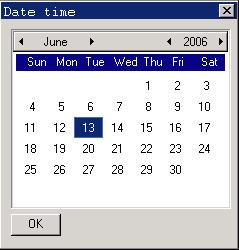

# Month Calendar Control

- [Styles of Month Calendar](#styles-of-month-calendar)
- [Messages of Month Calendar](#messages-of-month-calendar)
   + [Getting Date](#getting-date)
   + [Setting Date](#setting-date)
   + [Adjusting Colors](#adjusting-colors)
   + [Size of Control](#size-of-control)
- [Notification Codes of Month Calendar](#notification-codes-of-month-calendar)
- [Sample Program](#sample-program)


The month calendar control provides a user interface similar to a calendar, and
makes the user be able to select and set the date conveniently. The application
can get or set the date by sending message to a month calendar control.

You can create a month calendar control by calling `CreateWindow` function with
`CTRL_MONTHCALENDAR` as the control class name.

## Styles of Month Calendar

A month calendar control can use several forms of Chinese or English and so on
to display the date information such as week, month, etc. Specifying the
control style to be `MCS_CHN`, `MCS_ENG_L`, or `MCS_ENG_S` can complete this.
If a month calendar control has the style `MCS_CHN`, the control will display
the date information in Chinese; if having the style `MCS_ENG_L`, the control
will display the date information in English; and if having the style
`MCS_ENG_S`, the control displays the date information in abbreviate English.

If having the style `MCS_NOTIFY`, the month calendar control will generate
corresponding notification messages in cases such as responding to the user’s
operation.

## Messages of Month Calendar
### Getting Date

`MCM_GETCURDAY` message is used to get the day of the month of the current
selected date:

```cpp
int day;
day = SendMessage (hwndMonthcal, MCM_GETCURDAY, 0, 0) ;
```

The return value of `SendMessage` is the current day of the month, in the range
1 to 31.

`MCM_GETCURMONTH` message is used to get the number of months of the current
selected date:

```cpp
int month;
month = SendMessage (hwndMonthcal, MCM_GETCURMONTH, 0, 0) ;
```

The return value of `SendMessage` is the number of months since January, in the
range 0 to 11.

`MCM_GETCURYEAR` message is used to get the number of years of the current
selected date:

```cpp
int year;
year = SendMessage (hwndMonthcal, MCM_GETCURYEAR, 0, 0) ;
```
```cpp

The return value of SendMessage is the current number of years.

MCM_GETCURMONLEN message is used to get the length (how many days in a month) of the current month:

```
```cpp
int monthlen;
monthlen = SendMessage (hwndMonthcal, MCM_GETCURMONLEN, 0, 0) ;
```

The return value of `SendMessage` is the length of the current month.

`MCM_GETFIRSTWEEKDAY` message is used to determine which weekday is the first
day in the current month:

```cpp
int weekday;
weekday = SendMessage (hwndMonthcal, MCM_GETFIRSTWEEKDAY, 0, 0) ;
```

The return value of `SendMessage` is the weekday number of the first day in the
current month. The weekday number is the number of days since Sunday, in the
range 0 to 6.

`MCM_GETCURDATE` message gets the current selected date in a month calendar
control:

```cpp
SYSTEMTIME systime;
SendMessage (hwndMonthcal, MCM_GETCURDATE, 0, (LPARAM)&systime) ;
```

Here `systime` is a structure of `SYSTEMTIME` type, which stores the gotten date
information such as year, month, day, and week, etc. This structure is also
used for messages such as `MCM_GETTODAY` and so on. The definition of
`SYSTEMTIME` structure is as follows:

```cpp
typedef struct _SYSTEMTIME
{
    /* Year */
    int year;
    /* Month */
    int month;
    /* Date */
    int day;
    /* Day */
    int weekday;
} SYSTEMTIME;
typedef SYSTEMTIME *PSYSTEMTIME;
```

`MCM_GETTODAY` message gets the date of "today".

```cpp
SYSTEMTIME systime;
SendMessage (hwndMonthcal, MCM_GETTODAY, 0, (LPARAM)&systime) ;
```

Here `systime` is also a structure of `SYSTEMTIME` type.

### Setting Date

It should be noted that special user right (such as root) may needed to set the
date in Linux/UNIX system.

`MCM_SETCURDAY` message sets the current day, `MCM_SETCURMONTH` message sets
the current month, and `MCM_SETCURYEAR` sets the current year:

```cpp
int day;
int month;
int year;
SendMessage (hwndMonthcal, MCM_SETCURDAY, day, 0) ;
SendMessage (hwndMonthcal, MCM_SETCURMONTH, month, 0) ;
SendMessage (hwndMonthcal, MCM_SETCURYEAR, year, 0) ;
```

Here, day, month, and year specify the new day, month and year respectively,
and if these values exceed the rational values, the control will adopt the most
approached day, month, or year.

`MCM_SETCURDATE` message sets a specified date as the current selected data:

```cpp
SYSTEMTIME systime;
SendMessage (hwndMonthcal, MCM_SETCURDATE, 0, (LPARAM)&systime) ;
```

`MCM_SETTODAY` sets today as the current selected date:

```cpp
SendMessage (hwndMonthcal, MCM_SETTODAY, 0, 0) ;
```

### Adjusting Colors

An application can set or get the color of each element in a month calendar
control by `MCM_GETCOLOR` and `MCM_SETCOLOR` messages:

```cpp
MCCOLORINFO color;
SendMessage (hwndMonthcal, MCM_GETCOLOR, 0, (LPARAM)&color) ;
SendMessage (hwndMonthcal, MCM_SETCOLOR, 0, (LPARAM)&color) ;
```

Here color is a structure of `MCCOLORINFO`, and is used to store color
information:

```cpp
typedef struct _MCCOLORINFO
{
    /* background color of the title */
    int clr_titlebk;
    /* text color of the title */
    int clr_titletext;
    /* color of the arrows */
    int clr_arrow;
    /* background color of the highlighted arrows */
    int clr_arrowHibk;

    /* background color of the weekday */
    int clr_weekcaptbk;
    /* text color of the weekday */
    int clr_weekcapttext;

    /* backgroud color of the day */
    int clr_daybk;
    /* background color of the highlighted day */
    int clr_dayHibk;
    /* text color of the current day */
    int clr_daytext;
    /* text color of the other day */
    int clr_trailingtext;
    /* text color of the hilighted day */
    int clr_dayHitext;
} MCCOLORINFO;
```

### Size of Control

A month calendar has a minimum limit for the window to display content in it
normally. `MCM_GETMINREQRECTW` and `MCM_GETMINREQRECTH` messages are used to
get the minimum width and the minimum height respectively:

```cpp
int minw, minh;
minw = SendMessage (hwndMonthcal, MCM_GETMINREQRECTW, 0, 0) ;
minh = SendMessage (hwndMonthcal, MCM_GETMINREQRECTH, 0, 0) ;
```

The return values of `SendMessage` functions are the minimum width and height.

## Notification Codes of Month Calendar

When user clicked month calendar and the currently selected date is changed,
the control will generate `MCN_DATECHANGE` notification code.

## Sample Program

Program in List 1 illustrates the use of month calendar control. Please refer
to `monthcal.c` file of the demo program package of this guide for the complete
source code.

__List 1__ Sample Program of month calendar control

```cpp
#define IDC_MC                100
#define IDC_OK                200

/* Dialog box template: only two controls: month calendar control and “OK” button  */
static CTRLDATA CtrlTime[]=
{
        {
                "monthcalendar",
                WS_CHILD | WS_VISIBLE | MCS_NOTIFY | MCS_ENG_L,
                10, 10, 240, 180,
                IDC_MC,
                "",
                0
        },
        {
                "button",
                WS_CHILD | WS_VISIBLE | BS_PUSHBUTTON,
                260, 180, 50, 22,
                IDC_OK,
                "OK",
                0
        }
};

static DLGTEMPLATE DlgTime =
{
        WS_VISIBLE | WS_CAPTION | WS_BORDER,
        WS_EX_NONE,
        0, 0, 320, 240,
        "Date time",
        0, 0,
        2, CtrlTime,
        0
};

static int TimeWinProc(HWND hDlg, int message, WPARAM wParam, LPARAM lParam)
{
    switch (message) {
        case MSG_INITDIALOG:
        break;

        case MSG_COMMAND:
        {
            int id = LOWORD(wParam);
            if (id == IDC_OK) {
                char info[100];
                 SYSTEMTIME date;
                 /* Get the current date of month calendar */
                 SendMessage (GetDlgItem(hDlg, IDC_MC), MCM_GETCURDATE, 0, (LPARAM)&date);
                 sprintf (info, "You will meet Bush president on  %d.%d.%d",
                                  date.year, date.month, date.day);
                 MessageBox (hDlg, info, "Date", MB_OK);
                 EndDialog (hDlg, 0);
            }
        }
        break;

    case MSG_CLOSE:
        {
            EndDialog (hDlg, 0);
        }
        return 0;
    }

    return DefaultDialogProc (hDlg, message, wParam, lParam);
}
```



__Figure 1__ Use of month calendar

----

[&lt;&lt; List View Control](MiniGUIProgGuidePart6Chapter14.md) |
[Table of Contents](README.md) |
[Spin Box Control &gt;&gt;](MiniGUIProgGuidePart6Chapter16.md)

[Release Notes for MiniGUI 3.2]: /supplementary-docs/Release-Notes-for-MiniGUI-3.2.md
[Release Notes for MiniGUI 4.0]: /supplementary-docs/Release-Notes-for-MiniGUI-4.0.md
[Showing Text in Complex or Mixed Scripts]: /supplementary-docs/Showing-Text-in-Complex-or-Mixed-Scripts.md
[Supporting and Using Extra Input Messages]: /supplementary-docs/Supporting-and-Using-Extra-Input-Messages.md
[Using CommLCD NEWGAL Engine and Comm IAL Engine]: /supplementary-docs/Using-CommLCD-NEWGAL-Engine-and-Comm-IAL-Engine.md
[Using Enhanced Font Interfaces]: /supplementary-docs/Using-Enhanced-Font-Interfaces.md
[Using Images and Fonts on System without File System]: /supplementary-docs/Using-Images-and-Fonts-on-System-without-File-System.md
[Using SyncUpdateDC to Reduce Screen Flicker]: /supplementary-docs/Using-SyncUpdateDC-to-Reduce-Screen-Flicker.md
[Writing DRI Engine Driver for Your GPU]: /supplementary-docs/Writing-DRI-Engine-Driver-for-Your-GPU.md
[Writing MiniGUI Apps for 64-bit Platforms]: /supplementary-docs/Writing-MiniGUI-Apps-for-64-bit-Platforms.md

[Quick Start]: /user-manual/MiniGUIUserManualQuickStart.md
[Building MiniGUI]: /user-manual/MiniGUIUserManualBuildingMiniGUI.md
[Compile-time Configuration]: /user-manual/MiniGUIUserManualCompiletimeConfiguration.md
[Runtime Configuration]: /user-manual/MiniGUIUserManualRuntimeConfiguration.md
[Tools]: /user-manual/MiniGUIUserManualTools.md
[Feature List]: /user-manual/MiniGUIUserManualFeatureList.md

[MiniGUI Overview]: /MiniGUI-Overview.md
[MiniGUI User Manual]: /user-manual/README.md
[MiniGUI Programming Guide]: /programming-guide/README.md
[MiniGUI Porting Guide]: /porting-guide/README.md
[MiniGUI Supplementary Documents]: /supplementary-docs/README.md
[MiniGUI API Reference Manuals]: /api-reference/README.md

[MiniGUI Official Website]: http://www.minigui.com
[Beijing FMSoft Technologies Co., Ltd.]: https://www.fmsoft.cn
[FMSoft Technologies]: https://www.fmsoft.cn
[HarfBuzz]: https://www.freedesktop.org/wiki/Software/HarfBuzz/
