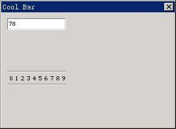

# Cool Bar Control

The cool bar control is a toolbar which can display a line of text or icon
buttons. The cool bar is very simple and is easy to use.

You can create a cool bar control by calling `CreateWindow` function with
`CTRL_COOLBAR` as the control class name.

## Styles of Cool Bar

The button items of cool bar with the styles `CBS_BMP_16X16` and
`CBS_BMP_32X32` will display bitmaps with size of `16x16` and `32x32` respectively.
The button items of a cool bar with `CBS_BMP_CUSTOM` style will use bitmaps
with customized size. For cool bar controls with this style, you should pass
the height and width of the bitmap to the control through `dwAddData` argument
when calling `CreateWindow` to create the control:

```cpp
CreateWindowEx (CTRL_COOLBAR, ..., MAKELONG (item_width, item_height)));
```

A cool bar with `CBS_USEBKBMP` style has a background bitmap, and you should
pass the path of the bitmap file to the control by `spCaption` argument of
`CreateWindow` function when creating the control.

```cpp
CreateWindowEx (CTRL_COOLBAR, “res/bk.bmp”, ...);
```

Cool bar cannot accept height when create it.

## Messages of Cool Bar

After a cool bar has been created, we can use `CBM_ADDITEM` message to add
items to the toolbar:

```cpp
COOLBARITEMINFO itemInfo;
SendMessage (hwndCoolBar, CBM_ADDITEM, 0, (LPARAM)&itemInfo) ;
```

Here `itemInfo` is a structure of `COOLBARITEMINFO` type:

```cpp
typedef struct _COOLBARITEMINFO
{
    /* Reserved */
    int insPos;
    /* The identifier of the button item */
    int id;
    /* The type of the button item */
    int ItemType;
    /* The bitmap object used by the button  */
    PBITMAP Bmp;
    /* The hint text of the button */
    const char *ItemHint;
    /* The caption of the  */
    const char *Caption;
    /* The additional data of the button item  */
    DWORD dwAddData;
} COOLBARITEMINFO;
```

Here id is the identifier of the item in a toolbar. When the user clicks the
item, the cool bar will generate notification messages, and the high word
(`HIWORD`) of `wParam` is the identifier value of the corresponding item, the
low word (`LOWORD`) of `wParam` is the identifier value of the tool Control.

`ItemType` specifies the type of the item, value of which can be one of
`TYPE_BARITEM`, `TYPE_BMPITEM`, and `TYPE_TEXTITEM`. Item of `TYPE_BARITEM` is
a vertical separator; item of `TYPE_BMPITEM` is a bitmap button; and item of
`TYPE_TEXTITEM` is a text button.

If the type of an item is `TYPE_BMPITEM`, `bmp` specifies the bitmap object used
by the item. `ItemHint` is the prompt text to be displayed when the mouse move
onto the item. If the style of an item is `TPYE_TEXTITEM`, Caption should point
to the text string displayed on the item.

`dwAddData` is the additional data of an item.

`CBM_ENABLE` message disables or enables an item:

```cpp
int id;
BOOL beEnabled;
SendMessage (hwndCoolBar, CBM_ENABLE, id, beEnabled) ;
```

Here id is the identifier value of the item to be set. If `beEnabled` is
`TRUE`, enable the item and `FALSE` disable the item.

## Sample Program

The program in List 1 illustrates the use of a cool bar control. Please refer
to `coolbar.c` file of the demo program package of this guide for the complete
source code.

__List 1__ Use of cool bar control

```cpp
#define ITEM_NUM    10

/* The text to be displayed on the coolbar  */
static const char* caption[] =
{
   "0", "1", "2", "3", "4", "5","6", "7", "8", "9"
};

/* Specify the hint text */
static const char* hint[] =
{
   "数字 0", "数字 1", "数字 2", "数字 3", "数字 4",
   "数字 5", "数字 6", "数字 7", "数字 8", "数字 9"
};

/* Create the coolbar, and add the tool items */
static void create_coolbar (HWND hWnd)
{
    HWND cb;
    COOLBARITEMINFO item;
    int i;

    cb = CreateWindow (CTRL_COOLBAR,
                    "",
                    WS_CHILD | WS_VISIBLE | WS_BORDER,
                    100,
                    10, 100, 100, 20,
                    hWnd,
                    0);

    item.ItemType = TYPE_TEXTITEM;
    item.Bmp = NULL;
    item.dwAddData = 0;
    for (i = 0; i < ITEM_NUM; i++) {
        item.insPos = i;
        item.id = i;
        item.Caption = caption[i];
        item.ItemHint = hint[i];
        SendMessage (cb, CBM_ADDITEM, 0, (LPARAM)&item);
    }
}

static int CoolbarWinProc(HWND hWnd, int message, WPARAM wParam, LPARAM lParam)
{
    static HWND ed;

    switch (message) {
    case MSG_CREATE:
    /* Create an edit box to feedback the user’s operation on the toolbar */
    ed = CreateWindow (CTRL_EDIT,
                    "",
                    WS_CHILD | WS_VISIBLE | WS_BORDER,
                    200,
                    10, 10, 100, 20,
                    hWnd,
                    0);

        create_coolbar (hWnd);
    break;

    case MSG_COMMAND:
        {
            int id = LOWORD (wParam);
            int code = HIWORD (wParam);

            if (id == 100) {
                static char buffer[100];
                char buf[2];

                /* Type appropriate character into the edit box according to
                 * the tool item clicked by the user
                 */
                sprintf (buf, "%d", code);
                SendMessage (ed, MSG_GETTEXT, 90, (LPARAM)buffer);
                strcat (buffer, buf);
                SendMessage (ed, MSG_SETTEXT, 0, (LPARAM)buffer);
            }
        }
        break;

    case MSG_DESTROY:
        DestroyAllControls (hWnd);
        return 0;

    case MSG_CLOSE:
        DestroyMainWindow (hWnd);
        PostQuitMessage (hWnd);
        return 0;
    }

    return DefaultMainWinProc(hWnd, message, wParam, lParam);
}

/* Following codes to create the main window are omitted */
```



__Figure 1__ Use of cool bar control

This program creates a tool bar comprised of “0-9” figures in a dialog box.
When the user clicks the item in the toolbar, the corresponding figure is typed
into the above edit box.

----

[&lt;&lt; Spin Box Control](MiniGUIProgGuidePart6Chapter16.md) |
[Table of Contents](README.md) |
[Animation Control &gt;&gt;](MiniGUIProgGuidePart6Chapter18.md)

[Release Notes for MiniGUI 3.2]: /supplementary-docs/Release-Notes-for-MiniGUI-3.2.md
[Release Notes for MiniGUI 4.0]: /supplementary-docs/Release-Notes-for-MiniGUI-4.0.md
[Showing Text in Complex or Mixed Scripts]: /supplementary-docs/Showing-Text-in-Complex-or-Mixed-Scripts.md
[Supporting and Using Extra Input Messages]: /supplementary-docs/Supporting-and-Using-Extra-Input-Messages.md
[Using CommLCD NEWGAL Engine and Comm IAL Engine]: /supplementary-docs/Using-CommLCD-NEWGAL-Engine-and-Comm-IAL-Engine.md
[Using Enhanced Font Interfaces]: /supplementary-docs/Using-Enhanced-Font-Interfaces.md
[Using Images and Fonts on System without File System]: /supplementary-docs/Using-Images-and-Fonts-on-System-without-File-System.md
[Using SyncUpdateDC to Reduce Screen Flicker]: /supplementary-docs/Using-SyncUpdateDC-to-Reduce-Screen-Flicker.md
[Writing DRI Engine Driver for Your GPU]: /supplementary-docs/Writing-DRI-Engine-Driver-for-Your-GPU.md
[Writing MiniGUI Apps for 64-bit Platforms]: /supplementary-docs/Writing-MiniGUI-Apps-for-64-bit-Platforms.md

[Quick Start]: /user-manual/MiniGUIUserManualQuickStart.md
[Building MiniGUI]: /user-manual/MiniGUIUserManualBuildingMiniGUI.md
[Compile-time Configuration]: /user-manual/MiniGUIUserManualCompiletimeConfiguration.md
[Runtime Configuration]: /user-manual/MiniGUIUserManualRuntimeConfiguration.md
[Tools]: /user-manual/MiniGUIUserManualTools.md
[Feature List]: /user-manual/MiniGUIUserManualFeatureList.md

[MiniGUI Overview]: /MiniGUI-Overview.md
[MiniGUI User Manual]: /user-manual/README.md
[MiniGUI Programming Guide]: /programming-guide/README.md
[MiniGUI Porting Guide]: /porting-guide/README.md
[MiniGUI Supplementary Documents]: /supplementary-docs/README.md
[MiniGUI API Reference Manuals]: /api-reference/README.md

[MiniGUI Official Website]: http://www.minigui.com
[Beijing FMSoft Technologies Co., Ltd.]: https://www.fmsoft.cn
[FMSoft Technologies]: https://www.fmsoft.cn
[HarfBuzz]: https://www.freedesktop.org/wiki/Software/HarfBuzz/
