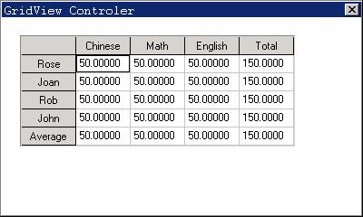

# Gridview Control

- [Styles of Gridview](#styles-of-gridview)
- [Messages of Gridview](#messages-of-gridview)
   + [Column Operations](#column-operations)
   + [Row Operations](#row-operations)
   + [Cell Operations](#cell-operations)
- [Other Messages](#other-messages)
- [Notification Codes of Gridview](#notification-codes-of-gridview)
- [Sample Program](#sample-program)


Gridview displays a series of data items (cells) in table form, and the
contents of every cell are independent each other. The contents of gridview
header, including a column of header and a row of header, usually express the
meanings of the column and the row. From the appearance, gridview is a
rectangle box including header cells. You can adjust the height of the row and
the width of the column in the gridview by dragging the header, and use the
scrollbar to display the content, which was out of the display window.

Gridview is a convenient and effective tool, which can arrange and display
the data item. It suits to deal with a great deal of datum with different
attribute, such as experiment data or account table.

You can call `CreateWindow` function and use the control name `CTRL_GRID` to
create a Gridview. Applications usually add, delete or operate the table
items by sending messages to the Gridview. Like other controls, Gridview
will not generate messages until it responds user clicking or other operations.

## Styles of Gridview

By default, Gridview window only displays header and cell, and there is no
border in the display region. When creating Gridview with `CreateWindow`
function, you can use window style `WS_BORDER` to add the border in it.
Otherwise, use window style `WS_VSCROLL` and `WS_HSCROLL` to add upright and
horizontal scroll bars. It is convenient for using mouse to display all
contents in the Gridview by scrolling the bar.

## Messages of Gridview

When creating Gridview, you can set a structure `GRIDVIEWDATA` and transfer
this structure as a parameter. The definition of this structure and the
meanings of every member are:

```cpp
typedef struct _GRIDVIEWDATA
{
    /** The number of the rows */
    int nr_rows;
    /** The number of the columns */
    int nr_cols;
    /** The default height of a row */
    int row_height;
    /** The default width of a column */
    int col_width;
} GRIDVIEWDATA;
```

### Column Operations

After creating the Gridview, user demands to add a column to the control,
which can be finished by application sending `GRIDM` `ADDCOLUMN` message to the
control.

```cpp
int index;
GRIDCELLDATA celldata;
GRIDCELLDATAHEADER cellheader;
SendMessage(hWndGrid, GRIDM_ADDCOLUMN, index, &celldata);
```

Here `celldata` is a `GRIDCELLDATA` structure, including the information about
the new added column. The `GRIDCELLDATA` structure definition and the meanings
of every member are:

```cpp
typedef struct _GRIDCELLDATA
{
    /** mask of properties, can be OR'ed with following values:
     * - GVITEM_STYLE\n
     * - GVITEM_FGCOLOR\n
     * - GVITEM_BGCOLOR\n
     * - GVITEM_FONT\n
     * - GVITEM_IMAGE\n
     * - GVITEM_ALLCONTENT\n
     * - GVITEM_MAINCONTENT\n
     * - GVITEM_ALLCONTENT\n
     */
    /** mask of properties, can be OR'ed with following values:
     * set or get a cell style
     * - GVITEM_STYLE\n
     * set or get a cell text color
     * - GVITEM_FGCOLOR\n
     * set or get a cell background color
     * - GVITEM_BGCOLOR\n
     * set or get a cell text font
     * - GVITEM_FONT\n
     * set or get a cell's image
     * - GVITEM_IMAGE\n
     * set or get all of the content of a cell
     * - GVITEM_ALLCONTENT\n
     * set or get the main content of a cell
     * - GVITEM_MAINCONTENT\n
     */
    DWORD mask;
    /** the style of the cell */
    DWORD style;
    /** text color */
    gal_pixel color_fg;
    /** the background color */
    gal_pixel color_bg;
    /** text font */
    PLOGFONT font;
    /** Pointer to the bitmap of one cell */
    PBITMAP image;
    /** the concrete data of one cell */
    void* content;
}GRIDCELLDATA;
```

The `content` field in the above structure points to the address of another structure
`GRIDCELLDATAHEADER`. The definition of this structure and the meanings of
every member are:

```cpp
typedef struct _GRIDCELLDATAHEADER
{
    /** the height of a row or the width of a column */
    int size;
    /** the caption of the row or column */
    char* buff;
    /** the length of the buff string */
    int len_buff;
}GRIDCELLDATAHEADER;
```

Before adding a new column, you should set the number size of the structure
`GRIDCELLDATAHEADE` and the number buff point to the caption of the column. The
number `len_buff` is the length of the caption. Adding a row is same as adding
a column. But the number size is the height of the new row.

`GRIDCELLDATA` structure is to set the attributes of the row, column and cell
in Gridview, which is used by many messages, such as `GRIDM_SETCELLPROPERTY`,
`GRIDM_GETCELLPROPERTY`, `GRIDM_ADDROW` and `GRIDM_ADDCOLUMN` etc.

The `style` field in the `GRIDCELLDATA` structure is the style of cell. Every times,
when you set, you should point out which type is among below options:
`GV_TYPE_HEADER`, `GV_TYPE_TEXT`, `GV_TYPE_NUMBER`, `GV_TYPE_SELECTION` and
`GV_TYPE_CHECKBOX`. It can be used with cell style, such as `GVS_READONLY` etc.

The `contentThe ` field also can point to other structures, which are
`GRIDCELLDATATEXT（text` cell）, `GRIDCELLDATANUMBER（data` cell）,
`GRIDCELLDATASELECTION（combo` boxes cell）, `GRIDCELLDATACHECKBOX(selection`
cell). The definition and the meaning of every member are:

```cpp
typedef struct _GRIDCELLDATATEXT
{
    /** the caption of the row or column */
    char* buff;
    /** the length of the buff string */
    int len_buff;
}GRIDCELLDATATEXT;

typedef struct _GRIDCELLDATANUMBER
{
    /** the value of the number type cell*/
    double number;
    /** the format of the number to display */
    char* format;
    /** the length of the format string */
    int len_format;
}GRIDCELLDATANUMBER;

typedef struct _GRIDCELLDATASELECTION
{
    /** the index of the combobox that current selected */
    int cur_index;
    /** the string that need to display, for example, "Yes\nNo\n"*/
    char* selections;
    /** display the length of string, for example, the length of above string is 7 */
    int len_sel;
}GRIDCELLDATASELECTION;

typedef struct _GRIDCELLDATACHECKBOX
{
    /** whether this checkbox is checked */
    BOOL checked;
    /** the text after checkbox */
    char* text;
    /** the length of all texts */
    int len_text;
}GRIDCELLDATACHECKBOX;
```

`GRIDM_SETCOLWIDTH` can be used to set the width of the control column:

```cpp
int index;
int width;
SendMessage (hwndGrid, GRIDM_SETCOLWIDTH, index, width) ;
```

Here index is the integral index value of the column needed to set, and width
is the width of the column.

`GRIDM_GETCOLWIDTH` can get the width of the control column:

```cpp
int width;
int index;
width = SendMessage (hwndGrid, GRIDM_GETCOLWIDTH, 0, index);
```

Here index is the integral index value of the column needed to get, and the
return value of the `SendMessage` function is the width of column. If error
occurs, returns –1.

`GRIDM_ADDCOLUMN` message is used to add a column.

```cpp
int index;
GRIDCELLDATA* celldata;
SendMessage (hwndGrid, GRIDM_ADDCOLUMN, index, celldata) ;
```

Here index is the integral index value of the column upon the added column, and
`celldata` is a pointer of `GRIDCELLDATA` structure, which is used to set initial
value for new column.

`GRIDM_DELCOLUMN` message is used to delete a column in Gridview.

```cpp
int index;
SendMessage (hwndGrid, GRIDM_DELCOLUMN, 0, index) ;
```

Here index is the index value of the deleted column.

`GRIDM_GETCOLCOUNT` message is used to get the number of columns in Gridview.

```cpp
int count;
count = SendMessage (hwndGrid, GRIDM_GETCOLCOUNT, 0, 0) ;
```

The return value of `SendMessage` function is the number of columns. This
message will return –1 on error.

### Row Operations

Row operations are same as column operations.

`GRIDM_SETROWHEIGHT` can be used to set the height of the row.

```cpp
int index;
int height;
SendMessage (hwndGrid, GRIDM_SETROWHEIGHT, index, height) ;
```

Here, index is the integral index value of the row needed to set, and height is
the set height.

`GRIDM_GETROWHEIGHT` can get the width of the row.

```cpp
int height;
int index;
height = SendMessage (hwndGrid, GRIDM_GETROWHEIGHT, 0, index);
```

Here, index is the integral index value of the row needed to get, and the
return value of the `SendMessage` function is the height of the row. The
message will return –1 on error.

`GRIDM_ADDROW` message is used to add a new row in Gridview.

```cpp
int index;
GRIDCELLDATA* celldata;
SendMessage (hwndGrid, GRIDM_ADDROW, index, celldata) ;
```

Here, index is the integral index value of row upon the added row; `celldata` is
a pointer of `GRIDCELLDATA` structure, which is used to set the initial value
of the new row.

`GRIDM_DELROW` message is used to delete a row in Gridview.

```cpp
int index;
SendMessage (hwndGrid, GRIDM_DELROW, 0, index) ;
```

Here index is the index value of the deleted row.

`GRIDM_GETROWCOUNT` is used to get the number of the rows in Gridview.

```cpp
int count;
count = SendMessage (hwndGrid, GRIDM_ GETROWCOUNT, 0, 0) ;
```

The return value of `SendMessage` function is the number of the rows.

### Cell Operations

`GRIDM_SETCELLPROPERTY` message is used to set one or many cell.

```cpp
GRIDCELLS* cells;
GRIDCELLDATA* celldata;
SendMessage (hwndGrid, GRIDM_SETCELLPROPERTY, cells, celldata) ;
```

Here, cells is a pointer of `GRIDCELLS` structure, which expresses the range of
the cell needed to set. The definition of the `GRIDCELLS` structure and the
meanings of every member are:

```cpp
typedef struct _GRIDCELLS
{
    /** the start row of the selected cell(s) */
    int row;
    /** the start column of the selected cell(s) */
    int column;
    /** the number of the column(s) which contain(s) selected cell(s) */
    int width;
    /** the number of the row(s) which contain(s) selected cell(s) */
    int height;
}GRIDCELLS;
```

If `SendMessage` function is ok, return `GRID_OKAY`; otherwise, return
`GRID_ERR`.

`GRIDM_GETCELLPROPERTY` message is used to obtain the attribute of cell.

```cpp
GRIDCELLS* cells;
GRIDCELLDATA* celldata;
SendMessage (hwndGrid, GRIDM_GETCELLPROPERTY, &cells, celldata) ;
```

Here, cells is an idiographic cell, which is not multi-cell. After the content
of certain cell is set successfully, the function `SendMessage` will return
`GRID_OKAY`. The structure `celldata` contains the information of the certain
cell. If error occurred, the message will return `GRID_ERR`.

Otherwise, there are some other messages for cells with different format, such
as `GRIDM_SETNUMFORMAT` message, which is used to set the data format of data
cell (`GRIDCELLDATANUMBER`).

```cpp
GRIDCELLS* cells;
char* format = “%3.2f”;
SendMessage (hwndGrid, GRIDM_SETNUMFORMAT, cells, format);
```

Here, cells is the cell to be set, and format is the data format to be set.

For all kinds of cells, `GRIDM_SETSELECTED` is used to set highlighted cell.

```cpp
GRIDCELLS* cells;
SendMessage (hwndGrid, GRIDM_SETSELECTED, 0, cells);
```

Here, cells is the cell to be set highlighted. If the cell is set highlighted
successfully, the function `SendMessage` will return `GRID_OKAY`, otherwise it
will return `GRID_ERR`.

`GRIDM_GETSELECTED` is used to get all highlighted cells.

```cpp
GRIDCELLS* cells;
SendMessage (hwndGrid, GRIDM_GETSELECTED, 0, cells);
```

With this option, the function `SendMessage` will return all the highlighted
cells.

## Other Messages

When user presses the up/down or left/right arrow key, the selected cell will
change, and the new selected option will turn visible (if it has been
invisible). When user presses the `PAGEUP/PAGEDOWN` key, the column cell will
turn to another page. The page change range is the same as the scrollbar; the
last item on first page will turn to second one’s first item. If `HOME` key is
pressed, the first cell in the column will be selected and become visible. If
`END` key is pressed, the last cell will be selected and become visible. When
all the above keys are pressed with `SHIFT` on the same time, the operation on
highlighted area will be carried out. When cell is double clicked or selected,
it will edit the content of the cell to input character.

The grid control is also able to associate some cells (source cells) with other
cells (target cells). Then the target cells will refresh themselves according
to the given operation function when the source cells’ data is changed. The
structure to carry out this operation is listed below:

```cpp
typedef struct _GRIDCELLDEPENDENCE
{
    /* source cells */
    GRIDCELLS source;
    /* target cells */
    GRIDCELLS target;
    /* data operation function */
    GRIDCELLEVALCALLBACK callback;
    /* additional infomation */
    DWORD dwAddData;
}GRIDCELLDEPENDENCE;

/* prototype of the data operation function */
typedef int (*GRIDCELLEVALCALLBACK)(GRIDCELLS* target, GRIDCELLS* source, DWORD dwAddData);
```

The message, `GRIDM_ADDDEPENDENCE`, is used to add an association of cells.(It
should be noted that source cell and target cell can not intersect and target
cell also can not intersect with other target cells of the control).

```cpp
GRIDCELLDEPENDENCE* dependece;
SendMessage (hwndGrid, GRIDM_ADDDEPENDENCE, 0, dependence);
```

If success, the message will return the index of the association; otherwise it
will return `GRID_ERR`.

The message `GRIDM_DELDEPENDENCE` is used to delete a cell association in the
Gridview.

```cpp
int dependence_id;
SendMessage (hwndGrid, GRIDM_DELDEPENDENCE, 0, dependence_id);
```

Here the `dependence_id` is the index of the associated cell to be deleted. The
message function will return `GRID_OKAY` when deletion is successful, otherwise
it will return `GRID_ERR`.

## Notification Codes of Gridview

The Gridview will generate notification code when it responds to user's
operation such as clicking or some status is changed. The notification codes
include:
- `GRIDN_HEADLDOWN`: the left button of the user's mouse is pressed on the
table head
- `GRIDN_HEADLUP`: the left button of the user’s mouse is released on the
table head
- `GRIDN_KEYDOWN`: key is pressed down
- `GRIDN_CELLDBCLK`: user double click one cell
- `GRIDN_CELLCLK`: user single click one cell
- `GRIDN_FOCUSCHANGED`: the focus cell is changed
- `GRIDN_CELLTEXTCHANGED`: the content of the cell is changed

When the left button of the user’s mouse is pressed on some cell, the cell will
be selected, and two notification codes `GRIDN_FOCUSCHANGED` and
`GRIDN_CELLCLK` will be generated.

If an application needs to know the notification code of the grid control, a
notification handle function should be registered using
`SetNotificationCallback` to handle all the received notification code.

## Sample Program

Code in List 1 illustrates the use of a Gridview control. Please refer to
grid.c file of the demo program package `mg-samples` of this guide for complete
source code.

__List 1__ Use of Gridview Control

```cpp
int ww = 800;
int wh = 600;

enum {
    IDC_GRIDVIEW,
};

static HWND hGVWnd;

static char* colnames[] = {"Chinese", "Math", "English", "Total"};
static char* scores[] = {"Rose", "Joan","Rob", "John", "Average"};

int total(GRIDCELLS* target, GRIDCELLS* source, DWORD dwAddData)
{
    int i, j;
    double value = 0;
    GRIDCELLDATA data;
    GRIDCELLS cells;
    GRIDCELLDATANUMBER num;
    memset(&data, 0, sizeof(data));
    memset(&num, 0, sizeof(num));
    data.mask = GVITEM_MAINCONTENT|GVITEM_STYLE;
    data.content = &num;
    data.style = GV_TYPE_NUMBER;
    cells.width = 1;
    cells.height = 1;
    for(i = 0; i<source->width; i++)
    {
        cells.column = source->column + i;
        for (j = 0; j<source->height; j++)
        {
            cells.row = source->row + j;
            SendMessage(hGVWnd, GRIDM_GETCELLPROPERTY, (WPARAM)&cells, (LPARAM)&data);
            value += num.number;
        }
    }
    num.number = value;
    num.len_format = -1;
    cells.row = target->row;
    cells.column = target->column;
    SendMessage(hGVWnd, GRIDM_SETCELLPROPERTY, (WPARAM)&cells, (LPARAM)&data);

    return 0;
}

int averge(GRIDCELLS* target, GRIDCELLS* source, DWORD dwAddData)
{
    int i, j;
    int count = 0;
    double value = 0;
    GRIDCELLDATA data;
    GRIDCELLS cells;
    GRIDCELLDATANUMBER num;
    memset(&data, 0, sizeof(data));
    memset(&num, 0, sizeof(num));
    data.content = &num;
    data.style = GV_TYPE_NUMBER;
    cells.width = 1;
    cells.height = 1;
    for(i = 0; i<source->width; i++)
    {
        cells.column = source->column + i;
        for (j = 0; j<source->height; j++)
        {
            data.content = &num;
            data.style = GV_TYPE_NUMBER;
            cells.row = source->row + j;
            SendMessage(hGVWnd, GRIDM_GETCELLPROPERTY, (WPARAM)&cells, (LPARAM)&data);
            value += num.number;
            count++;
        }
    }
    data.mask = GVITEM_MAINCONTENT;
    num.number = value/count;
    cells.row = target->row;
    cells.column = target->column;
    SendMessage(hGVWnd, GRIDM_SETCELLPROPERTY, (WPARAM)&cells, (LPARAM)&data);

    return 0;
    return 0;
}

static int
ControlTestWinProc (HWND hWnd, int message, WPARAM wParam, LPARAM lParam)
{
    switch (message)
    {
        case MSG_CREATE:
            {
                GRIDVIEWDATA gvdata;
                gvdata.nr_rows = 10;
                gvdata.nr_cols = 10;
                gvdata.row_height = 30;
                gvdata.col_width  = 60;
                hGVWnd = CreateWindowEx (CTRL_GRIDVIEW, "Grid View",
                                           WS_CHILD | WS_VISIBLE | WS_VSCROLL |
                                           WS_HSCROLL | WS_BORDER, WS_EX_NONE, IDC_GRIDVIEW, 20, 20, 600,
                                           300, hWnd, (DWORD)&gvdata);
                int i;
                GRIDCELLS cellsel;
                GRIDCELLDEPENDENCE dep;
                GRIDCELLDATA celldata;
                GRIDCELLDATAHEADER header;
                GRIDCELLDATANUMBER cellnum;
                memset(&header, 0, sizeof(header));
                memset(&celldata, 0, sizeof(celldata));
                /* set the attribute of the column header */
                for (i = 1; i<= 3; i++)
                {
                    header.buff = colnames[i-1];
                    header.len_buff = -1;
                    celldata.content = &header;
                    celldata.mask = GVITEM_MAINCONTENT;
                    celldata.style = GV_TYPE_HEADER;
                    cellsel.row = 0;
                    cellsel.column = i;
                    cellsel.width = 1;
                    cellsel.height = 1;
                    SendMessage(hGVWnd, GRIDM_SETCELLPROPERTY, (WPARAM)&cellsel, (LPARAM)&celldata);

                }

                /* set the attribute of the column header */
                memset(&header, 0, sizeof(header));
                memset(&celldata, 0, sizeof(celldata));
                for (i = 1; i<= 4; i++)
                {
                    header.buff =  scores[i-1];
                    celldata.content = &header;
                    celldata.mask = GVITEM_MAINCONTENT;
                    celldata.style = GV_TYPE_HEADER;
                    cellsel.row = i;
                    cellsel.column = 0;
                    cellsel.width = 1;
                    cellsel.height = 1;
                    SendMessage(hGVWnd, GRIDM_SETCELLPROPERTY, (WPARAM)&cellsel, (LPARAM)&celldata);

                }

                /* set the attribute of the cell */
                memset(&celldata, 0, sizeof(celldata));
                memset(&cellnum, 0, sizeof(cellnum));
                cellnum.number = 50;
                cellnum.format = NULL;
                celldata.content = &cellnum;
                celldata.mask = GVITEM_MAINCONTENT;
                celldata.style = GV_TYPE_NUMBER;
                cellsel.row = 1;
                cellsel.column = 1;
                cellsel.width = 3;
                cellsel.height = 4;
                SendMessage(hGVWnd, GRIDM_SETCELLPROPERTY, (WPARAM)&cellsel, (LPARAM)&celldata);

                /* operation to add one column */
                memset(&header, 0, sizeof(header));
                memset(&celldata, 0, sizeof(celldata));
                header.buff = "Total";
                header.size = -1;
                celldata.mask = GVITEM_MAINCONTENT;
                celldata.content = &header;
                celldata.style = GV_TYPE_HEADER;
                SendMessage(hGVWnd, GRIDM_ADDCOLUMN, 3, (LPARAM)&celldata);

                file://operation to add one row
                memset(&header, 0, sizeof(header));
                memset(&celldata, 0, sizeof(celldata));
                header.buff = "Average";
                header.size = -1;
                celldata.mask = GVITEM_MAINCONTENT;
                celldata.content = &header;
                celldata.style = GV_TYPE_HEADER;
                SendMessage(hGVWnd, GRIDM_ADDROW, 4, (LPARAM)&celldata);

                memset(&celldata, 0, sizeof(celldata));
                memset(&cellnum, 0, sizeof(cellnum));
                cellnum.number = 0;
                cellnum.format = NULL;
                celldata.content = &cellnum;
                celldata.mask = GVITEM_MAINCONTENT;
                celldata.style = GV_TYPE_NUMBER;
                cellsel.row = 1;
                cellsel.column = 4;
                cellsel.width = 1;
                cellsel.height = 4;
                SendMessage(hGVWnd, GRIDM_SETCELLPROPERTY, (WPARAM)&cellsel, (LPARAM)&celldata);

                cellsel.row = 5;
                cellsel.column = 1;
                cellsel.width = 4;
                cellsel.height = 1;
                SendMessage(hGVWnd, GRIDM_SETCELLPROPERTY, (WPARAM)&cellsel, (LPARAM)&celldata);


                // set the sum function for this cell.
                memset(&dep, 0, sizeof(dep));
                dep.callback = total;
                for (i = 1; i<= 4; i++)
                {
                    dep.source.row = i;
                    dep.source.column = 1;
                    dep.source.width = 3;
                    dep.source.height = 1;
                    dep.target.row = i;
                    dep.target.column = 4;
                    dep.target.width = 1;
                    dep.target.height = 1;
                    SendMessage(hGVWnd, GRIDM_ADDDEPENDENCE, 0, (LPARAM)&dep);
                }

                dep.callback = averge;
                // set average function for this cell.
                for (i = 1; i<= 4; i++)
                {
                    dep.source.row = 1;
                    dep.source.column = i;
                    dep.source.width = 1;
                    dep.source.height = 4;
                    dep.target.row = 5;
                    dep.target.column = i;
                    dep.target.width = 1;
                    dep.target.height = 1;
                    SendMessage(hGVWnd, GRIDM_ADDDEPENDENCE, 0, (LPARAM)&dep);
                }

                return 0;
            }
        case MSG_COMMAND:
            break;
        case MSG_CLOSE:
            DestroyMainWindow (hWnd);
            MainWindowCleanup (hWnd);
            return 0;

    }
    return DefaultMainWinProc (hWnd, message, wParam, lParam);
}
```



__Figure 1__ Use of a Gridview control

----

[&lt;&lt; Animation Control](MiniGUIProgGuidePart6Chapter18.md) |
[Table of Contents](README.md) |
[Iconview Control &gt;&gt;](MiniGUIProgGuidePart6Chapter20.md)

[Release Notes for MiniGUI 3.2]: /supplementary-docs/Release-Notes-for-MiniGUI-3.2.md
[Release Notes for MiniGUI 4.0]: /supplementary-docs/Release-Notes-for-MiniGUI-4.0.md
[Showing Text in Complex or Mixed Scripts]: /supplementary-docs/Showing-Text-in-Complex-or-Mixed-Scripts.md
[Supporting and Using Extra Input Messages]: /supplementary-docs/Supporting-and-Using-Extra-Input-Messages.md
[Using CommLCD NEWGAL Engine and Comm IAL Engine]: /supplementary-docs/Using-CommLCD-NEWGAL-Engine-and-Comm-IAL-Engine.md
[Using Enhanced Font Interfaces]: /supplementary-docs/Using-Enhanced-Font-Interfaces.md
[Using Images and Fonts on System without File System]: /supplementary-docs/Using-Images-and-Fonts-on-System-without-File-System.md
[Using SyncUpdateDC to Reduce Screen Flicker]: /supplementary-docs/Using-SyncUpdateDC-to-Reduce-Screen-Flicker.md
[Writing DRI Engine Driver for Your GPU]: /supplementary-docs/Writing-DRI-Engine-Driver-for-Your-GPU.md
[Writing MiniGUI Apps for 64-bit Platforms]: /supplementary-docs/Writing-MiniGUI-Apps-for-64-bit-Platforms.md

[Quick Start]: /user-manual/MiniGUIUserManualQuickStart.md
[Building MiniGUI]: /user-manual/MiniGUIUserManualBuildingMiniGUI.md
[Compile-time Configuration]: /user-manual/MiniGUIUserManualCompiletimeConfiguration.md
[Runtime Configuration]: /user-manual/MiniGUIUserManualRuntimeConfiguration.md
[Tools]: /user-manual/MiniGUIUserManualTools.md
[Feature List]: /user-manual/MiniGUIUserManualFeatureList.md

[MiniGUI Overview]: /MiniGUI-Overview.md
[MiniGUI User Manual]: /user-manual/README.md
[MiniGUI Programming Guide]: /programming-guide/README.md
[MiniGUI Porting Guide]: /porting-guide/README.md
[MiniGUI Supplementary Documents]: /supplementary-docs/README.md
[MiniGUI API Reference Manuals]: /api-reference/README.md

[MiniGUI Official Website]: http://www.minigui.com
[Beijing FMSoft Technologies Co., Ltd.]: https://www.fmsoft.cn
[FMSoft Technologies]: https://www.fmsoft.cn
[HarfBuzz]: https://www.freedesktop.org/wiki/Software/HarfBuzz/
