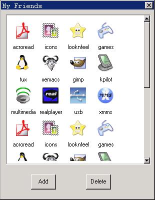

# `IconView` Control

`IconView` control offers an interface for user to surf entry in icon and label
mode. These entire icon items can be shown in a scroll child window. User can
select one or some items using keyboard and mouse operation and the selected
icon usually are shown high lightly. The representative usage of `IconView`
control is to be the container of the desktop icons and display of files under
some directory.

`CreateWindow` using `CTRL_ICONVIEW` as control class name can create Icon View
control. 

We can add, delete, set the size of icon (should be done before adding this
icon) and get label text of the icon, etc. by sending corresponding message
after creating `IconView` control.

## Styles of `IconView`

By default, the `IconView` control window will only display the icon and its
label and there will be no border in display region. You can add border for the
`IconView` control by using window style `WS_BORDER` when create control using
`CreatWindow.` On the other hand, you can also use window style `WS_VSCROLL` 
and `WS_HSCROLL` to add vertical and horizontal scroll bar so that you can
display all the content in the list control.

`IconView` control is based on the `ScrollView` Control and it remains the 
style of the `ScrollView` Control.

## Messages of `IconView`
### Icon operation

After an `IconView` control is created, the next step is to add icon to the
control. Sending an `IVM_ADDITEM` message to the control does this work.

```
```

In above program, ivii is an `IVITEMINFO` structure and it is used to display
the icon information needed to be set. The definition and meaning of the
`IVITEMINFO` structure are as below:

```
```

The index value of the icon shows this icon control’s position in the parent
window. It will return the handle of the icon control when success, otherwise
return 0.

The height and width of the icon can be specified by `IVM_SETITEMSIZE` before
adding an icon, and all the icons will be displayed in this height and width.

```
```

In above code, width is the width to be set and height is the height to be set.

Since the `IconView` control is based on the `ScrollView,` the rest messages of
the `IconView` control are almost the same as the `ScrollView.`
- `IVM_RESETCONTENT:` corresponding to `SVM_RESETCONTENT:` used to clear the
icon item in `IconView` control.
- `IVM_DELITEM:` corresponding to `SVM_DELITEM:` used to delete the icon item 
in `IconView` control.
- `IVM_SETITEMDRAW:` corresponding to `SVM_SETITEMDRAW:` used to set drawing
function of the icon item.
- `IVM_SETCONTWIDTH:` corresponding to `SVM_SETCONTWIDTH:` used to set the 
width of the scrollable window.
- `IVM_SETCONTHEIGHT:` corresponding to `SVM_SETCONTHEIGHT:` used to set the
height of the scrollable window.
- `IVM_SETITEMOPS:` corresponding to `SVM_` `SETITEMOPS:` used to set the
callback function of correlation operation of the icon item.
- `IVM_GETMARGINS:` corresponding to `SVM_GETMARGINS:` used to get the margin
range of the `IconView.`
- `IVM_SETMARGINS:` corresponding to `SVM_SETMARGINS:` used to set the margin
range of the `IconView.`
- `IVM_GETLEFTMARGIN`, `IVM_GETTOPMARGIN`, `IVM_GETRIGHTMARGIN` and
`IVM_GETBOTTOMMARGIN` corresponding to `SVM_GETLEFTMARGIN`, `SVM_GETTOPMARGIN`,
`SVM_GETRIGHTMARGIN`, and `SVM_GETBOTTOMMARGIN:` used to get the left, up,
right, down margin range of the `IconView` control
- `IVM_GETCONTWIDTH`, `IVM_GETCONTHEIGHT`, `IVM_GETVISIBLEWIDTH` and
`IVM_GETVISIBLEHEIGHT` corresponding to `SVM_GETCONTWIDTH`, 
`SVM_GETCONTHEIGHT`, `SVM_GETVISIBLEWIDTH` and `SVM_GETVISIBLEHEIGHT:` Used to
get the width and height of the content area and visual area.
- `IVM_SETCONTRANGE:` corresponding to `SVM_SETCONTRANGE:` used to set the 
range of the content area in the scrollable window.
- `IVM_GETCONTENTX` and `IVM_GETCONTENTY` corresponding to `SVM_GETCONTENTX` 
and `SVM_GETCONTENTY:` used to get the current position of the content area.
- `IVM_SETCONTPOS:` corresponding to `SVM_SETCONTPOS:` used to set the current
position of the content area, in other word, to move content area to a specific
position in the visual area.
- `IVM_GETCURSEL` and `IVM_SETCURSEL` corresponding to `SVM_GETCURSEL` and
`SVM_SETCURSEL:` used to get and set the current highlighted icon of the icon
control. 
- `IVM_SELECTITEM:` corresponding to `SVM_SELECTITEM:` used to select a column
item, and the selected item will be highlighted displayed.
- `IVM_SHOWITEM:` corresponding to `SVM_SHOWITEM:` used to show an icon item.
- `IVM_CHOOSEITEM:` corresponding to `SVM_CHOOSEITEM` is the combination of
`IVM_SELECTITEM` and `IVM_SHOWITEM` message: used to select an icon and
visualize it.
- `IVM_SETITEMINIT:` corresponding to `SVM_SETITEMINIT:` used to set the 
initial operation of the icon item.
- `IVM_SETITEMDESTROY:` corresponding to `SVM_SETITEMDESTROY:` used to set the
destroy operation of the icon item.
- `IVM_SETITEMCMP:` corresponding to `SVM_SETITEMCMP:` used to set the
comparison function of the iconview control item.
- `IVM_MAKEPOSVISIBLE:` corresponding to `SVM_MAKEPOSVISIBLE:` used to 
visualize one position in the content area.
- `IVM_GETHSCROLLVAL` and `IVM_GETVSCROLLVAL` corresponding to 
`SVM_GETHSCROLLVAL` and `SVM_GETVSCROLLVAL:` used to get the current horizontal
and vertical scroll data (the scroll range by clicking the scroll bar arrow).
- `IVM_GETHSCROLLPAGEVAL` and `IVM_GETVSCROLLPAGEVAL` corresponding to
`SVM_GETHSCROLLPAGEVAL` and `SVM_GETVSCROLLPAGEVAL:` used to get the current
horizontal and vertical scroll data (the scroll range of changing page).
- `IVM_SETSCROLLVAL:` corresponding to `SVM_SETSCROLLVAL:` used to set the
horizontal or vertical scroll data of the scroll window.
- `IVM_SETSCROLLPAGEVAL:` corresponding to `SVM_SETSCROLLPAGEVAL:` used to set
the horizontal or vertical scroll data of the scroll window.
- `IVM_SORTITEMS:` corresponding to `SVM_SORTITEMS:` used to sort the items of
the icon.
- `IVM_GETITEMCOUNT:` corresponding to `SVM_GETITEMCOUNT:` used to get the item
count of current icon control.
- `IVM_GETITEMADDDATA:` corresponding to `SVM_GETITEMADDDATA:` used to get the
additional data of current icon item.
- `IVM_SETITEMADDDATA:` corresponding to `SVM_SETITEMADDDATA:` used to set the
additional data of current icon item.
- `IVM_REFRESHITEM:` corresponding to `SVM_REFRESHITEM:` used to refresh a icon
item area.
- `IVM_GETFIRSTVISIBLEITEM:` corresponding to `SVM_GETFIRSTVISIBLEITEM:` used 
to get the first visible icon item.

## Notification Codes of `IconView`

The `IconView` control will generate notification code when it responds to
user’s operations such as clicking or some status changed. The notification
codes include:
- `LVN_SELCHANGE:` corresponding to `SVN_SELCHANGE:` current highlighted icon
item is changed.
- `LVN_CLICKED:` corresponding to `SVN_CLICKED:` user clicks the icon item.

A notification handle function should be registered by application using
`SetNotificationCallback` to handle all the received notification code.

`LVN_CLICKED` and `LVN_SELCHANGE` are used to inform the message handle 
function that the additional data is the clicked or highlighted icon handle.

## Sample Program

Code in List 1 illustrates the use of an `IconView` control to construct a
simple icon explore window. Please refer to iconview.c file of the demo program
package `mg-samples` of this guide for complete source code.


List 1 Use of `IconView` control

```
```




Figure 1 Use of an Icon View control


-- Main.XiaodongLi - 26 Oct 2009


----

[&lt;&lt; ](MiniGUIProgGuidePart.md) |
[Table of Contents](README.md) |
[ &gt;&gt;](MiniGUIProgGuidePart.md)

[Release Notes for MiniGUI 3.2]: /supplementary-docs/Release-Notes-for-MiniGUI-3.2.md
[Release Notes for MiniGUI 4.0]: /supplementary-docs/Release-Notes-for-MiniGUI-4.0.md
[Showing Text in Complex or Mixed Scripts]: /supplementary-docs/Showing-Text-in-Complex-or-Mixed-Scripts.md
[Supporting and Using Extra Input Messages]: /supplementary-docs/Supporting-and-Using-Extra-Input-Messages.md
[Using CommLCD NEWGAL Engine and Comm IAL Engine]: /supplementary-docs/Using-CommLCD-NEWGAL-Engine-and-Comm-IAL-Engine.md
[Using Enhanced Font Interfaces]: /supplementary-docs/Using-Enhanced-Font-Interfaces.md
[Using Images and Fonts on System without File System]: /supplementary-docs/Using-Images-and-Fonts-on-System-without-File-System.md
[Using SyncUpdateDC to Reduce Screen Flicker]: /supplementary-docs/Using-SyncUpdateDC-to-Reduce-Screen-Flicker.md
[Writing DRI Engine Driver for Your GPU]: /supplementary-docs/Writing-DRI-Engine-Driver-for-Your-GPU.md
[Writing MiniGUI Apps for 64-bit Platforms]: /supplementary-docs/Writing-MiniGUI-Apps-for-64-bit-Platforms.md

[Quick Start]: /user-manual/MiniGUIUserManualQuickStart.md
[Building MiniGUI]: /user-manual/MiniGUIUserManualBuildingMiniGUI.md
[Compile-time Configuration]: /user-manual/MiniGUIUserManualCompiletimeConfiguration.md
[Runtime Configuration]: /user-manual/MiniGUIUserManualRuntimeConfiguration.md
[Tools]: /user-manual/MiniGUIUserManualTools.md
[Feature List]: /user-manual/MiniGUIUserManualFeatureList.md

[MiniGUI Overview]: /MiniGUI-Overview.md
[MiniGUI User Manual]: /user-manual/README.md
[MiniGUI Programming Guide]: /programming-guide/README.md
[MiniGUI Porting Guide]: /porting-guide/README.md
[MiniGUI Supplementary Documents]: /supplementary-docs/README.md
[MiniGUI API Reference Manuals]: /api-reference/README.md

[MiniGUI Official Website]: http://www.minigui.com
[Beijing FMSoft Technologies Co., Ltd.]: https://www.fmsoft.cn
[FMSoft Technologies]: https://www.fmsoft.cn
[HarfBuzz]: https://www.freedesktop.org/wiki/Software/HarfBuzz/
