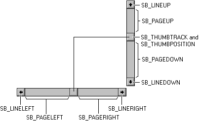
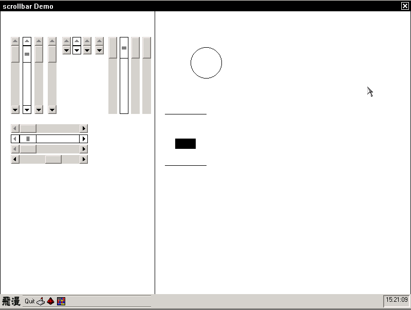

# Independent Scrollbar Control

## Definition of independent scrollbar
- Arrow, shaft and thumb are the components of scrollbar control. Some
scrollbars don't have arrow, and some don't have shaft and thumb, as shown in
Figure 1:<br />

Figure 1 Scrollbar structure


- Scrollbar is rectangular, it sends message to parent window when mouse clicks
on it, and parent window will refresh the content of window and the position of
thumb. It also sends message to parent window and do refresh when mouse clicks
on arrow.

## Types of Scrollbar
There are two kinds of scrollbar:
- A part of main window or other controls, application specifies the scrollbar
is horizontal or vertical by changing the style, `WS_HSCROLL` or `WS_VSCROLL`.
Main window or other controls can have both of these styles.
- Independent scrollbar, class name is `CTRL_SCROLLBAR`. Application specifies
the scrollbar is horizontal or vertical by selecting `SBS_HORZ` or `SBS_VERT`
when it is creating scrollbar control. It can only chose one of the styles.

The first one is not the topic of this chapter, but it is closely connected
independent scrollbar, so we mentioned it.

## Styles of Independent Scrollbar

Independent scrollbar has the following styles:

Table 1 The styles of independent scrollbar

| *Style Identifier* | *Meaning* |
| `SBS_HORZ` | Create a horizontal scrollbar. The range of scrollbar is decided by the arguments (x, y, w, h) of `CreateWindowEx2` when don't specify `SBS_BOTTOMALIGN` or `SBS_TOPALIGN`. |
| `SBS_VERT` | Create a vertical scrollbar. The range of scrollbar is decided by the arguments (x, y, w, h) of `CreateWindowEx2` when don't specify `SBS_LEFTALIGN` or `SBS_RIGHTALIGN`. |
| `SBS_BOTTOMALIGN` | Be used with `SBS_HORZ`. Put horizontal scrollbar on the bottom of the range which is specified by `CreateWindowEx2.` |
| `SBS_TOPALIGN` | Be used with `SBS_HORZ`. Put horizontal scrollbar on the top of the range which is specified by `CreateWindowEx2.` |
| `SBS_LEFTALIGN` | Be used with `SBS_VERT`. Put vertical scrollbar on the left of the range which is specified by `CreateWindowEx2.` |
| `SBS_RIGHTALIGN` | Be used with `SBS_VERT`. Put vertical scrollbar on the right of the range which is specified by `CreateWindowEx2.` |
| `SBS_NOARROWS` | No arrow, can't be used with `SBS_NOSHAFT` |
| `SBS_NOSHAFT` | No shaft, can't be used with `SBS_NOARROWS` |
| `SBS_FIXEDBARLEN` | Thumb of horizontal or vertical scrollbar is fixed length |
| `SBS_NOTNOTIFYPARENT` | Send message to parent window, not notification code. It sends notification code in default |


## Messages of Independent Scrollbar

Application can send following messages to scrollbar control:
- Get/set data information of scrollbar: `SBM_GETSCROLLINFO`, 
`SBM_SETSCROLLINFO` 
- Get /set current position of thumb: `SBM_GETPOS`, `SBM_SETPOS`
- Get/set scroll range: `SBM_GETRANGE`, `SBM_SETRANGE`
- Get/set scroll range and redraw immediately: `SBM_SETRANGEREDRAW`
- Enable/disable arrow: `SBM_ENABLE_ARROW`

### Get Scrollbar Information

Application can get scrollbar's information (max/min value, pages of scrollbar
and current position) by sending `SBM_GETSCROLLINFO` and `wParam` argument 
which is `SCROLLINFO` * pointer to scrollbar. The information is stored in the
memory pointed by `wParam.`

```
```
`fMask` in `SBM_GETSCROLLINFO` structure specifies the information which can be
got by sending `SBM_GETSCROLLINFO` message, `fMask's` value can be:

| *Information Identifier* | *Meaning* |
| `SIF_RANGE` | Get values range of scrollbar |
| `SIF_PAGE` | Get the pages of scrollbar |
| `SIF_POS` | Get scrollbar's current position |
| `SIF_ALL` | Get all information |


The following codes can get all information of scrollbar

```
```

### Set Information of Scrollbar

We can send `SBM_SETSCROLLINFO` to scrollbar control to set information of
scrollbar. `wParam` is a pointer of `SCROLLINFO` structure, it stores the
scrollbar information which needs to be stored. `IParam` is used to determine 
to (`TRUE`) or not to (`FALSE`) redraw immediately.

The following sample is setting scrollbar's information and not redrawing
immediately: 

```
```

### Get Current Position of Thumb

We can send `SBM_GETPOS` message to scrollbar to get current position of thumb.
Example is as follow:
```
```

### Set The Position of Thumb
We can send `SBM_SETPOS` message to scrollbar to set position of thumb. Target
position is stored in `wParam.` `IParam` is used to determine to (`TRUE`) or 
not to (`FALSE`) redraw immediately.

```
```

### Get Scroll Range of Scrollbar

We can send `SBM_GETRANGE` message to get the scroll range of scrollbar. 
`wParam` stores min range and `IParam` stores max range.

```
```

### Set Scroll Range of Scrollbar

We can send `SBM_SETRANGE` message to set the scroll range of scrollbar.
`wParam/IParam` is min/max range to set. This message will not redraw scrollbar
immediately. 

The following codes set the scroll range of scroll bar from 0 to 100. But you
can only see the change after other message or event redraws UI.

```
```

### Set Scroll Range of Scrollbar and Redraw Immediately

We can send `SBM_SETRANGEREDRAW` message if we want to redraw scrollbar
immediately after set the scroll range. `wParam/IParam` is min/max range to 
set. 

The following codes set the scroll range of scroll bar from 0 to 100 and redraw
immediately. 
```
```

### Enable or Disable Arrow

Sending `SBM_ENABLE_ARROW` message can enable or disable arrow. Disable means
the scrollbar can't scroll to the direction which is specified by disabled
arrow. Arrow is enabled (disabled) when `IParam` is `TRUE` (FALSE). `wParam's`
value is as follow:

| *Arrow Identifier* | *Meaning* |
| `SB_ARROW_LTUP` | Left arrow key of horizontal scrollbar or up arrow key of vertical scrollbar |
| `SB_ARROW_BTDN` | Right arrow key of horizontal scrollbar or down arrow key of vertical scrollbar |
| `SB_ARROW_BOTH` | All arrow keys |


The following codes disable all arrows of scrollbar:
```
```

## Configurable Properties of Scrollbar

The following properties of scrollbar can be set by `GetWindowElementAttr,`
`SetWindowElementAttr,` `GetWindowElementPixelEx` and `SetWindowElementPixelEx`
functions: 


Table 4 Notification codes table

| *Property Identifier* | *Meaning* |
| `WE_MAINC_THREED_BODY` | Draw the colors of shaft and thumb |
| `WE_FGC_THREED_BODY` | Draw the color of arrow |
| `WE_FGC_DISABLED_ITEM` | Draw the color of disabled arrow |
| `WE_METRICS_SCROLLBAR` | The size of scrollbar, that is, the height of horizontal scrollbar or the width of vertical scrollbar |


The following codes is an example for above properties:

```
```

## Notification Codes of Scrollbar

All notification codes of scrollbar are in the following table:


Table 5 Notification codes table

| *Notification Code Identifier* | *Meaning* |
| `SB_LINEUP` | Vertical scrollbar scrolls up one line |
| `SB_LINEDOWN` | Vertical scrollbar scrolls down one line |
| `SB_PAGEUP` | Vertical scrollbar scrolls up one page |
| `SB_PAGEDOWN` | Vertical scrollbar scrolls down one page |
| `SB_LINELEFT` | Horizontal scrollbar scrolls left one column |
| `SB_LINERIGHT` | Horizontal scrollbar scrolls right one column |
| `SB_PAGELEFT` | Horizontal scrollbar scrolls left one page |
| `SB_PAGERIGHT` | Horizontal scrollbar scrolls right one page |
| `SB_THUMBPOSITION` | Send the position of thumb to parent window by this notification code when mouse left button presses, drags and releases thumb |
| `SB_THUMBTRACK` | Keep sending the position of thumb to parent window by this notification code when mouse button is pressing and dragging the thumb |
| `SB_TOP` | Thumb arrives at left-most (top-most) of horizontal (vertical) scrollbar, that is, get the min value of scrollbar |
| `SB_BOTTOM` | Thumb arrives at right-most (bottom) of horizontal (vertical) scrollbar, that is, get the max value of scrollbar |


- After scrollbar specifies `SBS_NOTNOTIFYPARENT` style, parent window of
horizontal (vertical) scrollbar will receive `MSG_HSCROLL` (`MSG_VSCROLL`)
message. `wParam` is notification id, `IParam` is current position of thumb,
`curPos,` when id is `SB_THUMBPOSITION` or `SB_THUMBTRACK`. In other cases,
`IParam` doesn't have meaning.
- When scrollbar doesn't specify `SBS_NOTNOTIFYPARENT` style, parent window of
scrollbar will receive notification code. `wParam` includes control `ID` and
notification code. When notification code is `SB_THUMBPOSITION` or
`SB_THUMBTRACK`, parent window can get current position of thumb, `curPos,` by
sending `SBM_GETPOS`. Of course, the control doesn't send `MSG_COMMAND` to
parent window if you have invoked `SetNotificationCallback` function to set
callback function of scrollbar control, it invokes given callback function
directly. 

### Trigger of Notification Message
Scrollbar can receive events of mouse and keyboard and trigger different
notification message accroding to different situations.
- It triggers different notification message when mouse clicks different part 
of scrollbar. It is important to note, when dragging thumb by using mouse left
button, scrollbar keeps sending `SB_THUMBTRACK` message, and it sends
`SB_THUMBPOSITION` after mouse left button is released. The messages which are
triggered by the part of scrollbar are as follow:


Figure 2 notification messages which are triggered by mouse



- The key of keyboard triggers corresponding notification message, see the
following table:

Table 6 Notification Code table
| *Key* | *Notification Code* |
| `PAGEUP` | Horizontal scrollbar sends `SB_PAGELEFT;` Vertical scrollbar sends `SB_PAGEUP` |
| `PAGEDOWN` | Horizontal scrollbar sends `SB_PAGERIGHT` ；Vertical scrollbar sends `SB_PAGEDOWN` |
| `UpArrow` | Vertical scrollbar sends `SB_LINEUP` |
| `LeftArrow` | Horizontal scrollbar sends `SB_LINELEFT` |
| `DownArrow` | Vertical scrollbar sends `SB_LINEDOWN` |
| `RightArrow` | Horizontal scrollbar sends `SB_LINERIGHT` |


## Sample Program

The following codes show how to create scrollbar with multiple styles. By
operating mouse or keyboard, you can do many operations on scrollbar, for
example, clicking, draging and so on. To make the demo more vivid, we put a
circle and a box on right of the window. The circle will become larger or
smaller and the box will moved up or down, just follow scrollbar's control.
Figure 3 is the screenshot, the codes are from `scrollbar_ctrl.c` in 
mg-samples, please see this file for full codes.

List 1 Scrollbar sample codes
```
```


Figure 3 Scrollbar control




-- Main.XiaodongLi - 26 Oct 2009


----

[&lt;&lt; ](MiniGUIProgGuidePart.md) |
[Table of Contents](README.md) |
[ &gt;&gt;](MiniGUIProgGuidePart.md)

[Release Notes for MiniGUI 3.2]: /supplementary-docs/Release-Notes-for-MiniGUI-3.2.md
[Release Notes for MiniGUI 4.0]: /supplementary-docs/Release-Notes-for-MiniGUI-4.0.md
[Showing Text in Complex or Mixed Scripts]: /supplementary-docs/Showing-Text-in-Complex-or-Mixed-Scripts.md
[Supporting and Using Extra Input Messages]: /supplementary-docs/Supporting-and-Using-Extra-Input-Messages.md
[Using CommLCD NEWGAL Engine and Comm IAL Engine]: /supplementary-docs/Using-CommLCD-NEWGAL-Engine-and-Comm-IAL-Engine.md
[Using Enhanced Font Interfaces]: /supplementary-docs/Using-Enhanced-Font-Interfaces.md
[Using Images and Fonts on System without File System]: /supplementary-docs/Using-Images-and-Fonts-on-System-without-File-System.md
[Using SyncUpdateDC to Reduce Screen Flicker]: /supplementary-docs/Using-SyncUpdateDC-to-Reduce-Screen-Flicker.md
[Writing DRI Engine Driver for Your GPU]: /supplementary-docs/Writing-DRI-Engine-Driver-for-Your-GPU.md
[Writing MiniGUI Apps for 64-bit Platforms]: /supplementary-docs/Writing-MiniGUI-Apps-for-64-bit-Platforms.md

[Quick Start]: /user-manual/MiniGUIUserManualQuickStart.md
[Building MiniGUI]: /user-manual/MiniGUIUserManualBuildingMiniGUI.md
[Compile-time Configuration]: /user-manual/MiniGUIUserManualCompiletimeConfiguration.md
[Runtime Configuration]: /user-manual/MiniGUIUserManualRuntimeConfiguration.md
[Tools]: /user-manual/MiniGUIUserManualTools.md
[Feature List]: /user-manual/MiniGUIUserManualFeatureList.md

[MiniGUI Overview]: /MiniGUI-Overview.md
[MiniGUI User Manual]: /user-manual/README.md
[MiniGUI Programming Guide]: /programming-guide/README.md
[MiniGUI Porting Guide]: /porting-guide/README.md
[MiniGUI Supplementary Documents]: /supplementary-docs/README.md
[MiniGUI API Reference Manuals]: /api-reference/README.md

[MiniGUI Official Website]: http://www.minigui.com
[Beijing FMSoft Technologies Co., Ltd.]: https://www.fmsoft.cn
[FMSoft Technologies]: https://www.fmsoft.cn
[HarfBuzz]: https://www.freedesktop.org/wiki/Software/HarfBuzz/
