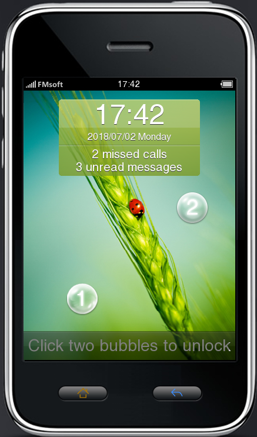
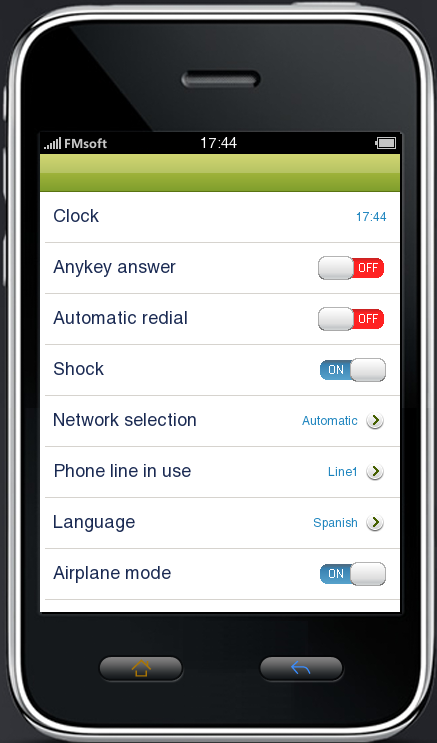
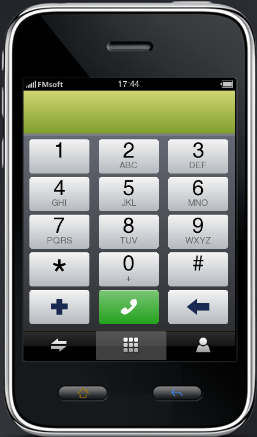
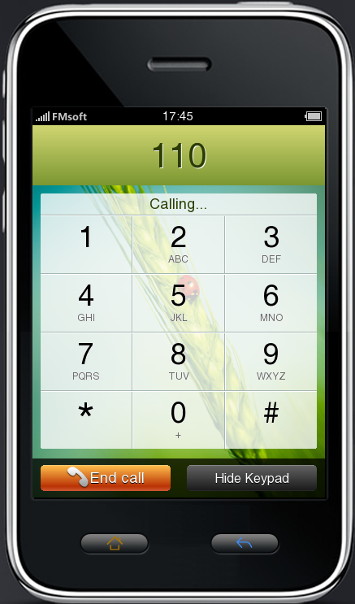
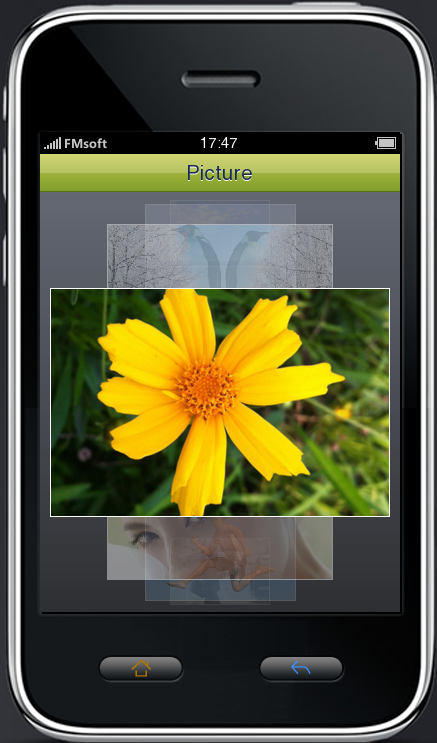

# Quick Start

- [Introduction](#introduction)
   * [Source Tarballs and Repos](#source-tarballs-and-repos)
   * [Documents](#documents)
- [First Run](#first-run)
   * [Recommended development environment](#recommended-development-environment)
   * [MiniGUI Releases](#minigui-releases)
   * [Building MiniGUI 4.0](#building-minigui-40)
   * [Building MiniGUI 3.2](#building-minigui-32)

## Introduction

MiniGUI, developed by [FMSoft Technologies],
originates from a famous free and open source software project,
which is initiated by Wei Yongming. MiniGUI aims to provide a fast,
stable and lightweight graphics user interface (GUI) support system
for real-time embedded systems and smart IoT devices. After over 20
years of development since the end of 1998, MiniGUI has become
a stable and reliable one for widespread application in a variety
of products and programs; it can run on Linux/uClinux, ThreadX,
RT-Thread, RTEMS, FreeRTOS, eCos, VxWorks, pSOS, ThreadX, Nucleus,
OSE, and even uC/OS-II.

MiniGUI defines a set of lightweight windowing and graphics interfaces
for applications. Using these interfaces, an application can create
multiple main windows and controls in them, such as buttons and edit
boxes. MiniGUI provides powerful graphics functions for developers,
helping to display all kinds of bitmaps and draw complicated graphics in
windows.

MiniGUI consists of MiniGUI Core and multiple MiniGUI components.

MiniGUI Core provides the basic windowing and graphics interfaces
as well as a lot of standard controls (toolkit). Besides MiniGUI Core,
FMSoft also releases some components for easy development of MiniGUI apps:

- `mGUtils` contains miscellaneous utilities
  like `ColorSelectionDialogBox`, `FileOpenDialogBox`, and so on.
- `mGPlus` provides support for 2D vector
  graphics functions like path, gradient, anti-aliased stretch,
  and color combination.
- `mGEff` provides an animation framework for
  MiniGUI app. It also provides some popular UI special effects.
- `mGNCS` provides a new control set for
  MiniGUI app.
- `mGNCS4Touch` provides some new controls, which are compliant to
  the control specification of mGNCS, for devices with touch screens.

There are also some legacy MiniGUI components. But we no longer maintain
these components since MiniGUI v3.2.0:

* mGi: An input method component for MiniGUI. This component provides
  some typical input methods (such as soft keyboard, hand-writing, and
  predict text input for mobile phone) for MiniGUI apps.
* mGp: A printing component for MiniGUI. By using mGp, you can print
  out the graphics created by MiniGUI app to general-purpose printers.
* mG3d: A simple three-dimension component for MiniGUI. This component
  provides a simple 3D API for app. You can use mG3d to create simple
  3D UI.

### Source Tarballs and Repos

The source code tarballs of MiniGUI and its components can be
downloaded from the download zone of [MiniGUI Official Website]:

<http://www.minigui.com/en/download>

FMSoft had created the public repositories for MiniGUI core and
components on GitHub. You can visit them on:

<https://github.com/VincentWei>

FMSoft also releases some open source apps for MiniGUI on the site above,
for examples:

* mDolphin, licensed under Apache 2.0, is a full-featured
  WEB/WAP browser, which is developed based on the open source browser
  core WebKit and uses MiniGUI as its underlying graphics support system.
* mGallery, licensed under Apache 2.0, intends to
  provide a total solution for PMP (Portable Multimedia Player),
  which uses MiniGUI as the graphics platform.
* mSpider, licensed under GPL 3.0, intends to provide a
  light-weight MiniGUI-based web browser (HTML 3.2 and part JavaScript)
* mEagle, licensed under GPL 3.0, is an embedded GIS development platform
  which addresses the needs of map browse, query, analysis, etc

You can find the public repositories of above apps on:

<https://github.com/FMSoftCN>

Besides MiniGUI, FMSoft also releases some tools and dependencies of MiniGUI,
such as the virtual buffer program GVFB, freetype, libjpeg, libpng, zlib,
and others. Please refer to:

<http://www.minigui.com/en/download>

### Documents

FMSoft now maintains the documents of MiniGUI on GitHub:

<https://github.com/VincentWei/minigui-docs>

All documents are classified into the following volumes:

- [MiniGUI User Manual]: The user manual describes how to configure,
build, and run MiniGUI.
- [MiniGUI Programming Guide]: This guide describes in
detail the foundation knowledge of MiniGUI on developing MiniGUI apps.
- [MiniGUI Porting Guide]: This guide describes how to port MiniGUI
to various RTOSes.
- [MiniGUI API Reference Manuals]: The online API reference manuals for
MiniGUI core and MiniGUI components.

We also maintain some supplementary documents on MiniGUI Wiki:

<https://github.com/VincentWei/minigui/wiki>

## First Run

### Recommended development environment

Now, Linux has become a software development host system that is
more important than Windows. Almost all building tool chains can
all on Linux, and you can use Linux to write and debug code for
cloud, Web, embedded devices, and many real time operating systems
such as eCos, RTEMS, RT-Thread.

Therefore, since MiniGUI version 3.2, we only maintain the building
scripts of MiniGUI for Linux. Of course, it is still possible to
build MiniGUI on Windows.

We recommend that your use Ubuntu Linux 16.04 LTS or 18.04 LTS.
The building scripts of MiniGUI are tested on these Linux distributions.

### MiniGUI Releases

Note that we are currently maintained three releases of MiniGUI:

- MiniGUI version 3.0.x. This release will not be updated. This release is
  there only for old projects.
- MiniGUI version 3.2.x. Main features since version 3.0:
   * Support for 64-bit platform.
- MiniGUI version 4.0.x. Main features since version 3.2:
   * New APIs for Unicode characters processing, which conform to Unicode 12.0.
   * New APIs to lay out, shape, and render glyphs from complex and mixed scripts,
     such as Arabic, Thai, and Indic.
   * Support for all types of input devices such as multi-touch panel (gesture),
     joystick, tablet tool, and switch.
   * Support for modern DRM-driven graphics cards on Linux kernel for 2D/3D
     hardware acceleration.

The compatibility of some APIs (mainly MiniGUI Core) will be broken between
different releases. For the detailed explanation, you can refer to the release
notes of MiniGUI core and components:

* [MiniGUI Core](https://github.com/VincentWei/minigui/blob/master/RELEASE-NOTES.md)
* [mGUtils](https://github.com/VincentWei/mgutils/blob/master/RELEASE-NOTES.md)
* [mGPlus](https://github.com/VincentWei/mgplus/blob/master/RELEASE-NOTES.md)
* [mGEff](https://github.com/VincentWei/mgeff/blob/master/RELEASE-NOTES.md)
* [mGNCS](https://github.com/VincentWei/mgncs/blob/master/RELEASE-NOTES.md)
* [mGNCS4Touch](https://github.com/VincentWei/mgncs4touch/blob/master/RELEASE-NOTES.md)

We strongly recommend that you use MiniGUI version 4.0.x for any new MiniGUI apps,
especially if the new features of MiniGUI 4.0.x are must for your new apps.

Since MiniGUI 3.2, we maintain some simple scripts to fast fetch the code and
build all dependencies for the comprehensive demonstration (mGUXDemo) of
MiniGUI core and components. So it is very easy to build MiniGUI on a
Ubuntu Linux distribution.

The following figures are some screenshots of mGUXDemo.

### Building MiniGUI 4.0

#### Prerequisites

First, make sure that you are using Ubuntu Linux 16.04 LTS or 18.04 LTS.

You should run `apt install <package_name>` to install the following packages
on your Ubuntu Linux.

- Building tools:
   * git
   * gcc/g++
   * binutils
   * autoconf/automake
   * libtool
   * make
   * cmake
   * pkg-config
- Dependent libraries:
   * libgtk2.0-dev
   * libjpeg-dev
   * libpng12-dev (libpng-dev on Ubuntu Linux 18.04 instead)
   * libfreetype6-dev
   * libinput-dev
   * libdrm-dev
   * libsqlite3-dev
   * libxml2-dev
   * libssl1.0-dev
   * electric-fence (used by mg-tests)

Note that if you are using Ubuntu Linux 18.04, please install
`libpng-dev`. Ubuntu 18.04 does not provide support for `libpng12-dev`.

#### Steps

Please make sure that you can visit GitHub and you can do `sudo` on your Linux box.

1. Copy `config.sh` to `myconfig.sh` and edit `myconfig.sh` to match your needs:

        $ cp config.sh myconfig.sh

1. Run `fetch-all.sh` to fetch all source from GitHub:

        $ ./fetch-all.sh

1. Run `build-deps.sh` to build and install gvfb, chipmunk, and harfbuzz:

        $ ./build-deps.sh

1. Run `build-all.sh` to build all:

        $ ./build-all.sh

1. Run `mguxdemo`:

        $ cd /usr/local/bin
        $ ./mguxdemo

When there were some updates in the remote repos, you can run `update-all.sh` to
update them. You can run `clean-build-all.sh` to uninstall, clean,
and re-install them.

Note that you might need to run `ldconfig` to refresh the shared libraries cache
when running `mguxdemo`.

#### Commands to build dependencies

The following steps are those ones in `build-deps.sh`. We list them here for
your information:

1. Make and install `gvfb`:

        $ cd gvfb
        $ cmake .
        $ make; sudo make install
        $ cd ..

1. Make and install `chipmunk` library (DO NOT use the chipmunk-dev package
   which is provided by Ubuntu):

        $ cd 3rd-party/chipmunk
        $ cmake .
        $ make; sudo make install
        $ cd ../..

1. Make and install `harfbuzz` library (DO NOT use the harfbuzz-dev package
   which is provided by Ubuntu):

        $ cd 3rd-party/harfbuzz
        $ ./autogen.sh
        $ ./config-extern.sh
        $ make; sudo make install
        $ cd ../..

### Building MiniGUI 3.2

#### Prerequisites

First, make sure that you are using Ubuntu Linux 16.04 LTS.

You can run `apt install <package_name>` to install the software on Ubuntu Linux.

* Building tools:
  * git
  * gcc/g++
  * binutils
  * autoconf/automake
  * libtool
  * make
  * cmake
  * pkg-config
* Dependent libraries:
  * libgtk2.0-dev
  * libjpeg-dev
  * libpng12-dev
  * libfreetype6-dev
  * libsqlite3-dev
  * libxml2-dev
  * libssl-dev

#### Steps

Please make sure that you can visit GitHub via SSH and you can do `sudo` on your Linux box.

1. Run `fetch-all.sh` to fetch all source from GitHub:

        $ ./fetch-all.sh

2. Make and install `gvfb`:

        $ cd gvfb
        $ cmake .
        $ make; sudo make install
        $ cd ..

3. Make and install `chipmunk` library (DO NOT use the chipmunk-dev package
   which is provided by Ubuntu):

        $ cd 3rd-party/chipmunk-5.3.1
        $ cmake .
        $ make; sudo make install
        $ cd ../..

4. Install MiniGUI resources:

        $ cd minigui-res
        $ ./augen.sh
        $ ./configure
        $ sudo make install
        $ cd ..

5. Run `build-all.sh` to build all:

        $ ./build-all.sh

6. Run `mguxdemo`:

        $ cd /usr/local/bin
        $ ./mguxdemo

When there were some updates in the remote repos, you can run `update-all.sh` to
update them. You can run `clean-build-all.sh` to uninstall, clean,
and re-install them.

Note that you might need to run `ldconfig` to refresh the shared libraries cache
before running `mguxdemo`.

---

[Table of Contents](README.md)  
[Next Chapter](MiniGUIUserManualChapter2.md)

[Beijing FMSoft Technologies Co., Ltd.]: https://www.fmsoft.cn
[FMSoft Technologies]: https://www.fmsoft.cn
[MiniGUI Official Website]: http://www.minigui.com
[MiniGUI User Manual]: /user-manual/README.md
[MiniGUI Programming Guide]: /programming-guide/README.md
[MiniGUI Porting Guide]: /porting-guide/README.md
[MiniGUI API Reference Manuals]: /api-reference/README.md
